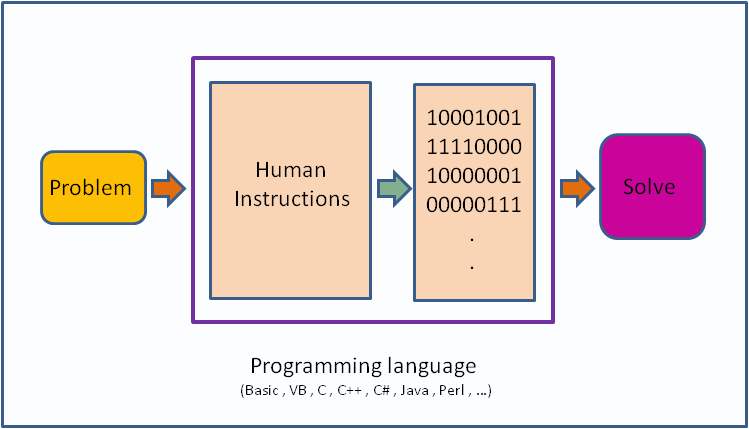
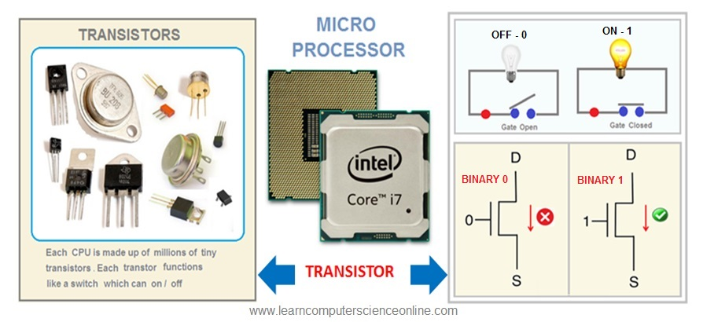
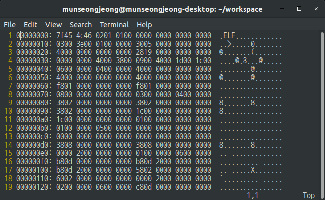
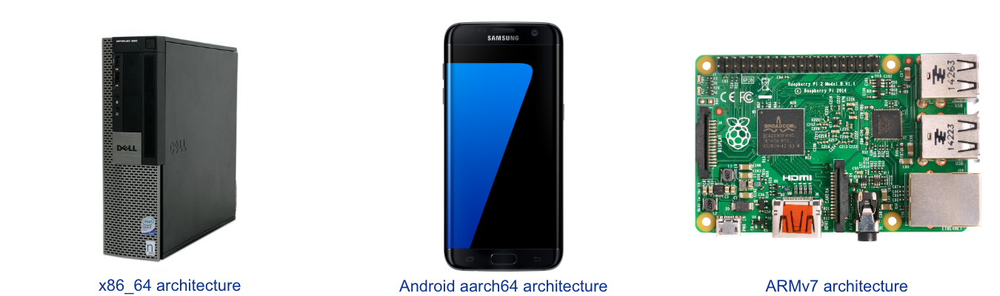
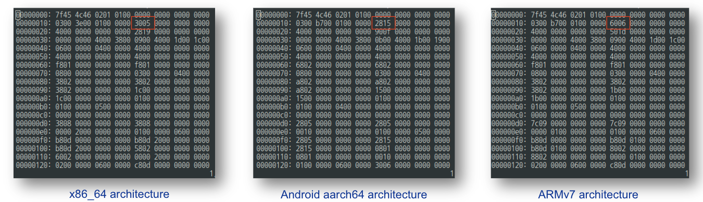
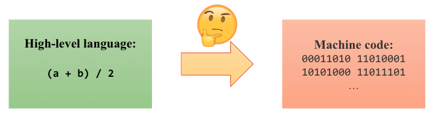
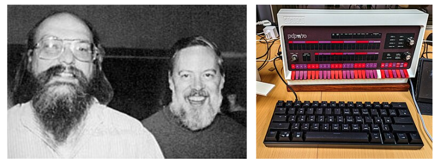
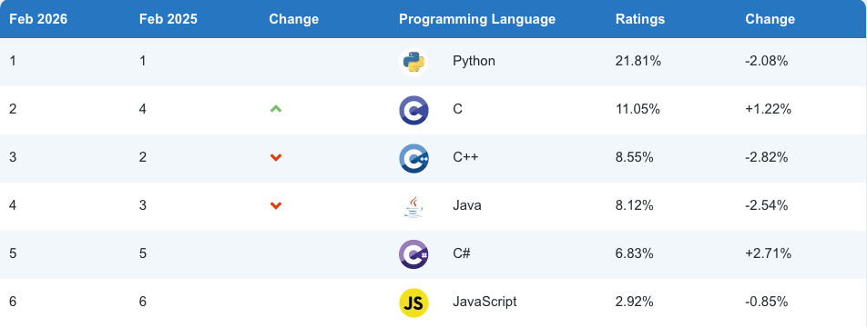
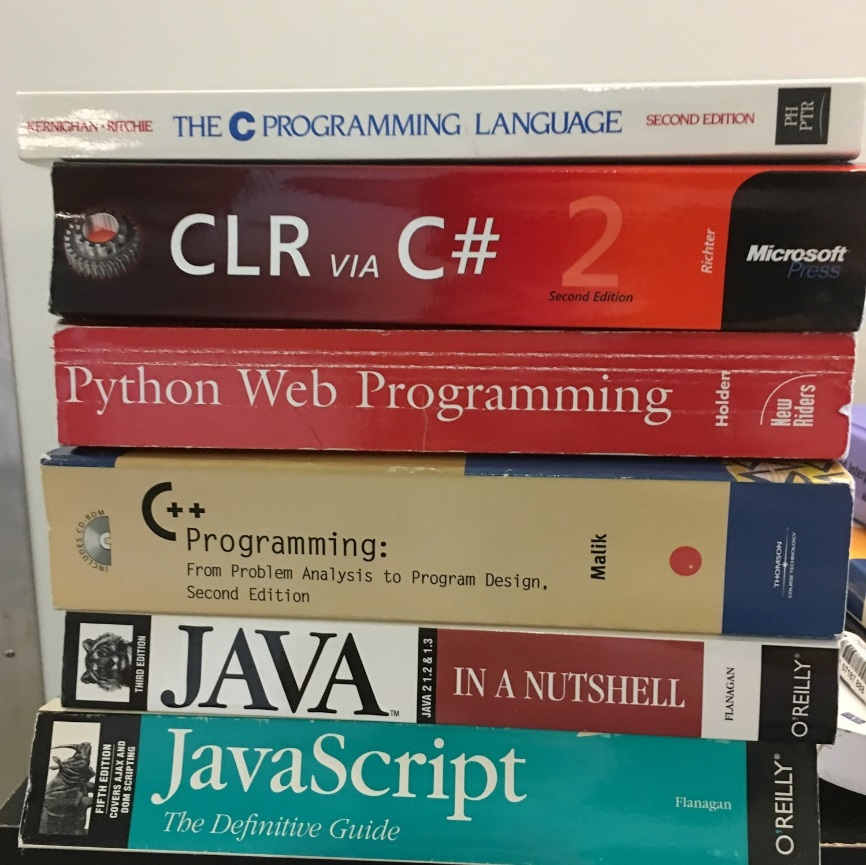
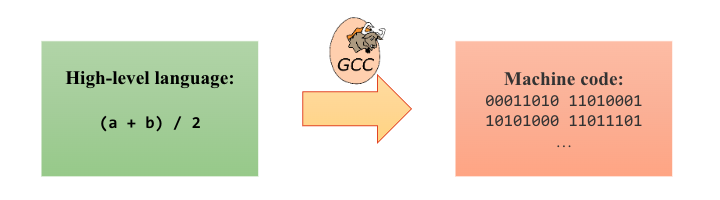

<!-- _class: lead -->
# 컴퓨터프로그래밍기초

## 오리엔테이션

### [munseong.jeong@daejin.ac.kr](mailto:munseong.jeong@daejin.ac.kr)

---

## 프로그래밍

- 프로그래밍 언어를 사용하여 프로그램을 만드는 작업
  - 카카오톡, YouTube, Chrome, 계산기, etc.

---

## 프로그래밍 언어 등장 배경

- **CPU는 0과 1로만 구성된 기계어(machine code)만 이해 가능**

---

## 프로그래밍 언어 등장 배경 (Cont'd - 1)

- 기계어로 작성된 프로그램 예:

---

## 프로그래밍 언어 등장 배경 (Cont'd - 2)

- 기계어는 각 CPU 구조(architecture)에 따라 고유한 명령어 체계를 가짐

---

## 프로그래밍 언어 등장 배경 (Cont'd - 3)

- 동일한 프로그램을 각 CPU 구조에 맞는 기계어로 작성한 예:

---

## 프로그래밍 언어 등장 배경 (Cont'd - 4)

> 프로그래밍을 할 때, 복잡한 기계어 대신 **사람에게 익숙한 문자 체계**를 사용한다면?

---

## C (프로그래밍 언어)

- 1972년 벨 연구소의 데니스 리치(Dennis Ritchie)가 DEC사의 PDP-11에서 사용할 운영체제(유닉스, UNIX)를 만들기 위해 개발한 언어
- 켄 톰슨(Ken Thompson)의 B(프로그래밍 언어)로부터 발전

---

## C (프로그래밍 언어) (Cont'd - 1)

- **세계에서 가장 많이 사용하는 언어 중 하나**

---

## C (프로그래밍 언어) (Cont'd - 2)

- **내용이 간결하여 배우기 쉬움**
- [오늘날 대부분의 프로그래밍 언어](https://en.wikipedia.org/wiki/List_of_C-family_programming_languages)는 C의 영향을 받음
  - C 학습은 다른 언어 학습 시 진입장벽을 낮춤

---

## [실습 환경](https://docs.google.com/document/d/1Y0WzkcZvEqpdyq3ftU6r96EAgTDSOkMHiTRezgyn9BE/edit?tab=t.0#heading=h.rdnqfixbkadp)

### [Visual Studio Code](https://code.visualstudio.com/download)

> Visual Studio Code is a lightweight but powerful source code editor which runs on your desktop and is available for **Windows**, **macOS** and **Linux**.

### [GCC (GNU Compiler Collection)](https://en.wikipedia.org/wiki/GNU_Compiler_Collection)

> A compiler is a computer program that **translates computer code** written in one programming language (the source language) into another language (the target language).

---

## C 표준

- C의 역사는 다음과 같음:
  - 1972, The first C occurred at AT&T Bell Labs
  - 1989, ANSI (American National Standards Institute) C89
  - 1990, ANSI C standard was adopted by ISO (International Organization for Standardization)
    - C89와 C90의 내용은 서로 같음
  - 1999, ANSI C99
  - ...
- **본 수업에서는 ANSI C(C89)를 사용**
  - 교재(TCPL) 또한 ANSI C 표준을 기반으로 하여 작성되었음
