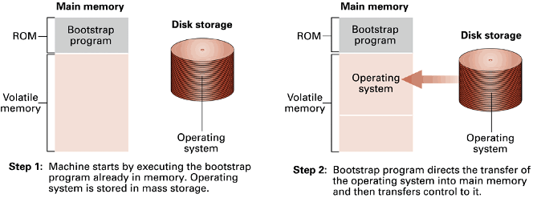
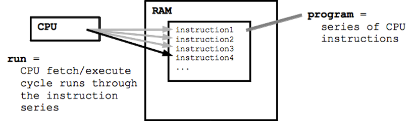
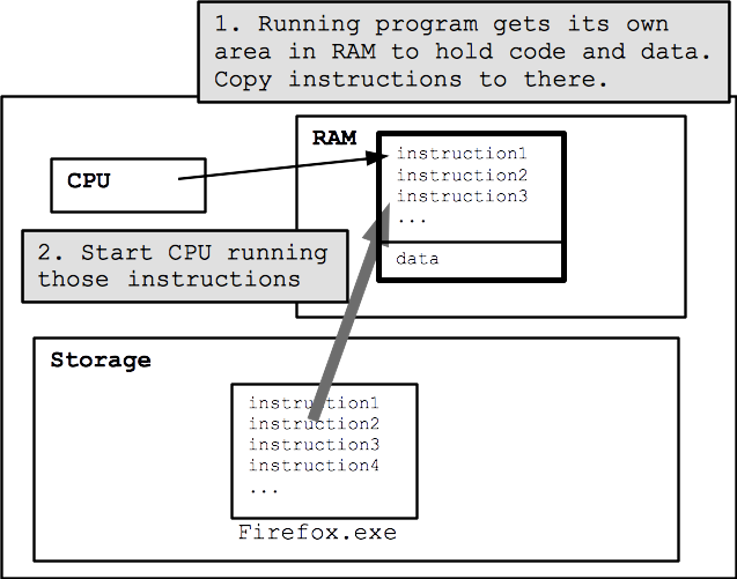
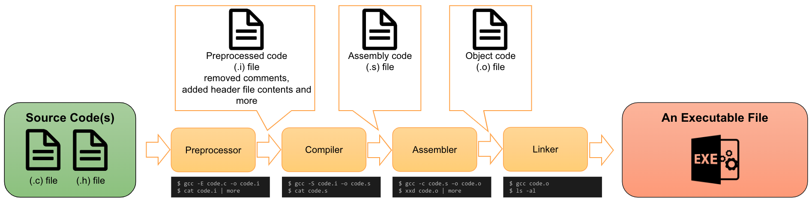
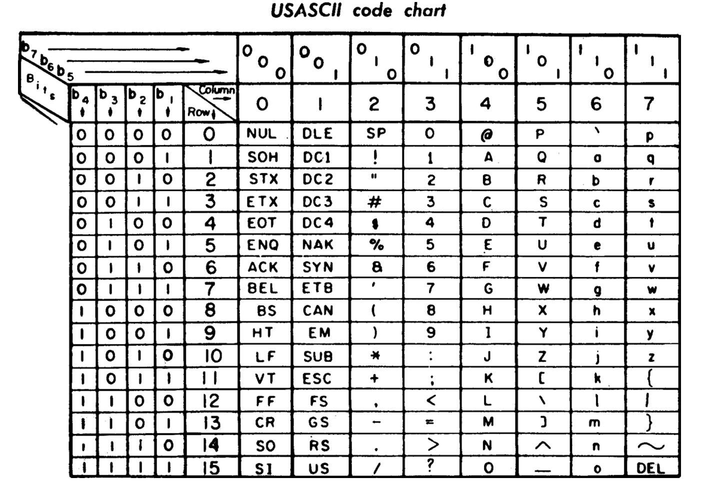

<!-- _class: lead -->
# 컴퓨터프로그래밍기초

## A Tutorial Introduction

### [munseong.jeong@daejin.ac.kr](mailto:munseong.jeong@daejin.ac.kr)

---

## 들어가기에 앞서

### 세부 사항, 규칙, 예외 등은 이 장에서 다루지 않음

- 여러 C 코드를 보면서 C의 기초적이면서 핵심 기능들을 살펴봄
  - Variables and constants
  - Arithmetic
  - Control flow
  - Functions
  - The rudiments of input and output
- 다음 내용은 다루지 않음
  - Pointers, structures, most of C's rich set of operators, several control-flow statements, and the standard library, ...
- C의 기초적인 내용만을 소개함에 따라 코드가 간결하지 않거나 깔끔하지 못할 수 있음

---

## 프로그램 (Programs)

- 기계어 명령들의 집합
  - 각 명령어는 매우 원시적인 수준의 연산(extremely primitive)을 수행
  - e.g., Adding two numbers, testing if a number is equal to zero, etc.
- 프로그램 중 하나인 인터넷 브라우저 크롬(Chrome)은 약 1.1억 개의 원시적인 명령어들의 집합


---

## 프로그램 동작 방식

- 프로그램을 실행하면 프로그램은 운영체제 로더(loader)에 의해 메모리(RAM)에 적재됨
  - Loader: the part of an operating system that is responsible for **loading programs and libraries**



- 메모리에 적재된 프로그램은 다음 두 과정을 반복:
  1. 메모리에 적재된 프로그램으로부터 명령어 하나를 CPU로 가져옴(CPU runs a fetch)
  2. CPU로 가져온 명령어 처리(execute cycle, e.g., do the addition)



---

## 프로그램 동작 방식 (Cont'd)



---

## 프로그램 생성 과정 - 컴파일 (Compilations)

- CPU는 기계어(machine code)를 처리하는 장치
- 고급 언어(e.g., C, C++, etc.)로 작성된 코드는 CPU가 이해할 수 없음
- **컴파일러는 컴파일 과정을 통해 고급 언어를 CPU가 이해할 수 있는 기계어(프로그램)로 변환함**


### 컴파일 과정



---

## Getting Started

> **The only way to learn a new programming language is by writing programs in it.**\
Brian W. Kernighan, Dennis Ritchie (1988). "C Programming Language (ed. Prentice Hall, 1988)"

---

## Getting Started (Cont'd - 1)

- `Hello, World` 출력 프로그램

[//]: # (INCLUDE: ./c/01/src/hello_world.c)

### `#include` 명령 (전처리 명령, Preprocessor Instruction)

[//]: # (INCLUDE: ./c/01/src/hello_world.c --from 1 --to 1 --no-comment)

- 보통 코드의 맨 윗부분에 위치
- 프로그램 실행에 필요한 기능들을 프로그램 내에 포함시킴
  - e.g., `stdio.h`: 표준 입출력(`stdio`: standard inputs and outputs) 관련 내용을 프로그램에 포함시킴

---

## Getting Started (Cont'd - 2)

### `main` 함수

[//]: # (INCLUDE: ./c/01/src/hello_world.c --from 3 --to 9 --no-comment)

- **프로그램의 시작점**이며, 프로그램 실행은 `main` 함수를 호출하는 것을 의미
- 함수 내용은 중괄호(`{`, `}`)로 둘러싸여 있음
- 위의 `main` 함수는 두 문장(statements, `printf` 문, `return` 문)을 포함하는 함수
- **함수 내 모든 문장의 마지막에는 반드시 세미콜론(`;`)을 사용해야 함**

---

## Getting Started (Cont'd - 3)

### `return` 문 (반환문)

[//]: # (INCLUDE: ./c/01/src/hello_world.c --from 8 --to 8 --no-comment)

- 함수를 종료하는 문장
- `main` 함수 종료는 **프로그램의 종료**를 의미
- `return` 다음에 등장하는 표현식(expressions)은 함수 호출 측(caller)으로 전달됨
  - 터미널에서 프로그램을 실행했다면, `main` 함수의 `return` 값(반환값)은 터미널로 전달됨

```bash
$ ./hello
Hello, World  # return 0; Terminal will receive it
$ echo $?
0
```

---

## Getting Started (Cont'd - 4)

### `printf` 문

[//]: # (INCLUDE: ./c/01/src/hello_world.c --from 6 --to 6 --no-comment)

- `printf` 함수를 호출하는 문장으로, **`stdio.h` 헤더 파일이 필요함**
- 전달인자(arguments, `"Hello, World\n"`)를 콘솔 화면에 출력하는 역할 수행

### 문자열 (Strings)

- 큰따옴표(`"`)를 사용해 표현한 값으로, 여러 문자들을 묶은 값
  - 작은따옴표(`'`)를 사용해 표현한 값은 문자 하나를 의미
- 문자열(character string) 또는 문자열 상수(string constant)라고 부름

### 이스케이프 시퀀스 (Escape Sequence)

- 백슬래시(`\`) 뒤에 한 문자 또는 숫자 조합이 오는 문자 조합
- **백슬래시를 포함한 두 개 이상의 문자 조합이지만, 한 문자(a character)로 간주**
- 데이터가 아닌 특수한 명령을 수행하는 용도로 사용(e.g., `'\n'`: 터미널로 데이터 출력 시 한 줄 개행)

---

## Getting Started (Cont'd - 5)

- `printf` 문의 다양한 형태

[//]: # (INCLUDE: ./c/01/src/printf.c)

---

## Variables and Arithmetic Expressions

- 화씨 온도를 섭씨 온도로 변환하는 프로그램(공식: $C^\circ = \frac{5}{9} \times (F^\circ - 32)$)

[//]: # (INCLUDE: ./c/01/src/fahr_cel_table.c)

---

## Variables and Arithmetic Expressions (Cont'd - 1)

### 주석 (Comments)

- 프로그램 내에 메모를 하거나 해당 프로그램을 설명하는 용도
- 프로그램의 구조와 정보를 코드를 읽는 사람에게 전달할 수 있음
- `/*  */` 사이에 위치한 모든 내용은 **전처리기**에 의해 제거
- 프로그램 소스코드 내 공백 문자(a blank, tab, or newline)가 등장할 수 있는 위치에 사용 가능

[//]: # (INCLUDE: ./c/01/src/comment.c)

---

## Variables and Arithmetic Expressions (Cont'd - 2)

### 변수 (Variables)

[//]: # (INCLUDE: ./c/01/src/fahr_cel_table.c --from 7 --to 8 --no-comment)

- 프로그램 내에서 데이터를 보관하는 용도
- **모든 변수는 반드시 사용 전에 선언(declarations)되어야 함**
- 변수 선언은 사용할 타입(types)과 이름(식별자)의 조합으로 구성
- 타입 종류는 아래와 같음:

```text
char   → character(a single byte)
short  → short integer
int    → integer
long   → long integer
float  → single-precision floating point
double → double-precision floating point
```

---

## Variables and Arithmetic Expressions (Cont'd - 3)

### 대입문 (Assignment Statements)

[//]: # (INCLUDE: ./c/01/src/fahr_cel_table.c --from 10 --to 13 --no-comment)

- 변수에 값을 대입(assignments)할 때 사용하는 문장
- 대입 연산자(`=`)를 사용해 변수에 값을 전달할 수 있음

### `while` 반복문

[//]: # (INCLUDE: ./c/01/src/fahr_cel_table.c --from 14 --to 18 --no-comment)

- `while` 키워드 다음에 등장하는 조건(conditions)을 만족하는 동안 중괄호 내 문장들을 여러 번 반복할 수 있음

---

## Variables and Arithmetic Expressions (Cont'd - 4)

### 산술 표현식 (Arithmetic Expressions)

[//]: # (INCLUDE: ./c/01/src/fahr_cel_table.c --from 15 --to 15 --no-comment)

- 산술 연산자를 사용하는 표현식

| Operator | Description    | Example | Result |
| -------- | -------------- | ------- | ------ |
| `+`      | Addition       | `5 + 3` | `8`    |
| `-`      | Subtraction    | `5 - 3` | `2`    |
| `*`      | Multiplication | `5 * 3` | `15`   |
| `/`      | Division       | `6 / 3` | `2`    |

---

## Variables and Arithmetic Expressions (Cont'd - 5)

### 산술 연산자 사용 시 주의사항

- 화씨 온도를 섭씨 온도로 변환하는 프로그램의 공식은 다음과 같음:

$$C^\circ = \frac{5}{9} \times (F^\circ - 32)$$

[//]: # (INCLUDE: ./c/01/src/fahr_cel_table_ignore.c --from 21 --to 22 --no-comment)

- 2번 문장의 `5 / 9` 표현은 두 피연산자가 **정수** 값
- **정수 나눗셈에서 소수 부분은 버려지므로, `5 / 9`의 값은 0으로 평가됨**
- 수식을 프로그램 내 산술 표현식으로 표현할 때, 표현식이 올바르게 평가되는지 반드시 검증해야 함

---

## Variables and Arithmetic Expressions (Cont'd - 6)

### 형식에 따른 출력 (Formatted Output)

[//]: # (INCLUDE: ./c/01/src/fahr_cel_table_ignore.c --from 26 --to 27 --no-comment)

- `printf` 함수의 첫 번째 전달인자는 화면에 실제로 출력되는 문자열(형식 문자열, format string)
- `printf` 함수의 형식 문자열이 변환 지정자(conversion specifiers)를 포함하면, 형식 문자열 뒤에 등장하는 전달인자를 형식화할 수 있음
  - 변환 지정자는 `%` 기호로 시작하는 연속된 문자열
  - **형식 문자열 내 변환 지정자의 수와 뒤따르는 전달인자의 수는 일치해야 함**

[//]: # (INCLUDE: ./c/01/src/fahr_cel_table_ignore.c --from 31 --to 34 --no-comment)

- `%d`는 대응되는 전달인자를 **정수** 값으로 출력
- `%f`는 대응되는 전달인자를 **실수** 값으로 출력

---

## Variables and Arithmetic Expressions (Cont'd - 7)

- 출력 형식이 개선된 화씨 온도를 섭씨 온도로 변환하는 프로그램

[//]: # (INCLUDE: ./c/01/src/fahr_cel_table_formatted.c)

---

## Variables and Arithmetic Expressions (Cont'd - 8)

- 실수 값을 사용한 화씨 온도를 섭씨 온도로 변환하는 프로그램
  - 실수 값과 정수 값이 같이 사용될 경우, **정수 값은 실수 값으로 처리됨**

[//]: # (INCLUDE: ./c/01/src/fahr_cel_table_floating_point.c)

---

## 프로그램 작성 요령

### 전체 코드가 구조적이어야 함

- 들여쓰기는 프로그램의 논리적 구조를 강조함
- 들여쓰기, 개행, 빈칸 등을 적절히 사용하면 사람이 프로그램 코드를 더 편하게 읽을 수 있음
- 컴파일러는 **코드의 문법 구조만 확인**하며, 들여쓰기, 빈칸 등 논리적인 구조를 상관하지 않음
- 가독성을 중시할 것(**프로그램 코드는 사람이 작성하고 읽음**)

### 한 줄에는 하나의 문장만 작성할 것

- 한 줄에 여러 문장을 작성하면 코드의 가독성이 낮아짐

[//]: # (INCLUDE: ./c/01/src/fahr_cel_table_ignore.c --from 38 --to 38 --no-comment)

[//]: # (INCLUDE: ./c/01/src/fahr_cel_table.c --from 8 --to 12 --no-comment)

---

## 프로그램 작성 요령 (Cont'd)

### 연산자 양 옆에 빈칸 사용

- 연산자와 피연산자 간 관계를 명확히 하여 가독성을 높이기 위함

[//]: # (INCLUDE: ./c/01/src/fahr_cel_table_ignore.c --from 42 --to 43 --no-comment)

### 일관성 (Consistency)을 유지할 것

[//]: # (INCLUDE: ./c/01/src/fahr_cel_table_ignore.c --from 47 --to 55 --no-comment)

---

## The For Statement

- `for` 반복문을 사용한 화씨 온도를 섭씨 온도로 변환하는 프로그램

[//]: # (INCLUDE: ./c/01/src/fahr_cel_table_using_for.c)

---

## The For Statement (Cont'd - 1)

### `for` 반복문
  
```text
for (initialization; condition; updation) {
    body of the loop (statements to be executed)
}
```

- `for` 헤더는 세 개의 표현식 사용
  - 초기화(1번 표현식)는 반복문 시작 시점에 한 번만 실행됨
  - 이후 조건(2번 표현식) → 반복문 본문(loop body) 실행 → 갱신(3번 표현식) 과정을 반복함
  - 조건이 더 이상 만족되지 않을 때 반복문은 종료됨

---

## The For Statement (Cont'd - 2)

### 기호 상수 (Symbolic Constants)

- 코드 내 **정수 타입 상수**를 사용했으나, 주석 등 설명이 부족해 코드를 명확히 이해하는 데 한계가 있음

[//]: # (INCLUDE: ./c/01/src/fahr_cel_table_using_for.c --from 8 --to 9 --no-comment)

- `#define` 전처리문을 활용하면 기호 상수를 사용할 수 있음

```text
#define NAME REPLACEMENT_TEXT
```

- `NAME` 자리에는 상수를 설명할 수 있는 의미 있는 이름을 사용
- `REPLACEMENT_TEXT` 자리에는 상수 값을 사용
- **전처리기는 코드를 분석하면서 `NAME`을 발견하면 `REPLACEMENT_TEXT`로 대치**
  - 컴파일러는 전처리기가 처리한 결과물을 컴파일함

---

## The For Statement (Cont'd - 3)

- 기호 상수가 추가된 화씨 온도를 섭씨 온도로 변환하는 프로그램

[//]: # (INCLUDE: ./c/01/src/fahr_cel_table_using_for_with_macro.c)

---

## The For Statement (Cont'd - 4)

### 기호 상수 사용 시 주의사항

- `#define` 전처리문 사용 시, `REPLACEMENT_TEXT` 뒤에 세미콜론을 사용하지 않도록 주의

[//]: # (INCLUDE: ./c/01/src/fahr_cel_table_using_for_with_macro_ignore.c --from 8 --to 8 --no-comment)

[//]: # (INCLUDE: ./c/01/src/fahr_cel_table_using_for_with_macro_ignore.c --from 20 --to 22 --no-comment)

[//]: # (INCLUDE: ./c/01/src/fahr_cel_table_using_for_with_macro_ignore.c --from 26 --to 28 --no-comment)

---

## Character Input and Output

### 스트림 (Streams)

- 프로그램에서 입력과 출력을 간단히 사용할 수 있는 인터페이스(interfaces)
- C 표준 입출력 라이브러리는 스트림을 기반으로 구현됨


---

## Character Input and Output (Cont'd - 1)

### 기본적인 표준 라이브러리 문자 입출력 함수

- 표준 라이브러리 입출력 함수는 `stdio.h` 헤더 파일이 필요함

[//]: # (INCLUDE: ./c/01/src/getchar_putchar.c --from 5 --to 8 --no-comment)

#### `getchar` 함수

- 키보드는 데이터 소스(data source)로써, 키보드를 누르면 데이터가 생성되어 입력 스트림(input stream)에 기록됨
- `getchar` 함수는 입력 스트림에 기록된 문자 하나를 프로그램으로 읽어옴

#### `putchar` 함수

- 모니터는 데이터 싱크(data sink)로써, 출력 스트림(output stream)에 있는 데이터는 모니터로 전달되어 처리됨
- `putchar` 함수는 문자 하나를 전달인자로 넘겨받아 출력 스트림으로 내보냄

---

## Character Input and Output (Cont'd - 2)

### ASCII (American Standard Code for Information Interchange)

- 컴퓨터에서 문자 하나를 표현하기 위해 0 ~ 127 사이의 정수 값으로 연결한 표준
- 키보드에서 `'A'`를 입력하면, 실제로 텍스트 입력 스트림에 전달되는 값은 `0x41`(`65`)
- 텍스트 출력 스트림에 `0x41`(`65`) 값이 존재할 경우, 모니터에 표현되는 결과는 `'A'`



---

## Character Input and Output (Cont'd - 3)

### 문자 상수 (Character Constants)

- 작은따옴표 사이에 쓰여진 문자 값
- 문자 상수는 문자 코드(character code)에 정의된 정수값
- e.g., ASCII 문자 코드를 사용하는 시스템에서의 문자 상수 `'A'`는 정수 값 `0x41`(`65`)을 의미

### 상수 주의사항

- `1` vs `'1'`
  - `1`은 **정수 상수**이며, 정수 값 `1`을 나타냄
  - `'1'`은 **문자 상수**이며, ASCII 정수 값 `0x31`(`49`)를 나타냄
- `'\n'` vs `"\n"`
  - `'\n'`은 **문자 상수**이며, ASCII 정수 값 `0x0A`(`10`)를 나타냄
  - `"\n"`은 **문자열 상수**

---

## Character Input and Output (Cont'd - 4)

- 기본적인 문자 입출력 함수만을 사용해 구현하는 파일 복사 프로그램

[//]: # (INCLUDE: ./c/01/src/copy_1st.c)

- `Ctrl + D`를 누르면 텍스트 입력 스트림으로 `EOF`(end-of-file)가 전달되어 프로그램이 종료됨

---

## Character Input and Output (Cont'd - 5)

### 관계 연산자 (Relational Operators)

- 두 피연산자의 관계를 평가해 참(`true`) 또는 거짓(`false`)으로 결과를 반환

| Operator | Description              | Example   |
| -------- | ------------------------ | --------- |
| `==`     | Equal to                 | `a == b`  |
| `!=`     | Not equal to             | `a != b`  |
| `<`      | Less than                | `a < b`   |
| `>`      | Greater than             | `a > b`   |
| `<=`     | Less than or equal to    | `a <= b`  |
| `>=`     | Greater than or equal to | `a >= b`  |

#### 관계 연산자 사용 시 주의사항

- 대입 연산자(`=`)와 관계 연산자(`==`)를 혼동하지 말 것

---

## Character Input and Output (Cont'd - 6)

- 개선된 파일 복사

[//]: # (INCLUDE: ./c/01/src/copy_2nd.c)

---

## Character Input and Output (Cont'd - 7)

### 연산자 우선순위 (Operator Precedence)

- 표현식 내 연산자들은 우선순위에 따라 높은 우선순위의 연산자부터 평가됨
- **대입 연산자(`=`)는 관계 연산자(`!=`)보다 우선순위가 낮음**
  - `c = getchar() != EOF` 표현은 `getchar() != EOF` 표현을 먼저 평가함
  - 변수 `c`에는 문자 값이 대입되는 것이 아닌, 관계 연산자의 평가 결과(참 또는 거짓)가 대입됨
- 표현식 내에 여러 개의 연산자를 사용해야 할 경우, 괄호를 사용하면 실수를 피하면서 가독성을 높일 수 있음
  - 괄호로 둘러싸인 표현은 가장 높은 우선순위를 가짐

---

## Character Input and Output (Cont'd - 8)

### 타입에 따른 값 표현 범위

[//]: # (INCLUDE: ./c/01/src/getchar_putchar.c --from 5 --to 7 --no-comment)

- `int` 타입은 정수를 표현하는 자료형
- `char` 타입은 문자를 표현하는 자료형
- `getchar` 함수는 문자 하나를 입력 스트림으로부터 읽어와 반환하는 함수
- `char` 타입 변수가 아닌 `int` 타입 변수를 사용한 이유는 **`getchar` 함수가 `EOF`를 반환할 수 있기 때문**
  - `char` 타입은 1바이트(256가지 값)를 담을 수 있는 자료형으로, ASCII 문자 집합(0~127)을 포함함
  - `EOF`는 `getchar` 함수를 호출했을 때, 더 이상의 데이터가 입력 스트림에 없을 경우 반환하는 상태 값
  - `getchar` 함수는 문자(256 개) 뿐만 아니라 입력 스트림 상태(1 개)도 반환
    - 반환 가능한 종류는 총 257가지
  - 256 가지의 값을 담을 수 있는 `char` 타입 변수는 `getchar` 함수의 반환을 전부 처리할 수 없음

---

## Character Input and Output (Cont'd - 9)

- 문자 세기

[//]: # (INCLUDE: ./c/01/src/count_1st.c)

---

## Character Input and Output (Cont'd - 10)

### 연산자 `++` (증가 연산자, Increment Operator)

- 변수의 값을 1 증가시키는 연산자

[//]: # (INCLUDE: ./c/01/src/count_ignore.c --from 14 --to 17 --no-comment)

---

## Character Input and Output (Cont'd - 11)

### `long` 타입 (자료형)

- `int` 타입은 약 -21억 ~ 21억 사이의 값을 표현할 수 있음
- `long` 타입은 `int` 타입보다 **같거나 더 넓은 범위의 값을 표현할 수 있음**
  - NB: Sizes and ranges are **platform‑dependent**; table assumes LP64
- `printf` 함수를 사용해 `long` 타입 값을 출력하고자 할 경우, 변환 지정자 `%ld` 사용

| Data type | Size (bytes) | Minimum value              | Maximum value             |
| --------- |------------- |--------------------------- | ------------------------- |
| `char`    | 1            | -128                       | 127                       |
| `short`   | 2            | -32,768                    | 32,767                    |
| `int`     | 4            | -2,147,483,648             | 2,147,483,647             |
| `long`    | 8            | -9,223,372,036,854,775,808 | 9,223,372,036,854,775,807 |

---

## Character Input and Output (Cont'd - 12)

- 개선된 문자 세기

[//]: # (INCLUDE: ./c/01/src/count_2nd.c)

---

## Character Input and Output (Cont'd - 13)

### `double` 타입

- `float` 타입처럼 실수 값을 표현할 수 있음
- `long` 타입이 표현할 수 있는 최대 범위를 벗어나는 값은 `double` 타입으로 표현할 수 있음
  - **오차가 발생할 수 있음**
- `printf` 함수를 사용해 `double` 타입 값을 출력하고자 할 경우, 변환 지정자 `%f` 사용
  - `%.0f`: 실수 타입 데이터를 출력할 때, 소수점 자리를 출력하지 않도록 형식화

| Data type | Size (bytes) | Precision (decimal digits) | Representable range                  |
| --------- | ------------ | -------------------------- | ------------------------------------ |
| `float`   | 4            | About 6~7                  | ±1.17549 × 10⁻³⁸ ~ ±3.40282 × 10³⁸   |
| `double`  | 8            | About 15~16                | ±2.22507 × 10⁻³⁰⁸ ~ ±1.79769 × 10³⁰⁸ |

---

## Character Input and Output (Cont'd - 14)

- 줄 세기
  - 줄 끝에 포함되는 `'\n'` 문자의 개수는 곧 줄의 개수

[//]: # (INCLUDE: ./c/01/src/count_line.c)

---

## Character Input and Output (Cont'd - 15)

- 줄의 수, 단어의 수, 문자의 수를 세는 프로그램

[//]: # (INCLUDE: ./c/01/src/count_improved.c --to 12)

---

## Character Input and Output (Cont'd - 16)

[//]: # (INCLUDE: ./c/01/src/count_improved.c --from 13)

---

## Character Input and Output (Cont'd - 17)

### 조건문 (`if` 문)

- `if` 키워드 다음에 등장하는 조건이 참일 경우, 조건문 본문 수행

### 연산자의 결합 방향 (Operator Associativity)

[//]: # (INCLUDE: ./c/01/src/count_improved.c --from 12 --to 12 --no-comment)

- 표현식 내 연산자들은 결합 방향에 따라 연산자 주변 피연산자와 결합
- 대입 연산자(`=`)는 **오른쪽에서 왼쪽으로 결합**
- `nl = nw = nc = 0;` 문장은 아래와 같이 결합되어 평가됨:

[//]: # (INCLUDE: ./c/01/src/count_improved_ignore.c --from 15 --to 17 --no-comment)

---

## Character Input and Output (Cont'd - 18)

### 논리 연산자 (Logical Operators)

[//]: # (INCLUDE: ./c/01/src/count_improved_ignore.c --from 21 --to 23 --no-comment)

- 논리 연산자(`&&`)는 논리곱(logical AND), (`||`)는 논리합(logical OR)
- 논리 연산자는 **왼쪽에서 오른쪽으로 결합**
- 논리 연산자를 사용하는 표현식을 평가하는 도중 **이미 결과가 자명할 경우**, 뒤따르는 평가를 수행하지 않음
  - **SCE, short-circuit evaluation**

---

## Character Input and Output (Cont'd - 19)

### `else` 문

[//]: # (INCLUDE: ./c/01/src/count_improved.c --from 17 --to 22 --no-comment)

- `if` 문의 조건이 참이라면 `if` 문의 본문을 수행하고, 조건이 거짓이라면 `else` 문의 본문을 수행
  - `else` 문이 없다면 아무 동작을 수행하지 않음
- 위 코드는 아래 코드를 축약한 표현

[//]: # (INCLUDE: ./c/01/src/count_improved_ignore.c --from 27 --to 33 --no-comment)

---

## Arrays

[//]: # (INCLUDE: ./c/01/src/array_ignore.c --from 7 --to 7 --no-comment)

- **동일한 성질을 갖는 같은 타입 변수를 여러 개 선언해야 하는 경우 배열을 사용하면 편리하게 선언할 수 있음**
- 배열 선언 형식은 `TYPE NAME[SIZE]`
  - `TYPE` 타입 변수를 `SIZE` 개 선언하는 것

[//]: # (INCLUDE: ./c/01/src/array_ignore.c --from 11 --to 11 --no-comment)

- 배열 선언 후 배열의 이름에 인덱스 번호를 지정하면 배열의 원소(elements)를 고를 수 있음
- 배열 원소 선택은 `NAME[INDEX]`
  - 배열 선언 시 `SIZE` 크기로 선언했다면, **사용 가능한 인덱스 범위는 `0` ~ `(SIZE - 1)`**

[//]: # (INCLUDE: ./c/01/src/array_ignore.c --from 15 --to 18 --no-comment)

---

## Arrays (Cont'd - 1)

- 숫자 문자, 공백 문자, 그 외 문자의 빈도 계산 프로그램

[//]: # (INCLUDE: ./c/01/src/array.c --to 19)

---

## Arrays (Cont'd - 2)

[//]: # (INCLUDE: ./c/01/src/array.c --from 21)

---

## Arrays (Cont'd - 3)

### ASCII 성질을 활용한 기술들

[//]: # (INCLUDE: ./c/01/src/array.c --from 13 --to 14 --no-comment)

- ASCII에 정의된 숫자 문자는 **서로 인접해 있음**
  - `'0'`은 `0x30` (`48`), `'1'`은 `0x31` (`49`), ..., `'9'`는 `0x39` (`57`)
- `c >= '0' && c <= '9'` 표현식은 변수 `c`가 숫자 문자인지 판별
- `c - '0'` 표현식은 배열의 인덱스를 계산함:
  - 인덱스 0: 숫자 문자 `'0'`의 빈도
  - 인덱스 1: 숫자 문자 `'1'`의 빈도
  - ...
  - 인덱스 9: 숫자 문자 `'9'`의 빈도

---

## Functions

- 프로그램 내 사용 빈도가 높은 문장 또는 서로 밀접한 연관이 있는 문장을 분리해 새로운 논리적 단위로 구분할 수 있음
- 함수라는 논리적 단위를 적용하면 프로그램을 **구조화**할 수 있고, 가독성을 높일 수 있음
- 함수로 분리한 내용은 함수 호출을 통해 함수 본문을 **재사용**할 수 있음
- 지금까지 배운 함수로는 `printf`, `putchar`, `getchar`가 있음

### 함수의 정의

- 사용자가 직접 필요에 따라 함수를 정의할 수 있음
- 함수 정의 형식은 `RETURN_TYPE FUNCTION_NAME(PARAMETERS) { STATEMENTS }`
  - `RETURN_TYPE`: 자료형, 함수 종료 시 해당 자료형 값을 반환
    - 만약 함수 종료 시 값을 반환하지 않는 함수라면, `void` 사용
  - `FUNCTION_NAME`: 함수의 이름, 함수 호출 시 사용
  - `PARAMETERS`: 매개변수, 함수 호출 시 전달되는 값
    - 만약 매개변수 없는 함수를 정의할 경우, `void` 사용

---

## Functions (Cont'd - 1)

- ${m}^{n}$을 계산하는 `power` 함수

[//]: # (INCLUDE: ./c/01/src/power.c --to 14)

---

## Functions (Cont'd - 2)

[//]: # (INCLUDE: ./c/01/src/power.c --from 16)

---

## Functions (Cont'd - 3)

### 함수 선언 (Function Declarations)

[//]: # (INCLUDE: ./c/01/src/power.c --from 3 --to 3 --no-comment)

- 함수 정의 부분에서 함수의 본문 없이 사용한 문장
- 컴파일러에게 함수의 정보를 알리는 용도로 사용
  - 컴파일러는 소스코드를 맨 윗줄부터 차례로 분석
  - 함수 정의를 만나기 전 `power`라는 이름을 마주할 경우, 해당 함수의 정보가 없으므로 컴파일 오류 발생
  - 소스코드 상단에 `power` 함수 선언을 할 경우, 컴파일러에게 다음과 같은 정보를 전달할 수 있음:
    - `power`라는 이름은 함수
    - `power` 함수는 호출 시 두 개의 `int` 타입 전달인자가 필요
    - `power` 함수 종료 시 `int` 타입 값 반환
- **함수 정의에서의 매개변수 이름과 함수 선언에서의 매개변수 이름은 같지 않아도 됨**
  - 컴파일러에게 필요한 정보는 매개변수 이름이 아닌 **함수 호출 시 필요한 매개변수의 개수와 각 매개변수의 자료형**
- 함수 선언과 함수 정의는 서로 동일한 반환 타입, 이름, 매개변수의 형태를 가져야 함

---

## Functions (Cont'd - 4)

### 지역 변수 (Local Variables)

[//]: # (INCLUDE: ./c/01/src/local_variable_ignore.c)

- 함수 안에 선언된 변수는 지역 변수
- 두 함수(`main`, `power`)는 둘 다 지역 변수 `i`를 선언해 사용
- 서로 다른 함수는 **서로 다른 지역을 사용함**
- `main` 함수의 `i`와 `power` 함수의 `i`는 **서로 이름이 같지만** 구분됨

---

## Functions (Cont'd - 5)

### 함수의 반환값

[//]: # (INCLUDE: ./c/01/src/power.c --from 3 --to 3 --no-comment)

[//]: # (INCLUDE: ./c/01/src/power_ignore.c --from 26 --to 26 --no-comment)

- `power` 함수의 반환 타입은 `int` 타입
- `printf` 함수의 형식 문자열은 세 개의 전달인자를 정수 타입으로 형식화 후 출력
  - 첫 번째 변환 지정자 `%d`는 `i`의 값을 정수 타입으로 형식화 후 출력
  - 두 번째 변환 지정자 `%d`는 `power(2, i)`의 반환값을 정수 타입으로 형식화 후 출력
  - 세 번째 변환 지정자 `%d`는 `power(-3, i)`의 반환값을 정수 타입으로 형식화 후 출력
- 반환값은 아래와 같이 무시할 수도 있음

[//]: # (INCLUDE: ./c/01/src/power_ignore.c --from 30 --to 30 --no-comment)

---

## Character Arrays

[//]: # (INCLUDE: ./c/01/src/char_array.c)

- 가장 많이 사용되는 배열 형태 중 하나
- `char` 타입 배열은 **문자열**을 저장할 수 있음

---

## Character Arrays (Cont'd - 1)

- `char` 타입 배열에 문자열을 저장할 때, 반드시 문자열의 끝에는 널 문자(`'\0'`)를 기록해야 함
  - **널 문자는 문자열의 끝을 의미하는 문자**이며, 정수 값은 `0x00` (`0`)
  - **문자열 상수의 길이가 5라면, `char` 타입 배열의 크기는 최소 6 이상이어야 함**
- `char` 타입 배열 선언과 동시에 문자열 상수를 대입하면, 문자열 끝에 자동으로 널 문자를 기록함
- `printf` 함수의 변환 지정자 `%s`를 사용하면 문자열을 출력할 수 있음

| Index     | 0      | 1      | 2      | 3      | 4      | 5      | ... | 99     |
| --------- | ------ | ------ | ------ | ------ | ------ | ------ | --- | ------ |
| **Value** | `'H'`  | `'e'`  | `'l'`  | `'l'`  | `'o'`  | `'\0'` | ... | `'\0'` |

---

## Character Arrays (Cont'd - 2)

- 함수로 `char` 타입 배열 전달

[//]: # (INCLUDE: ./c/01/src/char_array_example.c)

---

## Character Arrays (Cont'd - 3)

- 입력된 문자열 중 가장 긴 문자열을 출력하는 프로그램

[//]: # (INCLUDE: ./c/01/src/print_longest.c --to 16)

---

## Character Arrays (Cont'd - 4)

[//]: # (INCLUDE: ./c/01/src/print_longest.c --from 17 --to 27)

---

## Character Arrays (Cont'd - 5)

[//]: # (INCLUDE: ./c/01/src/print_longest.c --from 29 --to 43)

---

## Character Arrays (Cont'd - 6)

[//]: # (INCLUDE: ./c/01/src/print_longest.c --from 45)

---

## External Variables and Scope

### 지역 변수

- 함수 내에 선언한 변수
  - 해당 함수 내에서만 사용 가능
- 지역 변수는 함수가 호출되면 생성되고, 함수가 종료되면 자동 소멸되어 자동 변수(automatic variables)라고도 함
  - **지역 변수의 값은 함수가 종료되면 지워짐**
- 지역 변수는 생성과 동시에 **쓰레기 값**을 가짐

### 외부 변수

- 함수 외에 선언한 변수
  - 여러 함수가 동시에 사용 가능
- 여러 개의 함수가 동일한 매개변수를 사용한다면, 외부 변수를 사용해 함수의 매개변수를 줄일 수 있음
  - 함수 내에 `extern` 키워드를 사용해 외부 변수를 선언하면 해당 함수에서 사용 가능
- 외부 변수는 프로그램이 실행되면 생성되고, 프로그램이 종료되면 소멸되는 변수
  - **외부 변수의 값은 프로그램이 종료될 때까지 유지됨**
- 외부 변수는 생성과 동시에 **`0`으로 초기화됨**
- 외부 변수는 함수 외에 한 번만 선언해야 함
  - 여러 번 동일한 이름으로 외부 변수를 선언할 경우 컴파일 오류

---

## External Variables and Scope (Cont'd - 1)

- 외부 변수를 사용하는 입력된 문자열 중 가장 긴 문자열을 출력하는 프로그램

[//]: # (INCLUDE: ./c/01/src/print_longest_with_external_variable.c --to 19)

---

## External Variables and Scope (Cont'd - 2)

[//]: # (INCLUDE: ./c/01/src/print_longest_with_external_variable.c --from 20 --to 30)

---

## External Variables and Scope (Cont'd - 3)

[//]: # (INCLUDE: ./c/01/src/print_longest_with_external_variable.c --from 32 --to 47)

---

## External Variables and Scope (Cont'd - 4)

[//]: # (INCLUDE: ./c/01/src/print_longest_with_external_variable.c --from 49)
