# Types, Operators and Expressions

## Goals of This Chapter

### 형 (Types)

- 각 형마다 표현할 수 있는 값과 범위
- 각 형마다 메모리에 값을 표현하는 방법
- 컴퓨터에서 음의 정수를 표현하는 방법
- 실수형 값의 오차와 정밀도

### 연산자 (Operators)

- 연산자의 종류
- 연산자 결합 방향
- 연산자 우선 순위

### 표현 (Expressions)

- 변수와 상수를 사용한 표현
- 표현식에서의 형 변환
- 복잡한 표현식의 평가 방법

---

## Variable Names

- 문자와 숫자, 밑줄 (`_`) 사용 가능
- **변수명 첫 글자에 숫자 사용 불가**

```c
int num_seat;     /* ok */
float rad_1;      /* ok */
int 2nd_trial;    /* error: invalid suffix "nd_trial" on integer constant */
```

- ANSI C (ISO C90) 표준은 `_`로 시작하는 식별자 (변수명)를 표준 라이브러리 및 구현 내부에서 사용함
  - 변수명 첫 글자에 밑줄은 사용 가능하나, **사용하지 않는 것을 권장**
  - **표준 헤더파일과 충돌날 수 있음**

```c
int _is_modified; /* ok, but don't use it */
```

- 변수명의 대소문자는 구분됨

```c
int a, A;         /* ok, `a` and `A` are difrerent variables */
```

---

## Variable Names (Cont'd)

- 예약어 (keysords)는 변수명으로 사용 불가
  - `while`, `for`, `int`, `float`, etc.
- 변수명은 사용 목적에 맞는 적합한 이름을 사용해야 함
- 지역 변수 (local variables)는 짧은 변수명을, 전역 변수 (global variables)는 긴 변수명을 사용할 것을 권장
  - 지역 변수는 선언된 함수 내에서만 사용 가능하며, **짧은 변수명을 사용해도 해당 변수를 선언한 함수가 의미를 보태줌**
  - 전역 변수는 여러 함수에서 사용 가능하며, **변수 자체만으로 의미를 충분히 전달할 수 있도록 긴 변수명 사용**

[//]: # (INCLUDE: ./c/02/variable_name.c)

---

## Data Types and Sizes

### 기본 자료형

- `char`, `int`, `float`, `double` 네 종류의 자료형이 있음
- 정수 자료형은 한정사 (qualifier)를 사용해 값의 표현 범위를 조절할 수 있음
  - `short (short int)`
  - `long (long int)`

| Type   | Description |
|--------|------------|
| `char`   | Represents a single character, typically 1 byte in size |
| `int`    | Represents an integer value, **usually 4 bytes** in size |
| `float`  | Represents a floating-point number with single precision, typically 4 bytes in size |
| `double` | Represents a floating-point number with double precision, typically 8 bytes in size |
| `short` | Represents a short integer, typically 2 bytes in size |
| `long` | Represents a long integer, typically 4 or 8 bytes in size depending on the system |

---

## Data Types and Sizes (Cont'd - 1)

- 정수형 크기는 데이터 모델 (CPU 구조와 운영체제 조합을 결정되는 기본 자료형 크기)에 의존
  - e.g., x86-64 CPU에 Windows x64 운영체제 설치 시 데이터 모델은 **LLP64**
  - e.g., x86-64 CPU에 Windows x32 운영체제 설치 시 데이터 모델은 **ILP64**

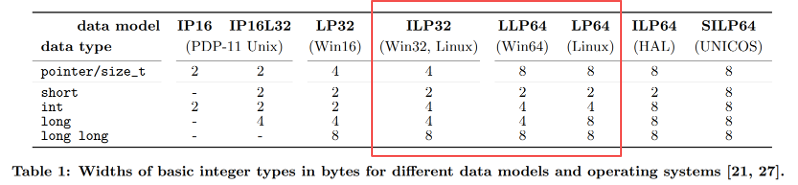

- 데이터 모델은 아래 규칙을 준수해 정수형 자료형을 표현
  1. `short`, `int` 형은 적어도 2 바이트 이상의 크기를 가져야 한다.
  2. `long` 형은 적어도 4 바이트 이상의 크기를 가져야 한다.
  3. `short` 형은 `int` 형보다 크기가 클 수 없다.
  4. `int` 형은 `long` 형보다 크기가 클 수 없다.

---

## Data Types and Sizes (Cont'd - 2)

### 부호형 (`signed`)과 무부호형 (`unsigned`)

- `char`, `int` 형은 한정사를 사용해 부호 값 또는 무부호 값을 표현할 수 있음
- 무부호 값은 0과 양수만 표현 가능 (**음수 표현 불가**)
  - e.g., `char` 형은 1 바이트 크기를 가지므로, `unsigned char` 형의 표현 범위는 `0` ~ `255`
- 부호 값은 양수와 음수 모두 표현 가능 (2의 보수 표현 사용)
  - e.g., `char` 형은 1 바이트 크기를 가지므로, `char` 형의 표현 범위는 `-128` ~ `127`
- 문자형은 사용 환경에 따라 부호형 또는 무부호형일 수 있음 (machine-dependent)
  - 화면에 출력할 문자들은 `0` ~ `127` 범위에 정의되어 있으며, 부호형과 무부호형 둘 다 문자를 올바르게 표현 가능
- 정수형은 부호형을 기본값으로 사용
  - `short` 형은 `signed short` 형
  - `int` 형은 `signed int` 형
  - `long` 형은 `signed long` 형

---

## Data Types and Sizes (Cont'd - 3)

### `limits.h`

- 자료형 관련 기호 상수들을 정의한 표준 헤더파일

[//]: # (INCLUDE: ./c/02/01.c)

---

## Data Types and Sizes (Cont'd - 4)

```text
char size               :                    1
Minimum signed char     :                 -128
Maximum signed char     :                  127
Maximum unsigned char   :                  255

short size              :                    2
Minimum signed short    :               -32768
Maximum signed short    :                32767
Maximum unsigned short  :                65535

int size                :                    4
Minimum signed int      :          -2147483648
Maximum signed int      :           2147483647
Maximum unsigned int    :           4294967295

long size               :                    8
Minimum signed long     : -9223372036854775808
Maximum signed long     :  9223372036854775807
Maximum unsigned long   : 18446744073709551615
```

### 무부호형 형식 지정자

```c
unsigned int x = 100;
printf("Value: %u\n", x);
```

- `unsigned char`, `unsigned short`, `unsigned int` 형 값을 출력하고자 할 경우, 형식 지정자 `%u` 사용
- `unsigned long` 형 값을 출력하고자 할 경우, 형식 지정자 `%lu` 사용

---

## Data Types and Sizes (Cont'd - 5)

> 다음 코드의 실행 결과는?

[//]: # (INCLUDE: ./c/02/overflow.c)

```text
-1794967296
```

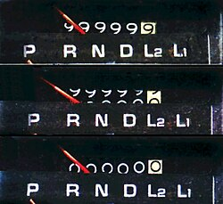

---

## Data Types and Sizes (Cont'd - 6)

### MSB (Most Significant Bit)

- 정수형 값을 표현하는 비트 중 가장 중요한 역할을 하는 비트
- 부호형 정수에서는 MSB가 **부호**를 결정
  - `1` in MSB → Negative number (**using two's complement**, `1000 0000` is `-128` )

| 7 (MSB) | 6 | 5 | 4 | 3 | 2 | 1 | 0 | Value (`signed char`) |
|---|---|---|---|---|---|---|---|------------------|
| 0 | 0 | 0 | 0 | 0 | 0 | 0 | 0 | `0`            |
| 0 | 0 | 0 | 0 | 0 | 0 | 0 | 1 | `1`            |
| 0 | 0 | 0 | 0 | 0 | 0 | 1 | 0 | `2`            |
| ... | ... | ... | ... | ... | ... | ... | ... | ... |
| 0 | 1 | 1 | 1 | 1 | 1 | 1 | 1 | `127`           |
| 1 | 0 | 0 | 0 | 0 | 0 | 0 | 0 | `-128`          |
| 1 | 0 | 0 | 0 | 0 | 0 | 0 | 1 | `-127`          |
| 1 | 0 | 0 | 0 | 0 | 0 | 1 | 0 | `-126`          |
| ... | ... | ... | ... | ... | ... | ... | ... | ... |
| 1 | 1 | 1 | 1 | 1 | 1 | 1 | 1 | `-1`            |

---

## Data Types and Sizes (Cont'd - 7)

- 무부호형 정수에서는 MSB가 **부호가 아닌 가장 큰 가중치**를 표현하는 데 사용됨
  - No negative numbers → `1000 0000` is `128`, `1111 1111` is `255`.

| 7 (MSB) | 6 | 5 | 4 | 3 | 2 | 1 | 0 | Value (`unsigned char`) |
|---|---|---|---|---|---|---|---|----------------------|
| 0 | 0 | 0 | 0 | 0 | 0 | 0 | 0 | `0`                |
| 0 | 0 | 0 | 0 | 0 | 0 | 0 | 1 | `1`                |
| 0 | 0 | 0 | 0 | 0 | 0 | 1 | 0 | `2`                |
| ... | ... | ... | ... | ... | ... | ... | ... | ... |
| 0 | 1 | 1 | 1 | 1 | 1 | 1 | 1 | `127`               |
| 1 | 0 | 0 | 0 | 0 | 0 | 0 | 0 | `128`               |
| 1 | 0 | 0 | 0 | 0 | 0 | 0 | 1 | `129`               |
| 1 | 0 | 0 | 0 | 0 | 0 | 1 | 0 | `130`               |
| ... | ... | ... | ... | ... | ... | ... | ... | ... |
| 1 | 1 | 1 | 1 | 1 | 1 | 1 | 1 | `255`               |

---

## Data Types and Sizes (Cont'd - 8)

### 음의 정수 표현 방법 1 - 부호화 절대치 (Sign-Magnitude)

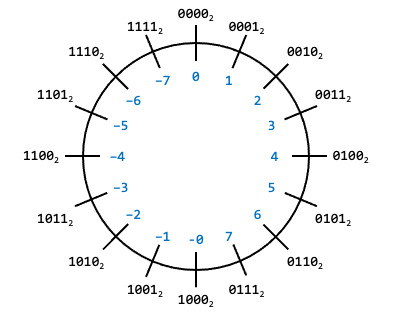

- MSB는 부호를 표현하고, 나머지 비트는 절대값을 저장
- **0을 표현하는 방법이 두 가지임**
- 음수를 처리하기 위해 **별도의 덧셈기가 필요**

```text
-5:   1101
+3:   0011
--------
    1 0000 ≠ -2 (1010)
```

---

## Data Types and Sizes (Cont'd - 9)

### 음의 정수 표현 방법 2 - 보수화 (Complement)

- 뺄셈을 컴퓨터 내부에서 쉽게 수행하기 위해 뺄셈을 덧셈으로 치환하는 과정
- *n*진수는 ***n*의 보수**와 ***n - 1*의 보수**를 사용할 수 있음
  - 10진수는 10의 보수와 9의 보수를, 2진수는 2의 보수와 1의 보수 사용 가능

### 임의의 *n*진수 *X*에 대한 *n - 1*의 보수

$(n^k - 1) - X, \quad \text{where } n \text{ is the base and } k \text{ is the number of digits}$

### 임의의 *n*진수 *X*에 대한 *n*의 보수

$n^k - X, \quad \text{where } n \text{ is the base and } k \text{ is the number of digits}$

---

## Data Types and Sizes (Cont'd - 10)

- 10진수에 대한 9의 보수 계산 예
  - e.g., `456` - `123`을 9의 보수를 사용해 계산
    1. `123`의 9의 보수 계산: `999` - `123` = `876` (*k* = 3)
    2. `456` + (`-123` = `123`의 9의 보수) 계산: `456` + `876` = `1,332`
    3. 가장 왼쪽 자리 (올림수, carry) 제거: `1,332` → `332`
    4. 제거한 올림수를 가장 오른쪽 자리에 더하여 보정: `332` + `1` = `333`

- 10진수에 대한 10의 보수 계산 예
  - e.g., `456` - `123`을 10의 보수를 사용해 계산
    1. `123`의 10의 보수 계산: `1,000` - `123` = `877` (*k* = 3)
    2. `456` + (`-123` = `123`의 10의 보수) 계산: `456` + `877` = `1,333`
    3. 가장 왼쪽 자리 (올림수, carry) 제거: `1,333` → `333`

---

## Data Types and Sizes (Cont'd - 11)

### 1의 보수 (1's Complement)

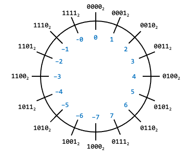

- 임의의 2진수 *X*의 모든 비트를 반전하여 1의 보수를 구할 수 있음
- **0을 표현하는 방법이 두 가지임**
- **추가 보정 작업이 필요할 수 있어 비효율적임**
- e.g., `5` (`0101`) - `3` (`0011`)을 1의 보수를 사용해 계산
  1. `3`의 1의 보수 계산: `1100`
  2. `5` + (`-3` = `3`의 1의 보수) 계산: `0101` + `1100` = `1 0001`
  3. 가장 왼쪽 자리 (올림수, carry) 제거: `1 0001` → `0001`
  4. 제거한 올림수를 가장 오른쪽 자리에 더하여 보정: `0001` + `1` = `0010`

---

## Data Types and Sizes (Cont'd - 12)

### 2의 보수 (2's Complement)

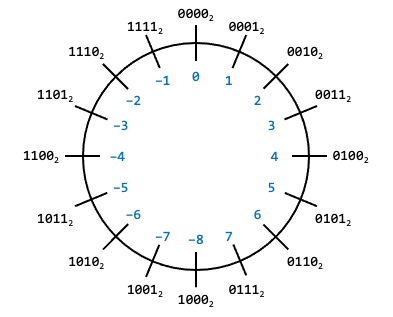

- 임의의 2진수 *X*의 모든 비트를 반전한 뒤 1을 더해 2의 보수를 구할 수 있음
  - 2의 보수는 1의 보수를 계산한 뒤 1을 더한 값
- **0을 유일하게 표현**
- **추가 보정 작업 불필요**
  - 하나의 덧셈기로 뺄셈과 덧셈을 **덧셈으로 일관되게** 처리할 수 있음
- e.g., `5` (`0101`) - `3` (`0011`)을 2의 보수를 사용해 계산
  1. `3`의 1의 보수 계산: `1100`
  2. `3`의 1의 보수로 변환한 값에 1을 더하여 2의 보수 계산: `1101`
  3. `5` + (`-3` = `3`의 2의 보수) 계산: `0101` + `1101` = `1 0010`
  4. 가장 왼쪽 자리 (올림수, carry) 제거: `1 0010` → `0010`

---

## Data Types and Sizes (Cont'd - 13)

### Integer Overflow

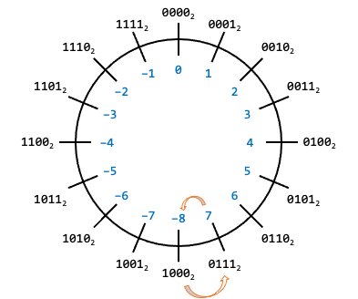

> The condition that occurs when a calculation produces a result that is greater in magnitude than that which a given register or storage location can store or represent.

- 연산 결과 값 (magnitude)이 **데이터 표헌 범위를 벗어날 경우** 오버플로우 발생
  - e.g., 값 표현에 4비트를 사용한다고 가정
    - 양수를 표현할 수 있는 비트의 범위는 `0000` ~ `0111`
    - 음수를 표현할 수 있는 비트의 범위는 `1000` ~ `1111`
  1. `+7` (`0111`)에 1을 더하면 오버플로우 발생 (`+8`을 표현하려면 한 비트가 더 필요함)
  2. `-8` (`1000`)에 1을 빼면 **오버플로우** 발생 (`-9`를 표현하려면 한 비트가 더 필요함)
    > NB: The term **underflow** normally refers to floating point numbers only!

---

## Data Types and Sizes (Cont'd - 14)

> Counting just 50,000 sheep should do the trick... What?

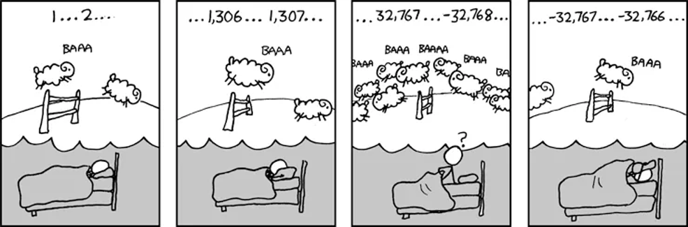

---

## Data Types and Sizes (Cont'd - 15)

> 다음 코드의 실행 결과는?

[//]: # (INCLUDE: ./c/02/precision.c)

```text
0.1 + 0.2 and 0.3 are NOT the same.
```

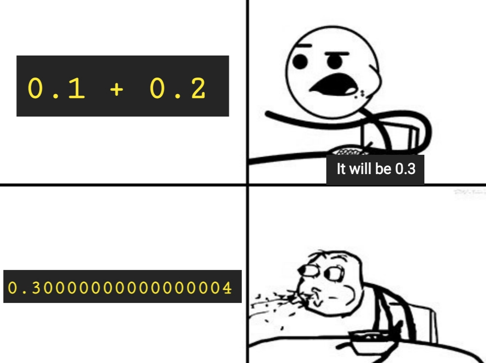

---

## Data Types and Sizes (Cont'd - 16)

### 고정소수점 (Fixed-Point)

- 실수 값을 표현하는 **비표준 방식**이며, 필요에 따라 정의해 사용할 수 있음
- 오차가 발생하지 않으나, **표현할 수 있는 값의 범위가 제한적인 방법**
e.g., 고정소수점을 표현하기 위한 1 byte, 2 bytes, 4 bytes 정의 예시

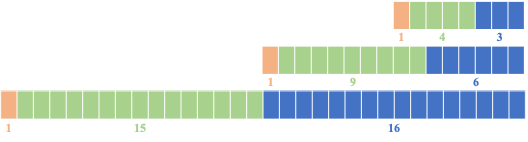

| Size | Sign | Integer Part | Fractional Part |
|----|----|-------------|---------------|
| 1 byte | 1 bit | 4 bits | 3 bits |
| 2 bytes | 1 bit | 9 bits | 6 bits |
| 4 bytes | 1 bit | 15 bits | 16 bits |

- e.g., 고정소수점을 사용해 `36.25`, `-36.25`를 2 bytes로 표현한 예

```text
        S.(1) |   Int.(9)   | Frac.(6)    Fixed-Point Representation
+36.25:   0   | 0 0010 0100 | 01 0000   ->      0000 1001 0001 0000
-36.25:   1   | 0 0010 0100 | 01 0000   ->      1000 1001 0001 0000
```

---

## Data Types and Sizes (Cont'd - 17)

### 부동소수점 (Floating-Point)

- 실수 값을 표현하는 **표준 방식**
  - [IEEE Standard for Floating-Point Arithmetic (IEEE 754)](https://en.wikipedia.org/wiki/IEEE_754)
  - `float` (single precision)
  - `double` (double precision)
  - `long double` (extended precision)
    - 표준에서 허용하는 범위 내에서 구현된 자료형
    - Implementation-defined behavior (컴파일러마다 동작이 상이할 수 있음)
- 고정소수점 방식에 비해 복잡하고 많은 연산을 요구함
- 오차가 발생할 수 있지만, **표현할 수 있는 값의 범위가 광범위함**

---

## Data Types and Sizes (Cont'd - 18)

### 단정도 부동소수점 (Single-Precision Floating-Point)


$$(-1)^S \times 1.M \times 2^{E - 127}$$

- **4 bytes**를 사용해 실수 데이터를 표현하는 방법
- 부호부 (*S*, sign)는 **1 bit**, 지수부 (*E*, exponent)는 **8 bits**, 가수부 (*M*, mantissa)는 **23 bits**를 사용
- 실수 데이터를 2진수로 변환한 뒤, **정규화**를 한 결과를 부호부, 지수부, 가수부에 표현
- e.g., 단정도 부동소수점을 사용해 `37.25`를 표현한 예

```text
- Integer Part                             : 10 0101
- Fractional Part                          :      01
- Fixed-Point Representation               : 10 0101.01
- Normalized Floating-Point Representation :       1.0010 101 × 2⁵
- IEEE 754 Floating-Point Representation   : (1). S:         0 (positive: 0, negative: 1)
                                             (2). E: 1000 0100 (E - 127 = 5, E = 132)
                                             (3). M:  001 0101 (fill the rest bits with 0)
                                           : 0100 0010 0001 0101 0000 0000 0000 0000
```

- 가수부는 실제 23 bits의 정밀도를 갖는게 아닌, **24 bits의 정밀도를 가짐**
  - 정규화된 형태는 1 bit가 암묵적으로 표현되므로, 이를 implicit bit 또는 hidden bit라고 부름

---

## Data Types and Sizes (Cont'd - 19)

### 단정도 부동소수점의 미리 정의된 형태

- *E* = `0`, *M* = `0`
  - 부동소수점에서 0 (`±0`)을 표현하는 방식 (부호 비트에 따라 `+0` 또는 `-0`)
- *E* = `0`, *M* ≠ `0`
  - 서브노멀 값 (subnormal number, denormalized number)을 표현: $(-1)^S \times 0.M \times 2^{-126}$
  - **연산 결과가 정규화된 최소값보다 작은 경우를 저장할 때 사용 (언더플로우)**
  - 정규화된 수와 달리 implicit bit (`1.XXX` 형태의 `1`)가 없으므로 정밀도가 더 낮음
  - 연산 결과가 서브노멀 값보다도 작을 경우 **0으로 처리됨 (flush to zero)**
- *E* = `1` ~ `254`, *M* = any value
  - 정규화된 수 (normalized number)를 표현: $(-1)^S \times 1.M \times 2^{E - 127}$
  - 일반적인 부동소수점 값을 저장할 때 사용
- *E* = `255`, *M* = `0`
  - **연산 결과가 표현할 수 있는 최대치를 초과해 오버플로우가 발생한 경우**
  - IEEE 754에서는 무한대 (`±∞`)로 처리됨 (부호 비트에 따라 `+∞` 또는 `-∞`)
- *E* = `255`, *M* ≠ `0`
  - `NaN` (not a number)
  - 정의되지 않은 연산 결과로 인해 숫자가 아닌 결과가 반환된 경우 (e.g., `0 / 0`, `∞ - ∞`, etc.)

---

## Data Types and Sizes (Cont'd - 20)

### 단정도 부동소수점에서 정규화된 값으로 표현할 수 있는 최대 및 최소값

$$(-1)^S \times 1.M \times 2^{E - 127}$$

- *S* = `0`, *E* = `254`, *M* = `1111111...111` (23 bits)
  - 가장 큰 정규화된 값 (양수): `+3.4028235 × 10³⁸`
- *S* = `0`, *E* = `1`, *M* = `0000000...000` (23 bits)
  - 가장 작은 정규화된 값 (양수): `+1.17549435 × 10⁻³⁸`
- *S* = `1`, *E* = `254`, *M* = `1111111...111` (23 bits)
  - 가장 큰 정규화된 값 (음수): `-3.4028235 × 10³⁸`
- *S* = `1`, *E* = `1`, *M* = `0000000...000` (23 bits)
  - 가장 작은 정규화된 값 (음수): `-1.17549435 × 10⁻³⁸`

### 단정도 부동소수점에서 서브노멀 값으로 표현할 수 있는 최대 및 최소값

$$(-1)^S \times 0.M \times 2^{-126}$$

- *S* = `0`, *E* = `0`, *M* = `0000000...001` (맨 마지막 비트만 1)
  - 가장 작은 서브노멀 값 (양수): `+1.40129846 × 10⁻⁴⁵`
- *S* = `1`, *E* = `0`, *M* = `0000000...001` (맨 마지막 비트만 1)
  - 가장 큰 서브노멀 값 (음수): `-1.40129846 × 10⁻⁴⁵`

---

## Data Types and Sizes (Cont'd - 21)

### 배정도 부동소수점 (Double-Precision Floating-Point)


$$(-1)^S \times 1.M \times 2^{E - 1023}$$

- **8 bytes**를 사용해 실수 데이터를 표현하는 방법  
- 부호부 (*S*, sign)는 **1 bit**, 지수부 (*E*, exponent)는 **11 bits**, 가수부 (*M*, mantissa)는 **52 bits**를 사용  
- 실수 데이터를 2진수로 변환한 뒤, **정규화**를 한 결과를 부호부, 지수부, 가수부에 표현  
- e.g., 배정도 부동소수점을 사용해 `37.25`를 표현한 예

```text
- Integer Part                             : 10 0101
- Fractional Part                          :      01
- Fixed-Point Representation               : 10 0101.01
- Normalized Floating-Point Representation :       1.0010 101 × 2⁵
- IEEE 754 Floating-Point Representation   : (1). S:              0
                                             (2). E:  100 0000 0100
                                             (3). M:       001 0101
                                           : 0100 0000 0100 0010 1010 .... 0000
```

- 가수부는 실제 52 bits의 정밀도를 갖는 게 아닌, **53 bits의 정밀도를 가짐**  

---

## Data Types and Sizes (Cont'd - 22)

### 배정도 부동소수점의 미리 정의된 형태

- *E* = `0`, *M* = `0`  
  - 부동소수점에서 **0** (`±0`)을 표현하는 방식 (부호 비트에 따라 `+0` 또는 `-0`)  
- *E* = `0`, *M* ≠ `0`  
  - 서브노멀 값 (subnormal number, denormalized number)을 표현:  
    $$(-1)^S \times 0.M \times 2^{-1022}$$  
  - **연산 결과가 정규화된 최소값보다 작은 경우를 저장할 때 사용 (언더플로우)**  
  - 정규화된 수와 달리 **implicit bit**가 없으므로 정밀도가 더 낮음  
  - 연산 결과가 서브노멀 값보다도 작을 경우 **0으로 처리됨 (flush to zero)**  
- *E* = `1` ~ `2046`, *M* = any value  
  - 정규화된 수 (normalized number)를 표현:  
    $$(-1)^S \times 1.M \times 2^{E - 1023}$$  
  - 일반적인 부동소수점 값을 저장할 때 사용  
- *E* = `2047`, *M* = `0`  
  - **연산 결과가 표현할 수 있는 최대치를 초과해 오버플로우가 발생한 경우**  
  - IEEE 754에서는 무한대 (`±∞`)로 처리됨 (부호 비트에 따라 `+∞` 또는 `-∞`)  
- *E* = `2047`, *M* ≠ `0`  
  - **NaN** (Not a Number)  
  - 정의되지 않은 연산 결과로 인해 숫자가 아닌 결과가 반환된 경우 (e.g., `0 / 0`, `∞ - ∞`, etc.)

---

## Data Types and Sizes (Cont'd - 23)

### 배정도 부동소수점에서 정규화된 값으로 표현할 수 있는 최대 및 최소값

$$(-1)^S \times 1.M \times 2^{E - 1023}$$

- *S* = `0`, *E* = `2046`, *M* = `111111...111` (52 bits)  
  - 가장 큰 정규화된 값 (양수): `+1.7976931348623157 × 10³⁰⁸`  
- *S* = `0`, *E* = `1`, *M* = `000000...000` (52 bits)  
  - 가장 작은 정규화된 값 (양수): `+2.2250738585072014 × 10⁻³⁰⁸`  
- *S* = `1`, *E* = `2046`, *M* = `111111...111` (52 bits)  
  - 가장 큰 정규화된 값 (음수): `-1.7976931348623157 × 10³⁰⁸`  
- *S* = `1`, *E* = `1`, *M* = `000000...000` (52 bits)  
  - 가장 작은 정규화된 값 (음수): `-2.2250738585072014 × 10⁻³⁰⁸`

### 배정도 부동소수점에서 서브노멀 값으로 표현할 수 있는 최대 및 최소값

$$(-1)^S \times 0.M \times 2^{-1022}$$

- *S* = `0`, *E* = `0`, *M* = `000000...001` (맨 마지막 비트만 1)
  - 가장 작은 서브노멀 값 (양수): `+4.9406564584124654 × 10⁻³²⁴`  
- *S* = `1`, *E* = `0`, *M* = `000000...001` (맨 마지막 비트만 1)
  - 가장 큰 서브노멀 값 (음수): `-4.9406564584124654 × 10⁻³²⁴`

---

## Data Types and Sizes (Cont'd - 24)

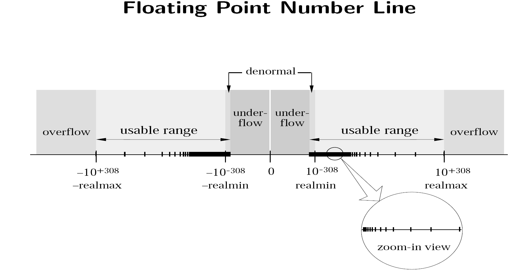

---

## Data Types and Sizes (Cont'd - 25)

### 상황 별 실수형 데이터 표현

#### 고정소수점

- 값에 오차가 발생하면 안 되는 경우 (e.g., 은행, 군사 무기체계, etc.)
  - **오차가 발생하지 않음**
  - 값의 표현 범위가 넓어질수록 메모리 사용량이 증가하는 구조

#### 단정도 부동소수점

- 가장 보편적인 방법
  - **연산 속도가 배정도 부동소수점보다 빠름**

#### 배정도 부동소수점

- 단정도 부동소수점보다 **높은 정밀도**를 필요로 하거나, 단정도 부동소수점으로 표현할 수 없는 값을 표현해야 할 경우
  - **연산 속도가 단정도 부동소수점보다 느림**

---

## Data Types and Sizes (Cont'd - 26)

[//]: # (INCLUDE: ./c/02/02.c)

---

## Data Types and Sizes (Cont'd - 27)

```text
A single-precision only has about 7 decimal digits of precision.
before:  9999876.0, after:  9999876.0
before: 99998765.0, after: 99998768.0

16777216.0, 16777216.5, 16777217.0 are represented exactly by the same value in the single-precision data type.
before: 16777216.0, after: 16777216.0
before: 16777216.5, after: 16777216.0
before: 16777217.0, after: 16777216.0
before: 16777218.0, after: 16777218.0

27.1  (may be simply 271/10) cannot be expressed as 2^n.
27.1  (precision is  6): 27.100000
27.1  (precision is  8): 27.10000038
27.1  (precision is 10): 27.1000003815
```

---

## Data Types and Sizes (Cont'd - 28)

### 올바른 실수 값 비교 방법

- `float` 형의 기계 앱실론 (machine epsilon, 이론적으로 표현 가능한 가장 작은 상대 오차값)은 1.19 × 10⁻⁷
  - 실제 계산에서는 오차가 더 누적되므로, 허용 오차는 1 × 10⁻⁵, (`1e-5`) 사용
- `double` 형의 기계 앱실론은 2.22 × 10⁻¹⁶
  - 실제 계산에서는 오차가 더 누적되므로, 허용 오차는 1 × 10⁻¹² ~ 1 × 10⁻¹⁴ (`1e-12` ~ `1e-14`) 사용

```c
#include <stdio.h>

#define ABS(x) ((x) * ((x > 0) - (x < 0)))

int main(void)
{
    float a = 0.0f;
    float b = 1.0f;

    for (int i = 0; i < 10; ++i)
        a = a + 0.1f;

    if (a == b)
        printf("a == b (same)\n");

    if (ABS(a - b) < 1e-5f)
        printf("ABS(a - b) < 1e-5 (same)\n");

    return 0;
}
```

---

## Data Types and Sizes (Cont'd - 29)

### The Patriot Missile Failure


> On February 25, 1991, during the Gulf War, an American Patriot Missile battery in Dharan, Saudi Arabia, failed to track and intercept an incoming Iraqi Scud missile.
> The Scud struck an American Army barracks, killing 28 soldiers and injuring around 100 other people.
> It turns out that the cause was *an inaccurate calculation of the time since boot due to computer arithmetic errors*.

- 시스템은 내부 클럭 주기를 기준으로 시간을 계산하는 방식이었음
  - 이 시스템의 클럭은 0.1초 단위로 동작하며, 매 tick마다 누적된 tick 수에 `0.1`을 곱해 실제 경과 시간을 계산
- 시스템은 24비트 고정소수점 방식으로 실수를 표현
  - 부호부, 가수부 없이 실수부만을 표현하는 방식 (`0.xxx`)
- `0.1`을 곱하는 과정에서 오차가 누적되었음:
  1. `0.1`을 2진수로 재표현하면 `0.0001 1001 1001 1001 ...` (순환 소수 형태)
  2. `0.1`을 24비트 고정소수점 방식으로 표현하면 `0.0001 1001 1001 1001 1001 1001`
  3. 매 tick마다 누적되는 오차는 약 `0.0000 0000 0000 0000 0000 0000 1001 ...` ≈ 0.0000 0009 5 초
  4. 시스템이 100 시간 경과할 경우 누적되는 오차는 약 0.34 초
- 당시 scud missile의 속도는 초당 1,676 m
  - **누적 오차가 약 0.34 초라고 가정한다면, 미사일은 약 570 m를 이동하게 됨**

---

## Constants

### 정수형 상수

- 기본 진법은 10진법이며, 접두사를 사용해 8진법 또는 16진법 표현 가능

| Prefix | Meaning              | Base | Example     |
|--------|----------------------|------|-------------|
| (none) | Decimal (base 10)    | 10   | `123`       |
| `0`    | Octal (base 8)       | 8    | `0755`      |
| `0x` / `0X` | Hexadecimal (base 16) | 16  | `0x1A3F`    |

- 기본 자료형은 `int` 형이며, 접미사를 통해 다른 자료형 표현 가능
  - `long` 자료형 표현 시 소문자 `l`은 숫자 `1`과 비슷하므로, 혼동 방지를 위해 **대문자 `L` 사용 권장**

| Suffix     | Type                      | Description                      | Example      |
|------------|---------------------------|----------------------------|--------------|
| (none)     | `int`                     | 기본 자료형                  | `123`        |
| `U` / `u`  | `unsigned int`            | 무부호형 정수             | `123U`       |
| `L` / `l`  | `long`                | 기본 자료형보다 더 넓은 수 표현 | `123L`       |
| `UL` / `ul` / `Ul` / `uL` / `LU` / `lu` / etc. | `unsigned long` | 순서 상관없음, 대소문자 섞기 가능 | `123UL` |

---

## Constants (Cont'd - 1)

### 실수형 상수

- 기본 자료형은 `double` 형이며, 접미사를 통해 다른 자료형 표현 가능
  - `long double` 자료형 표현 시 소문자 `l`은 숫자 `1`과 비슷하므로, 혼동 방지를 위해 **대문자 `L` 사용 권장**

| Suffix   | Type           | Description                              | Example   |
|----------|----------------|------------------------------------------|-----------|
| (none)   | `double`       | 기본 자료형   | `3.14`    |
| `f` / `F`| `float`        | 단정도 부동소수점            | `3.14f`   |
| `l` / `L`| `long double`  | 배정도 부동소수점         | `3.14L`   |

---

## Constants (Cont'd - 2)

### 문자 상수

- `'A'`, `'1'`, `'\n'`처럼 작은 따옴표로 감싼 값
- **프로그램은 문자 상수를 정수형 값으로 처리**
  - 문자 인코딩 표 (e.g., ASCII, EBCDIC, etc.)를 참조해 특정 정수 값으로 대응

#### 문자 상수 사용 시 주의사항

- 문자 상수 표현 시 반드시 문자 상수를 쓸 것

[//]: # (INCLUDE: ./c/02/constants_1_ignore.c)

- 1번 문장은 문자 상수 `'A'`를 현재 사용중인 시스템의 문자 인코딩 표를 참조하여 특정 정수 값으로 변환
  - ASCII를 사용하는 시스템에서는 `0x41` (`65`)
  - EBCDIC를 사용하는 시스템에서는 `0xC1` (`193`)
- **2번 문장은 ASCII를 문자 인코딩 표준으로 사용하는 시스템에서만 유효한 문장**
  - 특정 문자 인코딩 표준에 종속되므로 다른 문자 인코딩을 사용하는 시스템에서 사용 불가

---

## Constants (Cont'd - 3)


### 이스케이프 시퀀스 - 터미널 동작 제어

| Escape Sequence | Meaning                         | ASCII Code (Decimal) |
|------------------|----------------------------------|-----------------------|
| `\a`             | Bell (alert)                     | `7`                     |
| `\b`             | Backspace                        | `8`                    |
| `\f`             | Form feed                        | `12`                   |
| `\n`             | Newline (line feed)              | `10`                  |
| `\r`             | Carriage return                  | `13`                 |
| `\t`             | Horizontal tab                   | `9`                    |
| `\v`             | Vertical tab                     | `11`                   |

---

## Constants (Cont'd - 4)

### 이스케이프 시퀀스 - 리터럴 문자 표현

| Escape Sequence | Meaning                         | ASCII Code (Decimal) |
|------------------|----------------------------------|-----------------------|
| `\\`             | Backslash                        | `92`                    |
| `\'`             | Single quote                     | `39`                    |
| `\"`             | Double quote                     | `34`                    |
| `\?`             | Question mark                    | `63`                    |
| `\0`             | Null character                   | `0`                     |

[//]: # (INCLUDE: ./c/02/constants_2_ignore.c)

```text
This is a backslash: \, single quote: ', double quote: " and question mark: ?,
with null character at the end
'|
??!
```

---

## Constants (Cont'd - 5)

### 이스케이프 시퀀스 - 숫자 기반 문자 인코딩

| Escape Sequence | Meaning                         | ASCII Code (Decimal) |
|------------------|----------------------------------|-----------------------|
| `\ooo`           | Octal value (e.g., `\132`)       | up to `255`             |
| `\xhh`           | Hex value (e.g., `\x41`)          | up to `255`            |

[//]: # (INCLUDE: ./c/02/constants_3_ignore.c)

---

## Constants (Cont'd - 6)

### 상수 표현식 (Constant Expressions)

- 표현식 중 일부는 반드시 상수를 사용해 표현해야 함
  - 상수 표현은 컴파일 시 값이 결정되어 있는 상태 (compile time)
  - 변수는 런타임 시 값이 결정되는 상태 (runtime)

[//]: # (INCLUDE: ./c/02/constants_4_ignore.c)

---

## Constants (Cont'd - 7)

### 문자열 상수 (String Constants or String Literals)

- `"Hello"`, `""`처럼 큰 따옴표로 감싼 값
- 문자열 상수는 문자열 내에 문자가 존재하지 않거나 하나 이상의 문자가 구성될 수 있음
- 문자열로 큰 따옴표(`"`)를 표현해야 할 경우 이스케이프 문자를 사용해 표현해야 함 (`\"`)
- 문자열 상수의 나열은 컴파일 시 하나의 문자열로 연결됨

[//]: # (INCLUDE: ./c/02/constants_5_ignore.c)

- `char` 형 배열은 문자열 상수를 보관할 수 있으며, 마지막 배열 원소는 반드시 널 문자 (`'\0'`)로 저장되어야 함
  - 보관할 문자열의 길이가 `SIZE`라면, `char` 형 배열은 최소 `SIZE + 1` 크기 이상이여야 함
- 다음 주어진 두 표현 `'x'`와 `"x"`는 **같지 않음**
  - `'x'`는 정수로 표현되는 문자 상수
  - `"x"`는 `'x'`, `'\0'`으로 표현되는 문자열 상수

---

## Constants (Cont'd - 8)

### 널 문자를 활용한 예 - 표준 함수 `strlen`

[//]: # (INCLUDE: ./c/02/06.c)

[//]: # (INCLUDE: ./c/02/06_example.c)

---

## Constants (Cont'd - 9)

### 열거 상수 (Enumeration Constants)

- 키워드 `enum`을 사용해 여러 개의 정수형 상수를 선언할 수 있음
- 열거된 이름에 값을 지정하지 않을 경우 다음 규칙을 따름:
  1. 열거된 이름에 값이 지정되지 않은 경우 이전 이름의 값보다 1 큰 값을 가진다.
  2. 만약 첫 번째로 열겨된 이름에 값이 지정되지 않았다면 값 0을 갖는다.
- 열거된 이름들은 고유해야 하지만, 각 이름은 같은 값을 가질 수 있음

[//]: # (INCLUDE: ./c/02/constants_6_ignore.c)

---

## Declarations

- 코드 내 등장하는 이름 (함수, 변수, etc.)는 사용 전에 반드시 선언되어야 함

[//]: # (INCLUDE: ./c/02/declarations_1_ignore.c)

- 첫 번째 단락은 줄을 적게 사용하여 선언하는 형태
- 두 번째 단락은 줄을 많이 사용하나, 선언 수정 또는 선언 별 주석 첨부가 용이한 형태

### 변수에서의 선언

- 변수는 선언과 동시에 **초기화** (initialization)할 수 있으며, 초기화 구문 (initialization syntax)은 다음과 같음:

```text
declarator = initializer;  ← NB: '=' is not an assignment operator
```

[//]: # (INCLUDE: ./c/02/declarations_2_ignore.c)

---

## Declarations (Cont'd)

### 지역 변수 선언

- 지역 변수 (local variable or automatic variable)는 선언 시 쓰레기 값 (undefined value)을 갖는 변수가 생성됨
- 지역 변수 초기화에 사용하는 초기치 (initializer)에는 아무 표현식이나 사용 가능

### 전역 변수 선언

- 전역 변수는 선언 시 0으로 초기화된 변수가 생성됨
- 전역 변수 초기화에 사용하는 초기치에는 **상수 표현식**만 사용 가능

### 한정사 `const`

- 변수 선언 시 한정사 `const`를 사용할 경우 **읽기 전용 변수**가 생성됨

[//]: # (INCLUDE: ./c/02/declarations_3_ignore.c)

---

## Operators

### 산술 연산자 (Arithmetic Operators)

- `+`, `-` 연산자는 `*`, `/`, `%` 연산자보다 우선순위가 낮음

| Operator | Description    | Example   | Result| Associativity |
|----------|--------------|-----------|---------|--------|
| `+`      | Addition       | `5 + 3` | `8`     |Left-to-right|
| `-`      | Subtraction    | `5 - 3` | `2`     |Left-to-right|
| `*`      | Multiplication | `5 * 3` | `15`    |Left-to-right|
| `/`      | Division       | `6 / 3` | `2`     |Left-to-right|
| `%`      | Modulus        | `7 % 4` | `3`     |Left-to-right|

---

## Operators (Cont'd - 1)

### 나눗셈 연산

- 정수끼리의 나눗셈 연산 결는 **소수점 이하를 버린 몫**만 남음에 유의
  - e.g., `7 / 4` → `1`
- 음수 나눗셈 연산 결과는 **확정할 수 없음**
  - 결과는 기계 종속적
  - e.g., `-111 / 10` 결과는 `-11` 또는 `-12`
    - 기계에 따라 `-111`을 `(-11 * 10) + (-1)` 또는 `(-12 * 10) + (9)`로 계산함

### 나머지 연산

- 나머지 연산은 두 정수 값을 나누었을 때의 **나머지**를 반환
  - e.g., `7 % 4` → `3`
- 나머지 연산의 두 피연산자는 **반드시 정수형**이여야 함
  - `float` 또는 `double` 형에 대해 `%` 연산자는 사용할 수 없음
- 음수 나눗셈 연산 결과는 **확정할 수 없음**
  - 결과는 기계 종속적
  - ANSI C는 피제수 *a*에 대하여 나머지 연산이 다음 식을 만족하도록 구현됨:
    - `a == (a / b) * b + (a % b)`
  - e.g., `-111 / 10` 결과는 `-1` 또는 `9`
    - 몫 `(a / b)`: `-11`, 제수 `b`: `10`, 나머지 `(a % b)`: `-1`
    - 몫 `(a / b)`: `-12`, 제수 `b`: `10`, 나머지 `(a % b)`: `9`

---

## Operators (Cont'd - 2)

### 관계 연산자 (Relational Operators)

- 관계 연산자는 산술 연산자보다 **우선순위가 낮음**
  - 다음 표현식 `idx < size - 1`은 `idx < (size - 1)`로 평가됨

| Operator | Description    | Example   | Associativity |
|--------|------|------|-----|
| `==` | Equal to | `a == b` |Left-to-right|
| `!=` | Not equal to | `a != b` |Left-to-right|
| `<`  | Less than | `a < b` |Left-to-right|
| `>`  | Greater than | `a > b` |Left-to-right|
| `<=` | Less than or equal to | `a <= b` |Left-to-right|
| `>=` | Greater than or equal to | `a >= b` |Left-to-right|

---

## Operators (Cont'd - 3)

### 논리 연산자 (Logical Operators)

- 논리 연산자는 관계 연산자보다 우선순위가 낮음

| Operator | Description    | Example   | Associativity |
|--------|------|------|-----|
| `&&` | Logical and | `c >= '0' && c <= '9'` | Left-to-right|
| `⎮⎮` | Logical or | `(c == ' ') ⎮⎮ (c == '\n') ⎮⎮ (c == '\t')` |Left-to-right|

- Short-circuit evaluation (SCE) 적용:
  - `&&`: 현재 항의 계산 결과가 거짓이면 즉시 계산을 중지하고 전체 항을 거짓으로 평가
  - `⎮⎮`: 현재 항의 계산 결과가 참이면 즉시 계산을 중지하고 전체 항을 참으로 평가

#### 관계 / 논리 연산의 평가 결과

- 평가 결과는 항상 `0` (거짓) 또는 `1` (참)
- `if`, `while`, `for` 등에서 조건 표현식의 값은 **`0`이면 거짓, 그 외 값은 참**으로 처리함

[//]: # (INCLUDE: ./c/02/operators_1_ignore.c)

---

## Operators (Cont'd - 4)

### 전위 증감 연산자 (Prefix Increment and Decrement Operators)

| Operator | Description                  | Example | Associativity   |
|----------|------------------------------|---------|-----------------|
| `++`      | Increments the value first   | `++i`     | Right-to-left   |
| `--`      | Decrements the value first   | `--i`     | Right-to-left   |

### 후위 증감 연산자 (Postfix Increment and Decrement Operators)

| Operator | Description                           | Example | Associativity   |
|----------|---------------------------------------|---------|-----------------|
| `++`      | Uses the value first, then increments | `i++`     | Right-to-left   |
| `--`      | Uses the value first, then decrements | `i--`     | Right-to-left   |

```c
/* ++i: Increments the value first */
i = i + 1;
return i;

/* i++: Uses the value first, then increments */
int temp = i;
i = i + 1;
return temp;
```

---

## Operators (Cont'd - 5)

### 전위/후위 사용 예제

```c
int a, b;

b = 3;
a = b++; /* a = 3, b = 4 */
a = b;   /* a = 4, b = 4 */
a = ++b; /* a = 5, b = 5 */
```

### 증감 연산자를 활용한 예 - 사용자 정의 함수 `squeeze`

[//]: # (INCLUDE: ./c/02/12.c)

---

## Operators (Cont'd - 6)

### 증감 연산자를 활용한 예 - 표준 함수 `strcat`

[//]: # (INCLUDE: ./c/02/13.c)

[//]: # (INCLUDE: ./c/02/13_example.c)

---

## Operators (Cont'd - 7)

### 비트 연산자 (Bitwise Operators)

- 비트 연산자는 피연산자에 대해 비트 연산을 수행하며, **피연산자는 반드시 정수형이여야 함**
  - 실수형 피연산자는 사용 불가하며, `char` 또는 `short` 형은 **암묵적으로 `int`형이 됨 (integral promotions)**
- 이동 연산 (`<<`, `>>`) 시 좌측 피연산자는 **부호 여부에 따라 결과가 달라지며**, 우측 피연산자는 **반드시 0 이상**이여야 함
  - **우측 피연산자가 음수일 경우 UB (undefined behavior)**
- 왼쪽 이동 연산은 비트를 왼쪽으로 이동시키며, 오른쪽은 항상 `0`으로 채워짐 (논리 이동)
  - **부호형 정수의 왼쪽 이동 연산 결과가 표현 범위를 넘으면 UB (undefined behavior)**
- 오른쪽 이동 연산은 비트를 오른쪽으로 이동시키며, 왼쪽은 **좌측 피연산자의 부호 여부에 따라 달라짐**
  - 무부호형 정수의 오른쪽 이동 시 왼쪽은 항상 `0`으로 채워짐 (논리 이동)
  - 부호형 정수의 오른쪽 이동 시 왼쪽은 **구현된 정의를 따름 (implementation-defined)** (보통 산술 이동을 채택)

| Operator | Description                  | Example | Associativity   |
|---|---|---|---|
| `&`        | Bitwise AND               | `a & b` | Left-to-right |
| `⎮`       | Bitwise OR                | `a ⎮ b` | Left-to-right |
| `^`       | Bitwise XOR               | `a ^ b` | Left-to-right |
| `<<`       | Left shift (logical)      | `a << b` | Left-to-right |
| `>>`       | Right shift (logical or arithmetic) | `a >> b` | Left-to-right |
| `~`        | One's complement (bitwise NOT) | `~a` | Right-to-left |

---

## Operators (Cont'd - 8)

### 비트 연산자 예제

[//]: # (INCLUDE: ./c/02/14.c)

---

## Operators (Cont'd - 9)

### 비트 연산자를 활용한 비트 마스킹

[//]: # (INCLUDE: ./c/02/15.c)

---

## Operators (Cont'd - 10)

### 비트 마스킹을 활용한 예 - 사용자 정의 함수 `getbits`

[//]: # (INCLUDE: ./c/02/16.c)

```text
x: 0110 1101 (binary)
p: 4         (decimal)
n: 3         (decimal)

1. p + 1 - n = 2
2. x >> 2 = 0001 1011
3. ~0 << n = 1111 1111 1111 1111 1111 1111 1111 1000
4. ~(1111 1111 1111 1111 1111 1111 1111 1000)
   = 0000 0000 0000 0000 0000 0000 0000 0111
```

---

## Operators (Cont'd - 11)

### 지정 연산자 (Assignment Operators)

- 지정 연산자는 대입 연산자 (`=`)와 복합 대입 연산자 (`op=`)가 있음
- 복합 대입 연산자의 형태 `exp1 op= exp2`는 `exp1 = exp1 op exp2` 형태의 축약 표현
- 복합 대입 연산자의 형태 중 `op`에는 이항 연산자가 사용될 수 있음
  - `+`, `-`, `*`, `/`, `%`, `>>`, `<<`, `&`, `^`, `⎮`
  - **관계 연산자, 논리 연산자, 비트 부정 연산자는 사용 불가**
- 복합 대입 연산자는 표현을 간결하게 해주며, 특히 아래의 경우처럼 피연산자의 식별자가 복잡한 경우 유용함

```c
yyval[yypv[p3+p4] + yypv[p1]] = yyval[yypv[p3+p4] + yypv[p1]] + 2;
yyval[yypv[p3+p4] + yypv[p1]] += 2;
```

- **산술 연산자, 관계 연산자보다 우선순위가 낮음**

```c
x *= y + 1;
/* 
 * 1. x *= (y + 1)
 * 2. x = x * (y + 1)
 */

if (x >>= y != 0) { /* do something */ }
/* 
 * 1. x >>= (y != 0)
 * 2. x = x >> (y != 0)
 */
```

---

## Operators (Cont'd - 12)

### 지정 연산자를 활용한 예 - 사용자 정의 함수 `bitcount`

[//]: # (INCLUDE: ./c/02/17.c)

[//]: # (INCLUDE: ./c/02/18.c)

---

## Type Promotions

### ANSI C (C89) §3.2.1.1 "Integral Promotions" (정수 승격)

> A "char", a "short int", or an enumerated type may be used in an expression whenever an "int" or "unsigned int" may be used. If an "int" can represent all values of the original type, the value is converted to an int; otherwise, it is converted to an unsigned int.

- 정수 승격은 표현식을 평가할 때 **항상** 발생
- 정수 승격 시 **데이터 모델**에 따라 자료형 표현 범위가 다르므로 다음 **조건**에 따라 발생
  - 변환되어야 할 자료형의 값을 `int` 형으로 원본 값을 표현할 수 있다면 `int`로 승격
  - 그렇지 않다면 `unsigned int`로 승격

```c
char a = 127;
char b = 127;
short c = a + b;  /* 1. a + b -> (int) a + (int) b = 254 (to prevent overflow)
                     2. short c = (short) 254 */
```

```c
/* Assume that both short and int are 2-byte data types. */
unsigned short x = 65535;  /* USHRT_MAX */
int i = x;  /* An int can't represent `x`; it's converted to an unsigned int */
```

---

## Type Promotions (Cont'd)

### ANSI C (C89) §3.2.1.5 — "Floating Promotions" (실수 승격)

> A float expression may be promoted to double when used in an expression.

- 실수 승격은 가변 인자 함수로 `float` 형 전달인자를 전달할 때 발생
- 실수 승격 시 배정도 부동소수점은 항상 단정도 부동소수점보다 높은 정밀도를 가지므로 조건 없이 `double` 형으로 승격됨

```c
/* Although 'f' is a float, when passed to printf (a variadic function),
   it is promoted to double. So we must use %f, not %lf. */
printf("float promoted to double: %f\n", f);

/* double works the same way here */
double d = 2.718;
printf("double remains double: %f\n", d);
```

---

## Type Conversions

- 서로 다른 자료형의 피연산자 간 연산이 수행되면 형 변환이 발생함
- 정수 승격, 실수 승격을 포함하는 더 포괄된 개념
  - e.g., 정수형을 실수형으로, 또는 실수형을 정수형으로 변환

### 자동 형 변환 (Implicit Conversion, Automatic Conversion)

```c
int a = 'A';     /* Converting a narrower operand into a wider one is ok */
char c = 12345;  /* Convertint a wider operand into a narrower one like this
                    could cause information to be lost (Warning) */
```

### 명시적 형 변환 (Explicit Conversion)

- `(type) expression` 형태를 사용하면 `expression` 형을 `type` 으로 형 변환
  - `(type)`은 **형 변환 연산자 (type conversion operator)**
    - 결합 방향은 오른쪽에서 왼쪽
- 사용자가 직접 지정함에 따라 의도를 명확하기 표현할 수 있으며, 정보 손실 가능성 존재
  - **사용자가 명시적으로 형 변환을 할 경우 정보 손실 발생 시 경고를 출력하지 않음**

```c
float pi = (float) 3.14;
int area = (int) (11 * 11 * pi);  /* decimal dropped,
                                     but warning is suppressed */
```

---

## Type Conversions (Cont'd - 1)

### 형 변환을 활용한 예 - 표준 함수 `atoi`

- 문자는 하나의 정수 값으로 표현됨 (e.g. 문자 상수 `'A'`는 **정수 승격에 의해** 정수 값 `65`를 의미)
  - 문자 상수와 정수형 상수를 같이 사용할 수 있는 이유

[//]: # (INCLUDE: ./c/02/08.c)

[//]: # (INCLUDE: ./c/02/08_example.c)

---

## Type Conversions (Cont'd - 2)

### 형 변환을 활용한 예 - 표준 함수 `tolower` (ASCII 기준)

[//]: # (INCLUDE: ./c/02/09.c)

[//]: # (INCLUDE: ./c/02/09_example.c)

---

## Type Conversions (Cont'd - 3)

### 암묵적 산술 형 변환 (Implicit Arithmetic Conversion)

- 서로 다른 산술형 간 연산 (binary arithmetic operations)이 일어날 때 다음 규칙 적용:
  1. 정수 승격
      - `char`, `signed char`, `unsigned char`, `short`, `unsigned short`, `enum` 형은 `int` 또는 `unsigned int` 형으로 승격
  2. 산술 형 변환
      1. 두 피연산자 중 하나라도 `long double` 형이면 둘 다 `long double` 형으로 변환
      2. 그렇지 않고 하나라도 `double` 형이면 둘 다 `double` 형으로 변환
      3. 그렇지 않고 하나라도 `float` 형이면 둘 다 `float` 형으로 변환
  3. 정수 변환 - 변환 순위 (rank, `int` < `long`)와 부호 여부 (signedness)를 고려하여 변환
      1. 두 피연산자 중 하나라도 `unsigned` 형이면서 `unsigned` 형 변환 순위가 `signed` 형보다 높거나 같다면 `signed` 형은 `unsigned` 형으로 변환
      2. 그렇지 않고 하나라도 `unsigned` 형이면서 `signed` 형 변환 순위가 `unsigned` 형보다 높다면 `unsigned` 형은 `signed` 형으로 변환
      3. 그렇지 않고 하나라도 `unsigned` 형이면서 `signed` 형 변환 순위가 `unsigned` 형보다 높지만 `signed` 형이 `unsigned` 형의 모든 값을 표현할 수 없다면 둘 다 `unsigned` 형 중에서 더 높은 변환 순위로 변환
      4. 그렇지 않고 두 피연산자가 모두 `unsigned` 형이라면 더 높은 변환 순위로 변환

---

## Type Conversions (Cont'd - 4)

[//]: # (INCLUDE: ./c/02/type_conversion.c)

---

## Type Conversions (Cont'd - 5)

### 대입 시 암묵적 형 변환

- 대입 연산에서 좌변 (l-value)과 우변 (r-value)의 형이 다르면 우변이 좌변의 형으로 변환됨
  - 실수 형에서 정수 형으로 변환 시 소수 부분은 버려짐
  - `double` 형에서 `float` 형 변환 시 오차가 발생할 수 있음 (정밀도가 부족한 경우 반올림 발생)

```c
int i = 256;
char c = 'A';     /* ASCII 'A' = 65 */
float f = 3.14;

c = i;  /* c = 0 (overflow) */
i = c;  /* i = 0 */
i = f;  /* i = 3 (decimal dropped) */
f = i;  /* f = 3.0 */
```

---

## Type Conversions (Cont'd - 6)

### 명시적 형 변환을 활용한 예 - 표준 함수 `rand`, `srand`

[//]: # (INCLUDE: ./c/02/11.c)

[//]: # (INCLUDE: ./c/02/11_example.c)

---

## Conditional Expressions

### 삼항 연산자 (Ternary operator)

- 삼항 연산자의 형태 `condition ? expr_if_true : expr_if_false`는 `if` 조건문을 축약한 형태
- `expr_if_true`와 `expr_if_false`의 형이 다르다면, 형 변환 법칙이 적용됨

```c
int n = 100;
float f = 3.14;

(n > 0) ? f : n;  /* the evaluated type is float */
```

- 표현식이 등장할 수 있는 곳이라면 어디든 사용 가능

```c
int n = 2;

/*
can be replace this else-if statement with ternary operator:
if (n == 1)
    printf("You have %d item\n", n);
else
    printf("You have %d items\n", n);
*/
printf("You have %d item%c\n", n, (n == 1) ? '\0' : 's');
```

---

## Conditional Expressions (Cont'd)

### 삼항 연산자 예제

[//]: # (INCLUDE: ./c/02/19.c)

---

## Precedence and Order of Evaluation

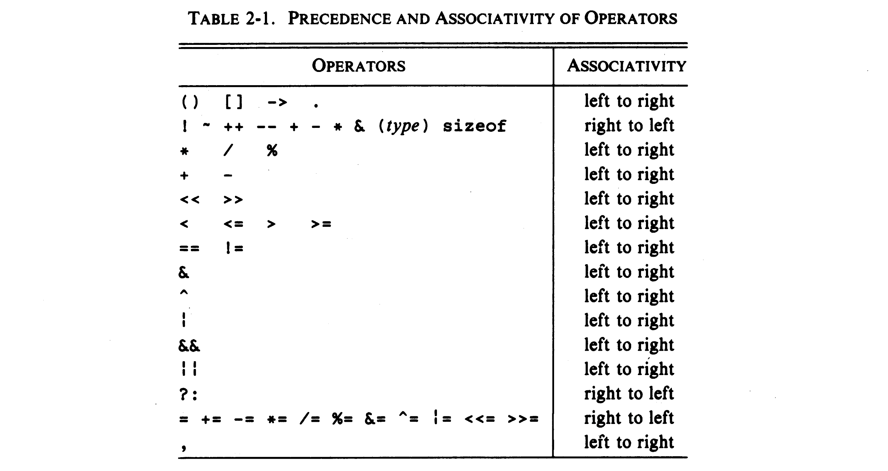

---

## Precedence and Order of Evaluation (Cont'd - 1)

### 연산자의 우선순위 (Precedence)와 결합 방향 (Associativity) 적용 규칙

1. 아직 결합되지 않은 표현식들 중에서, 우선순위가 가장 높은 연산자가 있는 표현식을 먼저 찾는다.
2. 선택된 연산자에 대해, 결합 방향 (왼쪽에서 오른쪽, 또는 오른쪽에서 왼쪽)에 따라 해당 표현식을 먼저 결합한다.
3. 결합되지 않은 표현식이 아직 2개 이상 남아 있다면, 다시 1단계로 돌아간 뒤 우선순위가 가장 높은 연산자를 찾아 처리한다.
4. 모든 연산이 결합되면, 최종적으로 결합된 표현식을 순서대로 평가 (evaluate)한다.

```c
x++ * y * z + w++;

/*
 * 1. [1] '++' has the highest precedence
 * 2. [2] '++' is right-to-left associative:
 *        => x++ * y * z + (w++)
 *        => (x++) * y * z + (w++)
 *
 * 3. [1] '*' has the next highest precedence
 * 4. [2] '*' is left-to-right associative:
 *        => ((x++) * y) * z + (w++)
 *        => (((x++) * y) * z) + (w++)
 *
 * 5. [1] '+' has the next precedence
 * 6. [2] '+' is left-to-right associative:
 *        => ((((x++) * y) * z) + (w++))
 */
```

---

## Precedence and Order of Evaluation (Cont'd - 2)

### 평가 순서 (Evaluation Order)

- 피연산자들의 값을 계산 (evaluation)하고, 그 부수 효과 (side effects)를 실행하는 순서

```c
int i = 2;
++i;  /* side effect: i + 1 */
```

- **대부분의 연산자는 평가 순서가 정의되지 않거나 (unspecified), 명시적으로 지정되어 있지 않음 (unsequenced)**
  - 동일한 코드라도 컴파일러에 따라 다른 결과를 초래할 수 있음
  - 특히 증감 연산자, 함수 호출과 같이 부수 효과가 있는 표현식에서는 주의 필요
- 평가 순서가 정해진 연산자들은 논리 연산자 (`&&`, `⎮⎮`), 쉼표 연산자 (`,`), 삼항 연산자 (`?:`)가 있음

---

## Precedence and Order of Evaluation (Cont'd - 3)

### 평가 순서가 보장되지 않는 경우들

```c
/* Case 1:
   If both functions f() and g() have side effects on global variables, the
   result of f() + g() may vary depending on which function is evaluated first.
   e.g., extern int a = 4, b = 5, c = 6;
         f(): increments all global variables by 1, then returns their sum.
         g(): multiplies all global variables by 2, then returns their sum. */
int x = f() + g();


/* Case 2:
   The value of `n` is incremented before being printed, but the order of
   evaluation between arguments is unspecified. Depending on whether n or
   power(2, n) is evaluated first, the printed values may differ. */
int n = 5;
printf("%d %d\n", ++n, power(2, n));


/* Case 3:
   This causes undefined behavior. The variable `i` is modified (`i++`) and read
   (`a[i]`) in the same expression without an intervening sequence point. */
int i = 0;
a[i] = i++;


/* Case 4:
   These expressions are also undefined behavior. Because `i` is both modified
   and accessed multiple times in the same expression without a sequence point,
   the result is unpredictable. */
int i = 2;
i + i + ++i;   /* Could be 2 + 2 + 3 or 3 + 3 + 3, etc. */
i + i + i++;   /* Could be 2 + 2 + 2 or 3 + 3 + 2, etc. */
```
