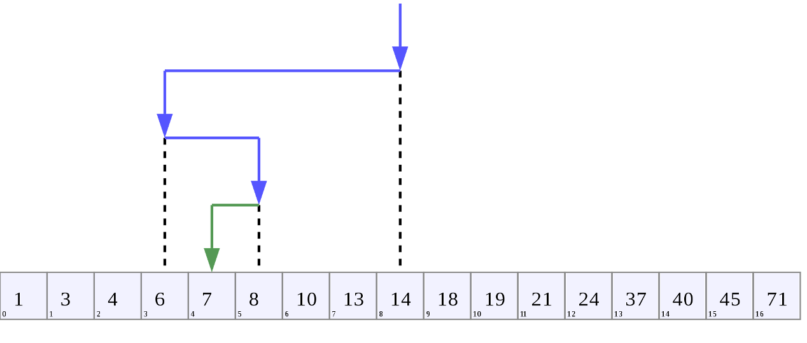
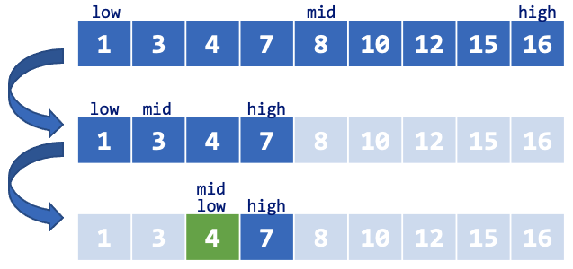
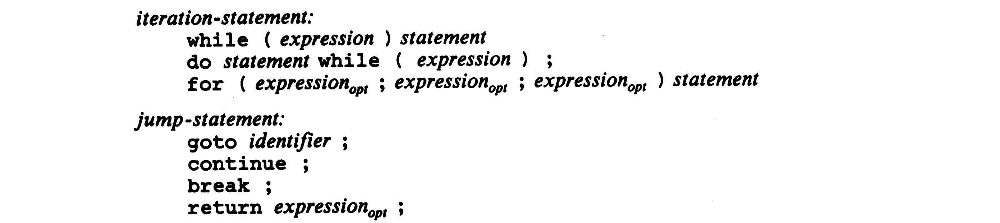

# Control Flow

## Goals of This Chapter

### 문장 (Statements)과 블록 (Blocks)의 개념

```text
statement:
    labeled-statement
    expression-statement
    compound-statement
    selection-statement
    iteration-statement
    jump-statement
```

### 제어 흐름을 위한 제어문

- `if`문
- `switch`문
- `for`문
- `while`문
- `do-while`문
- `break`문
- `continue`문
- `goto`문과 레이블문

---

## Statements and Blocks

### 문장의 종류

- 문법적으로 정의한 문장 종류:

```text
statement:
    labeled-statement          ← identifier (label), case, default
    expression-statement
    compound-statement
    selection-statement        ← if, if-else, switch
    iteration-statement        ← for, while, do-while
    jump-statement             ← return, break, continue, goto
```

### 표현식 (Expressions)

- 값을 계산하거나 어떤 부수효과 (side-effect)를 일으키는 단위
  - 표현식 자체가 **값**을 나타냄

```c
a = 10 /* Assignment expression: evaluates to 10 (the assigned value) */
b + c  /* Addition expression: evaluates to the sum of b and c */
x++    /* Post-increment expression: evaluates to the current value of x, then
          increments x by 1 */
f(x)   /* Function call expression: evaluates to the return value of function f
          with argument x */
```

---

## Statements and Blocks (Cont'd - 1)

### 문장 (Statements)

```text
statement:
    expression-statement
```

```text
expression-statement:
    expression(opt) ;
```

- 하나의 표현식 (an expression) 뒤에 세미콜론 (`;`)이 붙은 형태
- **표현식을 수행하기 위한 완전한 실행 단위**
  - 모든 표현식은 문장을 통해 값으로 치환되며, 치환 중에 부수효과가 발생할 수도 있음
- **빈 표현식 (an empty expression)도 표현식으로 간주**
  - `expression` 뒤에 `(opt)` (optional) 조건이 사용되었음
  - 빈 표현식은 값으로 바뀌거나 부수효과가 발생하지 않음 (no-op)
  - **문법적으로만 허용하는 형태**

```c
x = 0;
++i;
printf("Hello, world!");
```

```c
/* Following statements are also valid (use empty expressions) */
;           /* no operation */
for (;;) {} /* loop */
```

---

## Statements and Blocks (Cont'd - 2)

### 복합문 (Compound Statements, Blocks)

```text
statement:
    compound-statement
```

```text
compound-statement:
    { declaration-list(opt) statement-list(opt) }

declaration-list:
    declaration
    declaration-list declaration

statement-list:
    statement
    statement-list statement
```

- 중괄호 (`{`, `}`)를 사용해 여러 개의 선언문 또는 문장을 하나로 묶은 형태
  - e.g., 함수 본문, `while`문 본문, `if`문 본문, `for`문 본문, etc.
- 복합문은 **여러 문장을 문맥상 하나의 문장 (a single statement)으로 취급**
  - 문법적 단위로써 하나의 문장으로 간주
  - 문장의 실행 순서는 보장함
- 복합문 뒤에는 세미콜론을 붙이지 않음에 유의

---

## Selection-Statements

### If-Else

```text
selection-statement:
    if ( expression ) statement                ←
    if ( expression ) statement else statement ←
    switch ( expression ) statement
```

- 표현식의 평가 결과가 `0`이 아니면 `if`문 의 하위 문장 (substatement), `0`이면 `else`의 하위 문장이 수행됨
- 표현식이 필수인 구조이므로 `expression(opt)`이 아닌 `expression` 사용

```c
/* statement -> expression-statement */
if (x > 0)
    y = 1;
```

```c
/* statement -> compound-statement */
if (x > 0) {
    int y = 10;
    y += 5;
}
```

```c
/* statement -> selection-statement */
if (x > 0)
    if (y > 0)
        z = 1;
```

---

## Selection-Statements (Cont'd - 1)

### 모호성 (Ambiguity)

> 다음 코드에서 `else`는 어느 `if`문과 대응되는가?

```c
if (n > 0)
    if (a > b)
        z = a;
else
    z = b;
```

- 들여쓰기 수준에 맞게 논리적으로 분석하면 `else`는 첫 번째 `if`문 (`if (n > 0)`)과 대응되는 것처럼 보임
- 문법적으로 아래와 같은 분석이 가능한 것처럼 보임:

```text
  if (expression) statement else statement
→ if (expression) [if (expression) statement] else statement
→ if (expression) [if (expression) [expression-statement]] else [expression-statement]
```

- **하지만 `else`는 두 번째 `if`문 (`if (a > b)`)과 대응됨**

```c
/* if (expression) [if (expression) statement else statement] */
if (n > 0)
    if (a > b)
        z = a;
    else
        z = b;
```

---

## Selection-Statements (Cont'd - 2)

### Dangling Else

- `else`가 선택적으로 사용될 경우 중첩된 조건문이 모호해지는 문제
  - C 언어의 문법 구조는 해석 방법에 따라 여러 형태로 해석될 수 있음
- 모호성을 해결하고자 컴파일러는 코드를 문법적으로 해석할 때 다음 규칙을 따름:
  1. 가장 내부에 있는 코드부터 해석한다.
  2. 해석 시 가장 긴 문법 규칙을 따른다 (Longest Match Rule, Greedy Rule).
- 컴파일러의 문법 해석 규칙에 따라 **`else`는 항상 가장 가까운 `if`문과 연결됨**
- 만약 `else`가 다른 `if`문과 대응되어야 한다면 아래와 같이 복합문을 사용:

```c
/* if (expression) [compound-statement] else [expression-statement] */
if (n > 0) {
    if (a > b)
        z = a;
} else
    z = b;
```

---

## Selection-Statements (Cont'd - 3)

### 이진 탐색 (Binary Search)

- **이미 정렬되어 있는 배열**로부터 찾고자 하는 값을 빠르게 탐색하는 방법



---

## Selection-Statements (Cont'd - 4)

[//]: # (INCLUDE: ./c/03/01.c)



---

## Selection-Statements (Cont'd - 5)

### Switch

```text
selection-statement:
    if ( expression ) statement
    if ( expression ) statement else statement
    switch ( expression ) statement            ←

labeled-statement:
    identifier : statement
    case constant-expression : statement ←
    default : statement                  ←
```

- `statement`는 `switch`문 내부에서만 유효한 레이블문 (`case`문, `default`문)을 사용하기 위해 주로 복합문 사용

```c
switch (x)  /* This form is valid, but we can't use `default`. */
case 1:
    printf("OK");
```

```c
switch (x) {  /* This form can utilize both `case` and `default`. */
case 1:
    printf("One");
    break;
default:
    printf("Other");
}
```

---

## Selection-Statements (Cont'd - 6)

### Switch - `case`문과 `default`문

[//]: # (INCLUDE: ./c/03/switch1.c)

- **`switch`문의 표현식과 `case`문의 상수식은 반드시 정수형 (`int`)이여야 함**
- 표현식을 평가한 값과 상수식을 평가한 값을 서로 비교
  - 두 값을 비교했을 때 서로 일치하는 `case`문의 문장부터 실행이 시작됨
  - 두 값을 비교했을 때 서로 일치하는 경우가 없다면 `default`문 유무에 따라 실행될 문장이 결정됨
    - `default`문이 존재한다면 `default`문의 문장부터 실행이 시작됨
    - `default`문이 존재하지 않는다면 어떠한 문장도 실행되지 않음
- 레이블문은 실행될 문장을 가리키는 용도로만 사용되며, **제어 흐름에 영향을 주지 않음**
- **`break` 생략 시 fall-through 발생**

---

## Selection-Statements (Cont'd - 7)

### Switch - `break`문

```text
jump-statement:
    goto identifier ;
    continue ;
    break ;                  ←
    return expression(opt) ;
```

[//]: # (INCLUDE: ./c/03/switch2.c)

- **`break`문을 가장 가까이 감싸고 있는 반복문 또는 `switch`문의 실행을 즉시 종료**
  - 다른 문장은 `break`문 사용 불가

---

## Selection-Statements (Cont'd - 8)

### Switch 해석 구조

```c
/*   switch (expression) statement
  -> switch (expression) [compound-statement] */
switch (1) {
case 1:
    putchar('A'); /* case constant-expression : statement (labeled-statement) */
    break;        /* statement (jump-statement) */
case 2:
    putchar('B');
    break;
default:
    putchar('-'); /* default : statement (labeled-statement) */
}
```

- 다음과 같이 선언문을 구성하면 `case`문을 올바르게 해석할 수 없으므로 오류

```c
case 1:
    int x = 10; /* Invalid: declaration not allowed directly after case label */
    break;
```

- 복합문을 사용하면 `case`문에서 선언문 사용 가능

```c
case 1: {
    int x = 10;  /* Valid: declaration is inside a compound-statement */
    break;
}
```

---

## Selection-Statements (Cont'd - 9)

### `break`문을 활용한 예 - 사용자 정의 함수 `trim`

[//]: # (INCLUDE: ./c/03/08.c)

---

## Selection-Statements (Cont'd - 10)

### Switch - Multiple Case Labels

- `case`문은 여러 개 중첩해 사용할 수 있음
  - `case constant-expression : statement`에서 `statement`를 `labeled-statement`로 반복 해석

```c
/* You can replace the following phrase with `switch`:

if (c >= '0' && c <= '9')
    ++ndigit[c-'0'];
else if ((c == ' ') || (c == '\n') || (c == '\t'))
    ++nwhite;
else
    ++nother;
*/

switch (c) {
/* case constant-expression : case constant-expression : ... : statement */
case '0': case '1': case '2': case '3': case '4':
case '5': case '6': case '7': case '8': case '9':
    ++ndigit[c-'0'];
    break;
case ' ': case '\n': case '\t':
    ++nwhite;
    break;
default:
    ++nother;
    break;
}
```

---

## Iteration-Statements

### While, Do-While, and For

```text
iteration-statement:
    while ( expression ) statement                                        ←
    do statement while ( expression ) ;                                   ←
    for ( expression(opt) ; expression(opt) ; expression(opt) ) statement ←
```

- `while`문은 표현식의 평가 결과가 `0`이 아닌 동안 `while`문의 하위 문장을 반복 수행
- `while`문과 `do-while`문의 차이는 조건 검사 (test)를 어느 시점에 수행하는가에 차이가 있음:
  - `while`문은 먼저 조건 검사를 수행한 후 하위 문장 수행
  - `do-while`문은 하위 문장 수행 후 조건 검사 수행
- `for`문은 세 개의 표현식으로 구성되며, 각 항은 선택사항임:
  - 첫 번째 항은 한 번만 수행되며, 주로 `for`문의 조건 초기화를 담당
  - 두 번째 항은 하위 문장을 수행하기 전에 수행되며, `0`이 아닌 동안 `for`문의 하위 문장을 반복 수행
  - 세 번째 항은 하위 문장을 수행한 뒤에 수행되며, `for`문의 조건 재초기화 (갱신)를 담당
- `for`문의 두 번째 항은 생략될 경우 **암묵적으로 `0`이 아닌 상수로 설정됨**

```c
for (;;) {  /* the second expression is not equal to 0 -> loop */
    /* do something ... */
}
```

---

## Iteration-Statements (Cont'd - 1)

### `continue`문

```text
jump-statement:
    goto identifier ;
    continue ;               ←
    break ;
    return expression(opt) ;
```

- 반복문 내에만 등장할 수 있는 문장
- `continue`문을 가장 가까이 감싸고 있는 반복문의 **다음 반복 단계로 이동**시킴
  - 해당 반복문의 마지막 문장에 암묵적으로 레이블문 (`goto contin`)이 생성됨
  - 해당 반복문의 `continue`문은 `goto contin`문과 동일한 동작 수행


- `continue`문은 코드의 들여쓰기 수준을 낮출 수 있다는 장점이 있지만, 자주 사용할 경우 코드 가독성이 떨어짐

```c
for (i = 0; i < n; ++i) {
    if (a[i] < 0)  /* skip negative elements */
        continue;
    /* only positive elements present here. */
}
```

---

## Iteration-Statements (Cont'd - 2)

### `goto`문

```text
jump-statement:
    goto identifier ;        ←
    continue ;
    break ;
    return expression(opt) ;

labeled-statement:
    identifier : statement               ←
    case constant-expression : statement
    default : statement
```

- 레이블 이름 (`identifier`)을 사용하는 레이블문으로 즉시 이동할 수 있는 문장
- **`goto`문의 레이블은 반드시 같은 함수 내에 존재해야 함**

[//]: # (INCLUDE: ./c/03/goto.c)

---

## Iteration-Statements (Cont'd - 3)

### `goto`문 사용 예

- `continue`문을 소개하기 위해 `goto`문을 소개했으나, **이론적으로 전혀 필요하지 않음**
  - `goto`문은 다른 문법으로 충분히 대체 가능하며, 실제로 TCPL 책에서도 `goto`문을 사용하지 않음
- 자주 발생하지는 않으나 `goto`문을 사용하는 것이 편리한 경우가 있음

```c
    for (found = i = 0; (i < n) && !found; ++i) {
        for (j = 0; (j < m) && !found; ++j) {
            if (a[i] == b[j])
                found = 1;
        }
    }
    if (!found)
        return;  /* didn't find any common element */
    /* got one: a[i] == b[j] */ : 
```

- `goto`문을 사용한 형태:

```c
    for (i = 0; i < n; ++i) {
        for (j = 0; j < m; ++j) {
            if (a[i] == b[j])
                goto found;
        }
    }
    return;  /* didn't find any common elements */
found:
    /* got one: a[i] == b[j]*/
```

---

## Iteration-Statements (Cont'd - 4)

### 반복문을 활용한 예 - 표준 함수 `atoi`

[//]: # (INCLUDE: ./c/03/03.c)

---

## Iteration-Statements (Cont'd - 5)

[//]: # (INCLUDE: ./c/03/03_example.c)

---

## Iteration-Statements (Cont'd - 6)

### 반복문을 활용한 예 - 사용자 정의 함수 `shellsort`

[//]: # (INCLUDE: ./c/03/04.c)


---

## Iteration-Statements (Cont'd - 7)

### Comma Operator (`,`)

- 표현식들이 쉼표를 사용하여 열거된 형태
- 쉼표 연산자를 기준으로 가장 좌측 항부터 **차례대로 평가**됨
- 전체 표현식에 대한 값과 형은 **가장 우측 항을 따름**
  - 평가된 좌측 항들은 평가 이후 무시됨

[//]: # (INCLUDE: ./c/03/comma.c)

- 쉼표 표현이 **특별한 의미**를 갖는 문맥에서는 **괄호를 사용해 쉼표 연산자를 표현해야 함**
  - e.g., lists of function arguments (§A7.3.2), lists of initializers (§A8.7), etc.

```c
/* The function foo has three arguments, the second of which has the value 5 */
foo(a, (t = 3, t + 2), c);
```

---

## Iteration-Statements (Cont'd - 8)

### 쉼표 연산자를 활용한 예 - 사용자 정의 함수 `reverse`

[//]: # (INCLUDE: ./c/03/05.c)

- 쉼표 연산자는 꼭 필요한 경우에만 사용해야 함
- 다음과 같이 서로 **강하게 연관**되는 경우에만 사용할 것을 권장
- `reverse` 함수의 `for`문의 본문은 서로 강하게 연관되므로 쉼표 연산자를 사용해 더욱 간략화할 수 있음
  - 두 요소의 값을 교환하는 문장들이므로 항상 같이 사용되어야 유효한 문장들임

```c
for (i = 0, j = (strlen(s) - 1); i < j; ++i, --j)
    c = s[i], s[i] = s[j], s[j] = c;
```

---

## Iteration-Statements (Cont'd - 9)

### 반복문을 활용한 예 - 사용자 정의 함수 `itoa`

[//]: # (INCLUDE: ./c/03/07.c)

- `do-while`문은 본문이 단일문인 경우에도 **`while`문과 구분하기 위한 목적으로 복합문을 사용하는 것을 권장**
  - 반복문의 본문이 없는 경우 `;` 대신 비어있음을 강조하기 위해 `{}` 사용 권장

```c
/* this do-while statement uses a single statement */
do
    s[i++] = (n % 10) + '0';
while ((n /= 10) > 0);  /* It can be confused with a while without a body */
```

---

## Appendix A. Grammar of `statement` in ANSI C (C89)


---

## Appendix A. Grammar of `statement` in ANSI C (C89) (Cont'd)


