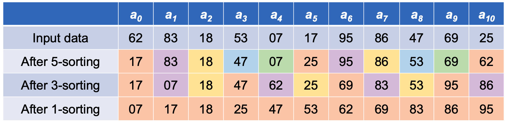
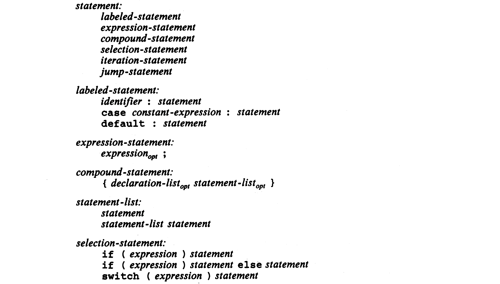

<!-- _class: lead -->
# 컴퓨터프로그래밍기초

## Control Flow

### [munseong.jeong@daejin.ac.kr](mailto:munseong.jeong@daejin.ac.kr)

---

## Statements and Blocks

### 문장의 종류

- 문법적으로 정의된 문장 6가지:

```text
statement:
    labeled-statement          ← identifier (label), case, default
    expression-statement
    compound-statement
    selection-statement        ← if, if-else, switch
    iteration-statement        ← for, while, do-while
    jump-statement             ← return, break, continue, goto
```

---

## Statements and Blocks (Cont'd - 1)

### 표현식(Expressions)

- 연산자와 피연산자의 조합으로 이루어진 실행 단위
- 평가 과정에서 변수 값 변경(할당, 증감 연산 등) 같은 부수효과(side-effect)가 발생할 수 있음
- 평가 결과는 특정 타입(type)을 갖는 값 또는 객체(*lvalue*)로 귀결되며, 결과값이 없는 경우(`void`)도 존재함

[//]: # (INCLUDE: ./c/03/src/expression_ignore.c --from 6 --to 11 --no-comment)

---

## Statements and Blocks (Cont'd - 2)

### 표현식 문(Expression Statements)

```text
expression-statement:
    expression(opt) ;
```

- 표현식(an expression) 뒤에 세미콜론(`;`)을 붙여 이루어진 **실질적인 명령 실행(execution) 단위**
- **빈 표현식(an empty expression)도 표현식으로 간주**
  - `expression` 뒤에 `(opt)` (optional) 조건이 붙음
  - 빈 표현식은 결과값과 부수효과가 발생하지 않는 표현식 문

[//]: # (INCLUDE: ./c/03/src/expression_ignore.c --from 16 --to 22 --no-comment)

---

## Statements and Blocks (Cont'd - 3)

### 복합문(Compound Statements, Blocks)

```text
compound-statement:
    { declaration-list(opt) statement-list(opt) }

declaration-list:
    declaration
    declaration-list declaration

statement-list:
    statement
    statement-list statement
```

- 중괄호(`{`, `}`)를 사용해 여러 개의 선언(declarations) 또는 문장을 하나로 묶은 형태
  - e.g., 함수 본문, `while`문 본문, `if`문 본문, `for`문 본문, etc.
- 복합문은 **여러 문장을 문맥상 하나의 문장(a single statement)으로 취급**
  - 문법적 단위로서 하나의 문장으로 간주
  - 문장의 실행 순서는 보장됨
- **복합문 뒤에는 세미콜론을 붙이지 않음**

---

## Selection-Statements

### `if-else`

```text
selection-statement:
    if ( expression ) statement               
    if ( expression ) statement else statement
```

- 표현식의 평가 결과가 `0`이 아니면 `if`문의 하위 문장(substatement), `0`이면 `else`문의 하위 문장 수행
- 표현식이 필수인 구조(`expression(opt)`이 아닌 `expression` 사용)

[//]: # (INCLUDE: ./c/03/src/selection_ignore.c --from 7 --to 17 --no-comment)

---

## Selection-Statements (Cont'd - 1)

### 모호성(Ambiguity)

> 다음 코드에서 `else`문은 어느 `if`문과 대응되는가?

[//]: # (INCLUDE: ./c/03/src/selection_ignore.c --from 21 --to 25 --no-comment)

- 들여쓰기 수준에 맞게 논리적으로 분석하면 `else`문은 첫 번째 `if`문(`if (n > 0)`)과 대응되는 것처럼 보임
- **하지만 `else`문은 두 번째 `if`문(`if (a > b)`)과 대응됨**

[//]: # (INCLUDE: ./c/03/src/selection_ignore.c --from 29 --to 33 --no-comment)

---

## Selection-Statements (Cont'd - 2)

### Dangling Else

```text
[...]: Denotes a construct parsed as one of six statement types.

if (expression) [if (expression) statement] else statement
if (expression) [if (expression) [expression-statement]] else [expression-statement]
```

- `else`문을 선택적으로 사용할 경우 중첩된 조건문이 모호해지는 문제
- 모호성을 해결하고자 컴파일러는 코드를 문법적으로 해석할 때 다음 규칙을 따름:
  1. 가장 내부에 있는 코드부터 해석한다.
  2. 해석 시 **가장 긴 문법 규칙**을 따른다(Longest Match Rule, Greedy Rule).
- 컴파일러의 문법 해석 규칙에 따라 **`else`문은 항상 가장 가까운 `if`문과 연결됨**

---

## Selection-Statements (Cont'd - 3)

- 복합문을 사용해 `else`문이 연결될 `if`문을 명확하게 표현하는 예:

```text
if (expression) [compound-statement] else [expression-statement]
```

[//]: # (INCLUDE: ./c/03/src/selection_ignore.c --from 37 --to 41 --no-comment)

---

## Selection-Statements (Cont'd - 4)

### 이진 탐색(Binary Search)

- **이미 정렬되어 있는 배열**로부터 찾고자 하는 값을 빠르게 탐색하는 방법


---

## Selection-Statements (Cont'd - 5)

- `if-else`문을 활용한 이진 탐색 구현

[//]: # (INCLUDE: ./c/03/src/binsearch.c)

---

## Selection-Statements (Cont'd - 6)

### `switch`문

```text
selection-statement:
    switch ( expression ) statement

labeled-statement:
    case constant-expression : statement
    default : statement
```

- 레이블문(labeled-statement)은 `switch`문에서만 유효함
- **`switch`문 표현식과 `case` 상수식은 반드시 정수 타입이어야 함**

[//]: # (INCLUDE: ./c/03/src/selection_ignore.c --from 45 --to 53 --no-comment)

---

## Selection-Statements (Cont'd - 7)

### `switch`문 - `case`와 `default`

[//]: # (INCLUDE: ./c/03/src/switch1.c)

- `switch`문은 보통 여러 개의 `case`를 사용하거나, `case`와 `default`를 동시에 사용할 수 있도록 **복합문**을 사용
- 레이블문은 분기될 위치를 가리키는 용도로만 사용되며, **제어 흐름에 영향을 주지 않음**

---

## Selection-Statements (Cont'd - 8)

### `switch`문 - `break`

```text
jump-statement:
    break ;
```

[//]: # (INCLUDE: ./c/03/src/switch2.c)

---

## Selection-Statements (Cont'd - 9)

- 문자열 내 특정 문자를 제거하는 `trim` 함수

[//]: # (INCLUDE: ./c/03/src/trim.c)

---

## Selection-Statements (Cont'd - 10)

### `switch`문 해석 구조

[//]: # (INCLUDE: ./c/03/src/analyze_switch.c --from 6 --to 16 --no-comment)

---

## Selection-Statements (Cont'd - 11)

### `switch`문 내 선언

- **선언은 문법 상 문장이 아님**

[//]: # (INCLUDE: ./c/03/src/decl_in_switch_ignore.c --from 7 --to 9 --no-comment)

- 복합문은 여러 선언과 문장을 사용할 수 있는 구조

```text
compound-statement:
    { declaration-list(opt) statement-list(opt) }
```

[//]: # (INCLUDE: ./c/03/src/decl_in_switch_ignore.c --from 13 --to 16 --no-comment)

---

## Selection-Statements (Cont'd - 12)

### `switch`문 - Multiple Case Labels

- `case`는 여러 번 사용될 수 있으며, 이는 각각 독립된 레이블문으로 구문 분석됨

[//]: # (INCLUDE: ./c/03/src/replace_if_else_with_switch_ignore.c --from 9 --to 27 --no-comment)

---

## Selection-Statements (Cont'd - 13)

### Switch - `default`

- `switch`문의 값이 어떤 `case`와도 일치하지 않으면 코드는 `default`로 분기(catch-all)
  - **`default`는 한 번만 사용될 수 있음**
- **`default`는 마지막에 사용하는 것이 관례**

[//]: # (INCLUDE: ./c/03/src/default.c --from 6 --to 18 --no-comment)

---

## Iteration-Statements

### While, Do-While, and For

```text
iteration-statement:
    while ( expression ) statement
    do statement while ( expression ) ;
    for ( expression(opt) ; expression(opt) ; expression(opt) ) statement
```

- 조건문(`for`문은 두 번째 표현식) 평가가 참인 동안 본문을 반복 수행
- `while`문과 `do-while`문의 차이는 조건 검사(test)를 어느 시점에 수행하는가에 있음:
  - `while`문은 먼저 조건 검사를 수행한 후 하위 문장 수행
  - `do-while`문은 하위 문장 수행 후 조건 검사 수행
- `for`문은 세 개의 표현식으로 구성되며, **각 항은 선택사항**임:
  - 첫 번째 항은 한 번만 수행되며, 주로 `for`문의 조건 초기화를 담당
  - 두 번째 항은 하위 문장을 수행하기 전에 수행되며, `0`이 아닌 동안 `for`문의 하위 문장을 반복 수행
  - 세 번째 항은 하위 문장을 수행한 뒤에 수행되며, `for`문의 조건 재초기화(갱신)를 담당
  - `for`문의 두 번째 항은 생략될 경우 **암묵적으로 `0`이 아닌 상수로 설정됨(항상 참으로 평가)**

---

## Iteration-Statements (Cont'd - 1)

### `continue`

```text
jump-statement:
    continue ;
```

- **반복문 내에만 사용 가능**
- `continue`를 가장 가까이 감싸고 있는 반복문의 **다음 반복 단계로 이동**시킴
  - 흐름 관점에서 봤을 때 식별자 `contin`이 블록 마지막에 생성되는 것과 동일함
  - `continue`는 `goto contin`으로 치환되어 블록 마지막의 `contin`으로 이동(jump)


---

## Iteration-Statements (Cont'd - 2)

- `continue`는 코드의 들여쓰기 수준을 낮출 수 있다는 장점이 있음
- **너무 자주 사용하면 코드 가독성이 떨어짐**

[//]: # (INCLUDE: ./c/03/src/contin.c --from 8 --to 12 --no-comment)

[//]: # (INCLUDE: ./c/03/src/contin.c --from 16 --to 21 --no-comment)

---

## Iteration-Statements (Cont'd - 3)

### `goto`

```text
jump-statement:
    goto identifier ;

labeled-statement:
    identifier : statement
```

- 레이블 이름(`identifier`)이 사용된 위치로 즉시 이동
- **`goto`의 레이블은 반드시 같은 함수 내에 존재해야 함**

[//]: # (INCLUDE: ./c/03/src/goto_ignore.c --to 10 --no-comment)

---

## Iteration-Statements (Cont'd - 4)

- `continue`를 소개하기 위해 `goto`를 사용했으나, **이론적으로 전혀 필요하지 않음**
  - `goto`는 다른 방법으로 대체 가능
  - TCPL 책의 예제 코드에서도 `goto`를 사용하지 않음
- `goto`를 사용하는 것이 편리한 경우:

[//]: # (INCLUDE: ./c/03/src/goto_ignore.c --from 33 --to 44 --no-comment)

---

## Iteration-Statements (Cont'd - 5)

- ASCII 숫자 문자열을 정수로 변환하는 `atoi` 함수
  - 2장에서 소개한 `atoi`에서 **부호 처리**가 추가됨

[//]: # (INCLUDE: ./c/03/src/atoi.c)

---

## Iteration-Statements (Cont'd - 6)

- 표준 함수 `atoi` 사용 예

[//]: # (INCLUDE: ./c/03/src/atoi_example.c)

---

## Iteration-Statements (Cont'd - 7)

- `shellsort`: 반복문을 활용한 기초적인 정렬

[//]: # (INCLUDE: ./c/03/src/shellsort.c)



---

## Iteration-Statements (Cont'd - 8)

### `do-while`

- **본문을 한 번 수행한 후에** 조건이 참인 동안 본문을 반복 수행

[//]: # (INCLUDE: ./c/03/src/atoi_advanced.c)

---

## Iteration-Statements (Cont'd - 9)

- `do-while`문은 괄호를 사용하지 않을 경우 가독성이 떨어질 수 있음

[//]: # (INCLUDE: ./c/03/src/do_while_recommend_ignore.c --from 8 --to 11 --no-comment)

- `do-while`문은 **본문이 단일문인 경우에도 `while`문과 구분하기 위한 목적**으로 복합문을 사용하는 것을 권장

[//]: # (INCLUDE: ./c/03/src/do_while_recommend_ignore.c --from 15 --to 18 --no-comment)

---

## Comma Operator(`,`)

- 표현식들이 쉼표를 사용하여 열거된 형태
- 쉼표 연산자를 기준으로 가장 좌측 항부터 **차례대로 평가**됨
- 전체 표현식에 대한 값과 타입은 **가장 우측 항을 따름**(평가된 좌측 항들은 평가 이후 무시됨)

[//]: # (INCLUDE: ./c/03/src/comma.c)

- 쉼표 표현이 **특별한 의미**를 갖는 문맥에서는 **괄호를 사용해 쉼표 연산자를 표현해야 함**
  - e.g., Lists of Function Arguments(§A7.3.2), Lists of Initializers(§A8.7), etc.

[//]: # (INCLUDE: ./c/03/src/comma_bracket.c --from 15 --to 17 --no-comment)

---

## Comma Operator(`,`) (Cont'd)

- 문자열을 뒤집는 `reverse` 함수

[//]: # (INCLUDE: ./c/03/src/reverse.c)

- 쉼표 연산자는 가독성을 위해 특수한 경우(표현들이 서로 밀접하게 연관되는 경우 등)에만 사용해야 함

---

## Appendix A. Grammar of `statement` in ANSI C (C89)



---

## Appendix A. Grammar of `statement` in ANSI C (C89) (Cont'd)


