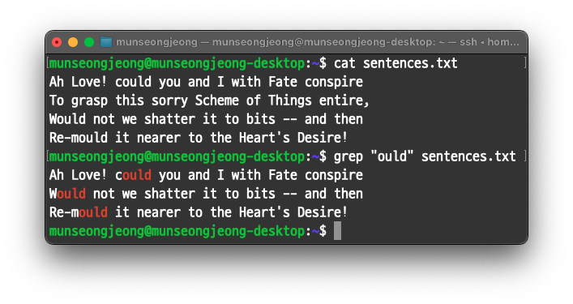
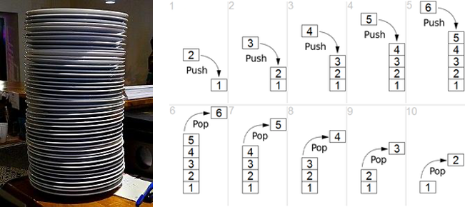
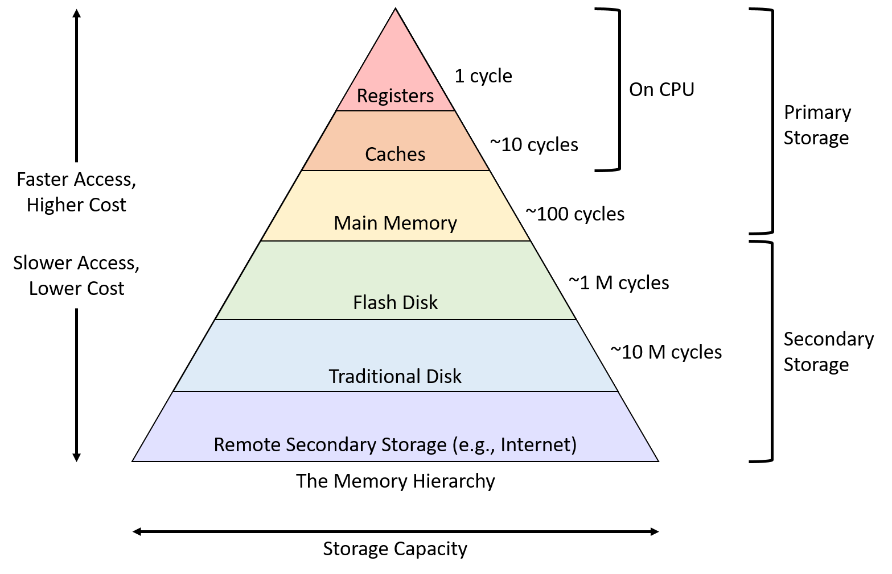
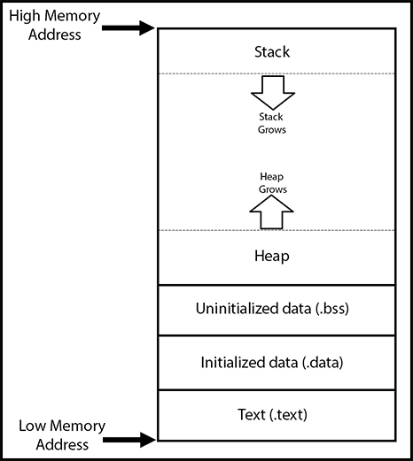
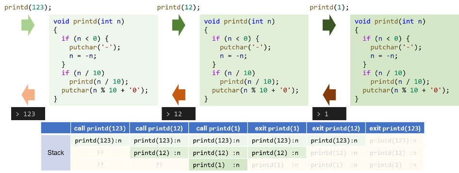
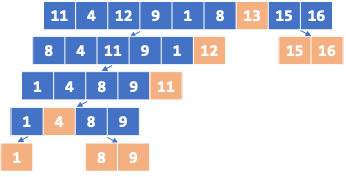

<!-- _class: lead -->
# 컴퓨터프로그래밍기초

## Functions and Program Structure

### [munseong.jeong@daejin.ac.kr](mailto:munseong.jeong@daejin.ac.kr)

---

## Basics of Functions

- 프로그램 작성 시 `main` 함수만 사용하는 것 보다는 **여러 개의 함수를 사용하는 것을 권장**

### 함수 사용 이점

1. 응집도 증가 및 결합도 감소
    - 관련 코드를 독립 영역(함수)으로 분리
    - **지역 분리로 인한 불필요한 상호작용 제거**
2. 재사용성
    - 필요할 때 함수 호출만 하면 됨
3. 가독성 향상
    - 재사용되는 코드를 함수로 분리해 사용함에 따라 코드가 구조화되고 간결해짐
4. 유지보수성 향상
    - 함수 수정이 필요할 경우 **해당 함수에 대해서만 수정**

---

## Basics of Functions (Cont'd - 1)

- 입력 문자열 중 특정 패턴이 포함된 문자열만 출력하는 함수 기반 프로그램
  - 세 함수(`getline`, `strindex`, `printf`)를 사용
    - `printf` 함수는 표준 함수, `getline`, `strindex` 함수는 사용자 정의 함수
  - UNIX 유틸리티 중 `grep`을 모방한 프로그램
    - e.g., 패턴이 `"ould"`일 경우 입력에 대한 출력 예시

```text
while (there's another line)           → getline
    if (the line contains the pattern) → strindex
        print it                       → printf
```



---

## Basics of Functions (Cont'd - 2)

[//]: # (INCLUDE: ./c/04/src/grep.c --to 8)

---

## Basics of Functions (Cont'd - 3)

[//]: # (INCLUDE: ./c/04/src/grep.c --from 10 --to 24)

---

## Basics of Functions (Cont'd - 4)

[//]: # (INCLUDE: ./c/04/src/grep.c --from 26 --to 38)

---

## Basics of Functions (Cont'd - 5)

[//]: # (INCLUDE: ./c/04/src/grep.c --from 40)

---

## Basics of Functions (Cont'd - 6)

### 함수 정의

```text
return‑type function‑name(parameter‑list)
{
    declarations
    statements
}
```

- ANSI C 이전에는 반환 타입 또는 매개변수 타입 생략이 가능했으나, C99부터 타입 생략은 **금지**되었음
- 함수 정의 시 매개변수를 사용하지 않는다면 `void` 키워드를 사용해 의도를 분명히 할 것
- 값을 반환하지 않는 함수의 타입은 `void` 키워드 사용

### 함수 간 통신 방법

| Category                   | Description                                                               |
|----------------------------|---------------------------------------------------------------------------|
| Argument / Parameter       | Value is copied and passed to the **callee**                              |
| Return Value               | Computation result is copied back to the **caller**                       |
| External (Global) Variable | Shared access without copying; **beware of tight coupling when overused** |

---

## Basics of Functions (Cont'd - 7)

### 값 반환

```text
jump-statement:
    goto identifier ;
    continue ;
    break ;                 
    return expression(opt) ; ←
```

- 함수의 반환 타입이 `void`가 아니라면 함수 호출 측으로 값을 반환할 수 있음

[//]: # (INCLUDE: ./c/04/src/return_ignore.c --from 2 --to 5 --no-comment)

[//]: # (INCLUDE: ./c/04/src/return_ignore.c --from 11 --to 11 --no-comment)

---

## Basics of Functions (Cont'd - 8)

- 반환 표현식의 평가된 타입과 함수의 반환 타입이 서로 다를 경우, **함수의 반환 타입**으로 타입 변환

[//]: # (INCLUDE: ./c/04/src/return_type.c)

---

## Basics of Functions (Cont'd - 9)

### 다중 소스 파일 구성

- **입력 문자열 중 특정 패턴이 포함된 문자열만 출력하는 함수 기반 프로그램**은 아래와 같이 여러 파일로 분할 가능:

```text
.
|-- getline.c
|-- main.c
`-- strindex.c
```

---

## Basics of Functions (Cont'd - 10)

- `getline.c`

[//]: # (INCLUDE: ./c/04/src/grep/getline.c)

---

## Basics of Functions (Cont'd - 11)

- `main.c`

[//]: # (INCLUDE: ./c/04/src/grep/main.c --to 8)

---

## Basics of Functions (Cont'd - 12)

[//]: # (INCLUDE: ./c/04/src/grep/main.c --from 10)

---

## Basics of Functions (Cont'd - 13)

- `strindex.c`

[//]: # (INCLUDE: ./c/04/src/grep/strindex.c)

---

## Basics of Functions (Cont'd - 14)

### 빌드 방법

```bash
# Before building, make sure you are in the directory that contains all your
# source files:
cd path/to/your/source_directory

# Step-by-step build
gcc -c main.c getline.c strindex.c -ansi -Wall
gcc main.o getline.o strindex.o -o $(basename $PWD) -ansi -Wall

# One-line version
gcc *.c -o $(basename $PWD) -ansi -Wall
```

---

## Functions Returning Non-integers

- ASCII 숫자 문자열을 실수로 변환하는 `atof` 함수

[//]: # (INCLUDE: ./c/04/src/atof.c)

---

## Functions Returning Non-integers (Cont'd - 1)

- 기초적인 계산기 프로그램

```text
.
|-- getline.c  # NB: Reuse previously implemented file
`-- main.c
```

---

## Functions Returning Non-integers (Cont'd - 2)

- `main.c`

[//]: # (INCLUDE: ./c/04/src/rudimentary_calc/main.c)

---

## Functions Returning Non-integers (Cont'd - 3)

### 다중 소스 파일 컴파일 시 주의사항

- 컴파일러는 다중 소스 파일을 빌드할 때 아래의 과정을 거침:

```text
1. Compile each source file into an object file
   (Source file → Preprocessing → Compiling → Assembling → Object file)

2. Link the resulting object files together with system libraries
   (Object files + system libraries → Linking → Single executable file)
```

- 만약 아래와 같이 프로그램을 작성할 경우 문제가 발생할 수 있음:

```text
.
|-- func.c # Included functions' implementations
`-- main.c # Declarations of the functions implemented in func.c are missing
```

- `func.c`에서 정의된 함수를 `main.c` 내에 선언 없이 사용할 경우, **컴파일 시 오류가 발생하지 않음**
  - 링크 오류는 링크 과정에서 함수의 호출부와 연결되어야 할 구현부를 찾지 못할 때 발생
    - 현대 표준(C99 이후)에서는 함수 선언 누락 시 컴파일 오류가 발생함
- 문제는 컴파일러가 소스 파일을 목적 파일로 변환할 때 **선언이 누락된 함수의 반환 타입을 암묵적으로 `int`로 가정함**

---

## Functions Returning Non-integers (Cont'd - 4)

- `func.c`

[//]: # (INCLUDE: ./c/04/src/no_dcl_function_ignore.c --from 2 --to 10 --no-comment)

- `main.c`

[//]: # (INCLUDE: ./c/04/src/no_dcl_function_ignore.c --from 16 --to 18 --no-comment)

---

## External Variables

### 내부(Internal)와 외부(External)

- 내부는 **함수의 본문** 또는 **복합문**을 의미하며, 변수(지역 변수와 매개변수), 함수의 선언, 문장 사용 가능
  - **문장은 내부에만 존재할 수 있음**
- 외부는 **함수 외부**를 의미하며, 변수(전역 변수), 함수의 선언, 함수의 정의 사용 가능
  - **함수 정의는 외부에만 존재할 수 있음**

### 내부 변수와 외부 변수의 차이

- 내부 변수는 블록 내에서만 사용 가능하나, 외부 변수는 다른 지역에서도 접근해 사용 가능
- 내부 변수는 블록의 생애주기(lifecycle)에 의존하나, 외부 변수는 프로그램의 생애주기에 의존함
- 내부 변수는 초기화를 생략하면 임의의 값이 들어있으나, 외부 변수는 초기화를 생략해도 0으로 초기화됨

---

## External Variables (Cont'd - 1)

### 외부 변수 사용 시 주의사항

- 외부 변수를 많은 함수가 사용할 경우 **과한 의존 관계**가 형성되어 모듈성이 저하됨
- 이름이 너무 간결할 경우 이름 충돌 또는 다른 지역에서 이름이 감춰질 위험이 있음

[//]: # (INCLUDE: ./c/04/src/shadow_external.c)

---

## External Variables (Cont'd - 2)

- Postfix notation(Reverse Polish Notation, RPN), 스택(stack)을 사용하는 외부변수 기반 계산기 프로그램
  - Infix notation: 연산자가 피연산자 사이에 위치하는 표기법
    - 사람은 사칙연산을 표현할 때 infix 표기를 사용
    - e.g., `(1 - 2) * (4 + 5)`
  - Postfix notation: 연산자가 피연산자 뒤에 위치하는 표기법
    - Postfix 표기의 장점은 **스택(stack) 자료 구조와 같이 사용할 경우 연산자와 피연산자 간 대응을 명확히 할 수 있음**
    - e.g., `1 2 - 4 5 + *`
  - 스택(Stack)
    - 한쪽 방향에서만 데이터를 추가(push)하거나 제거(pop)할 수 있는 구조



---

## External Variables (Cont'd - 3)

- 스택을 사용한 postfix notation 수식 처리 과정:
  1. 수식 중 피연산자는 스택에 push한다.
  2. 수식 중 연산자는 스택에 있는 두 개의 데이터를 pop하여 연산한 뒤, 결과를 다시 스택에 push한다.
  - e.g., `1 2 - 4 5 + *`

| Token | `1`     | `2`     | `-`      | `4`     | `5`     | `+`     | `*`      |
|-------|---------|---------|----------|---------|---------|---------|----------|
|0      | **`1`** | `1`     | **`-1`** | `-1`    | `-1`    | `-1`    | **`-9`** |
|1      |         | **`2`** |          | **`4`** | `4`     | **`9`** |          |
|2      |         |         |          |         | **`5`** |         |          |

---

## External Variables (Cont'd - 4)

- 외부 변수 기반 계산기 프로그램 구조

```text
while (next operator or operand is not end-of-file indicator)
    if (number)
        push it
    else if (operator)
        pop operands
        do operation
        push result
    else if (newline)
        pop and print top of stack
    else
        error
```

---

## External Variables (Cont'd - 5)

[//]: # (INCLUDE: ./c/04/src/stack_calc.c --to 22)

---

## External Variables (Cont'd - 6)

[//]: # (INCLUDE: ./c/04/src/stack_calc.c --from 23 --to 39)

- **뺄셈과 나눗셈은 교환법칙이 성립하지 않음**
- 평가 순서는 `&&`, `||`, `?:`, `,` 연산자 외에는 미정의(unspecified)이므로 순서를 명확히 표현해야 함
- 나눗셈 연산 시 제수는 0이 아닌 수여야 함

---

## External Variables (Cont'd - 7)

[//]: # (INCLUDE: ./c/04/src/stack_calc.c --from 40 --to 55)

- 전역 변수의 이름은 선언 지점으로부터 파일의 끝까지 유효
  - 전역 변수는 파일 범위(file scope)를 가짐
- 두 전역 변수 `sp`, `val`은 `main` 함수에서 접근할 수 없도록 **의도적으로** `main` 함수 이후에 선언한 것

---

## External Variables (Cont'd - 8)

[//]: # (INCLUDE: ./c/04/src/stack_calc.c --from 57 --to 76)

- 헤더 파일에 작성된 함수 선언들은 `#include` 전처리문으로 파일을 포함한 지점으로부터 해당 소스 파일의 끝까지 유효

---

## External Variables (Cont'd - 9)

[//]: # (INCLUDE: ./c/04/src/stack_calc.c --from 78 --to 99)

---

## External Variables (Cont'd - 10)

[//]: # (INCLUDE: ./c/04/src/stack_calc.c --from 101)

- `#define` 지시자로 작성된 매크로는 해당 매크로를 정의한 지점으로부터 해당 소스 파일의 끝까지 유효
- 프로그램이 데이터를 읽어올 때, 만약 읽어야 할 데이터보다 더 많은 데이터를 읽어온 경우 이를 어딘가에 보존해야 함
- `ungetch` 함수는 읽어온 데이터 중 보존해야 할 데이터(아직 처리하지 않은 데이터)를 보존
- `getch` 함수는 보존된 데이터가 있다면 이를 먼저 사용한 뒤, 입력 스트림을 통해 데이터를 읽어옴

---

## Scope Rules

### ANSI C (C89) §3.1.2 — "Scope of an Identifier"

> The scope of an identifier is the portion of the program in which the identifier can be used to denote the object, function, or tag with which it is associated.

- 범위(scope)는 식별자(identifiers)가 유효하게 사용될 수 있는 코드 범위를 의미

| Scope Type          | Applicable Identifiers        | Start Point                 | End Point                   | Summary Description                     |
|---------------------|-------------------------------|-----------------------------|-----------------------------|-----------------------------------------|
| **File Scope**      | Global variables, functions   | Point of declaration        | End of the translation unit | Visible throughout the file             |
| **Block Scope**     | Local variables, parameters   | Point of declaration        | End of the enclosing block  | Visible only within the block           |
| **Function Scope**  | Labels (for `goto`)           | Beginning of the function   | End of the function         | Labels are visible anywhere in function |
| **Prototype Scope** | Parameter names in prototypes | Beginning of the prototype  | End of the prototype        | Names are valid only in the prototype   |

- 번역 단위(translation unit)는 하나의 C 소스 파일이 전처리기에 의해 전처리된 결과물을 의미

---

## Scope Rules (Cont'd - 1)

### 파일 스코프 (File Scope)

- 식별자(변수 또는 함수의 이름) 선언이 전역 공간(outside of all blocks)에 위치한 경우
- 식별자는 선언된 위치로부터 파일의 끝까지 유효함

[//]: # (INCLUDE: ./c/04/src/file_scope.c)

---

## Scope Rules (Cont'd - 2)

### 블록 스코프 (Block Scope)

- 식별자가 블록 내에 위치한 경우
- 식별자는 블록 내 선언된 위치로부터 해당 블록의 끝까지 유효함

[//]: # (INCLUDE: ./c/04/src/block_scope.c)

---

## Scope Rules (Cont'd - 3)

### 함수 스코프 (Function Scope)

- 레이블만 사용하는 스코프
- 레이블이 등장한 함수 전체에서 유효함

[//]: # (INCLUDE: ./c/04/src/function_scope.c)

---

## Scope Rules (Cont'd - 4)

### 프로토타입 스코프 (Prototype Scope)

- 함수 선언에 사용되는 매개변수만 사용하는 스코프
- 선언에 등장하는 매개변수 식별자는 선언 내에서만 유효함
- **타입 검사 목적으로만 사용**

[//]: # (INCLUDE: ./c/04/src/prototype_scope.c)

---

## Scope Rules (Cont'd - 5)

### ANSI C (C89) §3.2.1.5 — "Storage-Class Specifiers"

> A storage-class specifier declares the storage duration, linkage, and visibility (scope) of an object or function.

- 연결성(linkage)은 식별자가 다른 파일(translation unit)에서도 공유될 수 있는지 여부를 의미
- 저장 기간(storage duration)은 객체(objects)가 메모리에 존재하는 생애주기를 의미

| Keyword     | Scope        | Linkage         | Storage Duration                 | Description                                     |
|-------------|--------------|-----------------|----------------------------------|-------------------------------------------------|
| `auto`      | Block        | None            | Automatic (expires at block end) | Default for local variables                     |
| `register`  | Block        | None            | Automatic                        | Cannot take address, register optimization hint |
| `static`    | Block / File | None / Internal | Static (until program ends)      | Retains value / Not accessible from other files |
| `extern`    | Block / File | External        | Static                           | References a definition from another file       |
| `typedef`   | Block / File | None            | None (type alias only)           | Defines a new type name (alias) **only**        |

---

## Scope Rules (Cont'd - 6)

### Storage Class Specifiers — `auto`

```text
Scope            : Block Scope
Linkage          : No Linkage
Storage Duration : Automatic
```

- 전역에서 사용 불가(block scope, no linkage)
- 함수 호출 시점에 생성되었다가 종료 시점에 소멸됨(automatic)
- 지역 변수는 기본적으로 `auto` 저장 클래스
  - 오늘날 거의 사용되지 않음

[//]: # (INCLUDE: ./c/04/src/auto_ignore.c --from 4 --to 4 --no-comment)

---

## Scope Rules (Cont'd - 7)

### Storage Class Specifiers — `register`

```text
Scope            : Block Scope
Linkage          : No Linkage
Storage Duration : Automatic
```

- 전역에서 사용 불가(block scope, no linkage)
- 함수 호출 시점에 생성되었다가 종료 시점에 소멸됨(automatic)
- CPU의 레지스터를 사용하도록 **제안**하는 키워드
  - 반드시 레지스터를 사용하도록 하는 것이 아님
- **레지스터는 주소를 갖지 않으므로 주소 연산자(`&`)를 사용할 수 없음**
- 대부분의 컴파일러는 빌드 과정에서 레지스터가 사용될 변수를 판단 및 자동 적용
  - 오늘날 거의 사용되지 않음

[//]: # (INCLUDE: ./c/04/src/register_ignore.c --from 4 --to 5 --no-comment)

---

## Scope Rules (Cont'd - 8)

### Storage Class Specifiers — `static`

```text
Scope            : Block Scope / File Scope
Linkage          : No Linkage  / Internal Linkage
Storage Duration : Static      / Static
```

- 지역(block scope, no linkage)과 전역(file scope, internal linkage) 둘 다 사용 가능
- 프로그램 시작 시 생성되어 프로그램 종료 시 소멸(static)
- 정적 변수는 0으로 자동 초기화됨
  - 정적 변수 선언 시 초기화자가 있다면 해당 값으로 초기화됨

---

## Scope Rules (Cont'd - 9)

### Block-Scope `static`

[//]: # (INCLUDE: ./c/04/src/static_ignore.c --from 2 --to 7 --no-comment)

### File-Scope `static`

[//]: # (INCLUDE: ./c/04/src/static_ignore.c --from 11 --to 17 --no-comment)

---

## Scope Rules (Cont'd - 10)

### Storage Class Specifiers — `extern`

```text
Scope            : Block Scope      / File Scope
Linkage          : External Linkage / External Linkage
Storage Duration : Static           / Static
```

- 지역(block scope)과 전역(file scope) 둘 다 사용 가능
- 프로그램 시작 시 생성되어 프로그램 종료 시 소멸(static)
- 다른 파일에 있는 함수 정의 또는 외부 변수를 참조할 수 있게 함(external linkage)
  - `static` 키워드를 사용하지 않은 식별자에 대해 접근할 수 있도록 함
- 같은 파일 내에 선언된 전역 변수를 블록에서 사용할 때 `extern` 키워드는 선택사항
  - 전역 변수는 파일 스코프를 가지며, `static`이 없으면 기본 연결성은 외부 연결성임
- 하나의 번역 단위(translation unit)에 정의가 여러 개 존재하면 정의 중복으로 인한 컴파일 오류 발생

---

## Scope Rules (Cont'd - 11)

### Block-Scope `extern`

[//]: # (INCLUDE: ./c/04/src/extern_ignore.c --from 2 --to 11 --no-comment)

### File-Scope `extern`

[//]: # (INCLUDE: ./c/04/src/extern_ignore.c --from 15 --to 18 --no-comment)

---

## Scope Rules (Cont'd - 12)

### 외부 선언(External Declarations)과 외부 정의(External Definitions)

- 함수는 선언과 정의를 구분하지만, **변수 선언은 곧 정의를 의미**
  - 선언은 식별자의 존재를 알리며, 정의는 식별자의 메모리를 할당
- **모든 함수 선언은 기본적으로 `extern`으로 간주**되므로, 외부 함수 선언 시 `extern` 키워드는 선택사항
- 외부에서 변수 선언 시 `extern` 키워드를 사용하면 **선언만 수행**
  - 식별자에 대한 메모리 할당을 하지 않고, 다른 번역 단위에 해당 식별자의 정의가 있다고 알리는 역할

---

## Scope Rules (Cont'd - 13)

### 외부 변수 정의

- 식별자를 **메모리에 할당**
- 외부 식별자는 한 번만 정의되어야 하며, 여러 파일에 동일한 식별자를 중복 정의할 경우 링킹 과정에서 오류 발생

[//]: # (INCLUDE: ./c/04/src/extern_variable_ignore.c --from 5 --to 7 --no-comment)

### 외부 변수 선언

- 외부 배열 선언 시 크기는 생략될 수 있음

[//]: # (INCLUDE: ./c/04/src/extern_variable_ignore.c --from 11 --to 16 --no-comment)

---

## Scope Rules (Cont'd - 14)

### Memory Hierarchy



---

## Scope Rules (Cont'd - 15)

### Memory Layout



- Stack 영역에는 내부 변수, 함수 호출 스택 프레임 등이 저장됨
- Heap 영역에는 동적 메모리가 저장됨
- .bss 영역에는 초기화되지 않은 외부 변수와 정적 변수가 저장됨
- .data 영역에는 초기화된 외부 변수와 정적 변수가 저장됨
- .rodata 영역에는 문자열 리터럴 등 읽기 전용 상수 데이터가 저장됨
- .text 영역에는 일반 함수와 정적 함수가 저장됨

---

## Header Files

- 프로그램에서 사용될 함수 선언, 상수 정의, 매크로 정의 등을 모아 놓은 파일이며, 주로 확장자 `.h`를 사용

[//]: # (INCLUDE: ./c/04/src/header_ignore.c --from 2 --to 4 --no-comment)

- 사용자가 정의한 헤더 파일은 상대 경로 또는 절대 경로를 사용해 프로그램에 포함할 수 있음
  - 상대 경로는 헤더 파일 포함 전처리문이 존재하는 소스 파일을 기준으로 경로를 나타냄
  - 절대 경로는 포함할 헤더 파일이 존재하는 전체 경로를 나타냄

[//]: # (INCLUDE: ./c/04/src/header_ignore.c --from 8 --to 12 --no-comment)

---

## Header Files (Cont'd - 1)

### `#include "..."` vs `#include <...>`

- `#include "..."`은 사용자 정의 헤더 파일을 포함할 때 사용
  1. 포함 지시문이 작성된 소스 파일의 위치를 기준으로 `"..."` 경로에서 헤더 파일 탐색
  2. 1번 과정에서 못 찾았다면, 컴파일 시 `-I` 옵션으로 추가 지정한 경로에서 헤더 파일 탐색
  3. 2번 과정에서 못 찾았다면, 표준 포함 경로(e.g., `/usr/include`)에서 헤더 파일 탐색
  4. 3번 과정에서 못 찾았다면, 전처리 단계에서 오류 발생
- `#include <...>`은 표준 라이브러리 헤더 파일을 포함할 때 사용
  1. 컴파일러 설치 시 설정된 표준 포함 경로에서만 탐색
  2. 1번 과정에서 못 찾았다면, 전처리 단계에서 오류 발생

---

## Header Files (Cont'd - 2)

### `gcc -I`

- 컴파일 시 사용자 정의 헤더 파일 탐색 경로를 추가로 설정할 수 있음
- `./` 경로에서 컴파일할 때, `-I./include` 옵션을 같이 전달하면 `my_math.h` 헤더 파일을 올바르게 참조할 수 있음

```text
.
|-- include
|   `-- my_math.h
`-- src
    `-- my_math.c
```

[//]: # (INCLUDE: ./c/04/src/header_ignore.c --from 16 --to 22 --no-comment)

```bash
gcc src/my_math.c -o my_math -I./include
```

---

## Header Files (Cont'd - 3)

### `gcc -E -P`

- 전처리가 된 파일을 얻고자 할 때 사용하는 옵션들:
  - `-E`: 전처리만 수행하고 컴파일하지 않음
  - `-P`: 전처리 결과에 포함되는 라인 마커(line marker)를 전부 제거
- **번역 단위**를 얻을 수 있음

```bash
gcc src/my_math.c -o my_math.i -I./include -E -P
```

[//]: # (INCLUDE: ./c/04/src/header_ignore.c --from 26 --to 31 --no-comment)

---

## Header Files (Cont'd - 4)

### 헤더 가드(Header Guard)

- 다음은 헤더 파일이 **중복 포함**되어 컴파일 시 오류 발생

[//]: # (INCLUDE: ./c/04/src/header_guard_ignore.c --from 2 --to 6 --no-comment)

[//]: # (INCLUDE: ./c/04/src/header_guard_ignore.c --from 10 --to 11 --no-comment)

[//]: # (INCLUDE: ./c/04/src/header_guard_ignore.c --from 15 --to 17 --no-comment)

---

## Header Files (Cont'd - 5)

- 헤더 가드는 헤더 파일이 전처리 과정에서 **중복 포함되는 것을 방지**함
- 전통적으로 전처리문 중 `#ifndef`를 사용해 구현

[//]: # (INCLUDE: ./c/04/src/header_guard_ignore.c --from 21 --to 28 --no-comment)

[//]: # (INCLUDE: ./c/04/src/header_guard_ignore.c --from 10 --to 11 --no-comment)

[//]: # (INCLUDE: ./c/04/src/header_guard_ignore.c --from 15 --to 17 --no-comment)

---

## Header Files (Cont'd - 6)

- 헤더 파일을 적용한 외부 변수를 이용한 계산기

```text
.
├── calc.h
├── getch.c
├── getop.c
├── main.c
└── stack.c
```

---

## Header Files (Cont'd - 7)

- `calc.h`

[//]: # (INCLUDE: ./c/04/src/calc/calc.h)

---

## Header Files (Cont'd - 8)

- `getch.c`

[//]: # (INCLUDE: ./c/04/src/calc/getch.c)

---

## Header Files (Cont'd - 9)

- `stack.c`

[//]: # (INCLUDE: ./c/04/src/calc/stack.c --to 15)

---

## Header Files (Cont'd - 10)

[//]: # (INCLUDE: ./c/04/src/calc/stack.c --from 17)

---

## Header Files (Cont'd - 11)

- `getop.c`

[//]: # (INCLUDE: ./c/04/src/calc/getop.c --to 14)

---

## Header Files (Cont'd - 12)

[//]: # (INCLUDE: ./c/04/src/calc/getop.c --from 15)

---

## Header Files (Cont'd - 13)

- `main.c`

[//]: # (INCLUDE: ./c/04/src/calc/main.c --to 19)

---

## Header Files (Cont'd - 14)

[//]: # (INCLUDE: ./c/04/src/calc/main.c --from 20 --to 36)

---

## Header Files (Cont'd - 15)

[//]: # (INCLUDE: ./c/04/src/calc/main.c --from 37)

---

## Recursion

- 함수가 자기 자신을 재호출하는 형태


---

## Recursion (Cont'd - 1)

- 재귀를 활용한 예 - 사용자 정의 함수 `printd`

[//]: # (INCLUDE: ./c/04/src/printd.c)

---

## Recursion (Cont'd - 2)

### 스택 프레임(Stack Frame)

- 함수는 호출될 때마다 스택 메모리 영역에 스택 프레임(stack frame)이 생성됨

```text
+-----------------------------------------+
| Parameters (opt), Local variables (opt) |
| return address                          |
| previous frame ptr                      |
+-----------------------------------------+
```

---

## Recursion (Cont'd - 3)

- `printd` 함수는 아래와 같이 스택 프레임이 생성됨

```text
Stack (High Address)
+-------------------+
| n = 1             | <-- printd(1), top of the stack
| return address    | <-- an address of the next op, putchar(12 % 10 + '0');
+-------------------+
| n = 12            | <-- printd(12)
| return address    | <-- an address of the next op, putchar(123 % 10 + '0');
+-------------------+
| n = 123           | <-- printd(123)
| return address    | <-- an address of the next op, return 0;
+-------------------+
| return address    | <-- main()
+-------------------+
Stack (Low Address)
```

---

## Recursion (Cont'd - 4)

### `printd` 함수의 호출 흐름 시각화



- 재귀는 일부 문제를 간결한 코드로 명확하게 해결할 수 있다는 장점이 있음
- 재귀 수준이 깊어지면 메모리를 많이 사용하고 동작 속도가 느리다는 단점이 있음

---

## Recursion (Cont'd - 5)

- 재귀를 활용한 정렬 함수 `qsort`

[//]: # (INCLUDE: ./c/04/src/qsort.c --to 18)

---

## Recursion (Cont'd - 6)

[//]: # (INCLUDE: ./c/04/src/qsort.c --from 20)



---

## The C Preprocessor

- 전처리 과정에서 사용되는 전처리문(preprocessing directives) 소개

### 파일 포함(File Inclusion)

```text
#include <filename>
#include "filename"
#include token-sequence
```

- 전처리문 위치로 대상(헤더 파일)의 내용을 포함
- 사용자 정의 헤더 파일 포함 시 `"filename"` 사용
- 표준 라이브러리 헤더 파일 포함 시 `<filename>` 사용
- 토큰(token-sequence)을 사용할 수도 있음

[//]: # (INCLUDE: ./c/04/src/preprocessor_ignore.c --from 2 --to 7 --no-comment)

---

## The C Preprocessor (Cont'd - 1)

### 매크로 치환(Macro Substitution)

```text
#define identifier token-sequence
#define identifier(identifier, ... , identifier) token-sequence
#undef identifier
```

- 식별자(identifier)를 토큰(token-sequence)으로 치환
- 식별자는 변수명 규칙을 따르며, **대문자로 작성하는 것이 관례**
- 식별자는 전처리문 위치로부터 파일의 끝 또는 `#undef`로 식별자를 명시적으로 해제하기 전까지 유효

[//]: # (INCLUDE: ./c/04/src/preprocessor_ignore.c --from 11 --to 13 --no-comment)

---

## The C Preprocessor (Cont'd - 2)

- 식별자를 큰 따옴표로 감싸면 **문자열 상수**가 되어 전처리기가 처리하지 못함

[//]: # (INCLUDE: ./c/04/src/preprocessor_ignore.c --from 17 --to 21 --no-comment)

---

## The C Preprocessor (Cont'd - 3)

### 매크로 치환의 다양한 형태 1 - 함수형 매크로(Function-Like Macro Definition)

[//]: # (INCLUDE: ./c/04/src/macro_func.c)

- 매개변수를 받아 치환하는 형태
- 함수보다 빠르게 동작(in-line code이므로 함수 호출을 하지 않음)
- **잘못된 전달인자를 넘겨주면 오류가 발생할 수 있음**
  - 전처리 과정에서 식별자는 토큰으로 치환만 되며, 타입을 상관하지 않음

---

## The C Preprocessor (Cont'd - 4)

### 함수형 매크로 사용 시 주의사항

- 부수효과가 있는 표현은 잘못된 결과를 초래할 수 있음

[//]: # (INCLUDE: ./c/04/src/macro_ignore.c --from 2 --to 5)

- 매개변수 토큰에 괄호를 잘못 사용하거나 쓰지 않아 매크로 치환이 의도와는 다르게 되는 경우

[//]: # (INCLUDE: ./c/04/src/macro_ignore.c --from 9 --to 11)

---

## The C Preprocessor (Cont'd - 5)

### 매크로 치환의 다양한 형태 2 - 여러 줄 매크로(Multi-Line Macro)

- 토큰에 여러 문장을 사용해야 할 경우 **연결됨**을 나타내는 백슬래시(`\`)를 각 행 끝에 표현
  - 전처리기는 `\` 기호를 만나면 줄바꿈을 무시하고 하나의 긴 토큰으로 인식

[//]: # (INCLUDE: ./c/04/src/macro1.c)

---

## The C Preprocessor (Cont'd - 6)

### 여러 줄 매크로(Multi-Line Macro) 사용 시 권장 형태

- 매크로를 사용한 복합문 표현 시 **do-while문을 사용하는 것이 일반적임**
- Do-while문 없이 사용한 여러 줄 매크로는 일부 문맥에서 오작동할 수 있음

[//]: # (INCLUDE: ./c/04/src/macro2.c)

---

## The C Preprocessor (Cont'd - 7)

### 매크로 치환의 다양한 형태 3 - 함수형 매크로의 문자열 전달 방법

- 식별자 이름 자체를 문자열로 변환하려면 문자열화 연산자 `#`를 사용해야 함
  - `#` 연산자는 매개변수 토큰을 문자열 리터럴로 변환함
- 함수형 매크로의 전달인자로 문자열 리터럴도 사용 가능

[//]: # (INCLUDE: ./c/04/src/macro3.c)

---

## The C Preprocessor (Cont'd - 8)

- 문자열 나열은 컴파일 과정에서 하나의 문자열로 연결됨

[//]: # (INCLUDE: ./c/04/src/macro3.c --from 3 --to 3 --no-comment)

[//]: # (INCLUDE: ./c/04/src/macro_ignore.c --from 17 --to 22 --no-comment)

---

## The C Preprocessor (Cont'd - 9)

### 매크로 치환의 다양한 형태 4 - 토큰 연결 연산자(Token-Pasting Operator)

- `##` 연산자는 토큰 연결 연산자이며, 전처리 연산자 중 하나임
- 전처리 과정에서 `##` 연산자를 사용해 표현한 토큰은 하나의 토큰으로 연결됨

[//]: # (INCLUDE: ./c/04/src/token_parsing_operator1.c)

---

## The C Preprocessor (Cont'd - 10)

### 토큰 연결 연산자를 사용한 디버깅 함수형 매크로

[//]: # (INCLUDE: ./c/04/src/token_parsing_operator2.c)

---

## The C Preprocessor (Cont'd - 11)

### 조건부 포함(Conditional Inclusion)

```text
#if constant-expression
#ifdef identifier
#ifndef identifier

#elif constant-expression

#else

#endif
```

---

## The C Preprocessor (Cont'd - 12)

- 전처리 과정에서 조건에 따라 코드를 선택하는 예시

[//]: # (INCLUDE: ./c/04/src/macro_ignore.c --from 27 --to 39 --no-comment)

---

## The C Preprocessor (Cont'd - 13)

### 전처리 연산자 `defined`

- 전처리 과정에서 식별자의 정의 여부를 참 거짓으로 평가하는 연산자

[//]: # (INCLUDE: ./c/04/src/macro_ignore.c --from 43 --to 61 --no-comment)

---

## The C Preprocessor (Cont'd - 14)

### 조건부 포함의 대표적인 예 - 헤더 가드

[//]: # (INCLUDE: ./c/04/src/macro_ignore.c --from 65 --to 68 --no-comment)

[//]: # (INCLUDE: ./c/04/src/macro_ignore.c --from 72 --to 75 --no-comment)

- 첫 번째 형태(`#if !defined(MACRO)`)는 표현이 길고 부정 연산자(`!`)를 포함하여 가독성이 저하됨
- 두 번째 형태(`#ifndef MACRO`)는 더 간결하고 의미가 직접적으로 드러나 가독성과 명확성이 향상됨
- 헤더 가드 구현 시 관례적으로 `#ifndef` 형태가 더 널리 사용됨
