<!-- _class: lead -->
# 컴퓨터프로그래밍기초

## Pointers and Arrays

### [munseong.jeong@daejin.ac.kr](mailto:munseong.jeong@daejin.ac.kr)

---

## Pointers and Addresses

> **Object** refers to the physical region of storage created by the program’s execution environment to hold a typed value.

### 메모리의 구성


- 메모리는 **cell**들의 연속으로, cell 하나는 1 byte를 나타냄
- 각 cell에는 고유한 **주소**(address)가 부여됨
- 인접한 2 cell → `short` (2 bytes)
- 인접한 4 cell → `int` (4 bytes)
- **포인터**(pointer)는 이런 셀‑집합(객체)의 **첫 번째 주소**를 나타냄
  - 첫 번째 주소는 셀-집합에서 가장 낮은 주소를 의미

---

## Pointers and Addresses (Cont'd - 1)

### 포인터 변수 선언

```text
type *identifier
```

- 포인터 변수 선언에 사용한 `*` 는 연산자가 아닌 문법 표현


[//]: # (INCLUDE: ./c/05/src/pointer.c --from 4 --to 6 --no-comment)

---

## Pointers and Addresses (Cont'd - 2)

### 객체의 포인터를 반환하는 단항 연산자 `&` (Address-of Operator)

- 피연산자 객체의 타입이 `T` 라면 `T` 를 가리키는 포인터(`T *`)가 반환됨
  - 포인터: **타입이 포함된 주소**


[//]: # (INCLUDE: ./c/05/src/pointer.c --from 10 --to 10 --no-comment)

- `&c` 는 변수 `c` 의 포인터 반환
- `p = &c` 는 포인터 변수 `p` 에 `c` 의 포인터를 대입

---

## Pointers and Addresses (Cont'd - 3)

### 단항 연산자 `*` (Indirection Operator)

- 간접 참조(indirection)를 수행
- 피연산자가 객체를 가리키는 포인터일 경우 연산 결과는 해당 객체를 나타내는 *lvalue*가 됨

| Category                                | *lvalue*                        | *rvalue*                                          |
| --------------------------------------- | --------------------------------| --------------------------------------------------|
| **Meaning**                             | Refers to a memory **location** | Represents a **value**, not necessarily in memory |
| **Can appear on left of `=`?**          | Yes                             | No                                                |
| **Has identifiable address?** (`&expr`) | Yes                             | No                                                |
| **Can be assigned to?**                 | Yes (e.g., `x = 5;`)            | No (e.g., `x + 1 = 5;` → error)                   |

- *lvalue*는 값이 저장되는 메모리이며, *rvalue*는 평가된 값을 의미함
- *lvalue*는 문맥에 따라 *rvalue*로 변환되나, *rvalue*는 *lvalue*가 될 수 없음

---

## Pointers and Addresses (Cont'd - 4)

### 단항 연산자 `*`, `&` 의 사용 예

[//]: # (INCLUDE: ./c/05/src/pointer.c --from 19 --to 34 --no-comment)

- 단항 연산자의 결합 방향은 오른쪽에서 왼쪽
- `int *ip` 는 포인터 변수 선언이며, 초기화자로 `x` 의 포인터를 사용
- `&x` 는 변수 `x` 의 포인터를 반환(*rvalue*)하고, `*ip` 는 포인터가 가리키는 객체를 간접 참조(*lvalue*)

---

## Pointers and Addresses (Cont'd - 5)

### 단항 연산자 `*`, `&` 의 동작 분석


[//]: # (INCLUDE: ./c/05/src/pointer.c --from 43 --to 44 --no-comment)

---

## Pointers and Addresses (Cont'd - 6)

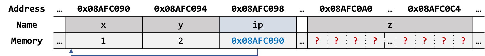

[//]: # (INCLUDE: ./c/05/src/pointer.c --from 48 --to 48 --no-comment)

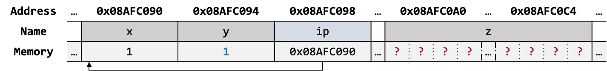

[//]: # (INCLUDE: ./c/05/src/pointer.c --from 52 --to 52 --no-comment)

---

## Pointers and Addresses (Cont'd - 7)

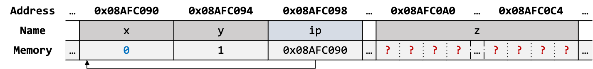

[//]: # (INCLUDE: ./c/05/src/pointer.c --from 56 --to 56 --no-comment)

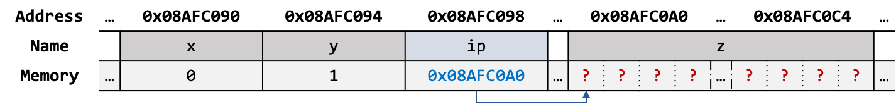

[//]: # (INCLUDE: ./c/05/src/pointer.c --from 60 --to 60 --no-comment)

---

## Pointers and Function Arguments

### TCPL §1.8 — "Arguments - Call by Value"

> One aspect of C functions may be unfamiliar to programmers who are used to some other languages, particularly Fortran. In C, all function arguments are passed **"by value."** This means that the called function is given the values of its arguments in temporary variables rather than the originals. This leads to some different properties than are seen with **"call by reference"** languages like Fortran or with `var` parameters in Pascal, in which the called routine has access to the original argument, not a local copy.

[//]: # (INCLUDE: ./c/05/src/swap1.c --from 2 --to 8 --no-comment)

[//]: # (INCLUDE: ./c/05/src/swap1.c --from 16 --to 16 --no-comment)

---

## Pointers and Function Arguments (Cont'd - 1)

### 포인터 매개변수

- 함수의 기본 타입 매개변수는 원본 전달인자에 접근할 수 없음
  - C 함수들은 전달인자를 값(*rvalue*)으로 전달
- **포인터 매개변수를 사용하면 원본 전달인자를 간접적으로 접근할 수 있음**

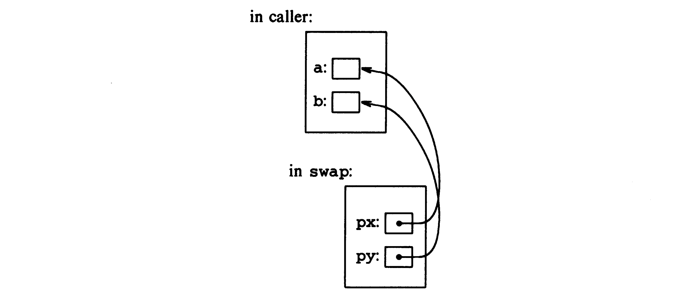

---

## Pointers and Function Arguments (Cont'd - 2)

- 포인터 매개변수를 사용한 전달인자 교환

[//]: # (INCLUDE: ./c/05/src/swap2.c)

---

## Pointers and Function Arguments (Cont'd - 3)

- 포인터 매개변수를 사용한 정수 입력 함수 `getint`

[//]: # (INCLUDE: ./c/05/src/getint/getint.c --to 6)

---

## Pointers and Function Arguments (Cont'd - 4)

[//]: # (INCLUDE: ./c/05/src/getint/getint.c --from 8)

---

## Pointers and Arrays

### 배열–포인터 대응 규칙

| Expression | Equivalent Pointer Expression |
| ---------- | ----------------------------- |
| `a[i]`     | `*(a + i)`                    |
| `&a[i]`    | `a + i`                       |

1. 배열 이름 `a` 는 **배열 0번째 요소 포인터(`&a[0]`)로 자동 변환**된다(decay, pointer to `T`).
    > An expression that has array type is converted to a pointer to the first element of the array, except when it is the operand of the `sizeof` operator, the unary `&` operator, or is a string literal used to initialize an array.
2. **첨자 연산은 내부적으로 포인터 산술로 변환된다.**

---

## Pointers and Arrays (Cont'd - 1)

### 배열 이름이 포인터로 변환되지 않는 경우

- 배열 이름을 `sizeof` 연산자의 인자로 사용할 경우

[//]: # (INCLUDE: ./c/05/src/ptr_arr_ignore.c --from 4 --to 6 --no-comment)

- 배열 이름을 주소 연산자의 피연산자로 사용할 경우

[//]: # (INCLUDE: ./c/05/src/ptr_arr_ignore.c --from 10 --to 11 --no-comment)

- 배열 이름을 초기화 구문에 사용할 경우

[//]: # (INCLUDE: ./c/05/src/ptr_arr_ignore.c --from 15 --to 16 --no-comment)

---

## Pointers and Arrays (Cont'd - 2)

### ANSI C (C89) §6.5.2.1 — "Array Subscripting"

> A postfix expression followed by an expression in square brackets (`[]`) is a binary operator that yields the value of the element of the array object at the given index.
`E1[E2]` is defined as `*((E1) + (E2))`.

[//]: # (INCLUDE: ./c/05/src/ptr_arr_ignore.c --from 23 --to 24 --no-comment)

- 배열 첨자 표현은 실제로 **이항 덧셈 연산자**로 취급되며, 아래와 같은 항등 관계가 형성됨

```text
a[i] ≡ *(a + i) ≡ *(i + a) ≡ i[a]
```

[//]: # (INCLUDE: ./c/05/src/ptr_arr_ignore.c --from 31 --to 34 --no-comment)

---

## Pointers and Arrays (Cont'd - 3)

### 배열 선언

- 배열 선언 시 `[]` 안의 숫자는 배열의 크기이며, **양의 정수 타입 상수**만 사용할 수 있음
- 배열 타입이 `T` 라면, 배열은 메모리에 `T` 타입 객체를 크기만큼 **연속적**으로 할당함

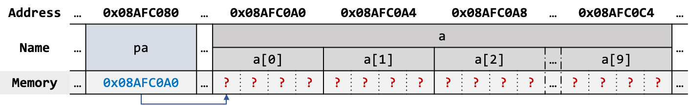

[//]: # (INCLUDE: ./c/05/src/ptr_arr_ignore.c --from 41 --to 42 --no-comment)

---

## Pointers and Arrays (Cont'd - 4)

### 배열 첨자 연산


[//]: # (INCLUDE: ./c/05/src/ptr_arr_ignore.c --from 46 --to 47 --no-comment)

---

## Pointers and Arrays (Cont'd - 5)

### 부정 첨자 (Negative Subscript)

- 음수 첨자(인덱스)는 문법적으로 허용됨
- **배열의 범위 내에서만 유효하며, 배열의 범위를 벗어나는 것은 허용되지 않음(UB)**

[//]: # (INCLUDE: ./c/05/src/neg_index.c)

---

## Pointers and Arrays (Cont'd - 6)

### ANSI C (C89) §6.7.1 — "Function Definitions"

> In function parameter declarations, "array of `T`" is adjusted to "pointer to `T`".

[//]: # (INCLUDE: ./c/05/src/ptr_arr_ignore.c --from 52 --to 53 --no-comment)

- 함수 매개변수에서 `char s[]` 는 자동으로 `char *s` 로 변환(decay)

[//]: # (INCLUDE: ./c/05/src/ptr_arr_ignore.c --from 61 --to 62 --no-comment)

- `arr` 시작 주소를 `strlen` 함수의 전달인자로 넘김(decay, pointer to `T`)
- 배열을 함수의 전달인자로 전달할 때, **배열 자체가 복사되는 것이 아닌 문자 배열의 시작 주소 포인터만 복사됨**

---

## Pointers and Arrays (Cont'd - 7)

- 문자열 길이를 계산하는 `strlen` 함수

[//]: # (INCLUDE: ./c/05/src/strlen.c)

---

## Address Arithmetic

- 포인터와 정수 간 덧셈/뺄셈, 포인터와 포인터 간 뺄셈/비교만이 유효한 연산이며, **그 외는 유효하지 않음**
- 포인터와 정수 간 산술 연산 수행 시, 정수는 포인터 타입(`T`)의 크기(`sizeof(T)`)를 기준으로 조정됨

### 포인터와 정수 간 덧셈/뺄셈

- 주소 `p` 에 대해 *n* 만큼 더할 경우, `p` 로부터 `n * sizeof(T)` 바이트 만큼 **뒤 주소**로 이동(forward)
- 주소 `p` 에 대해 *n* 만큼 뺄 경우, `p` 로부터 `n * sizeof(T)` 바이트 만큼 **앞 주소**로 이동(backward)

| Expression | Description                                        | Address Computation (Conceptual)      |
| ---------- | -------------------------------------------------- | ------------------------------------- |
| `p + n`    | Returns the address `n` elements forward from `p`  | `p + (n × sizeof(T))`                 |
| `p += n`   | Moves `p` forward by `n` elements                  | `p = p + (n × sizeof(T))`             |
| `p++`      | Moves `p` forward by 1 element                     | `p = p + sizeof(T)` (i.e., `p += 1`)  |
| `p - n`    | Returns the address `n` elements backward from `p` | `p - (n × sizeof(T))`                 |
| `p -= n`   | Moves `p` backward by `n` elements                 | `p = p - (n × sizeof(T))`             |
| `p--`      | Moves `p` backward by 1 element                    | `p = p - sizeof(T)` (i.e., `p -= 1`)  |

---

## Address Arithmetic (Cont'd - 1)

### 포인터와 포인터 간 뺄셈/비교

- 두 포인터가 동일한 배열 객체의 유효 범위 또는 마지막 다음 주소(one-past-the-end)를 가리킬 경우, 다음 연산들을 허용:
  - 뺄셈(`-`), 비교 연산(`==`, `!=`, `<`, `>`, `<=`, `>=`)


[//]: # (INCLUDE: ./c/05/src/addr_arithmetic.c --from 4 --to 13 --no-comment)

---

## Address Arithmetic (Cont'd - 2)

- 주소 연산을 응용한 간결한 형태의 문자열 길이를 계산하는 `strlen` 함수

[//]: # (INCLUDE: ./c/05/src/adv_strlen.c)

- 문자열의 시작 주소(`s`)와 문자열의 마지막 주소(`p`)를 활용한 예
- 마지막(`'\0'` 를 담고 있는 요소)의 주소에서 시작 주소를 뺀 결과는 **문자열의 실제 길이**가 됨

---

## Address Arithmetic (Cont'd - 3)

### 기초적인 저장공간 할당기


- 스택 기반의 할당기이며, 런타임에 추가로 필요한 객체를 할당하거나 불필요한 객체를 반환할 수 있음
  - `allocbuf` 는 `char` 타입 배열로, 고정된 크기의 메모리 버퍼 역할을 함
    - 추가적인 객체 사용 요청이 들어오면 해당 배열 공간을 제공
  - `allocp` 는 `allocbuf` 내에서 현재 위치를 가리키는 포인터 변수
    - 스택 포인터 역할 수행

---

## Address Arithmetic (Cont'd - 4)

### 기초적인 저장공간 할당기 동작 예시 - `alloc`


---

## Address Arithmetic (Cont'd - 5)


[//]: # (INCLUDE: ./c/05/src/alloc/main.c --from 5 --to 6 --no-comment)

---

## Address Arithmetic (Cont'd - 6)

[//]: # (INCLUDE: ./c/05/src/alloc/alloc.c --from 3 --to 21 --no-comment)

---

## Address Arithmetic (Cont'd - 7)

### 기초적인 저장공간 할당기 동작 예시 - `afree`

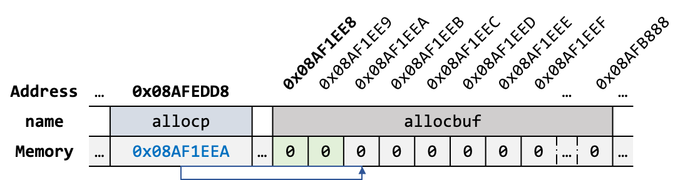

[//]: # (INCLUDE: ./c/05/src/alloc/main.c --from 8 --to 9 --no-comment)

---

## Address Arithmetic (Cont'd - 8)

[//]: # (INCLUDE: ./c/05/src/alloc/alloc.c --from 23 --to 28 --no-comment)

---

## Character Pointers and Functions

### 문자열과 포인터


[//]: # (INCLUDE: ./c/05/src/strings.c --from 4 --to 4 --no-comment)

- **문자열은 상수이자 이름 없는 객체**이며, 상수는 읽기 전용 데이터 영역(.rodata)에 위치
- `pmessage` 는 상수 객체를 가리키는 포인터이며, **문자열을 소유하지 않는 형태**
- `pmessage` 포인터를 간접 참조해 내용을 읽을 순 있으나 수정은 허용하지 않음(UB)

[//]: # (INCLUDE: ./c/05/src/strings.c --from 8 --to 8 --no-comment)

- 문자 배열을 할당함과 동시에 문자열(초기화자, `"now is the time"`)을 **복사**하여 초기화
- 문자열의 각 문자는 배열의 각 요소에 저장되며, **마지막 요소에는 널 문자(`'\0'`)가 자동 포함됨**
- **문자열을 직접 포함하는 형태**이므로, 배열 객체의 내용을 읽거나 수정할 수 있음

---

## Character Pointers and Functions (Cont'd - 1)

### 배열 크기에 따른 배열 초기화 규칙

> An array may be initialized by following its declaration with a list of initializers enclosed in braces and separated by commas.

| Size Specified | Initializer Count Relation | Result                                 | Valid? |
|----------------|----------------------------|----------------------------------------|--------|
| n              | < n                        | Remaining elements set to 0            | Yes    |
| n              | == n                       | Fully initialized                      | Yes    |
| n              | > n                        | Error: too many initializers           | No     |
| unspecified    | N/A                        | Size inferred from number of values    | Yes    |

---

## Character Pointers and Functions (Cont'd - 2)

- 유효한 배열 초기화

[//]: # (INCLUDE: ./c/05/src/arr_init.c --from 4 --to 11 --no-comment)

- 유효하지 않은 배열 초기화

[//]: # (INCLUDE: ./c/05/src/arr_init.c --from 18 --to 19 --no-comment)

---

## Character Pointers and Functions (Cont'd - 3)

### 문자열 함수

- C는 문자열 관련 연산자가 없으므로, 문자열 연산 시 표준 함수를 이용하거나 직접 구현해야 함
- 문자열 관련 표준 함수 선언은 `<string.h>` 헤더 파일 내에 있음
- 문자열을 복사하는 `strcpy` 함수

[//]: # (INCLUDE: ./c/05/src/strcpy1.c)

---

## Character Pointers and Functions (Cont'd - 4)

- 간결화된 `strcpy` 함수

[//]: # (INCLUDE: ./c/05/src/strcpy2.c)

- 지역 변수 `i` 를 사용하지 않고 포인터 변수만을 사용하여 구현

[//]: # (INCLUDE: ./c/05/src/strcpy3_ignore.c)

- 불필요한 중복(`'\0'` 와의 비교) 제거
  - `'\0'` 대입 시 표현식의 최종 평가는 `'\0'` 이며, 이는 곧 거짓을 의미
  - **`'\0'` ≡ 0**

---

## Character Pointers and Functions (Cont'd - 5)

- 두 문자열을 비교하는 `strcmp` 함수

[//]: # (INCLUDE: ./c/05/src/strcmp1.c)

---

## Character Pointers and Functions (Cont'd - 6)

- 간결화된 `strcmp` 함수

[//]: # (INCLUDE: ./c/05/src/strcmp2.c)

---

## Character Pointers and Functions (Cont'd - 7)

### 포인터를 활용한 스택 연산

- 단항 연산자의 결합 방향은 오른쪽에서 왼쪽이며, 우선 순위는 모두 동일함


[//]: # (INCLUDE: ./c/05/src/stack.c --from 4 --to 6 --no-comment)

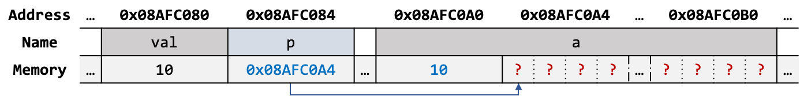

[//]: # (INCLUDE: ./c/05/src/stack.c --from 10 --to 10 --no-comment)

---

## Character Pointers and Functions (Cont'd - 8)


[//]: # (INCLUDE: ./c/05/src/stack.c --from 14 --to 14 --no-comment)

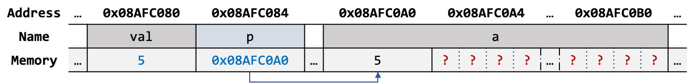

[//]: # (INCLUDE: ./c/05/src/stack.c --from 18 --to 18 --no-comment)

---

## Pointer Arrays; Pointers to Pointers

- 문자열을 사전 순으로 정렬하는 프로그램

```text
read all the lines of input
sort them
print them in order
```

```text
.
├── alloc.c
├── getline.c
├── line.c
├── main.c
└── qsort.c
```

---

## Pointer Arrays; Pointers to Pointers (Cont'd - 1)


- 배열에 보관된 문자열을 직접 정렬하는 것은 비효율적임:
    1. 문자열 중 가장 긴 문자열을 기준으로 모든 배열을 할당해야 한다.
    2. 문자열의 길이만큼 문자 교환을 수행해야 한다.
- 포인터 타입 배열을 사용해 간접적으로 정렬하면 효율적으로 정렬할 수 있음
  - **정렬이 필요한 문자열은 문자열의 시작 주소만 교환하며 정렬**

---

## Pointer Arrays; Pointers to Pointers (Cont'd - 2)

- `alloc.c`

[//]: # (INCLUDE: ./c/05/src/sort1/alloc.c --to 19)

---

## Pointer Arrays; Pointers to Pointers (Cont'd - 3)

[//]: # (INCLUDE: ./c/05/src/sort1/alloc.c --from 21)

---

## Pointer Arrays; Pointers to Pointers (Cont'd - 4)

- `getline.c`

[//]: # (INCLUDE: ./c/05/src/sort1/getline.c)

---

## Pointer Arrays; Pointers to Pointers (Cont'd - 5)

- `line.c`

[//]: # (INCLUDE: ./c/05/src/sort1/line.c --to 11)

---

## Pointer Arrays; Pointers to Pointers (Cont'd - 6)

[//]: # (INCLUDE: ./c/05/src/sort1/line.c --from 13)

---

## Pointer Arrays; Pointers to Pointers (Cont'd - 7)

- `main.c`

[//]: # (INCLUDE: ./c/05/src/sort1/main.c --to 9)

---

## Pointer Arrays; Pointers to Pointers (Cont'd - 8)

[//]: # (INCLUDE: ./c/05/src/sort1/main.c --from 11)

---

## Pointer Arrays; Pointers to Pointers (Cont'd - 9)

- `qsort.c`

[//]: # (INCLUDE: ./c/05/src/sort1/qsort.c --to 20)

---

## Pointer Arrays; Pointers to Pointers (Cont'd - 10)

[//]: # (INCLUDE: ./c/05/src/sort1/qsort.c --from 22)

---

## Multi‑dimensional Arrays

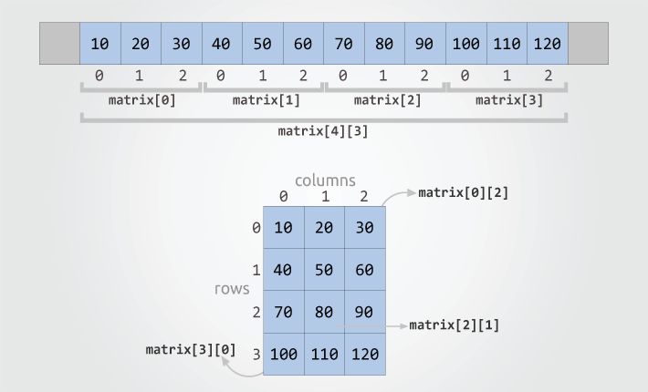

---

## Multi‑dimensional Arrays (Cont'd - 1)

### 2차원 배열

[//]: # (INCLUDE: ./c/05/src/n_dim_arr.c --from 4 --to 9 --no-comment)

- 표현식 `matrix[i][j]` 는 `*(*(matrix + i) + j)` 로 계산
- 오프셋 계산 식은 `(i * <COLUMNS>) + j`

---

## Multi‑dimensional Arrays (Cont'd - 2)

### 3차원 배열

[//]: # (INCLUDE: ./c/05/src/n_dim_arr.c --from 27 --to 36 --no-comment)

- 표현식 `cube[i][j][k]` 는 `*(*(*(cube + i) + j) + k)` 로 계산
- 오프셋 계산식은 `(i * <ROWS> * <COLUMNS>) + (j * <COLUMNS>) + k`

---

## Multi‑dimensional Arrays (Cont'd - 3)

### *n*차원 배열의 생략 가능한 차원과 불가능한 차원

- 배열의 첫 번째 차원은 배열 초기화 시 또는 함수 인자로 사용 시 생략 가능
- **그 외 차원은 반드시 명시해야 함**

[//]: # (INCLUDE: ./c/05/src/n_dim_arr.c --from 18 --to 18 --no-comment)

#### *n*차원 배열의 첫 번째 차원 생략 가능 이유

1. **전체 초기화자 개수로부터 첫 번째 차원의 크기를 추론할 수 있다.**  
2. 하위 차원의 크기가 명확하므로 전체 요소 수를 하위 차원 수로 나누어 계산 가능하다.  
3. 결과적으로 첫 번째 차원 생략 시에도 배열은 컴파일 시에 완전한 타입(complete type)으로 간주한다.

---

## Multi‑dimensional Arrays (Cont'd - 4)

### 날짜 변환 프로그램

```text
.
├── day.c
├── main.c
└── month_name.c
```

---

## Multi‑dimensional Arrays (Cont'd - 5)

- `day.c`

[//]: # (INCLUDE: ./c/05/src/day/day.c --to 16)

---

## Multi‑dimensional Arrays (Cont'd - 6)

[//]: # (INCLUDE: ./c/05/src/day/day.c --from 18)

---

## Multi‑dimensional Arrays (Cont'd - 7)

- `main.c`

[//]: # (INCLUDE: ./c/05/src/day/main.c)

---

## Multi‑dimensional Arrays (Cont'd - 8)

- `month_name.c`

[//]: # (INCLUDE: ./c/05/src/day/month_name.c)

### 포인터 배열 초기화

- 포인터 배열은 각 요소가 포인터로 구성된 배열
- 상수 문자열은 .rodata 영역에 이름 없는 객체로 할당되어, 오직 포인터로만 접근할 수 있음

---

## Pointers vs Multi-dimensional Arrays

### 2차원 배열과 포인터 배열 간 차이

[//]: # (INCLUDE: ./c/05/src/n_dim_arr.c --from 45 --to 46 --no-comment)


- 포인터 배열의 각 행 길이는 **가변**(총 4개의 포인터 변수를 연속적으로 메모리에 할당)
  - 문자열 26(14 + 4 + 4 + 4) bytes + 포인터 32(8 * 4, if the machine is LP64) bytes 사용

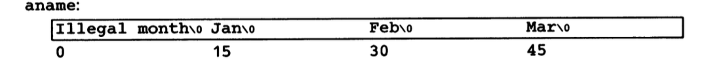

- 2차원 배열의 각 행 길이는 **고정**(총 60 bytes를 연속적으로 메모리에 할당)

---

## Command‑line Arguments

### `main` 함수의 다른 형태

[//]: # (INCLUDE: ./c/05/src/command_line_args.c --from 4 --to 4 --no-comment)

- 프로그램 실행 시 전달되는 데이터를 `main` 함수가 전달받을 수 있는 형태

### `argc` (Argument Count)

- 전달된 인자의 수를 나타내며, 항상 1 이상인 값을 저장
  - 프로그램 실행 시 명령은 항상 전달됨(`e.g., ./prog`)

### `argv` (Argument Vector)

- 프로그램 실행 시 전달되는 데이터를 문자열 형태로 가리키는 포인터 배열
- `argv[0]` 은 프로그램 실행 시 명령을 문자열로 가리키고 있음
- `argv[1]` ~ `argv[argc - 1]` 은 사용자가 프로그램 실행 시 전달한 데이터를 가리킴
- `argv[argc]` 은 `NULL` 를 가리키며, 전달인자의 끝을 나타냄

---

## Command‑line Arguments (Cont'd - 1)

- 프로그램으로 전달한 인자를 출력하는 프로그램


[//]: # (INCLUDE: ./c/05/src/command_line_args.c)

---

## Command‑line Arguments (Cont'd - 2)

- 프로그램으로 전달한 인자를 출력하는 프로그램(두 번째 버전)

[//]: # (INCLUDE: ./c/05/src/command_line_args_2nd.c)

---

## Command‑line Arguments (Cont'd - 3)

- 프로그램으로 전달한 인자를 출력하는 프로그램(세 번째 버전)

[//]: # (INCLUDE: ./c/05/src/command_line_args_3rd.c)

---

## Command‑line Arguments (Cont'd - 4)

- 개선된 입력 문자열 중 특정 패턴이 포함된 문자열만 출력하는 프로그램:
  - 4장에서 구현한 프로그램은 코드 내에 패턴이 기재되어 있음
  - 패턴 수정이 필요할 때마다 코드를 수정한 뒤 새로 빌드해 사용해야 함
  - 커맨드 라인 전달인자를 사용할 경우 패턴을 코드로부터 분리할 수 있음

```text
./find -x -n <PATTERN>
```

- `-x` (for except)
  - 패턴이 포함된 문자열을 제외한 모든 문자열 출력
- `-n` (for number)
  - 문자열 출력 시 행 번호를 같이 출력
- `<PATTERN>`
  - 찾고자 하는 패턴 입력
- 옵션(optional flags, `-` 기호로 시작하는 전달인자)은 순서 관계 없이 사용 가능해야 함
  - 필요에 따라 묶어서 사용 가능
  - e.g., `./find -nx <PATTERN>`

---

## Command‑line Arguments (Cont'd - 5)

[//]: # (INCLUDE: ./c/05/src/grep/main.c --to 13)

---

## Command‑line Arguments (Cont'd - 6)

[//]: # (INCLUDE: ./c/05/src/grep/main.c --from 15 --to 31)

---

## Command‑line Arguments (Cont'd - 7)

[//]: # (INCLUDE: ./c/05/src/grep/main.c --from 33)

- `strstr` 함수는 한 문자열(`line`)에서 다른 문자열(`*argv`, pattern)이 처음 나타나는 위치를 찾는 함수
- 대상 문자열에 다른 문자열이 존재한다면 해당 위치를 가리키는 유효한 포인터를 반환하고, 존재하지 않는다면 `NULL` 반환

---

## Pointers to Functions

- .text 영역에 할당된 함수 코드의 시작 주소를 가리키는 포인터 변수

[//]: # (INCLUDE: ./c/05/src/function_ptr.c)

---

## Pointers to Functions (Cont'd - 1)

- 함수 포인터 사용 시 **반드시 괄호를 써주어야 함**

[//]: # (INCLUDE: ./c/05/src/function_ptr_cmp.c)

### `void *` 타입

- 어떤 타입이든 가리킬 수 있는 범용 포인터(generic pointer)
- 타입 정보가 없으므로 간접 참조는 사용할 수 없음
  - `void *` 포인터 변수는 **순수한 주소만을 보관하는 변수**
- 간접 참조는 다른 타입으로의 변환이 선행되어야 가능

---

## Pointers to Functions (Cont'd - 2)

- 커맨드 라인 전달인자를 통해 해석 방법을 결정하는 정렬 프로그램
  - `-n` 옵션이 전달되면 각 줄을 숫자로 해석하여 정렬
  - `-n` 옵션이 없다면 각 줄을 문자열로 해석하여 정렬
- 함수 포인터를 사용해 전달된 옵션에 따라 정렬 함수를 선택

```text
.
├── alloc.c
├── getline.c
├── line.c
├── main.c
├── numcmp.c
└── qsort.c
```

---

## Pointers to Functions (Cont'd - 3)

- `main.c`

[//]: # (INCLUDE: ./c/05/src/sort2/main.c --to 12)

---

## Pointers to Functions (Cont'd - 4)

[//]: # (INCLUDE: ./c/05/src/sort2/main.c --from 14)

---

## Pointers to Functions (Cont'd - 5)

- `qsort.c`

[//]: # (INCLUDE: ./c/05/src/sort2/qsort.c --to 19)

---

## Pointers to Functions (Cont'd - 6)

[//]: # (INCLUDE: ./c/05/src/sort2/qsort.c --from 21)

---

## Pointers to Functions (Cont'd - 7)

- `numcmp.c`

[//]: # (INCLUDE: ./c/05/src/sort2/numcmp.c)
