# Pointers  and  Arrays

## Goals of This Chapter

### 포인터와 메모리 주소의 개념 이해

* 단항 연산자 `*`, `&` 소개

### 포인터 산술과 주소 연산 이해

### 포인터와 배열의 관계 파악

* 포인터 배열과 2‑차원 배열의 차이

### 문자열 상수와 `char *` 사용법

### 커맨드‑라인 전달인자 소개

* 프로그램 실행 시 `main` 함수로 값을 전달하는 방법 소개

### 포인터를 매개변수로 사용하는 함수와 함수 포인터 소개

---

## Pointers and Addresses

### 메모리의 구성

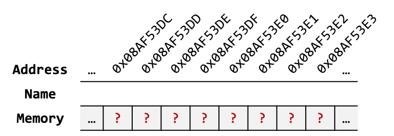

* 메모리는 **cell**들의 연속으로, cell 하나는 1 byte를 나타냄
* 각 cell에는 고유한 **주소 (address)** 가 부여됨
* 인접한 2 cell → `short` (2 bytes)
* 인접한 4 cell → `int` (4 bytes)
* **포인터 (pointer)** 는 이런 셀‑집합 (객체)의 **첫 번째 주소**를 나타냄
  * 첫 번째 주소는 셀-집합에서 가장 낮은 주소를 의미

#### Objects (객체)

> **Object** refers to the physical region of storage created by the program’s execution environment to hold a typed value.

* 변수는 객체의 일종으로, 프로그램 실행 시 할당된 메모리 공간에 이름을 부여한 것

---

## Pointers and Addresses (Cont'd - 1)

### 포인터 변수 선언

* `type *identifier` 형태를 사용
* 포인터 변수 선언에 사용한 `*`는 연산자가 아님에 유의

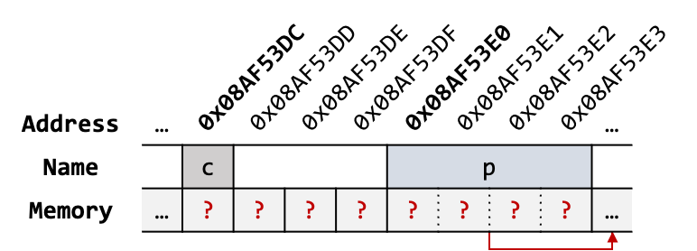

```c
/* Automatic variables without initialization -> contain garbage values */
char c;   /* address: 0x08AF53DC */
char *p;  /* address: 0x08AF53E0 */
```

---

## Pointers and Addresses (Cont'd - 2)

### 객체의 포인터

* `&identifier` 형태를 사용
* `identifier`의 객체 주소를 반환

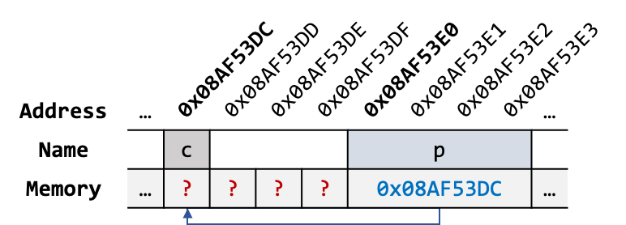

```c
p = &c;   /* The unary & operator yields the address of its operand. */
```

* `&c` 표현은 변수 `c`의 포인터를 반환
* `p = &c` 표현은 포인터 변수 `p`에 변수 `c`의 포인터를 대입

---

## Pointers and Addresses (Cont'd - 3)

### 단항 연산자 `&` (Address-of Operator)

> The unary `&` operator yields the address of its operand.
If the operand has type `T`, the result has type pointer to `T`.

### 단항 연산자 `*` (Indirection Operator)

> The unary `*` operator denotes indirection.
If the operand is a pointer to an object, the result is an **lvalue** designating the object.

| Category                                | `lvalue`                                           | `rvalue`                                                             |
| --------------------------------------- | -------------------------------------------------- | -------------------------------------------------------------------- |
| **Meaning**                             | An expression that refers to a memory **location** | An expression that represents a **value**, not necessarily in memory |
| **Can appear on left of `=`?**          |  Yes                                              | No                                                                 |
| **Has identifiable address? (`&expr`)** | Yes                                              | No                                                                 |
| **Can be assigned to?**                 | Yes (e.g., `x = 5;`)                             | No (e.g., `x + 1 = 5;` → error)                                    |

* `lvalue`는 값이 저장되는 곳이며, `rvalue`는 값을 의미함
* `lvalue`는 필요에 따라 `rvalue`로 변환될 수 있으나, `rvalue`는 `lvalue`가 될 수 없음

---

## Pointers and Addresses (Cont'd - 4)

### 단항 연산자 `*`, `&`의 사용 예시 - 1

```c
int x = 10, y = 20;

/* `&x` yields the address of `x` (rvalue of type int *) */
int *ip = &x;

/* `*ip` is an lvalue (refers to `x`), yields 10 -> `y` becomes 11 */
y = *ip + 1;

/* `*ip` reads `x` (10), adds 1, writes back -> `x` becomes 11 */
*ip += 1;

/* Pre-increment: `*ip` becomes 12 before value is used */
++*ip;

/* Post-increment: `*ip` yields 12, then increments -> `x` is 13 */
(*ip)++;
```

* 단항 연산자의 결합 방향은 오른쪽에서 왼쪽
* `&x`는 변수 `x`의 포인터를 반환 (`rvalue`)
* `ip`는 같은 형 객체의 포인터를 가질 수 있는 포인터 변수
* `*ip`는 포인터 변수의 주소를 간접 참조 (`lvalue`)
  * **`int *ip = &x;` 문장이 실행된 이후, `*ip`는 변수 `x`와 같은 객체를 지칭함 (`≡`, identically equal)**

---

## Pointers and Addresses (Cont'd - 5)

### 단항 연산자 `*`, `&`의 사용 예시 - 2

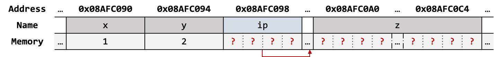

```c
int x = 1, y = 2, z[10]; /* automatic variables */
int *ip;       /* Declare `ip` as a pointer to an int */
```


```c
ip = &x;       /* Store the address of `x` in `ip` */
```


```c
y = *ip;       /* Assign the value pointed to by `ip` to `y` */
```

---

## Pointers and Addresses (Cont'd - 6)

### 단항 연산자 `*`, `&`의 사용 예시 - 2 (Cont'd)


```c
*ip = 0;       /* Store 0 in the location pointed to by `ip` */
```


```c
ip = &z[0];    /* Store the address of the first element of `z` in `ip` */
```

---

## Pointers and Function Arguments

### TCPL §1.8 — "Arguments - Call by Value"

> One aspect of C functions may be unfamiliar to programmers who are used to some other languages, particularly Fortran. In C, all function arguments are passed **"by value."** This means that the called function is given the values of its arguments in temporary variables rather than the originals. This leads to some different properties than are seen with **"call by reference"** languages like Fortran or with `var` parameters in Pascal, in which the called routine has access to the original argument, not a local copy.

[//]: # (INCLUDE: ./c/05/swap_value.c)

---

## Pointers and Function Arguments (Cont'd - 1)

### 포인터 매개변수

* 함수의 기본 자료형 매개변수는 원본 전달인자에 접근할 수 없음
  * C 언어에서의 함수들은 전달인자를 값 (`rvalue`)으로 전달
* **포인터 매개변수를 사용하면 원본 전달인자를 간접적으로 접근할 수 있음**


---

## Pointers and Function Arguments (Cont'd - 2)

### 포인터 매개변수를 사용한 두 원본 전달인자 교환 예

[//]: # (INCLUDE: ./c/05/swap.c)

---

## Pointers and Function Arguments (Cont'd - 3)

### 포인터 매개변수를 사용한 예 - 사용자 정의 함수 `getint`

[//]: # (INCLUDE: ./c/05/ex02_getint/getint.c)

---

## Pointers and Arrays

### 배열–포인터 대응 규칙

| Expression | Equivalent Pointer Expression |
| ---------- | ---------------------------- |
| `a[i]`     | `*(a + i)`                   |
| `&a[i]`    | `a + i`                      |

1. 배열 이름 `a` 는 **배열 0번째 요소의 주소 (`&a[0]`)로 자동 변환**된다 (decay, pointer to `T`).
    > An expression that has array type is converted to a pointer to the first element of the array, except when it is the operand of the `sizeof` operator, the unary `&` operator, or is a string literal used to initialize an array.
2. **첨자 연산은 내부적으로 포인터 산술로 변환된다.**

#### 배열 이름이 포인터로 변환되지 않는 경우

```c
/* 1. The array-type expression is used with the sizeof operator */
int a[5];
sizeof(a);  /* `a` is an array object; sizeof(a) yields 20 (not decayed) */

/* 2. The array-type expression is used with the address-of operator */
&a;         /* type: int (*)[5] — address of the entire array */

/* 3. The array-type expression is used in an initializer */
char str[] = "Hello";  /* "Hello" is a string literal; it is not decayed */
```

---

## Pointers and Arrays (Cont'd - 1)

### ANSI C (C89) §6.5.2.1 — "Array Subscripting"

> A postfix expression followed by an expression in square brackets (`[]`) is a binary operator that yields the value of the element of the array object at the given index.
`E1[E2]` is defined as `*((E1) + (E2))`.

```c
int a[5] = { 10, 20, 30, 40, 50 };
int x = a[2]; /* -> *(a + 2) -> *(base address of `a` + (2 * sizeof(int))) */
```

* 표현식 뒤에 등장하는 괄호 표현은 실제로 **이항 덧셈 연산자**로 취급되며, 아래와 같은 항등 관계가 형성됨

```text
a[i] ≡ *(a + i) ≡ *(i + a) ≡ i[a]
```

```c
int a[5] = { 10, 20, 30, 40, 50 };

a[2] == *(a + 2);  /* True */
2[a] == *(2 + a);  /* Also true (though rarely written this way) */
```

---

## Pointers and Arrays (Cont'd - 2)

### 배열–포인터 대응 규칙 예

```c
int a[10];
```

* 배열 선언 시 `[]` 안의 숫자는 배열의 크기이며, 양의 정수형 상수만 사용할 수 있음
* 위 선언은 `int` 형 객체 10개를 메모리에 **연속적**으로 할당하며, 각 객체는 `a[0]`, `a[1]`, ... , `a[9]`라는 이름을 가짐


```c
int *pa = a;       /* a ≡ &a[0] */
```

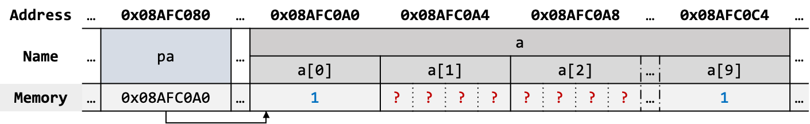

```c
a[0] = 1;          /*  a[0] ≡ *(a + 0)  */
*(a + 9) = pa[0];  /* pa[0] ≡ *(pa + 0) */
```

---

## Pointers and Arrays (Cont'd - 3)

### 부정 첨자 (Negative Subscript)

* 음수 첨자 (인덱스)는 문법적으로 허용됨
* **배열의 범위 내에서만 유효하며, 배열의 범위를 벗어나는 것은 허용되지 않음 (UB)**

[//]: # (INCLUDE: ./c/05/neg_index.c)

---

## Pointers and Arrays (Cont'd - 4)

### 배열 전달인자를 받는 함수 예 - 표준 함수 `strlen`

[//]: # (INCLUDE: ./c/05/strlen.c)

[//]: # (INCLUDE: ./c/05/strlen_1.c)

---

## Pointers and Arrays (Cont'd - 5)

### ANSI C (C89) §6.7.1 — "Function Definitions"

> In function parameter declarations, "array of `T`" is adjusted to "pointer to `T`".

```c
/* 1 */ int strlen(char s[]); /* actually treated as: int strlen(char *s) */
/* 2 */ int strlen(char *s);
```

* 함수 매개변수에서 `char s[]`는 자동으로 `char *s`로 변환 (decay)

```c
char arr[] = "abc";
strlen(arr);
```

* 문자 배열 `arr`에 문자열을 복사한 뒤, `arr` 시작 주소를 `strlen` 함수의 전달인자로 넘김
* 배열을 함수의 전달인자로 전달할 때, **배열 자체가 복사되는 것이 아닌 문자 배열의 시작 주소 포인터만 복사됨**

---

## Address Arithmetic

* 포인터 산술을 수행할 때, 모든 연산은 가리키는 대상의 형 (`T`)의 크기 (`sizeof(T)`)를 기준으로 조정됨
  * 컴파일러는 올바른 바이트 주소를 계산하기 위해, **오프셋에 `sizeof(T)`를 자동으로 보정하여 계산**
* 포인터와 정수 간 덧셈/뺄셈, 포인터와 포인터 간 뺄셈/비교만이 유효한 연산이며, **그 외는 유효하지 않음**

### 포인터와 정수 간 덧셈/뺄셈

* 주소 `p`에 대해 *n*만큼 더할 경우, `p`로부터 `n * sizeof(T)` 바이트 만큼 **뒤 주소**로 이동 (forward)

| Expression | Description                                 | Address Computation (Conceptual)      |
|------------|---------------------------------------------|----------------------------------------|
| `p + n`    | Returns the address `n` elements forward from `p` | `p + (n × sizeof(T))`                 |
| `p += n`   | Moves `p` forward by `n` elements                | `p = p + (n × sizeof(T))`             |
| `p++`      | Moves `p` forward by 1 element                   | `p = p + sizeof(T)` (i.e., `p += 1`)  |

* 주소 `p`에 대해 *n*만큼 뺄 경우, `p`로부터 `n * sizeof(T)` 바이트 만큼 **앞 주소**로 이동 (backward)

| Expression | Description                                      | Address Computation (Conceptual)      |
|------------|--------------------------------------------------|----------------------------------------|
| `p - n`    | Returns the address `n` elements backward from `p`      | `p - (n × sizeof(T))`                 |
| `p -= n`   | Moves `p` backward by `n` elements                | `p = p - (n × sizeof(T))`             |
| `p--`      | Moves `p` backward by 1 element                   | `p = p - sizeof(T)` (i.e., `p -= 1`)  |

---

## Address Arithmetic (Cont'd - 1)

### 포인터와 포인터 간 뺄셈/비교

* 두 포인터가 동일한 배열 객체의 유효 범위 또는 마지막 다음 주소 (one-past-the-end)를 가리킬 경우, 다음 연산들을 허용:
  * 뺄셈 (`-`), 비교 연산 (`==`, `!=`, `<`, `>`, `<=`, `>=`)
  * 마지막 다음 주소의 간접 참조는 **배열 객체의 범위를 벗어나므로** 허용하지 않음

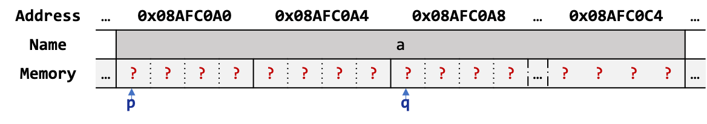

```c
int a[10];
int *p = &a[0];  /* points to first element */
int *q = &a[2];  /* points to third element */

/* Pointer subtraction: how many elements apart */
int diff = q - p;  /* result: 2, (q - p) / sizeof(int) */

/* Pointer comparison within the same array */
if (p < q) { /* true: p comes before q */ }

/* One-past-the-end pointer */
int *end = &a[10];  /* valid pointer, points just past the array */

/* end can be used in comparisons */
while (p++ < end) { /* safe iteration from a[0] to a[9] */ }
```

---

## Address Arithmetic (Cont'd - 2)

### 포인터 산술을 사용한 예 - 표준 함수 `strlen`

[//]: # (INCLUDE: ./c/05/05.c)

* 문자열의 시작 주소 (`s`)와 문자열의 마지막 주소 (`p`)를 활용한 예
* 마지막 (`'\0'`를 담고 있는 요소)의 주소에서 시작 주소를 뺀 결과는 **문자열의 실제 길이**가 됨

---

## Address Arithmetic (Cont'd - 3)

### 기초적인 저장공간 할당기

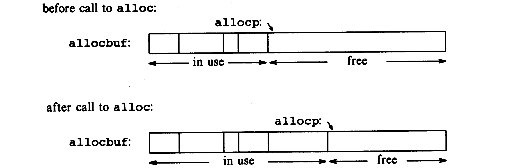

* 스택 기반의 할당기이며, 런타임 때 추가로 필요한 객체를 할당하거나 불필요한 객체를 반환할 수 있음
  * `allocbuf`는 `char` 형 배열로, 고정된 크기의 메모리 버퍼 역할을 함
    * 추가적인 객체 사용 요청이 들어오면 해당 배열 공간을 제공
  * `allocp`는 `allocbuf` 내에서 현재 위치를 가리키는 포인터 변수
    * 스택 포인터 역할 수행

---

## Address Arithmetic (Cont'd - 4)

### 기초적인 저장공간 할당기 동작 예시 - `alloc`

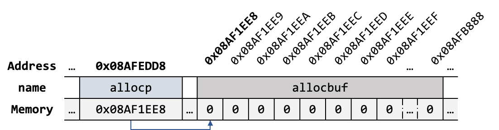

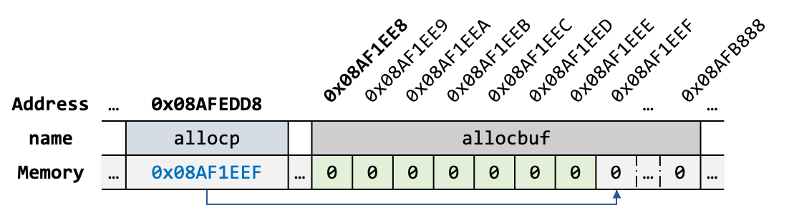

```c
p = alloc(7);  /* `alloc` returns address 0x08AF1EE8 after allocating 7 bytes */
```

---

## Address Arithmetic (Cont'd - 5)

### 기초적인 저장공간 할당기 동작 예시 - `afree`


```c
afree(p + 2);  /* sets `allocp` to 0x08AF1EEA, meaning 5 bytes were released */
```

---

## Address Arithmetic (Cont'd - 6)

[//]: # (INCLUDE: ./c/05/03.c)

---

## Character Pointers and Functions

### 문자열과 포인터


```c
char *pmessage = "now is the time";   /* a pointer */
```

* 문자열의 주소를 포인터 변수 `pmessage`에 저장
* **문자열은 상수이자 이름 없는 객체**이며, 상수는 읽기 전용 메모리 (.text or .rodata)영역에 위치
* `pmessage`는 상수 객체를 가리키는 포인터이며, **문자열을 소유하지 않는 형태**
* `pmessage` 포인터를 간접 참조해 내용을 읽을 순 있으나 수정은 허용하지 않음 (UB)

```c
char amessage[] = "now is the time";  /* an array */
```

* 문자 배열을 할당함과 동시에 문자열 (초기화자, `"now is the time"`)을 **복사**하여 초기화
* 문자열의 각 문자는 배열의 각 요소에 저장되며, **마지막 요소에는 널 문자 (`'\0'`)가 자동 포함됨**
* **문자열을 직접 포함하는 형태**이므로, 배열 객체의 내용을 읽거나 수정할 수 있음

---

## Character Pointers and Functions (Cont'd - 1)

### 배열 크기에 따른 배열 초기화 규칙

> An array may be initialized by following its declaration with a list of initializers enclosed in braces and separated by commas.

| Size Specified | Initializer Count Relation | Result                                 | Valid? |
|----------------|----------------------------|----------------------------------------|--------|
| n              | < n                        | Remaining elements set to 0            | Yes    |
| n              | == n                       | Fully initialized                      | Yes    |
| n              | > n                        | Error: too many initializers           | No     |
| unspecified    | N/A                        | Size inferred from number of values    | Yes    |

[//]: # (INCLUDE: ./c/05/array_init.c)

[//]: # (INCLUDE: ./c/05/array_init_error.c)

---

## Character Pointers and Functions (Cont'd - 2)

### 문자열 표준 함수 `strcpy`

* C 언어는 문자열 관련 연산자가 없으므로, 문자열 연산 시 표준 함수를 이용하거나 직접 구현해야 함
* 문자열 관련 표준 함수 선언은 `<string.h>` 헤더 파일 내에 있음

[//]: # (INCLUDE: ./c/05/strcpy.c)

[//]: # (INCLUDE: ./c/05/strcpy1.c)

---

## Character Pointers and Functions (Cont'd - 3)

### 축약된 문자열 표준 함수 `strcpy`

[//]: # (INCLUDE: ./c/05/strcpy2.c)

* 전위 증가 연산자를 조건식 내 후위 증가 연산자로 대치하여 축약

[//]: # (INCLUDE: ./c/05/strcpy3.c)

* 불필요한 중복 (`'\0'`와의 비교) 제거
  * `'\0'` 대입 시 표현식의 최종 평가는 `'\0'`이며, 이는 곧 거짓을 의미
  * **`'\0'` ≡ 0**

---

## Character Pointers and Functions (Cont'd - 4)

### 문자열 표준 함수 `strcmp`

* 두 포인터가 가리키는 문자열이 서로 같으면 0, 그렇지 않으면 0이 아닌 수 반환

[//]: # (INCLUDE: ./c/05/strcmp1.c)

[//]: # (INCLUDE: ./c/05/strcmp2.c)

---

## Character Pointers and Functions (Cont'd - 5)

### 포인터를 활용한 스택 연산

```c
*p++ = val;  /* push val onto stack */
val = *--p;  /* pop top of stack into val */
```

* 단항 연산자의 결합 방향은 오른쪽에서 왼쪽이며, 우선 순위는 모두 동일함

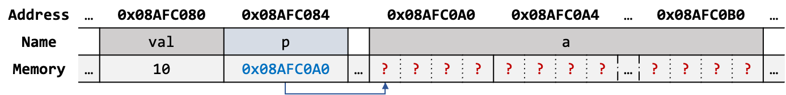

```c
int val = 10;
int a[5];
int *p = a;
```

---

## Character Pointers and Functions (Cont'd - 6)

### 포인터를 활용한 스택 연산 예시


```c
*p++ = val;
```

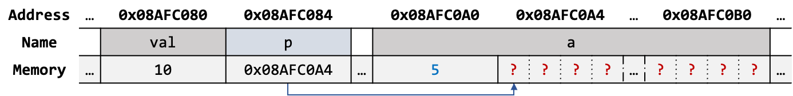

```c
a[0] = 5;
```


```c
val = *--p;
```

---

## Pointer Arrays; Pointers to Pointers

### 문자열을 사전 순으로 정렬하는 프로그램


```text
read all the lines of input
sort them
print them in order
```

* 배열에 기록되어 있는 문자열을 물리적으로 정렬하는 것은 여러 제약으로 인해 비효율적임
    1. 문자열 중 가장 긴 문자열을 기준으로 모든 배열을 할당해야 한다.
    2. 문자열의 길이만큼 문자 교환을 수행해야 한다.
* 포인터 형 배열을 사용하면 문자열을 논리적으로 정렬할 수 있음
  * **정렬이 필요한 문자열은 문자열의 시작 주소만 교환하며 정렬**

---

## Pointer Arrays; Pointers to Pointers (Cont'd - 1)

* `alloc.c`

[//]: # (INCLUDE: ./c/05/ex04_sort1/alloc.c)

---

## Pointer Arrays; Pointers to Pointers (Cont'd - 2)

* `getline.c`

[//]: # (INCLUDE: ./c/05/ex04_sort1/getline.c)

---

## pointer arrays; pointers to pointers (cont'd - 3)

* `line.c`

[//]: # (INCLUDE: ./c/05/ex04_sort1/line.c)

---

## pointer arrays; pointers to pointers (cont'd - 4)

* `main.c`

[//]: # (INCLUDE: ./c/05/ex04_sort1/main.c)

---

## pointer arrays; pointers to pointers (cont'd - 5)

* `qsort.c`

[//]: # (INCLUDE: ./c/05/ex04_sort1/qsort.c)

---

## Multi‑dimensional Arrays

### 2차원 배열


[//]: # (INCLUDE: ./c/05/2-dim.c)

* 표현식 `matrix[i][j]`는 `*(*(matrix + i) + j)`로 계산
* 오프셋 계산 식은 `i * <COLUMNS> + j`

---

## Multi‑dimensional Arrays (Cont'd - 1)

### 3차원 배열

[//]: # (INCLUDE: ./c/05/3-dim.c)

* 표현식 `cube[i][j][k]`는 `*(*(*(cube + i) + j) + k)`로 계산
* 오프셋 계산식은 `(i * <ROWS> + j) * <COLUMNS> + k`

### *n*차원 배열의 생략 가능한 차원과 불가능한 차원

* 배열 초기화 시 또는 함수 인자로 사용할 때 첫 번째 차원은 생략 가능하나, 그 외 차원은 반드시 명시해야 함
  * e.g., `int matrix[][2] = { { 10, 20 }, { 30, 40 }, { 50, 60 }, { 70, 80 } };`

#### *n*차원 배열의 첫 번째 차원 생략 가능 이유

1. **전체 초기화자 개수로부터 첫 번째 차원의 크기를 추론할 수 있다.**  
2. 하위 차원의 크기가 명확하므로 전체 요소 수를 하위 차원 수로 나누어 계산 가능하다.  
3. 결과적으로 첫 번째 차원 생략 시에도 배열은 컴파일 시에 완전한 형 (complete type)으로 간주한다.

---

## Multi‑dimensional Arrays (Cont'd - 2)

### 날짜 변환 프로그램

* `day.c`

[//]: # (INCLUDE: ./c/05/ex05_day/day.c)

---

## Multi‑dimensional Arrays (Cont'd - 3)

* `month_name.c`

[//]: # (INCLUDE: ./c/05/ex05_day/month_name.c)

### 포인터 배열 초기화

* 포인터 배열은 각 요소가 포인터로 구성된 배열
* 상수 문자열은 .text 영역에 이름 없는 객체로 할당되어, 오직 포인터로만 접근할 수 있음

---

## Multi‑dimensional Arrays (Cont'd - 4)

* `main.c`

[//]: # (INCLUDE: ./c/05/ex05_day/main.c)

---

## Pointers vs. Multi-dimensional Arrays

### 2차원 배열과 포인터 배열 간 차이

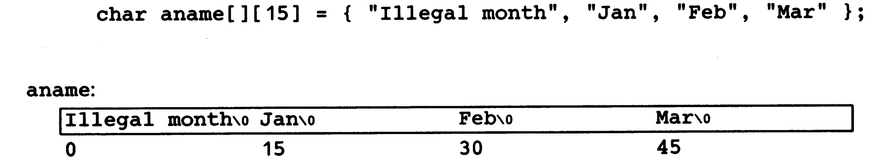

* 2차원 배열의 각 행 길이는 고정
* 위 예시는 총 60 bytes를 연속적으로 메모리에 할당

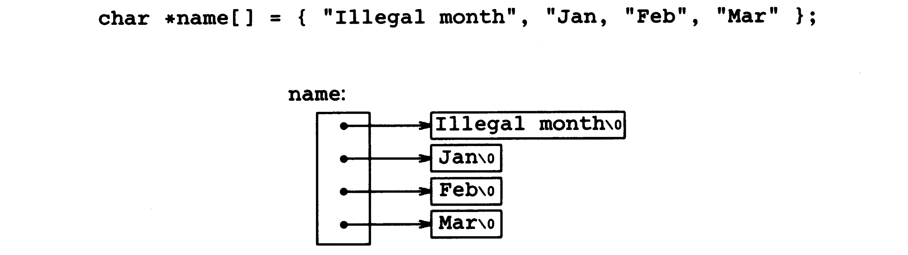

* 포인터 배열의 각 행 길이는 **가변**
* 위 예시는 총 4개의 포인터 변수를 연속적으로 메모리에 할당:
    1. 데이터 모델이 LP64라면, 총 32 bytes를 연속적으로 메모리에 할당
    2. .text 영역에 14 + 4 + 4 + 4 = 26 bytes를 개별적으로 할당

---

## Command‑line Arguments

### `main` 함수의 형태

* 다음 형태의 `main` 함수는 프로그램 실행 시 전달되는 데이터를 `main`함수로 전달할 수 있음

```c
int main(int argc, char *argv[])
```

### `argc` (Argument Count)

* 전달된 인자의 수를 나타내며, 항상 1 이상인 값을 저장
  * 프로그램 실행 시 명령은 항상 전달됨 (`e.g., ./prog`)

### `argv` (Argument Vector)

* 프로그램 실행 시 전달되는 데이터를 문자열 형태로 가리키는 포인터 배열
* `argv[0]`은 프로그램 실행 시 명령을 문자열로 가리키고 있음
* `argv[1]` ~ `argv[argc - 1]`은 사용자가 프로그램 실행 시 전달한 데이터를 가리킴
* `argv[argc]`은 `NULL`을 가리키며, 전달인자의 끝을 나타냄

---

## Command‑line Arguments (Cont'd - 1)

### 프로그램으로 전달한 인자를 출력하는 프로그램


[//]: # (INCLUDE: ./c/05/19.c)

---

## Command‑line Arguments (Cont'd - 2)

### 축약된 프로그램으로 전달한 인자를 출력하는 프로그램

[//]: # (INCLUDE: ./c/05/20.c)

[//]: # (INCLUDE: ./c/05/21.c)

---

## Command‑line Arguments (Cont'd - 3)

### 개선된 입력 문자열 중 특정 패턴이 포함된 문자열만 출력하는 프로그램

* 4장에서 구현한 프로그램은 코드 내에 패턴이 기재되어 있음
* 패턴 수정이 필요할 때마다 코드를 수정한 뒤 새로 빌드해 사용해야 함
* 커맨드 라인 전달인자를 사용할 경우 패턴을 코드로부터 분리할 수 있음

```text
./find -x -n <PATTERN>
```

* `-x` (for except)
  * 패턴이 포함된 문자열을 제외한 모든 문자열 출력
* `-n` (for number)
  * 문자열 출력 시 행 번호를 같이 출력
* `<PATTERN>`
  * 찾고자 하는 패턴 입력
* 옵션 (optional flags, `-` 기호로 시작하는 전달인자)은 순서 관계 없이 사용 가능해야 하며, 필요에 따라 묶어서 사용할 수 있음
  * e.g., `./find -nx <PATTERN>`

---

## Command‑line Arguments (Cont'd - 4)

```c
#include <stdio.h>
#include <string.h>  /* to use strstr() */

#define MAXLINE 1000

int getline(char *, int); /* NB: Reuse previously implemented file */

/* find: print lines that match pattern from 1st arg  */
int main(int argc, char *argv[])
{
    char line[MAXLINE];
    long lineno = 0;
    int c, except = 0, number = 0, found = 0;

    while (--argc > 0 && (*++argv)[0] == '-') {
        while ((c = *++argv[0])) {
            switch (c) {
            case 'x':
                except = 1;
                break;
            case 'n':
                number = 1;
                break;
            default:
                printf("find: illegal option %c\n", c);
                argc = 0;
                found = -1;
                break;
            }
        }
    }
```

---

## Command‑line Arguments (Cont'd - 5)

```c
    if (argc != 1) {
        printf("Usage: find -x -n pattern\n");
    } else {
        while (getline(line, MAXLINE) > 0) {
            ++lineno;
            if ((strstr(line, *argv) != NULL) != except) {
                if (number)
                    printf("%ld:", lineno);
                printf("%s", line);
                found++;
            }
        }
    }

    return found;
}
```

* `strstr` 함수는 한 문자열 (`line`)에서 다른 문자열 (`*argv`, pattern)이 처음 나타나는 위치를 찾는 함수
* 대상 문자열에 다른 문자열이 존재한다면 해당 위치를 가리키는 유효한 포인터를 반환하고, 존재하지 않는다면 `NULL` 반환

---

## Pointers to Functions

* .text 영역에 할당된 함수 코드의 시작 주소를 가리키는 포인터 변수

[//]: # (INCLUDE: ./c/05/function_ptr.c)

---

## Pointers to Functions (Cont'd - 1)

* 함수 포인터 사용 시 **반드시 괄호를 써주어야 함**

[//]: # (INCLUDE: ./c/05/function_ptr_cmp.c)

### `void *`형

* 어떤 형이든 가리킬 수 있는 범용 포인터 (generic pointer)
* 형 정보가 없으므로 간접 참조는 사용할 수 없음
* 간접 참조는 다른 형으로의 변환이 선행되어야 가능

### 정렬 프로그램

* 커맨드 라인 전달인자를 통해 해석 방법을 결정
  * `-n` 옵션이 전달되면 각 줄을 숫자로 해석하여 정렬
  * `-n` 옵션이 없다면 각 줄을 문자열로 해석하여 정렬
* 함수 포인터를 사용해 전달된 옵션에 따라 정렬 함수를 선택

---

## Pointers to Functions (Cont'd - 2)

* `main.c`

[//]: # (INCLUDE: ./c/05/ex08_sort2/sort.c)

---

## Pointers to Functions (Cont'd - 3)

* `sort.c`

[//]: # (INCLUDE: ./c/05/ex08_sort2/qsort_alt.c)

---

## Pointers to Functions (Cont'd - 4)

* `cmp.c`

[//]: # (INCLUDE: ./c/05/ex08_sort2/numcmp.c)
