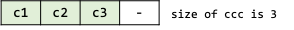
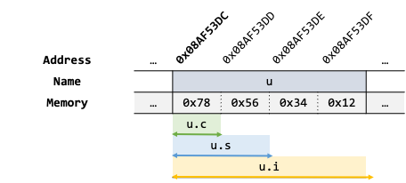
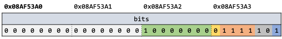
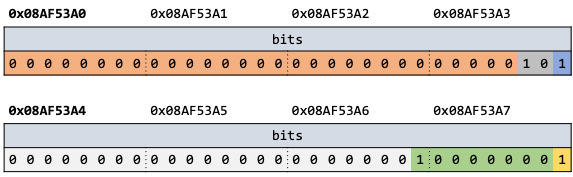
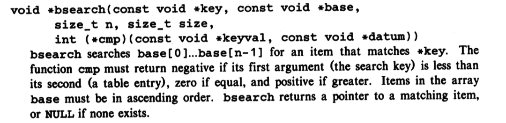
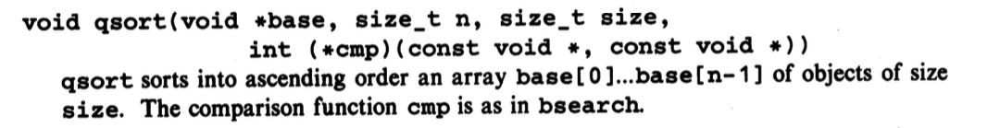

<!-- _class: lead -->
# 컴퓨터프로그래밍기초

## Structures

### [munseong.jeong@daejin.ac.kr](mailto:munseong.jeong@daejin.ac.kr)

---

## Basics of Structures

- 구조체 선언은 **새로운 타입을 정의**하는 것
  - 관련 있는 여러 변수를 **하나의 새 타입으로 묶을 수 있음**
- 코드 가독성과 유지보수성 향상에 기여함


[//]: # (INCLUDE: ./c/06/src/struct.c --from 2 --to 6 --no-comment)

- `struct`는 구조체 선언을 위한 키워드이며, 태그(struct tag)는 구조체 식별에 사용됨
- 구조체 태그는 생략 가능하며, 태그가 생략된 구조체는 익명 구조체(anonymous structure)가 됨

---

## Basics of Structures (Cont'd - 1)

### 구조체 선언을 통해 정의한 구조체 타입 변수 선언

[//]: # (INCLUDE: ./c/06/src/struct.c  --from 12 --to 15 --no-comment)

### 익명 구조체 선언의 동작 방식

[//]: # (INCLUDE: ./c/06/src/struct.c  --from 21 --to 24 --no-comment)

- 각 익명 구조체 선언은 **고유한** 구조체 타입으로 간주되어 구분됨

[//]: # (INCLUDE: ./c/06/src/struct.c  --from 30 --to 32 --no-comment)

---

## Basics of Structures (Cont'd - 2)

### 멤버 (Members)

- 구조체 내 변수들을 의미
- **멤버 또는 태그는 일반 변수와 같은 이름을 사용할 수 있음**
  - 문맥(context)에 의해 구분됨

[//]: # (INCLUDE: ./c/06/src/struct.c  --from 37 --to 40 --no-comment)

### 구조체 타입 변수 초기화

- 배열처럼 중괄호 안에 초기화자 목록(list of initializers)을 쉼표로 구분하여 열거
- 각 초기화자(initializer)는 **순서대로** 구조체 멤버의 초기화자로 사용

[//]: # (INCLUDE: ./c/06/src/struct.c  --from 44 --to 46 --no-comment)

---

## Basics of Structures (Cont'd - 3)

### 중첩 구조체


[//]: # (INCLUDE: ./c/06/src/struct.c  --from 50 --to 55 --no-comment)

- 구조체 정의 시 이미 정의된 구조체를 멤버에 사용한 형태

---

## Basics of Structures (Cont'd - 4)

### 구조체 멤버 연산자 (Structure Member Operator) `.`

- 구조체 타입 변수의 멤버는 `.` (dot) 연산자를 사용해 접근 가능

[//]: # (INCLUDE: ./c/06/src/struct.c  --from 63 --to 69 --no-comment)

---

## Structures and Functions

- 구조체 객체에 사용 가능한 연산:
  - 같은 타입 구조체 간 대입 또는 복사
  - 주소 얻기(`&`)
  - 멤버 접근(`.`)
- **그 외 연산은 허용하지 않으며**, 필요한 연산이 있다면 **직접 함수로 구현**해 사용해야 함
- `struct point`, `struct rect` 타입을 조작할 수 있는 함수를 소개하면서, 구조체를 사용하는 함수의 유형 소개

[//]: # (INCLUDE: ./c/06/src/struct_func.c --from 2 --to 10 --no-comment)

---

## Structures and Functions (Cont'd - 1)

### 구조체의 각 멤버를 개별 인자로 함수에 전달 (Pass Components Separately)

[//]: # (INCLUDE: ./c/06/src/struct_func.c --from 14 --to 25 --no-comment)

- 일반 변수(매개변수)의 이름과 멤버의 이름이 **문맥에 의해 구분**됨
  - 이를 기반으로 매개변수가 어느 멤버와 연관되는지를 강조할 수 있음
- 구조체 멤버의 수가 많다면 구조체를 위한 함수 매개변수가 늘어남에 따라 **가독성이 저하될 수 있음**
  - 함수의 매개변수 수는 최대 5개를 넘지 않는 것이 관례이며, 매개변수가 5개를 넘어갈 경우 함수를 재작성할 것을 권장

---

## Structures and Functions (Cont'd - 2)

### 구조체 전체를 함수에 전달 (Pass an Entire Structure)

[//]: # (INCLUDE: ./c/06/src/struct_func.c --from 29 --to 42 --no-comment)

- 구조체의 멤버에 대응되는 인자를 함수로 전달하는 대신, 구조체를 인자로 함수에 전달
- 멤버 수가 많거나 멤버 크기가 큰 구조체를 함수의 인자로 사용할 경우 **성능 관점에서 불리함**
  - 구조체 객체는 멤버 수에 비례하여 객체 크기가 커짐

---

## Structures and Functions (Cont'd - 3)

### 구조체의 포인터를 함수에 전달 (Pass a Pointer)

[//]: # (INCLUDE: ./c/06/src/struct_func.c --from 48 --to 52 --no-comment)

- 포인터 변수는 **가리키는 대상 관계없이 고정된 크기를 가짐**
- 구조체를 함수로 전달 시 구조체를 직접 전달하는 것보다는 **구조체 포인터를 전달**하는 것이 **성능 관점에서 일반적으로 유리함**

---

## Structures and Functions (Cont'd - 4)

- 멤버 구성에 따른 구조체 객체 크기

[//]: # (INCLUDE: ./c/06/src/cmp_struct_value_ptr.c)

---

## Structures and Functions (Cont'd - 5)

### 구조체 멤버 연산자 (Structure Member Operator) `->`

- 구조체 타입 포인터가 가리키는 구조체의 멤버는 `->` (arrow) 연산자를 사용해 접근 가능

#### `(*pt).x`

- 최상위 우선순위를 갖는 연산자는 네 가지: `()`, `[]`, `.`, `->`
- 괄호 없는 `*pt.x` 표현은 결합방향에 의해 `*(pt.x)`로 평가
  - 멤버 `x`는 포인터가 아니므로 문법적으로 틀린 표현이 됨
  - 구조체 포인터와 멤버 연산자 `.`를 같이 사용할 경우 실수할 수 있음

#### `pt->y`

- `pt`가 구조체를 가리키는 포인터라면, `->` 연산자를 사용해 간접 참조한 객체의 멤버를 가리킬 수 있음

---

## Structures and Functions (Cont'd - 6)

### Operator Precedence with Struct Pointers

[//]: # (INCLUDE: ./c/06/src/example_struct_ptr.c --from 2 --to 5 --no-comment)

[//]: # (INCLUDE: ./c/06/src/example_struct_ptr.c --from 11 --to 22 --no-comment)

---

## Arrays of Structures

### C 예약어 (Keywords) 입력 빈도를 계산하는 프로그램

- 예약어들을 보관할 배열과 각 예약어의 입력 빈도를 보관할 변수 하나가 필요함

[//]: # (INCLUDE: ./c/06/src/keywords_snippet.c --from 4 --to 5 --no-comment)

- 각 배열은 인덱스를 기준으로 관련된 데이터를 나란히 저장하고 있음(평행 구조, parallel arrays)
- **배열 기반 평행 구조 데이터는 서로 분리되어 있음**
  - 데이터를 조작할 경우 평행 구조에 놓여 있는 모든 데이터에 대해서 각각 작업이 이루어져야 함
  - 평행 구조 데이터를 함수 내에서 조작해야 할 경우, 평행 구조에 놓여 있는 모든 데이터를 인자로서 넘겨야 함
- 평행 구조를 이루는 데이터는 구조체 배열을 사용해 **논리적으로 결합된 하나의 단위**로서 데이터를 조작할 수 있음

[//]: # (INCLUDE: ./c/06/src/keywords_snippet.c --from 9 --to 12 --no-comment)

---

## Arrays of Structures (Cont'd - 1)

### 구조체 배열 초기화

[//]: # (INCLUDE: ./c/06/src/keywords_snippet.c --from 16 --to 18 --no-comment)

- *n*차원 배열처럼 중괄호로 둘러싸인 초기화자 목록 사용
  - 중괄호 내 초기화자들은 순서대로 각 요소별 멤버의 초기화자로 사용
  - `keytab[0].word`는 `"auto"`의 시작 주소, `keytab[0].count`는 `0`으로 초기화
- 구조체 배열 초기화 시 괄호를 추가로 사용하면 가독성을 높임과 동시에 실수를 방지할 수 있음

[//]: # (INCLUDE: ./c/06/src/keyword/key.c --from 5 --to 14 --no-comment)

---

## Arrays of Structures (Cont'd - 2)

### `sizeof`

```text
sizeof object
sizeof(type name)
```

- `object` 또는 `type`의 바이트 수를 정수 타입으로 평가하는 단항 연산자
- **컴파일 시 연산이 이루어지는 연산자**
- `sizeof` 연산자를 응용하면 배열 크기를 자동으로 관리할 수 있음
  - 배열 크기가 변하더라도 컴파일러가 올바른 크기를 자동으로 계산함
- 요소 수가 많은 배열의 크기는 실수 방지를 위해 `sizeof` 연산자를 활용해 계산한 값을 쓰는 것을 권장

[//]: # (INCLUDE: ./c/06/src/keywords_snippet.c --from 22 --to 23 --no-comment)

- 두 번째 방법은 구조체 타입이 바뀌어도 수정하지 않아도 된다는 장점이 있음

---

## Arrays of Structures (Cont'd - 3)

```text
|-- bsearch.c
|-- getch.c   # NB: Reuse previously implemented file
|-- getword.c
|-- key.c
|-- key.h
`-- main.c
```

---

## Arrays of Structures (Cont'd - 4)

- `key.h`

[//]: # (INCLUDE: ./c/06/src/keyword/key.h)

---

## Arrays of Structures (Cont'd - 5)

- `key.c`

[//]: # (INCLUDE: ./c/06/src/keyword/key.c)

---

## Arrays of Structures (Cont'd - 6)

- `getword.c`

[//]: # (INCLUDE: ./c/06/src/keyword/getword.c --to 9)

---

## Arrays of Structures (Cont'd - 7)

[//]: # (INCLUDE: ./c/06/src/keyword/getword.c --from 11)

---

## Arrays of Structures (Cont'd - 8)

- `bsearch.c`

[//]: # (INCLUDE: ./c/06/src/keyword/bsearch.c --to 11)
---

## Arrays of Structures (Cont'd - 9)

[//]: # (INCLUDE: ./c/06/src/keyword/bsearch.c --from 13)

---

## Arrays of Structures (Cont'd - 10)

- `main.c`

[//]: # (INCLUDE: ./c/06/src/keyword/main.c --to 15)
---

## Arrays of Structures (Cont'd - 11)

[//]: # (INCLUDE: ./c/06/src/keyword/main.c --from 17)

---

## Arrays of Structures (Cont'd - 12)

### 메모리 정렬 규칙 (Memory Alignment)

- 구조체 멤버 중 가장 큰 타입의 크기를 기준으로 메모리를 정렬함
- **모든 멤버의 주소는 자신의 타입 크기로 나누어질 수 있는 주소를 가져야 함**
  - 만약 올바른 주소를 가질 수 없다면, 유효한 주소를 가질 수 있을 때까지 셀을 건너뜀(padding)

[//]: # (INCLUDE: ./c/06/src/memory_alignment.c --from 2 --to 6 --no-comment)



---

## Arrays of Structures (Cont'd - 13)

### 메모리 정렬 규칙을 활용한 예 - 메모리 절약

- 아래 두 구조체는 같은 종류의 멤버를 구성하나, 순서에 따라 메모리 사용량에 차이가 발생할 수 있음

[//]: # (INCLUDE: ./c/06/src/memory_alignment.c --from 10 --to 20 --no-comment)


---

## Arrays of Structures (Cont'd - 14)

### 구조체 반환 타입

- 복합 타입(a complicated type, e.g., a structure pointer) 반환 함수는 복합 타입 종류에 따라 가독성을 해치기도 함

[//]: # (INCLUDE: ./c/06/src/keyword/bsearch.c --from 5 --to 6 --no-comment)

- 다음과 같은 형태를 사용하면 반환 타입과 이름을 확실히 구분할 수 있음

[//]: # (INCLUDE: ./c/06/src/bsearch.h --from 2 --to 4 --no-comment)

---

## Self‑referential Structures

- C 예약어 입력 빈도 계산 프로그램은 **입력될 데이터가 이미 결정된 경우**였음
  - 탐색 속도를 높이기 위해 키워드 정보를 구조체 배열에 **오름차순**으로 초기화하여 이진 탐색을 사용함
- 그러나 일반적인 프로그램은 어떤 데이터가 입력될지 미리 알지 못하는 경우가 대부분임
  - 입력 데이터를 예측할 수 없어 사전에 정렬하거나 이진 탐색을 곧바로 적용하기 어려움
  - 데이터가 들어올 때마다 선형 탐색(linear search)을 수행하면, 데이터가 많아질수록 실행 시간이 제곱에 비례(quadratic)하여 매우 비효율적임
- **해결 방안**: 단어가 입력될 때마다 정렬된 상태를 유지하며 탐색 효율을 높임
  - **이진 트리**(binary tree) 자료 구조를 사용하면 입력되는 데이터를 실시간으로 효율적으로 정렬하고 탐색할 수 있음

---

## Self‑referential Structures (Cont'd - 1)

### 노드 (Nodes)

- 트리는 노드와 간선으로 구성된 자료구조임
  - 하나의 루트 노드에서 시작하여 부모-자식 관계를 가지는 계층 구조를 이룸
  - 노드 간에 순환(cycle)이 없으며, 임의의 두 노드를 연결하는 경로는 오직 하나만 존재하는 비순환 연결 그래프임
- 트리는 각 고유한 단어당 하나의 노드를 사용해 관리하고, 간선은 포인터를 사용해 표현
- 하나의 노드는 다음 정보들을 포함함:

```text
a pointer to the text of the word
a count of the number of occurrences
a pointer to the left child node
a pointer to the right child node
```

- **모든 노드는 최대 두 개의 자식(children) 노드를 가질 수 있음**
  - 최대 두 개의 자식 노드를 가질 수 있는 트리를 이진 트리(binary tree)라고 부름

---

## Self‑referential Structures (Cont'd - 2)

### 이진 트리 (Binary Tree)

- 이진 트리 자료 구조가 노드들을 관리하면 다음과 같은 특징이 있음:
  1. 왼쪽 부분 트리(subtree)에 속한 노드들의 단어는 현재 노드의 단어보다 사전 순으로 앞에 위치한다.
  2. 오른쪽 부분 트리(subtree)에 속한 노드들의 단어는 현재 노드의 단어보다 사전 순으로 뒤에 위치한다.
- 문장 "now is the time for all good men to come to the aid of their party"을 트리로 표현하면 다음과 같음:


---

## Self‑referential Structures (Cont'd - 3)

- 이진 트리 내에 새로 입력된 단어의 존재 유무를 확인하는 방법
  - 다음 과정을 재귀적으로 수행함:
    1. 루트 노드의 단어와 새 단어를 비교한다.
    2. 서로 일치하면 단어가 이미 입력되어 있는 상태다.
    3. 서로 불일치하고 새 단어가 사전 순으로 앞에 위치하면, 왼쪽 부분 트리로 이동 후 다시 비교한다.
    4. 서로 불일치하고 새 단어가 사전 순으로 뒤에 위치하면, 오른쪽 부분 트리로 이동 후 다시 비교한다.
    5. 탐색을 지속하였음에도 찾지 못하였다면, 단어는 트리 내에 존재하지 않는 상태다.
    (탐색에 실패해 현재 가리키는 빈 공간은 **새 단어가 트리에 등록될 경우 노드가 새로 추가될 위치**임)

---

## Self‑referential Structures (Cont'd - 4)

### 자기 참조 구조체

- 자기 자신을 가리키는 포인터를 멤버로 구성한 구조체

[//]: # (INCLUDE: ./c/06/src/word_freq/tree.h --from 4 --to 9 --no-comment)

- 구조체 이름이 선언되는 순간, 컴파일러는 이를 이름만 가진 불완전 타입(incomplete type)으로 간주됨
  - 구조체 정의가 마무리되어야 완전 타입(complete type)으로 간주
- 자기 자신의 객체를 포함하는 것은 허용되지 않음
  - 불완전 타입 객체는 **실제 얼마큼의 메모리를 점유해야 할지 알 수 없으므로** 생성 불가
- **자기 자신을 가리키는 포인터는 허용함**
  - 가리키는 대상이 불완전 타입이지만, 포인터는 메모리 크기(4 or 8 bytes)가 이미 정해져 있으므로 생성 가능

---

## Self‑referential Structures (Cont'd - 5)

### `alloc` 함수의 문제점

[//]: # (INCLUDE: ./c/05/src/alloc/alloc.c --from 10 --to 28 --no-comment)

---

## Self‑referential Structures (Cont'd - 6)

> How does it meet the requirement of most real machines that objects of certain types must satisfy alignment restrictions (for example, integers often must be located at even addresses)?

- `alloc` 함수는 단순히 바이트 수만 인자로 전달 받아 처리함
- 메모리 정렬 규칙은 누락된 상태

> What declarations can cope with the fact that an allocator must necessarily return different kinds of pointers?

- `alloc` 함수는 반환 타입이 `char *`로 고정임
- 타입에 대한 고려는 되어있지 않음

> What problems may occur when creation and destruction orders are mismatched?

- 스택 기반의 저장공간 할당기는 반드시 할당 순서의 역순으로 할당받은 객체를 반환해야 함

---

## Self‑referential Structures (Cont'd - 7)

### 표준 동적 저장공간 할당기

- `stdlib.h` 헤더 내에 포함되어 있음

```text
void *malloc(size_t n);
void *calloc(size_t n, size_t size);
void free(void *p);
```

- `malloc(n)`
  - 힙 영역에 `n` 바이트 크기의 초기화되지 않은 메모리 블록을 할당
  - 성공 시 해당 블록의 시작 주소를, 실패 시 `NULL`를 반환
- `calloc(n, size)`
  - 힙 영역에 `n` × `size` 바이트 크기의 0으로 초기화된 메모리 블록을 할당
  - 성공 시 해당 블록의 시작 주소를, 실패 시 `NULL`를 반환
- `free(p)`
  - `p`가 메모리 관리 함수(`malloc`, `calloc`, `realloc`)에서 반환된 포인터일 경우, 이를 해제
  - 메모리 관리 함수가 반환한 주소가 아니거나 이미 해제된 주소를 전달할 경우 UB
  - `free(p)` 이후 `p`는 더 이상 유효하지 않으며, 이를 사용하면 UB
- 메모리 관리 함수는 `void *` 타입을 반환하므로 **범용적으로 사용 가능**

---

## Self‑referential Structures (Cont'd - 8)

- 동적 저장공간 할당기 예시

[//]: # (INCLUDE: ./c/06/src/heap_example.c)

---

## Self‑referential Structures (Cont'd - 9)

- 입력되는 단어의 빈도 수를 계산하는 프로그램

```text
.
|-- getch.c   # NB: Reuse previously implemented file
|-- getword.c # NB: Reuse previously implemented file
|-- main.c
|-- strdup.c
|-- tree.c
`-- tree.h
```

---

## Self‑referential Structures (Cont'd - 10)

- `tree.h`

[//]: # (INCLUDE: ./c/06/src/word_freq/tree.h)

---

## Self‑referential Structures (Cont'd - 11)

- `tree.c`

[//]: # (INCLUDE: ./c/06/src/word_freq/tree.c --to 21)

---

## Self‑referential Structures (Cont'd - 12)

[//]: # (INCLUDE: ./c/06/src/word_freq/tree.c --from 23)

---

## Self‑referential Structures (Cont'd - 13)

- `strdup.c`

[//]: # (INCLUDE: ./c/06/src/word_freq/strdup.c)

---

## Self‑referential Structures (Cont'd - 14)

- `main.c`

[//]: # (INCLUDE: ./c/06/src/word_freq/main.c --to 8)

---

## Self‑referential Structures (Cont'd - 15)

[//]: # (INCLUDE: ./c/06/src/word_freq/main.c --from 10)

---

## Table Lookup

- 테이블 탐색은 여러 분야에서 사용되고 있음
  - 데이터베이스, 컴파일러, 전처리기, etc.

### 간단한 매크로 처리기 구현

- `install(s, t)`: 식별자 `s`와 대치할 문자열 `t`를 매크로 처리기 내부 테이블에 등록
  - 식별자와 문자열은 하나의 노드에 기록되며, **연결 리스트(linked list) 자료구조**로 관리
- `lookup(s)`: 식별자 `s`가 내부 테이블에 등록된 상태인지 탐색:
  - 식별자 `s`가 내부 테이블에 존재할 경우 등록된 레코드를 가리키는 포인터 반환
  - 식별자 `s`가 내부 테이블에 존재하지 않을 경우 `NULL` 반환

[//]: # (INCLUDE: ./c/06/src/table_lookup_snippet.c)

---

## Table Lookup (Cont'd - 1)

### 연결 리스트 (Linked List)

[//]: # (INCLUDE: ./c/06/src/table_lookup/table.h --from 4 --to 8 --no-comment)

- 각 노드를 포인터를 사용해 연결된 **논리적인 선형 구조**를 갖는 자료 구조
- 연결 리스트의 노드는 식별자와 대치 문자열의 정보, 다음 노드를 가리키는 포인터로 구성됨
- 포인터의 값이 `NULL`일 경우, 연결 리스트의 끝 노드를 의미

---

## Table Lookup (Cont'd - 2)

### 해시 탐색 (Hash Search)

[//]: # (INCLUDE: ./c/06/src/table_lookup/table.c --from 16 --to 17 --no-comment)

- 임의의 데이터를 **음수가 아닌 정수 타입** 값으로 변환하는 알고리즘
- 매크로 처리기의 `install`, `lookup` 함수는 해시 탐색 알고리즘을 기반으로 구현
- 입력되는 식별자(`char *s`)를 `0 ~ HASHSIZE - 1` 범위의 정수로 변환하여 **포인터 배열의 인덱스**로 사용
  - 식별자의 해시 결과값은 포인터 배열의 인덱스로 사용되며, 포인터 배열의 각 요소는 연결 리스트의 첫 노드를 가리킴

[//]: # (INCLUDE: ./c/06/src/table_lookup/table.c --from 9 --to 9 --no-comment)


---

## Table Lookup (Cont'd - 3)

### 매크로 처리기의 탐색 과정

[//]: # (INCLUDE: ./c/06/src/table_lookup/table.c --from 22 --to 33 --no-comment)

- 해시 탐색 알고리즘의 특징(데이터의 해시 값으로 인덱스를 빠르게 계산할 수 있음)을 기반으로 한 빠른 탐색 수행

---

## Table Lookup (Cont'd - 4)

### 매크로 처리기의 등록 과정

[//]: # (INCLUDE: ./c/06/src/table_lookup/table.c --from 41 --to 54 --no-comment)

- `lookup` 함수를 사용해 등록하고자 하는 식별자(`char *name`)를 갖는 노드가 존재하는지 확인:
  - 존재할 경우 해당 노드의 `defn` 멤버(기존의 대치 문자열) 소멸
  - 존재하지 않을 경우 새 노드를 동적 할당한 뒤 해당 노드의 `name` 멤버에 등록하고자 하는 식별자 등록
    - 해당 노드는 연결 리스트의 **시작 노드**로 사용됨
- 준비된 노드의 `defn` 멤버에 등록하고자 하는 대치 문자열(`char *defn`) 등록

---

## Table Lookup (Cont'd - 5)

- 매크로 처리기

```text
.
|-- itoa.c
|-- main.c
|-- strdup.c
|-- table.c
`-- table.h
```

---

## Table Lookup (Cont'd - 6)

- `table.h`

[//]: # (INCLUDE: ./c/06/src/table_lookup/table.h)

---

## Table Lookup (Cont'd - 7)

- `table.c`

[//]: # (INCLUDE: ./c/06/src/table_lookup/table.c --to 20)

---

## Table Lookup (Cont'd - 8)

[//]: # (INCLUDE: ./c/06/src/table_lookup/table.c --from 22 --to 33)

---

## Table Lookup (Cont'd - 9)

[//]: # (INCLUDE: ./c/06/src/table_lookup/table.c --from 35)

---

## Table Lookup (Cont'd - 10)

- `itoa.c`

[//]: # (INCLUDE: ./c/06/src/table_lookup/itoa.c --to 10)

---

## Table Lookup (Cont'd - 11)

[//]: # (INCLUDE: ./c/06/src/table_lookup/itoa.c --from 12)

---

## Table Lookup (Cont'd - 12)

- `strdup.c`

[//]: # (INCLUDE: ./c/06/src/table_lookup/strdup.c)

---

## Table Lookup (Cont'd - 13)

- `main.c`

[//]: # (INCLUDE: ./c/06/src/table_lookup/main.c --to 14)

---

## Table Lookup (Cont'd - 14)

[//]: # (INCLUDE: ./c/06/src/table_lookup/main.c --from 16)

---

## Typedef

[//]: # (INCLUDE: ./c/06/src/typedef.c --from 8 --to 12 --no-comment)

- **이미 존재하는 타입**에 새로운 이름 생성
  - **새로운 타입을 만드는 것이 아님에 유의**
- `typedef` 키워드를 사용해 새로 선언한 이름은 타입처럼 사용 가능:

[//]: # (INCLUDE: ./c/06/src/typedef.c --from 16 --to 21 --no-comment)

---

## Typedef (Cont'd - 1)

[//]: # (INCLUDE: ./c/06/src/typedef.c --from 34 --to 36 --no-comment)

- `typedef`는 `extern`, `static` 같은 저장 클래스 지정자(storage class specifiers)의 한 유형
  - 새로 정의할 이름은 `typedef` 바로 뒤가 아닌 변수 이름이 오는 자리에 위치
- `typedef`로 새로 생성한 이름은 다른 이름과 구분하기 위해 **대문자로 시작하는 이름**을 사용하거나 접미사 `_t` 사용
- 복잡한 타입에 `typedef`를 활용한 예:

[//]: # (INCLUDE: ./c/06/src/typedef.c --from 44 --to 55 --no-comment)

---

## Typedef (Cont'd - 2)

- `#define` 전처리 지시문과 동작 형태가 유사한 것처럼 보임
- `#define` 전처리 지시문보다 더 다양한 형태로 사용될 수 있음 (e.g., 함수 포인터, 기계 의존적인 타입 관리, etc.)

[//]: # (INCLUDE: ./c/06/src/typedef.c --from 78 --to 81 --no-comment)

[//]: # (INCLUDE: ./c/06/src/typedef.c --from 88 --to 95 --no-comment)

---

## Unions

- 구조체 문법(메모리 정렬 규칙, 허용된 연산 등) 기반의 사용자 정의 타입
- **구조체의 멤버는 독립적인 반면 공용체는 멤버를 공유함**
  - 공용체의 멤버 중 가장 큰 객체 크기가 곧 공용체 변수의 크기가 됨
  - 공용체는 **모든 멤버의 오프셋이 0**이므로, 모든 멤버의 주소는 같음
- 공용체는 구조체 문법을 기반으로 하므로, 구조체처럼 중첩 구조를 허용
  - 구조체 안에 공용체를 멤버로 사용하거나, 반대의 경우도 사용 가능
- 공용체 초기화 시 초기화자의 타입은 **공용체의 첫 멤버의 타입**을 따름

---

## Unions (Cont'd - 1)

[//]: # (INCLUDE: ./c/06/src/union.c --from 5 --to 12 --no-comment)



---

## Unions (Cont'd - 2)

- 공용체 기반의 간단한 컴파일러의 식별자 관리 프로그램

[//]: # (INCLUDE: ./c/06/src/manage_identifiers.c --to 16)

- 타입 수와 관계없이 **하나의 공유된 객체**에 데이터를 관리
- 공용체 사용 시 현재 공용체에 저장된 값의 타입이 무엇인지 잘 추적해야 함
- 만약 저장된 값의 타입과 다른 타입으로 값을 읽어올 경우 잘못된 값이 반환될 수 있음

---

## Unions (Cont'd - 3)

[//]: # (INCLUDE: ./c/06/src/manage_identifiers.c --from 18)

- 구조체 배열의 `utype`의 값에 따라 객체의 메모리를 올바른 타입으로 처리함

---

## Bit-Fields

[//]: # (INCLUDE: ./c/06/src/bit_field.c --from 2 --to 5 --no-comment)

- 여러 개의 상태 정보를 표현해야 할 때, 하나의 객체에 비트 단위로 데이터를 조작하면 메모리를 절약할 수 있음
  - e.g., `int` 타입 객체는 4 bytes를 사용하므로 32개의 상태 표현이 가능해짐
- 비트 연산을 사용해 세 가지의 상태를 표현한 예시:

[//]: # (INCLUDE: ./c/06/src/bit_field.c --from 9 --to 11 --no-comment)

[//]: # (INCLUDE: ./c/06/src/bit_field.c --from 17 --to 24 --no-comment)

---

## Bit-Fields (Cont'd)

- 구조체는 멤버를 비트 수준으로 제어할 수 있는 비트 필드 기능을 제공
- CPU의 1 워드(word) 단위 내에 여러 멤버를 배치하여 비트 단위로 정밀 제어 가능
  - 워드는 CPU가 한 번에 처리할 수 있는 기본 데이터 단위
  - 크기는 시스템/컴파일러에 따라 구현 정의(implementation-defined)되며 주로 `unsigned int` 크기를 따름
- 콜론 옆 숫자는 비트 폭(width)을 의미하며, 부호 비트 혼선 방지를 위해 **무부호 타입 사용**이 관례
- 비트 단위로 할당되므로 멤버의 주소 추출(`&`)이나 비트 필드 배열 선언은 문법적으로 불가능

[//]: # (INCLUDE: ./c/06/src/manage_identifiers_advanced.c --from 5 --to 18 --no-comment)

---

## Bit-Fields (Cont'd - 2)

- 비트 필드의 이름이 생략될 경우, 비트를 폭만큼 건너뜀(padding)

[//]: # (INCLUDE: ./c/06/src/bit_field1.c --from 4 --to 15 --no-comment)



---

## Bit-Fields (Cont'd - 3)

- 비트 폭이 0인 경우, 비트를 다음 메모리의 경계까지 강제로 정렬함(alignment)

[//]: # (INCLUDE: ./c/06/src/bit_field2.c --from 4 --to 15 --no-comment)



---

## Bit-Fields (Cont'd - 4)

- 비트 필드는 부호 타입도 사용 가능하나, 비트 필드 조작 결과가 음수가 될 수 있다는 점을 유념해야 함

[//]: # (INCLUDE: ./c/06/src/bit_field3.c --from 6 --to 12 --no-comment)

- 비트 필드는 엔디안 방식(endianness)에 따라 값을 넣는 방향이 결정됨
  - 대부분의 기계는 리틀 엔디안(하위 바이트가 메모리의 낮은 주소에 저장)
- 비트 필드는 배열을 사용할 수 없으며, 주소를 갖지 않음

---

## Appendix A. `bsearch`



---

## Appendix B. `qsort`



---

## Appendix C. Example Program Using `qsort` and `bsearch`

[//]: # (INCLUDE: ./c/06/src/bsearch.c --to 9)

---

## Appendix C. Example Program Using `qsort` and `bsearch` (Cont'd)

[//]: # (INCLUDE: ./c/06/src/bsearch.c --from 11)

---

## Appendix D. `volatile`

- **컴파일러 최적화로부터 보호**가 필요한 객체에 사용하는 타입 한정자(type qualifier)
  - 객체의 값이 프로그램 외부(하드웨어, 시그널 핸들러 등)에서 변경될 수 있음을 컴파일러에 알림
  - 컴파일러는 `volatile` 객체에 대한 접근을 **캐시하거나 생략하지 않고**, 매번 실제 메모리를 통해 수행
- 주요 사용 사례:
  1. **메모리 맵 I/O 레지스터** — 하드웨어가 언제든 값을 변경할 수 있는 레지스터
  2. **시그널 핸들러** — 시그널 핸들러에서 수정되는 전역 변수
  3. **`setjmp`/`longjmp`** — 비지역 분기 이후에도 올바른 값을 보장해야 하는 변수
- `volatile`은 원자성(atomicity)이나 스레드 안전성(thread safety)을 보장하지 않음

---

## Appendix D. `volatile` (Cont'd)

[//]: # (INCLUDE: ./c/06/src/volatile_example.c --to 10)

---

## Appendix D. `volatile` (Cont'd - 2)

[//]: # (INCLUDE: ./c/06/src/volatile_example.c --from 12)

- `g_done`은 `handle_sigint` 시그널 핸들러에 의해 수정되는 전역 변수
- `volatile` 없이는 컴파일러가 `g_done`을 레지스터에 캐시
- **시그널 수신 이후에도 루프가 종료되지 않을 수 있음**
- `volatile`로 선언하면 매 반복마다 `g_done`을 실제 메모리에서 읽도록 강제됨

---

## Appendix E. Index vs Pointer `binsearch`

- 3장에서 공부한 `binsearch`는 인덱스 기반, 6장에서 공부한 `binsearch`는 포인터 기반임
  - 인덱스: **닫힌 구간** `[low, high]`, `high = n - 1`, 반복 조건 `low <= high`
  - 포인터: **반열린 구간** `[low, high)`, `high = &tab[n]`, 반복 조건 `low < high`

[//]: # (INCLUDE: ./c/03/src/binsearch.c)

---

## Appendix E. Index vs Pointer `binsearch` (Cont'd - 1)

### `mid` 계산식: `(low + high) / 2` vs `low + (high - low) / 2`

- **포인터끼리는 더할 수 없음**
  - C는 `포인터 + 포인터` 연산을 **정의하지 않음**
  - `포인터 + 포인터`는 의미가 없어 컴파일 에러, `포인터 - 포인터`만 합법
  - 따라서 포인터 버전은 `low + (high - low) / 2` 형태만이 유일하게 성립함
- **정수 오버플로 방지**
  - `low + high`는 두 값이 매우 클 때 오버플로가 발생해 `mid`가 음수가 될 수 있음
  - `high - low`는 항상 `high` 이하라 오버플로가 없어, 인덱스 버전에서도 권장되는 형태

---

## Appendix E. Index vs Pointer `binsearch` (Cont'd - 2)

### `high` 경계: `n - 1` vs `&tab[n]`

- 인덱스 버전: 닫힌 구간 `[low, high]`
  - `high = n - 1`: 마지막 **유효 인덱스**, 양 끝이 모두 탐색 대상
  - `mid` 제외 시 한 칸 건너뜀(`high = mid - 1`)
  - 반복 조건은 `low <= high`
- 포인터 버전: 반열린 구간 `[low, high)`
  - `high = &tab[n]`: 마지막 원소의 **다음(past-the-end)**, 역참조하지 않는 경계 표식
  - `high`가 배타적(exclusive)이므로 `high = mid`만으로 `mid`가 제외됨
  - 반복 조건은 `low < high`
- `&tab[n]`(반열린)을 택하는 이유:
  1. "끝의 다음"은 반열린 구간의 상한과 정확히 일치 (C 표준이 만드는 것을 허용하는 포인터)
  2. `high = mid - 1`을 쓰지 않으므로 `&tab[-1]` 같은 **배열 시작 이전 포인터(UB)** 생성을 회피
  3. 불변식 `low <= mid < high`가 항상 성립하므로 `high = mid`가 상한을 **엄격히** 줄여 **종료를 보장**

---

## Appendix E. Index vs Pointer `binsearch` (Cont'd - 3)

### 무한 루프: 닫힌 구간에 `high = mid`를 잘못 결합하면

- `v = {10, 20, 30}`, `n = 3`, `x = 5`(모든 값보다 작음)로 추적한다고 가정

[//]: # (INCLUDE: ./c/06/src/wrong_binsearch.c)

---

## Appendix E. Index vs Pointer `binsearch` (Cont'd - 4)

```text
 low high mid v[mid]   test         update
  0   2   1    20      x < v[mid]   high = mid = 1
  0   1   0    10      x < v[mid]   high = mid = 0
  0   0   0    10      x < v[mid]   high = mid = 0   (no change!)
  0   0   0    10      x < v[mid]   ... loops forever
```

- 닫힌 `[low, high]` + `low <= high` + `high = mid` (**무한 루프**)
  - `low == high`인 한 원소 구간에서 `mid == low == high`

---

## Appendix E. Index vs Pointer `binsearch` (Cont'd - 5)

### 올바른 두 버전은 항상 종료함 (같은 입력 `x = 5`)

```text
[index]  closed [low, high],  high = mid - 1,  while (low <= high)

 low high mid   test         update
  0   2   1     x < v[mid]   high = mid - 1 = 0
  0   0   0     x < v[mid]   high = mid - 1 = -1

  low <= high is false   ->   return -1
```

- 닫힌 `[low, high]` + `low <= high` + `high = mid - 1` (정상)

```text
[pointer]  half-open [low, high),  high = mid,  while (low < high)

 low high mid   test         update
  0   3   1     x < v[mid]   high = mid = 1
  0   1   0     x < v[mid]   high = mid = 0

  low < high is false    ->   return NULL
```

- 반열린 `[low, high)` + `low < high` + `high = mid` (정상)
