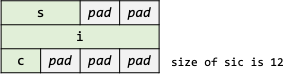

# Structures

## Goals of This Chapter

### 구조체 (Structure)의 개념과 선언 방법 이해

### 구조체 멤버의 접근 및 초기화 방식 학습

### 구조체를 함수로의 값 전달과 포인터 전달 방법 및 차이 이해

### 구조체 배열과 이진 탐색, 연결 리스트, 해시 테이블 구현 및 활용법 이해

### 자기 참조 구조체를 통해 재귀적 자료구조 구성 방법 학습

### 공용체 (Union)와 비트 필드 (Bit-Field)의 사용 목적과 메모리 구조 이해

### 메모리 정렬 (Memory Alignment)과 구조체 내 멤버 순서에 따른 메모리 절약 전략 학습

### `typedef`를 사용한 형의 추상화 및 코드 가독성 향상 이해

---

## Basics of Structures

* 관련 있는 여러 변수를 **하나의 새 자료형으로 묶은 것**
  * 구조체 선언은 **새로운 자료형을 정의**하는 것
* 이질적인 데이터를 논리적 단위로 취급하여 코드 가독성과 유지보수성 향상


```c
struct point {
    int x;
    int y;
};
```

### `struct`

* 구조체 선언을 위한 키워드

### 태그 (Struct Tag)

* 생략 가능
* `point`는 구조체 태그이며, 생략 가능

---

## Basics of Structures (Cont'd - 1)

### 구조체 선언을 통해 정의한 구조체 형 변수 선언

```c
struct point { /* Declare a reusable structure type named point */
    int x;
    int y;
};

struct point p1;      /* OK anywhere after the definition */
struct point p2 = p1; /* OK as well */
```

```c
struct { /* Declare an anonymous (not reuseable) structure tpye */
    int x;
    int y;
} p2;  /* Not reusable: the type has no name */
```

### 익명 구조체 선언의 동작 방식

* 각 익명 구조체 선언은 **고유한** 구조체 형으로 간주함

```c
struct { int x; int y; } p1;  /* Type A: anonymous struct 1 */
struct { int x; int y; } p2;  /* Type B: anonymous struct 2 (new type!) */
p1 = p2; /* error: `p1` and `p2` have different types, assignment not allowed */
```

---

## Basics of Structures (Cont'd - 2)

### 멤버 (Members)

* 구조체 내 변수들을 의미하며, **멤버 또는 태그는 일반 변수와 같은 이름을 사용할 수 있음**
  * 문맥 (context)에 의해 구분됨

```c
int id;      /* `id` here is a variable in the ordinary identifier namespace */
struct id {  /* `id` here is a tag in the tag namespace */
    int id;  /* `id` here is a member in the structure member namespace */
};
```

### 구조체 형 변수 초기화

* 배열과 유사한 형태로 초기화 수행
* 중괄호 안에 초기화자 목록 (list of initializers)을 쉼표로 구분하여 열거
* 각 초기화자 (initializer)는 **순서대로** 구조체 멤버의 초기화자로 사용

```c
/* The member `x` is initialized to 320. */
/* The member `y` is initialized to 200. */
struct point maxpt = { 320, 200 };
```

---

## Basics of Structures (Cont'd - 3)

### 구조체 멤버 연산자 (Structure Member Operator) `.`

* 구조체 형 변수의 멤버는 `.` (dot) 연산자를 사용해 접근 가능

```c
printf("(%d, %d)", maxpt.x, matpt.y);  /* structure-name.member */
```

### 중첩된 구조체 표현


```c
struct rect {
    struct point pt1;
    struct point pt2;
};

struct rect screen;

screen.pt1.x;
```

---

## Structures and Functions

* 구조체에서 허용된 연산은 같은 형 구조체 간 대입 또는 복사, 주소 얻기, 멤버 접근
  * **그 외 연산은 허용하지 않음**

[//]: # (INCLUDE: ./c/06/valid_struct_op.c)

---

## Structures and Functions (Cont'd - 1)

* 구조체에 허용된 연산은 일부이며, 그 외 필요한 연산은 직접 함수로 구현해 사용해야 함
* `struct point` 형을 조작할 수 있는 함수를 소개하면서 구조체를 사용하는 함수의 유형 소개

### 구조체의 각 멤버를 개별 인자로 함수에 전달 (Pass Components Separately)

[//]: # (INCLUDE: ./c/06/makepoint.c)

* 일반 변수 (매개변수)의 이름과 멤버의 이름이 문맥에 의해 구분됨
* 이를 기반으로 매개변수가 어느 멤버와 연관되는지를 강조할 수 있음
* 멤버의 수가 많아진다면 매개변수가 늘어남에 따라 가독성이 저하될 수 있음
  * 함수의 매개변수 수는 최대 5개를 넘지 않는 것이 관례
  * 만약 매개변수 수가 5개를 넘어갈 경우 함수를 재작성해야 함

---

## Structures and Functions (Cont'd - 2)

### 구조체 전체를 함수에 전달 (Pass an Entire Structure)

[//]: # (INCLUDE: ./c/06/addpoint.c)

[//]: # (INCLUDE: ./c/06/ptinrect.c)

* 구조체 전체를 함수에 값 형태로 전달
* 멤버를 포함한 구조체 자체를 함수로 전달함에 따라 매개변수 수를 줄일 수 있음

---

## Structures and Functions (Cont'd - 3)

### 구조체 전체를 함수에 전달 시 유의사항

[//]: # (INCLUDE: ./c/06/addpoint.c)

* 크기가 큰 구조체를 값으로 전달하는 것보다는 **구조체의 포인터를 전달**하는 것이 성능 관점에서 유리함

[//]: # (INCLUDE: ./c/06/cmp_struct_value_ptr.c)

---

## Structures and Functions (Cont'd - 4)

### 구조체의 포인터를 함수에 전달 (Pass a Pointer)

[//]: # (INCLUDE: ./c/06/printpoint.c)

### 구조체 멤버 연산자 (Structure Member Operator) `->`

* 구조체 형 포인터가 가리키는 대상의 멤버는 `->` (arrow) 연산자를 사용해 접근 가능

#### `(*pt).x`

* 최상위 우선순위를 갖는 연산자는 네 가지: `()`, `[]`, `.`, `->`
* 괄호를 사용하지 않으면 `*(pt.x)`로 평가되며, 멤버 `x`는 포인터가 아니므로 문법적으로 틀린 표현이 됨

#### `pt->y`

* `pt`가 구조체를 가리키는 포인터라면, `->` 연산자를 사용해 역참조된 객체의 특정 멤버를 가리킬 수 있음

---

## Structures and Functions (Cont'd - 5)

### Exercise – Operator Precedence with Struct Pointers

[//]: # (INCLUDE: ./c/06/example_struct_ptr.c)

---

## Arrays of Structures

### C 언어 예약어 (keywords) 입력 빈도를 계산하는 프로그램

* 예약어들을 보관할 배열과 각 예약어의 입력 빈도를 보관할 변수 하나가 필요함

```c
char *keyword[NKEYS];
int keycount[NKEYS];
```

* 각 배열은 인덱스를 기준으로 관련된 데이터를 나란히 저장하고 있음 (평행 구조, parallel arrays)
* **평행 구조 데이터는 서로 분리되어 있음**
  * 데이터를 조작할 경우 평행 구조에 놓여 있는 모든 데이터에 대해서 각각 작업이 이루어져야 함
  * 평행 구조 데이터를 함수 내에서 조작해야 할 경우, 평행 구조에 놓여 있는 모든 데이터를 인자로써 넘겨야 함
* 평행 구조를 이루는 데이터는 구조체 배열을 사용해 **논리적으로 결합된 하나위 단위**로써 데이터를 조작할 수 있음

```c
struct key {
    char *word;
    int count;
} keytab[NKEYS];
```

* 구조체 배열의 각 요소는 다음과 같은 데이터 쌍을 이룸

```c
char *word;
int count;
```

---

## Arrays of Structures (Cont'd - 1)

### 구조체 배열 초기화

* 구조체 배열 초기화는 배열 초기화처럼 중괄호로 둘러쌓인 초기화자 목록 사용
  * 중괄호 내 초기화자들은 순서대로 각 요소 별 멤버의 초기화자로 사용
  * `keytab[0].word`는 `"auto"`의 시작 주소, `keytab[0].count`는 `0`으로 초기화

```c
struct key keytab[] = {
    "auto", 0, "break", 0, "case", 0, "char", 0,
    /* ... skipped ... */
    "unsigned", 0, "void", 0, "volatile", 0, "while", 0
};
```

* 아래와 같이 중괄호를 추가로 사용하면 가독성을 높임과 동시에 실수를 방지할 수 있음

```c
struct key keytab[] = {
    { "auto", 0 },     { "break", 0 },    { "case", 0 },     { "char", 0 },
    { "const", 0 },    { "continue", 0 }, { "default", 0 },  { "do", 0 },
    { "double", 0 },   { "else", 0 },     { "enum", 0 },     { "extern", 0 },
    { "float", 0 },    { "for", 0 },      { "goto", 0 },     { "if", 0 },
    { "int", 0 },      { "long", 0 },     { "register", 0 }, { "return", 0 },
    { "short", 0 },    { "signed", 0 },   { "sizeof", 0 },   { "static", 0 },
    { "struct", 0 },   { "switch", 0 },   { "typedef", 0 },  { "union", 0 },
    { "unsigned", 0 }, { "void", 0 },     { "volatile", 0 }, { "while", 0 }
};
```

---

## Arrays of Structures (Cont'd - 2)

### `sizeof`

```text
sizeof object
sizeof(type name)
```

* `object` 또는 `type`의 바이트 수를 정수형으로 평가하는 단항 연산자
* **컴파일 시 연산이 이루어지는 연산자**

#### `sizeof` 연산자의 사용 예 - 배열 크기 자동 계산

* 요소 수가 많은 배열의 크기는 직접 계산하는 것 보다는 **기계가 자동으로 계산한 값을 쓰는 것**이 쉽고 안전한 방법
* 아래와 같은 방법으로 배열 크기를 자동으로 관리할 수 있음
  * 코드 내 배열 요소 수가 변경되더라도 컴파일러가 올바른 크기를 자동으로 계산함

```c
/* 1 */ #define NKEYS (sizeof keytab / sizeof(struct key))
/* 2 */ #define NKEYS (sizeof keytab / sizeof(keytab[0]))
```

* 두 번째 방법은 구조체 형이 바뀌어도 수정하지 않아도 된다는 장점이 있음

---

## Arrays of Structures (Cont'd - 3)

```text
|-- bsearch.c
|-- getch.c   # NB: Reuse previously implemented file
|-- getword.c
|-- key.c
|-- key.h
`-- main.c
```

* `key.h`

[//]: # (INCLUDE: ./c/06/ex03/key.h)

---

## Arrays of Structures (Cont'd - 4)

* `key.c`

[//]: # (INCLUDE: ./c/06/ex03/key.c)

---

## Arrays of Structures (Cont'd - 5)

* `main.c`

[//]: # (INCLUDE: ./c/06/ex03/main.c)
---

## Arrays of Structures (Cont'd - 6)

* `bsearch.c`

[//]: # (INCLUDE: ./c/06/ex03/bsearch.c)

---

## Arrays of Structures (Cont'd - 7)

* `getword.c`

[//]: # (INCLUDE: ./c/06/ex03/getword.c)

---

## Arrays of Structures (Cont'd - 8)

### 메모리 정렬 규칙 (Memory Alignment)

* 구조체 멤버 중 가장 큰 자료형의 크기를 기준으로 메모리를 정렬함
* **모든 멤버의 주소는 자신의 자료형 크기로 나누어질 수 있는 주소를 가져야 함**
  * 만약 올바른 주소를 가질 수 없다면, 유효한 주소를 가질 수 있을 때까지 셀을 건너뜀 (padding)

```c
struct {
    char c1;
    char c2;
    char c3;
} ccc;
```


---

## Arrays of Structures (Cont'd - 9)

### 메모리 정렬 규칙을 활용한 예 - 메모리 절약

* 아래 두 구조체는 같은 종류의 멤버를 구성하나, 순서에 따라 메모리 사용량에 차이가 발생할 수 있음

```c
struct {
    short s;
    int i;
    char c;
} sic;
```



```c
struct {
    short s;
    char c;
    int i;
} sci;
```


---

## Arrays of Structures (Cont'd - 10)

### 구조체 반환형

* 복합형 (a complicated type, e.g., a structure pointer)을 반환하는 함수는 가독성이 좋지 못함
  * 복합형은 여러 단어를 포함할 수 있으며, 이는 함수의 이름을 빠르게 판단하기 어려울 수 있음

```c
struct key *binsearch(char *word, struct key tab[], int n);
```

* 다음과 같은 형태를 사용하면 반환형과 이름을 확실히 구분할 수 있음

```c
/* This is a matter of personal taste; pick the form you like and HOLD to it. */
struct key *
binsearch(char *word, struct key tab[], int n)
```

---

## Self‑referential Structures

### 입력되는 단어의 빈도 수를 계산하는 프로그램

* C 언어 예약어 입력 빈도 계산 프로그램은 **입력될 데이터가 이미 알려진 경우**였음
  * 키워드를 빠르게 탐색할 수 있도록 구조체 배열에 키워드 정보를 **오름차순**으로 초기화
* 일반적으로 프로그램에 입력될 데이터를 사전에 모르는 경우가 대부분임
  * 입력될 데이터를 알지 못하므로 미리 정렬하거나 이진 탐색을 적용할 수 없는 상황
* 선형 탐색 (linear search)을 사용해 단어가 입력될 때마다 매번 탐색하는 것은 매우 비효율적임
  * 입력 단어 수가 많아질수록 실행 시간이 제곱에 비례 (quadratic)함

#### 해결 방안

* 단어가 입력될 때마다 정렬된 상태로 유지한 후, 이진 탐색 사용
* 일반 배열을 사용할 경우, 정렬을 위한 요소 간 이동이 발생함에 따라 성능 저하가 있음
* **이진 트리** (binary tree) 자료 구조를 사용하면 입력된 데이터를 효율적으로 정렬할 수 있음

### 노드 (Nodes)

* 트리는 각 단어 당 하나의 노드를 사용해 관리하며, 하나의 노드는 다음 정보들을 포함함:

```text
a pointer to the text of the word
a count of the number of occurrences
a pointer to the left child node
a pointer to the right child node
```

* **모든 노드는 최대 두 개의 자식 (children) 노드를 가질 수 있음**

---

## Self‑referential Structures (Cont'd - 1)

### 이진 트리 (Binary Tree)

* 이진 트리 자료 구조가 노드들을 관리하면 다음과 같은 특징이 있음:
  1. 왼쪽 부분 트리 (subtree)에 속한 노드들의 단어는 현재 노드의 단어보다 사전 순으로 앞에 위치한다.
  2. 오른쪽 부분 트리 (subtree)에 속한 노드들의 단어는 현재 노드의 단어보다 사전 순으로 뒤에 위치한다.
* 문장 "now is the time for all good men to come to the aid of their party"을 트리로 표현하면 다음과 같음:


#### 이진 트리에서 새 단어의 존재 유무 확인 방법

* 다음 과정은 재귀적으로 수행됨:
  1. 루트 노드의 단어와 새 단어를 비교한다.
  2. 서로 일치하면 단어가 이미 입력되어 있는 상태다.
  3. 서로 불일치하고 새 단어가 사전 순으로 앞에 위치하면, 왼쪽 부분 트리로 이동하여 왼쪽 자식에서 다시 비교한다.
  4. 서로 불일치하고 새 단어가 사전 순으로 뒤에 위치하면, 오른쪽 부분 트리로 이동하여 오른쪽 자식에서 다시 비교한다.
  5. 탐색을 올바른 방향대로 지속하였음에도 찾지 못하였다면, 단어는 트리 내에 존재하지 않는 상태다.
      * **현재 가리키는 빈 공간은 새 단어가 트리에 등록될 경우 노드가 새로 추가될 위치이기도 함**

---

## Self‑referential Structures (Cont'd - 2)

### 자기 참조 구조체

* 자기 자신을 가리키는 포인터를 멤버로 구성한 구조체

```c
struct tnode {           /* the tree node: */
    char *word;          /* points to the text */
    int count;           /* number of occurrences */
    struct tnode *left;  /* left child */
    struct tnode *right; /* right child */
};
```

* 구조체 이름이 선언되는 순간, 컴파일러는 이를 이름만 가진 불완전 형 (incomplete type)으로 간주됨
  * 구조체 정의가 마무리되어야 완전 형 (complete type)으로 간주
* 자기 자신의 객체를 포함하는 것은 허용되지 않음
  * 불완전 형 객체는 **실제 얼마큼의 메모리를 점유해야 할지 알 수 없으므로** 생성 불가
* **자기 자신을 가리키는 포인터는 허용함**
  * 가리키는 대상이 불완전 형이지만, 포인터는 메모리 크기 (4 or 8 bytes)가 이미 정해져 있으므로 생성 가능

---

## Self‑referential Structures (Cont'd - 3)

### 자기 참조 구조체 응용: 구조체 선언을 사용한 서로를 참조하는 구조체

* 구조체 선언은 해당 형이 사용될 것임을 미리 알리기 위한 용도
  * 해당 선언의 실제 정의는 다른 어딘가에 반드시 존재해야 함

| **Aspect**            | **Struct Definition**                                               | **Struct Declaration**                                                 |
| --------------------- | ------------------------------------------------------------------- | ---------------------------------------------------------------------- |
| **Purpose**           | Defines a complete structure type with member layout                | Introduces the structure type name without detailing its members       |
| **Completeness**      | Complete type (can instantiate variables and compute size)          | Incomplete type (cannot instantiate or dereference its objects)        |
| **Syntax**            | `struct Point { int x; int y; };`                                   | `struct Point;`                                                        |

```c
/* Forward declaration of struct s is required before using it as a pointer
 * type. */
struct s;

struct t {
    struct s *p;  /* `p` points to a `struct s` */
};

struct s {
    struct t *q;  /* `q` points to a `struct t` */
};
```

---

## Self‑referential Structures (Cont'd - 4)

### `alloc` 함수의 문제점

```c
#define ALLOCSIZE 10000          /* size of available space */
static char allocbuf[ALLOCSIZE]; /* storage for alloc */
static char *allocp = allocbuf;  /* next free position */

char *alloc(int n);  /* return pointer to n characters */
void afree(char *p); /* free storage pointed to by p */
```

> How does it meet the requirement of most real machines that objects of certain types must satisfy alignment restrictions (for example, integers often must be located at even addresses)?

* `alloc` 함수는 단순히 바이트 수만 인자로 전달 받아 처리함
* 메모리 정렬 규칙은 누락된 상태

> What declarations can cope with the fact that an allocator must necessarily return different kinds of pointers?

* `alloc` 함수는 반환형이 `char *`로 고정임
* 자료형에 대한 고려는 되어있지 않음

> What problems may occur when creation and destruction orders are mismatched?

* 스택 기반의 저장공간 할당기는 반드시 할당 순서의 역순으로 할당받은 객체를 반환해야 함

---

## Self‑referential Structures (Cont'd - 5)

### 동적 저장공간 할당기

```c
/* `malloc` and related routines are declared in the header <stdlib.h> */
#include <stdlib.h> /* for malloc(), calloc(), free(), etc. */

void *malloc(size_t n);
void *calloc(size_t n, size_t size);
void free(void *p);
```

* `malloc(n)`
  * 힙 영역에 `n` 바이트 크기의 초기화되지 않은 메모리 블록을 할당
  * 성공 시 해당 블록의 시작 주소를, 실패 시 `NULL`을 반환
* `calloc(n, size)`
  * 힙 영역에 `n` × `size` 바이트 크기의 0으로 초기화된 메모리 블록을 할당
  * 성공 시 해당 블록의 시작 주소를, 실패 시 `NULL`을 반환
* `free(p)`
  * `p`가 메모리 관리 함수 (`malloc`, `calloc`, `realloc`)에서 반환된 포인터일 경우, 이를 해제
  * 메모리 관리 함수가 반환한 주소가 아니거나 이미 해제된 주소를 전달할 경우 UB
  * `free(p)` 이후 `p`는 더 이상 유효하지 않으며, 이를 사용하면 UB
* 메모리 관리 함수는 `void *`형을 반환하므로 형에 독립적이며, **범용적으로 사용 가능**

```c
int *ip = (int *) malloc(sizeof(int));
struct tnode *node = (struct tnode *) malloc(sizeof(struct tnode));
```

---

## Self‑referential Structures (Cont'd - 6)

### 동적 저장공간 할당기 예시

[//]: # (INCLUDE: ./c/06/heap_example.c)

---

## Self‑referential Structures (Cont'd - 7)

```text
.
|-- getch.c   # NB: Reuse previously implemented file
|-- getword.c # NB: Reuse previously implemented file
|-- main.c
|-- strdup.c
|-- tree.c
`-- tree.h
```

* `tree.h`

[//]: # (INCLUDE: ./c/06/ex04/tree.h)

---

## Self‑referential Structures (Cont'd - 8)

* `tree.c`

```c
#include "tree.h"

#include <stdio.h>
#include <stdlib.h>
#include <string.h>

char *strdup(char *);

/* addtree: add a node with w, at or below p */
struct tnode *addtree(struct tnode *p, char *w)
{
    int cond;

    if (!p) {         /* p == NULL, a new word has arrived */
        p = talloc(); /* make a new node */
        p->word = strdup(w);
        p->count = 1;
        p->left = p->right = NULL;
    } else if ((cond = strcmp(w, p->word)) == 0) { /* repeated word */
        p->count++;
    } else if (cond < 0) { /* less than into left subtree */
        p->left = addtree(p->left, w);
    } else { /* greater than into right subtree */
        p->right = addtree(p->right, w);
    }

    return p;
}
```

---

## Self‑referential Structures (Cont'd - 9)

```c
/* treeprint: in-order print of tree p */
void treeprint(struct tnode *p)
{
    if (p) { /* p != NULL */
        treeprint(p->left);
        printf("%4d %s\n", p->count, p->word);
        treeprint(p->right);
    }
}

/* talloc: make a tnode */
struct tnode *talloc(void)
{
    return (struct tnode *) malloc(sizeof(struct tnode));
}
```

> If the tree becomes **"unbalanced"** because the words don't arrive in random order, the running time of the program can grow too much. As a worst case, if the words are already in order, this program does an expensive simulation of linear search. There are generalizations of the binary tree that do not suffer from this worst-case behavior, but we will not describe them here.

---

## Self‑referential Structures (Cont'd - 10)

* `main.c`

[//]: # (INCLUDE: ./c/06/ex04/main.c)

---

## Self‑referential Structures (Cont'd - 11)

* `strdup.c`

[//]: # (INCLUDE: ./c/06/ex04/strdup.c)

---

## Table Lookup

* 테이블 탐색은 여러 분야에서 사용되고 있음
  * 데이터베이스, 컴파일러, 전처리기, etc.

### 간단한 매크로 처리기 구현

* `install(s, t)`: 식별자 `s`와 대치할 문자열 `t`을 매크로 처리기 내부 테이블에 등록

```c
#define IN 1
```

* `lookup(s)`: 식별자 `s`가 내부 테이블에 등록된 상태인지 탐색
* 식별자 `s`가 내부 테이블에 존재할 경우 등록된 레코드를 가리키는 포인터 반환
* 식별자 `s`가 내부 테이블에 존재하지 않을 경우 `NULL` 반환

```c
int state = IN; /* `IN` must be replaced by 1 */
```

---

## Table Lookup (Cont'd - 1)

### 연결 리스트 (Linked List)

* 각 노드를 포인터를 사용해 연결된 **논리적인 선형 구조**를 갖는 자료 구조
* 연결 리스트의 노드는 식별자와 대치 문자열의 정보, 다음 노드를 가리키는 포인터로 구성됨
* 포인터의 값이 `NULL`일 경우, 연결 리스트의 끝 노드를 의미

```c
struct nlist {          /* table entry: */
    struct nlist *next; /* next entry in chain */
    char *name;         /* defined name */
    char *defn;         /* replacement text */
};
```

---

## Table Lookup (Cont'd - 2)

### 해시 탐색 (Hash Search)

* 임의의 데이터를 **음수가 아닌 정수형** 값으로 변환하는 알고리즘
* 매크로 처리기의 `install`, `lookup` 함수는 해시 탐색 알고리즘을 기반으로 구현
* 입력되는 식별자를 `0 ~ HASHSIZE - 1` 범위의 정수로 변환하여 **포인터 배열의 인덱스**로 사용
  * 계산된 임의의 양의 정수를 `HASHSIZE`로 나머지 연산
* 포인터 배열의 각 요소는 **연결 리스트 (a linked list)의 시작 노드를 가리킴**

```c
struct nlist *hashtab[HASHSIZE]; /* pointer table */

/* hash: form hash value for string s */
unsigned hash(char *s)
{
    unsigned hashval;

    for (hashval = 0; *s != '\0'; s++)
        hashval = *s + 31 * hashval;

    return hashval % HASHSIZE;
}
```


---

## Table Lookup (Cont'd - 3)

### 매크로 처리기의 탐색 과정

* 해시 탐색 알고리즘의 특징 (데이터의 해시 값은 고유함)을 사용해 빠르게 탐색 가능

```c
/* lookup: look for s in hashtab */
struct nlist *lookup(char *s)
{
    struct nlist *np;

    for (np = hashtab[hash(s)]; np != NULL; np = np->next) {
        if (!strcmp(s, np->name))
            return np; /* found */
    }

    return NULL; /* not found */
}
```

---

## Table Lookup (Cont'd - 4)

### 매크로 처리기의 등록 과정

* 등록 시 이미 존재하는 식별자에 대해서는 새로운 대치 문자열로 대치 (supersede)
* 등록 시 내부 테이블에 존재하지 않을 경우 식별자를 새로 등록

```c
/* install: put (name, defn) in hashtab */
struct nlist *install(char *name, char *defn)
{
    struct nlist *np;
    unsigned hashval;

    if (!(np = lookup(name))) {
        /* not found */
        np = (struct nlist *) malloc(sizeof(*np));
        if (!np || !(np->name = strdup(name)))
            return NULL;
        hashval = hash(name);
        np->next = hashtab[hashval];
        hashtab[hashval] = np;
    } else {
        /* already there */
        free((void *) np->defn); /* free previous defn */
    }
    if (!(np->defn = strdup(defn)))
        return NULL; /* if for nay reason there's no room for a new entry */

    return np;
}
```

---

## Table Lookup (Cont'd - 5)

```text
.
|-- itoa.c
|-- main.c
|-- strdup.c
|-- table.c
`-- table.h
```

* `table.h`

[//]: # (INCLUDE: ./c/06/ex05/table.h)

---

## Table Lookup (Cont'd - 6)

* `table.c`

```c
#include "table.h"

#include <stdio.h>
#include <stdlib.h>
#include <string.h>

char *strdup(char *s);

struct nlist *hashtab[HASHSIZE]; /* pointer table */

/* hash: form hash value for string s */
unsigned hash(char *s)
{
    unsigned hashval;

    for (hashval = 0; *s != '\0'; s++)
        hashval = *s + 31 * hashval;

    return hashval % HASHSIZE;
}

/* lookup: look for s in hashtab */
struct nlist *lookup(char *s)
{
    struct nlist *np;

    for (np = hashtab[hash(s)]; np != NULL; np = np->next) {
        if (!strcmp(s, np->name))
            return np; /* found */
    }

    return NULL; /* not found */
}
```

---

## Table Lookup (Cont'd - 7)

```c
/* install: put (name, defn) in hashtab */
struct nlist *install(char *name, char *defn)
{
    struct nlist *np;
    unsigned hashval;

    if (!(np = lookup(name))) {
        /* not found */
        np = (struct nlist *) malloc(sizeof(*np));
        if (!np || !(np->name = strdup(name)))
            return NULL;
        hashval = hash(name);
        np->next = hashtab[hashval];
        hashtab[hashval] = np;
    } else {
        /* already there */
        free((void *) np->defn); /* free previous defn */
    }
    if (!(np->defn = strdup(defn)))
        return NULL;

    return np;
}
```

---

## Table Lookup (Cont'd - 8)

* `itoa.c`

[//]: # (INCLUDE: ./c/06/ex05/itoa.c)

---

## Table Lookup (Cont'd - 9)

* `strdup.c`

[//]: # (INCLUDE: ./c/06/ex05/strdup.c)

---

## Table Lookup (Cont'd - 10)

* `main.c`

[//]: # (INCLUDE: ./c/06/ex05/main.c)

---

## Typedef

* **이미 존재하는 형**에 새로운 이름 생성
  * **새로운 형을 만드는 것이 아님에 유의**
* `typedef` 키워드를 사용해 새로 선언한 이름은 형처럼 사용 가능

```c
typedef int Length;   /* Now `Length` is synonymous with `int` */

Length len, maxlen;
Length *lengths[] = {1, 10, 100};
```

```c
typedef char *String  /* Now `String` is synonymous with `char *` */

String p, lineptr[MAXLINES], alloc(int);
int strcmp(String, String);
p = (String) malloc(100);
```

* `typedef`는 `extern`, `static` 같은 저장 클래스 지정자 (storage class specifiers)의 한 유형
* 새로 정의할 이름은 `typedef` 바로 뒤가 아닌 변수 이름이 오는 자리에 위치

```c
extern int g_var = 0;  /* `g_var` is in the usual variable name position */
typedef int Length;    /* `Length` appears in the same position as a variable */
```

* `typedef`로 새로 생성한 이름은 다른 이름과 구분하기 위해 **대문자로 시작하는 이름 사용**

---

## Typedef (Cont'd)

* 복잡한 자료형에 대해서도 적용 가능

```c
typedef struct tnode *Treeptr;

typedef struct tnode {  /* the tree node: */
    char *word;         /* points to the text */
    int count;          /* number of occurrences */
    Treeptr left;       /* left child */
    Treeptr right;      /* right child */
} Treenode;

Treeptr talloc(void)
{
    return (Treeptr) malloc(sizeof(Treenode));
}
```

* `define` 전처리 지시문과 비슷해 보이나, 전처리 지시문보다 더 다양한 형태로 사용될 수 있음

```c
typedef int (*PFI)(char *, char *);
PFI strcmp, numcmp;
```

* `typedef` 사용 시 **가독성**을 높이며, 이식 가능성 있는 프로그램에서 **기계 의존적인 자료형**을 효율적으로 관리할 수 있음

```c
#ifdef _MSC_VER
typedef unsigned __int64 ImU64;  /* 64-bit unsigned integer */
#else
typedef unsigned long long ImU64;  /* 64-bit unsigned integer */
#endif
```

---

## Unions

* 구조체 문법 (메모리 정렬 규칙, 허용된 연산 등) 기반의 사용자 정의 형
* **구조체의 멤버는 독립적인 반면 공용체는 멤버를 공유함**
  * 열거형의 멤버 중 가장 큰 객체 크기가 곧 공용체 변수의 크기가 됨
  * 공용체는 **모든 멤버의 오프셋이 0**이므로, 모든 멤버의 주소는 같음


[//]: # (INCLUDE: ./c/06/07.c)

---

## Unions (Cont'd - 1)

### 컴파일러의 식별자 관리 프로그램 예시

* 자료형 수와 관계 없이 **하나의 공유된 객체**에 데이터를 관리
* 공용체 사용 시 현재 공용체에 저장된 값의 자료형이 무엇인지 잘 추적해야 함
* 만약 저장된 값의 자료형과 다른 형으로 값을 읽어올 경우 잘못된 값이 반환될 수 있음

```c
union {
    int ival;
    float fval;
    char *sval;
} u;
```

```c
if (utype == INT)
    printf("%d\n", u.ival);
else if (utype == FLOAT)
    printf("%f\n", u.fval);
else if (utype == STRING)
    printf("%s\n", u.sval);
else
    printf("bad type %d in utype\n", utype);
```

---

## Unions (Cont'd - 2)

### 구조체와 공용체의 중첩 구조

* 구조체 안에 구조체를 정의하거나 공용체를 정의할 수 있음
* 공용체 안에 공용체를 정의하거나 구조체를 정의할 수 있음

```c
struct {
    char *name;
    int flags;
    int utype;
    union {
        int ival;
        float fval;
        char *sval;
    } u;
} symtab[NSYM];
```

* 공용체 초기화 시 초기화자의 자료형은 공용체의 첫 멤버의 자료형을 따름

---

## Bit-Fields

* 여러 개의 상태 정보를 표현해야 하는 상황에서, 하나의 객체에 비트 단위로 데이터를 조작하면 메모리를 절약할 수 있음
* 각 상태는 2의 배수 형태로 표현해야 서로 독립된 비트를 사용할 수 있음

```c
int flag_keyword = 1;
int flag_external = 1;
int flag_static = 0;
```

* 위 예시는 비트 연산을 사용하여 다음과 같이 표현할 수 있음:

```c
#define KEYWORD 01   /* 2^0 */
#define EXTERNAL 02  /* 2^1 */
#define STATIC  04   /* 2^2 */

unsigned int flags = 0;

flags |= EXTERNAL | STATIC;
flags &= ~(EXTERNAL | STATIC);
if ((flags & (EXTERNAL | STATIC)) == 0);
```

---

## Bit-Fields (Cont'd)

* 명시적으로 2의 배수 형태의 상수를 정의해 비트를 직접 조작할 수 있으나, C 언어에는 비트 필드라는 기능을 제공함
* 비트 필드는 구조체 기반이며, CPU의 1 워드 (word) 크기의 객체에 직접 비트를 제어할 수 있음
  * 워드는 CPU가 한 번에 처리할 수 있는 기본 데이터 단위
  * 크기는 시스템 또는 컴파일러에 따라 구현 정의 (implementation-defined)되며
  * 일반적으로 `unsigned int` 형 크기와 같음

```c
struct {
    char *name;
    struct {
        unsigned int is_keyword : 1;
        unsigned int is_extern : 1;
        unsigned int is_static : 1;
    } flags;
    int utype;
    union {
        int  ival;
        float fval;
        char *sval;
    } u;
} symtab[NSYM];

symtab[i].flags.is_extern = 1;
symtab[i].flags.is_keyword = symtab[i].flags.is_static = 0;
if (!(symtab[i].flags.is_extern || symtab[i].flags.is_static)) { /* ... */ }
```

* 콜론 옆 숫자는 해당 멤버의 비트 폭 (width)을 의미
* 비트 필드는 **무부호형**을 사용하는 것이 관례

---

## Bit-Fields (Cont'd - 2)

* 비트 필드의 이름이 생략될 경우, 비트를 폭만큼 건너뜀 (padding)


[//]: # (INCLUDE: ./c/06/10.c)

---

## Bit-Fields (Cont'd - 3)

* 비트 폭이 0인 경우, 비트를 다음 메모리의 경계까지 강제로 정렬함 (alignment)


[//]: # (INCLUDE: ./c/06/11.c)

---

## Bit-Fields (Cont'd - 4)

* 비트 필드는 부호형도 사용 가능하나, 비트 필드 조작 결과가 음수가 될 수 있다는 점을 유념해야 함

[//]: # (INCLUDE: ./c/06/09.c)

* 비트 필드는 엔디안 방식 (endianness)에 따라 값을 넣는 방향이 결정됨
  * 대부분의 기계는 리틀 엔디안 (하위 바이트가 메모리의 낮은 주소에 저장)
* 비트 필드는 배열을 사용할 수 없으며, 주소를 갖지 않음

---

## Appendix A. `bsearch`


---

## Appendix B. `qsort`


---

## Appendix C. Example Program Using `qsort` and `bsearch`

[//]: # (INCLUDE: ./c/06/bsearch.c)
