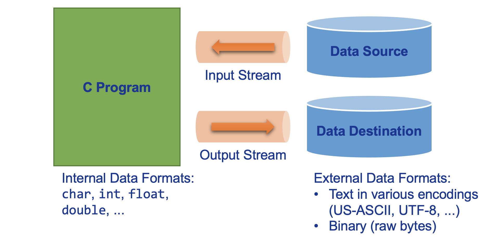
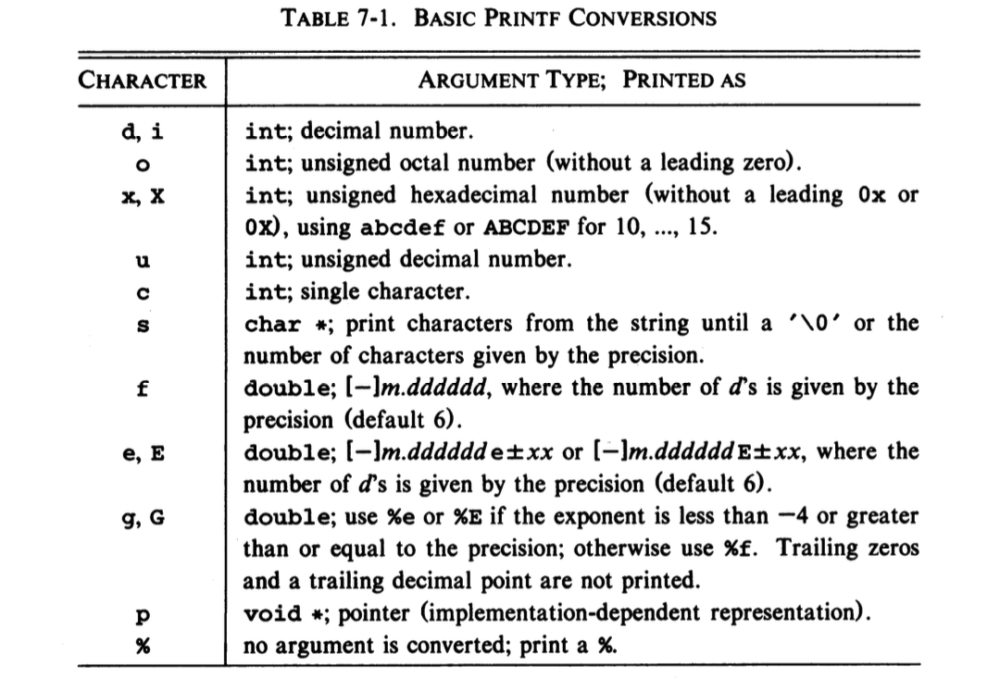
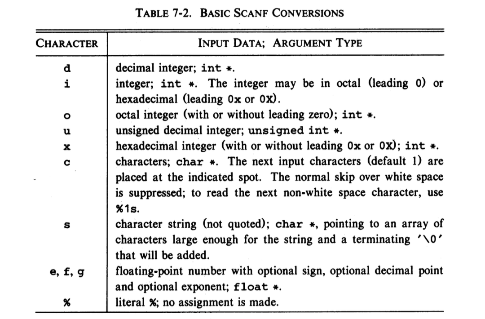
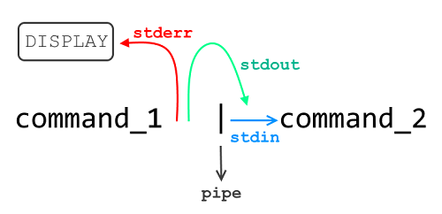

# Input and Output

## Goals of This Chapter

### 표준 스트림 개념 이해

* `stdin`, `stdout`, `stderr` 의 역할과 셸 리다이렉션, 파이프 개념 소개

### 문자, 줄 단위 입출력 소개

* `getchar` / `putchar`, `getc` / `putc`, `fgets` / `fputs` 함수 소개

### 형식화된 입출력 소개

* `printf` / `scanf` 계열 함수의 변환 지정자(`%` flags, width, precision, length) 구문 소개

### 가변 인자 함수

* `stdarg.h` 의 `va_list` / `va_start` / `va_arg` / `va_end` 소개

### 파일 입출력 및 오류 처리

* `FILE*`, `fopen` / `fclose`, `fprintf` / `fscanf`, 버퍼 플러시 소개
* `ferror`, `feof`, `exit` 함수 소개

### 자주 쓰는 라이브러리 함수

---

## Standard Input and Output

* C 언어에서 입력과 출력을 간단히 처리할 수 있는 모델 (스트림, streams)을 라이브러리 형태로 제공
* 입출력 라이브러리 함수를 사용하는 소스코드는 `stdio.h` 헤더를 전처리 지시문을 사용해 포함해야 함



```c
/* The simplest way to get input is by reading one character at a time
 * from standard input using the getchar function.
 * Returns the character read, or EOF on error or end of input. */
int getchar(void);

/* The simplest way to produce output is by writing one character at a time
 * to standard output using the putchar function.
 * Returns the character written, or EOF on error. */
int putchar(int c);
```

---

## Redirection Operators: `<`, `>`, `|`

* 대부분의 환경에서는 `<` (input redirection), `>` (output redirection), `|` (pipe) 연산자를 지원함

### The `<` Convention

```text
prog <infile
```

* **키보드를 파일로 대체**하여 프로그램의 표준 입력 함수가 파일의 내용을 읽어옴
* **문자열 `"<infile"`은 커맨드 라인 전달인자에 영향을 주지 않음**

### The `|` Convention

```text
otherprog | prog
```

* 두 프로그램을 실행하여 `otherprog`의 표준 출력을 `prog`의 표준 입력으로 연결 (pipe)

### The `>` Convention

```text
prog >outfile
```

* **화면을 파일로 대체**하여 프로그램의 표준 출력 함수가 출력한 내용을 파일로 내보냄
* **문자열 `">outfile"`은 커맨드 라인 전달인자에 영향을 주지 않음**

---

## Redirection Operators: `<`, `>`, `|` (Cont'd - 1)

* `otherprog.c`

[//]: # (INCLUDE: ./c/07/otherprog.c)

* `prog.c`

[//]: # (INCLUDE: ./c/07/prog.c)

---

## Redirection Operators: `<`, `>`, `|` (Cont'd - 2)


```bash
# Create `in` with sample text and verify its contents
echo "Hello, World" > in
cat in
```

```bash
# Create an empty file named `out` and confirm it's empty
touch out
cat out
```

```bash
# Compile both programs, run them with input/output redirection and a pipe
gcc otherprog.c -o otherprog
gcc prog.c -o prog
./otherprog <in | ./prog >out
```

```bash
# Display the contents of `out` after processing
cat out
```

---

## Formatted Output — Printf

### `int printf(char *format, arg1, arg2, ...)`

* `printf` 함수는 주어진 인자들을 변환한 후 표준 출력으로 출력하는 함수
* 출력된 문자 수를 정수 값으로 반환

```c
/*  'H'  'e'  'l'  'l'  'o'  ' '  'w'  'o'  'r'  'l'  'd'  '!'  '\n'  */
printf("%d\n", printf("Hello world!\n")); /* > Hello world!
                                           *   13           */
```

### 형식 문자열 (Format String)

* `printf` 함수의 `format` 인자 (형식 문자열)는 다음 두 요소를 포함:
  1. 일반 문자 (ordinary characters): 출력 스트림으로 그대로 복사됨
  2. 변환 지정자 (conversion specifications): 출력 스트림으로 구문에 맞게 변환 후 복사됨

### 변환 지정자 (Conversion Specifications) 구문

* 각 변환 지정자는 `%`로 시작하고 변환 문자 (conversion character, specifier)로 끝나는 구조
* `%`와 변환 문자 사이에는 다음 요소들이 **순서대로** 등장할 수 있음:

```text
%[flags][width][.precision][length]specifier
```

---

## Formatted Output — Printf (Cont'd - 1)

### 변환 지정자의 구성 요소

#### `[flags]`

* `-` (하이픈, hyphen) 입력 시 출력 칸을 왼쪽 정렬 (기본 값은 오른쪽 정렬)

#### `[width]`

* 숫자 입력 시 출력 칸의 최소 너비 설정 (기본 값은 출력될 문자 수에 맞게 너비 설정)
* `*` 기호 입력 시 출력 칸의 최소 너비를 정수형 전달인자의 값으로 설정

#### `[.precision]`

* 숫자 (`precision`) 입력 시 지정자에 따라 정밀도 설정:
  1. 문자열 (e.g., `%.5s`): 출력할 최대 문자 수 지정
  2. 부동소수점 (e.g., `%.5f`): 소수점 이하 자릿수 지정 (기본 값은 6자리)
  3. 정수 (e.g., `%.5d`): 출력 칸에 출력될 숫자의 최소 개수 (부족한 자리는 0으로 채움)

#### `[length]`

* 정수형 크기 지정자로, `h` (e.g., `%hd`)는 `short` 형 정수를 출력하며 `l` (e.g., `%ld`)은 `long` 형 정수를 출력

---

## Formatted Output — Printf (Cont'd - 2)



---

## Formatted Output — Printf (Cont'd - 3)

### 정수형 변환 지정자 예시 1

[//]: # (INCLUDE: ./c/07/printf_int1.c)

---

## Formatted Output — Printf (Cont'd - 4)

### 정수형 변환 지정자 예시 2

[//]: # (INCLUDE: ./c/07/printf_int2.c)

---

## Formatted Output — Printf (Cont'd - 5)

### 부동소수점 변환 지정자 예시 1

* **실수 표현 시 사용되는 모든 문자들 (e.g., `.`, `e+`, `E+`)은 출력 너비에 포함됨**
* 변환 문자 `f`, `e`, `E`의 정밀도는 소수점 아래 자리를 의미하며, 기본 정밀도는 6
* 변환 문자 `g`, `G`의 정밀도는 **전체 유효 숫자** (significant digits)를 의미하며, 기본 정밀도는 6
  * e.g., `1.234E+00`의 유효 숫자는 4개 (`1`, `2`, `3`, `4`)
* 변환 문자 `g`, `G`는 뒤따르는 0과 불필요한 소수점은 무시됨

[//]: # (INCLUDE: ./c/07/printf_floating1.c)

---

## Formatted Output — Printf (Cont'd - 6)

### 부동소수점 변환 지정자 예시 2

```text
if (exponent < -4 || exponent >= precision)
    %g (%G) → use exponential format %e (%E)
else
    %g (%G) → use fixed-point format %f
```

[//]: # (INCLUDE: ./c/07/printf_floating2.c)

---

## Formatted Output — Printf (Cont'd - 7)

### 문자열 및 기타 변환 지정자 예시

[//]: # (INCLUDE: ./c/07/printf.c)

---

## Formatted Output — Printf (Cont'd - 8)

### `printf` 함수 사용 시 주의점

* `printf` 함수의 첫 인자 (형식 문자열)는 뒤따르는 전달인자의 수, 그리고 각 전달인자의 자료형을 결정함
* 형식 문자열에서 요구하는 전달인자의 수 또는 자료형이 일치하지 않을 경우 **잘못된 결과**가 출력될 수 있음
* 다음 두 호출의 차이를 구분할 수 있어야 함:

[//]: # (INCLUDE: ./c/07/printf_warning.c)

---

## Formatted Output — Printf (Cont'd - 9)

### `int sprintf(char *string, char *format, arg1, arg2, ...)`

* `printf`의 출력은 표준 출력 (모니터)로 전달됨
* `sprintf`의 출력은 `char` 형 배열 (`string`)으로 전달됨
* `string`은 출력 결과를 저장하기 위해 **충분한 공간**이 있어야 함

[//]: # (INCLUDE: ./c/07/06.c)

---

## Variable-Length Argument Lists

* `printf` 함수의 축약 형태인 `minprintf` 함수를 구현하면서 가변 전달인자 함수 구현 방법을 학습
* `minprintf` 함수를 구현하면서 `printf` 함수의 형식 문자열 처리 과정 확인

### 가변 전달인자 함수의 선언

* `printf` 함수의 실제 선언은 `int printf(char *fmt, ...)`
* 함수의 매개변수 중 `...` 표현은 전달인자의 수 또는 자료형이 **변한다**는 의미
* 가변 전달인자는 함수 호출 시 **형이 승격된 값**으로 평가되어 **이름 없는 객체**로 생성됨
  * `char` 또는 `short` 형 객체는 `int` 형으로 승격 (§3.2.1.1 — "Integral Promotions")
  * `float` 형 객체는 `double` 형으로 승격 (§3.2.1.2 — "Floating Promotions")
* 가변 전달인자 함수 측에는 가변 전달인자가 **값 형태**로 복사됨

### 표준 헤더 `stdarg.h`

* 가변 전달인자 함수를 사용하기 위해 필요한 매크로의 정의들을 포함하는 헤더
* `va_list` 형은 가변 전달인자를 차례로 가리킬 수 있는 포인터 자료형
* `va_start` 매크로는 `va_list` 형 객체가 **전달된 이름 없는 객체 중 첫 객체를 가리키도록 초기화**
  * `va_list` 형 객체를 사용하기 전에 반드시 호출되어야 함
* `va_arg` 매크로는 `va_list` 형 객체가 가리키는 인자를 지정한 자료형으로 읽어옴
  * `va_arg` 매크로가 호출될 때마다 `va_list`형 객체는 자동으로 다음 인자를 가리킴
* `va_end` 매크로는 `va_list`형 객체를 정리 (cleanup)
  * 가변 전달인자 함수 종료 전 반드시 호출해야 하며, 미호출 시 UB

---

## Variable-Length Argument Lists (Cont'd)

[//]: # (INCLUDE: ./c/07/08.c)

---

## Formatted Input — Scanf

### `int scanf(char *format, ...)`

* `scanf` 함수는 `printf` 함수와 사용 형태가 유사한 입력 함수
* 표준 입력으로부터 데이터를 형식에 따라 읽어온 뒤, 결과를 전달인자에 저장
  * `scanf` 함수의 전달인자는 **반드시 포인터여야 함**
  * 포인터 아닌 인자를 넘겨줄 경우 컴파일 오류가 발생하지 않으므로 주의할 것
* 형식 문자열을 끝까지 처리했거나 (exhausts) 전달인자 수 또는 자료형이 형식 문자열과 일치하지 않으면 종료됨
* 읽어온 데이터를 전달인자에 성공적으로 전달한 갯수를 정수 값으로 반환
* 표준 입력에 더 이상 읽어올 데이터가 없다면 `EOF` 반환

[//]: # (INCLUDE: ./c/07/scanf.c)

---

## Formatted Input — Scanf (Cont'd - 1)

### 형식 문자열

* `scanf` 함수의 `format` 인자는 다음 요소들을 포함:
  1. 공백 문자 (blanks or tabs): 입력 스트림에서 다음 공백이 아닌 문자 또는 입력의 끝까지 건너뜀
  2. 일반 문자: 입력 스트림의 다음 공백이 아닌 문자와 **정확히 일치**해야 함
  3. 변환 지정자: 입력 스트림으로부터 구문에 맞게 읽어옴

### 변환 지정자 구문

```text
%[*][width][length]specifier
```

* `[*]`
  * 입력 스트림으로부터 값을 읽되 무시함
* `[width]`
  * 입력 스트림으로부터 읽어올 문자 수 설정
* `[length]`
  * 입력 스트림으로부터 읽어온 결과를 변환할 때의 자료형 크기 지정

---

## Formatted Input — Scanf (Cont'd - 2)



---

## Formatted Input — Scanf (Cont'd - 3)

### 정수형 변환 지정자 예시

[//]: # (INCLUDE: ./c/07/scanf_int.c)

---

## Formatted Input — Scanf (Cont'd - 4)

### 부동소수점 변환 지정자 예시

[//]: # (INCLUDE: ./c/07/scanf_float.c)

---

## Formatted Input — Scanf (Cont'd - 5)

### ANSI C (C89) §4.9.6.2 — "The fscanf function"

> A directive composed of white-space character(s) is executed by reading input up to the first non-white-space character (which remains unread), or until no more characters can be read.

[//]: # (INCLUDE: ./c/07/scanf_white.c)

* 표준 입력에 포함된 공백 문자를 적절히 처리하지 못하면 전달인자에 잘못된 값이 전달될 수 있음

---

## Formatted Input — Scanf (Cont'd - 6)

### 표준 입력에 포함된 공백 처리 방법 1

[//]: # (INCLUDE: ./c/07/scanf_white1.c)

* **형식 문자열 내 공백을 활용해 불필요한 공백을 소비하는 방법**
* 표준 입력에 포함된 공백의 수 갯수와 관계 없이 사용 가능

---

## Formatted Input — Scanf (Cont'd - 7)

### 표준 입력에 포함된 공백 처리 방법 2

[//]: # (INCLUDE: ./c/07/scanf_white2.c)

* 표준 입력에 포함된 공백의 수가 일관될 경우 사용 가능

---

## Formatted Input — Scanf (Cont'd - 8)

### 형식 문자열 내 일반 문자 사용 예

[//]: # (INCLUDE: ./c/07/scanf_ord.c)

* 아래와 같이 입력 스트림에서의 문자가 형식 문자열 내 일반 문자와 불일치할 경우 `scanf` 함수는 **즉시 중단**

```c
/* Suppose the user inputs: 05 15 21 */
scanf("%d/%d/%d", &m, &d, &y);
printf("m: %d, d: %d, y: %d\n", m, d, y); /* >m: 5, d: ???, y: ??? */
```

---

## Formatted Input — Scanf (Cont'd - 9)

### 변환 지정자의 활용 1 - 억제 문자와 폭

[//]: # (INCLUDE: ./c/07/scanf_sup_width.c)

---

## Formatted Input — Scanf (Cont'd - 10)

### 변환 지정자의 활용 2 - 길이

* 정수형 변환 문자와 길이가 같이 사용된 경우:
  1. `h`: 입력 스트림으로부터 읽어온 결과를 `short` 형으로 변환
  2. `l`: 입력 스트림으로부터 읽어온 결과를 `long` 형으로 변환
* 부동소수점 변환 문자와 길이가 같이 사용된 경우:
  1. `l`: 입력 스트림으로부터 읽어온 결과를 `double` 형으로 변환
  2. `L`: 입력 스트림으로부터 읽어온 결과를 `long double` 형으로 변환

[//]: # (INCLUDE: ./c/07/18.c)

---

## Formatted Input — Scanf (Cont'd - 11)

### `scanf` 함수가 중단되는 경우

* 읽어온 데이터 중 전달인자에 성공적으로 전달하지 못한 데이터는 표준 입력에 그대로 보존됨

[//]: # (INCLUDE: ./c/07/10.c)

---

## Formatted Input — Scanf (Cont'd - 12)

### `scanf` 반환 값에 따른 처리

[//]: # (INCLUDE: ./c/07/scanf_return1.c)

[//]: # (INCLUDE: ./c/07/scanf_return2.c)

---

## Formatted Input — Scanf (Cont'd - 13)

### `int sscanf(char *string, char *format, arg1, arg2, ...)`

* `scanf`의 입력은 표준 입력 (키보드)로부터 전달됨
* `sscanf`의 입력은 `char` 형 배열 (`string`)으로부터 전달됨

[//]: # (INCLUDE: ./c/07/sscanf.c)

---

## Formatted Input — Scanf (Cont'd - 14)

### `sscanf` 함수 활용 - 형식 검사

[//]: # (INCLUDE: ./c/07/sscanf_format.c)

---

## File Access

* 운영체제는 프로그램이 실행될 때 자동으로 표준 입력 (키보드)과 표준 출력 (모니터)을 사용할 수 있도록 설정
* 프로그램이 외부 파일을 사용해야 할 경우 표준 라이브러리를 사용해 직접 설정해야 함
* 파일 관련 함수 및 매크로는 `stdio.h` 헤더 내에 포함되어 있음

### `FILE` 구조체

```c
FILE *fp;
```

* `FILE` 구조체는 스트림 (stream)을 표현하는 내부 자료구조이며, 다음 파일 관련 정보들을 표현:
  * 버퍼 객체의 포인터
  * 버퍼 내 현재 가리키고 있는 문자 위치
  * 파일이 읽기 모드인지 쓰기 모드인지, 오류 발생 여부 또는 파일의 끝 (`EOF`)에 도달했는지 등의 정보

---

## File Access (Cont'd - 1)

### `fopen` 함수

```c
FILE *fopen(char *name, char *mode);
```

* `fopen` 함수는 프로그램에서 파일을 사용하기 위해 호출하는 함수
  * `name`은 프로그램 내에서 사용하고자 하는 파일 경로
  * `mode`는 프로그램에서 파일을 어떤 모드로 접근할지 지정

```c
fp = fopen(name, mode);
```

* `fopen` 함수를 호출하면 스트림 (`FILE` 객체 포인터)을 반환
  * 파일을 성공적으로 열었다면 (open, 사용 가능한 상태) 유효한 주소 반환
  * 파일을 여는 데 실패했다면 `NULL` 반환
    * 파일 경로에 파일이 존재하지 않음
    * 파일에 대한 권한이 없음
    * 시스템 문제 (메모리 부족 등)

---

## File Access (Cont'd - 2)

### 파일 모드 문자열

* `mode` 인자의 종류에 따라 파일을 접근하는 방식이 결정됨

| Mode                | Meaning         | When the file is not exist                       | When the file exist         |
| ----------------- | ---------- | ------------------------------ | ---------------- |
| `"r"`             | 읽기 전용      | 오류                             | 기존 내용 유지         |
| `"w"`             | 쓰기 (create)  | 새 파일 생성                        | **내용 삭제 후 덮어쓰기** |
| `"a"`             | 추가 (append) | 새 파일 생성                        | 파일 끝에 이어쓰기       |

#### 바이너리 파일 모드 문자열

* Windows 등 일부 운영체제는 텍스트 파일과 바이너리 파일을 구분
  * 모드 문자열 뒤에 `b`를 추가로 표현 (e.g., `"rb"`, `"wb"`, `"ab"`)
* 유닉스 및 리눅스 계열 운영체제는 구분하지 않음
  * 모드 문자열 뒤에 `b` 표현 불필요

---

## File Access (Cont'd - 3)

### 기본 제공 스트림

> When a program begins execution, the three streams `stdin`, `stdout`, and `stderr` are already open.

* 운영체제는 프로그램 실행 시 세 개의 스트림을 자동으로 열고 이를 가리키는 포인터를 제공함
  * 표준 입력 (키보드, `stdin`)
  * 표준 출력 (모니터, `stdout`)
  * 표준 오류 (모니터, `stderr`)
* 세 파일 포인터는 `stdio.h` 헤더 내에 **상수** 형태로 선언되어 있음
* 표준 입력과 표준 출력은 파일 또는 파이프로 대체 가능하나, **표준 오류는 불가함**



---

## File Access (Cont'd - 4)

### 파일 조작 함수

* `fopen` 함수 호출 후 반환된 스트림 (`FILE` 객체 포인터, `fp`)을 인자로 필요로 하는 함수
* 파일 조작 함수들은 다음과 같은 상황에서 오류 발생:
  1. 파일 시스템 또는 장치 상태에 의해 읽기 또는 쓰기 실패
  2. `fopen()` 함수 호출 이후 파일의 권한, 상태, 접근성이 변경된 경우
  3. 쓰기 모드로 접근하였으나 시스템 자원이 부족한 경우
  4. 네트워크 기반 파일에 대해 연결이 끊어지거나 세션이 만료됨

### `int getc(FILE *fp)`

* `getc` 함수는 스트림이 참조하는 파일로부터 문자 하나를 읽되, 파일 끝 (EOF)에서 읽거나 오류 발생 시 `EOF` 반환
* `getchar()`는 `getc(stdin)`의 간단한 형태

### `int putc(int c, FILE *fp)`

* `putc` 함수는 스트림이 참조하는 파일로 문자 하나를 내보내되, 오류 발생 시 `EOF` 반환
* `putchar(c)`는 `putc(c, stdout)`의 간단한 형태

---

## File Access (Cont'd - 5)

### `int fprintf(FILE *fp, const char *format, ...)`

* `fprintf` 함수는 스트림이 참조하는 파일로 데이터를 형식화해 내보냄
* `printf(...)`는 `fprintf(stdout, ...)`의 간단한 형태

### `int fscanf(FILE *fp, const char *format, ...)`

* `fscanf` 함수는 스트림이 참조하는 파일로부터 데이터를 형식에 맞게 변환해 읽어옴
* `scanf(...)`는 `fscanf(stdin, ...)`의 간단한 형태

### `int fclose(FILE *fp)`

* `fopen` 함수의 반대 역할을 수행하며, 스트림이 참조하는 파일을 닫음 (close, 사용 불가능한 상태)
* 프로그램 종료 시 프로그램에서 열린 모든 출력 파일에 대해 `fclose` 함수가 자동 호출됨
  * 운영체제마다 한 파일 당 여러 프로그램이 동시에 열 수 있는 수가 제한되어 있음
  * 불필요한 파일은 다른 프로그램을 위해 명시적으로 닫아주어야 함
* `fclose` 함수는 출력 버퍼에 대기 중인 데이터가 있다면 이를 즉시 파일로 내보냄 (flush)
  * 데이터를 내보낼 때 파일로 즉시 전달되지 않고 버퍼에 누적되며, `'\n'` 문자가 버퍼에 전달되면 flush 발생
* 필요에 따라 `stdin`, `stdout` 스트림을 닫을 수도 있음 (`freopen` 함수를 통해 표준 스트림 재할당 가능)

---

## File Access (Cont'd - 6)

* 파일 입출력을 사용한 `cat`

[//]: # (INCLUDE: ./c/07/22.c)

---

## Error Handling — Stderr and Exit

### `int ferror(FILE *fp)`

* 스트림 내 오류가 발견되면 0이 아닌 정수를 반환
* **스트림의 오류는 자주 발생하진 않지만, 프로그램 안정성을 위해 사용 권장**

### `int feof(FILE *fp)`

* 스트림 내 `EOF`가 발견되면 0이 아닌 정수를 반환

### `void exit(int status)`

* `stdlib.h` 헤더 내에 해당 함수의 선언이 포함되어 있음
* 프로그램을 즉시 종료할 때 사용
  * 프로그램에서 열린 모든 출력 파일에 대해 `fclose` 함수가 자동 호출됨
* 인자는 프로그램 종료시 반환되는 반환 값으로 사용
  * 프로그램 반환 값의 관례적 표현으로 0 (zero, 프로그램 정상 종료)과 non-zero (프로그램 비정상 종료) 사용
* `main` 함수가 아닌 다른 함수 내에서 프로그램을 즉시 종료할 수 있다는 장점이 있음
  * `main` 함수 내에서의 반환문 표현은 `exit` 함수 호출 표현과 동일함

---

## Error Handling — Stderr and Exit (Cont`d)

* 오류 처리 개선 및 `stderr` 스트림을 적용한 `cat`
  * `cat` 첫 버전은 일반 출력과 오류 출력 둘 다 표준 출력 스트림으로 전달
  * `stderr` 스트림은 파일 또는 파이프로 대체할 수 없으므로 일반 출력과 오류 출력을 구분할 수 있음

[//]: # (INCLUDE: ./c/07/23.c)

---

## Line Input and Output

### `char *fgets(char *line, int maxline, FILE *fp)`

* 스트림이 참조하는 파일로부터 최대 `maxline - 1`개의 문자를 `'\n'` 문자도 포함하여 읽어옴
* 읽은 결과는 `line`에 저장되며, 끝에 `'\0'`이 붙음
* 정상적으로 읽었을 경우 `line`을 반환하며, 파일 끝 (EOF)에서 읽거나 오류 발생 시 `NULL`을 반환

```c
char *fgets(char *s, int n, FILE *iop)
{
    register int c;
    register char *cs = s;

    while (--n > 0 && (c = getc(iop)) != EOF) {
        if ((*cs++ = c) == '\n')
            break;
    }
    *cs = '\0';

    return (c == EOF && cs == s) ? NULL : s;
}
```

#### `char *gets(char *line)`

* `gets` 함수는 `'\n'`을 제거한 문자열을 반환하나, **버퍼 오버플로우의 위험**이 있으므로 `fgets` 함수 사용 권장

---

## Line Input and Output (Cont'd - 1)

### `int fputs(char *line, FILE *fp)`

* 스트림이 참조하는 파일로 문자열 `line`을 내보내며, `'\n'` 문자는 자동으로 추가되지 않음
  * `line` 내 `'\n'` 문자가 포함되어 있지 않다면 `fputs` 함수가 자동으로 개행하지 않음
* 내보내는 데 성공하면 0을 반환하며, 오류 발생 시 `EOF` 반환

```c
int fputs(char *s, FILE *iop)
{
    int c;
    while ((c = *s++))
        putc(c, iop);

    return ferror(iop) ? EOF : 0;
}
```

#### `int puts(const char *line)`

* `puts` 함수는 내보내는 문자열 끝에 자동으로 `'\n'` 문자를 **자동** 추가하므로 `fputs` 함수 사용 권장

---

## Line Input and Output (Cont'd - 2)

### `getline` 함수 재구현

* `fgets` 함수를 활용한 안전한 `getline` 함수

[//]: # (INCLUDE: ./c/07/27.c)

* `fgets` 함수를 사용해 표준 입력으로부터 문자열을 읽고, `strlen` 함수를 사용해 길이를 반환하는 함수
* 파일 끝 (EOF)에서 읽거나 오류 발생 시 0 반환

---

## Miscellaneous Functions

* 표준 라이브러리는 매우 다양한 함수를 제공
* 자주 등장하는 유용한 함수들을 간단히 소개하며, 더 자세한 내용은 교재 [Appendix B](https://drive.google.com/file/d/1z-neh7BOGPaHIQ8q8bbe3Mnfr_E7K6r2/view?usp=drive_link) 참고

### 문자열 처리 함수 (`string.h`)

* 아래 함수들의 `s`, `t`는 `char *` 형, `s`, `t`는 `int` 형

```text
strcat(s,t)           concatenate t to end of s  
strncat(s,t,n)        concatenate n characters of t to end of s  
strcmp(s,t)           return negative, zero, or positive for  
                        s < t, s == t, or s > t  
strncmp(s,t,n)        same as strcmp but only in first n characters  
strcpy(s,t)           copy t to s  
strncpy(s,t,n)        copy at most n characters of t to s  
strlen(s)             return length of s  
strchr(s,c)           return pointer to first c in s, or NULL if not present  
strrchr(s,c)          return pointer to last c in s, or NULL if not present  
```

---

## Miscellaneous Functions (Cont'd - 1)

### 문자 분류 및 변환 함수 (`ctype.h`)

* 아래 함수들의 `c`는 `int` 형이고, `int` 형 값 반환
  * `c`는 문자 입력 함수의 반환값이며, 상황에 따라 `EOF` 값이 반환될 수 있음
  * `int` 형은 `unsigned char` 형 값과 `EOF`를 표현할 수 있는 자료형

```text
isalpha(c)    non-zero if c is alphabetic, 0 if not  
isupper(c)    non-zero if c is upper case, 0 if not  
islower(c)    non-zero if c is lower case, 0 if not  
isdigit(c)    non-zero if c is digit, 0 if not  
isalnum(c)    non-zero if isalpha(c) or isdigit(c), 0 if not  
isspace(c)    non-zero if c is blank, tab, newline, return, formfeed, vertical tab  
toupper(c)    return c converted to upper case  
tolower(c)    return c converted to lower case  
```

---

## Miscellaneous Functions (Cont'd - 2)

### 문자 되돌리기: `int ungetc(int c, FILE *fp)`

* 문자 `c`를 스트림으로 다시 내보내며, 성공하면 `c`, 실패하면 `EOF` 반환

### 시스템 명령 실행: `int system(const char *s)`

* 문자열 `s`에 담긴 명령을 운영체제 쉘에서 실행한 후, 현재 프로그램 실행 재개
* 명령 내용은 운영체제에 따라 다름

```c
/* On the Unix: */
system("date"); /* >Tue Jun  3 04:50:43 PM UTC 2025 */
```

---

## Miscellaneous Functions (Cont'd - 3)

### 메모리 관리 (`stdlib.h`)

```text
void *malloc(size_t size)
void *calloc(size_t nobj, size_t size)
```

* `malloc`: 초기화되지 않은 `size` 바이트의 메모리 공간을 할당하여 반환하며, 실패 시 `NULL` 반환
* `calloc`: `size` 크기의 객체 `nobj`개를 위한 메모리를 확보하고 0으로 초기화하며, 실패 시 `NULL` 반환

```c
int *ip = (int *) calloc(n, sizeof(int));
```

* 메모리 관리 함수로부터 반환된 포인터는 올바른 메모리 정렬 (alignment)을 보장하며, 적절한 형으로의 캐스팅 필요

---

## Miscellaneous Functions (Cont'd - 4)

### 메모리 관리 (`stdlib.h`) (Cont'd)

```text
void free(void *p)
```

* `free`: 메모리 관리 함수 (`malloc`, `calloc`, `realloc` 등)으로 확보한 메모리 해제
* 해제한 메모리를 재사용하지 말 것 (UB):

```c
for (p = head; p != NULL; p = p->next)
    free(p);  /* WRONG */
```

```c
for (p = head; p != NULL; p = q) {
    q = p->next; /* The right way is to save whatever is needed before free */
    free(p);
}
```

---

## Miscellaneous Functions (Cont'd - 5)

### 수학 함수 (`math.h`)

* 아래 함수들의 인자와 반환형 모두 `double`
* **컴파일 시 컴파일러에 `-lm` 플래그를 같이 전달해야 함**

```text
sin(x)       sine of x, x in radians  
cos(x)       cosine of x, x in radians  
atan2(y,x)   arctangent of y/x, in radians  
exp(x)       exponential function eˣ  
log(x)       natural (base e) logarithm of x (x > 0)  
log10(x)     common (base 10) logarithm of x (x > 0)  
pow(x,y)     xʸ  
sqrt(x)      square root of x (x ≥ 0)  
fabs(x)      absolute value of x  
```

---

## Miscellaneous Functions (Cont'd - 6)

### 난수 생성 (`stdlib.h`)

```text
int rand(void)
```

* 정수형 난수를 생성하며, 범위는 0 ~ `RAND_MAX`
  * `RAND_MAX`는 사용 환경에 따라 다르며, 최소 32767 값으로 설정됨

```text
void srand(unsigned int seed)
```

* 새로운 난수를 생성하는 데 사용하는 기반값을 설정하며, 초기 `seed`는 1로 설정됨

#### 실수형 난수 (0 이상 1 미만)를 생성하는 코드

```c
#define frand() ((double) rand() / (RAND_MAX + 1.0))
```
