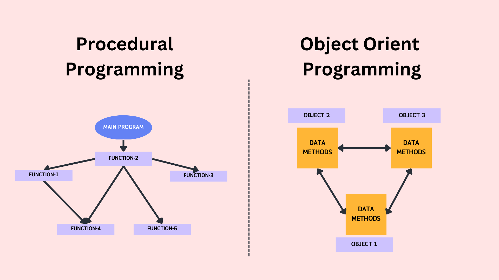
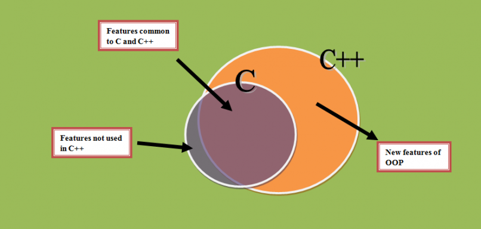
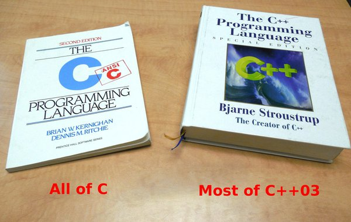
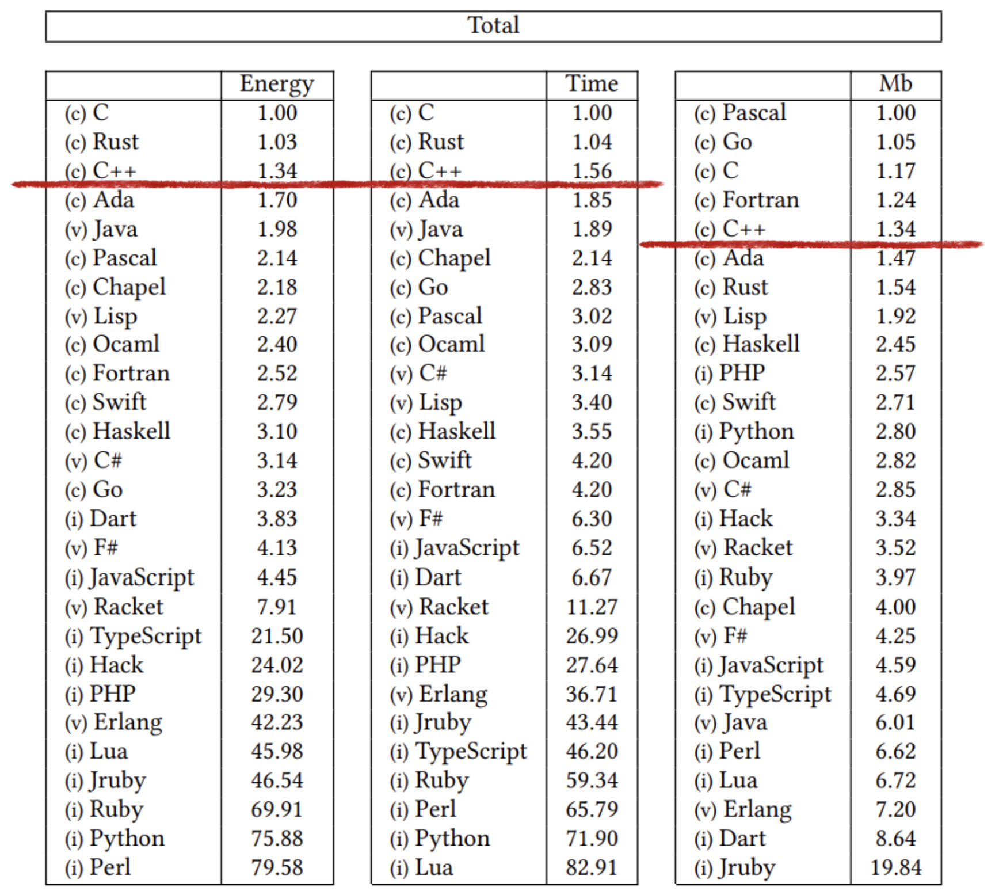
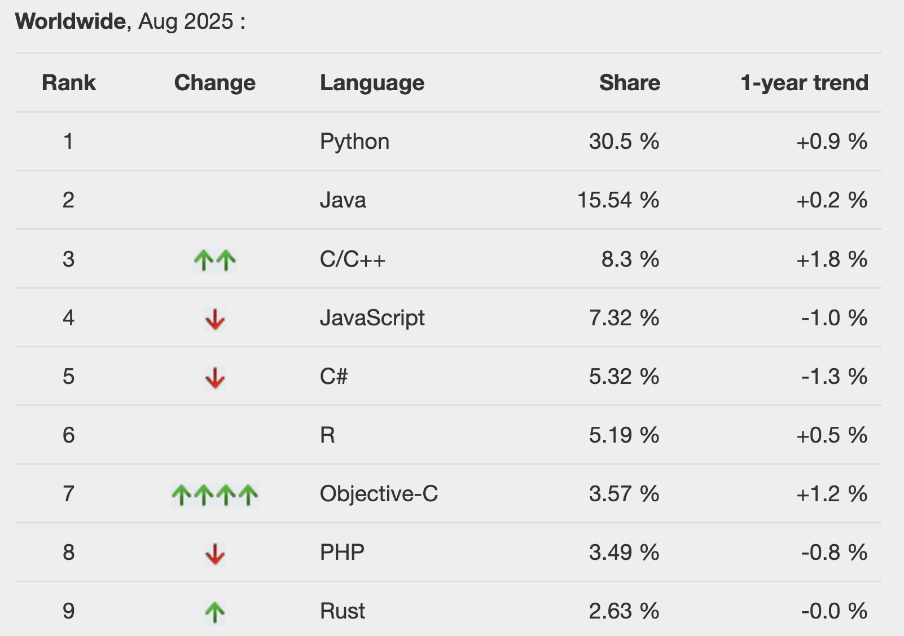
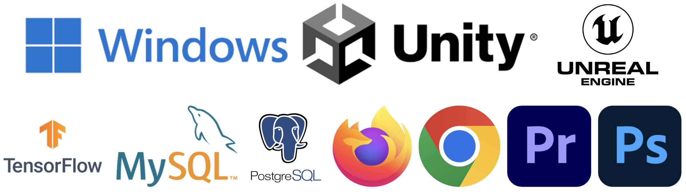
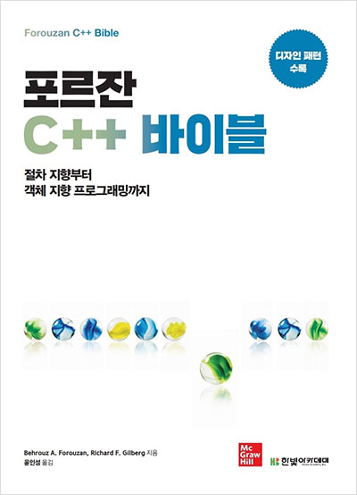
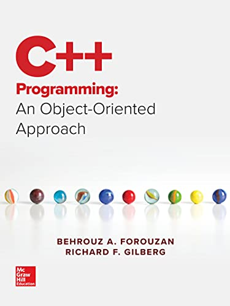
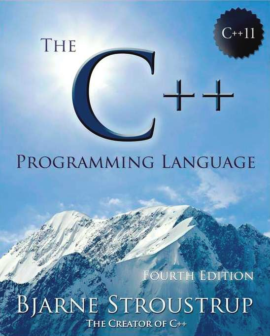

<!-- _class: lead -->
# 객체지향프로그래밍

## 오리엔테이션

### [munseong.jeong@daejin.ac.kr](mailto:munseong.jeong@daejin.ac.kr)

---

## 절차적 프로그래밍 vs 객체지향 프로그래밍

### Procedural Programming

- 함수(functions) 중심이며, 데이터(수동적 객체, passive objects)와 함수가 **분리**된 채 절차에 따라 프로그램 동작

[//]: # (INCLUDE: ./cpp/00/src/procedural_vs_oop.cc --from 2 --to 6 --no-comment)

### Object-Oriented Programming

- 객체(objects) 중심이며, 데이터(능동적 객체, active objects)와 함수가 **결합**된 객체들의 상호작용으로 프로그램 동작

[//]: # (INCLUDE: ./cpp/00/src/procedural_vs_oop.cc --from 10 --to 15 --no-comment)

---

## 절차적 프로그래밍 vs 객체지향 프로그래밍 (Cont'd)

- C는 절차적 프로그래밍 언어
- C++은 절차적·객체지향 프로그래밍을 모두 지원하는 다중 패러다임 언어

---

## 교과목 목표

### C++를 통한 객체지향 프로그래밍 패러다임 이해

  > Object-oriented programming (**OOP**) is a programming paradigm that organizes software design around **objects that combine state and behavior**, and employs techniques such as **data abstraction**, **encapsulation**, **messaging**, **modularity**, **polymorphism**, and **inheritance**.

- [Bjarne Stroustrup](https://www.stroustrup.com/) - "C with Classes"
  - C에서 확장된 언어(C++의 전신)

|  |  |
| ------------------------------- | ------------------------------- |

---

## C++의 강점

### C 문법과의 유사성을 바탕으로 객체지향 개념 학습

---

## C++의 강점 (Cont'd - 1)

### 고성능 및 고효율

---

## C++의 강점 (Cont'd - 2)

### 다중 패러다임 언어

- 절차적 프로그래밍, 객체지향 프로그래밍, 제네릭 프로그래밍(generic programming)
- **[높은 범용성](https://pypl.github.io/PYPL.html)**

---

## C++의 강점 (Cont'd - 3)

### [광범위한 활용 분야](https://www.stroustrup.com/applications.html)

---

## 교재

|  |  |  |
| ------------------------------------ | ------------------------------------ | ------------------------------------ |

### Main Textbook

- [Forouzan, B. A., & Gilberg, R. F. (2021). 포르잔 C++ 바이블(윤인성, Trans.). 한빛아카데미.](https://www.hanbit.co.kr/store/books/look.php?p_code=B1851418066)(원저: C++ Programming: An Object-Oriented Approach)

### Supplementary Textbook

- [Forouzan, B. A., & Gilberg, R. F. (2019). C++ programming: An object-oriented approach. McGraw-Hill Education.](https://www.amazon.com/Programming-Object-Oriented-Approach-Behrouz-Forouzan-ebook/dp/B07MVJTL2T)
- [Stroustrup, B. (2013). The C++ programming language (4th ed.). Addison-Wesley.](https://www.stroustrup.com/4th.html)

---

## 실습환경

- Visual Studio Code + Docker
  - 일관된 개발환경 제공
  - [C/C++ 실습환경 구축 안내](https://docs.google.com/document/d/1Y0WzkcZvEqpdyq3ftU6r96EAgTDSOkMHiTRezgyn9BE/edit?tab=t.0#heading=h.h4paq5txnttj)
- [C++14](https://en.cppreference.com/w/cpp/14)(2014년 표준)
  - 스마트 포인터, 제네릭, 이동 의미론 등 핵심 기능이 포함된 최소 표준

## 평가

| 구분 | 배점 | 비고 |
| :--: | :--: | :--: |
| 중간고사 | 30% | 필기시험(주관식/객관식) |
| 기말고사 | 30% | 필기시험(주관식/객관식) |
| 과제 | 30% | 레포트 1회, 프로그래밍 2회 |
| 출석 | 10% | 4분의 1 이상 결석 시 F |
| 합계 | 100% | |

- 지각 또는 결석 사유를 증빙할 공식 자료 제출 시 출결 정정 가능
