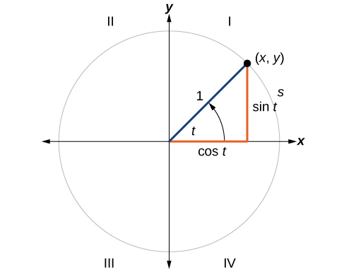

<!-- _class: lead -->
# 객체지향프로그래밍

## C++ 기초

### [munseong.jeong@daejin.ac.kr](mailto:munseong.jeong@daejin.ac.kr)

---

## Hello, World

### C

[//]: # (INCLUDE: ./c/01/01_1.c)

### C++

[//]: # (INCLUDE: ./cpp/01/hello_world.cc)

---

## C vs C++

### Coding Conventions

| Item | C (KNR style) | C++ ([Google C++ Style Guide](https://google.github.io/styleguide/cppguide.html)) |
| ---- | ------------- | ---------------------------- |
| Indentation         | 4 spaces      | 2 spaces |
| Function brace style| Opening brace on a new line | Opening brace on the same line as function signature |
| Function names      | `snake_case`  | `PascalCase` for **all functions** (free functions + methods) |
| Variable names      | `snake_case`  | `snake_case` (same as C) |
| Pointer style       | `int *ptr;`   | `int* ptr;` |
| Header files        | `<stdio.h>`   | `<iostream>`, `<string>` (no `.h` extension) |
| Comment style       | `/* block */` | `// line` (preferred), `/* block */` |
| `main()` args       | `int main(void)` | `int main()` recommended |
| Null pointer        | `NULL`        | `nullptr` recommended |

---

## C vs C++ (Cont'd - 1)

### Declaration Position

- C는 블록 시작 시점에만 선언 허용
- C++는 필요한 위치에서 선언 가능
  - 변수 선언과 변수 사용 위치가 가까워 코드 가독성 증가
  - 불필요한 객체 생애주기 감소

[//]: # (INCLUDE: ./cpp/01/dcl.cc)

---

## C vs C++ (Cont'd - 2)

### Boolean Type

- C는 0, 1과 같은 정수 값을 사용해 참과 거짓 표현
  - C99부터 `<stdbool.h>` 도입
- C++는 기본 자료형 `bool` 형 키워드 `true`, `false`를 사용해 참과 거짓 표현

[//]: # (INCLUDE: ./cpp/01/bool.cc)

---

## C vs C++ (Cont'd - 3)

### `struct` Keyword

- C는 선언 시 `struct` 키워드 필수
- C++는 선언 시 `struct` 키워드 생략 가능

[//]: # (INCLUDE: ./cpp/01/struct.cc)

---

## 이름 공간 (Namespace)

- 식별자 (identifier)의 소속 (scope)을 구분하기 위한 도구
- 식별자 중복으로 인한 컴파일 오류 예방 가능
- e.g., `std::cout`은 `cout` 객체가 `std`라는 이름 공간에 속해있음을 의미

### 예시

- 두 개의 다른 이름 공간 (`foo`, `bar`)을 사용해 `Qux()` 정의

[//]: # (INCLUDE: ./cpp/01/namespace.cc)

---

## 이름 공간 (Namespace) (Cont'd - 1)

### 범위 지정 연산자 (`::`, Scope Resolution Operator)

- 이름 공간에 감춰진 식별자를 지정해 사용할 수 있음

[//]: # (INCLUDE: ./cpp/01/header1.hpp)

[//]: # (INCLUDE: ./cpp/01/header2.hpp)

---

## 이름 공간 (Namespace) (Cont'd - 2)

### 범위 지정 연산자를 생략할 수 있는 경우

[//]: # (INCLUDE: ./cpp/01/sro1.cc)

- `Func()`의 `Foo()`는 `header1` 이름 공간에 속함
  - `Foo()`는 곧 `header1::Foo()`를 의미

---

## 이름 공간 (Namespace) (Cont'd - 3)

### 범위 지정 연산자를 생략할 수 없는 경우

[//]: # (INCLUDE: ./cpp/01/sro2.cc)

- `header1` 이름 공간 안에서는 `header2`의 식별자가 직접 보이지 않음
  - `header2::Foo()`, `header2::Bar()`는 감춰진 상태
- `::`를 사용하면 다른 이름 공간에 속한 식별자를 명시적으로 지정해 사용 가능

---

## 이름 공간 (Namespace) (Cont'd - 4)

### `using` 선언과 `using` 지시어

- `using` 선언 (using-declaration)은 특정 식별자만 선택적으로 지정하여 사용할 수 있도록 함

[//]: # (INCLUDE: ./cpp/01/using1.cc)

- `using` 지시어 (using-directive)는 해당 이름 공간의 모든 식별자를 지정하여 사용할 수 있도록 함

[//]: # (INCLUDE: ./cpp/01/using2.cc)

---

## 이름 공간 (Namespace) (Cont'd - 5)

### `using` 지시어 사용을 피해야 하는 이유

- `using` 지시어를 사용하면 **이름 공간을 사용하는 장점이 사라짐**
  - 식별자 충돌 가능성 증가

### 이름 없는 이름 공간 (Anonymous Namespace, Unnamed Namespace)

- C의 `static` 키워드와 같은 역할
  - 내부 연결성 (internal linkage) 부여
  - 동일 번역 단위 (translation unit)에서만 접근 가능

[//]: # (INCLUDE: ./cpp/01/anony_ns.cc)

---

## 이름 공간 (Namespace) (Cont'd - 6)

### 이름 없는 이름 공간을 사용한 헤더 파일

[//]: # (INCLUDE: ./cpp/01/anony_ns_error.hpp)

[//]: # (INCLUDE: ./cpp/01/anony_ns_foo.cc)

[//]: # (INCLUDE: ./cpp/01/anony_ns_bar.cc)

---

## 이름 공간 (Namespace) (Cont'd - 7)

### 문제가 발생하는 이유

- 이름 없는 이름 공간은 C의 `static`과 동일하며, 내부 연결성을 가짐
- 헤더 파일이 각 소스 파일에 포함될 때마다 독립적인 익명 이름 공간 생성
- `foo.cc`의 `Foo()`와 `bar.cc`에서 선언된 `Foo()`는 서로 다른 함수임
- 각 번역 단위는 자체적인 익명 이름 공간을 가지므로 다른 파일의 정의에 접근 불가

  ```text
  error: undefined reference to '(anonymous namespace)::Foo()'
  ```

> **Do not use unnamed namespaces in header files.**

---

## C++ 헤더 파일 명명 규칙

### C++ 표준 헤더

- C++의 표준 헤더는 `.h` 확장자를 사용하지 않음

[//]: # (INCLUDE: ./cpp/01/hello_world.cc --to 2 --no-comment)

### C++에서의 C 표준 헤더

- C 헤더를 C++에서 사용할 때는 접두사 `c`를 붙이고 `.h` 제거
- C++ 스타일 C 헤더의 모든 식별자는 std 이름 공간 사용
  - e.g., `#include <stdio.h>` 선언 시 `printf()`
  - e.g., `#include <cstdio>` 선언 시 `std::printf()`
- **C++ 스타일 헤더 사용 권장**
  - 이름 공간 관리가 용이하고 C++ 표준 라이브러리와의 일관성 유지

---

## C++ 헤더 파일 명명 규칙 (Cont'd)

### C++에서의 C 표준 헤더 사용 예제 - Trigonometric Functions



[//]: # (INCLUDE: ./cpp/01/trigonometric.cc)

---

## Input / Output

### 기본 데이터 입출력

[//]: # (INCLUDE: ./cpp/01/io1.cc)

---

## Input / Output (Cont'd - 1)

### C 문자열 입출력

[//]: # (INCLUDE: ./cpp/01/io2.cc)

---

## Input / Output (Cont'd - 2)

### 데이터 형식화 (Formatting Data)

- [조정자 (Manipulators)](https://en.cppreference.com/w/cpp/io/manip.html)를 사용해 입출력 형식 제어

### 임시 조정자 (Temporary Manipulators)

[//]: # (INCLUDE: ./cpp/01/temp_man.cc)

---

## Input / Output (Cont'd - 3)

### 지속 입력 조정자 (Persistent Input Manipulators)

[//]: # (INCLUDE: ./cpp/01/in_man.cc)

---

## Input / Output (Cont'd - 4)

### 지속 출력 조정자 (Persistent Output Manipulators)

[//]: # (INCLUDE: ./cpp/01/out_man.cc)

---

## Input / Output (Cont'd - 5)

### 출력 정렬 조정자

[//]: # (INCLUDE: ./cpp/01/sort_man.cc)

---

## Input / Output (Cont'd - 6)

### 조정자 활용 구구단 출력 프로그램

[//]: # (INCLUDE: ./cpp/01/mul.cc)

---

## 동적 할당 (Dynamic Memory Allocation)

### 단일 객체 동적 할당과 해제 - `new`, `delete`

[//]: # (INCLUDE: ./cpp/01/new1.cc)

---

## 동적 할당 (Dynamic Memory Allocation) (Cont'd - 2)

### 배열 객체 동적 할당과 해제 - `new[]`, `delete[]`

- 단일 객체 동적 생성은 `new`, 배열 객체 동적 생성은 `new[]` 사용
- 단일 객체 동적 해제는 `delete`, 배열 객체 동적 해제는 `delete[]` 사용

[//]: # (INCLUDE: ./cpp/01/new2.cc)

```text
// new int
[  int  ]

// new int[5]
[ size ][ int ][ int ][ int ][ int ][ int ]
    ^              array elements
  metadata (array size, allocation block size, etc.)
```

---

## 동적 할당 (Dynamic Memory Allocation) (Cont'd - 3)

### 1차원 배열 동적 할당

[//]: # (INCLUDE: ./cpp/01/new3.cc)

---

## 동적 할당 (Dynamic Memory Allocation) (Cont'd - 4)

### 2차원 배열 동적 할당

[//]: # (INCLUDE: ./cpp/01/new4.cc)

---

## 동적 할당 (Dynamic Memory Allocation) (Cont'd - 5)

### 개선된 2차원 배열 동적 할당

[//]: # (INCLUDE: ./cpp/01/new5.cc)

---

## 레퍼런스 (Reference)

- 기존 객체에 대한 별칭 (alias)을 만드는 메커니즘
- 레퍼런스는 선언 시 **반드시 객체에 연결 (binding)**되어야 함
- `&` 기호를 사용해 선언

[//]: # (INCLUDE: ./cpp/01/ref.cc)

- `ref`는 `a`와 동일한 역할 수행

---

## 레퍼런스 (Reference) (Cont'd - 1)

### 컴파일러의 레퍼런스를 처리 절차

[//]: # (INCLUDE: ./cpp/01/snippet_ref.cc --from 3 --to 5 --no-comment)

[//]: # (INCLUDE: ./cpp/01/snippet_ref.cc --from 9 --to 12 --no-comment)

[//]: # (INCLUDE: ./cpp/01/snippet_ref.cc --from 16 --to 18 --no-comment)

---

## 레퍼런스 (Reference) (Cont'd - 2)

### 레퍼런스 특징 1 - 레퍼런스는 반드시 대상이 있어야 함

[//]: # (INCLUDE: ./cpp/01/ref1.cc)

---

## 레퍼런스 (Reference) (Cont'd - 3)

### 레퍼런스 특징 2 - 레퍼런스는 변경할 수 없음

[//]: # (INCLUDE: ./cpp/01/ref2.cc)

---

## 레퍼런스 (Reference) (Cont'd - 4)

### 레퍼런스 특징 3 - 레퍼런스 자체는 별도의 메모리 공간을 가지지 않음

[//]: # (INCLUDE: ./cpp/01/ref3.cc)

---

## 레퍼런스 (Reference) (Cont'd - 5)

### C 함수 호출 방식 (Function Call Mechanism)

[//]: # (INCLUDE: ./cpp/01/function1.cc)

---

## 레퍼런스 (Reference) (Cont'd - 6)

### C++에 추가된 함수 호출 방식

[//]: # (INCLUDE: ./cpp/01/function2.cc)

---

## 레퍼런스 (Reference) (Cont'd - 7)

### 레퍼런스와 상수 레퍼런스

- 레퍼런스는 *lvalue*만 참조 가능
  - e.g., `int& ref = i;`
- 레퍼런스는 *rvalue* 참조 시 오류 발생
  - e.g., `int& ref = 100;`

  ```text
  error: cannot bind non-const lvalue reference of type ‘int&’ to an rvalue of
  type ‘int’
  ```

- 상수 레퍼런스는 *rvalue*, *lvalue* 둘 다 참조 가능
  - e.g., `const int& ref = 100;`
  - `100`은 메모리에 실체화되지 않는 정수 리터럴
  - 상수 레퍼런스의 대상은 상수 레퍼런스의 생애주기 동안 메모리에 **임시 객체**로 유지됨
  - 상수 레퍼런스 소멸 시 상수 레퍼런스가 참조한 임시 객체도 동시에 소멸됨

---

## 레퍼런스 (Reference) (Cont'd - 8)

### C++ Standard (ISO/IEC 14882)

  > There shall be no references to references, no arrays of references, and no pointers to references.

[//]: # (INCLUDE: ./cpp/01/snippet_ref.cc --from 25 --to 29 --no-comment)

[//]: # (INCLUDE: ./cpp/01/snippet_ref.cc --from 31 --to 33 --no-comment)

[//]: # (INCLUDE: ./cpp/01/snippet_ref.cc --from 35 --to 39 --no-comment)

---

## 레퍼런스 (Reference) (Cont'd - 9)

### 배열 레퍼런스 (References To Arrays)

- 이미 실체화된 배열을 가리키는 레퍼런스
- **레퍼런스 지시자와 배열 이름을 괄호로 함께 묶어주어야 함**
  - 레퍼런스 선언자 (`&`, reference declaration)은 배열 크기 지시자 (`[]`, array size specifier)보다 우선순위가 낮음

[//]: # (INCLUDE: ./cpp/01/ref_arr.cc)

---

## 레퍼런스 (Reference) (Cont'd - 10)

### Dangling Reference

- 레퍼런스가 유효하지 않은 메모리 주소를 대상으로 하는 경우 발생
- 대표적인 경우는 함수 지역 객체를 레퍼런스로 반환하는 경우

[//]: # (INCLUDE: ./cpp/01/dangling.cc)

---

## 레퍼런스 (Reference) (Cont'd - 11)

### Dangling Reference 예방법

- 레퍼런스 반환 시 함수가 종료되어도 소멸되지 않는 객체를 반환하도록 수정

[//]: # (INCLUDE: ./cpp/01/snippet_ref.cc --from 43 --to 43 --no-comment)

- 레퍼런스 반환 시 정적 또는 전역 객체를 반환하도록 수정

[//]: # (INCLUDE: ./cpp/01/snippet_ref.cc --from 46 --to 49 --no-comment)
