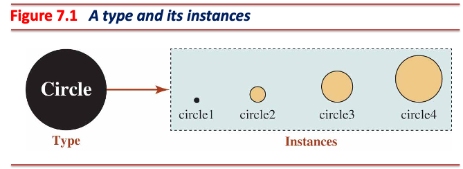
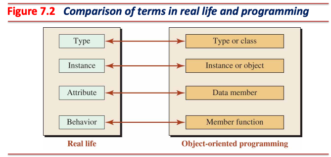
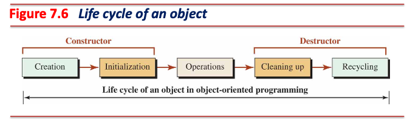
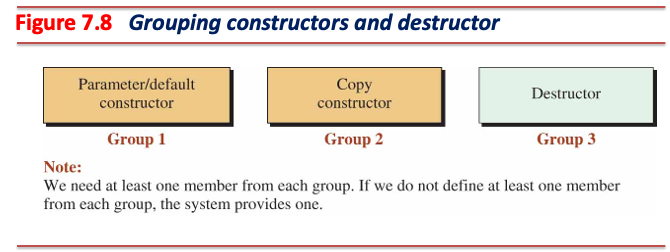
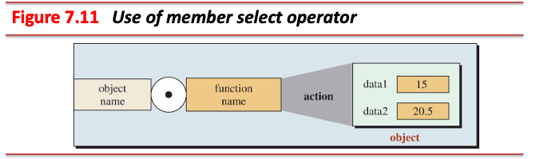

<!-- _class: lead -->
# 객체지향프로그래밍

## 클래스와 생성자

### [munseong.jeong@daejin.ac.kr](mailto:munseong.jeong@daejin.ac.kr)

---

## 자료형과 인스턴스

- 자료형 (type)을 이용한 인스턴스 (instance, `class`로부터 생성된 객체) 생성
- 자료형: 추상화된 것, 인스턴스: 자료형을 실체화한 것
  - e.g., **개**: 동물 분류 **자료형**, **내 반려견**: 실체이므로 **인스턴스**
- 하나의 자료형으로부터 여러 개의 객체 생성 가능한 일대다 (one-to-many) 관계



---

## 추상화 (Abstraction)

- 현실 세계 객체를 최대한 유사하게 프로그래밍 세계에 표현
- 추상화를 통한 객체의 속성 (attribute)과 행위 (behavior) 추출
  - **내 반려견**의 속성: **품종**, **나이**, **체중**
  - **내 반려견**의 행위: **짖기**, **뛰기**, **먹기**


---

## 클래스 (Class)

- 현실 세계 객체를 추상화한 속성과 행위를 프로그래밍 언어로 표현
- C++에서 제공하는 **사용자 정의 자료형**
  - 일반 자료형으로부터 실체화한 객체: 변수
  - **클래스 자료형으로부터 실체화한 객체: 인스턴스**
- 속성: 데이터 멤버 (data members)로 표현
- 행위: 멤버 함수 (member functions)로 표현



---

## 클래스 정의

- 헤더 (header), 본문 (body), 세미콜론 (`;`) 세 부분 구분
- 헤더: `class CLASS_NAME` 형태, 클래스 자료형 선언 시 사용

[//]: # (INCLUDE: ./cpp/02/cls_circle.hpp --from 4 --to 5 --no-comment)

- 클래스 정의 시 클래스 헤더 뒤 본문 (block)에 데이터 멤버와 멤버 함수 작성
- 세미콜론: 클래스 정의를 마치는 구분자 (delimiter)

[//]: # (INCLUDE: ./cpp/02/cls_circle.hpp --from 7 --to 16 --no-comment)

---

## 접근 지정자 (Access Specifiers)


- 접근 지정자 (access modifiers)라고도 불림
- 데이터 멤버와 멤버 함수에 대한 접근 권한 설정
  - 클래스의 기본 멤버 접근 지정자: `private`
  - `private` 접근 지정자 멤버: 인스턴스 내부에서만 접근 가능

| Modifier   |Access from the same class|Access from the subclass|Access from anywhere|
|------------|--------------------------|------------------------|--------------------|
|`private`   | Yes                      | **No**                 | **No**             |
|`protected` | Yes                      | Yes                    | **No**             |
|`public`    | Yes                      | Yes                    | Yes                |

---

## 멤버 함수 (Method) 정의

- 클래스 정의 시 멤버 함수를 같이 정의

[//]: # (INCLUDE: ./cpp/02/cls_circle_impl.cc --from 1 --to 8 --no-comment)

- `::` 연산자를 사용해 클래스 외부에서 정의
  - **클래스 내 선언된 멤버 함수와 멤버 변수: 해당 클래스의 이름영역 안에 속함**

[//]: # (INCLUDE: ./cpp/02/cls_circle.cc --from 3 --to 3 --no-comment)

---

## 클래스와 인스턴스 사용 예제

- 객체가 사용할 수 있는 멤버: `public` 접근 지정자가 사용된 식별자 `set_radius`, `get_radius`
- 멤버 사용: 멤버 선택 연산자 (`.`, member selection operator) 사용 (e.g., `circle.get_radius()`)
- 객체: `private` 멤버에 직접 접근 불가하나 멤버 함수를 통한 간접 접근 가능

[//]: # (INCLUDE: ./cpp/02/cls_example.cc)

---

## [접근자 (Accessor)와 변경자 (Mutator)](https://google.github.io/styleguide/cppguide.html#Function_Names)

> Accessors and mutators (get and set functions) may be named **like variables**.

### 접근자 멤버 함수 (Accessor, Getter)

- 호스트 객체 (host object)의 데이터 멤버 값을 읽어오는 멤버 함수
- `const` 한정자를 사용한 멤버 함수의 데이터 멤버 변경 방지 명시
  - `const` 한정자를 사용하는 멤버 함수 내에서 데이터 멤버 수정 시 컴파일 에러 발생

[//]: # (INCLUDE: ./cpp/02/cls_example.cc --from 11 --to 11 --no-comment)

### 변경자 멤버 함수 (Mutator, Setter)

- 호스트 객체의 데이터 멤버 값을 수정하는 멤버 함수
  - 데이터 멤버 외에 다른 부작용 (side effects) 발생 금지

[//]: # (INCLUDE: ./cpp/02/cls_example.cc --from 12 --to 12 --no-comment)

---

## [인라인 (`inline`)](https://en.cppreference.com/w/cpp/language/inline)

- 함수 또는 메서드를 직접 호출하는 대신 해당 코드를 호출 지점에 복사
- 함수 호출 오버헤드 절감을 통한 성능 향상

[//]: # (INCLUDE: ./cpp/02/inline1.cc)

[//]: # (INCLUDE: ./cpp/02/inline2.cc)

- 명시적 (explicit) 인라인 함수는 **반드시 인라인화되지 않음**
  - `inline` 키워드: 함수의 인라인화를 **제안**하는 것이며, 컴파일러가 인라인화를 무시할 수 있음
- 컴파일러: 코드 복잡도, 최적화, 성능 등을 고려한 함수의 인라인화 결정 (e.g., 짧고 간결하며 빈번히 호출되는 함수)

---

## 암묵적 (Implicit) 인라인 함수

- 클래스 내부에 정의된 모든 멤버 함수: **암묵적인** 인라인 함수

[//]: # (INCLUDE: ./cpp/02/cls_circle_impl.cc --from 1 --to 8 --no-comment)

- 컴파일 전 클래스 멤버 함수는 앞에 `inline` 키워드가 자동 붙음

[//]: # (INCLUDE: ./cpp/02/cls_circle_impl.cc --from 16 --to 17 --no-comment)

---

## [구조체 vs 클래스](https://google.github.io/styleguide/cppguide.html#Structs_vs._Classes)

[//]: # (INCLUDE: ./cpp/02/cls_person.cc)

- 위 코드를 구조체로 변경하면 아래와 같음

[//]: # (INCLUDE: ./cpp/02/struct_person.cc)

---

## [구조체 vs 클래스](https://google.github.io/styleguide/cppguide.html#Structs_vs._Classes) (Cont'd)

> Use a struct only for passive objects that carry data; everything else is a class.

- 클래스 내 기본 접근 지정자: `private`, 구조체 내 기본 접근 지정자: `public`
- **행위 없이** (passive) 데이터만을 표현하는 사용자 정의 자료형 생성 시 구조체 사용
- 행위가 포함되면서 데이터를 같이 표현하는 사용자 정의 자료형 생성 시 클래스 사용
  - **C++ 구조체: 멤버 함수를 선언 및 정의해 사용할 수 있으나, 사용을 권장하지 않음**

---

## 함수 오버로딩 (Function Overloading)

- 함수의 이름이 같더라도 **함수 매개변수의 형태가 다르면** 서로 다른 함수로 간주해 이름이 같은 함수 여러 개 사용 가능

[//]: # (INCLUDE: ./cpp/02/overloading.cc)

---

## 함수 오버로딩 (Function Overloading) (Cont'd - 1)

- 함수 이름이 같고 **함수 매개변수의 형태도 같으므로** 이름 충돌 발생 (컴파일 오류)

```cpp
int GetRadius() { return 10; }
double GetRadius() { return 20.0; }
```

### [함수 오버로딩 해석 (Function Overload Resolution)](https://en.cppreference.com/w/cpp/language/overload_resolution)

- 전달인자의 형태와 함수 매개변수의 형태가 서로 일치하지 않으면, 아래 순서에 따른 매개변수 형태 변환 시도하여 가장 적합한 함수를 찾아 호출
  - **변환 과정을 통해 후보 함수가 2개 이상 발견될 경우 모호성 문제가 발생하여 컴파일 오류 발생**

#### [Ranking of Implicit Conversion Sequences](https://en.cppreference.com/w/cpp/language/overload_resolution#Ranking_of_implicit_conversion_sequences)

1. Exact match (no conversion required)
2. Promotion: integer promotion (e.g., `bool`, `char`, `short` → `int`), floating-point promotion (e.g., `float` → `double`)
3. Conversion: integral conversion, floating-point conversion, floating-integral conversion, ...

---

## 함수 오버로딩 (Function Overloading) (Cont'd - 2)

- 함수 오버로딩을 올바르게 사용한 경우

[//]: # (INCLUDE: ./cpp/02/overloading_example.cc)

---

## 함수 오버로딩 (Function Overloading) (Cont'd - 3)

- 함수 오버로딩 해석 중 모호성 문제가 발생하는 경우

[//]: # (INCLUDE: ./cpp/02/overloading_example_fail.cc --from 2 --to 15 --no-comment)

```shell
error C2668: 'Print': ambiguous call to overloaded function
message : could be 'void Print(double)'
message : or       'void Print(int)'
message : while trying to match the argument list '(long)'
```

---

## 생성자 (Constructor)와 소멸자 (Destructor)



- 생성자: 객체 생성 시 자동 호출되는 특별한 멤버 함수
- 소멸자: 객체 소멸 시 자동 호출되는 특별한 멤버 함수

---

## 생성자

> A constructor is a member function that creates an object when it is called and can initialize the data members of an object when it is executed.

- 생성자 선언 시 반환형을 사용하지 않음 (반환값이 없는 메서드)
- 함수 이름: 클래스 이름과 같음
- `const` 한정자 사용 불가 (데이터 멤버 생성 과정에서 부작용 발생)

### 생성자 종류

[//]: # (INCLUDE: ./cpp/02/cls_circle_proto.hpp --from 5 --to 10 --no-comment)

- 기본 생성자와 복사 생성자는 오버로딩 불가하나, 매개변수 생성자는 필요에 따라 오버로딩하여 여러 개 사용 가능

---

## 생성자 (Cont'd - 1)

### 초기화 목록 (Initialization List)

- 생성자 호출 시 데이터 멤버의 초기화 값 지정 가능

[//]: # (INCLUDE: ./cpp/02/cls_circle_proto.hpp --from 14 --to 22 --no-comment)

- 초기화 목록에 선언된 데이터 멤버: 초기화 값으로 직접 초기화됨
  - `radius_(radius)` 부분: `double radius_ = radius`로 평가됨
- 초기화 목록에 선언되지 않은 데이터 멤버: 생성자 본문에서 명시적으로 초기화해야 함
  - 초기화하지 않은 기본 자료형 멤버는 쓰레기 값을, 클래스 자료형 멤버는 생성자 호출을 통해 초기화함
- **`const` 데이터 멤버 초기화: 반드시 초기화 목록을 사용해야 함**

---

## 생성자 (Cont'd - 2)

### 초기화 목록 vs 생성자 본문의 성능 차이

[//]: # (INCLUDE: ./cpp/02/cmp_ctor_performance.cc --from 16 --to 31 --no-comment)

- 클래스 자료형 데이터 멤버의 경우 **성능 차이**가 명확함

---

## 소멸자

> A destructor is guaranteed to be automatically called and executed by the system when the object instantiated from the class goes out of scope.

- 소멸자 선언 시 반환형을 사용하지 않음 (반환값이 없는 메서드)
- 함수 이름: 클래스 이름과 같으나, 함수 이름 앞에 `~` 기호 사용
- `const` 한정자를 사용 불가 (데이터 멤버 소멸 과정에서 부작용 발생)

### 소멸자 종류

[//]: # (INCLUDE: ./cpp/02/cls_circle_proto.hpp --from 26 --to 33 --no-comment)

- 생성자와 다르게 소멸자는 유일하며, 오버로딩 불가

---

## 클래스 필수 멤버 함수



- 클래스는 기본 생성자나 매개변수 생성자 중 적어도 하나 정의해야 함
  - 미정의 시 본문이 비어있는 자동 생성 기본 생성자 (synthesized default constructor) 생성

- 클래스는 복사 생성자를 정의해야 함
  - 미정의 시 객체의 데이터 멤버를 단순 복사하는 자동 생성 복사 생성자 (synthesized copy constructor) 생성

- 클래스는 소멸자를 정의해야 함
  - 미정의 시 본문이 비어있는 자동 생성 소멸자 (synthesized destructor) 생성

---

## 클래스 필수 멤버 함수 (Cont'd - 1)

### 생성자와 소멸자를 사용하는 인스턴스

[//]: # (INCLUDE: ./cpp/02/cls_necessary_methods.cc --to 20)

---

## 클래스 필수 멤버 함수 (Cont'd - 2)

[//]: # (INCLUDE: ./cpp/02/cls_necessary_methods.cc --from 22)

- `default`: 컴파일러가 생성하는 자동 멤버 함수 사용
- `delete`: 특정 메서드를 클래스 내에서 제거해야 할 경우 사용

---

## 클래스 필수 멤버 함수 (Cont'd - 3)

### 인스턴스 동적 할당

[//]: # (INCLUDE: ./cpp/02/cls_necessary_methods_dynamic.cc --to 20)

---

## 클래스 필수 멤버 함수 (Cont'd - 4)

[//]: # (INCLUDE: ./cpp/02/cls_necessary_methods_dynamic.cc --from 22)

- **C 스타일**: 동적 할당 시 생성자가 호출되지 않고, 동적 해제 시 소멸자가 호출되지 않음
- **C++ 스타일**: 동적 할당 시 생성자가 호출되며, 동적 해제 시 소멸자가 호출됨

---

## 인스턴스 데이터 멤버 (Instance Data Members)

- 객체의 속성을 표현


- 객체들 간 데이터 멤버: 독립적임
  - 서로 다른 메모리 영역에 할당
- 데이터 멤버: **캡슐화 (encapsulation)**되어야 함
  - [OOP 원칙 (Principles of Object-Oriented Programming)](https://en.wikipedia.org/wiki/Object-oriented_programming)
  - **항상 `private`으로 지정해야 함**

---

## 인스턴스 멤버 함수 (Instance Member Functions)

- 객체의 행위를 표현


- 멤버 함수: 하나의 메모리 공간에 위치 ([Code segment](https://en.wikipedia.org/wiki/Code_segment))
- 여러 접근 지정자를 사용할 수 있음
  - 객체: 오직 `public` 멤버 함수를 통해서만 데이터 멤버를 조회 및 조작해야 함
  - 정의된 멤버 함수만을 사용하여 `private` 데이터 멤버로의 잘못된 접근 및 연산 억제 목적

---

## 인스턴스 멤버 함수 선택자



- 객체로부터 멤버 함수를 선택할 경우 `.` 연산자 사용
- 객체를 가리키는 포인터로부터 멤버 함수를 선택할 경우 `->` 연산자 사용
- 두 연산자의 결합 방향: 왼쪽에서 오른쪽 (→)

---

## `this` 포인터

- **모든 멤버 함수에는 컴파일러에 의해 자동으로 `this` 포인터가 암묵적으로 추가됨**
- `this` 포인터는 멤버 함수를 호출한 객체 (호스트 객체)의 주소를 가리킴
- 멤버 함수 내부에서는 `this`를 통해 해당 객체의 멤버 변수와 멤버 함수에 접근 가능

[//]: # (INCLUDE: ./cpp/02/this.cc --from 27 --to 27 --no-comment)

[//]: # (INCLUDE: ./cpp/02/this.cc --from 30 --to 31 --no-comment)

- 모든 멤버 함수는 컴파일 단계에서 아래와 같이 `this` 포인터 매개변수가  추가됨:

[//]: # (INCLUDE: ./cpp/02/this.cc --from 35 --to 35 --no-comment)

[//]: # (INCLUDE: ./cpp/02/this.cc --from 38 --to 40 --no-comment)

---

## 분할 컴파일 (Separate Compilation)

- 클래스 정의: 헤더 파일 (선언부, interface)에 작성
  - 클래스 멤버 함수: 선언형태
  - 간단한 수준의 멤버 함수: 선언이 아닌 정의를 하기도 함 (e.g., 변경자, 접근자)
- 클래스 멤버 함수의 정의: 소스코드 파일 (구현부, implementation)에 작성


---

## 분할 컴파일 과정


---

## 분할 컴파일 과정 (Cont'd)

```text
.
├── main.cc
├── rectangle.cc
└── rectangle.hpp
```

```shell
g++ -c rectangle.cpp                  # get a rectangle.o
g++ -c main.cpp                       # get an main.o
g++ -o application rectangle.o main.o # get an mainlication
```

```shell
# The above processes can be simply used with one command as shown below.
g++ -o application rectangle.cpp main.cpp
```

```shell
# If there are too many files to list in the compiler:
g++ -o application *.cpp
```

- 분할 컴파일 시 반드시 헤더 가드 (header guard) 필요

---

## 헤더 가드

- 헤더 파일이 여러 번 포함되는 것을 방지하기 위해 사용하는 전처리기 지시문

### C 스타일 헤더 가드

[//]: # (INCLUDE: ./cpp/02/cstyle.h)

### C++ 스타일 헤더 가드

[//]: # (INCLUDE: ./cpp/02/cppstyle.hpp)

- **비표준**이므로 일부 환경에서는 지원되지 않을 수 있음
- **모던 C++을 지원하는 대부분의 컴파일러에서 해당 기능을 사용할 수 있음**
  - 오늘날 C++은 대부분 모던 C++(즉, `-std=c++11` 이후) 사용

---

## 분할 컴파일과 SDK 배포 예시

- SDK 배포 시, **인터페이스는 헤더 파일**에, **구현은 라이브러리** 파일로 제공
  - 라이브러리: 여러 개의 목적 파일(`.o`)을 묶은 파일 (`.a`, `.so` 등)

### 예시 시나리오

- 회사 A: 독자적 알고리즘을 가진 `Foo` 클래스를 개발
- 회사 B: `Foo` 클래스를 사용해야 하지만, 구현 세부사항은 알 필요 없음

### 보안 및 배포 방식

- 클래스 선언은 **헤더 파일에**, 멤버 함수 구현은 **소스 파일에** 작성
- 소스 파일을 컴파일하여 **라이브러리 파일**로 변환 후 제공
- 라이브러리 파일은 **역컴파일이 불가능**하므로, 알고리즘 보호 가능
- 회사 B는 헤더와 라이브러리만으로 `Foo` 클래스를 사용할 수 있음

---

## 분할 컴파일 실습

- `rectangle.hpp`

[//]: # (INCLUDE: ./cpp/02/rectangle/rectangle.hpp)

---

## 분할 컴파일 실습 (Cont'd - 1)

- `rectangle.cc`

[//]: # (INCLUDE: ./cpp/02/rectangle/rectangle.cc)

---

## 분할 컴파일 실습 (Cont'd - 2)

- `main.cc`

[//]: # (INCLUDE: ./cpp/02/rectangle/main.cc)

---

## 정적 멤버 (Static Members)


- 인스턴스 멤버 (데이터 멤버, 멤버 함수): **인스턴스 영역 (instance territory)에 속함**
- 정적 멤버 (정적 데이터 멤버, 정적 멤버 함수) **정적 영역 (static territory)에 속함**
- 클래스는 인스턴스 멤버와 정적 멤버를 가질 수 있음

---

## 정적 데이터 멤버 (Static Data Members)

- **모든 인스턴스가 공유할 수 있는 데이터 멤버**
- `.bss` 또는 `.data` 영역에 할당되며, **생성자로 초기화 불가**
- `static` 키워드를 사용한 클래스 내에 선언 (declaration)
- 선언된 `static` 객체들: 범위 지정 연산자를 사용해 전역 공간에서 명시적 정의 필요
  - 클래스 정적 멤버는 선언만 된 상태이며, 전역 공간에 클래스 정적 멤버를 정의해야 실체화 (instantiation)가 됨

[//]: # (INCLUDE: ./cpp/02/static.cc --from 1 --to 8  --no-comment)

---

## 정적 멤버 함수 (Static Member Functions)

- `static` 키워드를 사용한 클래스 내부에 선언 혹은 정의
  - 선언 시 멤버 함수와 마찬가지로 클래스 외부에서 범위 지정 연산자를 사용하여 정의

[//]: # (INCLUDE: ./cpp/02/static.cc --from 11 --to 17 --no-comment)

---

## 정적 멤버 함수 호출

- 정적 멤버 함수: 두 가지 형태로 호출 가능

[//]: # (INCLUDE: ./cpp/02/static.cc --from 22 --to 22 --no-comment)

[//]: # (INCLUDE: ./cpp/02/static.cc --from 26 --to 27 --no-comment)

### 정적 멤버 함수 사용 시 주의사항

- 정적 멤버 함수: **`this` 포인터가 없음**
  - 정적 멤버 함수: 인스턴스 데이터 멤버 접근 불가
  - 인스턴스 멤버 함수: 정적 데이터 멤버로 접근 가능
    - 정적 데이터 멤버: 프로그램 실행 시 메모리에 할당됨
    - **인스턴스를 사용할 시점에는 정적 데이터 멤버: 항상 준비되어 있음**
- 인스턴스 데이터 멤버 접근 시 인스턴스 멤버 함수 사용 권장
- 정적 데이터 멤버 접근 시 정적 멤버 함수 사용 권장

---

## 정적 멤버가 추가된 클래스 예제

- `rectangle.hpp`

[//]: # (INCLUDE: ./cpp/02/rectangle_static/rectangle.hpp)

---

## 정적 멤버가 추가된 클래스 예제 (Cont'd - 1)

- `rectangle.cc`

[//]: # (INCLUDE: ./cpp/02/rectangle_static/rectangle.cc --to 19)

---

## 정적 멤버가 추가된 클래스 예제 (Cont'd - 2)

[//]: # (INCLUDE: ./cpp/02/rectangle_static/rectangle.cc --from 21)

---

## 정적 멤버가 추가된 클래스 예제 (Cont'd - 3)

- `main.cc`

[//]: # (INCLUDE: ./cpp/02/rectangle_static/main.cc)
