<!-- _class: lead -->
# 객체지향프로그래밍

## 참조와 포인터

### [munseong.jeong@daejin.ac.kr](mailto:munseong.jeong@daejin.ac.kr)

---

## 레퍼런스

- 이미 존재하는 객체에 새로운 별명 부여

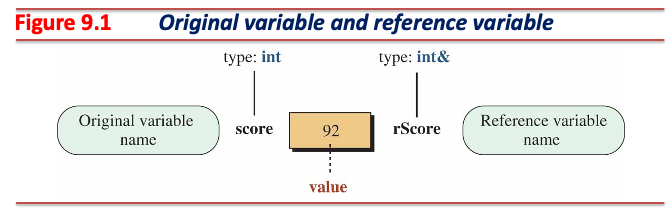

[//]: # (INCLUDE: ./cpp/03/snippet_ref.cc --from 2 --to 3 --no-comment)

- 레퍼런스는 복합 자료형 (compound type)
  - `score` 자료형은 `int`
  - `r_score` 자료형은 `int&`
- `T`가 자료형일 때, `T&`는 `T` 자료형 객체만 레퍼런스 가능

---

## 레퍼런스 (Cont'd - 1)

- 레퍼런스 대상은 상수 관계 (constant relation)

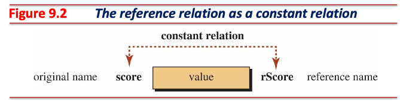

[//]: # (INCLUDE: ./cpp/03/snippet_ref.cc --from 7 --to 10 --no-comment)

---

## 레퍼런스 (Cont'd - 2)

- 한 객체에 여러 개의 레퍼런스 지정 가능 (참조 다중성, multiplicity)

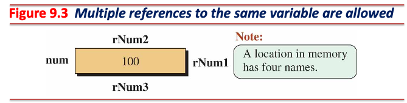

- 반대로 한 레퍼런스는 반드시 하나의 대상만 참조 가능
  - 레퍼런스 선언에 사용된 대상과 상수 관계 형성

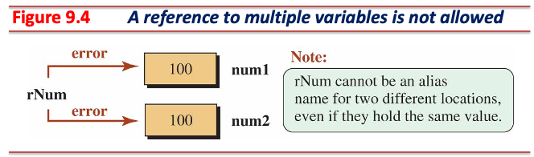

---

## 레퍼런스 (Cont'd - 3)

- 일반 레퍼런스는 *lvalue* 레퍼런스
  - *rvalue* 레퍼런스 불가

[//]: # (INCLUDE: ./cpp/03/snippet_ref.cc --from 15 --to 15 --no-comment)

- *rvalue* 레퍼런스는 `const` 한정자 필요
  - `const T&` 형태는 *lvalue*, *rvalue* 둘 다 레퍼런스 가능

[//]: # (INCLUDE: ./cpp/03/snippet_ref.cc --from 21 --to 23 --no-comment)

---

## 레퍼런스 (Cont'd - 4)

### 레퍼런스에서의 `const` 한정자 적용법

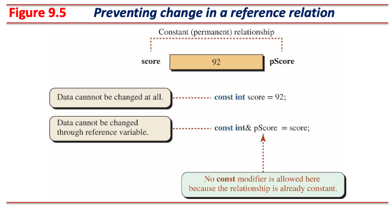

---

## 레퍼런스 (Cont'd - 5)

|Case|Data Variable          |Reference Variable         |Status|
|----|-----------------------|---------------------------|------|
|1   |`int name = 100;`      |`int& r_name = name;`      |Ok    |
|2   |`const int name = 100;`|`int& r_name = name;`      |Error |
|3   |`int name = 100;`      |`const int& r_name = name;`|Ok    |
|4   |`const int name = 100;`|`const int& r_name = name;`|Ok    |

- `Case 2`: 오류
  - 레퍼런스는 상수성이 없어 수정 가능한 상태이지만, 레퍼런스의 대상은 읽기 전용임 (논리적 모순, 컴파일 오류)

---

## Call By Reference

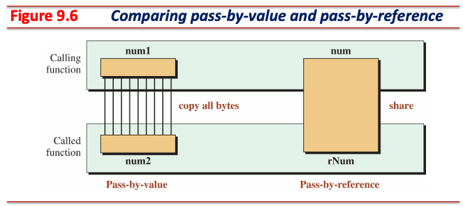

- 매개변수 작성 요령

> 1. 매개변수가 함수 내에서 읽기 전용으로 사용된다면 `const T&` 형태를 사용한다.
>    (`T`가 기본 자료형일 경우 `const T`도 허용)
> 2. 매개변수가 함수 내에서 수정될 수 있다면 `T*` 형태를 사용한다.
> 3. 함수 매개변수가 레퍼런스라면 **`const` 한정자 없는 레퍼런스는 되도록 사용하지 않는다.**

---

## Return By Reference

- 레퍼런스 반환 대상은 함수가 종료되어도 유효해야 함
- Dangling reference가 발생하지 않도록 주의

[//]: # (INCLUDE: ./cpp/03/ret_by_ref.cc)

---

## 포인터

- 객체 주소를 저장하는 변수

### 레퍼런스와 포인터의 비교

- 레퍼런스 특징
  - 반드시 선언 시 초기화자 (initializer) **필수**
  - 한 번 초기화되면 다른 객체를 참조할 수 없음 (상수 관계)
  - 레퍼런스는 항상 유효한 객체 참조

- 포인터 특징
  - 선언 시 초기화자 (initializer) 선택
  - 포인터는 여러 객체를 가리킬 수 있음
  - 포인터는 유효하지 않은 메모리를 가리킬 수 있음

---

## 포인터 (Cont'd - 1)

### 메모리의 주소

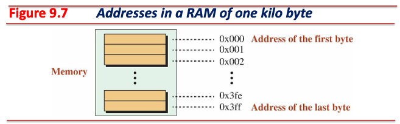

- 컴퓨터 메모리는 바이트의 연속
  - 컴퓨터의 메모리 (RAM) 용량이 1 KB라면, 메모리는 $2^{10}$ 바이트로 구성됨
- 메모리 각 바이트는 주소가 있음
- 주소는 일반적으로 16진수로 표현

---

## 포인터 (Cont'd - 2)

### 객체의 주소

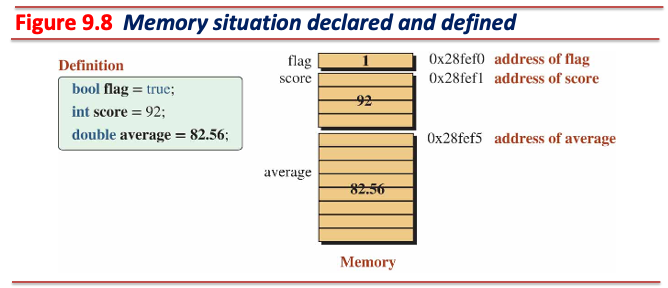

- 프로그램에서 실체화되는 각 객체들은 자료형에 따라 필요한 만큼의 바이트를 차지
  - e.g., `char` 형 객체는 1 바이트, `int` 형 객체는 일반적으로 4 바이트
- $n$ 바이트 객체는 $n$개의 바이트 중 첫 바이트의 주소를 객체의 주소로 사용
- $n$개의 바이트 중 가장 낮은 메모리 주소

---

## 포인터 (Cont'd - 3)

### 포인터 형과 포인터 변수

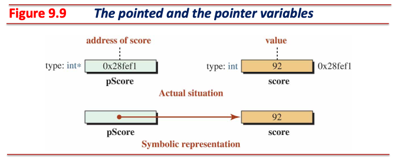

---

## 포인터 (Cont'd - 4)

### 포인터 특징

- 포인터 변수는 리터럴을 가리킬 수 없음
  - 리터럴은 컴파일 시 계산되어 사용되는 값
  - **메모리를 사용하지 않음**

[//]: # (INCLUDE: ./cpp/03/snippet_ptr.cc --from 3 --to 4 --no-comment)

- C++는 타입 안전 (type safety) 언어
  - C++ 포인터 변수는 **다른 자료형 객체를 가리킬 수 없음**
  - C 포인터 변수는 다른 자료형 객체를 가리킬 수 있음

[//]: # (INCLUDE: ./cpp/03/snippet_ptr.cc --from 11 --to 14 --no-comment)

---

## 포인터 (Cont'd - 5)

### 포인터 단항 연산자

- 주소 연산자 (`&`, address-of)
  - 객체의 주소 반환, 결합 방향은 오른쪽에서 왼쪽 (←)
- 역참조 연산자 (`*`, indirection)
  - 포인터 변수가 가리키는 주소의 객체 참조, 결합 방향은 오른쪽에서 왼쪽 (←)

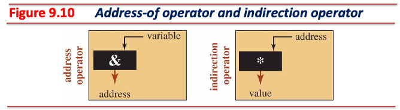

[//]: # (INCLUDE: ./cpp/03/snippet_ptr.cc --from 20 --to 22 --no-comment)

---

## 포인터 (Cont'd - 6)

### 문맥에 따른 `&` (Ampersand) 기호와 `*` (Asterisk) 기호의 쓰임

|Symbol|Type Definition|Unary Operator|Binary Operator|
|------|---------------|--------------|---------------|
|`&`   | `T&`          | `&var`       | `var1 & var2` |
|`*`   | `T*`          | `*var`       | `var1 * var2` |

[//]: # (INCLUDE: ./cpp/03/ptr1.cc)

---

## 포인터 (Cont'd - 7)

### 포인터에서의 `const` 한정자 적용법

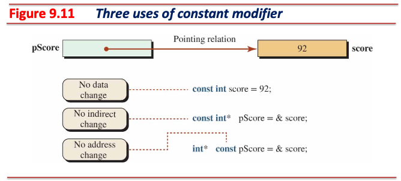

---

## 포인터 (Cont'd - 8)

|Case|Data Variable          |Pointer Variable            |Status|
|----|-----------------------|----------------------------|------|
|1   |`int name = 100;`      |`int* p_name = &name;`      |Ok    |
|2   |`const int name = 100;`|`int* p_name = &name;`      |Error |
|3   |`int name = 100;`      |`const int* p_name = &name;`|Ok    |
|4   |`const int name = 100;`|`const int* p_name = &name;`|Ok    |

- `Case 2`: 오류
  - 포인터를 통해 객체를 수정할 수 있어야 하지만, 가리키는 객체는 읽기 전용 (논리적 모순, 컴파일 오류)

---

## 포인터 (Cont'd - 9)

### 상수 포인터와 포인터 상수 구분

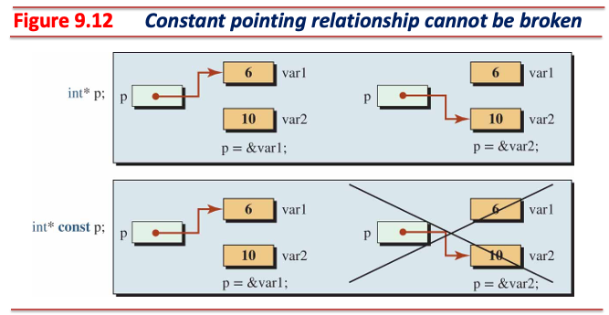

- `const int* p_name = &name;`: 데이터가 상수 (포인터 값 수정 가능)
- `int* const p_name = &name;`: 포인터 자체가 상수 (데이터 가능)
- `const int* const p_name = &name;`: 둘 다 상수 (데이터와 포인터 값 수정 불가)

---

## 포인터 (Cont'd - 10)

### 포인터의 포인터

- 포인터 변수를 가리키는 복합 자료형
- 포인터 변수 또한 객체이므로, 이를 가리키는 포인터 변수 또한 사용 가능

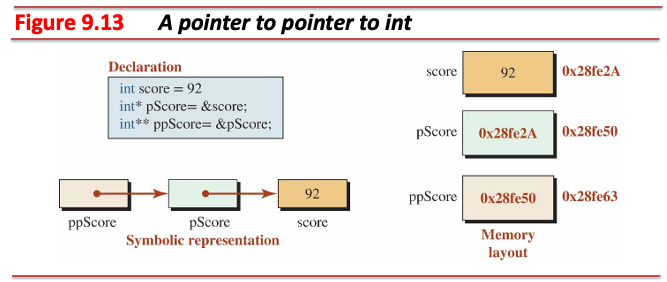

---

## 포인터 (Cont'd - 11)

### 널 포인터 (Pointer To Nowhere)

- `nullptr`을 가리키는 포인터
- `nullptr`을 가리키는 포인터 변수는 **아무런 곳을 가리키지 않음을 의미**
  - `nullptr` (`0x00`)은 일반 프로그램이 접근할 수 없는 주소
  - 만약 `nullptr` 주소로 역참조할 경우 오류에 의해 프로그램이 중단됨
- `nullptr`은 `0`을 의미하므로, 조건문에서 포인터 유효성 검사에 활용될 수 있음

[//]: # (INCLUDE: ./cpp/03/snippet_ptr.cc --from 26 --to 36 --no-comment)

---

## 포인터 (Cont'd - 12)

### 제네릭 포인터 (Pointer To `void`)

- 모든 객체를 가리킬 수 있는 포인터 변수
- **역참조는 불가**

[//]: # (INCLUDE: ./cpp/03/snippet_ptr.cc --from 40 --to 45 --no-comment)

---

## Call By Address

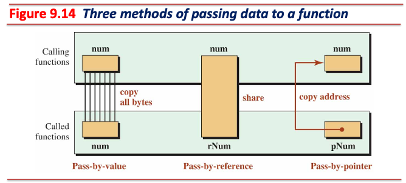

---

## Return By Pointer

- 포인터 값이 가리키는 대상은 함수가 종료되어도 유효해야 함
- Dangling pointer가 발생하지 않도록 주의

[//]: # (INCLUDE: ./cpp/03/ret_by_ptr.cc)

---

## 배열과 포인터

- 배열 이름은 배열의 첫 번째 요소를 가리키는 **상수 포인터**
  - `T`형 길이가 $n$인 배열을 선언하면 메모리 상에 `T` 형 객체가 $n$개 **연속 할당됨**
  - e.g., `int`형 객체는 4 바이트를 사용하며, $n$이 5일 경우 총 20 바이트 사용

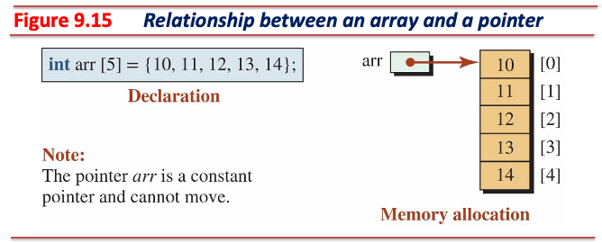

---

## 배열과 포인터 (Cont'd - 1)

### 주소 연산: `+`, `-`

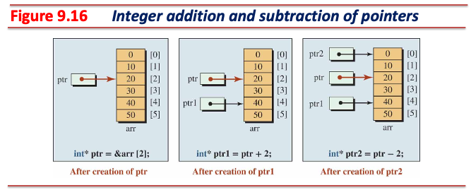

---

## 배열과 포인터 (Cont'd - 2)

### 주소 연산: `++`, `--`

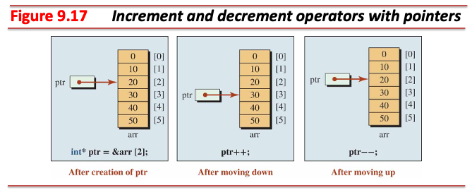

---

## 배열과 포인터 (Cont'd - 3)

### 주소 연산: `+=`, `-=`

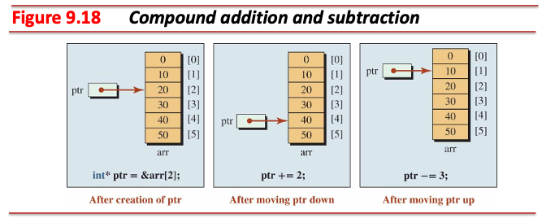

---

## 배열과 포인터 (Cont'd - 4)

### 두 포인터 간 뺄셈

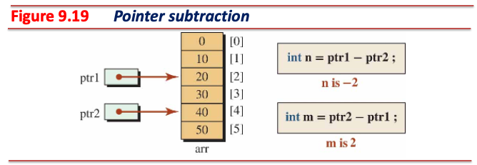

- 두 포인터 값의 상대적인 위치 비교에 사용하며, **두 포인터는 반드시 동일한 배열의 요소를 가리켜야 함**

---

## 배열과 포인터 (Cont'd - 5)

### 두 포인터 간 비교

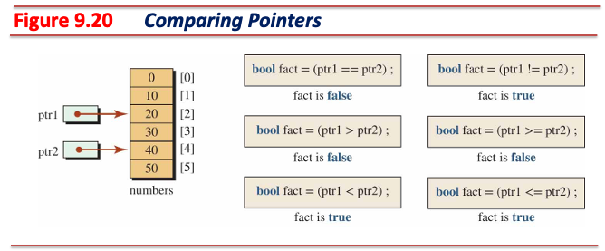

- 두 포인터 값의 상대적인 위치 비교에 사용하며, **두 포인터는 반드시 동일한 배열의 요소를 가리켜야 함**

---

## 함수로의 배열 전달

[//]: # (INCLUDE: ./cpp/03/pass_arr.cc)

---

## 함수의 배열 반환

- 배열 객체의 시작 주소를 반환하는 함수
- **Dangling pointer**가 발생하지 않도록 유의할 것

[//]: # (INCLUDE: ./cpp/03/ret_arr.cc)

---

## 메모리 관리 (Memory Management)

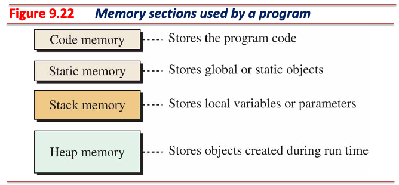

---

## 메모리 관리 (Memory Management) (Cont'd - 1)

### 코드 영역 (Code Memory)

- 실행될 프로그램의 코드가 저장되는 영역
- 프로그램 실행 시 CPU는 코드 영역에 보관되어 있는 문장을 순차 실행
- 이 영역에는 객체가 저장될 수 없음 (기계어 명령어 저장 영역)
- 프로그램 종료 시 코드 영역은 소멸됨

### 정적 영역 (Static Memory)

- 정적 영역은 내부에서 두 영역으로 구분:
  - `.bss`: 초기화되지 않은 전역 혹은 정적 객체
  - `.data`: 초기화된 전역 혹은 정적 객체
- 전역 및 정적 객체는 프로그램 실행 시 생성되었다가 종료 시 소멸

---

## 메모리 관리 (Memory Management) (Cont'd - 2)

### 스택 영역 (Stack Memory)

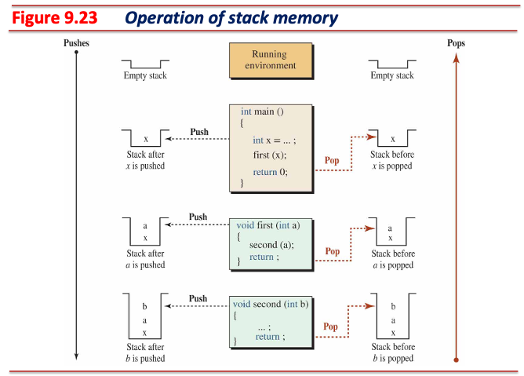

---

## 메모리 관리 (Memory Management) (Cont'd - 3)

### 스택 영역 특징

- 지역 객체 혹은 함수의 매개변수가 보관되는 영역
- Last-in, first-out 컨테이너:
  - 지역 객체와 함수 매개변수 관리에 가장 적합한 컨테이너
- 지역 객체 혹은 함수의 매개변수는 생애주기에 따라 자동으로 생성 또는 소멸이 됨

### 스택 영역 한계

- 스택 영역 객체는 반드시 이름이 있어야 하며, 컴파일 시간에 이름이 확정되어야 함
  - 이름 없는 객체는 스택 영역에 할당 불가
- 스택 영역 객체의 크기는 컴파일 시간이 결정되어야 함
  - 단일 객체 (scalar object)는 자료형으로부터 크기 결정
  - 배열 객체 (array object)는 자료형과 상수 길이를 통해 크기 결정

[//]: # (INCLUDE: ./cpp/03/snippet_arr.cc --from 2 --to 6 --no-comment)

---

## 메모리 관리 (Memory Management) (Cont'd - 4)

### 힙 영역 (Heap Memory)

- 런타임 때 동적 생성된 객체가 보관되는 영역
- **동적 할당된 객체는 이름 없는 객체**
  - 동적 할당된 이름 없는 객체는 **스택 영역 객체**의 도움 (e.g., 포인터)을 받아 간접적으로 사용

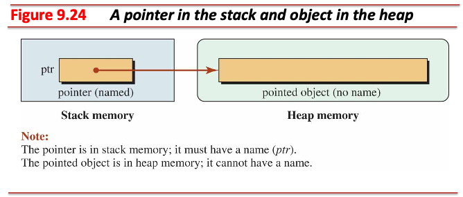

---

## 동적 할당 연산자 (`new`, `delete`)

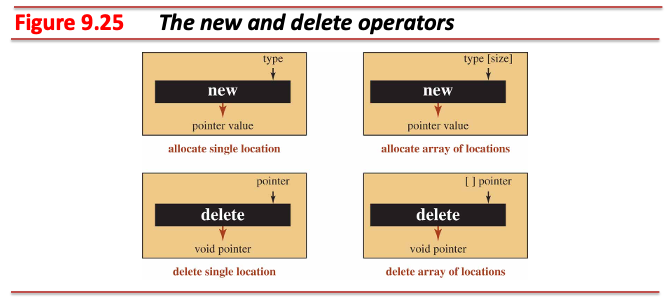

- C++의 기본 연산자 (built-in operators)
- 단항 연산자이며, 결합 방향은 오른쪽에서 왼쪽 (←)

|Name           |Operator  |Expression    |
|---------------|----------|--------------|
|Allocate Object|`new`     |`new T`       |
|Allocate Array |`new[]`   |`new T[SIZE]` |
|Delete Object  |`delete`  |`delete ptr`  |
|Delete Array   |`delete[]`|`delete[] ptr`|

---

## 동적 할당 연산자 (`new`, `delete`) (Cont'd - 1)

### `new` 연산자

- 힙 영역에 객체 생성 시 사용하는 연산자
- 클래스 형 객체를 동적 생성하면 생성자가 호출됨
- 단일 객체는 `new`, 배열 객체는 `new[]` 사용
- 메모리 누수가 발생하지 않도록 사용에 유의할 것

[//]: # (INCLUDE: ./cpp/03/snippet_new_del.cc --from 3 --to 6 --no-comment)

---

## 동적 할당 연산자 (`new`, `delete`) (Cont'd - 2)

### `delete` 연산자

- 힙 영역에 동적 생성된 객체 소멸 시 사용하는 연산자
- 동적 생성된 클래스 형 객체를 소멸하면 소멸자가 호출됨
- 단일 객체는 `delete`, 배열 객체는 `delete[]` 사용
- 아래 경우들은 정의되지 않은 동작 (undefined behavior):

[//]: # (INCLUDE: ./cpp/03/snippet_new_del.cc --from 13 --to 15 --no-comment)

[//]: # (INCLUDE: ./cpp/03/snippet_new_del.cc --from 21 --to 23 --no-comment)

[//]: # (INCLUDE: ./cpp/03/snippet_new_del.cc --from 29 --to 30 --no-comment)

---

## 동적 할당 연산자 (`new`, `delete`) (Cont'd - 3)

### 1차원 배열 동적 할당

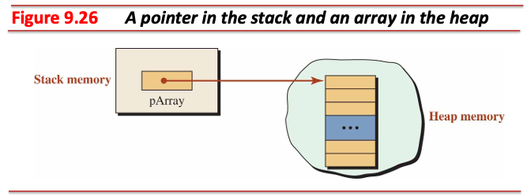

---

## 동적 할당 연산자 (`new`, `delete`) (Cont'd - 4)

### 1차원 배열 동적 할당 예제

[//]: # (INCLUDE: ./cpp/03/dynamic1.cc)

---

## 동적 할당 연산자 (`new`, `delete`) (Cont'd - 5)

### 2차원 배열 동적 할당 - 행의 크기가 고정, 열의 크기가 가변일 때

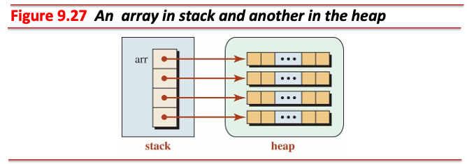

---

## 동적 할당 연산자 (`new`, `delete`) (Cont'd - 6)

### 2차원 배열 동적 할당 예제 - 행의 크기가 고정, 열의 크기가 가변일 때

[//]: # (INCLUDE: ./cpp/03/snippet_new_del.cc --from 34 --to 50 --no-comment)

---

## 동적 할당 연산자 (`new`, `delete`) (Cont'd - 7)

### 2차원 배열 동적 할당 - 행의 크기, 열의 크기가 가변일 때

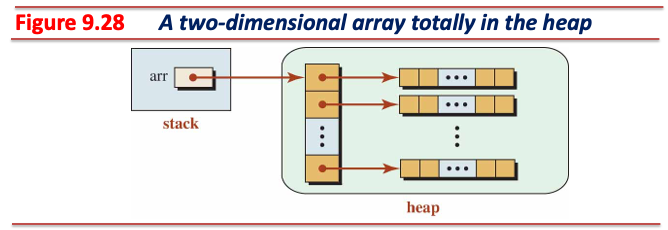

---

## 동적 할당 연산자 (`new`, `delete`) (Cont'd - 8)

### 2차원 배열 동적 할당 예제 - 행의 크기, 열의 크기가 가변일 때

[//]: # (INCLUDE: ./cpp/03/snippet_new_del.cc --from 52 --to 70 --no-comment)

---

## 동적 할당 연산자 (`new`, `delete`) (Cont'd - 9)

- 래기드 (ragged): 각 행마다 서로 다른 길이의 1차원 배열을 가리키는 경우
- 파스칼 삼각형 (Pascal's triangle)
  - 래기드 배열의 한 형태:
  - $x + y$ 형태의 이항식을 $n$ 제곱하여 전개하였을 때의 계수 (coefficients)를 표현한 것

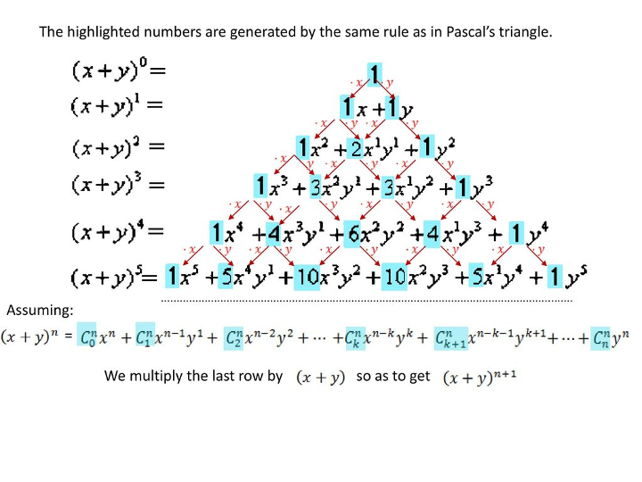

---

## 동적 할당 연산자 (`new`, `delete`) (Cont'd - 10)

[//]: # (INCLUDE: ./cpp/03/pascal.cc)
