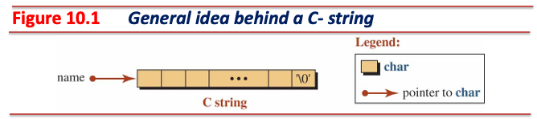
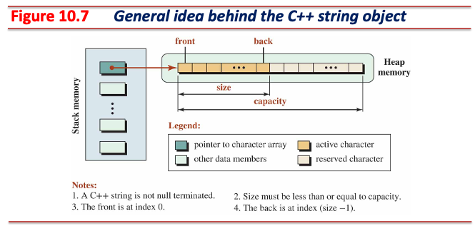
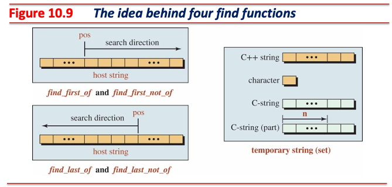
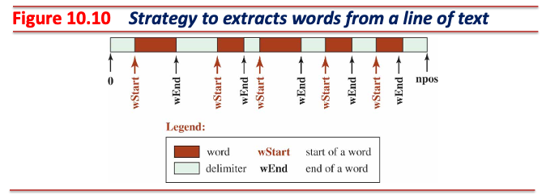
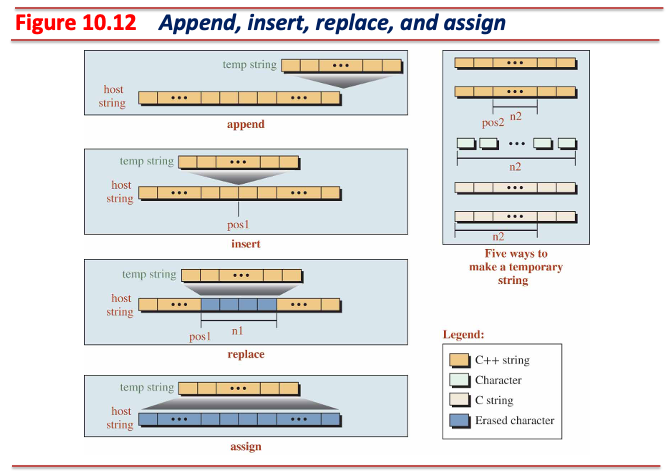

<!-- _class: lead -->
# 객체지향프로그래밍

## 문자열

### [munseong.jeong@daejin.ac.kr](mailto:munseong.jeong@daejin.ac.kr)

---

## C-문자열 (C-Strings)

- `char`타입 배열을 사용해 문자열 기록
  - `char`타입 배열 마지막 요소에는 문자열 끝을 표현하는 널 문자(null character, `\0`) 저장



- 문자열 선언 시 축약 표현(shorthand) 사용 가능


[//]: # (INCLUDE: ./cpp/04/src/_snippet.cc --from 3 --to 3 --no-comment)

---

## C-문자열 (C-Strings) (Cont'd - 1)

### 문자열 리터럴

- **읽기 전용 영역(.rodata)에 할당되는 이름 없는 상수 객체**
  - 문자열 리터럴 등 상수 데이터가 저장됨
  - 힙 영역처럼 이름 없는 객체 허용
- 포인터를 통해 문자열 리터럴에 접근 가능


[//]: # (INCLUDE: ./cpp/04/src/_snippet.cc --from 11 --to 12 --no-comment)

---

## C-문자열 (C-Strings) (Cont'd - 2)

### C-문자열 한계 1 - 메모리 관리

[//]: # (INCLUDE: ./cpp/04/src/_snippet.cc --from 18 --to 23 --no-comment)

---

## C-문자열 (C-Strings) (Cont'd - 3)

### C-문자열 한계 2 - 문자열 길이 계산

[//]: # (INCLUDE: ./cpp/04/src/_snippet.cc --from 28 --to 39 --no-comment)

[//]: # (INCLUDE: ./cpp/04/src/_snippet.cc --from 46 --to 47 --no-comment)

---

## C-문자열 (C-Strings) (Cont'd - 4)

### C-문자열 한계 3 - 문자열 조작

[//]: # (INCLUDE: ./cpp/04/src/_snippet.cc --from 56 --to 60 --no-comment)

[//]: # (INCLUDE: ./cpp/04/src/_snippet.cc --from 68 --to 80 --no-comment)

---

## [C++ 문자열](https://cplusplus.com/reference/string/string/)

- C++는 표준 문자열 제공, `<string>` 헤더 파일 포함 시 사용 가능
- **클래스**로 구현되어 있음
- **문자열 저장 시 널 문자를 포함하지 않음**
- 문자열 크기(size)와 용량(capacity) 개념 사용
- 문자열 인스턴스는 힙 영역에 문자열 저장



---

## C++ 문자열 (Cont'd - 1)

### C++ 문자열 데이터 멤버

- 포인터
  - 힙 영역에 기록되어 있는 문자열을 가리킴
- 크기(size)
  - 문자열 객체의 문자열 길이(현재 저장된 문자 수)
- 용량(capacity)
  - 문자열 객체가 **현재 사용 중인 메모리 재할당 없이 저장할 수 있는** 최대 문자 수

#### 크기와 용량을 구분한 이유

- 문자열 인스턴스의 **잦은 힙 메모리 영역 재할당을 최대한 억제하여 성능을 개선하기 위함**
- 크기가 $s$이고 용량이 $c$인 문자열 객체에, 길이가 $l$인 문자열 객체를 연결하는 경우:
  - $c \geq s + l$ 인 경우: 힙 영역 **재할당 없이** 문자열 연결 가능
  - $c < s + l \leq 2 \cdot c$ 인 경우: 힙 영역에 $2 \cdot c$ 크기로 **재할당** 후 문자열 연결
  - $2 \cdot c \leq s + l$ 인 경우: 힙 영역에 $s + l$ 크기로 **재할당 후** 문자열 연결

---

## C++ 문자열 (Cont'd - 2)

### C++ 문자열 인스턴스의 상황 별 용량 관리

- 문자열 객체의 크기가 3, 용량이 6인 경우

[//]: # (INCLUDE: ./cpp/04/src/_snippet.cc --from 92 --to 93 --no-comment)

- 해당 문자열 객체에 길이가 2인 문자열을 연결하는 경우:
  - 힙 영역 재할당 없이 문자열 연결

[//]: # (INCLUDE: ./cpp/04/src/_snippet.cc --from 97 --to 98 --no-comment)

- 해당 문자열 객체에 길이가 2인 문자열을 다시 한 번 연결하는 경우:
  - 힙 영역 재할당 후 문자열 연결

[//]: # (INCLUDE: ./cpp/04/src/_snippet.cc --from 102 --to 103 --no-comment)

---

## C++ 문자열 (Cont'd - 3)

### 간단한 C++ 문자열 클래스 구현

[//]: # (INCLUDE: ./cpp/04/src/mystring1/Makefile --reference)

- `mystring.hpp`

[//]: # (INCLUDE: ./cpp/04/src/mystring1/mystring.hpp --to 15)

---

## C++ 문자열 (Cont'd - 4)

[//]: # (INCLUDE: ./cpp/04/src/mystring1/mystring.hpp --from 17)

---

## C++ 문자열 (Cont'd - 5)

- `mystring.cc`

[//]: # (INCLUDE: ./cpp/04/src/mystring1/mystring.cc --to 14)

---

## C++ 문자열 (Cont'd - 6)

[//]: # (INCLUDE: ./cpp/04/src/mystring1/mystring.cc --from 16 --to 36)

---

## C++ 문자열 (Cont'd - 7)

[//]: # (INCLUDE: ./cpp/04/src/mystring1/mystring.cc --from 38 --to 59)

---

## C++ 문자열 (Cont'd - 8)

[//]: # (INCLUDE: ./cpp/04/src/mystring1/mystring.cc --from 61 --to 81)

---

## C++ 문자열 (Cont'd - 9)

[//]: # (INCLUDE: ./cpp/04/src/mystring1/mystring.cc --from 83)

---

## C++ 문자열 (Cont'd - 10)

- `main.cc`

[//]: # (INCLUDE: ./cpp/04/src/mystring1/main.cc --to 15)

---

## C++ 문자열 (Cont'd - 11)

[//]: # (INCLUDE: ./cpp/04/src/mystring1/main.cc --from 17)

---

## 얕은 복사 (Shallow Copy) vs 깊은 복사 (Deep Copy)

### 얕은 복사

[//]: # (INCLUDE: ./cpp/04/src/_snippet.cc --from 111 --to 125 --no-comment)

- 기본 복사 생성자(synthesized copy constructor)는 얕은 복사(shallow copy) 수행
  - 새로 생성되는 객체의 데이터 멤버 값은 복사할 객체의 데이터 멤버 값으로 설정됨

---

## 얕은 복사 (Shallow Copy) vs 깊은 복사 (Deep Copy) (Cont'd - 1)

### 얕은 복사의 한계

- 얕은 복사는 포인터 자체만 복사하기 때문에 동적 할당된 메모리에 대한 여러 문제를 발생시킴
  - **이중 해제(double free)**: 소멸자에서 같은 메모리를 여러 번 해제하려고 시도
  - **메모리 누수(memory leak)**: 소멸자가 한 번만 호출되면 참조를 잃어버린 메모리가 발생
  - **의도치 않은 데이터 변경**: 한 객체의 변경이 다른 객체에도 영향을 줌

[//]: # (INCLUDE: ./cpp/04/src/_snippet.cc --from 130 --to 135 --no-comment)

```shell
free(): double free detected in tcache 2
Aborted
```

---

## 얕은 복사 (Shallow Copy) vs 깊은 복사 (Deep Copy) (Cont'd - 2)

### 깊은 복사

[//]: # (INCLUDE: ./cpp/04/src/_snippet.cc --from 143 --to 160 --no-comment)

---

## 얕은 복사 (Shallow Copy) vs 깊은 복사 (Deep Copy) (Cont'd - 3)

[//]: # (INCLUDE: ./cpp/04/src/_snippet.cc --from 165 --to 171 --no-comment)

- 인스턴스 복사 시 동적 할당된 데이터 멤버를 갖는 인스턴스는 **명시적으로 깊은 복사를 해야 함**
- 깊은 복사가 필요한 경우:
  - 클래스가 동적으로 할당된 메모리를 가리키는 포인터를 포함할 때
  - 복사 후 각 객체가 독립적으로 데이터를 수정할 수 있어야 할 때
  - 소멸자가 동적 할당된 메모리를 해제하는 작업을 수행할 때

---

## 참조 반환 멤버 함수

[//]: # (INCLUDE: ./cpp/04/src/_snippet.cc --from 180 --to 196 --no-comment)

- 참조 반환의 이점:
  1. 값 반환이 아니므로 **불필요한 메모리 관련 비용 및 연산을 아낄 수 있다**.
  2. **메서드 호출을 연속적으로 할 수 있다**. 이는 코드가 더욱 간결해지고 가독성을 높인다.

---

## `explicit`

- 암묵적 변환(implicit conversion)을 불허하고자 할 때 사용

[//]: # (INCLUDE: ./cpp/04/src/_snippet.cc --from 200 --to 214 --no-comment)

- **모호한 표현을 사용하지 못하도록 강제함**으로써 코드 가독성을 높일 수 있음
- `MyString` 클래스의 `explicit` 키워드를 제거하면 `MyString str = 10` 표현이 가능해짐
  - **문자열 객체에 10을 대입하는 표현은 모호하고 불명확함**
    > 문자열 객체에 10이라는 수를 문자열로 저장하라는 것인가?
    > 문자열 객체의 용량을 10으로 설정하는 것인가?

---

## 표준 C++ 문자열

- Testing functions related to size and capacity

[//]: # (INCLUDE: ./cpp/04/src/00_str1.cc)

---

## 표준 C++ 문자열 (Cont'd - 1)

- Using input/output operators

[//]: # (INCLUDE: ./cpp/04/src/01_str2.cc)

---

## 표준 C++ 문자열 (Cont'd - 2)

- Using [`getline`](https://en.cppreference.com/w/cpp/string/basic_string/getline) for input

[//]: # (INCLUDE: ./cpp/04/src/02_str3.cc)

---

## 표준 C++ 문자열 (Cont'd - 3)

- Retrieving and changing characters

[//]: # (INCLUDE: ./cpp/04/src/03_str4.cc)

---

## 표준 C++ 문자열 (Cont'd - 4)

- Retrieving two substrings([`substr`](https://en.cppreference.com/w/cpp/string/basic_string/substr))

[//]: # (INCLUDE: ./cpp/04/src/04_str5.cc)

---

## 표준 C++ 문자열 (Cont'd - 5)

### 문자열 검색 관련 함수와 `std::string::npos`

- 문자열 검색 함수(`find`, `rfind`, `find_first_of` 등)는 다음과 같은 특징을 가짐:
  - 검색 성공 시: 찾은 위치의 인덱스(0-based) 반환
  - 검색 실패 시: `std::string::npos` 값 반환
- `std::string::npos`
  - 특수한 상수 값으로 문자열 내에서 위치를 찾지 못했음을 나타냄
  - `size_t` 타입의 최대값(`-1`을 `size_t`로 변환한 값)
  - 검색 실패 여부 확인에 필수적으로 사용됨

[//]: # (INCLUDE: ./cpp/04/src/_snippet.cc --from 219 --to 224 --no-comment)

---

## 표준 C++ 문자열 (Cont'd - 6)

### Forward and Backward Search for a Given Character


---

## 표준 C++ 문자열 (Cont'd - 7)

- Forward search([`find`](https://en.cppreference.com/w/cpp/string/basic_string/find))

[//]: # (INCLUDE: ./cpp/04/src/05_str_find.cc)

---

## 표준 C++ 문자열 (Cont'd - 8)

- Backward search([`rfind`](https://en.cppreference.com/w/cpp/string/basic_string/rfind))

[//]: # (INCLUDE: ./cpp/04/src/06_str_rfind.cc)

---

## 표준 C++ 문자열 (Cont'd - 9)

### 문자 집합 (Character Set)에 속한 문자 검색



---

## 표준 C++ 문자열 (Cont'd - 10)

- 정방향 포함 문자 검색([`find_first_of`](https://en.cppreference.com/w/cpp/string/basic_string/find_first_of)), 역방향 포함 문자 검색([`find_last_of`](https://en.cppreference.com/w/cpp/string/basic_string/find_last_of))

[//]: # (INCLUDE: ./cpp/04/src/07_str_find_of.cc)

---

## 표준 C++ 문자열 (Cont'd - 11)

- 정방향 불포함 문자 검색([`find_first_not_of`](https://en.cppreference.com/w/cpp/string/basic_string/find_first_not_of)), 역방향 불포함 문자 검색([`find_last_not_of`](https://en.cppreference.com/w/cpp/string/basic_string/find_last_not_of))

[//]: # (INCLUDE: ./cpp/04/src/08_str_find_not_of.cc)

---

## 표준 C++ 문자열 (Cont'd - 12)

- Using `find` and `rfind` to check if a string contains a substring

[//]: # (INCLUDE: ./cpp/04/src/09_str_find_example.cc)

---

## 표준 C++ 문자열 (Cont'd - 13)

### 토큰화 (Tokenizing)

- 텍스트를 의미 있는 단위(토큰)로 분리하는 과정, 문자열 처리에서 자주 사용되는 기법으로 다음과 같은 응용에 활용됨:
  - 구분자(delimiter)로 분리된 단어 추출
  - CSV 파일의 필드 분리
  - 명령어 라인 인자 파싱
- C++ 문자열에서의 토큰화 구현 방법:
  1. `find_first_not_of`: 구분자가 아닌 첫 문자 위치를 찾음(토큰 시작점)
  2. `find_first_of`: 구분자의 위치를 찾음(토큰 종료점)
  3. `substr`: 시작점과 종료점 사이의 부분 문자열(토큰)을 추출



---

## 표준 C++ 문자열 (Cont'd - 14)

- Retrieving words from a line of text

[//]: # (INCLUDE: ./cpp/04/src/10_token.cc)

---

## 표준 C++ 문자열 (Cont'd - 15)

### Comparing Two Strings


---

## 표준 C++ 문자열 (Cont'd - 16)

- Integral comparison of strings([`compare`](https://en.cppreference.com/w/cpp/string/basic_string/compare))

[//]: # (INCLUDE: ./cpp/04/src/11_str_cmp1.cc)

---

## 표준 C++ 문자열 (Cont'd - 17)

- Using logical operators to compare strings

[//]: # (INCLUDE: ./cpp/04/src/12_str_cmp2.cc)

---

## 표준 C++ 문자열 (Cont'd - 18)

### C++ String Modifying Member Functions - [`append`](https://en.cppreference.com/w/cpp/string/basic_string/append), [`insert`](https://en.cppreference.com/w/cpp/string/basic_string/insert), [`replace`](https://en.cppreference.com/w/cpp/string/basic_string/replace), [`assign`](https://en.cppreference.com/w/cpp/string/basic_string/assign)



---

## 표준 C++ 문자열 (Cont'd - 19)

- Modifying C++ string - 1

[//]: # (INCLUDE: ./cpp/04/src/13_str_mod1.cc)

---

## 표준 C++ 문자열 (Cont'd - 20)

- Modifying C++ string - 2

[//]: # (INCLUDE: ./cpp/04/src/14_str_mod2.cc)

---

## 표준 C++ 문자열 (Cont'd - 21)

- Modifying C++ string - 3

[//]: # (INCLUDE: ./cpp/04/src/15_str_mod3.cc)

---

## 표준 C++ 문자열 (Cont'd - 22)

- Modifying C++ string - 4

[//]: # (INCLUDE: ./cpp/04/src/16_str_mod4.cc)

---

## 표준 C++ 문자열 (Cont'd - 23)

- String to character array and C-string conversion

[//]: # (INCLUDE: ./cpp/04/src/17_str_mod5.cc)

- **용량 크기 1은 널 문자로 예약되어 있음**
  - `c_str()` 호출 시 `data_[size_] = '\0'` 수행 후 `data_` 반환
  - `data_`: 문자열 인스턴스의 포인터, `size_`: 문자열 인스턴스가 저장하고 있는 문자열 길이
