<!-- _class: lead -->
# 객체지향프로그래밍

## 클래스 간의 관계

### [munseong.jeong@daejin.ac.kr](mailto:munseong.jeong@daejin.ac.kr)

---

## 클래스 관계 종류

> A program normally uses several classes with different relationships between them.

- 관계는 상속(inheritance), 연관(association), 의존(dependency)이 있음
  - 소유(aggregation), 구성(composition)은 연관의 특별한 형태
  - 소유와 구성은 연관의 부분 집합(subset)

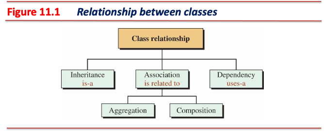

---

## [UML (Unified Modeling Language)](https://en.wikipedia.org/wiki/Unified_Modeling_Language)

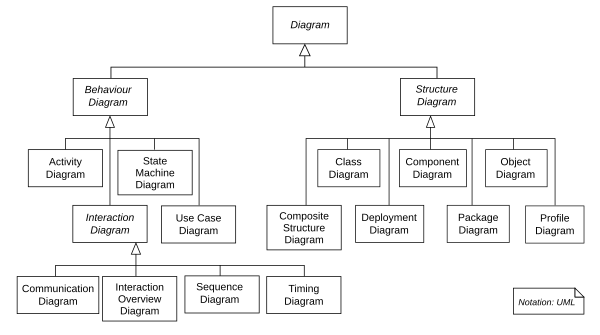

- 소프트웨어 시스템의 구조와 동작을 시각적으로 표현하기 위한 표준화된 모델링 언어
- 정의된 문법(syntax)과 의미론(semantics)을 갖춘 언어
  - 표준화된 기호와 규칙을 통해 일관된 방식으로 시스템을 표현하고 이해할 수 있음
  - 다이어그램을 통해 시스템의 의미를 정확하게 파악할 수 있음
- 프로그래밍 언어가 코드로 시스템을 표현하듯, UML은 시각적 다이어그램으로 시스템을 표현
  - 시스템의 이해도를 높이고 개발 효율을 높일 수 있음
- UML은 개발자 간 효과적인 의사소통 수단으로 활용됨

---

## [UML (Unified Modeling Language)](https://en.wikipedia.org/wiki/Unified_Modeling_Language) (Cont'd)

### [PlantUML](https://plantuml.com/)

- 텍스트 기반 문법으로 UML 다이어그램을 빠르고 쉽게 작성할 수 있는 도구
- 코드를 통해 다양한 다이어그램 시각화

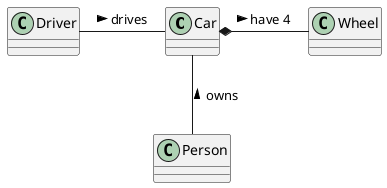

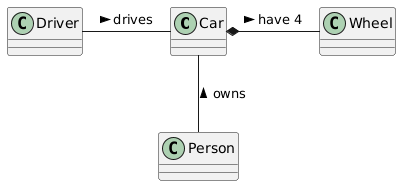

---

## 클래스 다이어그램

- UML 다이어그램 중 클래스 간의 관계 설명을 위한 다이어그램
  - 문법
    - 박스는 클래스를 표현하며, 박스 안에 클래스 명 기재
    - 실선으로 된 화살표는 관계 중 상속을 의미
  - 의미론
    - A horse is an animal.
    - A circle is a shape.
    - A student is a person.

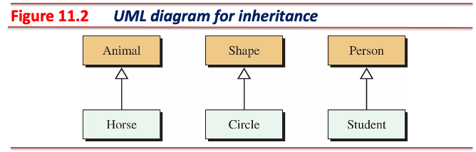

---

## 상속 (Inheritance)

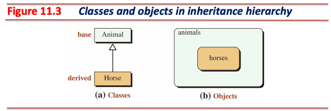

- 두 클래스는 *is-a* 관계로 표현됨
  - A horse *is an* animal.
  - `Animal` 은 기반 클래스(일반적인 의미)
  - `Horse` 는 기반 클래스로부터 구체화된 파생 클래스(구체적인 의미)
- 파생 클래스(derived class)는 기반 클래스(base class)로부터 구체화한 결과물
- 클래스 다이어그램에서 상속 표현 시 두 클래스 사이에 실선으로 된 화살표를 사용
  - 파생 클래스(`Horse`)가 기반 클래스(`Animal`)를 가리킴
  - 속이 빈 삼각형 화살촉(`─▷`)이 기반 클래스를 향하도록 표현
    - 관계에서의 주어(파생 클래스)로부터 대상(부모 클래스)을 가리키도록 표현
- 기반 클래스를 슈퍼클래스(superclass), 파생 클래스를 서브클래스(subclass)라고 부르기도 함

---

## 상속 (Inheritance) (Cont'd - 1)

### 상속 특징

- **파생 클래스는 기반 클래스의 모든 멤버를 사용할 수 있음**
  - 기반 클래스의 생성자, 소멸자, 대입 연산자는 예외로 상속되지 않음
- 파생 클래스는 기반 클래스에서 상속한 내용에 필요에 따라 데이터 멤버 또는 멤버 함수 추가 가능
- 상속은 세 가지 형태로 할 수 있음
  - 접근 지정자는 생략될 수 있으며, 생략 시 `private` 상속(the default inheritance)

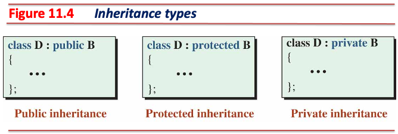

- 기본 상속 형태는 `private`이지만, 일반적으로 사용하는 상속은 `public` 상속

---

## 상속 (Inheritance) (Cont'd - 2)

### 상속 관계 예

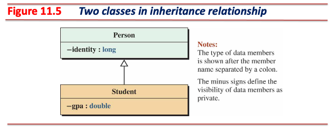

- A student *is a* person.
  - `Person` 클래스는 기반 클래스, `Student` 클래스는 파생 클래스
  - `Person` 클래스는 주민등록번호를 저장할 데이터 멤버(`identity`) 필요
  - `Student` 클래스는 주민등록번호와 학점을 저장할 데이터 멤버(`identity`, `gpa`) 필요
    - `identity` 는 기반 클래스로부터 상속됨
    - `Student` 클래스에 `gpa`만 추가하면 됨

---

## 상속 (Inheritance) (Cont'd - 3)

- `inheritance.cc`

[//]: # (INCLUDE: ./cpp/05/inheritance.cc --to 18)

---

## 상속 (Inheritance) (Cont'd - 4)

[//]: # (INCLUDE: ./cpp/05/inheritance.cc --from 20)

---

## 상속 (Inheritance) (Cont'd - 5)

### 클래스 다이어그램의 클래스 기호와 표기법

- 클래스 기호(class symbol)는 세 영역으로 구분됨
  - 상단 부분: 클래스 이름 표현
  - 중간 부분: 클래스의 속성(데이터 멤버) 표현
  - 하단 부분: 클래스의 행위(멤버 함수) 표현
- 중간과 하단 부분에서의 클래스 멤버 가시성 표기법(visibility notation):
  - `+` :  `public`
  - `-` :  `private`
  - `#` :  `protected`

#### 클래스 기호에서의 데이터 멤버와 멤버 함수 형식

```text
[visibility_notation] data_member_name: type
[visibility_notation] method_name(parameter_type parameter_name, ...): return_type
```

---

## 상속 (Inheritance) (Cont'd - 6)

### `Person` 클래스와 `Student` 클래스의 클래스 다이어그램

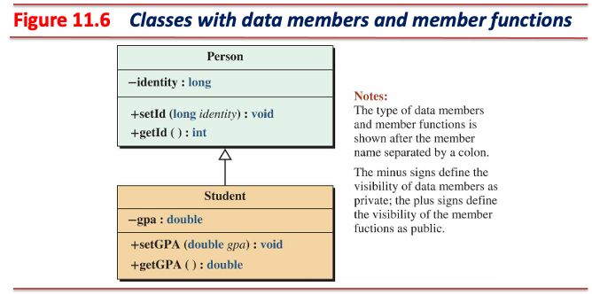

- **생성자, 소멸자는 상속하지 않으므로 클래스 다이어그램에 표현하지 않음**

---

## 상속 (Inheritance) (Cont'd - 7)

### Private 데이터 멤버

> A private member in the base class becomes an inaccessible (hidden) member in the derived class.

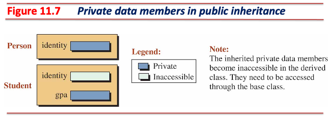

- 기반 클래스 객체는 데이터 멤버 `identity` 를 가짐
- 파생 클래스 객체는 데이터 멤버 `gpa` 와 **상속 받은 기반 클래스 멤버인 `identity`를 가짐**
- `identity`는 `private` 멤버이므로, 기반 클래스 범위(base class scope)에서만 접근 가능
- **파생 클래스 객체는 파생 클래스 범위(derived class scope)를 가짐**
  - 파생 클래스 메서드는 `identity`에 접근 불가

---

## 상속 (Inheritance) (Cont'd - 8)

### Public 멤버 함수

> A public member in the base class becomes a public member in the derived class.

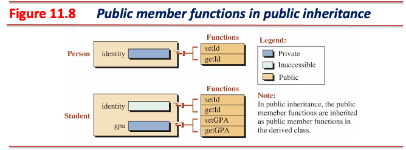

- 파생 클래스 객체는 기반 클래스의 `public` 메서드들을 사용할 수 있음
  - 파생 클래스 객체가 파생 클래스의 `public` 메서드를 호출하면 파생 클래스 범위가 됨
  - 파생 클래스 객체가 기반 클래스의 `public` 메서드를 호출하면 기반 클래스 범위가 됨
- 파생 클래스 객체가 기반 클래스의 `private` 멤버에 접근하기 위해서는 기반 클래스의 `public` 멤버를 사용해야 함

---

## 상속 (Inheritance) (Cont'd - 9)

### 오버라이드 함수 (Overridden Member Functions)

- **상속 관계에 있는** 기반 클래스와 파생 클래스의 함수 시그니처(매개변수 형태)가 서로 같은 경우

[//]: # (INCLUDE: ./cpp/05/snippet_inheritance.cc --from 5 --to 21 --no-comment)

---

## 상속 (Inheritance) (Cont'd - 10)

### 클래스 범위 (Class Scope)

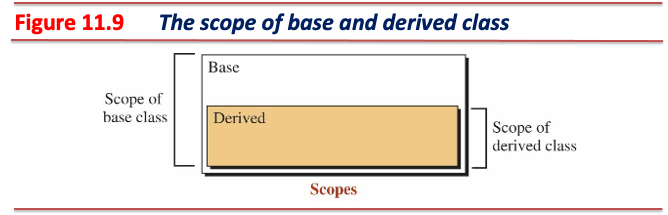

- 기반 클래스와 파생 클래스는 각각 독립적인 멤버와 범위를 가짐
  - 파생 클래스는 기반 클래스의 범위를 기반으로 확장됨
- 파생 클래스는 파생 클래스 범위와 기반 클래스 범위 둘 다 접근 가능
  - 파생 클래스는 기반 클래스의 **`private`이 아닌 멤버**에 접근 가능
- **기반 클래스는 파생 클래스의 멤버에 접근 불가**

---

## 상속 (Inheritance) (Cont'd - 11)

### 클래스 범위에 따른 멤버 함수 호출 규칙

- 컴파일러가 멤버 함수를 처리하는 절차는 다음과 같음:
  1. 컴파일러는 멤버 함수를 호출한 객체의 클래스 범위에 호출하고자 하는 함수가 있는지 확인한다.
  2. 호출 가능한 함수가 없다면 해당 객체의 상위 클래스에 호출하고자 하는 함수가 있는지 확인한다.
  3. 여전히 호출 가능한 함수가 없다면 기반 클래스에 도달할 때까지 2번 과정을 반복한다.
  4. 기반 클래스에도 호출하고자 하는 함수가 없다면 컴파일 오류가 발생한다.

[//]: # (INCLUDE: ./cpp/05/snippet_inheritance.cc --from 48 --to 54 --no-comment)

---

## 상속 (Inheritance) (Cont'd - 12)

### 오버라이드 함수 활용 - 작업 위임 (Delegation of Duty)

- 파생 클래스는 작업의 일부를 상위 클래스에 위임(delegation of duty) 가능

### 작업 위임의 예: 함수 오버라이드와 작업 위임을 사용해 공통된 이름의 멤버 함수 사용

[//]: # (INCLUDE: ./cpp/05/snippet_inheritance.cc --from 58 --to 64 --no-comment)

---

## 상속 (Inheritance) (Cont'd - 13)

[//]: # (INCLUDE: ./cpp/05/snippet_inheritance.cc --from 66 --to 78 --no-comment)

- 공통된 이름의 멤버 함수 `set`, `Print`는 호스트 객체에 따라 올바른 멤버 함수가 선택됨

[//]: # (INCLUDE: ./cpp/05/snippet_inheritance.cc --from 81 --to 84 --no-comment)

---

## 상속 (Inheritance) (Cont'd - 14)

### 상속되지 않는 멤버

> Constructors, destructor, and assignment operators are not inherited; they need to be redefined.

- 다음 다섯 개의 멤버 함수는 파생 클래스로 상속되지 않음
  1. 기본 생성자
  2. 매개변수 생성자
  3. 복사 생성자
  4. 소멸자
  5. 대입 연산자(연산자 오버로딩 학습 시 소개)

- 따라서 파생 클래스의 생성자는 기반 클래스의 데이터 멤버 초기화 불가
  - 일반적으로 클래스는 데이터 멤버를 `private` 으로 지정(캡슐화)
  - 기반 클래스의 데이터 멤버는 **기반 클래스 범위에서만 접근 가능**
- 마찬가지로 파생 클래스의 소멸자는 기반 클래스의 데이터 멤버 소멸 불가

---

## 상속 (Inheritance) (Cont'd - 15)

### 상속에서의 생성과 소멸

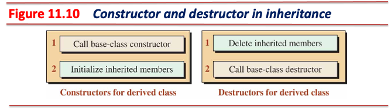

- 파생 클래스의 생성자는 기반 클래스의 생성자를 먼저 호출한 뒤 파생 클래스 데이터 멤버를 초기화
  - 파생 클래스의 생성자에서 기반 클래스의 생성자를 명시적으로 호출해야 함
  - 만약 호출하지 않는다면 컴파일러에 의해 기반 클래스의 **기본 생성자**가 자동 호출됨
- 파생 클래스의 소멸자는 파생 클래스 데이터 멤버를 먼저 소멸한 뒤 기반 클래스 소멸자 호출
  - 소멸자는 객체 소멸 시점에 시스템에 의해 자동 호출되는 멤버 함수
  - 파생 클래스 객체 소멸 시 파생 클래스의 소멸자와 기반 클래스의 소멸자가 순차적으로 호출됨
- **생성자와 소멸자의 처리 순서는 역순임에 유의**

---

## 상속 (Inheritance) (Cont'd - 16)

### 기반 클래스 타입 객체와 파생 클래스 타입 객체의 초기화 과정

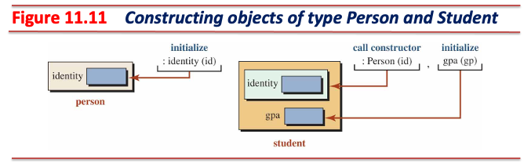

---

## 상속 (Inheritance) (Cont'd - 17)

### 상속에서의 생성과 소멸 예시

- `person.hpp`

[//]: # (INCLUDE: ./cpp/05/inheritance/person.hpp)

---

## 상속 (Inheritance) (Cont'd - 18)

- `student.hpp`

[//]: # (INCLUDE: ./cpp/05/inheritance/student.hpp)

---

## 상속 (Inheritance) (Cont'd - 19)

- `main.cc`

[//]: # (INCLUDE: ./cpp/05/inheritance/main.cc)

---

## 상속 (Inheritance) (Cont'd - 20)

### Protected 멤버

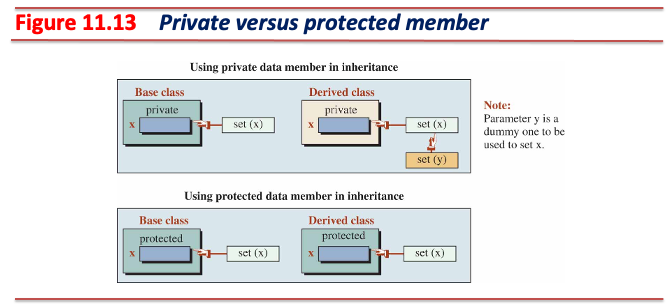

- 파생 클래스의 멤버 함수는 기반 클래스의 `private` 멤버에 접근 불가
- `protected` 멤버는 상속된 모든 클래스에서 접근 가능
  - 파생 클래스의 멤버 함수는 기반 클래스의 `protected` 멤버에 접근 가능

---

## 상속 (Inheritance) (Cont'd - 21)

### Protected vs Private

- `private` 데이터 멤버는 캡슐화가 적용되지만, 추가적인 코드 작성이 요구됨(e.g., 작업 위임)
- `protected` 데이터 멤버는 코드가 간결해지지만, **캡슐화 원칙에 위배됨**

### 상속 막기 (Blocking Inheritance)

- `final` 키워드를 사용한 클래스는 다른 클래스가 상속할 수 없음

[//]: # (INCLUDE: ./cpp/05/snippet_inheritance.cc --from 90 --to 92 --no-comment)

- 파생 클래스에 `final` 키워드를 적용해 해당 파생 클래스가 더 이상 상속되지 못하도록 막을 수 있음

[//]: # (INCLUDE: ./cpp/05/snippet_inheritance.cc --from 94 --to 97 --no-comment)

---

## 상속 (Inheritance) (Cont'd - 22)

### 상속 원칙 - 리스코프 치환 원칙 (Liskov Substitution Principle)

> This principle says that an object of a superclass **must always be substitutable** by an object of a subclass without altering any of the properties of the superclass.

- Barbara Liskov에 의해 개발된 설계 원칙 중 하나
- 슈퍼클래스와 서브클래스는 서로 *is-a* 관계로 표현되어야 함
  - A student *is a* person.
- LSP를 잘 지킨 예: `Animal` 슈퍼클래스와 `Bird` 서브클래스
  - 두 클래스는 *is-a* 관계로 표현 가능
    - 두 클래스 모두 `Move()` 메서드가 있다고 가정
    - `Move()`의 호스트 객체 `Animal`을 `Bird`로 대치해도 **자연스러움**
- LSP를 지키지 못한 예: `Rectangle` 슈퍼클래스와 `Square` 서브클래스
  - **두 클래스는 *is-a* 관계로 표현할 수 없음**
    - 두 클래스 모두 `set_width()`, `set_height()` 메서드가 있다고 가정
    - `Rectangle` 클래스는 높이와 너비 값이 다를 수 있음
    - `Square` 클래스는 높이와 너비가 항상 같아야 함(정사각형 속성)
    - 따라서 `Rectangle` 객체를 사용하는 코드에서 `Square` 객체로 대치할 경우 **동작이 달라짐**
      - e.g., `set_width()` 호출 시 `Square`는 높이도 변경해야 함

---

## 상속 (Inheritance) (Cont'd - 23)

### 상속 트리

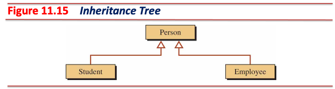

- 하나의 기반 클래스로부터 여러 개의 파생 클래스가 생성될 수 있음
  - A student *is a* person.
  - An employee *is a* person.

---

## 상속 (Inheritance) (Cont'd - 24)

### 상속의 세 가지 유형

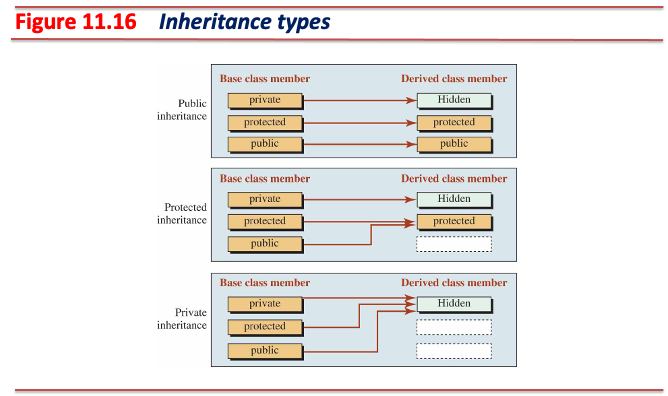

- 대부분 `public` 상속(*is-a* 관계)을 사용하지만, 다른 유형으로도 상속 가능

---

## 상속 (Inheritance) (Cont'd - 25)

### Public 상속

- 가장 많이 사용하는 유형이며, 기반 클래스와 파생 클래스를 *is-a* 관계로 표현할 때 사용

### Protected 상속

- 기반 클래스의 `public` 멤버는 파생 클래스 외부에서 차단되며, 내부와 하위 클래스에서는 `protected`로 접근 가능
  - 외부 인터페이스가 제한되므로 실제로는 거의 사용되지 않음

[//]: # (INCLUDE: ./cpp/05/snippet_inheritance.cc --from 101 --to 112 --no-comment)

---

## 상속 (Inheritance) (Cont'd - 26)

### Private 상속

- 상속 시 상속할 클래스의 접근 지정자를 생략할 경우 적용되는 유형
- 기반 클래스의 `public`과 `protected` 멤버는 모두 파생 클래스 내부에서만 `private`으로 접근 가능
- 외부와 하위 클래스에서 접근할 수 없으며, 주로 구현 재사용 목적으로 제한적으로 사용됨
  - 이러한 상속 관계를 *is-implemented-using* 관계라고 함

[//]: # (INCLUDE: ./cpp/05/snippet_inheritance.cc --from 117 --to 129 --no-comment)

---

## 연관 (Association)

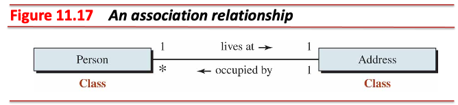

- 연관 관계는 두 클래스를 *is-related-to* 관계로 표현
  - A person *lives at* an address and the address *is occupied by* a person.
  - **사람과 주소는 *is-a* 관계가 될 수 없음**
  - 사람은 거주지 주소가 있고, 거주지는 거주자가 점유함
  - 서로 연관되는 관계이므로 *is-related-to* 관계임
- 연관 관계는 한 클래스가 다른 클래스의 객체를 데이터 멤버로 보유해 참조하는 관계
- 클래스 다이어그램에서 연관을 표현하는 방법
  1. 양방향 연관은 실선(`───`)으로 표현한다.
  2. 단방향 연관은 주체가 되는 클래스로부터 연관 되는 클래스를 향하여 화살표(`→`)로 표현한다.
  3. 필요하다면 화살표에 역할 이름(role name, e.g., `lives at`)을 표현한다.

---

## 연관 (Association) (Cont'd - 1)

### 다중성 (Multiplicity)

- 클래스 다이어그램 표현 시 연관 관계에 참여하는 객체의 수를 표현

|Key|Interpretation|
|-|-|
|`n`|Exactly *n* objects|
|`*`|Any number of objects including none|
|`0..1`|Zero or one object|
|`n..m`|A range from *n* to *m* objects|
|`n, m`|*n* or *m* objects|

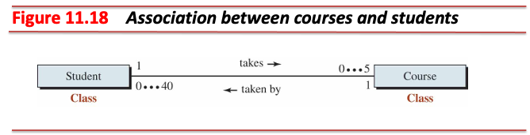

---

## 연관 (Association) (Cont'd - 2)

- A student can *take between 0 and 5* courses.

[//]: # (INCLUDE: ./cpp/05/snippet_association.cc --from 2 --to 21 --no-comment)

---

## 연관 (Association) (Cont'd - 3)

- A course can *be taken by between 0 and 40* students.

[//]: # (INCLUDE: ./cpp/05/snippet_association.cc --from 25 --to 45 --no-comment)

---

## 소유 (Aggregation)

> An aggregation is a special kind of association in which the relationship involves ownership.

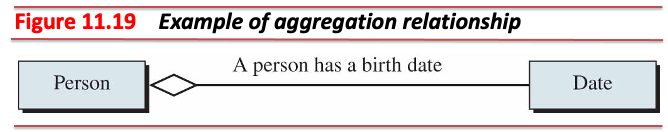

- 소유 관계는 두 클래스를 *has-a* 관계로 표현
  - A person *has a* birth date.
  - 소유하는 클래스는 주체 혹은 소유자(aggregator)
  - 소유되는 클래스는 대상 혹은 소유물(aggregatee)
  - 사람은 소유자이며, 생일은 소유물
- 클래스 다이어그램에서의 빈 마름모(`◇`)는 소유 관계에서의 소유자를 의미함
  - `Person` 클래스는 `Date` 객체를 데이터 멤버로 가짐
  - 표기: `Person ◇── Date`

---

## 소유 (Aggregation) (Cont'd - 1)

### 소유 특징

- 소유 관계는 *has-a* 관계이자 *one-to-many* 관계
  - 소유자는 다른 클래스의 여러 객체와 *has-a* 관계를 가질 수 있음
    - A person *has a* birth date.
    - A person *has multiple* email addresses.
    - A person *has multiple* addresses.
- **소유 관계에서 소유물의 생애 주기(lifetime)는 소유자의 생애 주기와 독립적**
  - 소유자와 소유물은 서로 독립적으로 생성되고 소멸될 수 있음

---

## 소유 (Aggregation) (Cont'd - 2)

### 소유 관계 예시

- `date.hpp`

[//]: # (INCLUDE: ./cpp/05/aggregation/date.hpp)

---

## 소유 (Aggregation) (Cont'd - 3)

- `date.cc`

[//]: # (INCLUDE: ./cpp/05/aggregation/date.cc)

---

## 소유 (Aggregation) (Cont'd - 4)

- `person.hpp`

[//]: # (INCLUDE: ./cpp/05/aggregation/person.hpp)

---

## 소유 (Aggregation) (Cont'd - 5)

- `main.cc`

[//]: # (INCLUDE: ./cpp/05/aggregation/main.cc)

---

## 구성 (Composition)

> A composition is a special kind of aggregation in which the lifetime of the containee depends on the lifetime of the container.

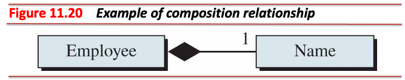

- 구성 관계는 두 클래스를 *consists-of* 관계로 표현
  - An employee *consists of* a name.
  - 구성하는 클래스는 주체 혹은 구성체(container)
  - 구성되는 클래스는 대상 혹은 구성요소(containee)
  - 직원은 구성체이며, 이름은 구성 요소
- 클래스 다이어그램에서의 속이 채워진 마름모(`◆`)는 구성 관계에서의 구성체를 의미함
  - `Employee` 클래스는 `Name` 객체를 데이터 멤버로 가짐
  - 표기: `Employee ◆── Name`

---

## 구성 (Composition) (Cont'd - 1)

### 구성 특징

- 구성 관계는 *consists-of* 관계이자 *one-to-many* 관계
  - 구성체는 다른 클래스의 여러 객체와 *consists-of* 관계를 가질 수 있음
    - An employee *consists of a* name.
    - An employee *consists of a* SSN (Social Security Number).
    - An employee *consists of a* personal record.
- **구성 관계에서 구성요소의 생애 주기는 구성체의 생애 주기와 종속적**
  - 구성체 생성 시 구성체의 구성요소도 같이 생성
  - 구성체 소멸 시 구성체의 구성요소도 같이 소멸

---

## 구성 (Composition) (Cont'd - 2)

### 구성 관계 예시

- `name.hpp`

[//]: # (INCLUDE: ./cpp/05/composition/name.hpp)

---

## 구성 (Composition) (Cont'd - 3)

- `name.cc`

[//]: # (INCLUDE: ./cpp/05/composition/name.cc)

---

## 구성 (Composition) (Cont'd - 4)

- `employee.hpp`

[//]: # (INCLUDE: ./cpp/05/composition/employee.hpp)

---

## 구성 (Composition) (Cont'd - 5)

- `employee.cc`

[//]: # (INCLUDE: ./cpp/05/composition/employee.cc)

---

## 구성 (Composition) (Cont'd - 6)

- `main.cc`

[//]: # (INCLUDE: ./cpp/05/composition/main.cc)

---

## 의존 (Dependency)

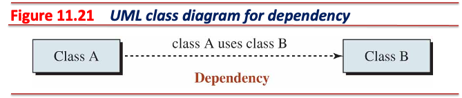

- 의존 관계는 두 클래스를 *uses-a* 관계로 표현
- 상속 혹은 연관(연관의 특별한 형태인 소유와 구성을 포함)보다 약한 관계
- 다음 경우들은 의존 관계:
  1. 한 클래스의 멤버 함수가 다른 클래스 타입 객체를 매개변수로 받는다.
  2. 한 클래스의 멤버 함수 반환 타입이 다른 클래스 타입이다.
  3. 한 클래스의 멤버 함수 내에 다른 클래스 타입 객체를 지역 변수로 사용한다.
  4. 한 클래스의 멤버 함수가 다른 클래스의 멤버 함수 혹은 정적 멤버 함수를 호출한다.
- 의존은 항상 단방향 관계이며, 주체가 되는 클래스로부터 의존하는 클래스를 향하여 점선 화살표(`--→`)로 표현

---

## 의존 (Dependency) (Cont'd)

### 의존 관계 예시: `MessageSender` *uses a* `User`

[//]: # (INCLUDE: ./cpp/05/dependency.cc --to 19 --no-comment)

---

## 클래스 다이어그램에서의 관계 표기법 정리

| 관계 유형 | 표기법 | 의미 | 예시 |
|---------|-------|------|------|
| 상속(Inheritance) | 속이 빈 삼각형 화살촉(`─▷`) | *is-a* 관계 | Student *is a* Person. |
| 연관(Association) | 실선(`──`)| 일반적인 관계 | Student *studies* Course. |
| 소유(Aggregation) | 빈 마름모가 있는 실선(`◇─>`)| *has-a* 관계 | University *has* Departments. |
| 구성(Composition) | 채워진 마름모가 있는 실선(`◆─>`)| *consists-of* 관계 | Employee *consists of* a Name. |
| 의존(Dependency) | 점선 화살표(`-→`) | *uses-a* 관계 | Function uses Parameters. |

---

## 시퀀스 다이어그램 (Sequence Diagram)

- UML 다이어그램 중 객체 간의 상호작용을 설명하는 다이어그램

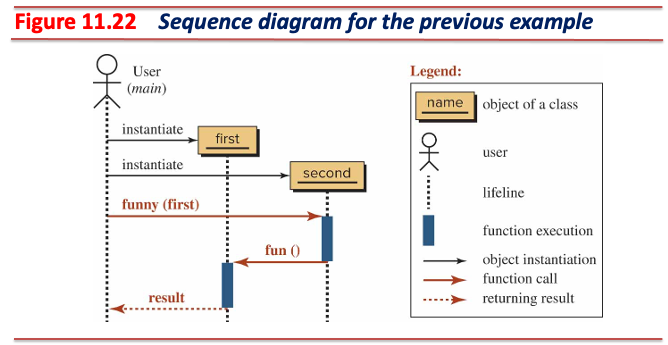

1. `main()` 함수에서 `first` 객체와 `second` 객체가 순차적으로 생성된다.
2. `main()` 함수에서 `second` 객체의 멤버 함수 `funny()`를 호출한다. 이때 `first` 객체를 전달인자로 넘겨준다.
3. `funny()` 함수 내부에서 매개변수 `first`를 호스트 객체로 사용하여 멤버 함수 `fun()`을 전달인자 없이 호출한다.
4. `fun()` 함수 내부에서 `result` 객체를 반환하여 `main()` 함수로 돌려준다.

---

## 복합 관계

### 판매된 제품 목록에 대한 청구서를 생성하는 프로그램

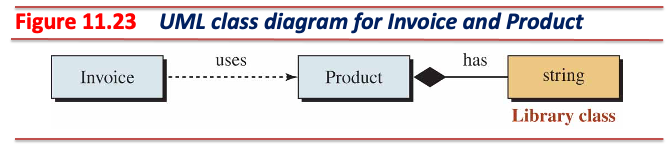

- `Invoice`와 `Product`는 의존 관계
  - An invoice *uses a* product.
- `Product`와 `std::string`은 구성 관계
  - A product *consists of* a string.

---

## 복합 관계 (Cont'd - 1)

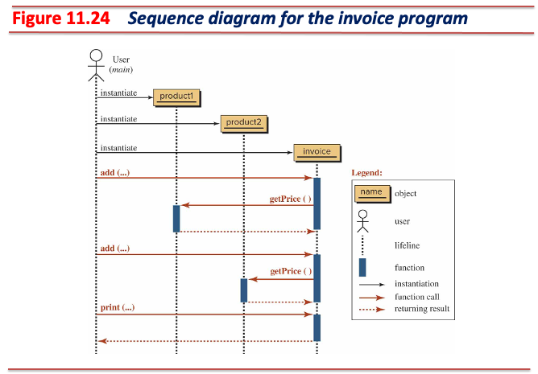

---

## 복합 관계 (Cont'd - 2)

- `product.hpp`

[//]: # (INCLUDE: ./cpp/05/complex/product.hpp)

---

## 복합 관계 (Cont'd - 3)

- `invoice.hpp`

[//]: # (INCLUDE: ./cpp/05/complex/invoice.hpp)

---

## 복합 관계 (Cont'd - 4)

- `main.cc`

[//]: # (INCLUDE: ./cpp/05/complex/main.cc)

---

## 복합 관계 (Cont'd - 5)

### 수강 신청 관리 프로그램

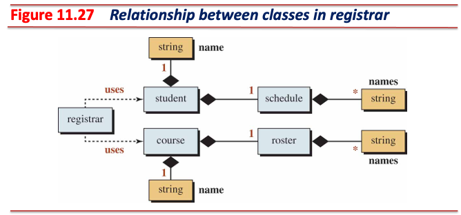

---

## 복합 관계 (Cont'd - 6)

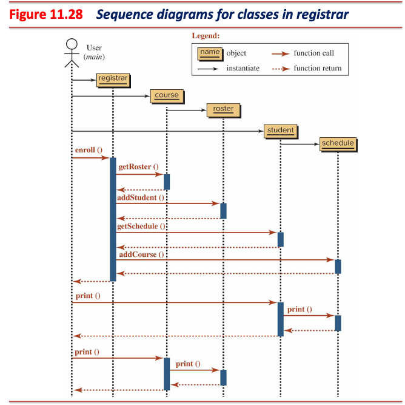

---

## 복합 관계 (Cont'd - 7)

- `course_roster.hpp`

[//]: # (INCLUDE: ./cpp/05/registrar/course_roster.hpp)

---

## 복합 관계 (Cont'd - 8)

- `course_roster.cc`

[//]: # (INCLUDE: ./cpp/05/registrar/course_roster.cc)

---

## 복합 관계 (Cont'd - 9)

- `course.hpp`

[//]: # (INCLUDE: ./cpp/05/registrar/course.hpp)

---

## 복합 관계 (Cont'd - 10)

- `course.cc`

[//]: # (INCLUDE: ./cpp/05/registrar/course.cc)

---

## 복합 관계 (Cont'd - 11)

- `student_schedule.hpp`

[//]: # (INCLUDE: ./cpp/05/registrar/student_schedule.hpp)

---

## 복합 관계 (Cont'd - 12)

- `student_schedule.cc`

[//]: # (INCLUDE: ./cpp/05/registrar/student_schedule.cc)

---

## 복합 관계 (Cont'd - 13)

- `student.hpp`

[//]: # (INCLUDE: ./cpp/05/registrar/student.hpp)

---

## 복합 관계 (Cont'd - 14)

- `student.cc`

[//]: # (INCLUDE: ./cpp/05/registrar/student.cc)

---

## 복합 관계 (Cont'd - 15)

- `registrar.hpp`

[//]: # (INCLUDE: ./cpp/05/registrar/registrar.hpp)

---

## 복합 관계 (Cont'd - 16)

- `main.cc`

[//]: # (INCLUDE: ./cpp/05/registrar/main.cc)
