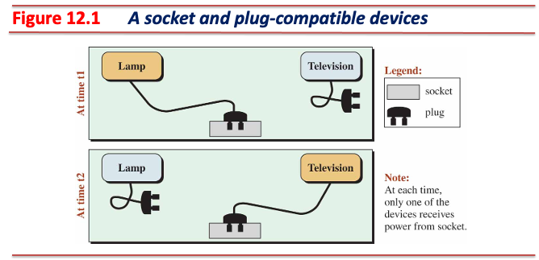
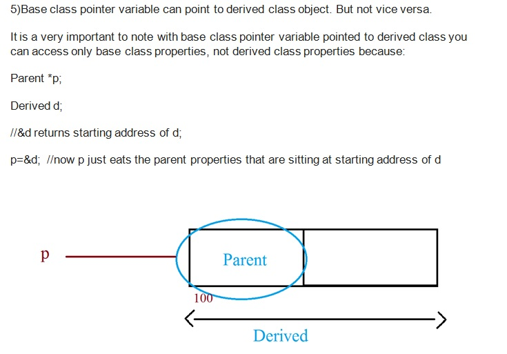
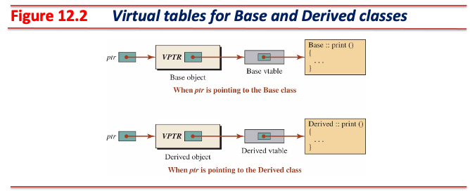
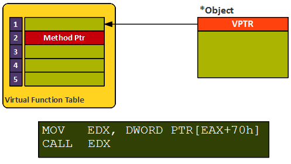
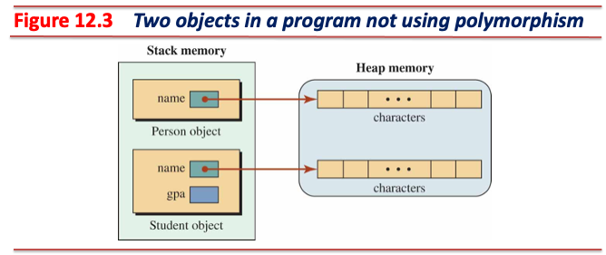
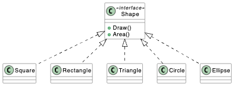
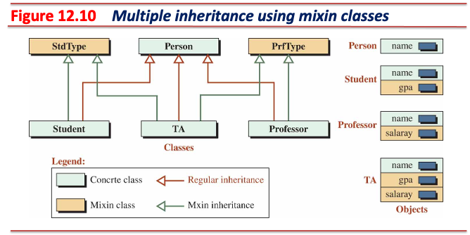

<!-- _class: lead -->
# 객체지향프로그래밍

## 다형성 (Polymorphism)

### [munseong.jeong@daejin.ac.kr](mailto:munseong.jeong@daejin.ac.kr)

---

## 현실 세계에서의 다형성 예: Plug-Compatible Objects



- 전자기기(e.g., 램프, 텔레비전)는 **전력**을 공급받기 위해 **표준 플러그**를 **표준 소켓**에 꽂아야 함
  - *At time t1*: 램프를 소켓에 연결
  - *At time t2*: 텔레비전을 소켓에 연결
- 각 전자기기는 소켓으로부터 전력을 공급받아 **해당 전자기기의 고유한 일을 수행**
  - 램프는 전기를 공급 받아 빛을 냄
  - 텔레비전은 전기를 공급 받아 화면에 영상을 출력하고 스피커를 통해 소리를 재생함

---

## 다형성

- **객체의 타입**에 따라 **동일한 인터페이스**로 **서로 다른 동작**을 실행할 수 있는 기능
  - 객체의 타입: 전자기기의 유형(램프, 텔레비전 등)
  - 동일한 인터페이스: 전자기기의 표준 플러그를 표준 소켓에 연결
  - 서로 다른 동작: 전력을 공급받아 각 전자기기가 수행하는 고유한 기능(빛 방출, 영상 표시 등)

### 다형성을 사용하기 위한 조건

- 기반 클래스 타입 포인터 혹은 참조
  - 예시에서의 **전자기기의 유형**
  - 포인터는 여러 타입의 객체를 가리킬 수 있어야 함
- 상속 계층구조(inheritance hierarchy)에 속하는 호환 가능한 객체(exchangeable objects)
  - 예시에서의 **표준 플러그**
  - 기반 클래스 타입 포인터는 상속 계층구조에 속하는 호환 객체를 가리킬 수 있음
- 기반 클래스 타입 포인터 또는 참조가 호환 객체를 가리킴
  - 예시에서의 **표준 플러그**를 **표준 소켓**에 꽂은 상태
- 가상 함수(virtual functions)
  - 예시에서의 **동일한 인터페이스**
  - 가상 함수는 자기 자신을 호출한 **객체의 타입**에 맞는 함수를 찾아 호출할 수 있음
  - **가상 함수를 정의한 클래스는 객체 생성 시 객체 내에 가상 포인터 멤버가 추가됨**
    - 가상 함수가 포함된 기반 클래스로부터 파생 클래스 타입 객체는 모두 가상 포인터를 가짐

---

## 다형성 (Cont'd - 1)

### 파생 클래스 타입 객체의 실체화 과정

1. 최상위 기반 클래스(`T0`)의 데이터 멤버(가상 포인터 포함)를 메모리에 할당
2. 첫 번째 레벨 파생 클래스(`T1`, first-level derived class)의 데이터 멤버를 메모리에 할당
3. 두 번째 레벨 파생 클래스(`T2`, second-level derived class)의 데이터 멤버를 메모리에 할당
4. 가장 하위 레벨의 파생 클래스까지 순차적으로 할당

```text
+------------+  <-- Base Address
| T0 members |    --> Base Class member (Size: sizeof(T0))
+------------+  <-- Base Address + sizeof(T0)
| T1 members |    --> 1st level additional member (Size: sizeof(T1) - sizeof(T0))
+------------+  <-- Base Address + sizeof(T1)
| T2 members |    --> 2nd level additional member (Size: sizeof(T2) - sizeof(T1))
+------------+  <-- Base Address + sizeof(T2)
| ...        |
+------------+  <-- Base Address + sizeof(T(n-1))
| Tn members |    --> n-level additional member (Size: sizeof(Tn) - sizeof(T(n-1)))
+------------+  <-- Base Address + sizeof(Tn)
```

---

## 다형성 (Cont'd - 2)



- **기반 클래스 타입 포인터는 기반 클래스를 상속한 모든 클래스 타입 객체(호환 객체)를 가리킬 수 있음**
  - 상속 계층에 속한 객체는 **기반 클래스 영역**을 포함함
  - 기반 클래스 타입 포인터가 파생 클래스 타입 객체를 가리키면 **기반 클래스 영역**을 선택할 수 있음
  - 이는 C++의 **타입 안전성(type safety)을 보장하는 중요한 특성**임

---

## 다형성 (Cont'd - 3)

### 정적 다형성 - 일반 함수 오버라이딩 (Non-virtual Function Override)

[//]: # (INCLUDE: ./cpp/06/static_polymorphism.cc)

---

## 다형성 (Cont'd - 4)

### 정적 다형성 동작 설명

- 정적 다형성 예제를 실행한 결과는 다음과 같음:

```text
Base::Print
Base::Print
```

- 컴파일러는 `ptr->Print()` 문장을 보고 두 가지 경우를 조사:
  1. 포인터가 기반 클래스 타입인가?
  2. 호출할 함수가 가상 함수인가?
  - 현재 `ptr`는 기반 클래스 타입 포인터이며, `Print()`는 가상 함수가 아님
- 포인터의 타입(기반 클래스)을 기준으로 `Base::Print()`를 호출
- 함수 호출 시 호출 대상이 **컴파일 시점에 결정**됨
  - **정적 바인딩(static binding)**
  - **컴파일 시간 바인딩(compile-time binding)**

---

## 다형성 (Cont'd - 5)

### 동적 다형성 - 가상 함수 오버라이딩 (Virtual Function Override)

[//]: # (INCLUDE: ./cpp/06/dynamic_polymorphism.cc)

---

## 다형성 (Cont'd - 6)

### 동적 다형성 동작 설명

- 동적 다형성 예제를 실행한 결과는 다음과 같음:

```text
Base::Print
Derived::Print
```

- 컴파일러는 `ptr->Print()` 문장을 보고 포인터가 기반 클래스 타입인지, 호출할 함수가 가상 함수인지 확인
  - 현재 `ptr`는 기반 클래스 타입 포인터이며, `Print()`는 가상 함수임
- 런타임에 포인터가 가리키는 객체의 가상 포인터가 가리키는 가상 테이블을 통해 `Derived::Print()` 호출
- 가상 함수는 **런타임 시점에 함수를 호출한 객체의 실제 형에 따라 적절한 함수를 선택할 수 있도록 설계됨**
- 함수 호출 시 호출 대상이 **런타임 시점에 결정**됨
  - **동적 바인딩(dynamic binding)**
  - **런타임 바인딩(run-time binding)**

### 가상 함수 (Virtual Functions)

- 기반 클래스에서 선언되고 파생 클래스에서 오버라이딩(override)될 수 있는 함수
- 가상 테이블과 가상 포인터의 도움을 받아 **런타임 시점에 호출될 함수를 결정**할 수 있음

---

## 다형성 (Cont'd - 7)

### 가상 테이블 (Virtual Tables)

- 상속 계층 구조에 속한 클래스가 **가상 함수를 사용할 경우 컴파일 시점에 생성되는 테이블**
  - 만약 가상 함수를 사용하지 않는다면 가상 테이블(`vtable`)은 생성되지 않음
- **객체가 호출한 함수가 가상 함수라면, 객체의 실제 형에 해당하는 가상 테이블을 참조함**
  - 가상 테이블은 객체가 실제로 호출할 수 있는 가상 함수들의 주소를 저장한 함수 포인터 배열
  - **각 클래스는 자신만의 고유한 가상 테이블을 가지며**, 같은 클래스의 모든 객체들이 이 하나의 테이블을 공유함
  - **런타임 시점**에 객체의 실제 형에 따라 호출될 함수를 결정할 수 있음



---

## 다형성 (Cont'd - 8)

### 가상 포인터 (Virtual Pointers)

- 가상 테이블은 상속 계층에 가상 함수가 하나 이상 존재할 때 생성됨
- 가상 함수를 가진 클래스의 객체는 해당 클래스의 가상 테이블을 가리키는 가상 포인터(`vptr`)를 내부에 포함함
  - 클래스에 속하는 것이 아닌 **객체에만 존재하는 포인터**로, **컴파일러에 의해 자동 추가되는 숨겨진 멤버**
  - **가상 포인터는 객체가 생성될 때, 객체의 가상 포인터가 객체 클래스의 가상 테이블을 가리키도록 초기화됨**
    - C++ 다형성의 핵심 메커니즘
- 객체에 가상 포인터가 추가된다면 **실체화된 객체의 가장 낮은 메모리 번지에 위치**하게 됨



---

## 다형성 (Cont'd - 9)

### 가상 함수 사용 방법

[//]: # (INCLUDE: ./cpp/06/dynamic_polymorphism.cc --from 3 --to 11 --no-comment)

- `virtual` 키워드를 사용한 멤버 함수는 가상 함수가 됨
  - 상속 계층에서 오버라이딩(override)될 수 있음
  - 기반 포인터 또는 참조를 통해 호출 시 동적 바인딩 기회를 얻음
  - `virtual` 키워드는 멤버 함수 선언부에만 사용하면 됨
- 기반 클래스의 가상 함수를 파생 클래스에서 오버라이딩하려면 `override` 키워드를 사용하면 됨
  - `override` 키워드를 사용한 멤버 함수는 컴파일러에게 해당 멤버 함수를 오버라이딩함을 명시적으로 알림
  - 오버라이딩할 멤버 함수의 시그니처는 기반 클래스의 가상 함수 시그니처와 정확히 일치해야 함

---

## 다형성 (Cont'd - 10)

### `virtual` 키워드를 사용한 멤버 함수 오버라이딩

[//]: # (INCLUDE: ./cpp/06/snippet_virtual_function.cc --from 2 --to 19 --no-comment)

- **`virtual` 키워드를 사용하는 것 보다는 `override` 키워드를 사용할 것을 적극 권장**

---

## 다형성 (Cont'd - 11)

### 가상 테이블과 가상 포인터의 메커니즘

- 가상 테이블에는 **가상 함수가 선언된 순서대로 함수 포인터가 등록됨**
- 가상 테이블은 컴파일 시 생성되고, 가상 포인터는 런타임 시(객체 생성 시) 설정됨
- 다형성 조건을 만족한 상태에서 가상 함수 호출 시, 가상 포인터가 가리키는 가상 테이블에서 실제 함수 주소를 찾아 실행함

[//]: # (INCLUDE: ./cpp/06/snippet_poly_11.cc)

---

## 다형성 (Cont'd - 12)


- 가상 테이블 구조와 구현은 컴파일러와 플랫폼에 따라 세부적인 차이가 있지만, 기본 원리는 동일함:
  1. 컴파일 시점에 가상 함수를 포함하는 **각 클래스마다 하나의 가상 테이블(`vtable`)이 생성**된다.
  2. 같은 클래스의 모든 객체는 하나의 가상 테이블을 공유한다(**각 객체마다 테이블이 생성되는 것이 아님**).
  3. 런타임 시 각 객체는 내부에 가상 포인터(`vptr`)를 포함한 채 실체화된다.
  4. 객체의 가상 포인터는 해당 객체의 클래스에 해당하는 가상 테이블을 가리킨다.

---

## 다형성 (Cont'd - 13)

### 가상 생성자와 가상 소멸자

- **생성자는 가상화할 수 없음**
  1. **생성자는 클래스마다 이름이 다르다.**
      - 함수 시그니처 불일치로 오버라이드 자체가 불가능
      - 생성자 간 가상 함수 테이블을 통한 동적 연결 구조가 존재하지 않음
  2. **가상 함수 메커니즘은 완전히 생성된 객체를 전제로 한다.**
      - 생성자는 객체를 생성하는 함수이며, 객체가 아직 존재하지 않은 상태
      - 동적 바인딩을 하기 위해서는 객체의 가상 포인터를 사용해야 하지만, 객체는 아직 준비되지 않은 상태
- **소멸자는 가상화 가능하며, 다형성 클래스에서는 필수**
  1. **소멸자는 이름이 달라도 가상화가 가능하다.**
      - 각 클래스의 소멸자는 객체 소멸 시점에 자동으로 호출되는 유일한 함수
      - 이름이 다르지만 "소멸 작업"이라는 동일한 목적을 가지는 특별한 함수이므로, 가상 함수 메커니즘으로 연결 가능
      - 소멸 시점에는 객체와 가상 포인터가 여전히 유효하므로 동적 바인딩 가능
  2. **다형성 사용 시 가상 소멸자는 필수다.**
      - 가상 함수를 하나라도 가진 클래스는 반드시 가상 소멸자를 선언해야 함
      - 가상 소멸자를 사용하지 않으면, 기반 클래스 포인터로 파생 클래스 객체 삭제 시 **항상 기반 클래스 소멸자만 호출됨**
        - 이로 인해 파생 클래스에서 할당한 자원이 해제되지 않아 **메모리 누수 발생**

---

## 다형성 (Cont'd - 14)

### 다형성을 사용하지 않는 상황에서의 소멸



- 각 클래스 타입 객체가 스택 영역에 할당되었다가 소멸될 경우 소멸자에 의해 올바르게 자원 반환
  - 런타임 시스템은 객체가 소멸되어야 할 경우 자동으로 해당 객체 타입의 소멸자를 자동 호출함
    - 기반 클래스 타입 객체: 기반 클래스 소멸자 호출
    - 파생 클래스 타입 객체: 파생 클래스 소멸자 → 기반 클래스 소멸자 호출
  - **메모리 누수(memory leak) 없음**

---

## 다형성 (Cont'd - 15)

### 다형성을 사용하는 상황에서 일반 소멸자를 사용하는 경우


---

## 다형성 (Cont'd - 16)

[//]: # (INCLUDE: ./cpp/06/snippet_poly_16.cc --from 3 --to 17 --no-comment)

[//]: # (INCLUDE: ./cpp/06/snippet_poly_16.cc --from 20 --to 23 --no-comment)

---

## 다형성 (Cont'd - 17)

### 다형성을 사용하는 상황에서 가상 소멸자를 사용하는 경우


- **가상 소멸자는 가상 테이블에 등록되어 동적 바인딩됨**
  - `delete` 시 가상 포인터를 통해 파생 클래스 소멸자 호출
  - 이후 각 소멸자가 순차적으로 가상 포인터를 상위 클래스의 가상 테이블로 갱신하며 기반 클래스까지 **연쇄 호출**

---

## 다형성 (Cont'd - 18)

[//]: # (INCLUDE: ./cpp/06/snippet_poly_18.cc --from 3 --to 17 --no-comment)

[//]: # (INCLUDE: ./cpp/06/snippet_poly_18.cc --from 20 --to 22 --no-comment)

---

## 다형성 (Cont'd - 19)

### 다형성을 사용하는 상황에서 가상 소멸자를 사용한 예시

- `person.hpp`

[//]: # (INCLUDE: ./cpp/06/poly/person.hpp)

---

## 다형성 (Cont'd - 20)

- `person.cc`

[//]: # (INCLUDE: ./cpp/06/poly/person.cc)

---

## 다형성 (Cont'd - 21)

- `student.hpp`

[//]: # (INCLUDE: ./cpp/06/poly/student.hpp)

---

## 다형성 (Cont'd - 22)

- `student.cc`

[//]: # (INCLUDE: ./cpp/06/poly/student.cc)

---

## 다형성 (Cont'd - 23)

- `main.cc`

[//]: # (INCLUDE: ./cpp/06/poly/main.cc)

---

## 런타임 타입 정보 (RTTI, Run-Time Type Information)

- 런타임 시점에 객체의 실제 타입을 확인해야 하는 경우가 있음:
  - 다형성을 사용하는 복잡한 프로그램
  - 특정 형에 따라 다른 처리를 해야 할 때
- C++은 `<typeinfo>` 헤더를 통해 **런타임 타입 정보(RTTI)를 얻을 수 있는 기능을 제공**함
  - `typeid` 연산자: 표현식의 타입 정보를 반환하는 연산자, 평가 결과는 `type_info` 타입

[//]: # (INCLUDE: ./cpp/06/rtti.cc --to 13)

---

## 런타임 타입 정보 (RTTI, Run-Time Type Information) (Cont'd)

[//]: # (INCLUDE: ./cpp/06/rtti.cc --from 15)

---

## 타입 변환 (Type Casting)

- C++에서의 타입 변환 방법은 4가지(강한 타입 변환 규칙, explicit casting rules):
  1. `static_cast`
  2. `reinterpret_cast`
  3. `const_cast`
  4. `dynamic_cast`

### `static_cast`

- 컴파일 시점에 수행되는 타입 변환
- 다양한 타입 변환을 수행할 수 있으며, 컴파일 시점에 변환 가능성을 검사함
- 완전히 무관한 타입 간의 변환(e.g., `int*` → `float*`)은 컴파일 오류
- **객체의 값이 변경됨**(메모리에 있는 객체의 비트 패턴이 수정됨)

[//]: # (INCLUDE: ./cpp/06/casting.cc --from 3 --to 10 --no-comment)

---

## 타입 변환 (Type Casting) (Cont'd - 1)

### `reinterpret_cast`

- 컴파일 시점에 수행되는 타입 변환
- **객체의 값을 변경하지 않고** 해당 객체의 평가 방법만 변경하며, 주로 제네릭 포인터(`void*`)의 평가 방법을 지정할 때 활용
  - 인접한 메모리 영역을 침범할 수 있음

[//]: # (INCLUDE: ./cpp/06/casting.cc --from 14 --to 28 --no-comment)

---

## 타입 변환 (Type Casting) (Cont'd - 2)

### `const_cast`

- 컴파일 시점에 수행되는 타입 변환
- 객체의 상수성(`const`)이나 휘발성(`volatile`)을 제거한 타입으로 변환
- 원본 객체가 상수성이나 휘발성을 갖고 있을 때, `const_cast`로 해당 특성을 제거한 후 **해당 객체를 수정하면** **정의되지 않은 동작**임

[//]: # (INCLUDE: ./cpp/06/casting.cc --from 32 --to 43 --no-comment)

---

## 타입 변환 (Type Casting) (Cont'd - 3)

### `dynamic_cast`

- 런타임 시점에 수행되는 타입 변환
- **다운 캐스팅**을 명시적으로 수행할 때 사용

#### 다운 캐스팅 (Downcasting)

- 런타임 시점에 `dynamic_cast`를 통해 기반 클래스 포인터 또는 참조를 파생 클래스 포인터 또는 참조로 변환
  - 범위를 기반 클래스에서 파생 클래스로 확장하여, 파생 클래스 고유 멤버 접근 가능
- **다형성 환경에서 객체가 특정 파생 클래스 타입인지 확인하고 접근할 때 사용**
- 잘못된 변환 시 실패 가능하므로, **명시적 타입 변환 필요**

#### 업 캐스팅 (Upcasting)

- 컴파일 타임에 타입 파생 클래스 포인터(또는 참조)를 기반 클래스 포인터(또는 참조)로 변환
  - 범위를 파생 클래스에서 기반 클래스로 축소하여, 기반 클래스 멤버만 접근 가능
- **기반 클래스의 공통 인터페이스를 통한 다형성 구현**
- 모든 파생 클래스는 기반 클래스를 포함해 항상 안전하므로, **암묵적 타입 변환 허용**

---

## 타입 변환 (Type Casting) (Cont'd - 4)

### 암묵적 업 캐스팅 - 다형성

[//]: # (INCLUDE: ./cpp/06/upcasting.cc)

---

## 타입 변환 (Type Casting) (Cont'd - 5)

### `dynamic_cast`를 사용한 명시적 다운 캐스팅 - 올바른 변환

[//]: # (INCLUDE: ./cpp/06/downcasting.cc)

---

## 타입 변환 (Type Casting) (Cont'd - 6)

### `dynamic_cast`를 사용한 명시적 다운 캐스팅 - 잘못된 변환

[//]: # (INCLUDE: ./cpp/06/downcasting_failure.cc)

---

## 추상 클래스 (Abstract Classes)

- 하나 이상의 순수 가상 함수를 포함하는 클래스
- 추상 클래스는 이를 상속 받는 모든 클래스에게 **특정 멤버 함수의 구현을 강제할 수 있음**

### 순수 가상 함수 (Pure Virtual Functions)

- 구현이 없는 특별한 가상 함수로, 파생 클래스가 반드시 구현(오버라이딩)해야 하는 함수
- 순수 가상 함수가 하나라도 포함된 클래스는 **추상 클래스**가 됨
- 추상 클래스 객체는 **직접 생성(인스턴스화) 할 수 없음**
  - 추상 클래스를 상속한 파생 클래스는 **상속된 순수 가상 함수를 모두 구현**해야 파생 클래스 객체 실체화가 가능함
  - 구현하지 않은 순수 가상 함수가 하나라도 존재할 경우, 해당 파생 클래스도 추상 클래스가 됨
- 메서드에 순수 가상 지정자(pure virtual specifier) 구문을 사용하면 해당 메서드는 순수 가상 함수가 됨

[//]: # (INCLUDE: ./cpp/06/pure_virtual.cc)

---

## 인터페이스 (Interfaces)

- **클래스의 모든 멤버 함수가 순수 가상 함수인 특수한 추상 클래스**
  - 일반적으로 가상 소멸자만 구현부를 가지며, 데이터 멤버는 포함하지 않거나 최소한만 포함
  - **가상 소멸자는 기반 포인터를 통한 다형적 삭제 시 안전성을 보장하기 위해 필수**
- 상속하는 클래스에게 표준화된 공통 인터페이스(청사진)를 제공하기 위해 사용
  - 상속하는 클래스에게 반드시 구현해야 할 기능들을 강제하기 위함
- 다형성을 안전하게 활용할 수 있는 기반 제공:
  - 모든 메서드가 순수 가상 함수로 선언되어 **구현 클래스가 반드시 동일한 인터페이스를 따름**
  - 컴파일 시점에 타입 호환성이 검증되어 런타임 오류 가능성을 최소화함
  - 기반 클래스 포인터를 통해 다양한 파생 클래스 객체들을 **일관된 방식**으로 안전하게 조작할 수 있음


---

## 인터페이스 (Interfaces) (Cont'd - 1)

### 클래스 다이어그램에서의 인터페이스 표현 방법



- 점선 + 속이 빈 화살촉(realization 관계)
  - The `Square` class **implements** the `Shape` interface.
  - The `Square` class **realizes** the `Shape` interface.
- 클래스 기호 내 `<<interface>>` 표시해 인터페이스임을 표현

---

## 인터페이스 (Interfaces) (Cont'd - 2)

### 인터페이스 예시

- `shape.hpp`

[//]: # (INCLUDE: ./cpp/06/interface/shape.hpp)

---

## 인터페이스 (Interfaces) (Cont'd - 3)

- `square.hpp`

[//]: # (INCLUDE: ./cpp/06/interface/square.hpp)

---

## 인터페이스 (Interfaces) (Cont'd - 4)

- `square.cc`

[//]: # (INCLUDE: ./cpp/06/interface/square.cc)

---

## 인터페이스 (Interfaces) (Cont'd - 5)

- `rectangle.hpp`

[//]: # (INCLUDE: ./cpp/06/interface/rectangle.hpp)

---

## 인터페이스 (Interfaces) (Cont'd - 6)

- `rectangle.cc`

[//]: # (INCLUDE: ./cpp/06/interface/rectangle.cc)

---

## 인터페이스 (Interfaces) (Cont'd - 7)

- `triangle.hpp`

[//]: # (INCLUDE: ./cpp/06/interface/triangle.hpp)

---

## 인터페이스 (Interfaces) (Cont'd - 8)

- `triangle.cc`

[//]: # (INCLUDE: ./cpp/06/interface/triangle.cc --to 20)

---

## 인터페이스 (Interfaces) (Cont'd - 9)

[//]: # (INCLUDE: ./cpp/06/interface/triangle.cc --from 22)

---

## 인터페이스 (Interfaces) (Cont'd - 10)

- `circle.hpp`

[//]: # (INCLUDE: ./cpp/06/interface/circle.hpp)

---

## 인터페이스 (Interfaces) (Cont'd - 11)

- `circle.cc`

[//]: # (INCLUDE: ./cpp/06/interface/circle.cc)

---

## 인터페이스 (Interfaces) (Cont'd - 12)

- `ellipse.hpp`

[//]: # (INCLUDE: ./cpp/06/interface/ellipse.hpp)

---

## 인터페이스 (Interfaces) (Cont'd - 13)

- `ellipse.cc`

[//]: # (INCLUDE: ./cpp/06/interface/ellipse.cc)

---

## 인터페이스 (Interfaces) (Cont'd - 14)

- `main.cc`

[//]: # (INCLUDE: ./cpp/06/interface/main.cc --to 18)

---

## 인터페이스 (Interfaces) (Cont'd - 15)

[//]: # (INCLUDE: ./cpp/06/interface/main.cc --from 20)

---

## 다중 상속 (Multiple Inheritance)


- 상속 형태가 다이아몬드 상속(diamond inheritance)일 경우 **기반 클래스 내용이 중복 상속될 수 있음**
  - 모호성(ambiguity)과 중복 데이터 문제가 발생함
  - e.g., `Person` 기반의 `Student`, `Professor`를 상속받는 `TA`는 두 개의 `name`을 멤버로 가지게 됨
- 해결 방법:
  - 가상 기반(virtual base) 클래스 사용: 다중 상속 시 공통 기본 클래스의 중복을 방지하기 위해 `virtual` 키워드로 지정한 상속 형태
  - 믹스인 클래스(mixin class) 패턴 사용

---

## 다중 상속 (Multiple Inheritance) (Cont'd - 1)

### 가상 기반 (Virtual Base)


- `virtual` 키워드를 사용해 상속하면 클래스 객체 생성 과정이 변경됨:
  1. 가상 기반 클래스의 멤버를 먼저 생성한다(단 한 번만).
  2. 나머지 클래스들의 멤버를 생성한다.
  - 최종 파생 클래스 내에서 가상 기반 클래스의 멤버는 **중복되지 않음**
- 가상 기반 클래스는 가상 기반 포인터(`vbptr`)와 가상 기반 테이블(`vbtable`)을 사용하여 구현

---

## 다중 상속 (Multiple Inheritance) (Cont'd - 2)

### 메모리 레이아웃을 통한 가상 상속 메커니즘 설명

- **전제 조건**

> Integer size : 2 bytes
> Pointer size : 2 bytes
> Endian       : Little endian(최하위 바이트 먼저 저장)

### 1-1. `Base` 클래스

[//]: # (INCLUDE: ./cpp/06/virtual_base.cc --to 7 --no-comment)

- `Base` 클래스는 가상 함수를 가지므로 `vptr`이 객체의 시작 부분에 위치
  - `vptr`은 `vtable` (0x2000)을 가리키며, `vtable`에는 `Base::FuncBase()`의 구현이 저장됨
- 멤버 변수 `value`는 `vptr` 다음에 위치

---

## 다중 상속 (Multiple Inheritance) (Cont'd - 3)

### 1-2. `Base` 객체 메모리 레이아웃

```text
주소      내용(16진수)    설명
0x1000   00 20         vptr_Base (가상 함수 테이블 0x2000을 가리킴)
0x1002   00 00         int value (값 0으로 초기화)
== [가상 함수 테이블] ==
0x2000   00 30         Base::FuncBase() 함수 포인터 (0x3000)
```

---

## 다중 상속 (Multiple Inheritance) (Cont'd - 4)

### 2-1. `Derived1` 클래스

[//]: # (INCLUDE: ./cpp/06/virtual_base.cc --from 9 --to 13 --no-comment)

- `virtual` 키워드로 `Base`를 상속하면 **두 개의 포인터**가 생성됨:
  - `vptr_Derived1`: `Derived1` 자신의 가상 함수 테이블을 가리킴
  - `vbptr_Derived1`: 가상 기반 테이블(`vbtable`)을 가리킴
- 가상 기반 클래스의 서브객체(subobject, `Base` 객체)는 **파생 클래스 객체의 끝 부분에 배치됨**
- `vbtable`에는 현재 위치에서 `Base` 서브객체까지의 오프셋(+4 바이트)이 저장됨
  - `vptr_Derived1 (2) + vbptr_Derived1 (2) = 4`
- `Derived1`이 `FuncBase()`를 **오버라이딩**했으므로 `vtable`에는 **새로운 구현의 주소**가 저장됨

---

## 다중 상속 (Multiple Inheritance) (Cont'd - 5)

### 2-2. `Derived1` 객체 메모리 레이아웃

```text
주소      내용(16진수)    설명
0x1100   00 22         vptr_Derived1 (Derived1의 가상 함수 테이블 0x2200을 가리킴)
0x1102   00 21         vbptr_Derived1 (가상 기반 테이블 0x2100을 가리킴)
                       // Derived1 고유 멤버 영역 (없음)
                       // 가상 기반 Base 서브객체 (객체 끝 부분에 위치)
0x1104   00 20         vptr_Base (Base의 가상 함수 테이블 0x2000을 가리킴)
0x1106   00 00         int value (값 0으로 초기화)
== [가상 기반 테이블] ==
0x2100   04 00         Base 서브객체로의 오프셋 (+4 바이트, 0x1100에서 0x1104까지)
== [가상 함수 테이블] ==
0x2200   00 31         Derived1::FuncBase() 함수 포인터 (0x3100)
0x2202   00 32         Derived1::FuncDerived1() 함수 포인터 (0x3200)
```

- `Derived1` 객체에서 `value` 접근 과정:
  1. `Derived1`은 가상 기반과 가상 함수를 사용하므로, `this` 포인터(`vptr`)의 다음 요소(`vbptr`)를 역참조해 가상 기반 테이블(`vbtable`)에 접근한다.
  2. `this` 포인터에 가상 기반 테이블의 오프셋(+4)을 더한다.
  3. `Base`는 가상 함수를 사용하므로, `this + 4` (`Base`의 `vptr`)의 다음 요소에 접근한다.

---

## 다중 상속 (Multiple Inheritance) (Cont'd - 6)

### 3-1. `Derived2` 클래스

[//]: # (INCLUDE: ./cpp/06/virtual_base.cc --from 15 --to 18 --no-comment)

- `Derived1`과 동일한 구조를 가짐
- `Derived2`는 `FuncBase()`를 **오버라이딩하지 않았으므로** `vtable`에는 `Base`의 **원래 구현 주소**가 저장됨
- `Base` 서브객체 역시 끝 부분에 배치되며, `vbtable`을 통해 접근함

---

## 다중 상속 (Multiple Inheritance) (Cont'd - 7)

### 3-2. `Derived2` 객체 메모리 레이아웃

```text
주소      내용(16진수)    설명
0x1200   00 24         vptr_Derived2 (Derived2의 가상 함수 테이블 0x2400을 가리킴)
0x1202   00 23         vbptr_Derived2 (가상 기반 테이블 0x2300을 가리킴)
                       // Derived2 고유 멤버 영역 (없음)
                       // 가상 기반 Base 서브객체 (끝 부분)
0x1204   00 20         vptr_Base (Base의 가상 함수 테이블 0x2000을 가리킴)
0x1206   00 00         int value (값 0으로 초기화)
== [가상 기반 테이블] ==
0x2300   04 00         Base 서브객체로의 오프셋 (+4 바이트)
== [가상 함수 테이블] ==
0x2400   00 30         Base::FuncBase() 함수 포인터 (0x3000) - 오버라이딩 안 함
0x2402   00 33         Derived2::FuncDerived2() 함수 포인터 (0x3300)
```

- `Derived2` 객체에서 `value` 접근 과정:
  1. `Derived2`는 가상 기반과 가상 함수를 사용하므로, `this` 포인터(`vptr`)의 다음 요소(`vbptr`)를 역참조해 가상 기반 테이블(`vbtable`)에 접근한다.
  2. `this` 포인터에 가상 기반 테이블의 오프셋(+4)을 더한다.
  3. `Base`는 가상 함수를 사용하므로, `this + 4` (`Base`의 `vptr`)의 다음 요소에 접근한다.

---

## 다중 상속 (Multiple Inheritance) (Cont'd - 8)

### 4-1. `MostDerived` 클래스

[//]: # (INCLUDE: ./cpp/06/virtual_base.cc --from 20 --to 25 --no-comment)

- `Derived1`과 `Derived2`가 모두 `Base`를 가상 상속했으므로, `Base` 서브객체는 `MostDerived` 내에 **단 한 번** 존재
  - `Base` 서브객체는 객체의 가장 끝 부분(0x1308)에 배치됨
- `MostDerived`는 두 쌍의 `vptr` / `vbptr`을 가짐(각 기반 클래스용)
  - 상속 순서가 `Derived1`, `Derived2` 순서이므로, `Derived1` 멤버를 객체에 우선 실체화함
  - `vptr_Derived1`: `Derived1` 서브객체용, `vbptr_Derived1`: `Base` 서브 객체까지의 오프셋(+8 바이트)
    - `vptr_Derived1 + vbptr_Derived1 + vptr_Derived2 + vbptr_Derived2 = 8`
  - `vptr_Derived2`: `Derived2` 서브객체용, `vbptr_Derived2`: `Base` 서브 객체까지의 오프셋(+4 바이트)
    - `vptr_Derived2 + vbptr_Derived2 = 4`
  - `vptr_Derived1`은 `MostDerived` 객체의 **주 가상 테이블(primary `vtable`)을 가리키는 포인터**가 됨
    - `MostDerived::FuncMostDerived()`는 주 가상 테이블인 0x2500에만 존재함
- `thunk`: 컴파일러가 자동으로 생성하는 `this` 포인터 조정 및 실제 함수 호출을 중계하는 역할의 코드 조각

---

## 다중 상속 (Multiple Inheritance) (Cont'd - 9)

### 4-2. `MostDerived` 객체 메모리 레이아웃

```text
주소      내용(16진수)    설명
                       // Derived1 서브객체 부분
0x1300   00 25         vptr_Derived1 (MostDerived/Derived1 테이블 0x2500을 가리킴)
0x1302   00 27         vbptr_Derived1 (가상 기반 테이블 0x2700을 가리킴)
                       // Derived2 서브객체 부분
0x1304   00 26         vptr_Derived2 (MostDerived/Derived2 테이블 0x2600을 가리킴)
0x1306   00 28         vbptr_Derived2 (가상 기반 테이블 0x2800을 가리킴)
                       // MostDerived 내부의 공유된 Base 서브객체 (끝 부분)
0x1308   00 20         vptr_Base (Base의 가상 함수 테이블 0x2000을 가리킴)
0x130A   00 00         int value (값 0으로 초기화)
== [Derived1용 가상 기반 테이블] ==
0x2700   08 00         Base 서브객체로의 오프셋 (+8 바이트, 0x1300에서 0x1308까지)
== [Derived2용 가상 기반 테이블] ==
0x2800   04 00         Base 서브객체로의 오프셋 (+4 바이트, 0x1304에서 0x1308까지)
== [Derived1 경로의 가상 함수 테이블] ==
0x2500   00 34         MostDerived::FuncBase() 함수 포인터 (0x3400)
0x2502   00 35         MostDerived::FuncDerived1() 함수 포인터 (0x3500)
0x2504   00 36         MostDerived::FuncMostDerived() 함수 포인터 (0x3600)
== [Derived2 경로의 가상 함수 테이블] ==
0x2600   00 37         MostDerived::FuncBase() thunk (this 포인터 조정 후 0x3400 호출)
0x2602   00 33         Derived2::FuncDerived2() 함수 포인터 (0x3300)
```

---

## 다중 상속 (Multiple Inheritance) (Cont'd - 10)

### `MostDerived` 객체 바인딩 과정

[//]: # (INCLUDE: ./cpp/06/virtual_base.cc --from 94 --to 114 --no-comment)

---

## 다중 상속 (Multiple Inheritance) (Cont'd - 11)

### 가상 기반 예시

- `person.hpp`

[//]: # (INCLUDE: ./cpp/06/virtual_base/person.hpp)

---

## 다중 상속 (Multiple Inheritance) (Cont'd - 12)

- `person.cc`

[//]: # (INCLUDE: ./cpp/06/virtual_base/person.cc)

---

## 다중 상속 (Multiple Inheritance) (Cont'd - 13)

- `student.hpp`

[//]: # (INCLUDE: ./cpp/06/virtual_base/student.hpp)

---

## 다중 상속 (Multiple Inheritance) (Cont'd - 14)

- `student.cc`

[//]: # (INCLUDE: ./cpp/06/virtual_base/student.cc)

---

## 다중 상속 (Multiple Inheritance) (Cont'd - 15)

- `professor.hpp`

[//]: # (INCLUDE: ./cpp/06/virtual_base/professor.hpp)

---

## 다중 상속 (Multiple Inheritance) (Cont'd - 16)

- `professor.cc`

[//]: # (INCLUDE: ./cpp/06/virtual_base/professor.cc)

---

## 다중 상속 (Multiple Inheritance) (Cont'd - 17)

- `ta.hpp`

[//]: # (INCLUDE: ./cpp/06/virtual_base/ta.hpp)

---

## 다중 상속 (Multiple Inheritance) (Cont'd - 18)

- `ta.cc`

[//]: # (INCLUDE: ./cpp/06/virtual_base/ta.cc)

---

## 다중 상속 (Multiple Inheritance) (Cont'd - 19)

- `main.cc`

[//]: # (INCLUDE: ./cpp/06/virtual_base/main.cc)

---

## 다중 상속 (Multiple Inheritance) (Cont'd - 20)

### 믹스인 클래스

- **추상 클래스 또는 인터페이스를 사용해 이를 상속하는 클래스에 속성을 주입하는 패턴**
- 속성 주입 목적의 인터페이스를 상속한 클래스는 **주입받은 속성을 구현해야만 실체화**할 수 있음



---

## 다중 상속 (Multiple Inheritance) (Cont'd - 21)

- `stdtype.hpp`

[//]: # (INCLUDE: ./cpp/06/mixin/stdtype.hpp)

---

## 다중 상속 (Multiple Inheritance) (Cont'd - 22)

- `prftype.hpp`

[//]: # (INCLUDE: ./cpp/06/mixin/prftype.hpp)

---

## 다중 상속 (Multiple Inheritance) (Cont'd - 23)

- `person.hpp`

[//]: # (INCLUDE: ./cpp/06/mixin/person.hpp)

---

## 다중 상속 (Multiple Inheritance) (Cont'd - 24)

- `person.cc`

[//]: # (INCLUDE: ./cpp/06/mixin/person.cc)

---

## 다중 상속 (Multiple Inheritance) (Cont'd - 25)

- `student.hpp`

[//]: # (INCLUDE: ./cpp/06/mixin/student.hpp)

---

## 다중 상속 (Multiple Inheritance) (Cont'd - 26)

- `student.cc`

[//]: # (INCLUDE: ./cpp/06/mixin/student.cc)

---

## 다중 상속 (Multiple Inheritance) (Cont'd - 27)

- `professor.hpp`

[//]: # (INCLUDE: ./cpp/06/mixin/professor.hpp)

---

## 다중 상속 (Multiple Inheritance) (Cont'd - 28)

- `professor.cc`

[//]: # (INCLUDE: ./cpp/06/mixin/professor.cc)

---

## 다중 상속 (Multiple Inheritance) (Cont'd - 29)

- `ta.hpp`

[//]: # (INCLUDE: ./cpp/06/mixin/ta.hpp)

---

## 다중 상속 (Multiple Inheritance) (Cont'd - 30)

- `ta.cc`

[//]: # (INCLUDE: ./cpp/06/mixin/ta.cc)

---

## 다중 상속 (Multiple Inheritance) (Cont'd - 31)

- `main.cc`

[//]: # (INCLUDE: ./cpp/06/mixin/main.cc)
