<!-- _class: lead -->
# 객체지향프로그래밍

## 연산자 오버로딩 (Operator Overloading)

### [munseong.jeong@daejin.ac.kr](mailto:munseong.jeong@daejin.ac.kr)

---

## [연산자 오버로딩 (Operator Overloading)](https://en.cppreference.com/w/cpp/language/operators)

- 클래스 타입 객체가 연산자를 사용할 수 있도록 오버로딩하는 것

### 분수를 표현하는 `Fraction` 사용자 정의 클래스

- 두 객체를 서로 더하고자 할 때, 멤버 함수 호출을 통해 계산할 수 있음

[//]: # (INCLUDE: ./cpp/07/src/_snippet.cc --from 3 --to 7 --no-comment)

- **연산자 오버로딩은 객체에 연산자를 사용하는 상황에서 가독성을 향상시킬 수 있음**

---

## C++ 연산자들의 오버로딩 가능성 (Overloadability)

### Non-overloadable

| Operator | Arity   | Name              | Overloadability      |
| -------- | ------- | ----------------- | -------------------- |
| `::`     | Primary | Scope             | **Non-overloadable** |
| `.`      | Postfix | Member-selector   | **Non-overloadable** |
| `.*`     | Binary  | Pointer to member | **Non-overloadable** |
| `?:`     | Ternary | Conditional       | **Non-overloadable** |

- Additional non-overloadable operators (special operators)
  - `sizeof`, `typeid`, `alignof`, `noexcept`, `decltype`
  - `const_cast`, `static_cast`, `dynamic_cast`, `reinterpret_cast`
  - `throw`

---

## C++ 연산자들의 오버로딩 가능성 (Overloadability) (Cont'd)

### Not Recommended

| Operator | Arity  | Name        | Overloadability                    |
| -------- | ------ | ----------- | ---------------------------------- |
| `&&`     | Binary | Logical and | Overloadable **(not recommended)** |
| `\|\|`   | Binary | Logical or  | Overloadable **(not recommended)** |
| `&`      | Unary  | Address-of  | Overloadable **(not recommended)** |
| `,`      | Binary | Comma       | Overloadable **(not recommended)** |

- **위 명령어들은 오버로딩할 경우 코드의 가독성을 해치고 혼란을 초래함**
  - 연산자의 역할이 명확해 오버로딩할 필요가 없는 연산자들
  - 논리 AND, OR 연산자는 오버로딩 시 단락 평가(short-circuit evaluation) 특성이 소멸됨
  - 오버로딩하지 않는 것을 권장

---

## 오버로딩 원칙 (Overloading Principles)

- **Precedence**
  - 연산자 고유의 우선순위 변경 불가

- **Associativity**
  - 연산자 고유의 결합방향 변경 불가

- **Commutativity**
  - 연산자 고유의 교환 법칙 변경 불가
    - e.g., C++의 덧셈 연산자는 교환 법칙을 보장하며, 오버로딩된 덧셈 연산자 또한 교환 법칙을 **반드시** 보장해야 함

- **Arity**
  - 연산자 고유의 피연산자 수 변경 불가

- **No New Operators**
  - 새로운 연산자를 추가 정의할 수 없고, C++ 연산자 중 오버로딩 가능성이 있는 연산자들만 오버로딩 가능

- **No Combination**
  - 두 개 이상의 연산자를 조합해 새로운 연산자 정의 불가

---

## 연산자 함수 (Operator Function)

- 연산자 오버로딩을 위한 클래스 내 정의해야 하는 멤버 함수

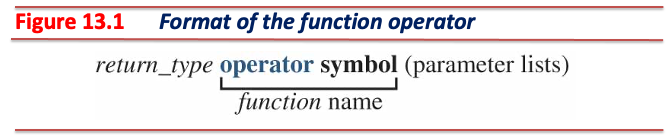

- `operator`
  - 고정된(reserved) 이름으로, 변경 불가
- `symbol`
  - 오버로딩할 연산자 자리로, 변경 가능
  - e.g., `operator*`
- 연산자 오버로딩 시 **멤버 함수**를 사용하거나 **비멤버 함수**를 사용

---

## 단항 연산자 오버로딩

- 피연산자가 하나인 연산자
- 피연산자는 **호스트 객체**
- 호스트 객체와 반환 객체를 고려하여 오버로딩

---

## `Fraction` 클래스에서의 연산자 오버로딩 - 단항 연산자

### 양수 (Plus), 음수 (Minus) 연산자

- 양수, 음수 연산자는 부수효과(side effect)가 없음
- 연산 평가 결과는 부호가 결정된 객체의 값(*rvalue*)

---

## `Fraction` 클래스에서의 연산자 오버로딩 - 단항 연산자 (Cont'd - 1)

[//]: # (INCLUDE: ./cpp/07/src/fraction/fraction.hpp --from 13 --to 14 --no-comment)

[//]: # (INCLUDE: ./cpp/07/src/fraction/fraction.cc --from 58 --to 58 --no-comment)

[//]: # (INCLUDE: ./cpp/07/src/fraction/fraction.cc --from 62 --to 62 --no-comment)

---

## `Fraction` 클래스에서의 연산자 오버로딩 - 단항 연산자 (Cont'd - 2)

### 전위 증가 (Pre-Increment), 전위 감소 (Pre-Decrement) 연산자

- 전위 증가, 전위 감소 연산자는 부수효과 발생
- 연산 평가 결과는 **수정된 호스트 객체의 참조(*lvalue*)**
  - `++++++x`, `----x` 등의 표현이 가능해야 함

---

## `Fraction` 클래스에서의 연산자 오버로딩 - 단항 연산자 (Cont'd - 3)

[//]: # (INCLUDE: ./cpp/07/src/fraction/fraction.hpp --from 19 --to 20 --no-comment)

[//]: # (INCLUDE: ./cpp/07/src/fraction/fraction.cc --from 67 --to 71 --no-comment)

[//]: # (INCLUDE: ./cpp/07/src/fraction/fraction.cc --from 76 --to 80 --no-comment)

---

## `Fraction` 클래스에서의 연산자 오버로딩 - 단항 연산자 (Cont'd - 4)

### 후위 증가 (Post-Increment), 후위 감소 (Post-Decrement) 연산자

- 후위 증가, 후위 감소 연산자는 부수효과가 발생
- 연산 평가 결과는 **원본 호스트 객체의 복사본(*rvalue*)**
- 전위 증가 / 전위 감소 연산자와 **구분하기 위해 불필요한(dummy) 정수 타입 매개변수** 사용
  - 실제 연산에 사용되지 않는 매개변수
  - 컴파일 시점에 후위 증가, 후위 감소를 구분하기 위해서만 사용
  - **반드시 정수 타입 매개변수여야 하며**, 매개변수 이름은 생략 가능

---

## `Fraction` 클래스에서의 연산자 오버로딩 - 단항 연산자 (Cont'd - 5)

[//]: # (INCLUDE: ./cpp/07/src/fraction/fraction.hpp --from 25 --to 26 --no-comment)

[//]: # (INCLUDE: ./cpp/07/src/fraction/fraction.cc --from 85 --to 89 --no-comment)

[//]: # (INCLUDE: ./cpp/07/src/fraction/fraction.cc --from 94 --to 98 --no-comment)

---

## 이항 연산자 오버로딩

- 피연산자가 두 개인 연산자
- 하나의 피연산자는 **호스트 객체**이며, 다른 하나의 피연산자는 **매개변수 객체**
- 호스트 객체와 반환 객체, 매개변수를 고려하여 오버로딩
- 이항 연산자는 **두 피연산자의 역할(role)에 따라 오버로딩 형태가 다름**
  - 좌측 피연산자는 *lvalue*, 우측 피연산자는 *rvalue*인 경우 멤버 함수 오버로딩
  - 두 피연산자 모두 *rvalue*인 경우 비멤버 함수 오버로딩

---

## `Fraction` 클래스에서의 연산자 오버로딩 - 이항 연산자

### 대입 (Assignment) 연산자

- 좌측 피연산자(호스트 객체)는 *lvalue*, 우측 피연산자(매개변수)는 *rvalue*
- 좌측 피연산자는 부수효과 발생
- 우측 피연산자는 대입 과정 중 수정되어서는 안 됨, 상수여야 함
- 연산 평가 결과는 **수정된 호스트 객체의 참조(*lvalue*)**
  - `x = y = z`: 값 반환 형태로 연산자 오버로딩 시 **불필요한 복사 생성자가 호출됨**
  - `(x = y) = z`: 상수 반환 형태로 연산자 오버로딩 시 **위와 같은 경우를 처리하지 못함**

---

## `Fraction` 클래스에서의 연산자 오버로딩 - 이항 연산자 (Cont'd - 1)

[//]: # (INCLUDE: ./cpp/07/src/fraction/fraction.hpp --from 31 --to 31 --no-comment)

[//]: # (INCLUDE: ./cpp/07/src/fraction/fraction.cc --from 103 --to 109 --no-comment)

---

## `Fraction` 클래스에서의 연산자 오버로딩 - 이항 연산자 (Cont'd - 2)

### 복합 대입 (Compound Assignment) 연산자: `+=`

[//]: # (INCLUDE: ./cpp/07/src/fraction/fraction.hpp --from 34 --to 34 --no-comment)

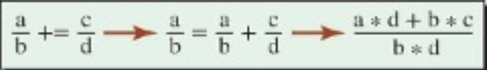

[//]: # (INCLUDE: ./cpp/07/src/fraction/fraction.cc --from 114 --to 119 --no-comment)

---

## `Fraction` 클래스에서의 연산자 오버로딩 - 이항 연산자 (Cont'd - 3)

### 복합 대입 (Compound Assignment) 연산자: `-=`

[//]: # (INCLUDE: ./cpp/07/src/fraction/fraction.hpp --from 37 --to 37 --no-comment)

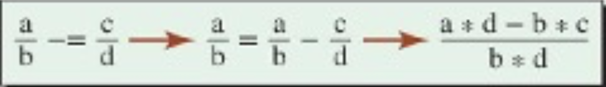

[//]: # (INCLUDE: ./cpp/07/src/fraction/fraction.cc --from 123 --to 128 --no-comment)

---

## `Fraction` 클래스에서의 연산자 오버로딩 - 이항 연산자 (Cont'd - 4)

### 복합 대입 (Compound Assignment) 연산자: `*=`

[//]: # (INCLUDE: ./cpp/07/src/fraction/fraction.hpp --from 40 --to 40 --no-comment)

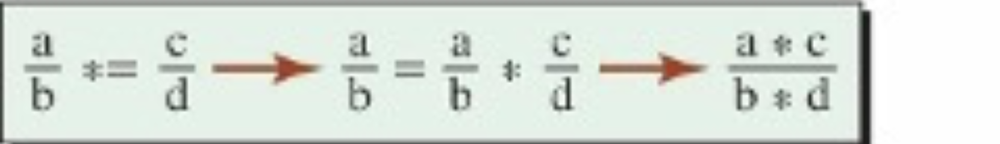

[//]: # (INCLUDE: ./cpp/07/src/fraction/fraction.cc --from 132 --to 137 --no-comment)

---

## `Fraction` 클래스에서의 연산자 오버로딩 - 이항 연산자 (Cont'd - 5)

### 복합 대입 (Compound Assignment) 연산자: `/=`

[//]: # (INCLUDE: ./cpp/07/src/fraction/fraction.hpp --from 43 --to 43 --no-comment)

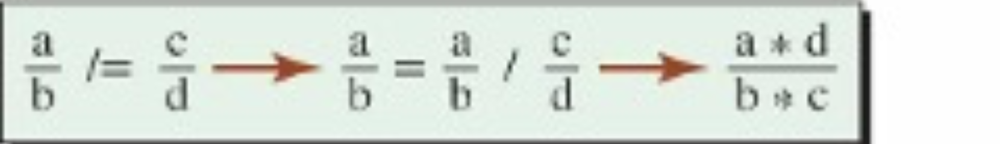

[//]: # (INCLUDE: ./cpp/07/src/fraction/fraction.cc --from 141 --to 148 --no-comment)

---

## 기타 연산자 오버로딩

### 스마트 포인터 (Smart Pointers)

- 간접 참조(indirection, `*`) 연산자와 멤버 접근(member access, `->`) 연산자 오버로딩을 활용한 클래스

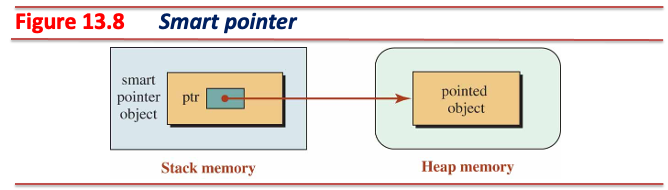

- 스마트 포인터는 동적 객체 운용 시 예외 등으로 정상 소멸되지 못해 발생하는 메모리 누수 문제를 해결할 수 있음

[//]: # (INCLUDE: ./cpp/07/src/_snippet.cc --from 13 --to 17 --no-comment)

---

## 기타 연산자 오버로딩 (Cont'd - 1)

### 스마트 포인터 구현 예시

[//]: # (INCLUDE: ./cpp/07/src/00_smart_pointer.cc --to 19)

---

## 기타 연산자 오버로딩 (Cont'd - 2)

[//]: # (INCLUDE: ./cpp/07/src/00_smart_pointer.cc --from 21)

---

## 기타 연산자 오버로딩 (Cont'd - 3)

### 배열 클래스 (Array Class)

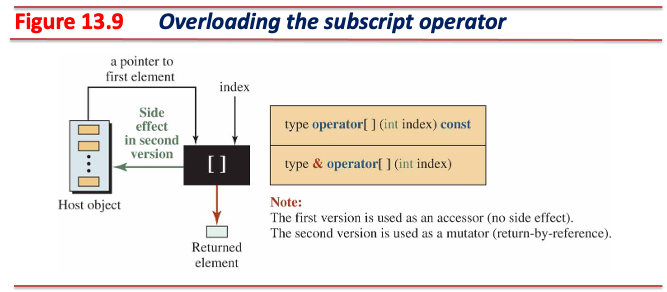

- 문자열 또는 리스트와 같이 배열처럼 사용되는 데이터를 조작하는 클래스
- 이항 연산자인 첨자(subscript, `[]`) 연산 오버로딩 필요
- 좌측 피연산자(배열)와 우측 피연산자(인덱스)로 해당 원소를 반환
- 첨자 연산 오버로딩 시 접근자(accessor, *rvalue*)와 변경자(mutator, *lvalue*) 모두 구현해야 함

---

## 기타 연산자 오버로딩 (Cont'd - 4)

### 배열 클래스 구현 예시

[//]: # (INCLUDE: ./cpp/07/src/01_cls_array.cc --to 20)

---

## 기타 연산자 오버로딩 (Cont'd - 5)

[//]: # (INCLUDE: ./cpp/07/src/01_cls_array.cc --from 22)

---

## 기타 연산자 오버로딩 (Cont'd - 6)

### 펑터 (Functor)

- 객체 자체를 함수처럼 호출 가능하게 하는 클래스
- 함수 호출(function-call, `()`) 연산 오버로딩 필요
- **일반 함수와 달리 호출할 때마다 멤버 변수를 사용하여 상태를 유지할 수 있음**

[//]: # (INCLUDE: ./cpp/07/src/02_functor.cc --to 15)

---

## 기타 연산자 오버로딩 (Cont'd - 7)

[//]: # (INCLUDE: ./cpp/07/src/02_functor.cc --from 17)

---

## 이항 연산자 오버로딩 - 멤버 함수 vs 비멤버 함수

- 두 피연산자의 역할이 다른 경우 멤버 함수 형태로 이항 연산자 오버로딩

[//]: # (INCLUDE: ./cpp/07/src/_snippet.cc --from 23 --to 24 --no-comment)

- 두 피연산자의 역할이 같은 경우 **비멤버 함수** 형태로 이항 연산자 오버로딩

[//]: # (INCLUDE: ./cpp/07/src/_snippet.cc --from 28 --to 28 --no-comment)

- 비멤버 함수 오버로딩은 아래 경우를 해결할 수 있음:

[//]: # (INCLUDE: ./cpp/07/src/_snippet.cc --from 32 --to 34 --no-comment)

- `1 + fr`에서의 좌측 피연산자는 기본 타입이므로, **비멤버 함수** 중 이 표현을 처리할 수 있는 함수가 있는지 탐색

---

## 이항 연산자 오버로딩 - 멤버 함수 vs 비멤버 함수 (Cont'd)

### 비멤버 함수 오버로딩 사용 방법

- `friend` 키워드를 사용하여 클래스 내부에 비멤버 함수를 선언
  - `friend` 비멤버 함수는 클래스 내 **모든 멤버**에 접근 가능한 상태가 됨(friendship)

[//]: # (INCLUDE: ./cpp/07/src/03_friend.cc --to 15)

---

## 이항 연산자 오버로딩 - 멤버 함수 vs 비멤버 함수 (Cont'd - 2)

[//]: # (INCLUDE: ./cpp/07/src/03_friend.cc --from 17)

---

## 이항 연산자 오버로딩 - 비멤버 함수 오버로딩

### 산술 (Arithmetic) 연산자

- 두 피연산자는 값으로만 사용되고, 사용 과정 중에 변하면 안 되므로 **상수**로 전달
- 두 피연산자 전달 시 불필요한 복사 생성자 호출 억제 위해 **참조**로 전달
- 두 피연산자의 연산 결과는 값으로 평가되어야 하므로 **상수 값**형태로 반환

---

## 이항 연산자 오버로딩 - 비멤버 함수 오버로딩 (Cont'd - 1)

### 산술 (Arithmetic) 연산자: `+`

[//]: # (INCLUDE: ./cpp/07/src/fraction/fraction.hpp --from 54 --to 54 --no-comment)

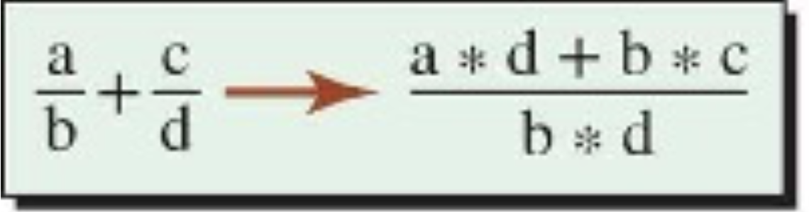

[//]: # (INCLUDE: ./cpp/07/src/fraction/fraction.cc --from 162 --to 166 --no-comment)

---

## 이항 연산자 오버로딩 - 비멤버 함수 오버로딩 (Cont'd - 2)

### 산술 (Arithmetic) 연산자: `-`

[//]: # (INCLUDE: ./cpp/07/src/fraction/fraction.hpp --from 57 --to 57 --no-comment)

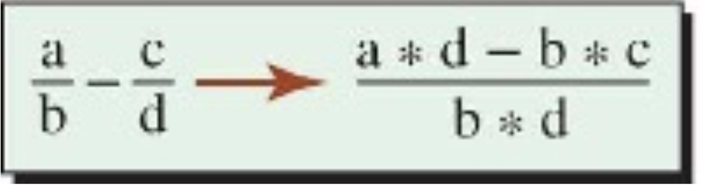

[//]: # (INCLUDE: ./cpp/07/src/fraction/fraction.cc --from 170 --to 174 --no-comment)

---

## 이항 연산자 오버로딩 - 비멤버 함수 오버로딩 (Cont'd - 3)

### 산술 (Arithmetic) 연산자: `*`

[//]: # (INCLUDE: ./cpp/07/src/fraction/fraction.hpp --from 60 --to 60 --no-comment)

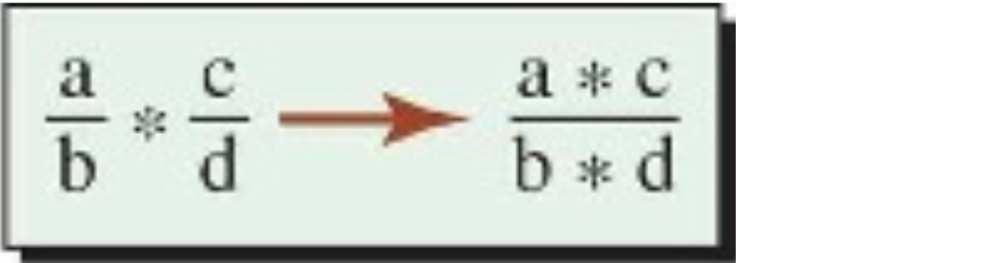

[//]: # (INCLUDE: ./cpp/07/src/fraction/fraction.cc --from 178 --to 182 --no-comment)

---

## 이항 연산자 오버로딩 - 비멤버 함수 오버로딩 (Cont'd - 4)

### 산술 (Arithmetic) 연산자: `/`

[//]: # (INCLUDE: ./cpp/07/src/fraction/fraction.hpp --from 63 --to 63 --no-comment)

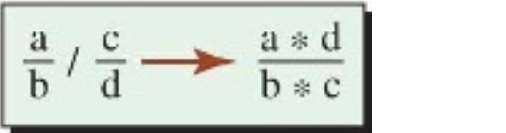

[//]: # (INCLUDE: ./cpp/07/src/fraction/fraction.cc --from 186 --to 192 --no-comment)

---

## 이항 연산자 오버로딩 - 비멤버 함수 오버로딩 (Cont'd - 5)

### 관계 (Relational) 연산자

- 구현 방식은 산술 연산자를 비멤버 함수 오버로딩으로 정의한 형태와 동일:
  - 매개변수는 상수이면서 참조 타입
  - 상수 값 반환
- 반환값 타입은 참, 거짓을 표현해야 하므로 `bool`

---

## 이항 연산자 오버로딩 - 비멤버 함수 오버로딩 (Cont'd - 6)

### 관계 (Relational) 연산자: `==`, `!=`

[//]: # (INCLUDE: ./cpp/07/src/fraction/fraction.hpp --from 68 --to 69 --no-comment)

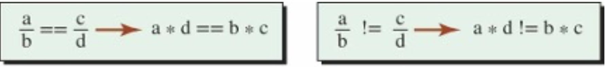

[//]: # (INCLUDE: ./cpp/07/src/fraction/fraction.cc --from 197 --to 203 --no-comment)

---

## 이항 연산자 오버로딩 - 비멤버 함수 오버로딩 (Cont'd - 7)

### 관계 (Relational) 연산자: `<`, `<=`

[//]: # (INCLUDE: ./cpp/07/src/fraction/fraction.hpp --from 72 --to 73 --no-comment)

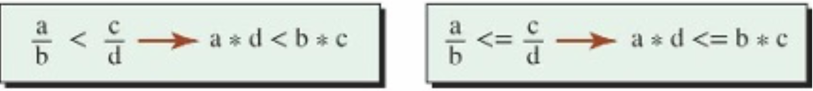

[//]: # (INCLUDE: ./cpp/07/src/fraction/fraction.cc --from 207 --to 213 --no-comment)

---

## 이항 연산자 오버로딩 - 비멤버 함수 오버로딩 (Cont'd - 8)

### 관계 (Relational) 연산자: `>`, `>=`

[//]: # (INCLUDE: ./cpp/07/src/fraction/fraction.hpp --from 76 --to 77 --no-comment)

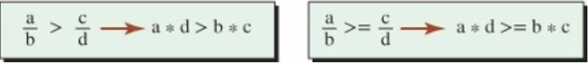

[//]: # (INCLUDE: ./cpp/07/src/fraction/fraction.cc --from 217 --to 223 --no-comment)

---

## 이항 연산자 오버로딩 - 비멤버 함수 오버로딩 (Cont'd - 9)

### 추출 (Extraction), 삽입 (Insertion) 연산자

- 추출, 삽입 연산자를 오버로딩한 클래스 객체는 표준 입출력과 상호작용할 수 있음
- 추출 연산자(`>>`)의 호스트 객체는 표준 입력 객체(`std::istream`)
- 삽입 연산자(`<<`)의 호스트 객체는 표준 출력 객체(`std::ostream`)
- 추출, 삽입 연산자의 호스트 객체는 **연속적인 연산(operator chaining)이 가능해야 함**
  - 반환 타입은 반드시 호스트 객체 타입 참조여야 함
- 삽입, 추출 연산자는 두 피연산자의 역할이 다르지만 **예외적으로** 비멤버 함수 오버로딩 사용

---

## 이항 연산자 오버로딩 - 비멤버 함수 오버로딩 (Cont'd - 10)

[//]: # (INCLUDE: ./cpp/07/src/fraction/fraction.hpp --from 82 --to 83 --no-comment)

[//]: # (INCLUDE: ./cpp/07/src/fraction/fraction.cc --from 228 --to 240 --no-comment)

---

## 기본 매개변수 (Default Parameters)

- 함수의 매개변수에 기본 값 설정
- 함수 호출 시, 기본 값이 설정된 매개변수는 생략할 수 있음
  - 기본 매개변수 자리에 인자를 넘겨주면 넘겨준 인자 값 사용
  - 기본 매개변수 자리에 인자가 없으면 기본 매개변수 값 사용

[//]: # (INCLUDE: ./cpp/07/src/04_default_param.cc)

---

## 기본 매개변수 (Default Parameters) (Cont'd)

### 기본 매개변수 유의사항

- 기본 매개변수는 함수 선언 혹은 함수 정의 중 **한 곳에만 지정**해야 하며, 일반적으로 함수 선언에 기본 매개변수 지정
- 기본 매개변수는 함수의 매개변수 목록의 **가장 마지막(오른쪽)으로부터 연속적으로 사용**해야 함

[//]: # (INCLUDE: ./cpp/07/src/_snippet.cc --from 39 --to 40 --no-comment)

- **오버로딩 시 모호성 문제가 발생할 수 있음**

[//]: # (INCLUDE: ./cpp/07/src/_snippet.cc --from 44 --to 45 --no-comment)

[//]: # (INCLUDE: ./cpp/07/src/_snippet.cc --from 50 --to 52 --no-comment)

---

## 타입 변환

- 생성자를 사용하면 다른 타입을 해당 클래스 타입으로 변환 가능

[//]: # (INCLUDE: ./cpp/07/src/fraction/fraction.cc --from 38 --to 53 --no-comment)

---

## 타입 변환 (Cont'd)

- 변환(conversion) 연산자를 클래스 내부에 정의하면 해당 클래스 객체를 다른 타입으로 변환 가능

[//]: # (INCLUDE: ./cpp/07/src/fraction/fraction.hpp --from 48 --to 49 --no-comment)

[//]: # (INCLUDE: ./cpp/07/src/fraction/fraction.cc --from 153 --to 157 --no-comment)

[//]: # (INCLUDE: ./cpp/07/src/fraction/main.cc --from 88 --to 94 --no-comment)

---

## `Fraction` 클래스

[//]: # (INCLUDE: ./cpp/07/src/fraction/Makefile --reference)

- `fraction.hpp`

[//]: # (INCLUDE: ./cpp/07/src/fraction/fraction.hpp --to 11 --from 13 --to 14 --from 16 --to 17  --from 19 --to 20 --from 22 --to 23 --from 25 --to 26)

---

## `Fraction` 클래스 (Cont'd - 1)

[//]: # (INCLUDE: ./cpp/07/src/fraction/fraction.hpp --from 29 --to 29 --from 31 --to 31 --from 34 --to 34 --from 37 --to 37 --from 40 --to 40 --from 43 --to 43 --from 45 --to 46 --from 48 --to 49 --from 51 --to 52 --from 54 --to 54 --from 57 --to 57 --from 60 --to 60 --from 63 --to 63)

---

## `Fraction` 클래스 (Cont'd - 2)

[//]: # (INCLUDE: ./cpp/07/src/fraction/fraction.hpp --from 66 --to 66 --from 68 --to 69 --from 72 --to 73 --from 76 --to 77 --from 79 --to 80 --from 82 --to 83 --from 85)

---

## `Fraction` 클래스 (Cont'd - 3)

- `fraction.cc`

[//]: # (INCLUDE: ./cpp/07/src/fraction/fraction.cc --to 16)

---

## `Fraction` 클래스 (Cont'd - 4)

[//]: # (INCLUDE: ./cpp/07/src/fraction/fraction.cc --from 18 --to 34)

---

## `Fraction` 클래스 (Cont'd - 5)

[//]: # (INCLUDE: ./cpp/07/src/fraction/fraction.cc --from 36 --to 36 --from 38 --to 53)

---

## `Fraction` 클래스 (Cont'd - 6)

[//]: # (INCLUDE: ./cpp/07/src/fraction/fraction.cc --from 56 --to 56 --from 58 --to 58 --from 60 --to 60 --from 62 --to 62 --from 64 --to 65 --from 67 --to 71 --from 73 --to 74 --from 76 --to 80)

---

## `Fraction` 클래스 (Cont'd - 7)

[//]: # (INCLUDE: ./cpp/07/src/fraction/fraction.cc --from 83 --to 83 --from 85 --to 89 --from 91 --to 92 --from 94 --to 98)

---

## `Fraction` 클래스 (Cont'd - 8)

[//]: # (INCLUDE: ./cpp/07/src/fraction/fraction.cc --from 101 --to 101 --from 103 --to 109 --from 111 --to 112 --from 114 --to 119)

---

## `Fraction` 클래스 (Cont'd - 9)

[//]: # (INCLUDE: ./cpp/07/src/fraction/fraction.cc --from 123 --to 128 --from 130 --to 130 --from 132 --to 137)

---

## `Fraction` 클래스 (Cont'd - 10)

[//]: # (INCLUDE: ./cpp/07/src/fraction/fraction.cc --from 141 --to 148 --from 150 --to 151 --from 153 --to 157 --from 159 --to 160 --from 162 --to 166)

---

## `Fraction` 클래스 (Cont'd - 11)

[//]: # (INCLUDE: ./cpp/07/src/fraction/fraction.cc --from 170 --to 174 --from 176 --to 176 --from 178 --to 182 --from 184 --to 184 --from 186 --to 192)

---

## `Fraction` 클래스 (Cont'd - 12)

[//]: # (INCLUDE: ./cpp/07/src/fraction/fraction.cc --from 195 --to 195 --from 197 --to 203 --from 205 --to 205 --from 207 --to 213)

---

## `Fraction` 클래스 (Cont'd - 13)

[//]: # (INCLUDE: ./cpp/07/src/fraction/fraction.cc --from 217 --to 223 --from 225 --to 226 --from 228 --to 240 --from 242)

---

## `Fraction` 클래스 (Cont'd - 14)

- `main.cc`

[//]: # (INCLUDE: ./cpp/07/src/fraction/main.cc --to 17)

---

## `Fraction` 클래스 (Cont'd - 15)

[//]: # (INCLUDE: ./cpp/07/src/fraction/main.cc --from 19 --to 38)

---

## `Fraction` 클래스 (Cont'd - 16)

[//]: # (INCLUDE: ./cpp/07/src/fraction/main.cc --from 40 --to 59)

---

## `Fraction` 클래스 (Cont'd - 17)

[//]: # (INCLUDE: ./cpp/07/src/fraction/main.cc --from 61 --to 77)

---

## `Fraction` 클래스 (Cont'd - 18)

[//]: # (INCLUDE: ./cpp/07/src/fraction/main.cc --from 78 --to 86 --from 88 --to 94)

---

## `Fraction` 클래스 (Cont'd - 19)

[//]: # (INCLUDE: ./cpp/07/src/fraction/main.cc --from 97)
