# [연산자 오버로딩 (Operator Overloading)](https://en.cppreference.com/w/cpp/language/operators)

* **C++는 기본 자료형을 위한 연산자를 클래스 형 객체에 사용할 수 있도록 오버로딩할 수 있음**
  * 분수를 표현하는 `Fraction`형 클래스 객체 `fr1`, `fr2`가 존재한다고 가정
  * 두 객체를 서로 더하고자 할 때, 멤버 함수 호출을 통해 계산할 수 있음
    * `fr1.add(fr2)`
  * 덧셈 이항 연산자 (`+`)를 `Fraction`형 클래스에서 오버로딩할 경우 아래와 같이 사용 가능
    * `fr1 + fr2`
    * **훨씬 직관적이며 가독성을 향상시킬 수 있음**

---

## C++ 연산자들의 오버로딩 가능성 (Overloadability)

### Non-overloadable

| Operator  | Arity  | Name               | Overloadability  |
|-----------|--------|--------------------|------------------|
| `::`      | primary| scope              | Non-overloadable |
| `.`       | postfix| member selector    | Non-overloadable |
| `.*`      | binary | ptr to member      | Non-overloadable |
| `?:`      | ternary| conditional        | Non-overloadable |

* Additional non-overloadable operators (special operators)
  * `sizeof`, `typeid`, `alignof`, `noexcept`, `decltype`
  * `new`, `delete`
  * `const_cast`, `static_cast`, `dynamic_cast`, `reinterpret_cat`
  * `throw`

---

### Not Recommended

| Operator  | Arity  | Name               | Overloadability                   |
|-----------|--------|--------------------|-----------------------------------|
| `&&`      | binary | logical and        | Overloadable (But not recommended)|
| `\|\|`    | binary | logical or         | Overloadable (But not recommended)|
| `&`       | unary  | address-of         | Overloadable (But not recommended)|
| `,`       | binary | comma              | Overloadable (But not recommended)|
| `->`      | postfix| member access      | Overloadable (But not recommended)|

* 이미 연산자의 역할이 명확해 오버로딩할 필요가 없는 연산자들
* 논리 AND, OR 연산자는 오버로딩 시 단락 평가 (short-circuit evaluation) 특성이 소멸됨
* **상기 명령어들은 오버로딩할 경우 코드의 가독성을 해치고 혼란을 야기할 수 있음**
  * 오버로딩하지 않는 것을 권장

---

## 오버로딩 원칙 (Overloading Principles)

* Precedence
* 연산자 고유의 우선순위 변경 불가

* Associativity
  * 연산자 고유의 결합방향 변경 불가

* Commutativity
  * 연산자 고유의 교환 법칙 변경 불가
    * C++의 덧셈 연산자는 교환 법칙 보장
    * 오버로딩된 덧셈 연산자 또한 교환 법칙을 반드시 보장해야 함

* Arity
  * 연산자 고유의 피연산자 수 변경 불가

* No New operators
  * 새로운 연산자 추가 불가
    * C++에서 사용중인 연산자 중 오버로딩 가능성이 있는 연산자들만 오버로딩 가능

* No Combination
  * C++에서 사용중인 두 개 이상의 연산자를 조합해 새로운 연산자 정의 불가

---

## 연산자 함수 (Operator Function)

* 연산자 오버로딩 하기 위해 클래스 내 다음과 같은 형태로 멤버 함수 정의 필요


* `operator`
  * 고정된 (reserved) 이름
* `symbol`
  * 오버로딩할 연산자 표기
  * e.g., `operator*`
* 연산자 오버로딩 시 멤버 함수를 사용해야 하는 경우와, 비멤버 함수를 사용해야 하는 경우가 있음

---

## `Fraction` 클래스에서의 연산자 오버로딩

### 단항 연산자 (Guideline for Unary Operators)

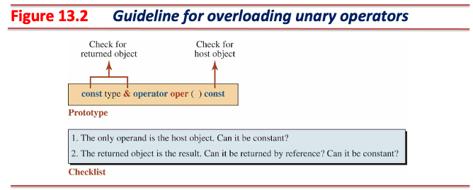

* 피연산자가 하나인 연산자
* 피연산자는 **호스트 객체**
* 호스트 객체와 반환 객체를 고려하여 오버로딩

---

#### 단항 연산자 - 양수 (Plus), 음수 (Minus) 연산자

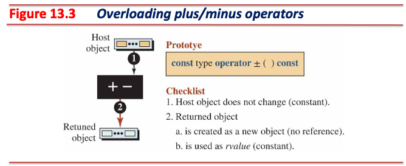

* 양수, 음수 연산자는 부수효과가 없음
* 연산 평가 결과는 부호가 결정된 객체의 값 (*rvalue*)

---

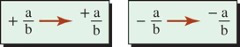

```cpp
// Declaration of + operator
const Fraction operator+() const; 
// Definition of plus operator
const Fraction Fraction::operator+() const {
  Fraction temp(+numer_, denom_);  // a new object
  return temp;
}
// Declaration of - operator
const Fraction operator-() const;
// Definition for minus operator
const Fraction Fraction::operator-() const {
  Fraction temp(-numer_, denom_);  // a new object   
  return temp;
}
```

---

#### 단항 연산자 - 전위 증가 (Pre-increment), 전위 감소 (Pre-decrement) 연산자


* 전위 증가, 전위 감소 연산자는 부수 효과가 발생
* 연산 평가 결과는 **수정된 호스트 객체의 참조 (*lvalue*)**
  * `++++++x`, `----x` 등의 표현이 가능해야 함

---

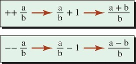

```cpp
// Declaration of pre-increment operator
Fraction& operator++();
// Definition pre-increment operator
Fraction& Fraction::operator++() {
  numer_ = numer_ + denom_;
  this->Normalize();
  return *this;
}

// Declaration of pre-decrement operator
Fraction& operator--();
// Definition pre-decrement operator
Fraction& Fraction::operator--() {
  numer_ = numer_ - denom_;
  this->Normalize();
  return *this;
}
```

---

#### 단항 연산자 - 후위 증가 (Post-increment), 후위 감소 (Post-decrement) 연산자

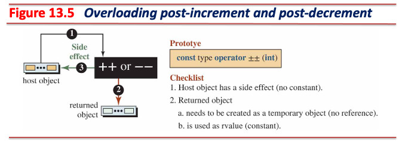

* 후위 증가, 후위 감소 연산자는 부수 효과가 발생
* 연산 평가 결과는 **원본 호스트 객체의 복사본 (*rvalue*)**
* 전위 증가, 전위 감소 연산자와 서로 구분하기 위해 **불필요한 (dummy) 정수형 매개변수** 사용
  * 실제 연산에 사용되지 않는 매개변수
  * 컴파일 시점에 후위 증가, 후위 감소를 구분하기 위해서만 사용
  * **반드시 정수형 매개변수여야 하며**, 매개변수 이름은 생략 가능

---


```cpp
// Declaration of post-increment operator
const Fraction operator++(int);  // uses a dummy integer parameter 
// Definition post-increment operator
const Fraction Fraction::operator++(int) {  // the dummy parameter's name is opt.
  Fraction temp(numer_, denom_);
  ++(*this);
  return temp;
}

// Declaration of post-decrement operator
const Fraction operator--(int);  // uses a dummy integer parameter
// Definition post-decrement operator
const Fraction Fraction::operator--(int) {  // the dummy parameter's name is opt.
  Fraction temp(numer_, denom_);
  --(*this);
  return temp;
}
```

---

### 이항 연산자 (Guideline for Binary Operators)


* 피연산자가 두 개인 연산자
* 하나의 피연산자는 **호스트 객체**이며, 다른 하나의 피연산자는 **매개변수 객체**
* 호스트 객체와 반환 객체, 매개변수를 고려하여 오버로딩
* **좌측 피연산자와 우측 피연산자의 역할 (role)이 다른 경우, 멤버 함수로 오버로딩해야 함**
  * e.g., 좌측 피연산자는 *lvalue*, 우측 피연산자는 *rvalue*인 경우
* **좌측 피연산자와 우측 피연산자의 역할이 같은 경우, 비멤버 함수로 오버로딩해야 함**

---

#### 이항 연산자 - 대입 (Assignment) 연산자


* 좌측 피연산자 (호스트 객체)는 *lvalue*, 우측 피연산자 (매개변수)는 *rvalue*
* 좌측 피연산자는 부수 효과가 발생
* 우측 피연산자는 대입 과정 중 수정되어서는 안 되므로, 상수여야 함
* 연산 평가 결과는 **수정된 호스트 객체의 참조 (*lvalue*)**
  * `x = y = z`
    * 값 반환 형태로 연산자를 오버로딩해도 결과는 동일하게 동작하나, 불필요한 복사 생성자가 호출됨
  * `(x = y) = z`
    * 괄호를 사용해 표현식의 평가 우선순위를 변경해도 기대한 대로 동작해야 함
    * 상수 반환 형태로 연산자를 오버로딩하면 위와 같은 경우를 처리하지 못함

---

* **대입 전 호스트 객체와 매개변수가 같은지 반드시 확인해야 함**
  * 확인하지 않으면 호스트 객체의 값이 대입 전 제거될 수 있음

```cpp
#include <iostream>

class MyClass {
  int* data_;

 public:
  MyClass(int value) { data_ = new int(value); }
  ~MyClass() { delete data_; }

  MyClass& operator=(const MyClass& other) {
    if (this == &other) return *this;

    delete data_;
    data_ = new int(*other.data_);
    return *this;
  }

  int data() { return *data_; }
};

int main() {
  MyClass mc(10);
  mc = mc;  // It will be converted to the following code: mc.operator=(mc)
  std::cout << mc.data() << std::endl;
  return 0;
}
```

---

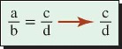

```cpp
// Declaration of assignment operator
Fraction& operator=(const Fraction& right)
// Definition of assignment operator
// left operand: the host object, right operand: the parameter
Fraction& Fraction::operator=(const Fraction& right) {
  if (*this != right) {  // or check in another way
    numer_ = right.numer_;
    denom_ = right.denom_;
  }
  return *this;
}
```

---

#### 이항 연산자 - 복합 대입 (Compound Assignment) 연산자


* 구현 원리는 대입 연산자와 동일

---

```cpp
// Declaration of += operator
Fraction& operator+=(const Fraction& right)
// Definition of += operator
Fraction& Fraction::operator+=(const Fraction& right) {
  numer_ = numer_ * right.denom_ + denom_ * right.numer_;
  denom_ = denom_ * right.denom_;
  Normalize();
  return *this;
}

// Declaration of -= operator
Fraction& operator-=(const Fraction& right)
// Definition of -= operator
Fraction& Fraction::operator-=(const Fraction& right) {
  numer_ = numer_ * right.denom_ - denom_ * right.numer_;
  denom_ = denom_ * right.denom_;
  Normalize();
  return *this;
}
```

---

```cpp
// Declaration of *= operator
Fraction& operator*=(const Fraction& right)
// Definition of *= operator
Fraction& Fraction::operator*=(const Fraction& right) {
  numer_ = numer_ * right.numer_;
  denom_ = denom_ * right.denom_;
  Normalize();
  return *this;
}

// Declaration of /= operator
Fraction& operator/=(const Fraction& right)
// Definition of /= operator
Fraction& Fraction::operator/=(const Fraction& right) {
  numer_ = numer_ * right.denom_;
  denom_ = denom_ * right.numer_;
  Normalize();
  return *this;
}
```

---

## 기타 연산자 (Other Operators)

### 스마트 포인터 (Smart Pointers)

* 동적 객체 할당 후 중간에 함수가 종료되거나 예외로 인하여 함수가 중간이 종료될 수 있음
  * **할당한 객체가 소멸되지 않으면 메모리 누수가 발생할 수 있음**

```cpp
void calc_with_dynamic_fraction_object() {
  Fraction* ptr = new Fraction(2, 5);

  // Exception or return here: Fraction never released!

  delete ptr;  // manual release required
}
```

---


* **스마트 포인터는 특정 지역에서 동적 할당한 객체가 해당 지역을 벗어날 때 자동으로 소멸됨을 보장**
* 클래스 내 데이터 멤버가 포인터를 사용할 경우, 두 연산자 오버로딩 필요
  * 간접 (역참조) 연산자 (indirection operator, `*`)
  * 멤버 선택 연산자 (member-selector operator, `->`)

---

```cpp
class Fraction;  // Forward declaration for the type you want to use

class SmartPtr {
  Fraction* ptr_;

 public:
  explicit SmartPtr(Fraction* p) : ptr_(p) {}
  ~SmartPtr() { delete ptr_; }
  Fraction& operator*() const { return *ptr_; }
  Fraction* operator->() const { return ptr_; }
};

int main() {
  SmartPtr sp(new Fraction(2, 5));
  (*sp).print();
  sp->print();  // `sp` is a stack instance; it's dtor will auto-invoke!
}
```

---

### 배열 클래스 (Array Class)

* 첨자 연산을 필요로 하는 클래스 구현 시 첨자 (subscript) 연산자 오버로딩 필요
  * 클래스가 내부적으로 문자열 또는 리스트와 같이 배열처럼 사용되는 데이터를 사용하는 경우
* 첨자 연산자는 이항 연산자
  * 좌측 피연산자는 배열의 이름 역할 수행
  * 우측 피연산자는 배열의 인덱스 역할 수행

---


* 접근자 (accessor)와 변경자 (mutator)를 같이 구현해야 함
  * 접근자는 부수 효과가 발생하지 않음 (*rvalue*로 평가됨)
  * 변경자는 부수 효과 발생 (*lvalue*로 평가됨)

---

```cpp
#include <cassert>
#include <iostream>

class Array {
  double* ptr_;
  int size_;

 public:
  explicit Array(int s) : size_(s) { ptr_ = new double[size_]; }
  ~Array() { delete[] ptr_; }

  // Accessor
  const double& operator[](int index) const {
    if (index < 0 || index >= size_) {
      std::cerr << "Index is out of range. Program terminates.";
      assert(false);
    }
    return ptr_[index];
  }

  // Mutator
  double& operator[](int index) {
    if (index < 0 || index >= size_) {
      std::cerr << "Index is out of range. Program terminates.";
      assert(false);
    }
    return ptr_[index];
  }
};

int main() {
  Array arr(3);
  arr[0] = 22.31;
  arr[1] = 78.61;
  arr[2] = 65.22;
  for (int i = 0; i < 3; i++)
    std::cout << "Value of arr [" << i << "]: " << arr[i] << std::endl;
  return 0;
}
```

---

### 펑터 (Functor)

* 함수 호출 연산자를 오버로딩하여 **함수의 상태를 유지하는 함수 객체를 생성할 수 있음**
  * 객체로부터 함수를 호출할 수 있는 형태
  * 객체 내 데이터 멤버에 유지하고자 하는 정보를 보관할 수 있음

```cpp
#include <iostream>
#include <limits>

class Smallest {
  int value_;

 public:
  Smallest() : value_(std::numeric_limits<int>::max()) {}

  // function call operator
  int operator()(int next) {
    if (next < value_) value_ = next;
    return value_;
  }
};

int main() {
  Smallest smallest;
  std::cout << "Smallest so far: " << smallest(100)
            << std::endl;  // Functor CAN keep their state.
  std::cout << "Smallest so far: " << smallest(50) << std::endl;
  std::cout << "Smallest so far: " << smallest(30) << std::endl;
  return 0;
}
```

---

### 이항 연산자 - 멤버 함수 오버로딩 vs. 비멤버 함수 오버로딩

* 이항 연산자의 멤버 함수 오버로딩
  * 두 피연산자의 역할이 다른 경우 (e.g., 대입 연산자)

  ```cpp
  int i = 10, j = 20;
  j = i;  // now j is 10
  ```

  * 호스트 객체는 부수 효과가 발생하는 좌측 값
  * 매개변수는 값을 담당하는 우측 값

* 이항 연산자의 비멤버 함수 오버로딩 (overloading as non-member functions)
  * **두 피연산자의 역할이 같은 경우** (e.g., 덧셈 연산자)

  ```cpp
  Fraction f1(1, 2), f2(3, 4), f3(5, 6);
  f1 = f2 + f3;  // it could be ok; the compiler will invoke f2.operator+(f3)
  f1 = -1.0 + f3; // it can't invoke the function; -1.0 can't be a host object
  ```

  * 컴파일러는 `-1.0 + fr3` 표현을 처리하기 위해 다음 절차를 따름:
    1. 멤버 함수 중 오버로딩되어 있는 함수가 있는지 확인한 뒤, 있다면 이를 사용한다.
    2. **비멤버 함수 중 오버로딩되어 있는 함수가 있는지 확인한 뒤, 있다면 이를 사용한다.**
      2-1. 비멤버 함수 오버로딩을 발견했다면, 전달인자가 매개변수 형태와 호환되는지 확인한다.
      2-2. 같은 형이라면, 그대로 전달인자를 매개변수로 전달한다.
      2-3. 다른 형이지만, 호환되는 형이라면 생성자를 암묵적으로 호출해 전달한다.

---

#### 비멤버 함수 오버로딩 사용 방법

* `friend` 키워드를 사용하여 클래스 내부에 비멤버 함수를 선언
  * `friend` 비멤버 함수는 클래스 내 **모든 멤버**에 접근 가능한 상태가 됨 (friendship)

```cpp
#include <iostream>

class MyClass {
  int data_;

 public:
  explicit MyClass(int data) : data_(data) {}

  friend void FriendFunction(const MyClass& obj);

 private:
  void PrivateFunction() const {
    std::cout << "Private member function called\n";
  }
};

// Friend function definition
void FriendFunction(const MyClass& obj) {
  std::cout << "Accessing private data: " << obj.data_ << "\n";
  obj.PrivateFunction();
}

int main() {
  MyClass obj(10);
  FriendFunction(obj);
  return 0;
}
```

---

#### 이항 연산자 - 비멤버 함수 오버로딩

* 두 피연산자의 역할이 동일한 경우는 `friend`를 사용한 비멤버 함수 오버로딩 사용

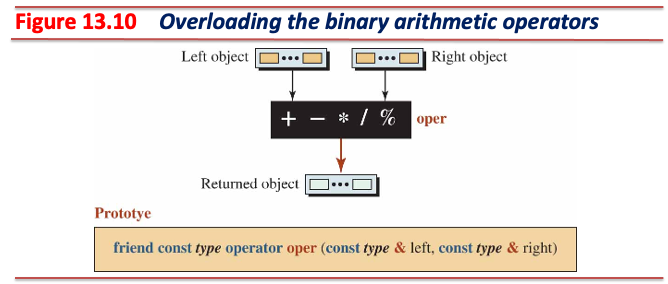

---

#### 이항 연산자 - 산술 (Arithmetic) 연산자

* 이미 존재하는 두 객체에 대해 비멤버 함수 내에서 연산
  * 이미 존재하는 두 객체이므로 두 객체는 **상수 참조** 형태로 전달
    * 두 피연산자는 연산 과정에서 값이 변하면 안 되므로 **상수**여야 함
      * 보편적인 방법
      * 성능이 중요한 분야에서는 **이동 생성자** (move constructor)를 사용하도록 최적화
    * 불필요한 복사 생성자 호출을 억제하기 위한 목적으로 **참조** 전달
  * 비멤버 함수 내에서 두 피연산자에 대한 연산 결과를 새로운 객체에 저장
  * 반환 시 생성한 객체를 **상수 값** 형태로 반환
    * 새로 생성된 객체는 **임시 객체**이므로, 함수 종료 시 소멸되는 객체
    * 참조 반환 불가

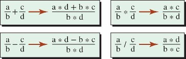

---

```cpp
// Declaration of addition operator(friend)
friend const Fraction operator+(const Fraction& left, const Fraction& right);
// Definition of addition operator(friend)
const Fraction operator+(const Fraction& left, const Fraction& right) {
  int new_numer = left.numer_ * right.denom_ + right.numer_ * left.denom_;
  int new_denom = left.denom_ * right.denom_;
  Fraction result(new_numer, new_denom);
  return result;
}

// Declaration of subtraction operator(friend)
friend const Fraction operator-(const Fraction& left, const Fraction& right);
// Definition of subtraction operator(friend)
const Fraction operator-(const Fraction& left, const Fraction& right) {
  int new_numer = left.numer_ * right.denom_ - right.numer_ * left.denom_;
  int new_denom = left.denom_ * right.denom_;
  Fraction result(new_numer, new_denom);
  return result;
}
```

---

```cpp
// Declaration of multiplication operator(friend)
friend const Fraction operator*(const Fraction& left, const Fraction& right);
// Definition of multiplication operator(friend)
const Fraction operator*(const Fraction& left, const Fraction& right) {
  int new_numer = left.numer_ * right.numer_;
  int new_denom = left.denom_ * right.denom_;
  Fraction result(new_numer, new_denom);
  return result;
}

// Declaration of division operator(friend)
friend const Fraction operator/(const Fraction& left, const Fraction& right);
// Definition of division operator(friend)
const Fraction operator/(const Fraction& left, const Fraction& right) {
  int new_numer = left.numer_ * right.denom_;
  int new_denom = left.denom_ * right.numer_;
  Fraction result(new_numer, new_denom);
  return result;
}
```

---

#### 이항 연산자 - 관계 (Relational) 연산자

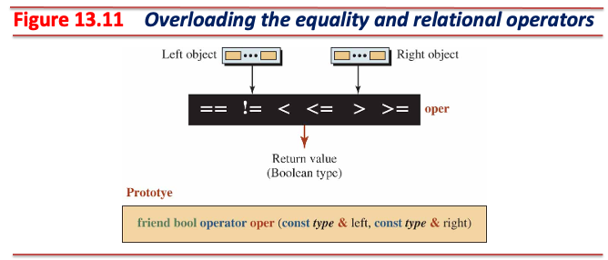

* 산술 연산자를 비멤버 함수 오버로딩하는 것과 구조적으로 일치
  * 차이점은 값 반환 시 참과 거짓을 표현하는 `bool` 형 사용

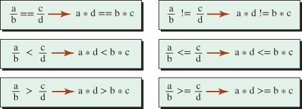

---

```cpp
// Declaration of equality operator(friend)
friend bool operator==(const Fraction& left, const Fraction& right);
// Definition of equality operator(friend)
bool operator==(const Fraction& left, const Fraction& right) {
  return (left.numer_ * right.denom_ == right.numer_ * left.denom_);
}

// Declaration of inequality operator(friend)
friend bool operator!=(const Fraction& left, const Fraction& right);
// Definition of inequality operator(friend)
bool operator!=(const Fraction& left, const Fraction& right) {
  return(left.numer_ * right.denom_ != right.numer_ * left.denom_);
}

// Declaration of less-than operator(friend)
friend bool operator<(const Fraction& left, const Fraction& right);
// Definition of less-than operator(friend)
bool operator<(const Fraction& left, const Fraction& right) {
  return(left.numer_ * right.denom_< right.numer_ * left.denom_);
}
```

---

```cpp
// Declaration of less-than or equal operator(friend)
friend bool operator<=(const Fraction& left, const Fraction& right);
// Definition of less-than or equal operator(friend)
bool operator<=(const Fraction& left, const Fraction& right) {
  return(left.numer_ * right.denom_<= right.numer_ * left.denom_);
}

// Declaration of greater-than operator(friend)
friend bool operator>(const Fraction& left, const Fraction& right);
// Definition of greater-than operator(friend)
bool operator>(const Fraction& left, const Fraction& right) {
  return(left.numer_ * right.denom_ > right.numer_ * left.denom_);
}

// Declaration of greater-than or equal operator(friend)
friend bool operator>=(const Fraction& left, const Fraction& right);
// Definition of greater-than or equal operator(friend)
bool operator>=(const Fraction& left, const Fraction& right) {
  return(left.numer_ * right.denom_ >= right.numer_ * left.denom_);
}
```

---

#### 이항 연산자 - 추출 (Extraction), 삽입 (Insertion) 연산자

* 추출 연산자 (`>>`)
  * `std::cin >> i`
  * 표준 입력으로부터 입력 받은 데이터를 **추출**해 변수 `i`로 전달
* 삽입 연산자 (`<<`)
  * `std::cout << i`
  * 변수 `i`의 값을 표준 출력으로 **삽입**
* 두 연산자를 오버로딩하여 객체로부터 데이터를 추출하거나 데이터를 객체로 삽입 가능
  * 추출 연산자는 `istream`형 객체를 좌측 피연산자로 사용
    * `std::istream cin`
  * 삽입 연산자는 `ostream`형 객체를 좌측 피연산자로 사용
    * `std::ostream cout`
* 삽입, 추출 연산자는 두 피연산자의 역할이 다르지만 **예외적으로** 비멤버 함수 오버로딩 사용
  * 좌측 피연산자 (호스트 객체)를 반드시 `istream` 또는 `ostream`을 사용해야 함

---

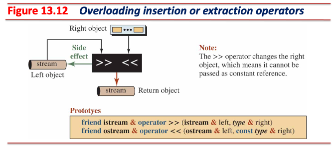

* 추출 연산자 비멤버 오버로딩 시 좌측 피연산자 (호스트 객체)와 반환 값은 `istream`형 참조
  * 호스트 객체는 조정자를 처리할 수 있어야 하며, 우측 피연산자는 부수 효과가 발생하므로 참조
    * `std::cin >> std::boolalpha >> b`
  * 반환 값은 연속적인 연산 (chained stream extraction, operator chaining)을 하기 위함
    * `std::cin >> i >> j >> k`
* 삽입 연산자 비멤버 오버로딩 시 좌측 피연산자 (호스트 객체)는 `ostream`형 참조
  * 호스트 객체는 조정자를 처리할 수 있어야 하며, 우측 피연산자는 상수 참조로 값 전달
    * `std::cout << b << std::endl`
  * 반환 값은 연속적인 연산 (chanied stream insertion, operator chaining)을 하기 위함
    * `std::cout << i << j << k`

---

```cpp
// Declaration of extraction operator(friend)
friend std::istream& operator>>(std::istream& left, Fraction& right);
// Definition of extraction operator(friend)
std::istream& operator>>(std::istream& left, Fraction& right) {
  std::cout << "Enter the value of numerator: ";
  left >> right.numer_;
  std::cout << "Enter the value of denominator: ";
  left >> right.denom_;
  right.Normalize();

  return left;
}

// Declaration of insertion operator(friend)
friend std::ostream& operator<<(std::ostream& left, const Fraction& right);
// Definition of insertion operator(friend)
std::ostream& operator<<(std::ostream& left, const Fraction& right) {
  left << right.numer_ << "/" << right.denom_;
  return left;
}
```

---

## 기본 매개변수 (Default Parameters)

* 함수의 매개변수에 기본 값 설정
  * 기본 값이 설정된 매개변수 자리에는 전달인자를 선택적으로 전달할 수 있음
    * 기본 값이 설정된 매개변수 자리에 전달인자를 넘겨주지 않으면 기본값 사용
    * 기본 값이 설정된 매개변수 자리에 전달인자를 넘겨주면 전달인자 사용

```cpp
void display(std::string message = "Hello, World!");
display();          // output: Hello, World!
display("Hi");      // output: Hi
```

* 기본 매개변수는 함수 선언 혹은 함수 정의 중 한 곳에만 사용해야 함
  * 일반적으로 함수 선언에 사용
* 기본 매개변수는 함수의 매개변수 목록의 가장 마지막 (오른쪽)으로부터 연속적으로 사용해야 함

```cpp
void display1(int a, int b = 10, int c = 20);  // OK
void display2(int a, int b = 10, int c);       // Error
```

* 기본 매개변수 사용 시 오버로딩과의 모호성 문제가 발생하지 않도록 유의
  * 모호성 문제가 발생하면 컴파일 시 오류

```cpp
int foo(int x, int y = 100);
int foo(int x);
foo(200);  // compile error, int foo(int x, int y = 100)? or int foo(int x)?
```

---

## 자료형 변환

* 표현식에 서로 다른 기본 자료형 (fundamental types)이 동시에 사용될 경우, 암묵적 형 변환 발생
* 사용자 정의 형 객체를 기본 자료형 또는 기본 자료형을 사용자 정의 형 객체로 변환 가능
  * 일부 제약 존재 (e.g., `explicit` 키워드 사용 불가, 모호성 문제 등)

### 자료형 변환 - 기본 자료형을 클래스 형으로

* 매개변수 생성자를 활용해 기본 자료형 값으로부터 암묵적으로 생성자를 호출 가능
  * 기본적인 동작 형태는 **암묵적 형 변환**이므로, `explicit` 키워드를 사용할 수 없음

```cpp
// It takes one integer parameter that is set as numerator;
Fraction(int num, int den = 1);  // the parameter den is using a default param.
// Definition of the constructor
Fraction::Fraction(int num, int den = 1)
    : numer_(num), denom_(den) { Normalize(); }

// It takes one real (double) parameter that is set as numerator;
// NB: Don’t use explicit in this case to allow implicit conversion
Fraction(double value);
// Definition of the constructor
Fraction::Fraction(double value) : denom_(1) {
  while ((value - static_cast<int>(value)) > 0.0) {
    value *= 10.0;
    denom_ *= 10;
  }
  numer_ = static_cast<int>(value);
  Normalize();
}
```

---

* 다음 경우들은 클래스 내부의 매개변수 생성자를 통해 암묵적으로 `Fraction` 형 객체가 생성됨:

```cpp
// In this case, the compiler directly calls the parameter constructor:
//     Fraction(double value);
Fraction fract1(123.456);

// The following case refers to the overloading of a non-member function: 
//     const Fraction operator+(const Fraction& left, const Fraction& right);
Fraction fract2 = 456.789 + fract1;
```

* `456.789 + fract1`
  * 컴파일러는 클래스에 이항 연산자 중 덧셈 연산자가 오버로딩되어 있는지 확인
  * 비멤버 함수 오버로딩한 함수를 찾음
    * 매개변수 형태는 `(const Fraction& left, const Fraction& right)`
  * 클래스 내부에 `456.789`를 전달인자로 받아 호출할 수 있는 생성자 있는지 확인
  * 클래스 내부에서 실수형 값을 하나 전달받는 매개변수 생성자를 찾음
    * `Fraction(double value)`
  * 컴파일러는 **암묵적으로** `Fraction(456.789) + fract1` 형태로 코드를 변환

---

### 자료형 변환 - 클래스 형을 기본 자료형으로

* 변환 (conversion) 연산자를 클래스 내부에 구현해야 함
  * **반환 값**을 사용하지 않음에 유의할 것
  * 기본 자료형 객체를 반환하는 생성자

```cpp
// Declaration of conversion operator
operator double() const;
// Definition of conversion operator
Fraction::operator double() const {
  double num = static_cast<double>(numer_);
  return (num / denom_);
}
```

* 클래스 내부에 오버로딩된 변환 연산자는 아래와 같이 사용 가능

```cpp
fract.operator double();
static_cast<double>(fract);
```
