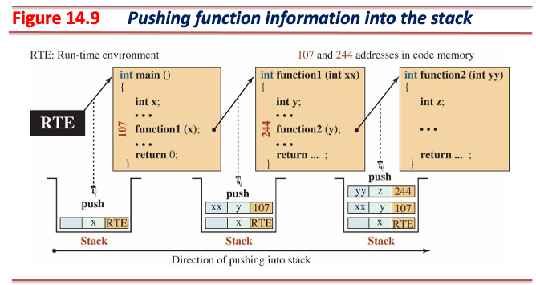
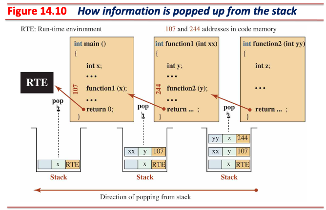
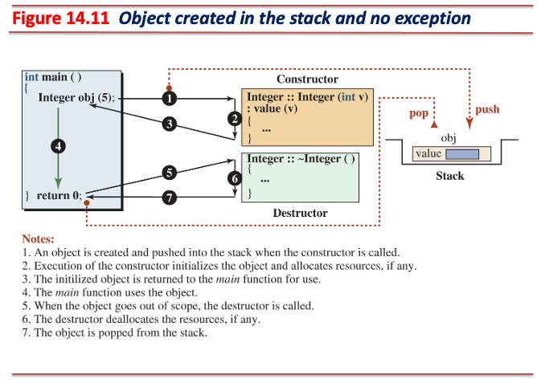
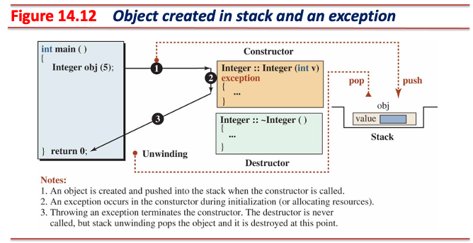
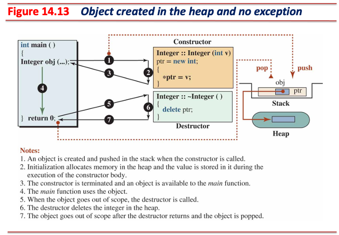
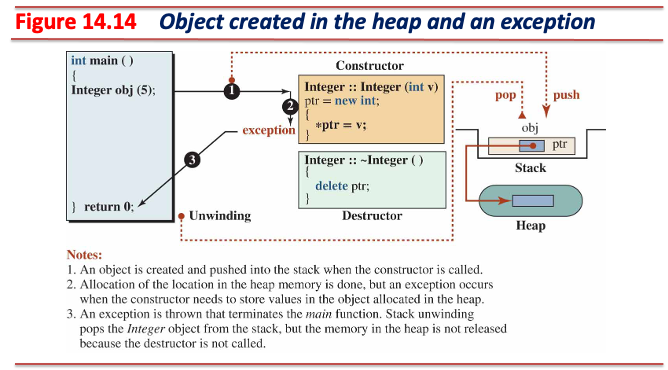
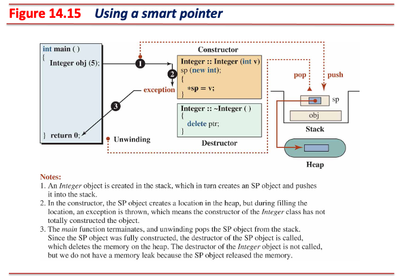
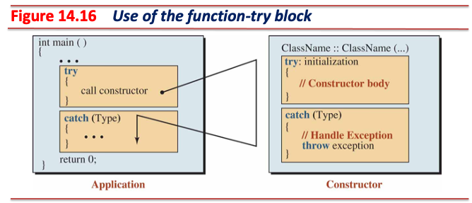
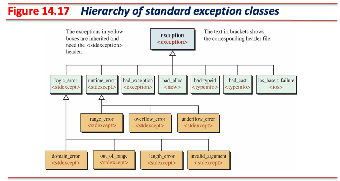

<!-- _class: lead -->
# 객체지향프로그래밍

## 예외 처리 (Exception Handling)

### [munseong.jeong@daejin.ac.kr](mailto:munseong.jeong@daejin.ac.kr)

---

## Try-Catch Block

- 런타임 예외는 논리 오류의 한 종류이지만, **프로그램 지속성(fault tolerance) 관점에서 차이**가 있음:
  - 논리 오류(e.g., 잘못된 알고리즘)는 프로그램의 잘못된 동작을 초래하지만 **중단 없이 계속 실행됨**
  - **런타임 예외는 발생 시 런타임 시스템에 의해 프로그램이 중단됨**
- Try-catch 블록을 사용하면 예외가 발생해도 프로그램이 중단되지 않도록 처리(handling) 가능
  - 두 개의 절(clauses)로 구성됨
    - `try` 절 안에는 예외가 발생할 수 있는 문장들을 작성
    - `catch` 절 안에는 발생한 예외를 처리할 수 있는 문장들을 작성
  - **`try` 절 내부에서 발생한 예외는 처리될 수 있음**

---

## Try-Catch Block (Cont'd - 1)

- `try` 블록 안에서 발생한 예외는 **예외와 연관된 `catch` 블록**에서 처리할 수 있음
  - 발생된 모든 예외는 **타입**을 갖고 있으며, `catch` 블록은 매개변수 자리에 **처리할 예외 타입**을 표현
- `try` 절에서 예외가 발생하면, `catch` 절 블록들을 순차적으로 검색
  - `catch` 블록은 **여러 개 사용 가능**
- 검색 과정에서 **예외 타입과 일치하거나 호환되는 매개변수를 가진 `catch` 블록**을 찾아 제어를 넘김
  - 예외 발생 지점 이후의 문장은 실행될 수 없음

[//]: # (INCLUDE: ./cpp/08/error_handling1.cc --from 5 --to 15 --no-comment)

---

## Try-Catch Block (Cont'd - 2)

### `throw expression`

- 예외를 발생하는 연산자로, 값 또는 객체를 `catch` 절로 전달함
  - 이때 표현식의 값 또는 객체는 **예외 객체**이며, 런타임 시스템은 예외 객체를 **예외 저장소**에 할당
  - `catch` 블록의 매개변수로 전달되는 것은 **예외 객체**임
- 예외의 타입은 `expression` 평가 결과의 타입이 됨

[//]: # (INCLUDE: ./cpp/08/error_handling1.cc --from 17 --to 31 --no-comment)

---

## Try-Catch Block (Cont'd - 3)

### `throw`

- 이미 발생한 예외를 **재전달**하는 연산자이며, `throw`는 **`catch` 블록 내에서만** 사용 가능
  - `throw expression`은 예외를 발생시키고자 하는 모든 곳에서 사용 가능

[//]: # (INCLUDE: ./cpp/08/error_handling2.cc)

---

## Try-Catch Block (Cont'd - 4)

### Try-Catch 세 가지 형태 - 1. Try-Catch 블록이 호출된 함수 안에 존재

---

## Try-Catch Block (Cont'd - 5)

[//]: # (INCLUDE: ./cpp/08/try-catch1.cc)

---

## Try-Catch Block (Cont'd - 6)

### Try-Catch 세 가지 형태 - 2. 호출된 함수의 `try` 블록 내에서 호출한 함수에서 예외 발생

- 예외가 발생하는 부분과 예외를 처리하는 부분이 분리된 형태
  - 주로 외부 함수를 사용해야 하는 경우

---

## Try-Catch Block (Cont'd - 7)

[//]: # (INCLUDE: ./cpp/08/try-catch2.cc)

---

## Try-Catch Block (Cont'd - 8)

### Try-Catch 세 가지 형태 - 3. 호출된, 그리고 호출할 함수 양쪽에 존재하는 Try-Catch 블록

---

## Try-Catch Block (Cont'd - 9)

### Try-Catch 2번 형태와 3번 형태의 차이

- 2번 형태는 호출한 함수에서 예외 발생 시 즉시 함수 호출 측으로 예외를 전달
- 3번 형태는 호출한 함수에서 발생한 예외를 호출한 함수의 `catch` 절에서 **전처리** 후 함수 호출 측으로 예외 재전달

[//]: # (INCLUDE: ./cpp/08/try-catch3.cc --to 15)

---

## Try-Catch Block (Cont'd - 10)

[//]: # (INCLUDE: ./cpp/08/try-catch3.cc --from 17)

---

## `throw` 문장의 위치

### 직접적 감지 (Direct Enclosure)

- `throw` 문장이 `try` 절에 포함된 경우
  - 해당 `try` 절의 `catch` 절을 검색

### 간접적 감지 (Indirect Enclosure)

- `try` 블록에서 호출한 함수 내에 `throw` 문장이 사용된 경우
  - 함수 호출 스택을 거슬러 올라가 **자신을 포함하는 `try` 절의 `catch` 절**을 검색

---

## 감춰진 `throw` 문장

- 라이브러리 또는 외부 함수는 대부분 구현이 감춰져 있으며, 헤더 파일 내 함수 선언만 공개되어 있음
- 헤더 파일은 해당 함수의 **예외 발생 가능성**을 명시함
  - `noexcept`는 예외 지정자(exception specifier)로, 예외를 던지지 않음을 컴파일러에게 알림

---

## 다중 `catch` 절

- 예외를 `catch` 절에서 받으려면 `throw` 문의 표현식 타입과 `catch` 블록 매개변수 타입이 일치해야 함
- 줄임표(ellipsis, `...`)를 사용하면 **모든 종류의 예외를 처리할 수 있는 `catch` 블록을 사용할 수 있음**

---

## 다중 `catch` 절 (Cont'd)

- 줄임표를 사용해 모든 타입 예외를 포착하는 예시

[//]: # (INCLUDE: ./cpp/08/try-catch4.cc)

---

## 예외 전파 (Exception Propagation)

- 예외 발생은 반드시 try-catch 블록에서 발생하진 않음
  - **예외는 발생시키고자 하는 모든 곳에서 던질 수 있음**
- 예외 발생 시 **자신을 포함하는 `try` 절을 발견할 때까지** 함수 호출 스택을 거슬러 올라감
  - **전파된 예외를 `main` 함수에서 처리하지 못하면 프로그램은 중단됨**
  - `main` 함수에서 처리되지 못한 예외는 런타임 시스템으로 전달되어 종료됨

---

## 예외 전파 (Exception Propagation) (Cont'd)

- 전파되는 예외가 처리되지 못한 예시

[//]: # (INCLUDE: ./cpp/08/try-catch5.cc)

---

## 예외 전달 (Rethrowing An Exception)

- 예외 발생 지점에서 해당 예외를 처리하지 않고 다른 지점에서 처리하는 예외 전파 응용 형태
  - 대표적인 활용 예시는 예외 처리 전 **전처리**가 요구되는 경우

[//]: # (INCLUDE: ./cpp/08/throwing.cc --from 4 --to 20 --no-comment)

---

## 예외 사양 (Exception Specification)

- 함수 선언 시 해당 함수의 예외 발생 가능성을 표현

### Any Exception

[//]: # (INCLUDE: ./cpp/08/exception.hpp --from 3 --to 3 --no-comment)

- 일반적인 함수 헤더는 예외 사양을 표현하지 않은 상태이며, 예외 발생 여부는 불확실함
- 이러한 함수는 예외를 발생할 수도, 안 할 수도 있음

### Pre-defined Exceptions

[//]: # (INCLUDE: ./cpp/08/exception.hpp --from 5 --to 7 --no-comment)

- 함수의 발생 가능한 예외의 타입을 열거하여 표현

---

## 예외 사양 (Exception Specification) (Cont'd)

### No Exception

[//]: # (INCLUDE: ./cpp/08/exception.hpp --from 9 --to 10 --no-comment)

- 함수가 예외를 반환하지 않음을 표현하며, 컴파일러가 예외 처리 코드 생성을 최적화할 수 있음
  - 예외 발생 시 즉시 `std::terminate()` 호출로 빠르게 종료하므로 실행 속도 측면에서 이점이 있음

[//]: # (INCLUDE: ./cpp/08/noexcept.cc)

---

## 스택 풀기 (Stack Unwinding)

- 예외가 발생했을 때, 그 예외를 처리할 수 있는 `catch` 절을 찾기 위해 함수 호출 스택을 역순으로 거슬러 올라감
  - 현재 실행중인 함수는 중단되고, **스택 프레임을 역순으로 제거**
  - 각 스택 프레임 제거 시 그 함수 내 지역 객체의 소멸자 호출
  - 예외를 처리할 수 있는 `catch` 절 발견 시 스택 풀기 중단

### Memory Layout

- 런타임 시스템은 프로그램 실행 시 네 개의 프로그램 메모리 영역을 사용함

| Memory Area                      | Purpose                              | Features                                                                 |
| -------------------------------- | ------------------------------------ | ------------------------------------------------------------------------ |
| **Code Memory (Program Memory)** | Stores executable instructions       | Contains compiled machine code executed by the CPU                       |
| **Static Memory**                | Stores global and static variables   | Lifetime spans the entire program execution                              |
| **Stack Memory**                 | Stores function call data            | Managed as LIFO; **holds parameters, local variables, and return addresses** |
| **Heap Memory**                  | Stores dynamically allocated objects | Lifetime controlled manually by allocation and deallocation              |

---

## 스택 풀기 (Stack Unwinding) (Cont'd - 1)

### 함수 호출 스택이 쌓이는 과정

- 각 함수 호출마다 하나의 스택 프레임이 함수 호출 스택에 추가됨
- 스택 프레임은 매개변수 값, 지역변수 값, 상위 호출 함수의 복귀 주소를 저장하는 단위

---

## 스택 풀기 (Stack Unwinding) (Cont'd - 2)

### 스택 풀기 과정

---

## 클래스 예외 처리

- 예외는 클래스의 멤버 함수 내에서도 발생시킬 수 있음

### 소멸자에서의 예외 처리

- C++11 이후 모든 소멸자는 `noexcept`
- 소멸자 내에서 try-catch 블록을 사용한 예외 처리는 가능하나 **예외 전파**는 불가능
  - 소멸자에서 예외 전파를 하면 C++ 표준 함수인 `std::terminate()`가 호출되어 프로그램은 즉시 종료

### 생성자에서의 예외 처리

- 생성자는 예외가 발생할 수 있음
- 생성자 내부에서 예외가 발생하면 **해당 객체는 소멸 시점에 소멸자가 호출되지 않는 불완전 객체**가 됨
  - 생성자는 정상 종료 시 런타임 시스템의 `cleanup_stack` 자료구조에 해당 객체의 소멸자를 등록함
  - 생성자에 문제가 발생할 경우 `cleanup_stack`에 해당 객체의 소멸자 등록에 실패함
    - 이는 **메모리 누수**가 발생할 수 있음

---

## 클래스 예외 처리 (Cont'd - 1)

### 런타임 시스템의 `cleanup_stack` 메커니즘

- 런타임 시스템은 내부적으로 `cleanup_stack`이라는 자료구조를 유지함
  - 각 함수 호출 시 해당 지역 객체의 소멸자 호출 정보는 `__runtime_register_destructor` 함수를 통해 기록됨

[//]: # (INCLUDE: ./cpp/08/snippet_cls.cc --from 4 --to 10 --no-comment)

[//]: # (INCLUDE: ./cpp/08/snippet_cls.cc --from 12 --to 19 --no-comment)

---

## 클래스 예외 처리 (Cont'd - 2)

### 컴파일러에 의해 `__runtime_register_destructor` 함수 호출이 추가된 생성자

[//]: # (INCLUDE: ./cpp/08/snippet_cls.cc --from 21 --to 26 --no-comment)

- 생성자가 정상 종료되면 컴파일러에 의해 추가된 `__runtime_register_destructor` 함수가 호출됨
  - 현재 생성자가 생성하는 객체의 소멸자를 `cleanup_stack`에 등록
  - 해당 객체의 소멸 시점에 `cleanup_stack`을 통해 소멸자가 호출됨
- 만약 생성자 내부에 예외가 발생하면 `__runtime_register_destructor` 함수 호출이 생략되어 불완전 객체가 생성됨

[//]: # (INCLUDE: ./cpp/08/snippet_cls.cc --from 29 --to 34 --no-comment)

---

## 클래스 예외 처리 (Cont'd - 3)

### 스택 메모리 멤버를 사용하는 객체의 생성자 완료

---

## 클래스 예외 처리 (Cont'd - 4)

### 스택 메모리 멤버를 사용하는 객체의 생성자 미완료

- **스택 풀기**를 통해 멤버 자동 정리

---

## 클래스 예외 처리 (Cont'd - 5)

### 힙 메모리 멤버를 사용하는 객체의 생성자 완료

---

## 클래스 예외 처리 (Cont'd - 6)

### 힙 메모리 멤버를 사용하는 객체의 생성자 미완료

- **스택 풀기**에서는 스택 메모리만 정리되며, **힙 메모리** 누수가 발생

---

## 클래스 예외 처리 (Cont'd - 7)

### 힙 메모리 멤버를 사용하는 객체의 생성자 미완료 보완: 스마트 포인터

---

## 클래스 예외 처리 (Cont'd - 8)

### Function-try 블록

- Try-catch 블록의 `try` 절을 함수의 블록으로 사용하는 형태
- 생성자에 function-try 블록 사용 시 **초기화 목록 단계에서 발생한 예외를 처리할 수 있음**
  - 생성자 내부 try-catch 블록은 초기화 목록 단계에서 발생한 예외 처리 불가

---

## 클래스 예외 처리 (Cont'd - 9)

### Function-try 블록: 예외 완전 처리

[//]: # (INCLUDE: ./cpp/08/snippet_function_try.cc --from 12 --to 32 --no-comment)

---

## 클래스 예외 처리 (Cont'd - 10)

### Function-try 블록: 예외 재전달

[//]: # (INCLUDE: ./cpp/08/snippet_function_try.cc --from 34 --to 54 --no-comment)

---

## 표준 예외 클래스

- 모든 표준 예외 클래스는 `std::exception`을 직접 또는 간접적으로 상속함
- 예외 타입에 따라 서로 다른 표준 예외 클래스 제공

---

## 표준 예외 클래스 (Cont'd - 1)

### `std::exception` 클래스의 `public` 인터페이스

[//]: # (INCLUDE: ./cpp/08/std_exception.hpp)

- 주요 멤버 함수로는 `what()`이 있음
  - 예외 정보를 반환하는 가상 함수
  - 파생 클래스들은 이를 오버라이드하여 구체적인 예외 정보 제공에 활용

---

## 표준 예외 클래스 (Cont'd - 2)

### 사용자 정의 예외 클래스

[//]: # (INCLUDE: ./cpp/08/my_exception.hpp)

---

## 표준 예외 클래스 (Cont'd - 3)

### 사용자 정의 예외 클래스 사용 예

[//]: # (INCLUDE: ./cpp/08/my_exception.cc)
