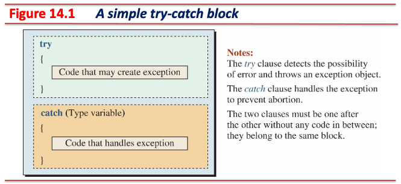
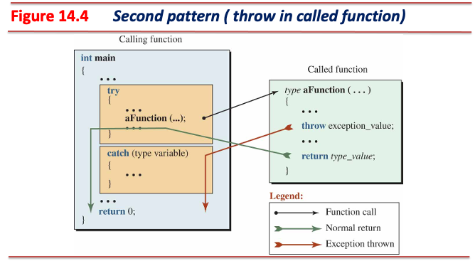
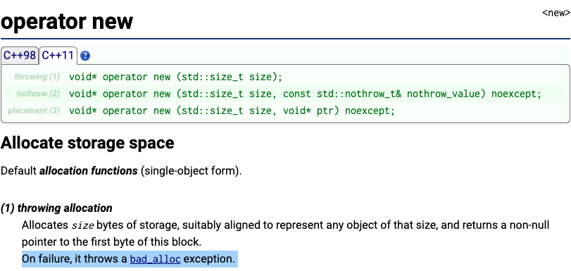
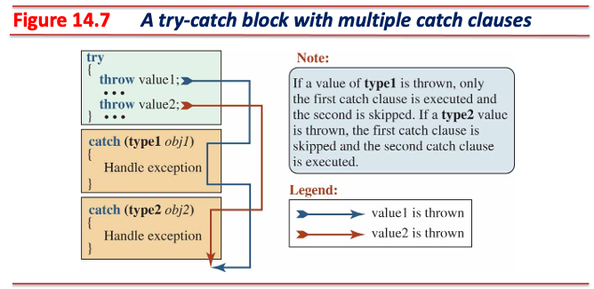
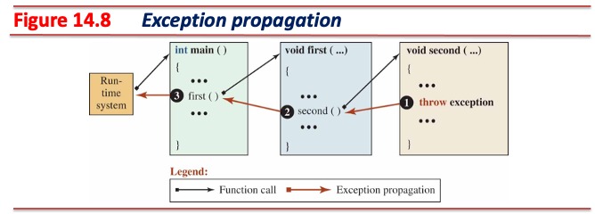

<!-- _class: lead -->
# 객체지향프로그래밍

## 예외 처리 (Exception Handling)

### [munseong.jeong@daejin.ac.kr](mailto:munseong.jeong@daejin.ac.kr)

---

## Try-Catch Block

* 런타임 예외는 논리 오류의 한 종류이지만, **프로그램 지속성 (fault tolerance) 관점에서 차이**가 있음:
  * 논리 오류 (e.g., 잘못된 알고리즘)는 프로그램의 잘못된 동작을 초래하지만 **중단 없이 계속 실행됨**
  * **런타임 예외는 발생 시 런타임 시스템에 의해 프로그램이 중단됨**
* Try-catch 블록을 사용하면 예외가 발생해도 프로그램이 중단되지 않도록 처리 (handling) 가능
  * 두 개의 절 (clauses)로 구성됨
    * `try` 절 안에는 예외가 발생할 수 있는 문장들을 작성
    * `catch` 절 안에는 발생한 예외를 처리할 수 있는 문장들을 작성
  * **`try` 절 내부에서 발생한 예외는 처리될 수 있음**

---

## Try-Catch Block (Cont'd - 1)

* `try` 블록 안에서 발생한 예외는 **에외와 연관된 `catch` 블록**에서 처리할 수 있음
  * 발생된 모든 예외는 **자료형**을 갖고 있으며, `catch` 블록은 매개변수 자리에 **처리할 예외 자료형**을 표현
* `try` 절에서 예외가 발생하면, `catch` 절 블록들을 순차적으로 검색
  * `catch` 블록은 **여러 개 사용 가능**
* 검색 과정에서 **예외 자료형과 일치하거나 호환되는 매개변수를 가진 `catch` 블록**을 찾아 제어를 넘김
  * 예외 발생 지점 이후의 문장은 실행될 수 없음

[//]: # (INCLUDE: ./cpp/08/error_handling1.cc --from 5 --to 15 --no-comment)

---

## Try-Catch Block (Cont'd - 2)

### `throw expression`

* 예외를 발생하는 연산자로, 값 또는 객체를 `catch` 절로 전달함
* 예외의 자료형은 `expression` 평가 결과의 자료형이 됨
* 런타임 시스템은 **예외 객체** (또는 값)를 스택이 아닌 다른 공간에 할당하고, `catch` 블록의 매개변수는 예외 객체를 사용함

[//]: # (INCLUDE: ./cpp/08/error_handling1.cc --from 17 --to 31 --no-comment)

---

## Try-Catch Block (Cont'd - 3)

### `throw`

* 이미 발생한 예외를 **재전달**하는 연산자이며, `throw`는 **`catch` 블록 내에서만** 사용 가능
  * `throw expression`은 예외를 발생시키고자 하는 모든 곳에서 사용 가능

[//]: # (INCLUDE: ./cpp/08/error_handling2.cc)

---

## Try-Catch Block (Cont'd - 4)

### Try-Catch 세 가지 형태 - 1. Try-Catch 블록이 호출된 함수 안에 존재

---

## Try-Catch Block (Cont'd - 5)

[//]: # (INCLUDE: ./cpp/08/try-catch1.cc)

---

## Try-Catch Block (Cont'd - 6)

### Try-Catch 세 가지 형태 - 2. 호출된 함수의 `try` 블록 내에서 호출한 함수에서 예외 발생

* 예외가 발생하는 부분과 예외를 처리하는 부분이 분리된 형태
  * 주로 외부 함수를 사용해야 하는 경우

---

## Try-Catch Block (Cont'd - 7)

[//]: # (INCLUDE: ./cpp/08/try-catch2.cc)

---

## Try-Catch Block (Cont'd - 8)

### Try-Catch 세 가지 형태 - 3. 호출된, 그리고 호출할 함수 양쪽에 존재하는 Try-Catch 블록

---

## Try-Catch Block (Cont'd - 9)

### Try-Catch 2번 형태와 3번 형태의 차이

* 2번 형태는 호출한 함수에서 예외 발생 시 즉시 함수 호출 측으로 예외를 전달
* 3번 형태는 호출한 함수에서 발생한 예외를 호출한 함수의 `catch` 절에서 **전처리** 후 함수 호출 측으로 예외 재전달

[//]: # (INCLUDE: ./cpp/08/try-catch3.cc --to 15)

---

## Try-Catch Block (Cont'd - 10)

[//]: # (INCLUDE: ./cpp/08/try-catch3.cc --from 17)

---

## `throw` 문장의 위치

### 직접적 감지 (Direct Enclosure)

* `throw` 문장이 `try` 절에 포함된 경우
  * 해당 `try` 절의 `catch` 절을 검색

### 간접적 감지 (Indirect Enclosure)

* `try` 블록에서 호출한 함수 내에 `throw` 문장이 사용된 경우
  * 함수 호출 스택을 거슬러 올라가 **자신을 포함하는 `try` 절의 `catch` 절**을 검색

---

## 감춰진 `throw` 문장

* 라이브러리 또는 외부 함수는 대부분 구현이 감춰져 있으며, 헤더 파일 내 함수 선언만 공개되어 있음
* 헤더 파일은 해당 함수의 **예외 발생 가능성**을 명시함
  * `noexcept`는 예외 지정자 (exception specifier)로, 예외를 던지지 않음을 컴파일러에게 알림

---

## 다중 `catch` 절

* 예외를 `catch` 절에서 받으려면 `throw` 문의 표현식 형과 `catch` 블록 매개변수 형이 일치해야 함
* 줄임표 (ellipsis, `...`)을 사용하면 **모든 종류의 예외를 처리할 수 있는 `catch` 블록을 사용할 수 있음**

---

## 다중 `catch` 절 (Cont'd)

* 줄임표를 사용해 모든 자료형 예외를 포착하는 예시

[//]: # (INCLUDE: ./cpp/08/try-catch4.cc)

---

## 예외 전파 (Exception Propagation)

* 예외 발생은 반드시 try-catch 블록에서 발생하진 않음
  * **예외는 발생시키고자 하는 모든 곳에서 던질 수 있음**
* 예외 발생 시 **자신을 포함하는 `try` 절을 발견할 때까지** 함수 호출 스택을 거슬러 올라감
  * **전파된 예외를 `main` 함수에서 처리하지 못하면 프로그램은 중단됨**
  * `main` 함수에서 처리되지 못한 예외는 런타임 시스템으로 전달되어 종료됨

---

## 예외 전파 (Exception Propagation) (Cont'd)

* 전파되는 예외를 처리하지 못하는 예시

[//]: # (INCLUDE: ./cpp/08/try-catch5.cc)

---

## 예외 전달 (Rethrowing An Exception)

* 예외 발생 지점에서 해당 예외를 처리하지 않고 다른 지점에서 처리하는 예외 전파 응용 형태
  * 대표적인 활용 예시는 예외 처리 전 **전처리**가 요구되는 경우

[//]: # (INCLUDE: ./cpp/08/throwing.cc --from 4 --to 20 --no-comment)

---

## 예외 사양 (Exception Specification)

* 함수 선언 시 해당 함수의 예외 발생 가능성을 표현

### Any Exception

[//]: # (INCLUDE: ./cpp/08/exception.hpp --from 3 --to 3 --no-comment)

* 일반적인 함수 헤더는 예외 사양을 표현하지 않은 상태이며, 예외 발생 여부는 불확실함
* 이러한 함수는 예외를 발생할 수도, 안 할 수도 있음

### Pre-defined Exceptions

[//]: # (INCLUDE: ./cpp/08/exception.hpp --from 5 --to 7 --no-comment)

* 함수의 발생 가능한 예외의 자료형을 열거하여 표현

---

## 예외 사양 (Exception Specification) (Cont'd)

### No Exception

[//]: # (INCLUDE: ./cpp/08/exception.hpp --from 9 --to 10 --no-comment)

* 함수가 예외를 반환하지 않음을 표현하며, 컴파일러가 예외 처리 코드 생성을 최적화할 수 있음
  * 예외 발생 시 즉시 `std::terminate()` 호출로 빠르게 종료하므로 실행 속도 측면에서 이점이 있음

[//]: # (INCLUDE: ./cpp/08/noexcept.cc)
