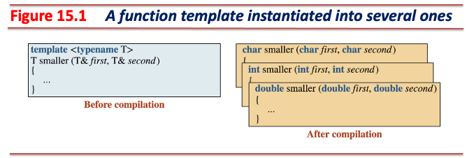
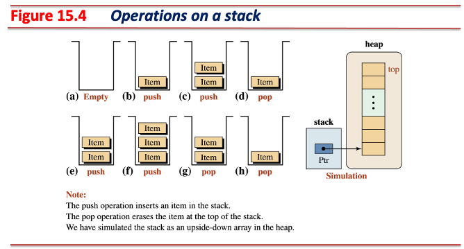
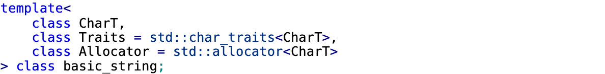
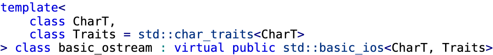

<!-- _class: lead -->
# 객체지향프로그래밍

## 제네릭 프로그래밍 (Generic Programming: Templates)

### [munseong.jeong@daejin.ac.kr](mailto:munseong.jeong@daejin.ac.kr)

---

## 함수 템플릿 (Function Template)

- 함수 내 일부 타입을 컴파일 시점에 확정하는 기법
  - 동일한 로직을 **중복 없이** 다양한 타입으로 구현할 수 있게 해주는 메커니즘

[//]: # (INCLUDE: ./cpp/09/snippet_template.hpp --from 3 --to 7 --no-comment)

- 템플릿 선언(template-declaration)은 두 부분으로 구성됨:
  - Template-head: `template <...>`
  - Declaration: 클래스 또는 함수의 선언(정의)
- `template` 키워드는 함수 또는 클래스 템플릿 정의의 시작을 알림
- `template` 키워드 바로 뒤에는 `<>` 괄호를 사용해 템플릿 매개변수(template parameter) 목록을 정의함
  - 템플릿 매개변수는 필요한 만큼 열거해 사용 가능
- 하나의 함수 템플릿은 여러 번 호출되어 여러 개의 함수 정의가 생성될 수 있음
  - `typename` 키워드로 시작하는 템플릿 매개변수는 타입 매개변수(type parameter)
- 템플릿을 사용한 프로그래밍을 다음과 같이 표현함:
  - 제네릭 프로그래밍(generic programming)
  - 템플릿 프로그래밍(template programming)

---

## 함수 템플릿 (Function Template) (Cont'd - 1)

### Using One Function Template

[//]: # (INCLUDE: ./cpp/09/template.cc)

---

## 함수 템플릿 (Function Template) (Cont'd - 2)

### 함수 템플릿과 함수 오버로딩 간 비교

[//]: # (INCLUDE: ./cpp/09/snippet_template.hpp --from 9 --to 13 --no-comment)

- 함수 템플릿은 **컴파일 시점에 호출 형태에 따라 제네릭 타입을 확정한 함수 코드가 생성됨**

[//]: # (INCLUDE: ./cpp/09/snippet_template.hpp --from 15 --to 22 --no-comment)

- 함수 오버로딩은 컴파일 전에 **호출될 형태를 파악하여 필요한 만큼 코드로 직접 구현해야 함**

---

## 함수 템플릿 (Function Template) (Cont'd - 3)

### Swapping Two Values

[//]: # (INCLUDE: ./cpp/09/template_swap.cc)

---

## 템플릿 인스턴스화 (Template Instantiation)



- 함수 템플릿은 **템플릿 인스턴스화 없이는 사용할 수 없는 코드**
  - 컴파일 시점에 필요한 형태의 함수를 만들기 위해 존재하는 일종의 틀
  - 함수 템플릿은 미완성 상태이며, 구체적인 타입(concrete type)이 없으면 컴파일되지 않음
- 템플릿 인스턴스화는 컴파일 시점에 함수 템플릿의 타입이 확정되어 실제로 실행 가능한 함수가 생성되는 것
  - e.g., `Smaller(12, 15)` 호출 → 컴파일러가 `int` 타입 인스턴스 생성
  - e.g., `Smaller(3.14, 2.71)` 호출 → 컴파일러가 `double` 타입 인스턴스 생성

---

## 함수 템플릿의 변형 (Variations)

### 타입이 아닌 템플릿 매개변수: 비-타입 매개변수 (Non-Type Template Parameter)

- 템플릿 매개변수에 **컴파일 시점에 결정되는 상수 값을 매개변수화**하는 형태
  - 비-타입 매개변수에 사용 가능한 타입([Template parameters and template arguments](https://en.cppreference.com/w/cpp/language/template_parameters)):
    - 정수 타입(`int`, `long`, `size_t`, etc.), 포인터 또는 참조, 열거형, `nullptr`
    - 값으로 사용 가능한 타입이 제한적인 이유는 **컴파일 시점에 값이 확정되는 형태**만 사용 가능
  - **C++17 이하에서는 부동소수점 타입이 허용되지 않음에 유의**(C++20부터 허용)
    - 부동소수점 수는 정밀도 제약이 존재해 값이 다르게 표현될 수 있음

[//]: # (INCLUDE: ./cpp/09/snippet_template.hpp --from 24 --to 34 --no-comment)

---

## 함수 템플릿의 변형 (Variations) (Cont'd - 1)

### Non-Type Template Parameter: Printing an Array

[//]: # (INCLUDE: ./cpp/09/printarray1.cc)

---

## 함수 템플릿의 변형 (Variations) (Cont'd - 2)

### 템플릿 기본 매개변수 (Default Arguments for Template Parameters)

[//]: # (INCLUDE: ./cpp/09/snippet_template.hpp --from 36 --to 42 --no-comment)

- 템플릿 매개변수에 기본 인자(값 또는 타입)를 설정할 수 있음
- 템플릿 기본 매개변수는 오른쪽부터 채워져야 함
- 템플릿 기본 인자로 사용되는 모든 값과 타입은 컴파일 시점에 확정될 수 있어야 함

---

## 함수 템플릿의 변형 (Variations) (Cont'd - 3)

### Default Arguments for Template Parameters: Printing an Array

[//]: # (INCLUDE: ./cpp/09/printarray2.cc)

---

## 함수 템플릿의 변형 (Variations) (Cont'd - 4)

### 명시적 타입 결정

[//]: # (INCLUDE: ./cpp/09/snippet_template.hpp --from 10 --to 13 --no-comment)

#### 템플릿 인자 추론 (Template Argument Deduction)의 모호성

[//]: # (INCLUDE: ./cpp/09/snippet_template.hpp --from 45 --to 45 --no-comment)

#### 명시적 템플릿 인자 지정 (Explicit Template Argument Specification)

[//]: # (INCLUDE: ./cpp/09/snippet_template.hpp --from 46 --to 46 --no-comment)

- `T`는 **`double`타입으로 결정**되어 함수 인스턴스가 생성되며, 인자 `15`는 암묵적으로 `double` 타입으로 간주

---

## 함수 템플릿의 변형 (Variations) (Cont'd - 5)

### 특수화 (Specialization)

[//]: # (INCLUDE: ./cpp/09/snippet_template.hpp --from 10 --to 13 --no-comment)

[//]: # (INCLUDE: ./cpp/09/snippet_template.hpp --from 54 --to 54 --no-comment)

- `Smaller` 템플릿 함수는 **비교 연산자(e.g., less than, `<`)가 정의된 객체**만 처리 가능
  - **`const char*` 타입은 비교 연산자 사용 시 포인터 주소를 비교하므로 의도한 문자열 비교가 되지 않음**

[//]: # (INCLUDE: ./cpp/09/snippet_template.hpp --from 57 --to 60 --no-comment)

- 특수화는 특정 타입에 대해 함수 템플릿의 기본 동작을 오버라이딩함
  - 템플릿 헤더에 `template <>`를 사용하면 명시적 템플릿 특수화 함수(explicit template specialization)가 됨

---

## 함수 템플릿의 변형 (Variations) (Cont'd - 6)

### 함수 템플릿 오버로딩

[//]: # (INCLUDE: ./cpp/09/smaller.cc --to 21 --no-comment)

---

## 함수 템플릿 파일 분할 (File Separation When Using Function Templates)

- **함수 템플릿 사용 시 선언과 구현을 같이 사용할 것을 권장함**
- 함수 템플릿의 선언과 구현을 분리할 경우의 문제점:
  - 함수 템플릿의 선언을 `foo.hpp`, 구현을 `foo.cc`에 작성했다고 가정
  - `main.cc`는 `foo.hpp`를 포함(`#include`)하여 함수 템플릿을 사용해야 한다고 가정
  - 컴파일러가 `main.cc`를 **먼저** 컴파일할 경우, 함수 템플릿의 구현을 찾을 수 없어 템플릿으로부터 인스턴스화가 불가함
- 함수 템플릿의 선언과 구현을 분리할 경우, 아래 두 조건을 만족해야 사용 가능:
  - 함수 템플릿 구현부에 사용될 모든 타입에 대해 명시적 구체화를 통해 컴파일러에게 미리 코드 생성을 지시해야 함
  - **컴파일 의존관계**를 직접 제어해야 함:

```shell
# Situation: The declaration and implementation of the function templates
#            required by main.cc are separated into foo.cc and foo.hpp.

# 1. Create the function template object file first.
g++ foo.cc -o foo.o

# 2. Build the rest of the build that depends on the function template.
g++ main.cc foo.o -o run
```

---

## 함수 템플릿 파일 분할 (File Separation When Using Function Templates) (Cont'd)

- `smaller.hpp`

[//]: # (INCLUDE: ./cpp/09/smaller.hpp)

- `main.cc`

[//]: # (INCLUDE: ./cpp/09/smaller_main.cc)

---

## 클래스 템플릿 (Class Template)

[//]: # (INCLUDE: ./cpp/09/class_template2/fun.hpp --from 16 --to 33 --no-comment)

- 템플릿 매개변수를 사용하는 클래스
- 같은 논리의 클래스를 여러 타입을 사용하는 형태로 인스턴스화가 가능함

---

## 클래스 템플릿 분할 컴파일 - 명시적 인스턴스화 (Explicit Instantiation)

- `fun.hpp`

[//]: # (INCLUDE: ./cpp/09/class_template1/fun.hpp)

---

## 클래스 템플릿 분할 컴파일 - 명시적 인스턴스화 (Explicit Instantiation) (Cont'd - 1)

- `fun.cc`

[//]: # (INCLUDE: ./cpp/09/class_template1/fun.cc)

---

## 클래스 템플릿 분할 컴파일 - 명시적 인스턴스화 (Explicit Instantiation) (Cont'd - 2)

- `main.cc`

[//]: # (INCLUDE: ./cpp/09/class_template1/main.cc)

---

## 클래스 템플릿 분할 컴파일 - 하나의 헤더 파일 (Single Header File)

- `fun.hpp`

[//]: # (INCLUDE: ./cpp/09/class_template2/fun.hpp --to 13 --no-comment)

---

## 클래스 템플릿 분할 컴파일 - 하나의 헤더 파일 (Single Header File) (Cont'd)

- `main.cc`

[//]: # (INCLUDE: ./cpp/09/class_template2/main.cc)

---

## 클래스 템플릿 - 명시적 인스턴스화 vs 하나의 헤더 파일

| Item | Explicit Instantiation | Single Header File |
|------|----------------------|-------------------|
| **File Separation** | Possible (Header + Implementation) | Not Possible (Header Only) |
| **Implementation Privacy** | Hidden | Exposed |
| **Maintenance** | Tedious (Explicit All Types) | Easy |
| **Linking Error Risk** | High (Unsupported Types) | Low |

- **권장 사항: 클래스 템플릿은 하나의 헤더 파일로 작성하는 것이 일반적**
  - 표준 라이브러리의 `vector`, `list` 등도 모두 헤더 파일에 구현되어 있음
- 외부 공개용 헤더 파일 내에 클래스 템플릿을 사용하는 경우는 **거의 없음**
  - 구현 세부사항이 노출되므로 문제 가능성
- 외부에 공개할 헤더 파일에 클래스 템플릿이 존재한다면:
  - 명시적 인스턴스화를 사용하여 배포
  - 템플릿을 사용하지 않는 형태로 재작성 후 배포

---

## 제네릭 스택 (Stack Implementation Using Class Template)

- 제네릭 타입을 사용해 범용적인 스택 클래스 구현
- 동적 메모리할당으로 임의의 용량을 가진 스택 생성 가능
- 예외 기반의 오류 처리로 안전한 스택 연산 제공



---

## 제네릭 스택 (Stack Implementation Using Class Template) (Cont'd - 1)

- `stack_exception.hpp`

[//]: # (INCLUDE: ./cpp/09/stack/stack_exception.hpp)

---

## 제네릭 스택 (Stack Implementation Using Class Template) (Cont'd - 2)

- `stack.hpp`

[//]: # (INCLUDE: ./cpp/09/stack/stack.hpp --to 20)

---

## 제네릭 스택 (Stack Implementation Using Class Template) (Cont'd - 3)

[//]: # (INCLUDE: ./cpp/09/stack/stack.hpp --from 21)

---

## 제네릭 스택 (Stack Implementation Using Class Template) (Cont'd - 4)

- `main.cc`

[//]: # (INCLUDE: ./cpp/09/stack/main.cc)

---

## 템플릿과 관련한 기타 문제 (Other Issues)

### `friend`

- 클래스 템플릿은 일반 함수, 함수 템플릿, 특수화된 함수 템플릿을 `friend`로 가질 수 있음

[//]: # (INCLUDE: ./cpp/09/friend/friend.hpp --from 12 --to 28 --no-comment)

---

## 템플릿과 관련한 기타 문제 (Other Issues) (Cont'd - 1)

### 별칭 (Aliases)

- 템플릿은 코드가 길어짐에 따라 가독성이 낮아질 수 있음
- 별칭(`using`)을 사용해 코드의 길이를 줄이거나 더욱 명료한 표현을 통해 가독성을 높일 수 있음
- 별칭은 단순한 이름 변경일 뿐 새로운 타입을 만드는 것이 아님

[//]: # (INCLUDE: ./cpp/09/alias.cc --from 9 --to 10 --no-comment)

- 템플릿 별칭은 전역 혹은 클래스 범위에서 사용 가능하며, **지역에서 선언 불가**

[//]: # (INCLUDE: ./cpp/09/alias.cc --from 3 --to 5 --no-comment)

[//]: # (INCLUDE: ./cpp/09/alias.cc --from 12 --to 13 --no-comment)

---

## 템플릿과 관련한 기타 문제 (Other Issues) (Cont'd - 2)

### 상속 (Inheritance): 비-템플릿 기반 클래스를 상속하는 클래스 템플릿

[//]: # (INCLUDE: ./cpp/09/inheritance1.cc)

---

## 템플릿과 관련한 기타 문제 (Other Issues) (Cont'd - 3)

### 상속 (Inheritance): 템플릿 기반 클래스를 상속하는 클래스 템플릿

[//]: # (INCLUDE: ./cpp/09/inheritance2.cc)

---

## 표준 템플릿 클래스

### `std::basic_string` 클래스



- `CharT`: 문자열을 구성하는 문자 타입
- `Traits`: 문자열 특성 및 비교 정책
- `Allocator`: 메모리 관리 정책
- C++ 문자열 타입은 [`std::basic_string`](https://en.cppreference.com/w/cpp/string/basic_string.html) 템플릿 클래스를 `char` 타입으로 특수화한 것

[//]: # (INCLUDE: ./cpp/09/snippet_string.hpp --from 7 --to 12 --no-comment)

---

## 표준 템플릿 클래스 (Cont'd)

### `std::basic_istream`, `std::basic_ostream` 클래스




- C++ 표준 입출력 타입은 [`std::basic_istream`](https://en.cppreference.com/w/cpp/io/basic_istream.html), [`std::basic_ostream`](https://en.cppreference.com/w/cpp/io/basic_ostream.html) 템플릿 클래스를 `char` 타입으로 특수화한 것

[//]: # (INCLUDE: ./cpp/09/snippet_stream.hpp --from 4 --to 7 --no-comment)
