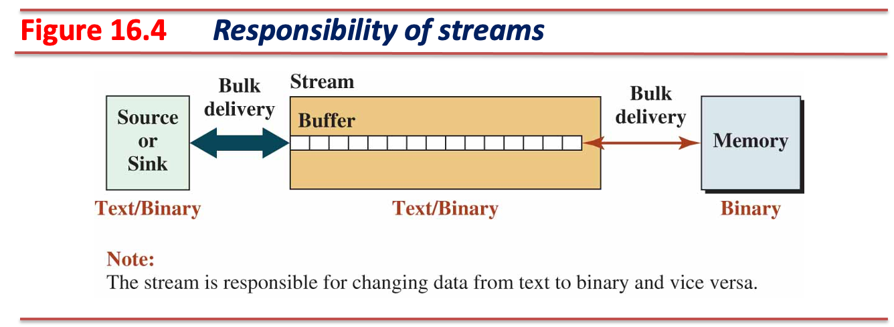
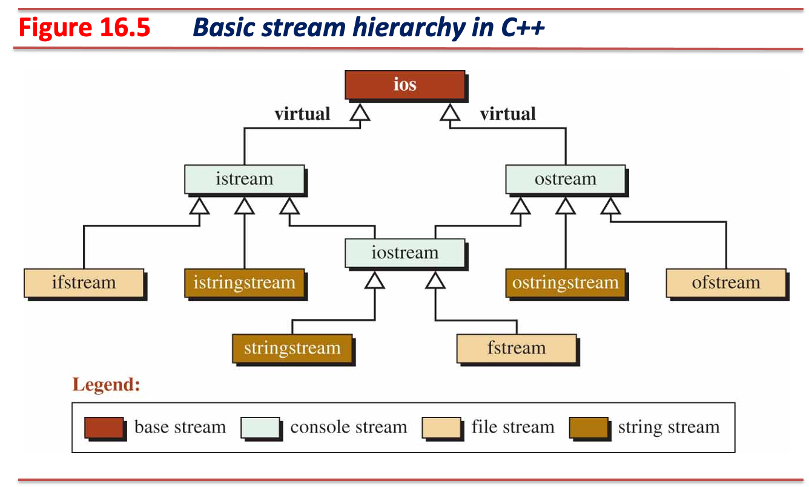
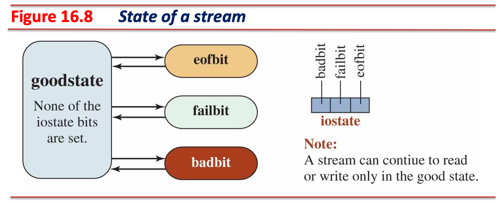
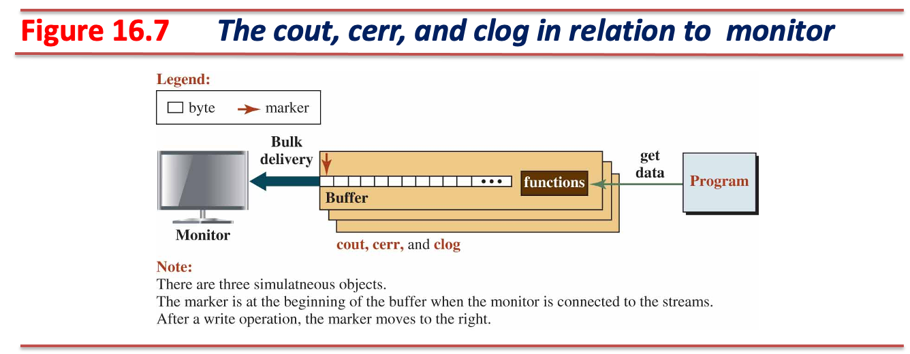
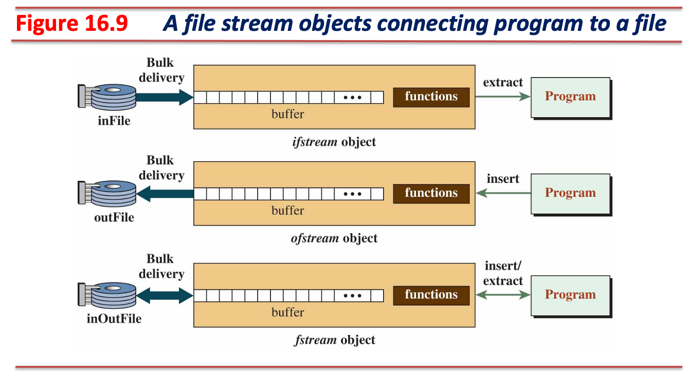
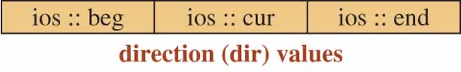
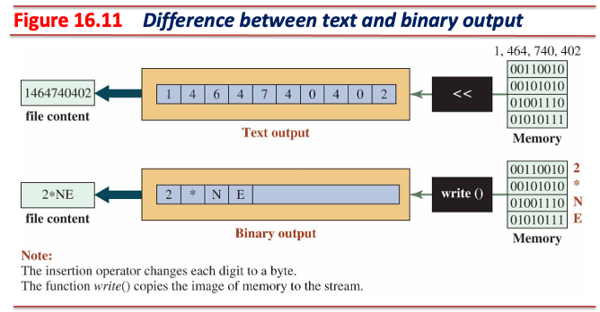
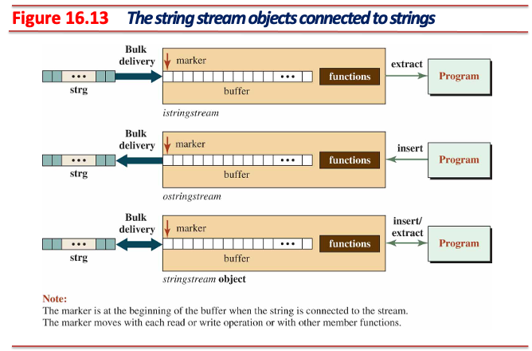

<!-- _class: lead -->
# 객체지향프로그래밍

## 입출력 스트림 (Input / Output Streams)

### [munseong.jeong@daejin.ac.kr](mailto:munseong.jeong@daejin.ac.kr)

---

## 소스 (Source)와 싱크 (Sink)


- 소스는 데이터를 생성하고 싱크는 데이터를 처리함
- 소스와 싱크는 세 종류로 구분:
  - 임시 소스 또는 싱크(temporary source or sink) - 키보드와 모니터(콘솔 입출력)
  - 영구 소스 또는 싱크(permanent source or sink) - 파일
  - 내부 소스 또는 싱크(internal source or sink) - C++ 문자열

---

## 스트림 (Streams)


- 프로그램은 소스 또는 싱크에 직접 연결하지 않고, **중재자(mediator)를 통해 데이터를 주고받음**
- **입출력 스트림은 소스, 싱크와 프로그램 간 데이터 흐름을 관리하는 중재자 역할 수행**
  - 입력 스트림(input stream)은 소스와 프로그램 간 중재 역할
  - 출력 스트림(output stream)은 싱크와 프로그램 간 중재 역할
- 소스, 싱크와 프로그램 간 데이터 전달은 **컴퓨터 메모리**를 통해 이루어짐
- **메모리에 저장되는 데이터는 이진(binary) 형태**이므로, 스트림을 통한 데이터 전달은 바이트 열 형태로 이루어짐

---

## 스트림의 역할


- 소스로부터 생성된 데이터(e.g., 키보드 입력)는 프로그램에 바로 전달되지 않고, 입력 스트림 버퍼에 우선 보관됨
- 프로그램이 내보내는 데이터는 싱크(e.g., 모니터 출력)로 바로 전달되지 않고, 출력 스트림 버퍼에 우선 보관됨

---

## 스트림의 역할 (Cont'd)



- 프로그램의 추출 연산자(`>>`)는 입력 스트림 버퍼의 내용을 파싱하여, **요구하는 타입으로 변환**한 뒤 변수에 저장
  - 소스가 키보드이고, `double` 타입 변수 `d`에 실수 타입 값을 입력해야 하는 상황
  - `3.14`를 입력했다면 입력 스트림 버퍼에는 `0x33 0x2E 0x31 0x34`가 저장됨
  - `std::cin >> d`는 버퍼에 저장된 바이트 열을 읽어와 `double` 값 `3.14`로 변환 후 변수에 저장
- 프로그램의 삽입 연산자(`<<`)는 내보낼 데이터를 **싱크가 처리할 수 있는 바이트 열로 변환**하여 출력 버퍼에 저장
  - 싱크가 모니터라면 출력 스트림 버퍼에는 문자 바이트 열이 저장되어야 함
  - `std::cout << 3.14;`는 `double` 값 `3.14`를 `0x33 0x2E 0x31 0x34`로 변환하여 버퍼에 저장

---

## 스트림 클래스 (Stream Classes)



---

## 스트림 클래스 (Stream Classes) (Cont'd - 1)

### `std::ios`

- 가상 기반 클래스이며, 모든 입출력 클래스가 상속하는 데이터 멤버와 멤버 함수가 구현되어 있음
  - 인스턴스화가 불가능한 클래스

### `std::istream`, `std::ostream`, `std::iostream`

- 콘솔 스트림(console streams) 객체를 위한 클래스로, 키보드와 모니터를 소스와 싱크로 사용

### `std::ifstream`, `std::ofstream`, `std::fstream`

- 파일 스트림(file streams) 객체를 위한 클래스로, 파일을 소스와 싱크로 사용

### `std::istringstream`, `std::ostringstream`, `std::stringstream`

- 문자열 스트림(string streams) 객체를 위한 클래스로, `std::string`타입 객체를 소스와 싱크로 사용

---

## 스트림 클래스 (Stream Classes) (Cont'd - 2)

### 스트림 사용을 위한 다섯 단계 절차

1. 스트림 객체를 생성한다.
2. 객체 생성 시 연결하고자 하는 대상(소스, 싱크)과 연결한다.
3. 스트림을 통해 데이터를 읽어오거나(입력 스트림) 데이터를 내보낸다(출력 스트림).
4. 더 이상 스트림을 사용하지 않는다면 연결했던 대상(소스, 싱크)과의 연결을 해제한다.
5. 스트림 객체를 소멸한다.

---

## 스트림 클래스 (Stream Classes) (Cont'd - 3)

### 스트림 객체의 특성 (Characteristics of Stream Objects)

- **복사 생성자와 대입 연산자가 없음**
  - 스트림 객체는 내부 상태를 갖고 있음(e.g., 스트림 버퍼, 버퍼를 가리키는 포인터, etc.)
  - 스트림 객체를 복사 또는 대입할 경우 **데이터 불일치** 또는 **리소스 충돌**이 발생할 수 있음
  - 스트림 객체는 함수로의 값 전달 또는 함수의 반환값으로 사용할 수 없음
- 스트림 객체는 **매 사용마다 부수효과가 발생**하므로 `const` 한정자를 같이 사용할 수 없음
  - 데이터를 입력받거나 출력할 때 스트림 버퍼와 이를 가리키는 포인터가 갱신됨
  - 입출력 과정 중에 오류가 발생할 경우 이를 스트림 내부 상태에 기록함

---

## 스트림 클래스 (Stream Classes) (Cont'd - 4)

### 스트림 상태 (Stream State)



- `std::ios` 클래스는 상태 관련 데이터 멤버 및 멤버 함수를 가지며, 모든 스트림 클래스 객체는 상태 멤버를 갖고 있음
  - 모든 스트림 클래스는 `std::ios` 클래스 멤버를 상속함
- 스트림 객체는 데이터를 읽어오거나 내보내는 과정 중에 문제가 발생하면 스트림 객체 내 상태에 실패 내용을 기록함

---

## 스트림 클래스 (Stream Classes) (Cont'd - 5)

### 스트림 상태 데이터 멤버

| Constants           | Input Stream                   | Output Stream               |
| ------------------- | ------------------------------ | --------------------------- |
| `std::ios::eofbit`  | No more characters to extract. | Not applicable.             |
| `std::ios::failbit` | An invalid read operation.     | An invalid write operation. |
| `std::ios::badbit`  | Stream integrity is lost.      | Stream integrity is lost.   |
| `std::ios::goodbit` | Everything is fine.            | Everything is fine.         |

- `eofbit`와 `failbit`의 관계
  - 스트림의 끝(`EOF`)에서 읽기를 시도하면 작업은 **실패**하여 `eofbit`와 `failbit` 둘 다 설정됨
  - `failbit`가 설정되면, `eofbit` 때문인지, 다른 논리적 오류 때문인지 확인해야 함
- `failbit` (복구 가능)
  - 논리적 오류가 발생한 경우(e.g., 숫자 대신 문자가 입력된 경우)
  - 오류 상태를 지우고(clear) 버퍼를 비우면 스트림을 복구하여 재사용 가능
- `badbit` (복구 불가능)
  - **스트림의 무결성이 깨진 심각한 상태**(e.g., 디스크 오류)
  - 스트림은 더 이상 사용할 수 없으며 새로 생성해야 함

---

## 스트림 클래스 (Stream Classes) (Cont'd - 6)

### 스트림 상태 멤버 함수

| Functions                  | Return values                                                       |
| -------------------------- | ------------------------------------------------------------------- |
| `bool eof()`               | `true` if `eofbit` is set; `false` otherwise                        |
| `bool fail()`              | `true` if `failbit` or `badbit` is set; `false` otherwise           |
| `bool bad()`               | `true` if `badbit` is set; `false` otherwise                        |
| `bool good()`              | `true` if the stream is in good condition; `false` otherwise        |
| `void clear()`             | It cleans all three bits (sets to zero)                             |
| `explicit operator bool()` | `true` if the stream is usable (i.e., `!fail()`); `false` otherwise |

---

## 스트림 클래스 (Stream Classes) (Cont'd - 7)

- 스트림 상태 멤버 함수를 활용한 예제 코드

[//]: # (INCLUDE: ./cpp/10/src/00_stream1.cc)

---

## 스트림 클래스 (Stream Classes) (Cont'd - 8)

- 스트림 복구 예제 코드

[//]: # (INCLUDE: ./cpp/10/src/01_stream2.cc)

---

## 콘솔 스트림 (Console Streams)

### `std::cin`


- `std::istream`타입 전역 객체이며, 프로그램 실행 시 콘솔 입력(키보드)과 연결됨
- 프로그램 종료 시 런타임 시스템에 의해 키보드와의 연결이 자동으로 끊어진 뒤 소멸됨
  - 시스템이 객체 생성, 소스와의 연결, 소스와의 연결 해제, 객체 소멸을 담당하며, 사용자는 데이터 처리만 하면 됨

---

## 콘솔 스트림 (Console Streams) (Cont'd - 1)

### `std::cout`, `std::cerr`, `std::clog`



- `std::ostream`타입 전역 객체이며, 프로그램 실행 시 콘솔 출력(모니터)과 연결됨
- 프로그램 종료 시 런타임 시스템에 의해 모니터와의 연결이 자동으로 끊어진 뒤 소멸됨
  - 시스템이 객체 생성, 싱크와의 연결, 싱크와의 연결 해제, 객체 소멸을 담당하며, 사용자는 데이터 처리만 하면 됨

---

## 콘솔 스트림 (Console Streams) (Cont'd - 2)

### 콘솔 스트림 객체의 특징 1

- `std::cout` 객체와 `std::cin` 객체는 **동기화되어 있음**
  - `std::cout` 출력 결과는 스트림 버퍼에 **플러시 조건이 만족될 때까지 임시 보관**
  - `std::cin` 입력 시 `std::cout` 버퍼의 모든 데이터를 플러시(flush)하도록 동작이 연결되어 있음
  - 입출력이 빈번히 사용되는 상황에서 동기화된 콘솔 객체는 **잦은 플러시로 인한 성능 저하**가 발생할 수 있음

[//]: # (INCLUDE: ./cpp/10/src/02_console1.cc --from 33 --to 35 --no-comment)

- `std::cout` 객체와 `std::cin` 객체 동기화는 다음과 같이 끊을 수 있음:

[//]: # (INCLUDE: ./cpp/10/src/02_console1.cc --from 28 --to 29 --no-comment)

---

## 콘솔 스트림 (Console Streams) (Cont'd - 3)

- 콘솔 스트림 객체의 동기화를 해제하는 예제 코드

[//]: # (INCLUDE: ./cpp/10/src/02_console1.cc --from 2 --to 23 --no-comment)

---

## 콘솔 스트림 (Console Streams) (Cont'd - 4)

### 콘솔 스트림 객체의 특징 2

- `std::cout` 객체는 운영체제의 표준 출력 스트림(`stdout`)에 연결됨
  - 출력 오버라이딩 가능
- `std::cerr`, `std::clog` 객체는 운영체제의 표준 오류 스트림(`stderr`)에 연결됨
  - 표준 출력의 재지정(`>` 또는 `|`)에 영향받지 않음
  - 오류 또는 로깅 메시지가 표준 출력과 혼재될 가능성을 배제하기 위함

### 콘솔 스트림 객체의 특징 3

- `std::cerr`는 프로그램에서 발생한 오류 메시지를 **즉시 출력**하는 용도로 사용
  - 스트림 버퍼에 데이터를 보관하지 않고 즉시 싱크로 내보냄
- `std::clog`는 프로그램의 디버깅 또는 로깅 메시지를 출력하는 용도로 사용
- 플러시 조건을 만족하면 버퍼는 데이터를 싱크로 내보냄

---

## 콘솔 스트림 (Console Streams) (Cont'd - 5)

### 출력 버퍼 플러시 조건

- 명시적으로 플러시를 사용한 경우
- 스트림이 닫힐 때
  - 콘솔 스트림은 프로그램 종료 시 시스템에 의해 자동 닫힘
- 출력 스트림 버퍼가 가득 찬 경우

[//]: # (INCLUDE: ./cpp/10/src/03_console2.cc)

---

## 콘솔 스트림 (Console Streams) (Cont'd - 6)

### 콘솔 스트림 멤버 함수: `get`, `put`

[//]: # (INCLUDE: ./cpp/10/src/04_console3.cc)

---

## 콘솔 스트림 (Console Streams) (Cont'd - 7)

### 콘솔 스트림 멤버 함수: `ignore`

[//]: # (INCLUDE: ./cpp/10/src/05_console4.cc)

---

## 콘솔 스트림 (Console Streams) (Cont'd - 8)

### 콘솔 스트림 멤버 함수: `getline`

[//]: # (INCLUDE: ./cpp/10/src/06_console5.cc)

---

## 파일 스트림 (File Streams)



- 콘솔 스트림에서의 데이터 멤버와 멤버 함수를 모두 사용할 수 있음
  - `std::ifstream` 클래스는 `std::istream` 클래스로부터 상속
  - `std::ofstream` 클래스는 `std::ostream` 클래스로부터 상속
  - `std::fstream` 클래스는 `std::iostream` 클래스로부터 상속

---

## 파일 스트림 (File Streams) (Cont'd - 1)

### 파일 스트림 사용 방법

- `<fstream>` 헤더 파일을 포함하면 파일 스트림 객체를 사용할 수 있음
- 생성된 객체는 **소스, 싱크와 연결된 상태가 아니므로** 연결 작업을 수행해야 사용할 수 있음

[//]: # (INCLUDE: ./cpp/10/src/07_file1.cc --from 2 --to 2 --no-comment)

### 파일 스트림 객체 생성 후 소스, 싱크 연결

- `open` 멤버 함수의 인자로 파일의 경로를 전달하면 파일을 객체의 소스 또는 싱크로 사용할 수 있음

[//]: # (INCLUDE: ./cpp/10/src/07_file1.cc --from 7 --to 13 --no-comment)

---

## 파일 스트림 (File Streams) (Cont'd - 2)

### 파일 스트림 객체 연결 상태 확인

- `is_open` 멤버 함수를 사용해 객체가 소스, 싱크와 연결되었는지 확인 가능
  - 반환값은 `bool` 타입으로, 연결에 성공한 경우 `true`, 실패한 경우 `false` 반환
  - `open` 멤버 함수의 매개변수로 넘겨준 경로에 파일이 존재하지 않거나, 권한이 없을 경우 실패할 수 있음

[//]: # (INCLUDE: ./cpp/10/src/07_file1.cc --from 17 --to 19 --no-comment)

### 파일 스트림 객체 연결 해제 후 소멸

- 더 이상 스트림 객체를 사용하지 않는다면 `close` 멤버 함수를 통해 객체와 연결된 파일을 해제할 수 있음

[//]: # (INCLUDE: ./cpp/10/src/07_file1.cc --from 23 --to 25 --no-comment)

---

## 파일 스트림 (File Streams) (Cont'd - 3)

- 파일 스트림 객체를 통해 파일을 싱크로 사용한 예제 코드

[//]: # (INCLUDE: ./cpp/10/src/08_outfile.cc)

---

## 파일 스트림 (File Streams) (Cont'd - 4)

- 파일 스트림 객체를 통해 파일을 소스로 사용한 예제 코드

[//]: # (INCLUDE: ./cpp/10/src/09_infile.cc)

---

## 파일 스트림 (File Streams) (Cont'd - 5)

### 파일 열기 모드 (Opening Modes)

- `std::ios` 클래스에 정의되어 있음
- **파일 시스템의 실제 파일을 열 때 사용**하며, 콘솔 스트림 또는 문자열 스트림에서는 사용하지 않음

| Constant           | Explanation                                                     |
| ------------------ | --------------------------------------------------------------- |
| `std::ios::app`    | Seek to the end of stream **before each write** (append).       |
| `std::ios::binary` | Open in binary mode (**default is text**).                      |
| `std::ios::in`     | Open for reading (**default mode of `std::ifstream` object**).  |
| `std::ios::out`    | Open for writing (**default mode of `std::ofstream` object**).  |
| `std::ios::trunc`  | **Discard the contents** of the stream when opening (truncate). |
| `std::ios::ate`    | Seek to the end of stream **immediately after open** (at end).  |

---

## 파일 스트림 (File Streams) (Cont'd - 6)

### 파일 스트림 객체의 열기 모드


- `std::ifstream` 객체는 `std::ios::in` 모드가 기본 설정됨
  - 읽기 모드이며, **파일이 존재하지 않으면 파일 열기에 실패함**
- `std::ofstream` 객체는 `std::ios::out | std::ios::trunc` 모드가 기본 설정됨
  - 쓰기 모드이며, **파일이 존재하지 않으면 파일을 새로 생성**하거나, **파일이 존재한다면 파일의 내용은 초기화됨**
- `std::fstream` 객체는 `std::ios::in | std::ios::out` 모드가 기본 설정됨
  - 읽기/쓰기 모드이며, **파일이 존재하지 않으면 파일 열기에 실패**하거나, **파일이 존재한다면 파일의 내용을 유지함**
- `std::ios::ate`는 파일을 열 때 읽기/쓰기 위치의 초기값을 파일의 끝(at end)으로 설정함
- `std::ios::app`은 쓰기 모드에서 파일이 존재할 경우 파일 내용을 초기화하지 않고 내용의 끝에 데이터를 추가함
  - e.g., `std::ofstream out("test.txt")`는 기본 모드 사용
    - `std::ios::out | std::ios::trunc` 모드 사용
  - e.g., `std::ofstream out("test.txt", std::ios::app)`는 `std::ios::trunc`를 억제
    - `std::ios::out | std::ios::app` 모드 사용

---

## 파일 스트림 (File Streams) (Cont'd - 7)

- 파일 스트림 객체 예제 코드

[//]: # (INCLUDE: ./cpp/10/src/10_file2.cc)

---

## 파일 스트림 (File Streams) (Cont'd - 8)

### 파일 스트림 객체의 기타 멤버 함수

- 다음 함수들은 콘솔 클래스에 선언되어 있으며, 파일 스트림 객체에서 유용하게 사용할 수 있음

| Function                                           | Explanation                                                        |
| -------------------------------------------------- | ------------------------------------------------------------------ |
| `std::streamsize gcount() const`                   | Counts characters extracted in the last input                      |
| `std::istream& unget()`                            | Puts back the last character extracted from the stream             |
| `std::istream& putback(char c)`                    | Same as `unget` but requires a specific character to be put back   |
| `int peek()`                                       | Looks at the next character without extracting it                  |
| `std::istream& ignore(int n = 1, int d = eof)`     | Ignores `n` characters or up to a specified delimiter `d`          |

---

## 파일 스트림 (File Streams) (Cont'd - 9)

- 파일 스트림 멤버 함수 사용 예제: `unget`을 사용해 타입에 따른 값 읽어오기

[//]: # (INCLUDE: ./cpp/10/src/11_file3.cc --to 17)

---

## 파일 스트림 (File Streams) (Cont'd - 10)

[//]: # (INCLUDE: ./cpp/10/src/11_file3.cc --from 18)

---

## 파일 스트림 (File Streams) (Cont'd - 11)

### 순차 접근과 임의 접근 (Sequential vs Random Access)

- 파일은 연속적인 바이트의 집합
- 파일 스트림 객체를 사용해 파일 읽기 작업을 수행하면 파일의 내용이 입력 스트림 버퍼로 복사됨
- 파일 스트림 객체를 사용해 파일 쓰기 작업을 수행하면 출력 스트림 버퍼에 임시 보관됨
  - 출력 스트림 버퍼에 있는 내용은 플러시 조건을 만족하면 파일로 내보냄
- **스트림 버퍼에 있는 내용을 대상으로 순차적으로 처리하거나 임의 접근하여 처리할 수 있음**
  - 각 파일 스트림 객체는 하나의 조정자가 존재함
  - `std::ifstream` 객체의 조정자는 파일 스트림 버퍼에서 다음에 읽을 내용의 위치를 관리
  - `std::ofstream` 객체의 조정자는 파일 스트림 버퍼에서 다음에 쓸 내용의 위치를 관리
  - `std::fstream` 객체의 조정자는 파일 스트림 버퍼에서 다음에 읽을 내용의 위치와 다음에 쓸 내용의 위치를 관리
    - **하나의 조정자가 논리적인 읽기 위치와 쓰기 위치를 구별하여 같이 관리함**

---

## 파일 스트림 (File Streams) (Cont'd - 12)

### 임의 접근을 위한 멤버 함수와 위치 조정 변수



| Input functions                                                  | Output functions                                                  |
| ---------------------------------------------------------------- | ----------------------------------------------------------------- |
| `std::streampos tellg()`                                         | `std::streampos tellp()`                                          |
| `std::istream& seekg(std::streampos pos)`                        | `std::ostream& seekp(std::streampos pos)`                         |
| `std::istream& seekg(std::streamoff off, std::ios::seekdir dir)` | `std::ostream& seekp(std::streamoff off, std::ios::seekdir dir)`  |

- 접두사 `g`는 입력(입력 스트림 버퍼)의 `get`, 접두사 `p`는 출력(출력 스트림 버퍼)의 `put`을 의미
- `seekg` 함수는 위치 조정 변수(`std::ios_base::seekdir`)를 사용해 스트림 버퍼 내 조정자 위치를 변경할 수 있음
  - `std::ios::beg`: 스트림 버퍼의 시작을 가리킴
  - `std::ios::end`: 스트림 버퍼의 마지막을 가리킴(실제 데이터 바로 뒤를 가리킴)
  - `std::ios::cur`: 스트림 버퍼 내 조정자의 현재 위치
  - e.g., `file.seekg(2, std::ios::beg)`: 조정자를 버퍼의 시작 위치로부터 2만큼 떨어진 곳으로 설정

---

## 파일 스트림 (File Streams) (Cont'd - 13)

- 파일 입력 스트림 조정자 변수 설정 예제 코드

[//]: # (INCLUDE: ./cpp/10/src/12_file4.cc)

---

## 파일 스트림 (File Streams) (Cont'd - 14)

- 파일 입력 스트림 조정자 변수 확인 예제 코드

[//]: # (INCLUDE: ./cpp/10/src/13_file5.cc)

---

## 파일 스트림 (File Streams) (Cont'd - 15)

- 파일 출력 스트림 조정자 변수 설정 예제 코드: 파일 내 빈칸을 개행문자로 치환

[//]: # (INCLUDE: ./cpp/10/src/14_file6.cc)

---

## 파일 스트림 (File Streams) (Cont'd - 16)

- 파일 출력 스트림 조정자 변수 확인 예제 코드: 파일 크기 계산

[//]: # (INCLUDE: ./cpp/10/src/15_file7.cc)

---

## 파일 스트림 (File Streams) (Cont'd - 17)

- 파일 출력 스트림 조정자 변수 확인 예제 코드: 파일 크기 계산 결과

```text
There       // 5 + 1('\n')
are         // 3 + 1('\n')
wonderful   // 9 + 1('\n')
things      // 6 + 1('\n')
to          // 2 + 1('\n')
do          // 2 + 1('\n')
in          // 2 + 1('\n')
life.       // 5           => File size: 41
```

---

## 이진 입출력 (Binary Input/Output)



- 파일 입출력 시 텍스트와 이진 데이터를 입출력할 수 있음
- 이진 입출력은 텍스트 형태가 아닌 **바이너리로 표현되는 데이터**를 대상으로 입출력
  - e.g., 오디오, 비디오, 사진 등 텍스트가 아닌 모든 데이터
- `double`타입 상수 `45.78`을 텍스트 형태로 내보내면 5 바이트(`34 35 2e 37 38`)를 사용
- `double`타입 상수 `45.78`을 바이너리 형태로 내보내면 8 바이트(`a4 70 3d 0a d7 e3 46 40`)를 사용

---

## 이진 입출력 (Binary Input/Output) (Cont'd - 1)

- 간단한 이진 입출력 예제 코드

[//]: # (INCLUDE: ./cpp/10/src/16_binary1.cc)

---

## 이진 입출력 (Binary Input/Output) (Cont'd - 2)

- 이진 입출력을 사용한 클래스 객체 입출력

[//]: # (INCLUDE: ./cpp/10/src/17_binary2.cc --to 15)

---

## 이진 입출력 (Binary Input/Output) (Cont'd - 3)

[//]: # (INCLUDE: ./cpp/10/src/17_binary2.cc --from 16)

---

## 이진 입출력 (Binary Input/Output) (Cont'd - 4)

- 이진 입출력을 사용한 임의 접근 예제 코드

[//]: # (INCLUDE: ./cpp/10/src/18_binary3.cc --to 15)

---

## 이진 입출력 (Binary Input/Output) (Cont'd - 5)

[//]: # (INCLUDE: ./cpp/10/src/18_binary3.cc --from 16)

---

## 이진 입출력 (Binary Input/Output) (Cont'd - 6)

### 힙 객체 직렬화 (Serialization)의 필요성

- 객체가 `std::string`, `char*` 등 힙(Heap) 메모리를 가리키는 포인터를 포함할 경우 **직렬화**를 수행해야 함
  - 힙 메모리를 사용하는 객체를 직렬화 없이 이진 형태로 내보낼 경우, **무효한 데이터**가 내보내짐
  - e.g., 객체를 이진 쓰기(write) 시, 포인터의 주소값(예: `0x7FFF1234`)만 파일에 저장됨
- 직렬화는 이진 쓰기 이전에 포인터가 가리키는 실제 데이터를 파일에 저장하는 과정

[//]: # (INCLUDE: ./cpp/10/src/19_serialization.cc --from 9 --to 16 --no-comment)

---

## 이진 입출력 (Binary Input/Output) (Cont'd - 7)

- 이진 입출력 직렬화 예제 코드

[//]: # (INCLUDE: ./cpp/10/src/19_serialization.cc --to 7 --from 9 --to 16)

---

## 이진 입출력 (Binary Input/Output) (Cont'd - 8)

[//]: # (INCLUDE: ./cpp/10/src/19_serialization.cc --from 19)

---

## 문자열 스트림 (String Streams)



- `<sstream>` 헤더 파일 사용
- C++ 문자열을 소스 또는 싱크로 활용

---

## 문자열 스트림 (String Streams) (Cont'd - 1)

### 문자열 스트림 멤버 함수 `str()`

- 파일 스트림과 달리 소스 또는 싱크와의 연결이 필요하지 않음
- 문자열 스트림 클래스의 `str` 함수를 사용해 현재 스트림 객체의 데이터를 설정하거나 읽어올 수 있음:

[//]: # (INCLUDE: ./cpp/10/src/20_string.cc --from 6 --to 14 --no-comment)

[//]: # (INCLUDE: ./cpp/10/src/20_string.cc --from 18 --to 23 --no-comment)

---

## 문자열 스트림 (String Streams) (Cont'd - 2)

- 문자열 스트림 객체 사용 예제 코드

[//]: # (INCLUDE: ./cpp/10/src/21_string1.cc)

---

## 데이터 형식화 (Formatting Data)

- 스트림 객체는 데이터 형식을 변경하는 조정자(manipulators)를 사용할 수 있음
  - `std::ios` 클래스에 정의되어 있음
- 삽입 연산자와 추출 연산자에 조정자를 같이 **연쇄적으로 사용**해 데이터를 형식화할 수 있음

[//]: # (INCLUDE: ./cpp/10/src/22_manip.cc --from 2 --to 5 --no-comment)

[//]: # (INCLUDE: ./cpp/10/src/22_manip.cc --from 13 --to 16 --no-comment)

---

## 데이터 형식화 (Formatting Data) (Cont'd - 1)

- 매개변수 없는 조정자 예: 텍스트 출력 색상을 변경하는 조정자([control sequence introducer](https://en.wikipedia.org/wiki/ANSI_escape_code#Control_Sequence_Introducer_commands), `\033 n m`)

[//]: # (INCLUDE: ./cpp/10/src/23_manip1.cc)

---

## 데이터 형식화 (Formatting Data) (Cont'd - 2)

- 매개변수 있는 조정자 예: 간단한 로깅 클래스

[//]: # (INCLUDE: ./cpp/10/src/24_manip2.cc)
