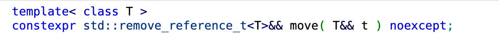
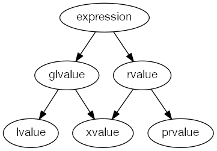
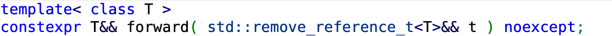

<!-- _class: lead -->
# 객체지향프로그래밍

## 이동 의미론 (Move Semantics)

### [munseong.jeong@daejin.ac.kr](mailto:munseong.jeong@daejin.ac.kr)

---

## 이동 생성자

- C++ 생성자 종류는 아래와 같음:
  - 기본 생성자(default constructor)
  - 매개변수 생성자(parameterized constructor)
  - 복사 생성자(copy constructor)
  - **이동 생성자(move constructor)**
- 클래스 내에 이동 생성자가 구현되어 있지 않다면 컴파일러가 암묵적으로 생성함
- *lvalue*로부터 이동 생성자를 호출하기 위해서는 `std::move` 함수를 사용해야 함
  - `<utility>` 헤더 파일 필요

### 복사 생성자의 한계

- 객체를 복사해야 하는 상황에서 복사 생성자가 호출됨
  - 새로운 메모리 공간을 할당한 뒤, 기존 객체로부터 복사해오는 형태
- 객체의 데이터가 클 경우 빈번한 복사 생성자 호출은 성능 저하의 원인이 됨

### 이동 생성자의 도입

- **객체의 소유권만을 이전하는 생성자**로, 복사가 불필요한 상황에서 활용됨

---

## 이동 생성자 (Cont'd - 1)

### 이동 생성자 구현

[//]: # (INCLUDE: ./cpp/11/src/01_move_ctor2.cc --from 16 --to 19 --no-comment)

- 매개변수 `other`는 소유권을 **넘겨주는** 객체이며, 생성자를 호출한 호스트 객체가 소유권을 **넘겨받음**
  - 객체의 소유권만 전달한 것이지, **객체가 소멸된 것은 아님**
- 새로 생성될 객체에 소유권을 넘겨준 원본 객체는 이후 **안전하게 소멸될 수 있도록** 멤버를 적절히 무효화(nullify)해야 함

### 이동 생성자 호출

[//]: # (INCLUDE: ./cpp/11/src/01_move_ctor2.cc --from 30 --to 30 --no-comment)

---

## 이동 생성자 (Cont'd - 2)

- 복사 생성자로 새로운 객체를 생성하는 예제

[//]: # (INCLUDE: ./cpp/11/src/00_move_ctor1.cc --to 13 --from 15 --to 18 --from 20 --to 20)

---

## 이동 생성자 (Cont'd - 3)

[//]: # (INCLUDE: ./cpp/11/src/00_move_ctor1.cc --from 22)

---

## 이동 생성자 (Cont'd - 4)

- **이동 생성자**로 새로운 객체를 생성하는 예제

[//]: # (INCLUDE: ./cpp/11/src/01_move_ctor2.cc --to 14 --from 16 --to 19 --from 21 --to 21)

---

## 이동 생성자 (Cont'd - 5)

[//]: # (INCLUDE: ./cpp/11/src/01_move_ctor2.cc --from 23 --to 28 --from 30 --to 30 --from 32)

---

## 이동 생성자 (Cont'd - 6)

### 좌측값 참조 (`&`, *lvalue* Reference)와 우측값 참조 (`&&`, *rvalue* Reference)

[//]: # (INCLUDE: ./cpp/11/src/02_reference.cc --from 3 --to 5 --no-comment)

[//]: # (INCLUDE: ./cpp/11/src/02_reference.cc --from 11 --to 12 --no-comment)

- *lvalue reference*는 실체화된 객체의 별명
- *rvalue reference*는 **임시 객체 또는 리터럴**의 별명
  - 컴파일 시점에 리터럴이 *rvalue reference*에 사용될 경우 임시 객체를 생성함
  - *rvalue reference* 소멸 시 임시 객체도 같이 소멸됨
- **이동 생성자 또는 이동 대입 연산자**에서 주로 사용

---

## 이동 생성자 (Cont'd - 7)

### `noexcept` 지정자

- 복사 생성자는 예외가 발생해도 안전함
  - 원본 객체는 생성자 안에서 **읽기 전용**이며, 예외가 발생하더라도 원본 객체는 아무런 영향을 받지 않고 보존됨

[//]: # (INCLUDE: ./cpp/11/src/00_move_ctor1.cc --from 15 --to 18 --no-comment)

- **이동 생성자는 예외를 발생시키지 않아야 함**
  - 원본 객체의 자원 소유권을 이전하는 과정에서 **원본 객체의 상태가 변함**
  - 예외가 발생하면 원본 객체를 초기 상태로 되돌리지 못할 수 있음

[//]: # (INCLUDE: ./cpp/11/src/01_move_ctor2.cc --from 16 --to 19 --no-comment)

---

## 우측값으로의 타입 변환 (Casting To *rvalue*)

### [`std::move`](https://en.cppreference.com/w/cpp/utility/move.html)

- `<utility>` 헤더에 정의되어 있는 함수로, **인자가 이동될 수 있도록 *rvalue* 참조로 타입 변환**

[//]: # (INCLUDE: ./cpp/11/src/03_move.cc --from 7 --to 15 --no-comment)

- 별도 규정이 없다면, 이동(move)된 표준 라이브러리 객체는 **유효하지만 지정되지 않은(valid but unspecified) 상태**가 됨
  - 객체 내부 값은 알 수 없지만, 클래스 불변식(class invariant)은 유지됨
    - 전제 조건(precondition)이 없는 멤버 함수는 안전하게 호출 가능
- 대부분 표준 라이브러리 객체는 규정이 없으나, 일부 규정이 명시된 경우가 있음:
  - `std::unique_ptr`: 내부 포인터는 이동 후 반드시 `nullptr`이 됨

---

## C++ 값 범주 (Value Categories)

### 기본 범주 (Primary Categories): *lvalue*, *prvalue*, *xvalue*

### 복합 범주 (Composite Categories): *glvalue*, *rvalue*

---

## C++ 값 범주 (Value Categories) (Cont'd - 1)

### *lvalue* (Left Value)

- 정체성(identity, 고유한 메모리 주소를 가지는 것)이 있고, 이동될 수 없는 값
  - 주소 연산자(`&`)를 통해 메모리 주소를 취할 수 있음
  - e.g., 변수 이름, *lvalue reference*를 반환하는 함수 호출, 문자열 리터럴

[//]: # (INCLUDE: ./cpp/11/src/04_value_categories.cc --from 6 --to 8 --no-comment)

---

## C++ 값 범주 (Value Categories) (Cont'd - 2)

### *prvalue* (Pure Rvalue)

- 정체성이 없고(주소 없음), 이동 가능한 값
  - 초기화하는 값 또는 임시적인 계산 결과
  - e.g., 문자열을 제외한 리터럴(`10`, `nullptr`, `true`), 반환 타입이 참조가 아닌 함수 호출

[//]: # (INCLUDE: ./cpp/11/src/04_value_categories.cc --from 15 --to 17 --no-comment)

[//]: # (INCLUDE: ./cpp/11/src/04_value_categories.cc --from 22 --to 22 --no-comment)

### *xvalue* (eXpiring Value)

- 정체성이 있고, 이동도 가능한 값
  - 곧 소멸될 예정인 객체로서, **자원을 넘겨줄 수 있는 상태**인 객체
  - e.g., `std::move` 함수의 반환값, *rvalue reference* (`T&&`)를 반환하는 함수 호출

---

## C++ 값 범주 (Value Categories) (Cont'd - 3)

### *glvalue* (Generalized Lvalue)

- *lvalue* + *xvalue*
- 메모리상에 위치가 결정되어 있어 데이터 멤버나 멤버 함수를 사용하거나 다형성 동작이 가능함

### *rvalue* (Right Value)

- *prvalue* + *xvalue*
- **이동 시킬 수 있는(moveable) 상태**로, 이동 생성자나 이동 대입 연산자의 인자가 될 수 있음

---

## C++ 값 범주 (Value Categories) (Cont'd - 4)

### *xvalue*가 *glvalue*로서 동작하는 경우

[//]: # (INCLUDE: ./cpp/11/src/04_value_categories.cc --from 32 --to 37 --no-comment)

### *xvalue*가 *rvalue*로서 동작하는 경우

[//]: # (INCLUDE: ./cpp/11/src/04_value_categories.cc --from 43 --to 45 --no-comment)

---

## C++ 값 범주 (Value Categories) (Cont'd - 5)

### *xvalue* 사용 시 주의사항: 이름이 있는 우측값 참조

> 이름이 있는 *rvalue reference*(named rvalue reference)는 *lvalue*로 평가된다.

[//]: # (INCLUDE: ./cpp/11/src/04_value_categories.cc --from 52 --to 60 --no-comment)

- 컴파일 오류 없이 **조용히 복사 생성자를 호출**하여 성능 저하를 야기하는 형태
- **식별자가 있는 객체는 함부로 자원을 뺏기지 않도록 *lvalue*로 보호됨**
- `std::move` 함수를 사용해 **이동 가능성**을 명시할 때에만 이동이 허용됨(*xvalue*)

---

## C++ 값 범주 (Value Categories) (Cont'd - 6)

- 이름이 있는 *rvalue reference*는 `std::move`를 사용해 값 범주를 *lvalue*에서 *xvalue*로 바꾸어 **이동 가능성**을 명시해야 함

[//]: # (INCLUDE: ./cpp/11/src/04_value_categories.cc --from 64 --to 71 --no-comment)

### 이름이 있는 우측값 참조를 *lvalue*로 간주하는 이유

[//]: # (INCLUDE: ./cpp/11/src/04_value_categories.cc --from 82 --to 88 --no-comment)

---

## C++ 값 범주 (Value Categories) (Cont'd - 7)

### 참조 바인딩 규칙 (Reference Binding)

| Reference Type | Binds to *lvalue* | Binds to *xvalue* | Binds to *prvalue* | Notes                                                           |
| -------------- | ----------------- | ----------------- | ------------------ | --------------------------------------------------------------- |
| `T&`           | Allowed           | Error             | Error              | Modifiable *lvalues* only                                       |
| `const T&`     | Allowed           | Allowed           | Allowed            | Universal; extends lifetime of temporary objects for *prvalues* |
| `T&&`          | Error             | Allowed           | Allowed            | Accepts only **move candidates** (*rvalues*)                    |

---

## 이동 대입 연산자

- 이동 생성자는 다른 객체로부터 내용물을 가져와 새로운 객체를 생성하는 과정
- 이동 대입 연산자는 **이미 내용물이 있는 객체를 비우고, 다른 객체의 내용물로 채우는 과정**

### 자기 대입 방지 (Self-Assignment Check)

- 자기 자신을 이동시키려 할 때, 자원을 먼저 삭제하는 실수를 예방하기 위해 주소 비교(`this != &other`)가 선행되어야 함

### 기존 자원 해제 (Resource Release)

- 새로운 자원을 가져오기 전에, 자신이 갖고 있던 자원을 미리 반환하여 메모리 누수를 방지해야 함

---

## 이동 대입 연산자 (Cont'd - 1)

[//]: # (INCLUDE: ./cpp/11/src/move/Makefile --reference)

- `my_class.hpp`

[//]: # (INCLUDE: ./cpp/11/src/move/my_class.hpp)

---

## 이동 대입 연산자 (Cont'd - 2)

- `my_class.cc`

[//]: # (INCLUDE: ./cpp/11/src/move/my_class.cc --to 20)

---

## 이동 대입 연산자 (Cont'd - 3)

[//]: # (INCLUDE: ./cpp/11/src/move/my_class.cc --from 21)

---

## 이동 대입 연산자 (Cont'd - 4)

- `main.cc`

[//]: # (INCLUDE: ./cpp/11/src/move/main.cc)

---

## 이동 대입 연산자 (Cont'd - 5)

### Copy And Swap Idiom

#### 현재 코드 (고전적 방식)

- `operator=` 내부에서 `if (this != &other)`로 자기 대입 검사를 수행해야 함
- 명시적으로 자원을 할당하거나 소멸해야 함
- **복사 대입과 이동 대입을 별도 구현**해야 하므로 유지보수 비용 증가
- 메모리 할당 실패 시 **원본 객체가 이미 삭제**되어 복구가 어려움

#### Copy And Swap 방식

- **단일 대입 연산자로 복사와 이동 모두 처리**
  - 코드 중복 제거 및 유지보수성 향상
- 대입 연산 시 매개변수로 **복사본(call-by-value)을 전달**받음
  - **자기 대입 검사(`if (this != &other)`) 불필요**
  - 예외가 발생해도 원본 객체는 **이전 상태 유지**
  - 자원 할당과 소멸이 **자동**으로 이루어짐(RAII, Resource Acquisition Is Initialization)
- 강한 예외 안전성(strong exception safety) 보장
  - `std::swap` 함수를 사용하여 두 객체 간 멤버의 **포인터**만 교환하므로 예외 발생 없음

---

## 이동 대입 연산자 (Cont'd - 6)

[//]: # (INCLUDE: ./cpp/11/src/copy_and_swap/Makefile --reference)

- `my_class.hpp`

[//]: # (INCLUDE: ./cpp/11/src/copy_and_swap/my_class.hpp)

---

## 이동 대입 연산자 (Cont'd - 7)

- `my_class.cc`

[//]: # (INCLUDE: ./cpp/11/src/copy_and_swap/my_class.cc --to 21)

---

## 이동 대입 연산자 (Cont'd - 8)

[//]: # (INCLUDE: ./cpp/11/src/copy_and_swap/my_class.cc --from 22)

---

## 이동 대입 연산자 (Cont'd - 9)

- `main.cc`

[//]: # (INCLUDE: ./cpp/11/src/copy_and_swap/main.cc)

---

## 함수로의 값 전달

- 함수로 값을 전달할 때 **불필요한 임시 객체가 생성**되어 비효율적인 동작을 하는 경우들이 존재함

[//]: # (INCLUDE: ./cpp/11/src/05_my_string.cc --from 2 --to 19 --no-comment)

- **완벽한 전달**을 사용하면 불필요한 임시 객체 생성을 억제해 효율적인 동작이 가능함

---

## 전달 참조 (Forwarding Reference, Universal Reference)

- 템플릿 타입 추론 과정에서 `T&&`로 선언된 매개변수가 갖는 특별한 성질

[//]: # (INCLUDE: ./cpp/11/src/06_forwarding_reference.cc --from 2 --to 6 --no-comment)

- 전달 참조는 *lvalue*와 *rvalue* 모두 수용 가능
  - 인자가 *lvalue*면 `T`는 `T&`로 추론됨
  - 인자가 *rvalue*면 `T`는 비참조형 `T`로 추론됨(최종 `T&&`)
- 전달 참조는 **원본 인자의 값 범주(value category) 정보를 손실 없이 보존**

---

## 참조 붕괴 (Reference Collapsing)

- 컴파일러가 이중 참조(`&&`, 참조에 대한 참조)를 처리할 때 단일 참조로 단순화하는 규칙

| First Reference | Second Reference | Collapsed Result | Note                                |
| --------------- | ---------------- | ---------------- | ----------------------------------- |
| `T&`            | `&`              | `T&`             | *lvalue* dominates                  |
| `T&`            | `&&`             | `T&`             | *lvalue* dominates                  |
| `T&&`           | `&`              | `T&`             | *lvalue* dominates                  |
| `T&&`           | `&&`             | `T&&`            | Only *rvalue* + *rvalue* = *rvalue* |

- Boolean analogy: `&`를 1(True), `&&`를 0(False)으로 가정할 때, 논리 OR 연산 결과와 동일

---

## [완벽한 전달 (Perfect Forwarding)](https://www.open-std.org/jtc1/sc22/wg21/docs/papers/2009/n2951.html)

- 전달 참조와 참조 붕괴 규칙, `std::forward` (`<utility>` 헤더 파일 필요)를 사용하여 구현한 함수

- **인자의 값 범주와 타입을 훼손 없이 원본 그대로 전달함**
- **임시 객체 생성 억제** 효과가 있음
  - 원본 그대로 전달할 수 있으므로, 중간 단계(e.g., 래퍼 함수)에서 불필요한 임시 객체 생성, 복사, 이동을 완벽히 제거
  - `const T&` 또는 pass-by-value 방식보다 효율적으로 동작
- 임시 객체 생성 억제를 위한 **조건**을 만족해야 함
  - 원본 인자를 전달 받는 함수 또는 객체가 전달된 인자를 처리할 수 있는 오버로딩(생성자, 연산자, etc.)을 지원해야 함
  - 조건을 만족하지 않는다면 임시 객체가 생성되어 최적화가 불가함

| Aspect | `std::move` | Perfect Forwarding |
| --- | --- | --- |
| **Conversion** | *lvalue* → *xvalue* | **Category Preservation** |
| **Selectivity** | Explicit Choice | Automatic Processing |
| **Purpose** | Explicit Move Intent | Prevent Attribute Loss |

---

## [완벽한 전달 (Perfect Forwarding)](https://www.open-std.org/jtc1/sc22/wg21/docs/papers/2009/n2951.html) (Cont'd - 1)

### 완벽한 전달 장점 1 - 인자의 값 범주와 속성을 유지하여 전달

[//]: # (INCLUDE: ./cpp/11/src/07_perfect_forwarding.cc --from 2 --to 16 --no-comment)

---

## [완벽한 전달 (Perfect Forwarding)](https://www.open-std.org/jtc1/sc22/wg21/docs/papers/2009/n2951.html) (Cont'd - 2)

[//]: # (INCLUDE: ./cpp/11/src/07_perfect_forwarding.cc --from 21 --to 22 --no-comment)

- 변수 `a`는 이름 있는 *lvalue*이고, `T`는 `int&`로 추론됨
- 매개변수 `arg`는 이름 있는 `int&`타입 변수이므로 *lvalue*로 간주됨
- `std::forward<T>(arg)`는 참조 붕괴 규칙에 의해 `int&`가 됨

[//]: # (INCLUDE: ./cpp/11/src/07_perfect_forwarding.cc --from 26 --to 27 --no-comment)

- 변수 `b`는 이름 있는 `const` *lvalue*이고, `T`는 `const int&`로 추론됨
- 매개변수 `arg`는 이름 있는 `const int&`타입 변수이므로 *lvalue*로 간주됨
- `std::forward<T>(arg)`는 참조 붕괴 규칙에 의해 `const int&`가 됨

---

## [완벽한 전달 (Perfect Forwarding)](https://www.open-std.org/jtc1/sc22/wg21/docs/papers/2009/n2951.html) (Cont'd - 3)

[//]: # (INCLUDE: ./cpp/11/src/07_perfect_forwarding.cc --from 31 --to 31 --no-comment)

- 리터럴 `30`은 **이름 없는 임시 객체** *prvalue*이고, `T`는 `int`로 추론됨
- 매개변수 `arg`는 이름 있는 `int&&`타입 변수이지만, **이름을 가진 모든 변수는 *lvalue*로 간주됨**
  - `int&` 타입 변수로 간주되며, *rvalue* 속성을 잃음
- `std::forward<T>(arg)`는 `int&&`가 됨
  - **`std::forward`를 사용해야 속성 손실 없이 완벽히 전달 가능**

---

## [완벽한 전달 (Perfect Forwarding)](https://www.open-std.org/jtc1/sc22/wg21/docs/papers/2009/n2951.html) (Cont'd - 4)

### 완벽한 전달 장점 2 - 불필요한 임시 객체 생성 억제

[//]: # (INCLUDE: ./cpp/11/src/08_my_string_perfect_forwarding.cc --to 20)

---

## [완벽한 전달 (Perfect Forwarding)](https://www.open-std.org/jtc1/sc22/wg21/docs/papers/2009/n2951.html) (Cont'd - 5)

[//]: # (INCLUDE: ./cpp/11/src/08_my_string_perfect_forwarding.cc --from 21)

- `"Alice"`는 문자열 리터럴이며, 메모리 주소를 갖고 있는 *lvalue*
- `SetName`의 인자로 전달하면 `T`는 `const char*&`로 추론됨
- `name`은 `const char*& &&`에서 참조 붕괴 규칙에 의해 `const char*&`타입이 됨
- `std::forward<T>(name)`은 참조 붕괴 규칙에 의해 `const char*&`타입이 됨
- **`name_`은 `std::string`타입 객체이며, `operator=(const char*)` 오버로딩이 존재함**
- **임시 객체 생성 없이 `name_`에 `"Alice"`를 바로 전달함**
