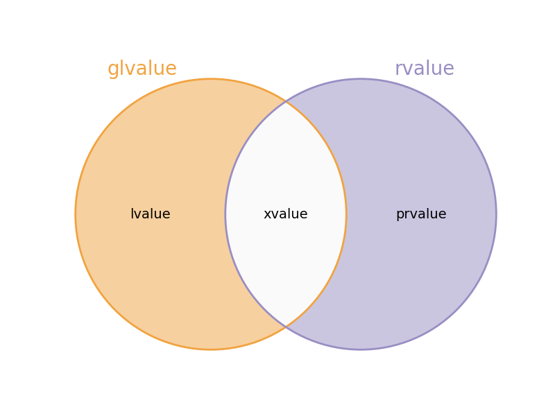

# 이동 의미론 (Move Semantics)

## 이동 생성자

* C++ 생성자 종류
  * 기본 생성자 (default constructor)
  * 매개변수 생성자 (parameterized constructor)
  * 복사 생성자 (copy constructor)
  * **이동 생성자 (move constructor)**

* 클래스 내에 이동 생성자가 구현되어 있지 않다면 다른 생성자처럼 컴파일러가 암묵적으로 생성함
* `std::move` 함수를 사용해 이동 연산을 사용할 수 있음

---

### 복사 생성자의 한계

* 객체를 복사해야 하는 상황에서 호출되는 생성자
  * 새로운 메모리 공간을 할당한 뒤, 기존 객체로부터 복사해오는 형태
  * 객체의 데이터가 클 경우 빈번한 복사 생성자 호출은 성능 저하의 원인이 됨

```cpp
#include <iostream>

class LargeData {
  int* data_;

 public:
  LargeData() : data_(new int[1'000'000]) {
    std::cout << "Default constructor called" << std::endl;
  }
  ~LargeData() {
    if (data_) delete[] data_;
    std::cout << "Destructor called" << std::endl;
  }

  // Copy constructor
  LargeData(const LargeData& other) : data_(new int[1'000'000]) {
    std::copy(other.data_, other.data_ + 1'000'000, data_);
    std::cout << "Copy constructor called" << std::endl;
  }
};

int main() {
  LargeData a;      // Create an object
  LargeData b = a;  // Copy constructor is called
  return 0;
}
```

---

### 이동 생성자의 도입

* **객체의 소유권만을 이전하는 연산**
  * 복사가 불필요한 상황에서 빠르게 객체의 소유권만을 이전

```cpp
#include <iostream>
#include <utility>

class LargeData {
  int* data_;

 public:
  LargeData() : data_(new int[1'000'000]) {
    std::cout << "Default constructor called" << std::endl;
  }
  ~LargeData() {
    if (data_) delete[] data_;
    std::cout << "Destructor called" << std::endl;
  }

  // Copy constructor
  LargeData(const LargeData& other) : data_(new int[1'000'000]) {
    std::copy(other.data_, other.data_ + 1'000'000, data_);
    std::cout << "Copy constructor called" << std::endl;
  }

  // Move constructor
  LargeData(LargeData&& other) noexcept : data_(other.data_) {
    other.data_ = nullptr;  // IMPORTANT: Nullify the source's data pointer
    std::cout << "Move constructor called" << std::endl;
  }
};

int main() {
  LargeData a;                 // Default constructor
  LargeData b = a;             // Copy constructor
  LargeData c = std::move(a);  // Move constructor
  return 0;
}
```

---

### 이동 생성자 형태

```cpp
// Move constructor
LargeData(LargeData&& other) noexcept : data_(other.data_) {
  other.data_ = nullptr;  // Nullify the source's data pointer
  std::cout << "Move constructor called" << std::endl;
}

LargeData c = std::move(a);  // Call move constructor
```

#### 좌측값 참조 (`&`, *lvalue* reference)와 우측값 참조 (`&&`, *rvalue* reference)

* 좌측값 참조는 실체화된 객체의 별명으로 사용

```cpp
int x = 10;
int& ref = x;
```

* 우측값 참조는 **임시 객체**의 별명으로 사용
  * **리터럴도 우측값 참조에 사용될 수 있음**
  * 컴파일 시점에 리터럴이 우측값 참조에 사용될 경우 임시 객체를 생성함
    * 임시 객체는 이를 참조하는 우측값 참조가 소멸될 때 같이 소멸됨
* 주로 **이동 생성자 또는 이동 할당 연산자**에서 주로 사용

```cpp
int&& rref_literal = 20; // While rref_literal is valid, 20 exists in memory.
std::string&& rref_object = std::move(str);
```

---

#### `noexcept`

* 복사 생성자는 예외가 발생하더라도 원본 객체를 유지할 수 있음
* 이동 생성자는 예외가 발생하면 **원본 객체를 유지할 것이라는 보장이 없음**
  * 소유권이 이동하게 됨에 따라 이동된 (moved-from) 객체는 **비정의** 상태가 됨

```cpp
// Copy constructor
LargeData(const LargeData& other) : data_(new int[1'000'000]) {
  std::copy(other.data_, other.data_ + 1'000'000, data_);
  std::cout << "Copy constructor called" << std::endl;
}

// Move constructor
LargeData(LargeData&& other) noexcept : data_(other.data_) {
  other.data_ = nullptr;  // Nullify the source's data pointer
  std::cout << "Move constructor called" << std::endl;
}
```

---

* 표준 라이브러리는 이동 생성자가 `noexcept`인 경우에만 이동 연산 사용
  * 그렇지 않으면 예외 안전성을 보장하기 위해 **복사 생성자를 사용**
* 이동 생성자에 `noexcept`를 명시하지 않으면 성능 저하가 발생할 수 있음

```cpp
#include <chrono>
#include <iostream>

class Test {
 public:
  Test() : data_(new int(42)) {}
  ~Test() { if (data_) delete data_; }
  Test(const Test& other) : data_(new int(*other.data_)) {}
  Test(Test&& other) : data_(other.data_) { other.data_ = nullptr; }

 private:
  int* data_;
};

class TestNoExcept {
 public:
  TestNoExcept() : data_(new int(42)) {}
  ~TestNoExcept() { if (data_) delete data_; }
  TestNoExcept(const TestNoExcept& other) : data_(new int(*other.data_)) {}
  TestNoExcept(TestNoExcept&& other) noexcept : data_(other.data_) {
    other.data_ = nullptr;
  }

 private:
  int* data_;
};
```

---

```cpp
template <typename T>
void RunBenchmark(const char* label) {
  T* objs = new T[10'000'000];
  auto start = std::chrono::high_resolution_clock::now();
  for (int i = 0; i < 10'000'000; ++i) T moved_objs = std::move(objs[i]);
  auto end = std::chrono::high_resolution_clock::now();
  auto diff =
      std::chrono::duration_cast<std::chrono::milliseconds>(end - start);
  std::cout << label << " elapsed: " << diff.count() << " ms\n";
  delete[] objs;
}

int main() {
  RunBenchmark<Test>("Without noexcept"); // Without noexcept elapsed: 122 ms
  RunBenchmark<TestNoExcept>("With noexcept"); // With noexcept elapsed: 119 ms
  return 0;
}
```

---

#### `std::move`

```cpp
template<typename T>
constexpr typename std::remove_reference<T>::type&& move(T&& t) noexcept {
  return static_cast<typename std::remove_reference<T>::type&&>(t);
}
```

* `<utility>` 헤더에 정의되어 있는 함수
* 객체를 우측값으로 형 변환만 수행
  * **실제로 객체를 이동하는 것이 아닌, 이동할 수 있는 대상으로 표시하는 것**
* `std::move` 함수의 반환값은 **이동할 수 있는 상태의 객체**가 됨
* `std::move` 함수의 반환값이 이동 관련 의미를 갖는 문장에 함께 사용되면 **소유권**이 이전됨

```cpp
std::string str = "Hello";

std::move(str);
std::cout << str << std::endl;  // there's no side effects, > Hello

std::string moved_str = std::move(str);  // move semantics, call a move ctor
std::cout << str << std::endl;  // str is moved to moved_str, > <EMPTY>
```

* `moved_str`은 이동 연산을 사용해 `str`의 소유권을 가져옴
* **소유권을 잃은 객체는 더 이상 사용할 수 없음 (undefined behavior)**
  * 소유권을 잃은 객체가 사용자 정의 형일 경우, 재사용 시 결과를 알 수 없음
  * 소유권을 읽은 객체가 기본 자료형은 경우, 재사용 가능

---

## [C++에서의 값 범위 (Value Category)](https://medium.com/@barryrevzin/value-categories-in-c-17-f56ae54bccbe)



* *lvalue* (좌측값)
* *prvalue* (Pure Rvalue, 순수 우측값)
* *xvalue* (eXpiring Value, 만료되는 값)
* *glvalue* (Generalized Lvalue)
* *rvalue* (우측값)

---

### *glvalue*

* *lvalue*
  * 식별자와 메모리 주소를 가지는 값

  ```cpp
  int x = 10;
  int& ref = x; // x is lvalue
  ```

* *xvalue*
  * 식별자와 메모리 주소를 가지지만, **소멸되거나 자원이 이동될 예정인 값**

### *rvalue*

* *prvalue*
  * 순수한 계산 결과로, 메모리 주소나 식별자가 없음 (e.g., 리터럴)
  * 문자열 리터럴은 정적 공간에 메모리를 갖는 특별한 리터럴이자 *prvalue*

  ```cpp
  int GetValue() { return 100; }

  int y = GetValue(); // returned value is prvalue
  ```

* *xvalue*
  * ***xvalue*는 *glvalue***이지만 이동 관련 연산을 지원하기 위해 *rvalue*로도 평가될 수 있음

---

### *xvalue*

* C++11에 도입된 값 범주
* **이동 연산에 의해 소멸될 객체를 표현하는 값**
* *glvalue*의 특징 (객체의 식별자와 메모리 주소를 가짐)과 *rvalue*의 특징 (이동 가능)이 결합됨

#### *xvalue*가 *glvalue*가 되는 경우

* *xvalue*가 주소를 참조하는 형태로 평가되는 경우

```cpp
#include <iostream>
#include <string>
#include <utility>

int main() {
  std::string str = "Hello, World!";
  std::string moved_str = std::move(str);

  // returned value is xvalue, but it's still also glvalue.
  std::move(str).clear();  // clear the moved-from object explicitly
  str = "New Value";
  std::cout << str << std::endl;
  return 0;
}
```

---

#### *xvalue*가 *rvalue*가 되는 경우

* `std::move`의 반환형으로써 임시 객체로 사용될 때
  * 우측값 레퍼런스는 `std::move`로부터 반환된 객체를 사용할 수 있음
* 리터럴에서 우측값 레퍼런스, 함수 반환, `const` 좌측값 레퍼런스 등 문맥에 의해 파생된 임시 객체

```cpp
#include <iostream>
#include <utility>

class MyClass {
 public:
  MyClass() = default;
  MyClass(const MyClass&) { std::cout << "Copy Constructor\n"; }
  MyClass(MyClass&&) noexcept { std::cout << "Move Constructor\n"; }
};

void Process(MyClass obj) {}

int main() {
  MyClass a;
  std::cout << "Process(a): ";
  Process(a);  // passing 'a' as a lvalue
  std::cout << "Process(std::move(a)): ";
  // the parameter of the move ctor is MyClass&&, so xvalue treated as an rvalue
  Process(std::move(a));  // passing 'a' as a xvalue

  MyClass b;
  std::cout << "\nMyClass c = b: ";
  MyClass c = b;  // assigning 'a' as a lvalue
  // The class has a move ctor, so returned value treated as an rvalue
  std::cout << "MyClass d = std::move(b): ";
  MyClass d = std::move(b);  // assigning 'a' as a xvalue
  return 0;
}
```

---

### *xvalue* 사용 시 유의사항

* *xvalue*를 잘못 사용한 형태

```cpp
#include <iostream>

class A {
 public:
  A() { std::cout << "ctor\n"; }
  A(const A& a) { std::cout << "copy ctor\n"; }
  A(A&& a) { std::cout << "move ctor\n"; }
};

class B {
  A a_;

 public:
  B(A&& a) : a_(a) {}  // move ctor expected, but copy ctor
};

int main() {
  A a;
  B b(std::move(a));
  return 0;
}
```

* *xvalue*는 *glvalue*
* `a_(a)` 표현식 평가 시 *glvalue*를 처리할 수 있는 복사 생성자가 연관됨

---

* 올바르게 *xvalue*를 사용한 형태

```cpp
#include <iostream>

class A {
 public:
  A() { std::cout << "ctor\n"; }
  A(const A& a) { std::cout << "copy ctor\n"; }
  A(A&& a) { std::cout << "move ctor\n"; }
};

class B {
  A a_;

 public:
  B(A&& a) : a_(std::move(a)) {}  // move ctor
};

int main() {
  A a;
  B b(std::move(a));
  return 0;
}
```

---

## 스마트 포인터에서의 이동

* `std::unique_ptr`은 복사와 대입이 제거된 형
* 다른 지역으로 소유권을 이동해야 할 경우 `std::move` 함수를 사용할 수 있음
* 이동 후의 스마트 포인터는 `nullptr`을 갖게 됨

```cpp
#include <memory>

void ProcessResource(std::unique_ptr<Resource> res) { // Use res }

int main() {
  std::unique_ptr<Resource> my_resource = std::make_unique<Resource>();
  // Transfer ownership using move semantics
  ProcessResource(std::move(my_resource));
  // my_resource is now nullptr
  return 0;
}
```

---

## 이동 할당 연산자

* my_class.hpp

```cpp
#pragma once

#include <iostream>
#include <utility>  // for std::move

class MyClass {
  int* data_;

 public:
  MyClass() : data_(new int[1'000'000]) {
    std::cout << "Default constructor called (new memory allocated)"
              << std::endl;
  }

  ~MyClass() {
    if (data_) delete[] data_;
    std::cout << "Destructor called" << std::endl;
  }

  // Move constructor
  MyClass(MyClass&& other) noexcept;

  // Copy constructor
  MyClass(const MyClass& other);

  // Copy assignment operator
  MyClass& operator=(const MyClass& other);

  // Move assignment operator
  MyClass& operator=(MyClass&& other) noexcept;
};
```

---

* my_class.cc

```cpp
#include "my_class.hpp"

#include <algorithm>  // for std::copy
#include <iostream>

MyClass::MyClass(MyClass&& other) noexcept : data_(other.data_) {
  other.data_ = nullptr;
  std::cout << "Move constructor called" << std::endl;
}

MyClass::MyClass(const MyClass& other) : data_(new int[1'000'000]) {
  std::copy(other.data_, other.data_ + 1'000'000, data_);
  std::cout << "Copy constructor called (new memory allocated)" << std::endl;
}

MyClass& MyClass::operator=(const MyClass& other) {
  if (this != &other) {  // Self-assignment check
    int* new_data = new int[1'000'000];
    std::copy(other.data_, other.data_ + 1'000'000, new_data);
    delete[] data_;  // Release old memory
    data_ = new_data;
    std::cout << "Copy assignment operator called (deep copy)" << std::endl;
  }
  return *this;
}

MyClass& MyClass::operator=(MyClass&& other) noexcept {
  if (this != &other) {   // Self-assignment check
    delete[] data_;       // Release old memory
    data_ = other.data_;  // Transfer ownership
    other.data_ = nullptr;
    std::cout << "Move assignment operator called (just gave ownership)"
              << std::endl;
  }
  return *this;
}
```

---

* main.cc

```cpp
#include "my_class.hpp"

void SwapUsingCopy(MyClass& first, MyClass& second) {
  MyClass temp(first);
  first = second;
  second = temp;
}

void SwapUsingMove(MyClass& first, MyClass& second) {
  MyClass temp(std::move(first));
  first = std::move(second);
  second = std::move(temp);
}

int main() {
  MyClass obj1, obj2;
  SwapUsingCopy(obj1, obj2);
  SwapUsingMove(obj1, obj2);
  return 0;
}
```

---

## 전달 참조와 완벽한 전달

* 다음 주어진 코드는 사용자가 경우에 따라 명시적으로 전달할 값을 관리해야 하는 형태
  * 이동 생성자를 호출하려면 `std::move`를 명시적으로 사용해야 함

```cpp
#include <iostream>
#include <utility>

class MyString {
 public:
  MyString(const char* str) { std::cout << "Constructed from const char*\n"; }
  MyString(const MyString& other) { std::cout << "Copy Constructed\n"; }
  MyString(MyString&& other) { std::cout << "Move Constructed\n"; }
};

int main() {
  const char* cstr = "Hello";
  MyString s1 = cstr;
  MyString s2 = s1;
  MyString s3 = std::move(MyString(s1));
  return 0;
}
```

* 전달 참조와 완벽한 전달을 사용하면 함수 사용 형태를 더욱 직관적으로 개선할 수 있음

---

## 전달 참조 (Forwarding Reference, Universal Reference)

* 함수 템플릿에서 컴파일 시점에 수행되는 형 추론에 의해 결정되는 `T&&` 형태의 매개 변수
* **좌측값과 우측값**을 모두 수용할 수 있음

```cpp
template <typename T>
void func(T&& arg); // T&& is forwarding reference
```

* `T`는 함수 호출 시 사용된 전달 인자의 형에 따라 결정됨
* 전달 인자가 좌측값이면 `T`는 `T&`가 되어 결국 `T&`가 됨
* 전달 인자가 우측값이면 `T`는 그대로 `T`가 되어 결국 `T&&`가 됨

---

## [완벽한 전달 (Perfect Forwarding)](https://www.open-std.org/jtc1/sc22/wg21/docs/papers/2009/n2951.html)

* 함수 템플릿의 매개 변수의 특성 (좌측값 또는 우측값)을 그대로 다른 함수로 전달할 때 사용
* `std::forward` 함수 사용

```cpp
template <class T>
constexpr T&& forward(std::remove_reference_t<T>& t) noexcept;  // (1)

template <class T>
constexpr T&& forward(std::remove_reference_t<T>&& t) noexcept;  // (2)
```

### 참조 붕괴 (Reference Collapsing)

* `&`는 `true`, `&&`는 `false`로 치환한 뒤 `|` (or) 연산을 수행
  * `T& &`는 `T&`로 붕괴
  * `T& &&`는 `T&`로 붕괴
  * `T&& &`는 `T&`로 붕괴
  * `T&& &&`는 `T&&`로 붕괴

---

* 앞서 소개했던 코드에 전달 참조와 완벽한 전달을 적용한 예

```cpp
#include <iostream>

class MyString {
 public:
  MyString(const char* str) { std::cout << "Constructed from const char*\n"; }
  MyString(const MyString& other) { std::cout << "Copy Constructed\n"; }
  MyString(MyString&& other) { std::cout << "Move Constructed\n"; }
};

template <typename T>
MyString createMyString(T&& arg) {
  return MyString(std::forward<T>(arg));
}

int main() {
  const char* cstr = "Hello";
  MyString s1 = createMyString(cstr);
  MyString s2 = createMyString(s1);
  MyString s3 = createMyString(MyString(s1));
  return 0;
}
```

---

* `std::forward` 사용 예

```cpp
#include <iostream>
#include <utility>

void identify(int& x) { std::cout << "int&\n"; }
void identify(const int& x) { std::cout << "const int&\n"; }
void identify(int&& x) { std::cout << "int&&\n"; }

template <typename T>
void func(T&& arg) {
  std::cout << "without std::forward" << std::endl;
  identify(arg);
  std::cout << "with std::forward" << std::endl;
  identify(std::forward<T>(arg));
}

int main() {
  int a = 10;
  const int b = 20;

  std::cout << "Passing lvalue a:\n";
  func(a);

  std::cout << "\nPassing const lvalue b:\n";
  func(b);

  std::cout << "\nPassing rvalue 30:\n";
  func(30);

  return 0;
}
```
