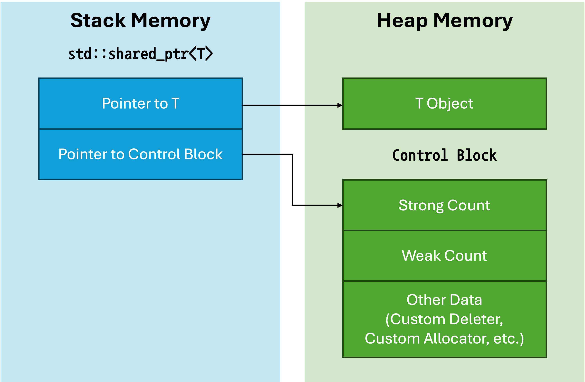

<!-- _class: lead -->
# 객체지향프로그래밍

## 스마트 포인터 (Smart Pointers)

### [munseong.jeong@daejin.ac.kr](mailto:munseong.jeong@daejin.ac.kr)

---

## 포인터 래퍼 클래스

[//]: # (INCLUDE: ./cpp/12/src/00_pointer_class.cc --from 2 --to 20 --no-comment)

- 동적 메모리 관리를 자동화하기 위한 포인터 래퍼(wrapper) 클래스
- 메모리 누수와 수동 메모리 관리 문제 해결
- 표준 라이브러리의 스마트 포인터는 **제네릭 프로그래밍을 활용하여 메모리 안전성 향상**

---

## 표준 라이브러리 스마트 포인터

| Feature | `std::unique_ptr` | `std::shared_ptr` | `std::weak_ptr` |
| ------- | ----------------- | ----------------- | --------------- |
| **Ownership** | Exclusive | Shared | None |
| **Copy** | Not allowed | Allowed | Allowed |
| **Move** | Allowed | Allowed | Allowed |
| **Reference Count** | None | Auto-tracked | Not tracked |
| **Overhead** | Minimal | Moderate | Moderate |
| **Use Case** | Exclusive ownership | Shared ownership | Break circular references |
| **Memory Deallocation** | Automatic on destruction | When reference count = 0 | N/A (no ownership) |

---

## RAII (Resource Acquisition Is Initialization)

- 자원의 획득과 해제를 **객체의 수명**에 묶어 관리
  - 객체 생성 시 자원 획득, 객체 소멸 시 자원 자동 해제
- 스마트 포인터는 RAII 원칙을 적용하여 메모리를 관리함
  - 예외 발생 시에도 **자원이 자동으로 해제**되어 안전성 및 유지보수성 향상
    - 스택 기반 LIFO 소멸로 자동 호출되는 소멸자 메커니즘을 활용
  - **명시적인 메모리 해제 코드 불필요**

[//]: # (INCLUDE: ./cpp/12/src/01_raii.cc)

---

## RAII (Resource Acquisition Is Initialization) (Cont'd - 1)

### RAII와 메모리 누수 방지

- `data_buffer.hpp`

[//]: # (INCLUDE: ./cpp/12/src/data_buffer.hpp)

---

## RAII (Resource Acquisition Is Initialization) (Cont'd - 2)

- 메모리 누수가 발생하는 예제

[//]: # (INCLUDE: ./cpp/12/src/02_raii1.cc)

---

## RAII (Resource Acquisition Is Initialization) (Cont'd - 3)

- RAII 원칙을 적용한 예외 안전한 예제

[//]: # (INCLUDE: ./cpp/12/src/03_raii2.cc)

---

## RAII (Resource Acquisition Is Initialization) (Cont'd - 4)

- `file_handle.hpp`

[//]: # (INCLUDE: ./cpp/12/src/file_handle.hpp)

---

## RAII (Resource Acquisition Is Initialization) (Cont'd - 5)

- RAII 원칙을 적용한 파일 관리 예제

[//]: # (INCLUDE: ./cpp/12/src/04_raii3.cc)

---

## `std::unique_ptr`

- `<memory>` 헤더 파일 필요
- 피관리 객체(managed object)에 대한 **배타적 소유권(exclusive ownership)을 행사**하는 스마트 포인터
- 복사와 대입 불가
  - 복사 생성자와 복사 대입 연산자가 `delete`키워드로 명시적으로 삭제됨
  - 소유권 이동은 이동 생성자와 이동 대입 연산자로 가능
- 자동 메모리 해제 제공
  - 스마트 포인터 객체가 유효 범위를 벗어나면 자동으로 소멸자 호출(**RAII 원칙**)
  - 스마트 포인터 소멸자는 동적 할당된 피관리 객체를 동적 해제(`delete`)

[//]: # (INCLUDE: ./cpp/12/src/03_raii2.cc --from 8 --to 15 --no-comment)

---

## `std::unique_ptr` (Cont'd - 1)

### `get` 메서드

- 스마트 포인터 객체의 **피관리 객체 주소를** 반환하는 메서드로, 반환된 원시 포인터는 스마트 포인터의 소유권과 무관하게 동작
- 기존의 C API나 라이브러리와의 호환성을 위해 필요

[//]: # (INCLUDE: ./cpp/12/src/05_unique_ptr_get.cc --from 2 --to 18 --no-comment)

---

## `std::unique_ptr` (Cont'd - 2)

### `get` 메서드 사용 시 유의사항

- **`get` 메서드로 받은 포인터를 통해 메모리를 관리하지 말 것**
- 스마트 포인터는 **RAII 원칙**에 따라 메모리 관리를 자동으로 수행
- 직접 스마트 포인터 피관리 객체의 주소를 통해 메모리를 관리하는 것은 부적절함

[//]: # (INCLUDE: ./cpp/12/src/05_unique_ptr_get.cc --from 22 --to 29 --no-comment)

---

## `std::unique_ptr` (Cont'd - 3)

### `std::make_unique` 함수

- `<memory>` 헤더 파일 필요
- 피관리 객체 생성과 `std::unique_ptr` 래핑을 한 번에 처리하는 함수
  - 예외 안전성을 보장함

[//]: # (INCLUDE: ./cpp/12/src/06_make_unique.cc --from 16 --to 25 --no-comment)

---

## `std::shared_ptr`

- `<memory>` 헤더 파일 필요
- 피관리 객체에 대한 **공유 소유권(shared ownership)을 행사**하는 스마트 포인터
- 참조 개수 계산(reference counting)을 통해 피관리 객체의 생명 주기 관리
  - `std::unique_ptr`과의 차이점:
    - `std::unique_ptr`: 단일 소유권으로 **스마트 포인터 소멸 시 피관리 객체도 반드시 해제**
    - `std::shared_ptr`: **참조 개수가 0이 될 때만 피관리 객체 메모리 해제**
- 복사, 대입, 및 이동 가능

[//]: # (INCLUDE: ./cpp/12/src/07_shared_ptr.cc)

---

## `std::shared_ptr` (Cont'd - 1)

### 제어 블록 (Control Block)

- `std::unique_ptr`은 피관리 객체를 가리키는 포인터만 멤버로 가짐(크기: 1개 포인터)
- `std::shared_ptr`은 두 개의 포인터를 멤버로 가지므로 **오버헤드가 더 큼**
  - 첫 번째 포인터: 피관리 객체를 가리킴
  - 두 번째 포인터: 제어 블록(참조 개수, 커스텀 삭제자 등)을 가리킴

---

## `std::shared_ptr` (Cont'd - 2)

### `use_count` 메서드

- 현재 피관리 객체를 참조하고 있는 `std::shared_ptr`의 총 개수 반환

[//]: # (INCLUDE: ./cpp/12/src/08_shared_ptr_reference_counting.cc)

---

## `std::shared_ptr` (Cont'd - 3)

### `std::make_shared` 함수

- `<memory>` 헤더 파일 필요
- 피관리 객체 생성과 `std::shared_ptr` 래핑을 한 번에 처리하는 함수
  - `new` + `std::shared_ptr` 생성자 호출보다 간결함(동적 할당을 **한 번만 수행**)
  - 예외 안전성을 보장함

[//]: # (INCLUDE: ./cpp/12/src/09_shared_ptr_make_shared.cc --from 23 --to 32 --no-comment)

---

## `std::shared_ptr` (Cont'd - 4)

### `std::shared_ptr` 사용 시 주의사항

- 원시 포인터를 사용해 `std::shared_ptr`을 생성할 경우 **이중 해제(double free)를 유발함**
  - 서로 다른 제어 블록(control block)을 생성하면서 참조 개수(strong count)가 분산됨

[//]: # (INCLUDE: ./cpp/12/src/09_shared_ptr_make_shared.cc --from 2 --to 18 --no-comment)

---

## `std::shared_ptr` (Cont'd - 5)

### `std::enable_shared_from_this`

- `std::shared_ptr`로 관리되는 객체가 메서드 내에서 자기 자신(`this`)에 대한 소유권을 공유해야 하는 상황
  - e.g., 비동기 프로그래밍, 상호 참조, etc.
- `this` 포인터로 `std::shared_ptr`를 생성하면 기존 제어 블록과 독립된 **새로운 제어 블록**이 할당됨
  - 참조 개수가 분리되어 객체 소멸 시 **이중 해제(double free) 발생 가능**
- 이 상황에서는 `std::enable_shared_from_this`를 상속하여 `shared_from_this` 함수를 호출해야 함
  - 기존 제어 블록을 공유하는 `std::shared_ptr` 인스턴스를 반환

[//]: # (INCLUDE: ./cpp/12/src/10_enable_shared_from_this.cc --from 2 --to 13 --no-comment)

---

## `std::shared_ptr` (Cont'd - 6)

- 클래스 내부에서 자신의 `std::shared_ptr` 생성을 `this` 포인터로 수행할 경우 문제가 발생하는 예제

[//]: # (INCLUDE: ./cpp/12/src/11_best_friend1.cc --to 21)

---

## `std::shared_ptr` (Cont'd - 7)

[//]: # (INCLUDE: ./cpp/12/src/11_best_friend1.cc --from 22)

---

## `std::shared_ptr` (Cont'd - 8)

- 클래스 내부에서 자신의 `std::shared_ptr` 생성을 `shared_from_this` 함수로 수행할 경우

[//]: # (INCLUDE: ./cpp/12/src/12_best_friend2.cc --to 20)

---

## `std::shared_ptr` (Cont'd - 9)

[//]: # (INCLUDE: ./cpp/12/src/12_best_friend2.cc --from 21)

> 만약 이 예제 코드를 아래와 같이 수정하면 어떻게 될까?

[//]: # (INCLUDE: ./cpp/12/src/13_best_friend3.cc --from 28 --to 29 --no-comment)

- **순환 참조(circular reference)로 인한 메모리 누수 발생**

---

## `std::weak_ptr`

- `std::weak_ptr`은 `std::shared_ptr`을 관찰(객체의 소멸 여부 확인)하기 위한 스마트 포인터
  - **소유권을 갖지 않으며**, 피관리 객체의 메모리 해제 책임을 갖지 않음
  - 관찰 목적의 스마트 포인터이므로, **참조 개수(strong count)를 증가시키지 않음**
- `std::weak_ptr`은 객체로의 직접 참조가 불가능하므로 `lock` 메서드를 사용해야 함
  - `lock` 메서드는 관찰 대상이 유효하다면 `std::shared_ptr` 값을, 이미 소멸되었다면 `nullptr`을 반환

[//]: # (INCLUDE: ./cpp/12/src/14_weak_ptr1.cc)

---

## `std::weak_ptr` (Cont'd - 1)

- `std::weak_ptr`을 사용해 `std::shared_ptr` 객체 유효성을 안전하게 확인하는 예제

[//]: # (INCLUDE: ./cpp/12/src/15_weak_ptr2.cc)

---

## `std::weak_ptr` (Cont'd - 2)

- `std::shared_ptr`에서 발생한 순환 참조를 `std::weak_ptr`을 사용하여 해결

[//]: # (INCLUDE: ./cpp/12/src/16_best_friend4.cc --to 20)

---

## `std::weak_ptr` (Cont'd - 3)

[//]: # (INCLUDE: ./cpp/12/src/16_best_friend4.cc --from 21)

---

## 제어 블록의 생명주기

### 생성 시점 (Instantiation)

- 제어 블록 생성: 최초의 `std::shared_ptr` 객체가 생성될 때 힙 영역에 단 한 번 할당됨
  - `std::make_shared<T>` 사용: `T`타입 객체와 제어 블록을 단일 메모리 블록에 연속으로 할당(성능 최적화)
    - **동적 할당을 한 번만 수행함**(메모리 할당 효율성 증가)
  - `new T` (생성자 주입) 사용: `T`타입 객체와 별도로 제어 블록을 독립적으로 할당
    - **동적 할당을 총 두 번 수행함**(메모리 할당 오버헤드 증가)
    - **주의**: 동일한 raw pointer로 여러 개의 `std::shared_ptr`를 각각 생성하면, 독립된 제어 블록이 중복 생성됨
      - **이중 해제 오류 초래**(미정의 동작 발생)

### 카운터의 역할 (Role of Counters)

#### Strong Count

- 해당 객체를 소유하고 있는 `std::shared_ptr`의 총 개수로, 피관리 객체의 수명 결정

#### Weak Count

- 해당 제어 블록을 관찰하고 있는 `std::weak_ptr`의 총 개수로, 제어 블록 자체의 수명 결정

---

## 제어 블록의 생명주기 (Cont'd)

### 제어 블록 소멸 메커니즘 (Destruction Mechanism)

- 객체 소멸: **strong count가 0**이 되면 피관리 객체의 메모리를 해제함
  - **제어 블록은 유지됨**
  - 만약 제어 블록이 피관리 객체와 함께 소멸된다면, **`std::weak_ptr`의 `lock` 메서드 호출 시 문제가 발생함:**
    - `std::weak_ptr::lock` 메서드는 **제어 블록**을 참조해 객체의 strong count가 0인지 아닌지를 확인
    - 만약 객체 소멸 시점에 제어 블록이 동시에 소멸된다면, `lock` 메서드는 **이미 해제된 제어 블록을 간접 참조함**
      - Segmentation fault 발생 가능
  - 따라서 제어 블록은 weak count가 0이 될 때까지 유지되어야 함
- 제어 블록 소멸: **strong count가 0**이고 **weak count도 0**일 때 제어 블록의 메모리가 해제됨

---

## 제어 블록의 기타 데이터 (Other Data)

- 참조 카운트 외에 객체 생명주기 관리를 위한 메타데이터 저장소
  - [Custom deleter](https://en.cppreference.com/w/cpp/memory/shared_ptr/shared_ptr): **피관리 객체 소멸 시 수행할 해제 방법**(기본값: `delete`)
    - 사용자가 정의한 삭제 함수 또는 객체를 저장(e.g., C API의 동적 해제)
  - [Custom allocator](https://en.cppreference.com/w/cpp/memory/shared_ptr/allocate_shared): **제어 블록(또는 피관리 객체)의 메모리 할당 및 해제 방법**(기본값: `std::allocator`)
    - `std::make_shared<T>`는 제어 블록과 피관리 객체를 할당기 방식으로 할당 또는 해제
    - 사용자가 정의한 메모리 할당기를 저장(e.g., 성능 향상을 위한 메모리 풀)
- `std::shared_ptr`와 `std::weak_ptr`가 제어 블록을 공유하므로, 저장된 메타데이터를 공통으로 활용
- **타입 소거(type erasure)의 물리적 기반**으로 활용:
  - `std::shared_ptr<T>` 객체 자체는 삭제자 또는 할당기의 구체적인 타입 정보를 알지 못함
  - 객체 소멸 시, 제어 블록에 저장된 함수 포인터 또는 함수 객체를 호출하여 실제 삭제 작업 위임
  - 런타임에 올바른 삭제자가 동적으로 선택됨(동적 바인딩)

### 타입 소거 (Type Erasure)

- 서로 다른 구체적 타입(삭제자, 할당기 등)을 가진 객체들을 공통된 단일 인터페이스로 추상화하는 기법
  - 제어 블록 내부의 가상 함수와 상속을 통해 런타임에 올바른 삭제자를 호출
  - 다형성(polymorphism)을 활용한 동적 디스패치
  - `std::shared_ptr<T>`는 삭제자 또는 할당기 타입이 서로 달라도 **동일한 타입**으로 취급됨

---

## 제어 블록의 기타 데이터 (Other Data) (Cont'd - 1)

[//]: # (INCLUDE: ./cpp/12/src/17_type_erasure.cc --to 14)

---

## 제어 블록의 기타 데이터 (Other Data) (Cont'd - 2)

[//]: # (INCLUDE: ./cpp/12/src/17_type_erasure.cc --from 16)

---

## 스마트 포인터에서의 이동

- `std::unique_ptr`은 복사와 대입 연산이 명시적으로 삭제된 타입
- 다른 지역으로 소유권을 이동해야 할 경우 `std::move` 함수를 사용할 수 있음
- 이동 후의 스마트 포인터는 `nullptr`을 갖게 됨

[//]: # (INCLUDE: ./cpp/12/src/18_move.cc --from 2 --to 18 --no-comment)

---

## 스마트 포인터에서의 이동 (Cont'd - 1)

- 스마트 포인터 이동 기반의 빌더 패턴

[//]: # (INCLUDE: ./cpp/12/src/19_builder.cc --to 20)

---

## 스마트 포인터에서의 이동 (Cont'd - 2)

[//]: # (INCLUDE: ./cpp/12/src/19_builder.cc --from 22 --to 30)

---

## 스마트 포인터에서의 이동 (Cont'd - 3)

[//]: # (INCLUDE: ./cpp/12/src/19_builder.cc --from 32 --to 42)

---

## 스마트 포인터에서의 이동 (Cont'd - 4)

[//]: # (INCLUDE: ./cpp/12/src/19_builder.cc --from 44 --to 56)

---

## 스마트 포인터에서의 이동 (Cont'd - 5)

[//]: # (INCLUDE: ./cpp/12/src/19_builder.cc --from 58)
