# 재귀와 자료구조

## 재귀 (Recursion)

* 함수가 자기 자신을 호출하여 문제를 해결하는 방법

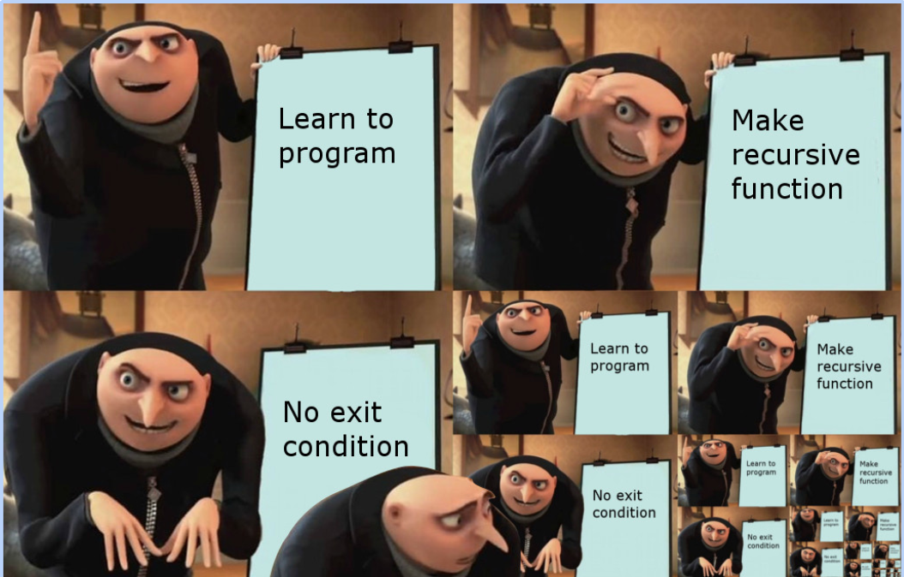

---

### 재귀 vs. 반복문

#### 공통점

* 반복문과 재귀 모두 반복적인 작업 수행 시 활용
* 특정 조건이 만족될 때까지 반복 실행

#### 차이점

* 재귀는 반복문보다 코드 형태가 **간결**하고 **직관적**임
  * 특히 수학적 문제를 표현할 때 재귀를 사용하면 간결하게 표현할 수 있음
* 재귀는 **매 호출마다 고유한 상태 (지역 변수)를 가질 수 있음**
  * 함수 호출마다 독립적인 함수 스택 프레임이 스택 메모리에 저장됨
    * 각 스택 프레임은 함수의 지역 변수, 함수 종료 시 복귀 주소, 호출된 함수의 매개변수 보관
  * **재귀 호출이 깊어질수록 메모리 사용량은 일반적으로 증가함**

---

### 재귀의 기본 조건 (Base Case), 일반 조건 (General Case)

* 기본 조건
  * **재귀 호출을 중단하고 결과를 반환하는 조건**
  * 일반적으로 문제의 가장 작은 단위를 해결하는 조건

* 일반 조건
  * 문제를 **더 작은 문제로 분할**하고 자기 자신을 호출
  * 재귀 호출이 깊어질수록 문제의 규모는 점점 축소되어 결국 **기본 조건**을 만족하게 됨

#### 재귀로 구현한 피보나치 수열 (Fibonacci number) 문제

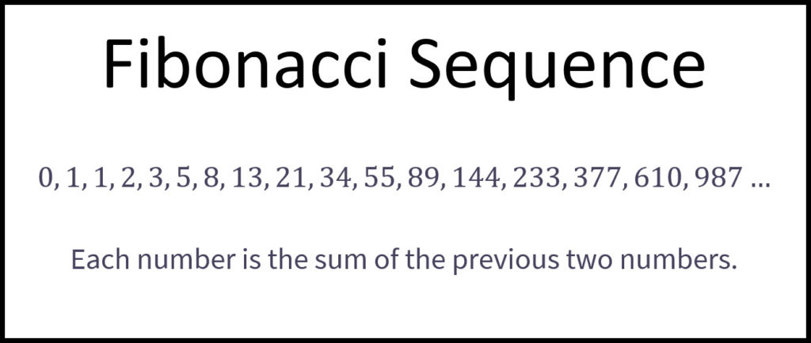

* 기본 조건
  * `fib(0) = 0, fib(1) = 1`
* 일반 조건
  * `fib(n) = fib(n - 1) + fib(n - 2)`

---

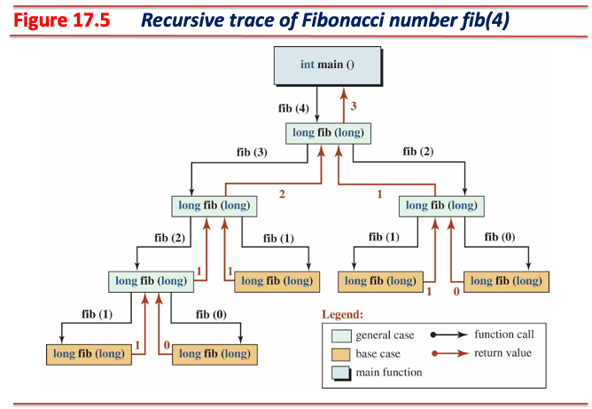

---

* 재귀 형태로 피보나치 수열의 수학적 정의 (`f(n) = f(n - 1) + f(n - 2)`)를 코드로 표현
  * 직관적이면서 간결한 코드 작성

```cpp
#include <chrono>
#include <iostream>

int64_t fib(int n) {
  if (n == 0 || n == 1) return n;  // base case
  return fib(n - 1) + fib(n - 2);  // general case
}

int main() {
  auto start = std::chrono::high_resolution_clock::now();
  for (int i = 1; i <= 40; ++i)  // on my env., it takes about 1,500 ms
    std::cout << "fib(" << i << "): " << fib(i) << std::endl;
  auto end = std::chrono::high_resolution_clock::now();
  auto duration =
      std::chrono::duration_cast<std::chrono::milliseconds>(end - start);
  std::cout << "Execution time: " << duration.count() << " ms" << std::endl;
  return 0;
}
```

---

### 재귀 응용: 꼬리 재귀 (Tail Recursion)

* 일반 재귀는 함수가 호출될 때마다 스택 영역에 함수 스택 프레임이 추가 할당됨
  * e.g., 일반 재귀로 작성한 팩토리얼 계산 함수를 호출 시 총 *n*개의 스택 프레임이 할당됨

  ```cpp
  int Factorial(int n) { return n == 1 ? 1 : n * Factorial(n - 1); }
  // If user calls the function Factorial(5):
  // #5 | Factorial(5) |
  // #4 | Factorial(4) |
  // #3 | Factorial(3) |
  // #2 | Factorial(2) |
  // #1 | Factorial(1) |
  // ---+--------------+
  //    |   <STACK>    |
  ```

* 일반 재귀는 함수가 호출될 때마다 스택에 새로운 스택 프레임이 추가되는 형태
  * 이전 함수 호출은 현재 함수 호출에 의존하는 상태:
    * 재귀 호출이 함수의 마지막 작업이 아닌 형태
      * `return n * Factorial(n - 1)`
      * `Factorial(n)`은 `Factorial(n - 1)`의 반환값을 사용해 **추가 작업** 후 반환
      * 이전 함수의 스택 프레임을 반드시 유지해야 하는 형태
  * 재귀 깊이가 커질수록 스택 메모리 점유율도 높아짐에 따라 **스택 오버플로우**가 발생할 수 있음

---

* 꼬리 재귀는 함수가 호출될 때마다 스택 영역의 이전 함수 스택 프레임을 **재사용**
  * e.g., 꼬리 재귀로 작성한 팩토리얼 계산 함수 호출 시 하나의 스택 프레임만 할당됨

  ```cpp
  int FactorialTail(int n, int acc = 1) {
    return n == 1 ? acc : FactorialTail(n - 1, acc * n);
  }
  // If user calls the function FactorialTail(5):
  // #1 | FactorialTail(5, 1)   |
  // ---+-----------------------+
  //    |      <STACK>          | 
  //              ↓
  // #1 | FactorialTail(4, 5)   |
  // ---+-----------------------+
  //    |      <STACK>          | 
  //              ↓
  //             ...
  //              ↓
  // #1 | FactorialTail(1, 120) |
  // ---+-----------------------+
  //    |      <STACK>          | 
  ```

* 꼬리 재귀는 컴파일 시점에 하나의 스택 프레임을 재활용하도록 수정하는 형태
  * **재귀 호출이 함수의 마지막 작업인 형태**
    * `return acc`
    * **이전 함수의 스택 프레임을 유지할 필요가 없음**
    * 꼬리 재귀 최적화 (Tail Call Optimization, TCO) 필수 구현 조건
  * 재귀 깊이에 관계 없이 고정 크기 메모리를 사용하므로 **스택 오버플로우** 위험이 거의 없음

---

#### 일반 재귀와 꼬리 재귀의 동작 비교

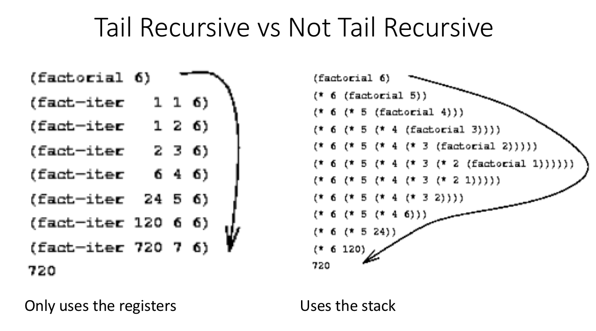

---

```cpp
#include <chrono>
#include <iostream>

// n < 2 : a = 0, b = 1
// n >= 2: a = fib(n - 2), b = fib(n - 1)
int64_t fib_tail(int n, int64_t a = 0, int64_t b = 1) {
  if (n == 0) return a;              // Base case: n == 0
  if (n == 1) return b;              // Base case: n == 1
  return fib_tail(n - 1, b, a + b);  // General case: n >= 2
}

int main() {
  auto start = std::chrono::high_resolution_clock::now();
  for (int i = 1; i <= 40; ++i)  // on my env., it takes about less than 1 ms
    std::cout << "fib_tail(" << i << "): " << fib_tail(i) << std::endl;
  auto end = std::chrono::high_resolution_clock::now();
  auto duration =
      std::chrono::duration_cast<std::chrono::milliseconds>(end - start);
  std::cout << "Execution time: " << duration.count() << " ms" << std::endl;

  return 0;
}
```

---

### 재귀 응용: 메모이제이션 (Memoization)

* 꼬리 재귀 사용이 어려운 상황에서 대안으로 사용 가능한 최적화 방법
* 재귀 사용 시 중복 계산이 발생할 수 있음
   e.g., `fib(5) = fib(4) + fib(3)`에서 `fib(3)`은 두 번 계산 필요
* 메모이제이션은 **추가 메모리를 사용**하여 중복 계산을 억제해 **최적화**된 동작 수행 가능

```cpp
#include <chrono>
#include <cstring>  // std::memset
#include <iostream>

int64_t fib_memoization(int* arr, int n) {
  if (n == 0 || n == 1) return n;
  // 'arr[n] == -1' means this value has not yet been calculated.
  if (arr[n] == -1)  // calculate the fib(n) and update it to the arr
    arr[n] = fib_memoization(arr, n - 1) + fib_memoization(arr, n - 2);
  return arr[n];
}

int main() {
  auto start = std::chrono::high_resolution_clock::now();
  int arr[40 + 1];  // 1-based array
  std::memset(arr, 0xFF, sizeof(arr));
  for (int i = 1; i <= 40; ++i) {  // on my env., it takes about less than 1 ms
    std::cout << "fib_memoization(" << i << "): " << fib_memoization(arr, i)
              << std::endl;
  }
  auto end = std::chrono::high_resolution_clock::now();
  auto duration =
      std::chrono::duration_cast<std::chrono::milliseconds>(end - start);
  std::cout << "Execution time: " << duration.count() << " ms" << std::endl;
  return 0;
}
```

---

## 자료구조 (Introduction to Data Structures)

* 데이터를 표현하는 방식 및 데이터 표현 구조를 유지하면서 수행할 수 있는 연산을 정의한 개념

### 데이터의 표현 (Representation)

* 데이터가 메모리 상에 배치되는 방식
* e.g., 배열은 연속적인 메모리 블록 사용, 링크드 리스트는 포인터를 통해 노드 간 연결

### 제한된 연산 (Operations)

* 데이터의 구조를 유지하면서 삽입, 삭제, 탐색 등과 같은 동작 수행
* e.g., 스택은 FIFO (last in, first out)를 유지할 수 있는 연산 `push`, `pop` 허용

### 객체 (Objects)

* 자료구조에서의 객체는 데이터를 구성하는 각각의 요소 (elements)를 의미
  * 자료구조 내 기본 데이터 단위
  * e.g., 배열의 각 원소, 링크드 리스트의 노드, 트리의 각 노드, etc.
* 객체는 다른 객체와 관계를 가질 수 있음
  * 객체 간 관계는 집합 (collections)으로 표현됨
  * e.g., 링크드 리스트의 노드는 다음 노드를 가리키는 포인터를 포함하여 **선형 관계**를 나타냄

---

### 객체 간 관계 - 집합 (Collections)

* 집합은 여러 개의 객체가 어떻게 연결되는가를 표현하는 개념

#### 선형 집합 (Linear Collection)

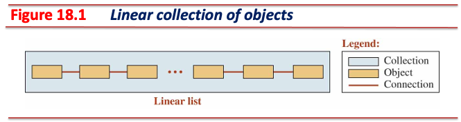

* 데이터가 메모리 상에서 선형적으로 연결된 구조 (e.g., 단일 링크드 리스트, 스택, 큐)

#### 비선형 집합 (Non-linear Collection)

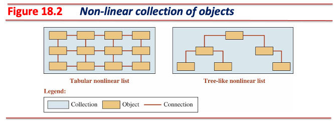

* 데이터가 메모리 상에서 계층적 또는 복잡한 관계로 표현된 구조 (e.g., 이진 탐색 트리)

---

### 단일 링크드 리스트 (Singly Linked List)

* 선형 집합으로 표현한 자료구조
* 단일 링크드 리스트의 각 객체는 노드 (nodes)로 표현
* 각 노드는 선형 순서 상 다음 노드만 가리킬 수 있음
  * **단일** 링크드 리스트라고 표현하는 이유
  * 전방 탐색만 가능한 형태이며, 후방 탐색은 불가능

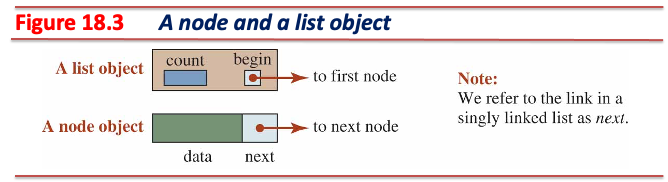

* 단일 링크드 리스트를 표현하기 위해 두 형 (types) 사용
  * 단일 링크드 리스트 내 각 노드를 표현하는 `Node` 구조체 형
  * 단일 링크드의 시작을 가리키는 `List` 클래스 형

---

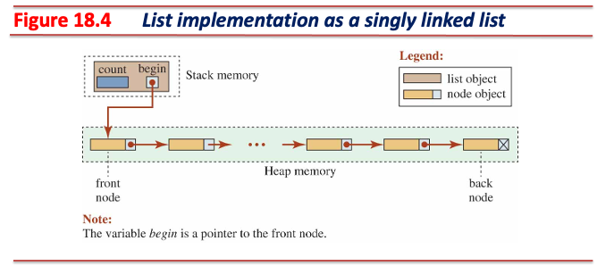

#### `Node` 구조체

* 단일 링크드 리스트 내 노드 표현를 실체화하는 자료형이며, 힙 영역에 할당하여 사용

```cpp
template <typename T>
struct Node {
  T data;  // store a value
  Node<T>* next;  // point to the next node
};
```

---

#### `List` 클래스

* 하나의 단일 링크드 리스트를 관리하기 위한 자료형이며, 스택 영역에 할당하여 사용

```cpp
template <typename T>
class List {
  Node<T>* MakeNode(const T& value);

  Node<T>* begin_;
  int count_;

 public:
  List() : begin_(nullptr), count_(0) {}
  ~List();

  void insert(int pos, const T& value);
  void erase(int pos);
}
```

##### 생성자

* 단일 링크드 리스트 내 노드 수를 보관하는 데이터 멤버 `count`는 `0`으로 설정
* 단일 링크드 리스트의 시작 노드를 가리키는 포인터 데이터 멤버 `begin`은 `nullptr`로 설정

---

##### 멤버 함수 - 삽입 (Insertion)

* 공통: 새로 삽입될 노드는 동적 할당하며, 이 노드의 주소는 `Node` 형 포인터 `add`가 가리킨다.

```cpp
Node<T>* add;
add = MakeNode(value);
```

* 단일 링크드 리스트의 맨 앞 (`List` 형 객체가 가리키는 노드 위치)에 새 노드를 삽입하는 경우:
  1. `add`가 가리키는 노드의 `next` 포인터를 `List` 형 객체의 `begin`으로 설정한다.
  2. `List` 형 객체의 `begin` 포인터를 `add`로 설정한다.

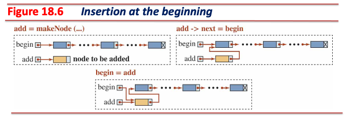

---

* 단일 링크드 리스트의 중간에 새 노드를 삽입하는 경우:
  1. `Node` 형 포인터 `cur`를 단일 링크드 리스트 내 삽입될 위치의 **이전 노드** 주소로 설정한다.
  2. `add`가 가리키는 노드의 `next` 포인터를 `cur`가 가리키는 노드의 `next`로 설정한다.
  3. `cur`가 가리키는 노드의 `next` 포인터를 `add`로 설정한다.

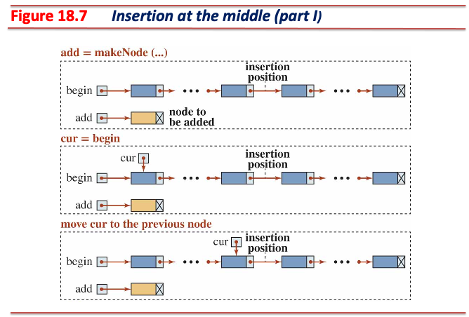

---

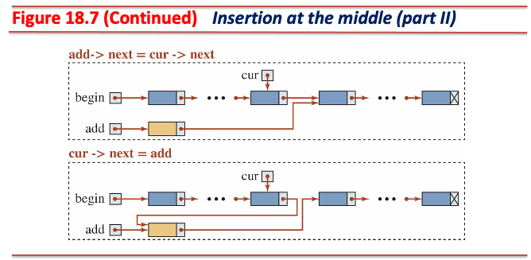

* 단일 링크드 리스트의 맨 마지막에 새 노드를 삽입하는 경우 (중간 노드 삽입과 동일):
  1. `Node` 형 포인터 `cur`를 단일 링크드 리스트의 마지막 노드를 가리키도록 설정한다.
  2. `add`가 가리키는 노드의 `next` 포인터를 `cur`가 가리키는 노드의 `next`로 설정한다\
  (마지막 노드의 `next` 포인터는 항상 `nullptr`이므로, 새로 추가될 노드의 `next`도 `nullptr`이 됨).
  3. `cur`가 가리키는 노드의 `next` 포인터를 `add`로 설정한다.

---

##### 멤버 함수 - 삭제 (Erasure)

* 공통: 삭제할 노드는 `Node` 형 포인터 `del`가 가리킨 뒤, 동적 해제한다.

```cpp
Node<T>* del;
delete del;
```

* 단일 링크드 리스트의 맨 앞 (`List` 형 객체가 가리키는 노드 위치) 노드를 삭제하는 경우:
  1. `del` 포인터를 `List` 형 객체의 `begin`으로 설정한다.
  2. `List` 형 객체의 `begin` 포인터를 `begin`이 가리키는 노드의 `next`로 설정한다.
  3. `del` 포인터가 가리키는 동적 객체를 제거한다.

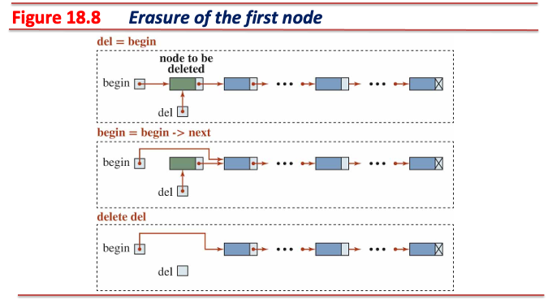

---

* 단일 링크드 리스트의 중간 노드를 삭제하는 경우:
  1. `Node` 형 포인터 `cur`를 단일 링크드 리스트 내 삭제할 노드의 **이전 노드** 주소로 설정한다.
  2. `del` 포인터를 `cur`가 가리키는 노드의 `next` (삭제할 노드)로 설정한다.
  3. `cur`가 가리키는 노드의 `next` 포인터를 `del`이 가리키는 노드의 `next`로 설정한다.
  4. `del` 포인터가 가리키는 동적 객체를 제거한다.

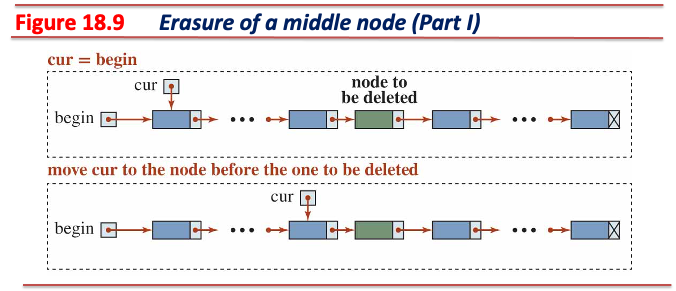

---

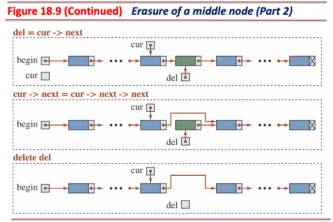

* 단일 링크드 리스트의 맨 마지막 노드를 삭제하는 경우 (중간 노드 삭제와 동일):
  1. `Node` 형 포인터 `cur`를 단일 링크드 리스트 내 삭제할 노드의 **이전 노드** 주소로 설정한다.
  2. `del` 포인터를 `cur`가 가리키는 노드의 `next` (삭제할 노드이자 마지막 노드)로 설정한다.
  3. `cur`가 가리키는 노드의 `next` 포인터를 `del`이 가리키는 노드의 `next`로 설정한다\
  (마지막 노드의 `next` 포인터는 항상 `nullptr`이므로, 새로 추가될 노드의 `next`도 `nullptr`이 됨).
  4. `del` 포인터가 가리키는 동적 객체를 제거한다.

---

##### 소멸자

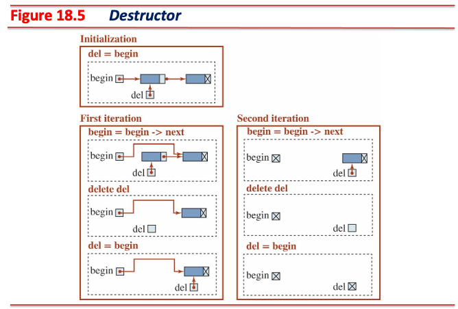

* `List` 형 객체가 가리키는 단일 링크드 리스트 내 모든 노드를 모두 제거해야 함
  1. `Node` 형 포인터 `del`를 `List` 형 객체의 `begin`으로 설정한다.
  2. `List` 형 객체의 `begin` 포인터를 `del`이 가리키는 노드의 `next`로 설정한다.
  3. `del` 포인터가 가리키는 동적 객체를 제거한다.
  4. `begin` 포인터가 `nullptr`가 될 때까지 위 과정을 반복한다.

---

* list.hpp

```cpp
#pragma once

#include <iostream>

#include "list_exception.hpp"

template <typename T>
class List {
  struct Node {
    T data;
    Node* next;
  };

  Node* MakeNode(const T& value);

  Node* begin_;
  int count_;

 public:
  List() : begin_(nullptr), count_(0) {}
  ~List() {
    while (begin_) {
      Node* del = begin_;
      begin_ = del->next;
      delete del;
    }
  }

  void Insert(int pos, const T& value);
  void Erase(int pos);

  T& node(int pos) const {
    if (pos < 0 || pos > count_ - 1)
      throw ListException("The pos. is out of range.", "List::node");
    Node* cur = begin_;
    for (int i = 0; i < pos; ++i) cur = cur->next;
    return cur->data;
  }

  void print() const noexcept {
    if (!count_) std::cout << "\t" << "The list is empty." << std::endl;
    for (Node* cur = begin_; cur; cur = cur->next)
      std::cout << "\t" << cur->data << std::endl;
  }

  int count() const noexcept { return count_; }
};
```

---

* list.hpp (cont'd)

```cpp
// declare what List<T>::Node is a type explicitly using typename
template <typename T>
typename List<T>::Node* List<T>::MakeNode(const T& value) {
  Node* node = new Node;
  if (!node) throw ListException("Can't make a node.", "List::MakeNode");
  node->data = value;
  node->next = nullptr;
  return node;
}

template <typename T>
void List<T>::Insert(int pos, const T& value) {
  if (pos < 0 || pos > count_)
    throw ListException("The pos. is out of range.", "List::Insert");
  Node* add = MakeNode(value);
  ++count_;
  if (!pos) {
    add->next = begin_;
    begin_ = add;
    return;
  }
  Node* cur = begin_;
  for (int i = 1; i < pos; ++i) cur = cur->next;
  add->next = cur->next;
  cur->next = add;
}

template <typename T>
void List<T>::Erase(int pos) {
  if (pos < 0 || pos > count_ - 1)
    throw ListException("The pos. is out of range.", "List::Erase");
  --count_;
  if (!pos) {
    Node* del = begin_;
    begin_ = del->next;
    delete del;
    return;
  }
  Node* cur = begin_;
  for (int i = 0; i < pos - 1; ++i) cur = cur->next;
  Node* del = cur->next;
  cur->next = del->next;
  delete del;
}
```

---

* main.cc

```cpp
#include <iostream>
#include <string>

#include "list.hpp"

int main() {
  try {
    List<std::string> list;
    list.Insert(0, "Michael");
    list.Insert(1, "Jane");
    list.Insert(2, "Sophie");
    list.Insert(3, "Thomas");
    std::cout << "Printing the list" << std::endl;
    list.print();
    std::cout << "Getting data in some nodes" << std::endl;
    std::cout << list.node(1) << std::endl;
    std::cout << list.node(2) << std::endl;
    std::cout << "Erasing some nodes and printing after erasures" << std::endl;
    list.Erase(0);
    list.Erase(2);
    list.print();
    std::cout << "Checking the list size" << std::endl;
    std::cout << "List size: " << list.count() << std::endl;
    list.Erase(0);
    list.Erase(0);
    list.print();
  } catch (const ListException& e) {
    std::cerr << "Error: " << e.what() << "(" << e.where() << ")" << std::endl;
  }
  return 0;
}
```

---

### 스택 (Stack)

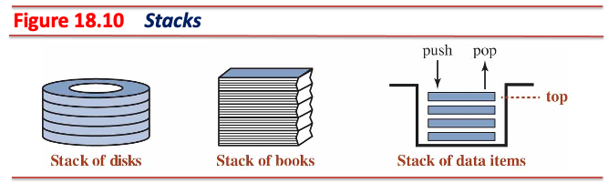

* 선형 집합으로 표현한 자료구조
* LIFO (last in, first out) 구조를 유지하기 위해 제약된 연산만 허용
  * 데이터의 추가와 삭제가 한쪽 끝 (스택의 탑, top)에서만 발생

---

#### 스택 연산

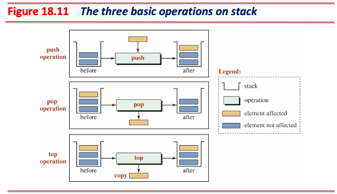

---

#### 단일 링크드 리스트 기반 스택 구현

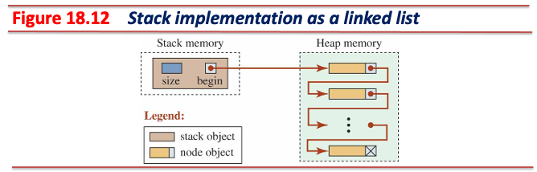

* 스택 클래스는 단일 링크드 리스트를 **구성**하여 구현
  * `List` 형 객체의 `begin` 포인터가 `Stack` 형 객체의 `top` 위치로 사용됨
* 스택 클래스 형 객체는 단일 링크드 리스트를 기반으로 허용된 연산만 추가 구현하여 사용
  * LIFO를 유지하기 위해 `List` 형 멤버 함수를 래핑하여 허용된 연산만 제공하기 위함

---

* stack.hpp

```cpp
#pragma once

#include "list.hpp"

template <typename T>
class Stack {
  List<T> list_;

 public:
  void Push(const T& data) { list_.Insert(0, data); }

  void Pop() { list_.Erase(0); }

  T top() const { return list_.node(0); }
  int size() const noexcept { return list_.count(); }
};
```

---

* main.cc

```cpp
#include <iostream>
#include <string>

#include "stack.hpp"

int main() {
  try {
    Stack<std::string> stack;
    stack.Push("Henry");
    stack.Push("William");
    stack.Push("Tara");
    stack.Push("Richard");
    std::cout << "Stack size: " << stack.size() << std::endl;
    while (stack.size() > 0) {
      std::cout << "Node value at the top: " << stack.top() << std::endl;
      stack.Pop();
    }
    std::cout << "Stack size: " << stack.size() << std::endl;
    stack.Pop();  // it will occur an exception
  } catch (const ListException& e) {
    std::cerr << "Error: " << e.what() << "(" << e.where() << ")" << std::endl;
  }
  return 0;
}
```

---

### 큐 (Queue)

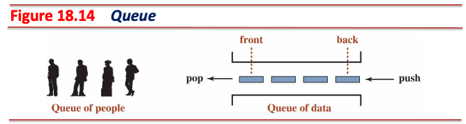

* 선형 집합으로 표현한 자료구조
* FIFO (first in, first out) 구조를 유지하기 위해 제약된 연산만 허용
  * 데이터의 추가와 삭제가 양쪽 끝 (큐의 front, end)에서 발생

---

#### 단일 링크드 리스트 기반 큐 구현

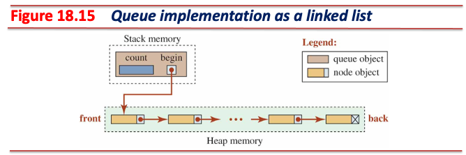

* 큐 클래스는 단일 링크드 리스트를 **구성**하여 구현
  * `List` 형 객체의 `begin` 포인터가 `Queue` 형 객체의 `front` 위치로 사용됨
* 큐 클래스 형 객체는 단일 링크드 리스트를 기반으로 허용된 연산만 추가 구현하여 사용
  * FIFO를 유지하기 위해 `List` 형 멤버 함수를 래핑하여 허용된 연산만 제공하기 위함

---

* queue.hpp

```cpp
#pragma once

#include "list.hpp"

template <typename T>
class Queue {
  List<T> list_;

 public:
  void Push(const T& data) { list_.Insert(size(), data); }
  void Pop() { list_.Erase(0); }

  T front() const { return list_.node(0); }
  T back() const { return list_.node(size() - 1); }
  int size() const noexcept { return list_.count(); }
};
```

---

* main.cc

```cpp
#include <iostream>
#include <string>

#include "queue.hpp"

int main() {
  try {
    Queue<std::string> queue;
    queue.Push("Henry");
    queue.Push("William");
    queue.Push("Tara");
    std::cout << "Element at the front: " << queue.front() << std::endl;
    std::cout << "Element at the back: " << queue.back() << std::endl
              << std::endl;
    queue.Pop();
    queue.Pop();
    std::cout << "Element at the front: " << queue.front() << std::endl;
    std::cout << "Element at the back: " << queue.back() << std::endl;
    queue.Pop();
    queue.Pop();  // it will occur an exception
  } catch (const ListException& e) {
    std::cerr << "Error: " << e.what() << "(" << e.where() << ")" << std::endl;
  }
  return 0;
}
```

---

### 이진 탐색 트리 (Binary Search Tree)

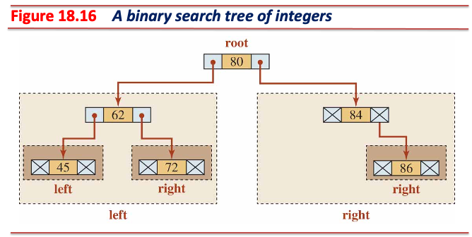

* 비선형 집합으로 표현한 자료구조
* 이진 트리 (binary tree) 구조를 사용해 **탐색**을 효율적으로 수행
  * 각 노드가 최대 두 개의 노드와 연결될 수 있는 구조

---

#### 이진 탐색 트리에서의 순회 (Traversals)

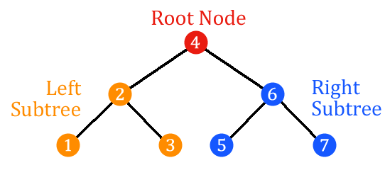

* 이진 트리에서의 각 노드를 탐색하는 방법
* 각 노드는 **한 번만** 처리됨
* 이진 탐색 트리는 세 개의 순회 방법을 사용:
  1. pre-order: 루트 노드 → 왼쪽 서브트리 → 오른쪽 서브트리 (4, 2, 1, 3, 6, 5, 7)
  2. in-order: 왼쪽 서브트리 → 루트 노드 → 오른쪽 서브트리 (1, 2, 3, 4, 5, 6, 7)
  3. post-order: 왼쪽 서브트리 → 오른쪽 서브트리 → 루트 노드 (1, 3, 2, 5, 7, 6, 4)

---

* pre-order: 루트 노드 → 왼쪽 서브트리 → 오른쪽 서브트리

```cpp
void preorder(Node<T>* ptr) const {
  if (!ptr) return;
  std::cout << ptr->data << std::endl;
  preorder(ptr->left);
  preorder(ptr->right);
}
```

* in-order: 왼쪽 서브트리 → 루트 노드 → 오른쪽 서브트리

```cpp
void inorder(Node<T>* ptr) const {
  if (!ptr) return;
  inorder(ptr->left);
  std::cout << ptr->data << std::endl;
  inorder(ptr->right);
}
```

* post-order: 왼쪽 서브트리 → 오른쪽 서브트리 → 루트 노드

```cpp
void postorder(Node<T>* ptr) const {
  if (!ptr) return;
  postorder(ptr->left);
  postorder(ptr->right);
  std::cout << ptr->data << std::endl;
}
```

---

#### 이진 탐색 트리에서의 삽입

* pre-order 순회 방법을 사용:
  1. 트리가 비어있을 때 (트리 내 노드가 존재하지 않을 때), 삽입할 값을 루트 노드로 삽입한다.
  2. 삽입할 값이 루트 노드의 값보다 작다면 왼쪽 서브트리로 이동한다.
  3. 삽입할 값이 루트 노드의 값보다 크다면 오른쪽 서브트리로 이동한다.

```cpp
  Node<T>* insert(const T& value, Node<T>* ptr) {
    if (!ptr) {
      // If the tree is empty, insert as the root
      ptr = MakeNode(value);
    } else if (value < ptr->data) {
      // Insert at the left subtree if the value is less than the root value
      ptr->left = insert(value, ptr->left);
    } else {
      // Insert at the right subtree if the value is greater than the root value
      ptr->right = insert(value, ptr->right);
    }
    return ptr;
  }
```

---

#### 이진 탐색 트리에서의 소멸

* post-order 순회 방법을 사용:
  1. 왼쪽 서브트리를 소멸한다.
  2. 오른쪽 서브트리를 소멸한다.
  3. 루트 노드를 소멸한다.

```cpp
void destroy(Node<T>* ptr) {
  if (!ptr) return;
  destroy(ptr->left);   // Destroy the left subtree.
  destroy(ptr->right);  // Destroy the right subtree.
  delete ptr;           // Delete a data item in the root.
}
```

---

* binary_search_tree_exception.hpp

```cpp
#pragma once

#include <exception>
#include <string>

class BinarySearchTreeException : public std::exception {
 public:
  BinarySearchTreeException(const std::string& what,
                            const std::string& where) noexcept
      : what_(what), where_(where) {}
  ~BinarySearchTreeException() noexcept override = default;

  const char* what() const noexcept override { return what_.c_str(); }
  const char* where() const noexcept { return where_.c_str(); }

 private:
  const std::string what_;
  const std::string where_;
};
```

---

* binary_search_tree.hpp

```cpp
#pragma once

#include <iostream>

#include "binary_search_tree_exception.hpp"

template <typename T>
class BinarySearchTree {
  struct Node {
    T data;
    Node* left;
    Node* right;
  };

  Node* MakeNode(const T& value);

  // helper functions
  Node* Insert(const T& value, Node* ptr);
  void Destroy(Node* ptr) noexcept;
  bool Search(const T& value, Node* ptr) const noexcept;
  void PreOrder(Node* ptr) const noexcept;
  void InOrder(Node* ptr) const noexcept;
  void PostOrder(Node* ptr) const noexcept;

  Node* root_;
  int count_;

 public:
  BinarySearchTree() : root_(nullptr), count_(0) {}
  ~BinarySearchTree() { Destroy(root_); }

  void Insert(const T& value) {
    root_ = Insert(value, root_);
    ++count_;
  }
  bool Search(const T& value) const noexcept { return Search(value, root_); }
  void PreOrder() const noexcept { PreOrder(root_); }
  void InOrder() const noexcept { InOrder(root_); }
  void PostOrder() const noexcept { PostOrder(root_); }
  int size() const noexcept { return count_; }
  bool empty() const noexcept { return !count_; }
};
```

---

* binary_search_tree.hpp (cont'd)

```cpp
template <typename T>
typename BinarySearchTree<T>::Node* BinarySearchTree<T>::MakeNode(
    const T& value) {
  Node* node = new Node;
  if (!node) {
    throw BinarySearchTreeException("Can't make a node.",
                                    "BinarySearchTree::MakeNode");
  }
  node->data = value;
  node->left = node->right = nullptr;
  return node;
}

template <typename T>
typename BinarySearchTree<T>::Node* BinarySearchTree<T>::Insert(
    const T& value,
    typename BinarySearchTree<T>::Node* ptr) {
  if (!ptr)
    ptr = MakeNode(value);
  else if (value < ptr->data)
    ptr->left = Insert(value, ptr->left);
  else
    ptr->right = Insert(value, ptr->right);
  return ptr;
}

template <typename T>
void BinarySearchTree<T>::Destroy(
    typename BinarySearchTree<T>::Node* ptr) noexcept {
  if (!ptr) return;
  Destroy(ptr->left);
  Destroy(ptr->right);
  delete ptr;
}
```

---

* binary_search_tree.hpp (cont'd)

```cpp
template <typename T>
bool BinarySearchTree<T>::Search(
    const T& value,
    typename BinarySearchTree<T>::Node* ptr) const noexcept {
  if (!ptr) return false;
  if (ptr->data == value) return true;
  return Search(value, (value < ptr->data ? ptr->left : ptr->right));
}

template <typename T>
void BinarySearchTree<T>::PreOrder(
    typename BinarySearchTree<T>::Node* ptr) const noexcept {
  if (!ptr) return;
  std::cout << ptr->data << std::endl;
  PreOrder(ptr->left);
  PreOrder(ptr->right);
}

template <typename T>
void BinarySearchTree<T>::InOrder(
    typename BinarySearchTree<T>::Node* ptr) const noexcept {
  if (!ptr) return;
  InOrder(ptr->left);
  std::cout << ptr->data << std::endl;
  InOrder(ptr->right);
}

template <typename T>
void BinarySearchTree<T>::PostOrder(
    typename BinarySearchTree<T>::Node* ptr) const noexcept {
  if (!ptr) return;
  PostOrder(ptr->left);
  PostOrder(ptr->right);
  std::cout << ptr->data << std::endl;
}
```

---

* main.cc

```cpp
#include <iostream>
#include <string>

#include "binary_search_tree.hpp"

int main() {
  try {
    BinarySearchTree<std::string> bct;
    bct.Insert("Michael");
    bct.Insert("Jane");
    bct.Insert("Sophie");
    bct.Insert("Thomas");
    bct.Insert("Rose");
    bct.Insert("Richard");
    std::cout << "Using preorder traversal" << std::endl;
    bct.PreOrder();
    std::cout << std::endl << std::endl;
    std::cout << "Using inorder traversal" << std::endl;
    bct.InOrder();
    std::cout << std::endl << std::endl;
    std::cout << "Using postorder traversal" << std::endl;
    bct.PostOrder();
    std::cout << std::endl << std::endl;
    std::cout << "Searching: " << std::boolalpha << std::endl;
    std::cout << "Is Sophie in the tree? ";
    std::cout << bct.Search("Sophie") << std::endl;
    std::cout << "Is Mary in the tree? ";
    std::cout << bct.Search("Mary") << std::endl;
  } catch (const BinarySearchTreeException& e) {
    std::cerr << "Error: " << e.what() << "(" << e.where() << ")" << std::endl;
  }
  return 0;
}
```
