<!-- _class: lead -->
# 객체지향프로그래밍

## C++ STL (Standard Template Library)

### [munseong.jeong@daejin.ac.kr](mailto:munseong.jeong@daejin.ac.kr)

---

## STL 개요 및 구조

- C++ 표준 라이브러리의 핵심 파트
- 제네릭 프로그래밍(generic programming) 기법 적용
- 재사용 가능한 클래스와 함수의 집합

### STL 핵심 가치

- **Reusability**: 컨테이너는 `int`, `string`, 사용자 정의 클래스 등 모든 데이터 타입 지원
- **Efficiency**: 템플릿 사용으로 컴파일 타임에 코드 생성 → 런타임 오버헤드 최소화
- **Modularity**: 컨테이너(데이터 저장)와 알고리즘(데이터 처리)이 반복자 인터페이스를 통해 분리
  - *N*개의 컨테이너와 *M*개의 알고리즘이 주어졌을 때, *N+M*의 노력으로 *N×M*개 조합 구현 가능

---

## STL 개요 및 구조 (Cont'd)

### STL의 4대 구성 요소

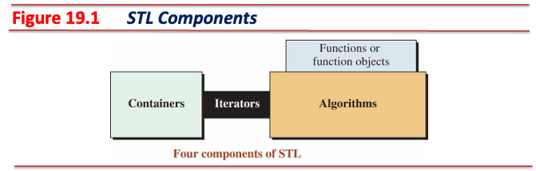

- **Containers(컨테이너)**
  - 데이터를 저장하고 관리하는 객체(e.g., `vector`, `list`, `map`, `set`, `deque`)
- **Iterators(반복자)**
  - 컨테이너의 내부 구조(배열, 연결 리스트 등)를 추상화
  - 포인터와 유사한 인터페이스 제공
- **Algorithms(알고리즘)**
  - `<algorithm>` 헤더에 정의된 템플릿 함수(e.g., 검색, 정렬, 수정, 개수 세기 등 데이터 처리 함수)
- **Function Objects(함수 객체)**
  - 함수처럼 동작하는 객체(functor)를 사용해 알고리즘의 동작 방식을 유연하게 결정(e.g., 정렬 순서)

---

## Iterators (반복자)

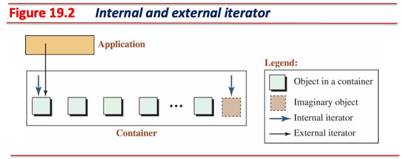

- 반복자는 포인터의 개념을 일반화한 클래스 템플릿
- 포인터처럼 `*` (간접 참조), `->` (멤버 접근), `++` (다음 요소로 이동) 연산 지원
- **반복자는 알고리즘과 컨테이너 사이의 추상화 계층**
  - 알고리즘 함수들은 컨테이너를 직접 알지 못함
  - 오직 반복자를 통해서만 데이터에 접근
  - 컨테이너를 `vector`에서 `list`로 변경해도 탐색(`find`) 코드 **수정 불필요**
    - 단, `std::sort`는 random access iterator를 요구하므로 `list`에서는 `list::sort` 멤버 함수를 사용해야 함

---

## Iterators (반복자) (Cont'd - 1)

[//]: # (INCLUDE: ./cpp/14/src/iter.hpp --from 4 --to 26 --no-comment)

---

## Iterators (반복자) (Cont'd - 2)

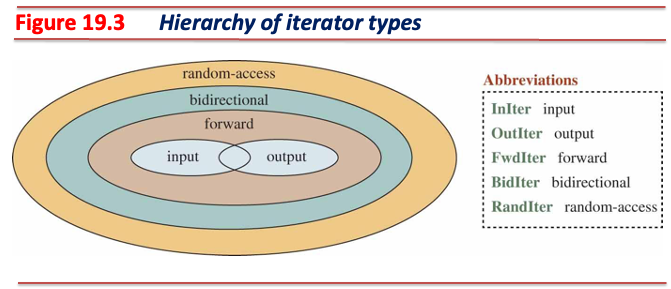

- **Input Iterator(입력 반복자)**: 컨테이너에서 순방향으로 읽기만 가능
- **Output Iterator(출력 반복자)**: 컨테이너에 순방향으로 쓰기만 가능
- **Forward Iterator(전진 반복자)**: 순방향으로 읽기/쓰기 모두 가능
- **Bidirectional Iterator(양방향 반복자)**: 양방향으로 읽기/쓰기 모두 가능
- **Random Access Iterator(임의 접근 반복자)**: 배열처럼 임의 위치에서 읽기/쓰기/비교 모두 가능

---

## Iterators (반복자) (Cont'd - 3)

### 반복자 카테고리 및 기능

- 하드웨어적 제약이나 자료구조의 특징에 따라 지원하는 연산이 상이

| Category | Read | Write | Movement | Speed | Container Examples |
| :--- | :---: | :---: | :--- | :--- | :--- |
| **Input** | ✓ | ✗ | Forward (`i++`) | Sequential | `istream_iterator` |
| **Output** | ✗ | ✓ | Forward (`i++`) | Sequential | `ostream_iterator` |
| **Forward** | ✓ | ✓ | Forward (`i++`) | Sequential | `forward_list` |
| **Bidirectional** | ✓ | ✓ | Both (`i++`, `i--`) | Sequential | `list`, `map`, `set` |
| **Random Access** | ✓ | ✓ | Both + Jump (`i+n`, `i[n]`) | Direct | `vector`, `deque`, `array` |

### 주의사항

- `std::sort`는 **Random Access Iterator** 요구
  - `list` (bidirectional)에서는 사용 불가
  - `list::sort()` 멤버 함수 사용해야 함
- 반복자 타입은 컨테이너의 메모리 구조에 따라 결정됨

---

## Sequence Containers (시퀀스 컨테이너)

- 데이터가 삽입된 순서대로 유지되는 선형 구조

### `std::vector` - 동적 배열

- 메모리 상에 데이터가 **연속적으로** 배치되며, 내부적으로 동적 배열 구현

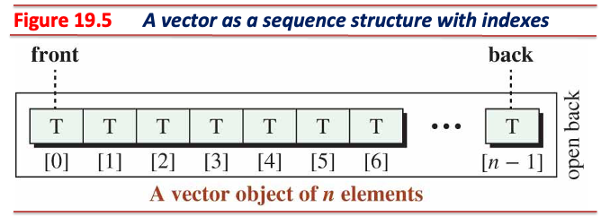

---

## Sequence Containers (시퀀스 컨테이너) (Cont'd - 1)

[//]: # (INCLUDE: ./cpp/14/src/vector.hpp --from 4 --to 24 --no-comment)

---

## Sequence Containers (시퀀스 컨테이너) (Cont'd - 2)

### `std::vector` - 특징

- 인덱스를 통한 조회($O(1)$), 매우 빠름
- 끝에 추가/삭제: 빠름($O(1)$ **amortized**)
- 중간 삽입/삭제: 느림($O(n)$), 뒤의 모든 데이터를 밀어야 함
- Random access iterator 제공

### 용량 관리 (Capacity vs Size)

- `size()`: 실제 저장된 데이터 개수
- `capacity()`: 실제 할당된 메모리 공간
- `reserve(n)`: 잦은 메모리 재할당 방지, 미리 공간 확보(성능 최적화의 핵심)

---

## Sequence Containers (시퀀스 컨테이너) (Cont'd - 3)

[//]: # (INCLUDE: ./cpp/14/src/00_vector.cc)

---

## Sequence Containers (시퀀스 컨테이너) (Cont'd - 4)

### `std::deque` - Double-ended Queue

- 여러 개의 고정 크기 메모리 블록(chunk)을 포인터 배열로 관리하며, 메모리가 연속적이지 않음

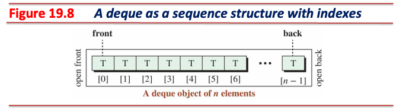

---

## Sequence Containers (시퀀스 컨테이너) (Cont'd - 5)

[//]: # (INCLUDE: ./cpp/14/src/deque.hpp --from 6 --to 25 --no-comment)

---

## Sequence Containers (시퀀스 컨테이너) (Cont'd - 6)

### `std::deque` 특징

- 앞/뒤 모두 $O(1)$ 추가/삭제 가능
- Random access iterator 제공
- 벡터처럼 인덱스 접근 가능하나, 중간 삽입/삭제는 여전히 느림

[//]: # (INCLUDE: ./cpp/14/src/01_deque.cc)

---

## Sequence Containers (시퀀스 컨테이너) (Cont'd - 7)

### `std::list` - 이중 연결 리스트 (Doubly Linked List)

- 각 노드가 포인터로 앞뒤로 연결되며, 메모리가 불연속적으로 분산

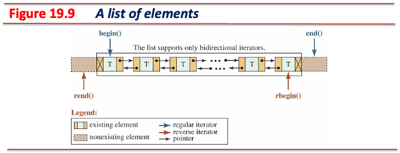

---

## Sequence Containers (시퀀스 컨테이너) (Cont'd - 8)

[//]: # (INCLUDE: ./cpp/14/src/list.hpp --from 4 --to 25 --no-comment)

---

## Sequence Containers (시퀀스 컨테이너) (Cont'd - 9)

### `std::list` 특징

- Bidirectional iterator 제공(random access 불가)
- 임의 접근(`[]`) 불가능 - $O(n)$ 소요
- 반복자(위치)만 알면 삽입/삭제 매우 빠름($O(1)$)
- 앞/뒤 모두 $O(1)$ 추가/삭제 가능

### `splice()`

- 다른 리스트의 노드를 **포인터 연결**만으로 이동
- **복사하지 않아 매우 효율적**

---

## Sequence Containers (시퀀스 컨테이너) (Cont'd - 10)

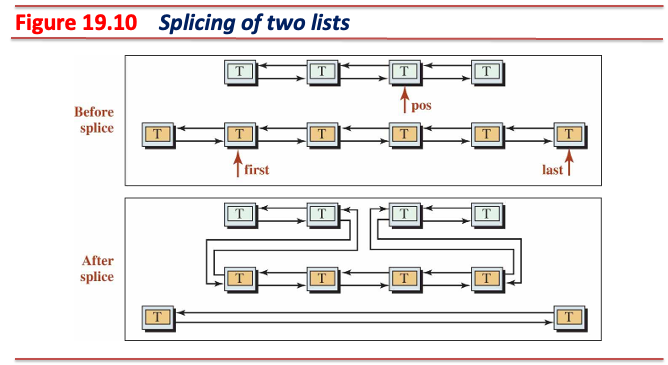

---

## Sequence Containers (시퀀스 컨테이너) (Cont'd - 11)

[//]: # (INCLUDE: ./cpp/14/src/02_list.cc)

---

## Sequence Containers (시퀀스 컨테이너) (Cont'd - 12)

### 선택 기준

| Scenario | Container Choice | Reason |
| :--- | :--- | :--- |
| Frequent index access | `vector` | $O(1)$ access speed |
| Front/back insertion/deletion | `deque` | Both $O(1)$ |
| Modification in middle only | `list` | Insertion/deletion $O(1)$ |
| Iterator stability needed | `list` | Only deleted node invalidated |

#### Iterator Stability

- 컨테이너의 삽입/삭제 후 기존 반복자의 유효 여부를 나타내며, **안정성이 높을수록 기존 반복자를 더 오래 사용 가능**
- `vector`는 iterator가 **자주 무효화됨**
  - 메모리가 연속적으로 배치 → 삽입/삭제 시 뒤의 모든 요소 이동
  - 반복자는 메모리 주소 기반 → 메모리 이동 시 반복자도 무효화
- `list`는 iterator가 **거의 무효화되지 않음**
  - 메모리가 노드 포인터로 연결 → 삽입/삭제 시 포인터만 변경
  - 반복자는 노드 포인터 기반 → 다른 노드의 포인터 변경은 영향 없음

---

## Container Adapters (컨테이너 어댑터)

- **기존 컨테이너의 기능을 제한하여 특정 자료구조처럼 동작하도록 만든 래퍼(wrapper) 클래스**
  - 반복자를 제공하지 않고, `find()`, `sort()` 등 알고리즘 사용 불가

### `std::stack` - LIFO (Last In First Out)

- 기본 자료구조: `deque`
  - `vector`, `list`로 변경 가능
- 맨 위(top)에서만 추가/삭제

[//]: # (INCLUDE: ./cpp/14/src/stack.hpp --from 6 --to 17 --no-comment)

---

## Container Adapters (컨테이너 어댑터) (Cont'd - 1)

- 스택을 활용한 괄호 쌍 검증

[//]: # (INCLUDE: ./cpp/14/src/03_stack.cc)

---

## Container Adapters (컨테이너 어댑터) (Cont'd - 2)

### `std::queue` - FIFO (First In First Out)

- 기본 자료구조: `deque`
  - `list`로 변경 가능(`vector`는 불가능, front 제거 기능 없음)
- Front에서 삭제, back에서 추가

[//]: # (INCLUDE: ./cpp/14/src/queue.hpp --from 6 --to 16 --no-comment)

---

## Container Adapters (컨테이너 어댑터) (Cont'd - 3)

- 큐를 활용한 미로 탈출

[//]: # (INCLUDE: ./cpp/14/src/04_queue.cc --to 21)

---

## Container Adapters (컨테이너 어댑터) (Cont'd - 4)

[//]: # (INCLUDE: ./cpp/14/src/04_queue.cc --from 22)

---

## Container Adapters (컨테이너 어댑터) (Cont'd - 5)

### `std::priority_queue` - 우선순위 큐

- 기본 자료구조: `vector` (내부적으로 max-heap 유지)
  - `deque`로 변경 가능
- 우선순위가 높은 요소부터 꺼냄

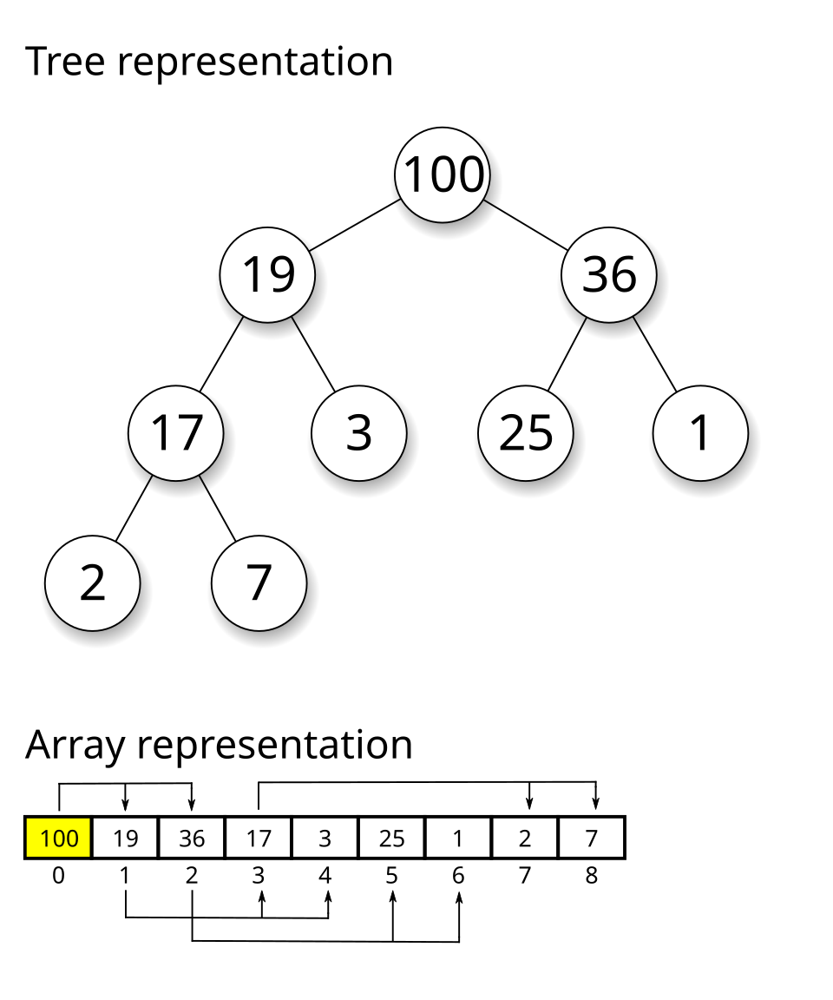

---

## Container Adapters (컨테이너 어댑터) (Cont'd - 6)

[//]: # (INCLUDE: ./cpp/14/src/priority_queue.hpp --from 8 --to 25 --no-comment)

---

## Container Adapters (컨테이너 어댑터) (Cont'd - 7)

- Max-heap 예시

[//]: # (INCLUDE: ./cpp/14/src/05_priority_queue-max-heap.cc)

---

## Container Adapters (컨테이너 어댑터) (Cont'd - 8)

- Min-heap 예시

[//]: # (INCLUDE: ./cpp/14/src/06_priority_queue-min-heap.cc)

---

## Container Adapters (컨테이너 어댑터) (Cont'd - 9)

- 컨테이너 어댑터 기능 비교

| Function | Stack | Queue | Priority Queue | Description |
| :--- | :---: | :---: | :---: | :--- |
| **Push** | ✓ | ✓ | ✓ | Insert data |
| **Pop** | ✓ | ✓ | ✓ | Remove data (no return value) |
| **Top** | ✓ | ✗ | ✓ | Access top element |
| **Front/Back** | ✗ | ✓ | ✗ | Access queue front/back |

---

## Associative Containers (연관 컨테이너)

- Key를 이용해 데이터를 저장하고 검색하는 컨테이너

### Ordered Containers: `std::map` 과 `std::set`

- 균형 이진 트리(red-black tree)를 사용하여 **항상 정렬된 상태 유지**
- 삽입, 삭제, 검색 모두 $O(\log N)$

| Feature | `map` | `set` |
| :--- | :--- | :--- |
| **Stored Data** | Key-Value pair | Key only |
| **Duplicates** | No key duplicates | No duplicates |
| **Access** | `m[key]` or `m.at(key)` | Iterator only |
| **Use Case** | Dictionary, variable storage | Set, duplicate removal |

---

## Associative Containers (연관 컨테이너) (Cont'd - 1)

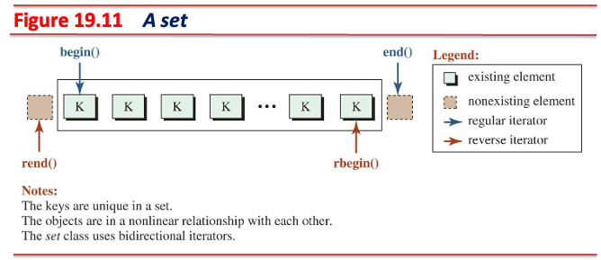

---

## Associative Containers (연관 컨테이너) (Cont'd - 2)

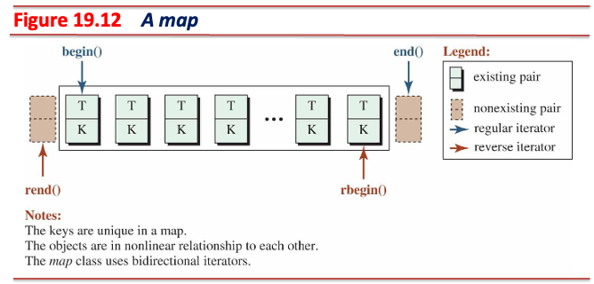

---

## Associative Containers (연관 컨테이너) (Cont'd - 3)

[//]: # (INCLUDE: ./cpp/14/src/map.hpp --from 4 --to 23 --no-comment)

---

## Associative Containers (연관 컨테이너) (Cont'd - 4)

### `operator[]`의 두 가지 의미

[//]: # (INCLUDE: ./cpp/14/src/07_map_indexing.cc)

---

## Associative Containers (연관 컨테이너) (Cont'd - 5)

- 사용자 정의형을 담는 `std::map` 객체

[//]: # (INCLUDE: ./cpp/14/src/08_map.cc)

---

## Associative Containers (연관 컨테이너) (Cont'd - 6)

- 단어 빈도수 분석

[//]: # (INCLUDE: ./cpp/14/src/09_word_freq.cc)

---

## Associative Containers (연관 컨테이너) (Cont'd - 7)

### Unordered Containers: `std::unordered_map` 과 `std::unordered_set`

- 해시 테이블(Hash Table)을 사용하며, **정렬되지 않음**
- 평균: 삽입, 삭제, 검색 $O(1)$
- 최악: 해시 충돌 많을 시 $O(n)$

| Feature | Ordered | Unordered |
| :--- | :--- | :--- |
| **Structure** | Red-Black Tree | Hash Table |
| **Sorting** | Auto-sorted | Not sorted |
| **Complexity** | Guaranteed $O(\log N)$ | Average $O(1)$, worst $O(n)$ |
| **Memory** | Tree overhead | Bucket overhead |
| **Selection** | Sorted traversal needed | Speed priority |

---

## Associative Containers (연관 컨테이너) (Cont'd - 8)

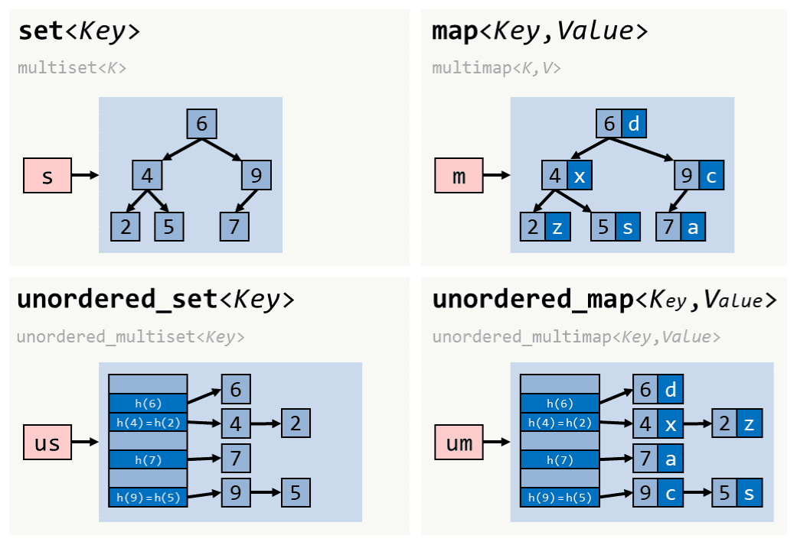

---

## Associative Containers (연관 컨테이너) (Cont'd - 9)

- 사용자 정의형을 담는 `std::unordered_map` 객체

[//]: # (INCLUDE: ./cpp/14/src/10_unordered_map.cc --to 19)

---

## Associative Containers (연관 컨테이너) (Cont'd - 10)

[//]: # (INCLUDE: ./cpp/14/src/10_unordered_map.cc --from 20 --to 27)

---

## Associative Containers (연관 컨테이너) (Cont'd - 11)

[//]: # (INCLUDE: ./cpp/14/src/10_unordered_map.cc --from 28 --to 43)

---

## Associative Containers (연관 컨테이너) (Cont'd - 12)

[//]: # (INCLUDE: ./cpp/14/src/10_unordered_map.cc --from 44 --to 63)

---

## Associative Containers (연관 컨테이너) (Cont'd - 13)

[//]: # (INCLUDE: ./cpp/14/src/10_unordered_map.cc --from 64)

---

## Algorithms (알고리즘)

### 알고리즘의 특징

- `<algorithm>` 헤더에 정의된 템플릿 함수이며, **컨테이너 멤버 함수가 아닌 전역 함수**
- **반복자 범위**(`begin`, `end`)를 인자로 받아 동작하며, **컨테이너의 내부 구조에 무관하게 작동**

[//]: # (INCLUDE: ./cpp/14/src/snippet_algo.hpp --from 7 --to 15 --no-comment)

[//]: # (INCLUDE: ./cpp/14/src/snippet_algo.hpp --from 20 --to 25 --no-comment)

---

## Algorithms (알고리즘) (Cont'd - 1)

### 대표 알고리즘 - 검색

| Algorithm | Function | Complexity | Notes |
| :--- | :--- | :---: | :--- |
| `find(first, last, val)` | Search value | $O(n)$ | Return first match |
| `find_if(first, last, pred)` | Search by condition | $O(n)$ | Return first satisfying condition |
| `binary_search(first, last, val)` | Binary search | $O(\log n)$ | Requires sorted range |
| `lower_bound(first, last, val)` | Find lower bound | $O(\log n)$ | First position >= value |
| `count(first, last, val)` | Count elements | $O(n)$ | Count matching value |

---

## Algorithms (알고리즘) (Cont'd - 2)

### 대표 알고리즘 - 정렬 및 수정

| Algorithm | Function | Complexity | Notes |
| :--- | :--- | :---: | :--- |
| `sort(first, last)` | Sort | $O(n \log n)$ | Random Access Iterator required |
| `stable_sort(first, last)` | Stable sort | $O(n \log n)$ | Preserve order of equal elements |
| `reverse(first, last)` | Reverse | $O(n)$ | In-place modification |
| `shuffle(first, last, rng)` | Random shuffle | $O(n)$ | RNG required |
| `copy(first, last, dest)` | Copy | $O(n)$ | Destination must have capacity |
| `transform(first, last, dest, op)` | Transform | $O(n)$ | Apply op to each element |

---

## Algorithms (알고리즘) (Cont'd - 3)

### 대표 알고리즘 - 범위 연산

| Algorithm | Function | Complexity |
| :--- | :--- | :---: |
| `min_element(first, last)` | Find minimum | $O(n)$ |
| `max_element(first, last)` | Find maximum | $O(n)$ |
| `all_of(first, last, pred)` | All satisfy condition | $O(n)$ |
| `any_of(first, last, pred)` | Any satisfy condition | $O(n)$ |

---

## Algorithms (알고리즘) (Cont'd - 4)

### 알고리즘의 동작 방식 커스터마이징

- 함수 포인터

[//]: # (INCLUDE: ./cpp/14/src/11_algo.cc --from 7 --to 7 --no-comment)

[//]: # (INCLUDE: ./cpp/14/src/11_algo.cc --from 12 --to 13 --no-comment)

- STL 내장 함수 객체(comparator)(`<functional>` 헤더 파일 필요)

[//]: # (INCLUDE: ./cpp/14/src/11_algo.cc --from 20 --to 21 --no-comment)

- Lambda 표현식(권장)

[//]: # (INCLUDE: ./cpp/14/src/11_algo.cc --from 28 --to 29 --no-comment)

---

## Algorithms (알고리즘) (Cont'd - 5)

[//]: # (INCLUDE: ./cpp/14/src/12_custom_sort.cc)

---

## Appendix A. Push vs Emplace

### Key Difference: Object Creation Location

| Aspect | Push | Emplace |
| :--- | :--- | :--- |
| **Operation** | Create temporary → Copy to container | Create directly in container |
| **Copy/Move** | 1 copy occurs | 0 copies (direct construction) |
| **Efficiency** | Low | High |
| **Syntax** | Pass object | Pass constructor arguments |

---

## Appendix A. Push vs Emplace (Cont'd - 1)

### How Push Works

[//]: # (INCLUDE: ./cpp/14/src/13_appendix_a1.cc)

---

## Appendix A. Push vs Emplace (Cont'd - 2)

### How Emplace Works

[//]: # (INCLUDE: ./cpp/14/src/14_appendix_a2.cc)

---

## Appendix A. Push vs Emplace (Cont'd - 3)

### Emplace Functions By Container

| Container | Push | Emplace |
| :--- | :--- | :--- |
| **Vector** | `push_back(obj)` | `emplace_back(args)` |
| | `insert(pos, obj)` | `emplace(pos, args)` |
| **Deque** | `push_back(obj)` | `emplace_back(args)` |
| | `push_front(obj)` | `emplace_front(args)` |
| | `insert(pos, obj)` | `emplace(pos, args)` |
| **List** | `push_back(obj)` | `emplace_back(args)` |
| | `push_front(obj)` | `emplace_front(args)` |
| | `insert(pos, obj)` | `emplace(pos, args)` |
| **Map/Set** | `insert(obj)` | `emplace(args)` |

---

## Appendix A. Push vs Emplace (Cont'd - 4)

### Practical Example

[//]: # (INCLUDE: ./cpp/14/src/15_appendix_a3.cc --to 16)

---

## Appendix A. Push vs Emplace (Cont'd - 5)

[//]: # (INCLUDE: ./cpp/14/src/15_appendix_a3.cc --from 17 --to 30)

---

## Appendix A. Push vs Emplace (Cont'd - 6)

[//]: # (INCLUDE: ./cpp/14/src/15_appendix_a3.cc --from 31 --to 45)

---

## Appendix A. Push vs Emplace (Cont'd - 7)

[//]: # (INCLUDE: ./cpp/14/src/15_appendix_a3.cc --from 46)

---

## Appendix B. Range-Based For Loop Patterns

### 1. Iterate By Value (Copy)

[//]: # (INCLUDE: ./cpp/14/src/16_appendix_b.cc --from 6 --to 18 --no-comment)

---

## Appendix B. Range-Based For Loop Patterns (Cont'd - 1)

### 2. Iterate By Reference (Mutable)

[//]: # (INCLUDE: ./cpp/14/src/16_appendix_b.cc --from 24 --to 37 --no-comment)

---

## Appendix B. Range-Based For Loop Patterns (Cont'd - 2)

### 3. Iterate By Const Reference (Efficient, Read-Only)

[//]: # (INCLUDE: ./cpp/14/src/16_appendix_b.cc --from 43 --to 56 --no-comment)

---

## Appendix B. Range-Based For Loop Patterns (Cont'd - 3)

### 4. Iterate With Type Deduction (`auto`)

[//]: # (INCLUDE: ./cpp/14/src/16_appendix_b.cc --from 65 --to 73 --no-comment)

---

## Appendix B. Range-Based For Loop Patterns (Cont'd - 4)

### Usage Patterns By Container - Vector

[//]: # (INCLUDE: ./cpp/14/src/16_appendix_b.cc --from 85 --to 94 --no-comment)

### Usage Patterns By Container - List

[//]: # (INCLUDE: ./cpp/14/src/16_appendix_b.cc --from 99 --to 102 --no-comment)

---

## Appendix B. Range-Based For Loop Patterns (Cont'd - 5)

### Usage Patterns By Container - Map

[//]: # (INCLUDE: ./cpp/14/src/16_appendix_b.cc --from 107 --to 110 --no-comment)

### Usage Patterns By Container - Set

[//]: # (INCLUDE: ./cpp/14/src/16_appendix_b.cc --from 115 --to 117 --no-comment)

---

## Appendix B. Range-Based For Loop Patterns (Cont'd - 6)

### Internal Implementation

- Range-based `for` loop is automatically transformed to iterator-based loop by the compiler.

#### Original Code

```text
for (declaration : range)
  body;
```

#### Compiler transformation

```text
{
  auto begin = range.begin();
  auto end = range.end();
  for (; begin != end; ++begin) {
    declaration = *begin;
    body;
  }
}
```

---

## Appendix B. Range-Based For Loop Patterns (Cont'd - 7)

### Performance Comparison

[//]: # (INCLUDE: ./cpp/14/src/16_appendix_b.cc --from 123 --to 132 --no-comment)

| Situation | Recommended Syntax |
| :--- | :--- |
| Read-only, large objects | `for (const auto& x : container)` |
| Modification needed | `for (auto& x : container)` |
| Primitives (int, pointers) | `for (auto x : container)` |
| Explicit type | `for (const MyClass& x : container)` |
