<!-- _class: lead -->
# 마이크로임베디드프로그래밍

## 임베디드 시스템 개론

### [munseong.jeong@daejin.ac.kr](mailto:munseong.jeong@daejin.ac.kr)

---

## 임베디드 시스템의 정의 (Definition)

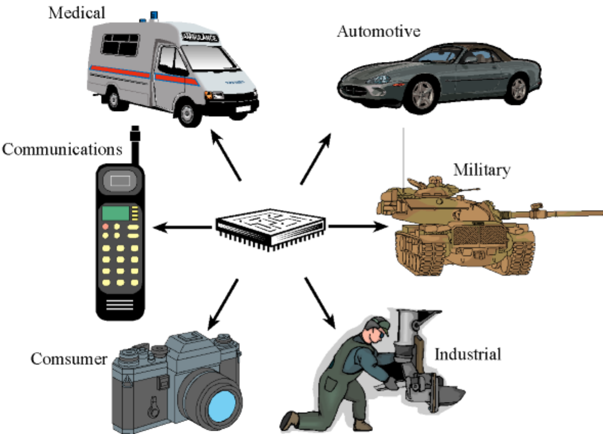

- 가전제품이나 기계 장치 내부에 탑재되어 **특정 목적(단일 기능)만을 수행하도록 설계된 소형 컴퓨터 시스템**
- 범용 컴퓨터(PC, 서버)와 달리 사용 용도가 고정되어 있음

---

## 임베디드 시스템의 정의 (Definition) (Cont'd)

### 범용 시스템과의 비교

| 항목 | 범용 시스템 | 임베디드 시스템 |
| --- | --- | --- |
| 용도 | 다목적 수행 | 특정 목적 전용 |
| 자원 | 풍부함 | 제한적(CPU, 메모리, 전력) |
| 사용자 인터페이스 | 디스플레이·키보드 등 | 없음 또는 최소화 |
| 실시간성 | 대체로 불필요 | 필수 또는 강하게 요구됨 |
| 전원 공급 | 상시 전원 | 배터리 구동 위주 |

---

## 임베디드 시스템의 제약 (Constraints)

- **자원 제약**: CPU 성능, 메모리 용량, 저장 공간의 한계
- **전력 제약**: 배터리 구동 시 소비 전력이 작동 시간을 직접 결정
- **실시간 제약**: 정해진 시간(Deadline) 내 처리 및 응답 필수
  - 경성 실시간(Hard Real-Time): 마감 시간 초과 시 시스템의 치명적 실패 발생
  - 연성 실시간(Soft Real-Time): 마감 시간 초과 시 서비스 품질이 저하되나 동작은 유지
- **환경 제약**: 고온, 진동, 습도 등 가혹한 외부 환경 조건에서 동작

### 제약이 프로그래밍에 미치는 영향

- 동적 메모리 할당 최소화 및 실행 시간의 예측 가능성 확보
- 부동소수점 연산 대신 고정소수점 연산 활용
- 코드 크기(Code Size)와 실행 속도(Execution Speed) 간의 지속적인 균형 고려

---

## 임베디드 시스템의 구성 (Components)

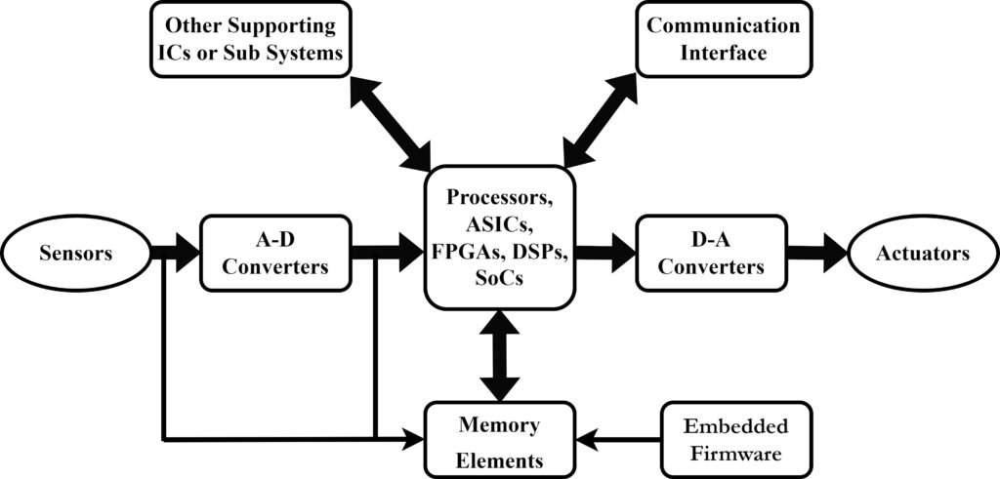

- **프로세서**: MCU(Microcontroller Unit) 또는 MPU(Microprocessor Unit)
- **메모리**: 코드 저장용 Flash, 실행용 RAM
- **보조 회로 및 IC**: PMIC(전원 관리), RTC, 클럭/리셋 등 시스템 안정 구동 지원
- **주변장치**: GPIO, UART, I2C, SPI, ADC, PWM, 타이머 등
- **센서 및 액추에이터**: 외부 물리 세계와의 인터페이스
- **소프트웨어**: 베어메탈(Bare-Metal) 펌웨어 또는 OS 기반 애플리케이션

---

## MCU와 MPU (Microcontroller vs Microprocessor)

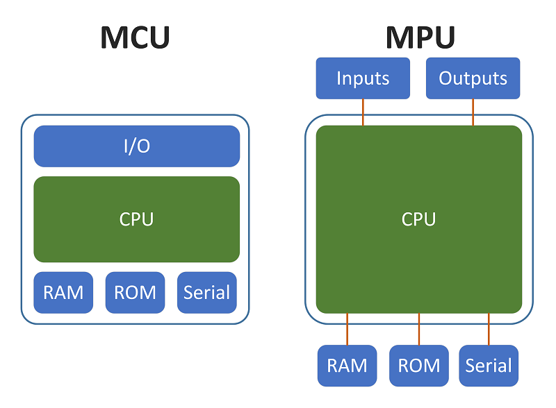

| 항목 | MCU | MPU |
| --- | --- | --- |
| 대표 예 | STM32, ESP32, RP2350 | Raspberry Pi, NXP i.MX, Rockchip RK3588 |
| 메모리 | 칩 내부에 내장 | 외부 DRAM 배치 필요 |
| 저장장치 | 내장 Flash | SD 카드, eMMC 등 |
| 운영체제 | 미탑재 또는 RTOS | Linux 등 범용 OS |
| 부팅 시간 | 수 밀리초(ms) 단위 | 수 초(s) 단위 |

> MCU는 "단일 칩 기반 완결형 시스템", MPU는 "외부 주변 부품 결합형 소형 컴퓨터"

---

## 임베디드 시스템의 응용 (Applications)

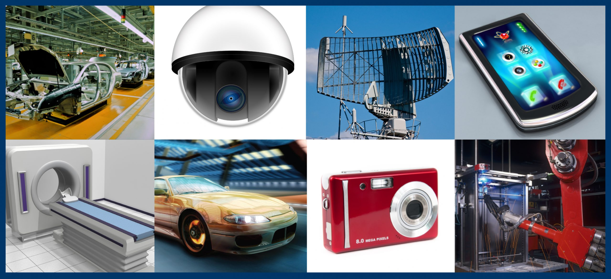

- **가전**: 세탁기, 냉장고, 로봇청소기
- **자동차**: ECU, ADAS, 인포테인먼트 시스템
- **의료기기**: 혈당측정기, 인퓨전 펌프
- **산업**: PLC, 공장 자동화, 로보틱스
- **IoT**: 스마트홈, 환경 센서 네트워크
- **국방·항공**: 비행 제어, 항법 장치

### 최근 기술 트렌드

- 단순 제어 중심에서 **엣지 AI**(단말 직접 추론) 분야로 확장
- 네트워크 연결성 강화에 따른 보안(Security)의 핵심 요소화
- 소프트웨어 복잡도 증가에 따른 **빌드·배포 엔지니어링**의 중요성 증대

---

## 소프트웨어 실행 환경의 세 계층 (Three Layers)

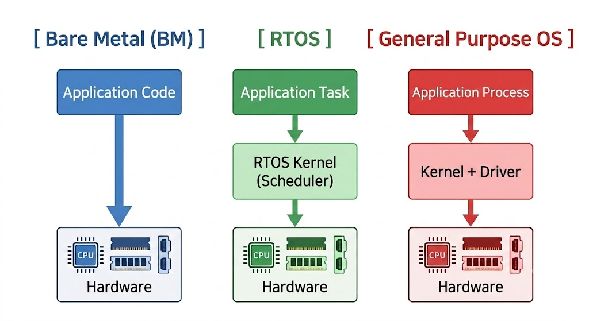

- 상위 계층일수록 **개발 편의성** 향상, 하위 계층일수록 **예측 가능성 및 제어 효율성** 증대
- 애플리케이션 요구사항에 따른 계층 결정이 곧 **하드웨어/소프트웨어 플랫폼 선택**의 기준

---

## 베어메탈 (BM, Bare Metal)

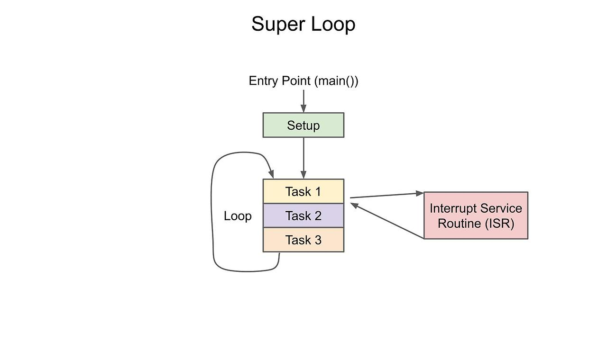

- **운영체제(OS) 없이 응용 코드가 하드웨어를 직접 제어**하는 방식
- 부팅 완료 후 단일 프로그램이 CPU 자원을 전점
- 애플리케이션 자체가 곧 전체 시스템으로 동작

---

## 베어메탈 (BM, Bare Metal) (Cont'd - 1)

```c
int main()
{
    hardware_init();          /* clocks, GPIO, timers */
    while (1) {               /* super loop */
        read_sensors();
        update_control();
        drive_outputs();
    }
}

```

- 실시간 처리가 필요한 작업은 **인터럽트 서비스 루틴**(ISR, Interrupt Service Routine)에서 수행
- 메인 루프와 ISR 간 공유 변수 선언 시 `volatile` 키워드 필수 사용(6장에서 상세히 다룸)

---

## 베어메탈 (BM, Bare Metal) (Cont'd - 2)

### 베어메탈의 장단점 (Trade-Offs)

| 장점 | 단점 |
| --- | --- |
| 완전히 예측 가능한 동작 속도 및 시점 | 기능 확장 시 코드 복잡도 급증 |
| 매우 빠른 부팅 시간 | 멀티태스킹 직접 구현 필요 |
| 극소용량 메모리 환경 동작 가능 | 네트워크·파일시스템 직접 구현 필요 |
| 소비 전력 최적화 용이 | 코드 이식성(Portability) 낮음 |
| OS 라이선스 비용 및 오버헤드 부재 | 제한적인 디버깅 환경 |

#### 적용 영역 (Use Cases)

- 단순하고 명확한 기능 구현(모터 제어, 센서 노드 등)
- **경성 실시간성** 보장 필요(OS 스케줄러 지연을 허용하지 않는 경우)
- 원가절감 및 극단적인 저전력 구현 필요 시

---

## RTOS (Real-Time Operating System)

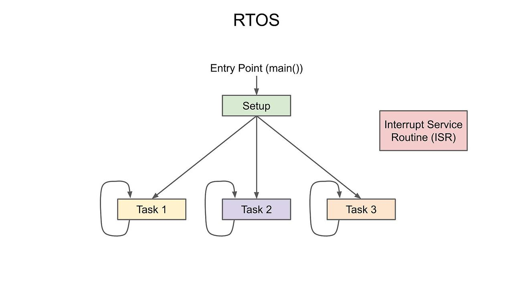

- 베어메탈과 범용 OS의 **중간 단계 계층**
- 시스템 동작을 독립된 **태스크(Task)** 단위로 분할, 우선순위 기반 스케줄러가 전환 관리

---

## RTOS (Real-Time Operating System) (Cont'd - 1)

```c
#include "projdefs.h"  /* Project Definitions, for pdMS_TO_TICKS */

/* Concept: two tasks run independently at different periods. */
void SensorTask(void* arg) {
  for (;;) {
    ReadSensor();
    vTaskDelay(pdMS_TO_TICKS(100));  /* every 100 ms */
  }
}

void NetworkTask(void* arg) {
  for (;;) {
    SendPacket();
    vTaskDelay(pdMS_TO_TICKS(1000));  /* every 1 s */
  }
}

```

- 커널 API(예: `xTaskCreate`)로 등록된 함수는 독립적인 실행 흐름으로 관리됨
- **우선순위 기반 선점형 스케줄링(Preemptive Scheduling)** 제공: 높은 우선순위 태스크가 CPU 우선 점유
- 태스크 간 동기화 및 통신 메커니즘 지원: 큐(Queue), 세마포어(Semaphore), 뮤텍스(Mutex)
- 초경량 커널 구조로 MCU 환경에 적합

---

## RTOS (Real-Time Operating System) (Cont'd - 2)

### RTOS Task Scheduling

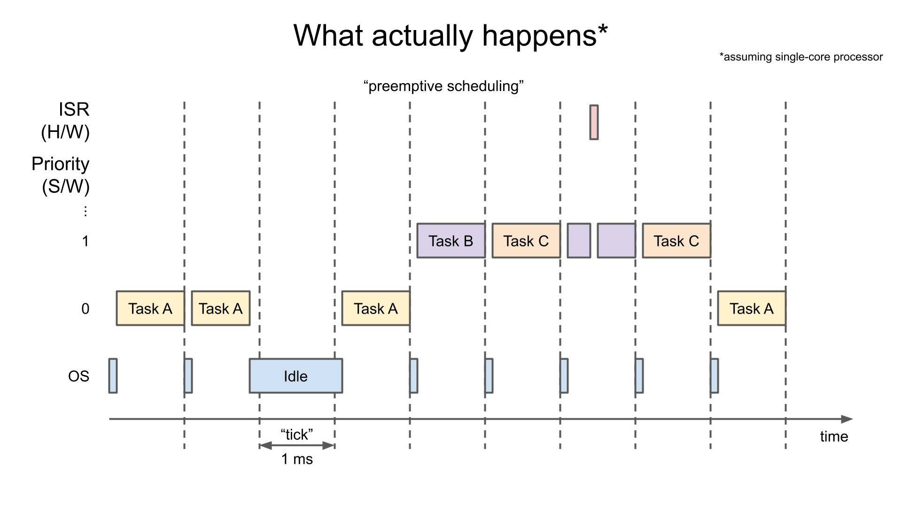

---

## 범용 OS (General-Purpose OS)

- Linux 등 **완전한 형태의 운영체제**를 탑재하는 방식
- 프로세스 관리, 가상 메모리, 파일시스템, 네트워크 스택 전반 제공
- 오픈소스 및 기존 소프트웨어 자산(웹 서버, DB, 라이브러리 등)의 직접 활용 가능
- 표준 개발 도구 및 디버거 활용을 통한 고도의 개발 생산성 확보
- MMU(Memory Management Unit) 탑재가 필수적이며, MPU급 이상의 하드웨어 요구
- 수 초 이상의 부팅 시간 소요 및 비결정적 응답 지연(Latency) 발생 가능

> 카메라 처리, 네트워크 통신, 웹 서비스 기반 시스템 구현 시 필수적 선택

---

## 세 계층 비교 (Comparison)

| 항목 | 베어메탈 | RTOS | 범용 OS |
| --- | --- | --- | --- |
| 필요 메모리 | 매우 작음 | 작음 | 큼 |
| 부팅 시간 | 수 밀리초(ms) | 수십 밀리초(ms) | 수 초(s) |
| 실시간성 | 최고 | 높음(결정적) | 낮음(비결정적) |
| 멀티태스킹 | 직접 구현 | 커널 기본 제공 | 커널 기본 제공 |
| 네트워크·파일시스템 | 직접 구현 | 라이브러리 추가 | OS 기본 제공 |
| 개발 난이도 | 높음 | 중간 | 낮음 |
| 대표 하드웨어 | RP2350, STM32 | ESP32, STM32 | Raspberry Pi, Jetson |

---

## 저전력 플랫폼 (Low-Power Platforms)

- 수개월~수년간 배터리로 동작해야 하는 시스템의 핵심 설계 기준
- **평균 소비 전류 최적화**가 핵심 — 시스템의 대부분 시간을 슬립 상태로 유지

### 전력 모드

| 모드 | 상태 | 상대적 소비 전력 |
| --- | --- | --- |
| 동작(Active) | CPU 프로그램 실행 중 | 가장 큼 |
| 슬립(Sleep) | CPU 정지, 주변장치 동작 | 중간 |
| 딥슬립(Deep Sleep) | 대부분 차단, 타이머·외부 인터럽트로 기상 | 매우 작음 |

$$\text{Battery life (h)} \approx \frac{\text{Battery capacity (mAh)}}{\text{Average current (mA)}}$$

---

## 저전력 플랫폼 (Low-Power Platforms) (Cont'd)

### Current Consumption vs Time

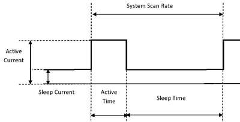

---

## 저전력 설계의 원칙 (Low-Power Design)

- **신속한 처리 후 즉시 슬립 진입**(Race-to-Sleep 원칙)
- 연산 최적화(예: SIMD)를 통한 CPU 가동 시간 단축이 전력 절감으로 직결(5장 상세 다룸)
- 폴링(Polling) 방식 지양, **인터럽트(Interrupt)** 기반 대기/기상 설계
- 무선 송수신 모듈의 전력 소모 극대화 방지: **전송 주기 및 데이터 크기 최소화**
- 미사용 주변장치(Peripherals)의 클록 공급 차단(Clock Gating)

### 범용 OS와 저전력 특성

- Linux 기반 시스템은 백그라운드 프로세스로 인해 딥슬립 진입 제한
- 배터리 기반 소형 장치는 **MCU + 베어메탈/RTOS** 조합 활용이 일반적

---

## 플랫폼 지도 (Platform Map)

| 계층 | 대표 플랫폼 | 실행 환경 |
| --- | --- | --- |
| 교육용 MCU | Raspberry Pi Pico(RP2350) | 베어메탈 / RTOS |
| 범용 MCU | STMicroelectronics STM32 | 베어메탈 / RTOS |
| 무선 MCU | Espressif ESP32 | RTOS |
| 산업용 MPU | NXP i.MX | Linux |
| 고성능 SBC SoC | Rockchip RK3588 | Linux / Android |
| 엣지 AI 모듈 | NVIDIA Jetson | Linux |
| 고성능 AP | Qualcomm Snapdragon | Linux / Android |
| 교육·프로토타이핑 | Raspberry Pi | Linux |

---

## STMicroelectronics STM32

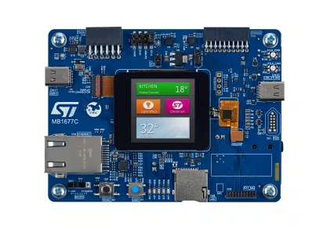

- ARM **Cortex-M** 계열 MCU 제품군 — 임베디드 산업 현장의 사실상 표준

| 항목 | 내용 |
| --- | --- |
| 구성 | Cortex-M0+ ~ M33 + 주변장치 내장 |
| 실행 환경 | 베어메탈, FreeRTOS, Zephyr |
| 강점 | 핀 호환성을 유지하며 성능·메모리 확장이 가능한 광범위한 제품군 |
| 주 용도 | 산업 제어, 모터 제어, 가전, 의료기기 |

- STM32CubeMX를 통한 초기화 코드 자동 생성으로 주변장치 설정 부담 경감

---

## Espressif ESP32

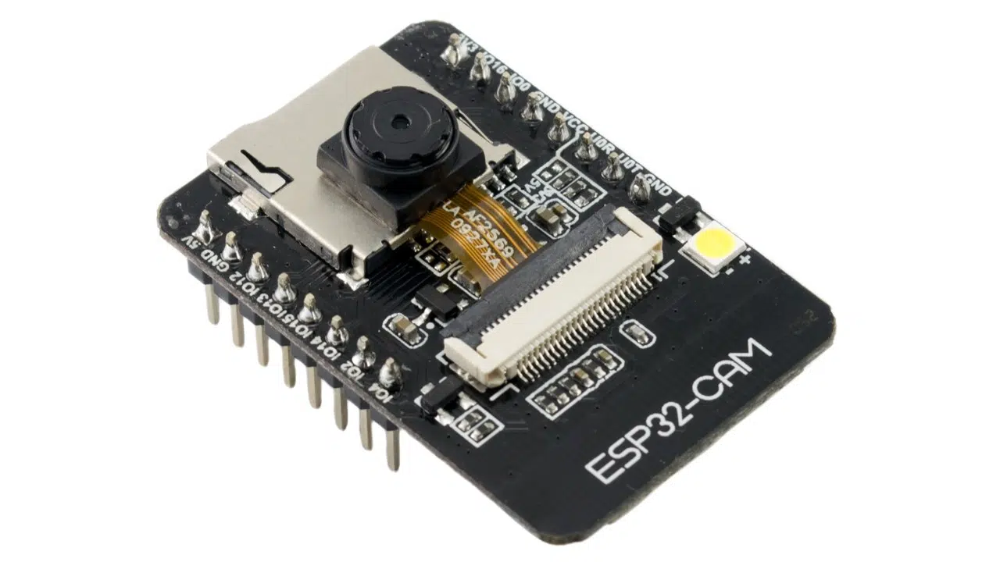

- **Wi-Fi 및 Bluetooth 기능 내장** MCU — IoT 분야 표준 플랫폼

| 항목 | 내용 |
| --- | --- |
| 구성 | Xtensa 또는 RISC-V + Wi-Fi/BLE 코어 |
| 실행 환경 | FreeRTOS 기본 탑재(ESP-IDF) |
| 강점 | 별도 무선 모듈 제거를 통한 원가 및 기판 면적 절감, 딥슬립 지원 |
| 주 용도 | 스마트홈, 무선 센서 노드, 프로토타입 |

- 배터리 센서 노드로 활용 가능하나, 무선 송신 구간의 전류 소모 고려 필요

---

## Raspberry Pi Pico (RP2350)

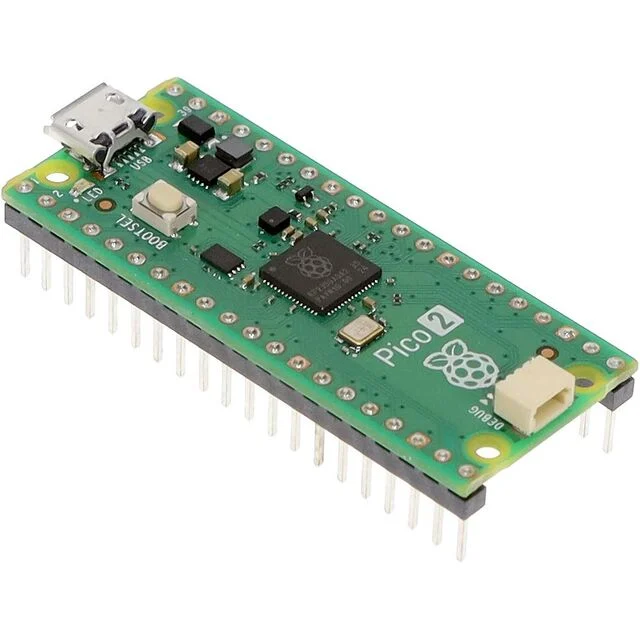

- **라즈베리파이 재단 개발 MCU 보드** — Linux 미지지원

| 항목 | 내용 |
| --- | --- |
| 구성 | Cortex-M33 또는 RISC-V(Hazard3) + PIO |
| 실행 환경 | 베어메탈(C/C++ SDK), FreeRTOS, MicroPython |
| 강점 | PIO(Programmable I/O)를 활용하여 CPU 부하 없이 정밀 타이밍 신호 생성 |
| 주 용도 | 교육, 센서 제어, 실시간 신호 생성 |

- 부팅 시 Arm과 RISC-V 아키텍처 중 선택이 가능한 독특한 구조

---

## NVIDIA Jetson

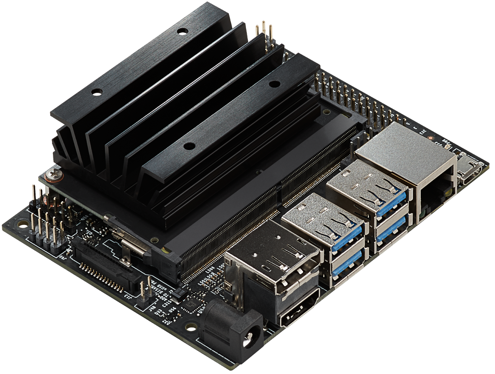

- GPU를 탑재한 **엣지 AI 전용 모듈** — 단말 장치에서 직접 딥러닝 추론 수행

| 항목 | 내용 |
| --- | --- |
| 구성 | Cortex-A + CUDA GPU + 딥러닝 가속기(DLA) |
| 실행 환경 | Linux(JetPack SDK) |
| 강점 | 데스크톱 기반 CUDA 생태계와 연동하여 학습된 모델을 그대로 이식 가능 |
| 주 용도 | 로보틱스, 자율주행, 드론 |

- Orin Nano부터 AGX Orin까지 성능 단계별 제품군 제공

---

## Qualcomm

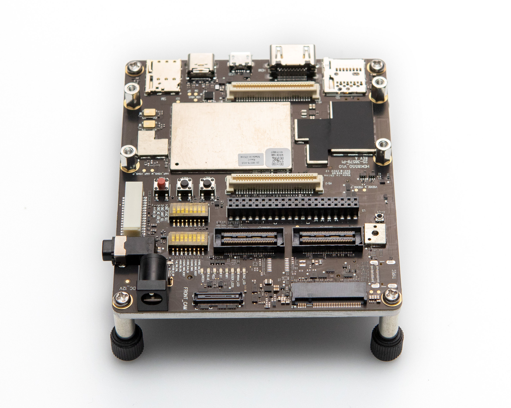

- 모바일 AP 기술을 임베디드로 확장한 **고성능 애플리케이션 프로세서**

| 항목 | 내용 |
| --- | --- |
| 구성 | Cortex-A + GPU + DSP + NPU |
| 실행 환경 | Linux, Android |
| 강점 | 작업별 최적화 유닛 분배, 뛰어난 카메라 및 통신 처리 성능 |
| 주 용도 | 스마트폰, 로보틱스, XR, 차세대 차량 |

- 대표 제품군으로 Snapdragon 및 IoT·로보틱스 전용 파생 라인업 보유

---

## 특화 SoC 사례: Ambarella

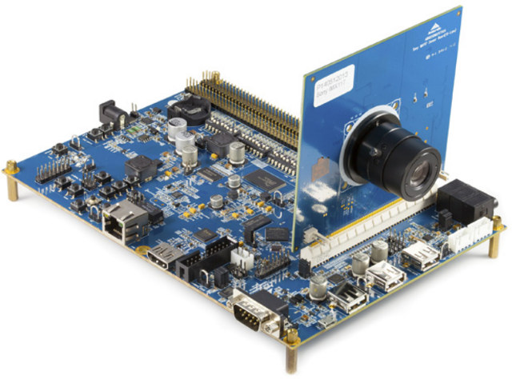

- 범용 플랫폼에서 벗어나 특정 분야에 극단적으로 최적화된 특화 SoC 사례

| 항목 | 내용 |
| --- | --- |
| 구성 | Cortex-A + 영상 인코더 + 전용 AI 엔진 |
| 실행 환경 | Linux |
| 강점 | 고효율 영상 인코딩과 저전력 AI 추론 동시에 수행 |
| 주 용도 | IP 감시 카메라, 차량용 블랙박스, 드론, ADAS |

- 상용 CCTV 시스템은 범용 프로세서 대신 영상 처리 전용 SoC를 주요 탑재

---

## 임베디드 Linux SoC (NXP i.MX / Rockchip RK3588)

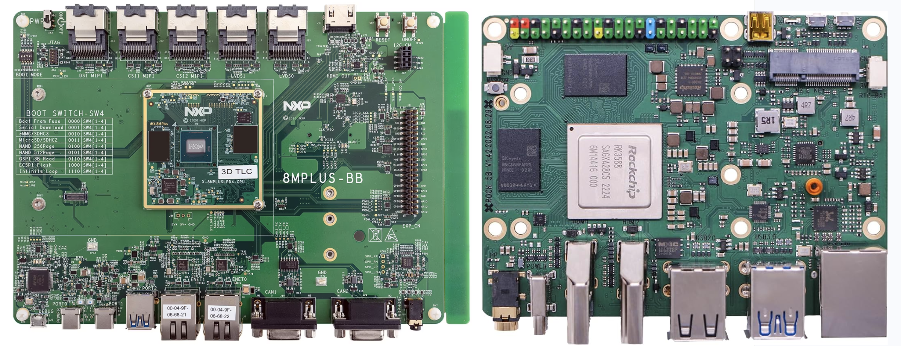

- 두 제품군 모두 라즈베리파이와 유사한 **Linux + GPIO** 제어 구조 제공

| 항목 | NXP i.MX | Rockchip RK3588 |
| --- | --- | --- |
| 구성 | Cortex-A53·A55 + NPU | Cortex-A76·A55 + NPU |
| 실행 환경 | Linux | Linux, Android |
| 강점 | 장기 공급 보증(Long-Term Supply), CAN-FD·TSN 지원 | 8K 영상 디코딩, 다중 카메라 입력 지원 |
| 주 용도 | 산업 제어, 의료, 차량용 장치 | 고성능 SBC, 엣지 AI |

- 산업용 환경에서는 단순 성능보다 장기적인 부품 공급 보증 여부가 핵심 선택 기준

---

## Raspberry Pi

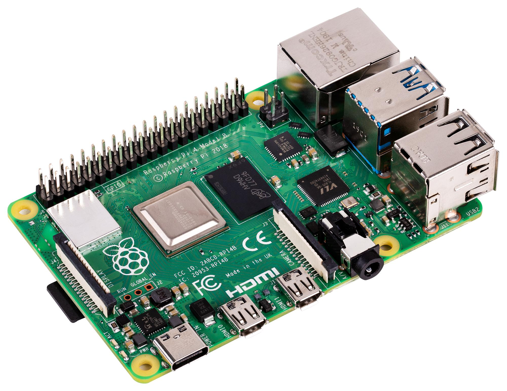

- 교육 및 프로토타이핑용 **단일 보드 컴퓨터(SBC)** — 본 강의의 실습 플랫폼

| 항목 | 내용 |
| --- | --- |
| 구성 | Cortex-A72(`arm64`) + VideoCore GPU |
| 실행 환경 | Raspberry Pi OS(Linux) |
| 강점 | GPIO 제어와 Linux 환경을 동시 제공, 방대한 커뮤니티 및 저렴한 가격 |
| 주 용도 | 교육, 개념 검증(PoC), 시제품 개발(대량 양산에는 미적합) |

- MPU의 특성(Linux·네트워크)과 MCU의 특성(GPIO 제어)을 함께 경험 가능

---

## 플랫폼 선택 기준 (How to Choose)

1. **경성 실시간성 보장 여부** → MCU + 베어메탈/RTOS
2. **배터리 기반 저전력 구동 여부** → 저전력 특화 MCU(STM32 L/U 시리즈 등)
3. **네트워크·파일시스템·웹 서비스 필요 여부** → 범용 OS 기반 MPU
4. **고성능 영상 처리 및 AI 추론 필요 여부** → 전용 SoC/모듈(Ambarella, Jetson, Qualcomm)
5. **양산 규모 및 목표 원가 수준** → 대량 양산 시 전용 특화 SoC 활용이 유리

> **시스템 요구사항이 최적의 플랫폼을 결정**

---

## 이 수업이 다루는 범위 (Scope)

- 본 강의에서는 임베디드 시스템 개발의 핵심 두 축을 체계적으로 다룸

### 영역 1: 하드웨어 제어 (Hardware Control)

- GPIO 기반 디지털 입출력 제어
- 센서 통신 프로토콜(온습도, 조도, 초음파 등)
- 멀티미디어 장치 제어(카메라, 마이크 등)

### 영역 2: 소프트웨어 엔지니어링 (Software Engineering)

- CMake 기반 빌드 시스템 구축 및 크로스 컴파일(Cross Compilation)
- 소프트웨어 라이브러리 설계 및 성능 최적화
- CI/CD 파이프라인 구축, 오픈소스 라이선스 관리, 배포 자동화

> 단순 센서 제어를 넘어, **실제 상용화 및 배포 가능한 제품**을 개발하는 전 과정을 학습
