<!-- _class: lead -->

# 마이크로임베디드프로그래밍

## 라즈베리파이 플랫폼

### [munseong.jeong@daejin.ac.kr](mailto:munseong.jeong@daejin.ac.kr)

---

## 라즈베리파이란 (What Is Raspberry Pi)

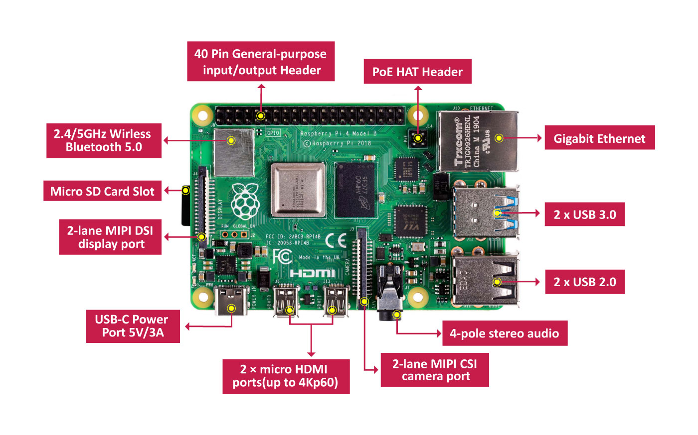

- 영국 라즈베리파이 재단에서 교육용으로 개발한 **싱글 보드 컴퓨터**(SBC)
- 신용카드 크기의 단일 기판에 CPU, 메모리, 입출력 장치 통합 집적
- 뛰어난 가성비와 풍부한 생태계를 바탕으로 교육 및 프로토타이핑의 업계 표준으로 활용

### 싱글 보드 컴퓨터

- 단일 기판 내에 컴퓨터의 주요 구성 요소가 모두 집약된 형태
- 일반 PC와 동일한 **범용 운영체제**(Linux) 구동 가능
- **GPIO 핀**을 탑재하여 MCU처럼 하드웨어를 직접 제어 가능

---

### Raspberry Pi 4의 SoC와 프로세서 (SoC and Processor)

- **SoC**(System on Chip): CPU, GPU, 메모리·입출력 컨트롤러를 하나의 집적 회로에 통합한 반도체
- Raspberry Pi 4는 **Broadcom BCM2711** SoC 탑재
- CPU는 64-bit **ARM Cortex-A72** 쿼드코어, 코어당 최대 1.5GHz
- Cortex-A72는 ARM의 **ARMv8-A** 명령어 집합 아키텍처(**ISA**, Instruction Set Architecture)를 구현
  - ISA: 명령어·레지스터·데이터 타입·메모리 접근 규칙을 정의하는 프로세서와 소프트웨어 사이의 규약
- Raspberry Pi OS 64-bit는 ARMv8-A의 64-bit 실행 상태인 **AArch64**(`aarch64`)를 사용

#### 프로세서 계층

| 계층                 | Raspberry Pi 4의 구성 | 역할                                          |
| -------------------- | --------------------- | --------------------------------------------- |
| SoC                  | Broadcom BCM2711      | CPU와 주변 장치 컨트롤러 통합                 |
| CPU 마이크로아키텍처 | ARM Cortex-A72        | 명령어 실행, 연산, 분기 예측, 캐시 처리       |
| ISA                  | ARMv8-A, AArch64      | 소프트웨어가 사용하는 명령어와 실행 모델 정의 |
| 운영체제 ABI         | Linux arm64           | 컴파일된 프로그램과 커널 사이의 호출 규약     |

---

## Raspberry Pi 4의 메모리 (Memory)

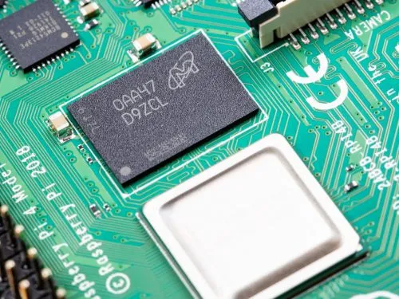

- 주기억장치는 SoC 내부가 아니라 보드에 실장된 **LPDDR4 SDRAM**
- 1GB, 2GB, 4GB, 8GB로 제공되며 용량은 보드 구매 시점에 고정
- **LPDDR4**(Low-Power Double Data Rate 4): 저전력을 목표로 설계된 DDR4 계열 동기식 동적 RAM
- SDRAM은 휘발성 메모리 — 전원이 차단되면 내용 소실
- 실행 중인 프로그램과 커널이 적재되는 공간이므로, 용량이 클수록 동시 처리에 유리
- 영구 저장장치가 아니며, 운영체제와 사용자 파일은 별도 저장장치(e.g., microSD card, USB flash drive)에 기록

---

## microSD 카드 슬롯 (microSD Card)


- 부트 파일, 커널, 루트 파일 시스템, 사용자 데이터를 담는 기본 저장장치
- Imager가 OS 이미지를 기록하면 부트 파티션과 Linux 루트 파티션 생성
- 부트 파티션에는 펌웨어와 설정 파일, 루트 파티션에는 커널과 사용자 공간 운영체제 저장
- 속도 등급만으로 성능이 결정되지 않으므로 신뢰할 수 있는 고내구성 카드 사용
- 전원 강제 차단 시 쓰기 중인 데이터와 파일 시스템 손상 가능
- 이미지 설치 시 RPI Imager에서 `Storage` 선택 시 대상 장치 확인 필수 — **잘못 고르면 PC 데이터가 삭제됨**
- 쓰기량이 많은 서버는 USB SSD 부팅, 로그 원격 전송, 읽기 전용 루트 파일 시스템 검토

---

## GPIO 헤더 (General-Purpose Input/Output)

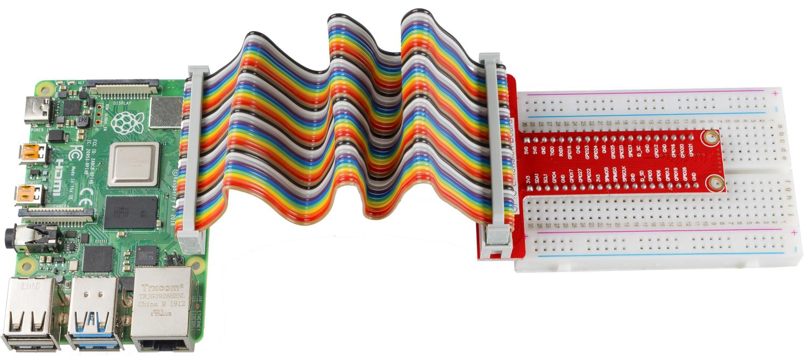

- **GPIO**는 *General-Purpose Input/Output*의 약자 — 소프트웨어가 핀의 입출력을 제어하는 범용 디지털 인터페이스
- **40핀 2.54mm pitch 헤더**를 사용하며 전원·접지·GPIO 핀이 함께 배치
- 신호는 **3.3V CMOS 로직**이며 출력 HIGH는 약 3.3V
  - 5V 신호를 GPIO 입력에 직접 연결하면 SoC 손상
- I2C, SPI, UART, PWM 등 대체 기능 제공 — 소프트웨어에서는 물리 핀 번호가 아닌 **BCM GPIO 번호** 사용

> **주의:** GPIO 핀은 전원 공급 장치가 아님 — 모터·릴레이처럼 큰 전류가 필요한 부하는 트랜지스터·드라이버·외부 전원 사용

---

## PoE 헤더 (Power over Ethernet Header)

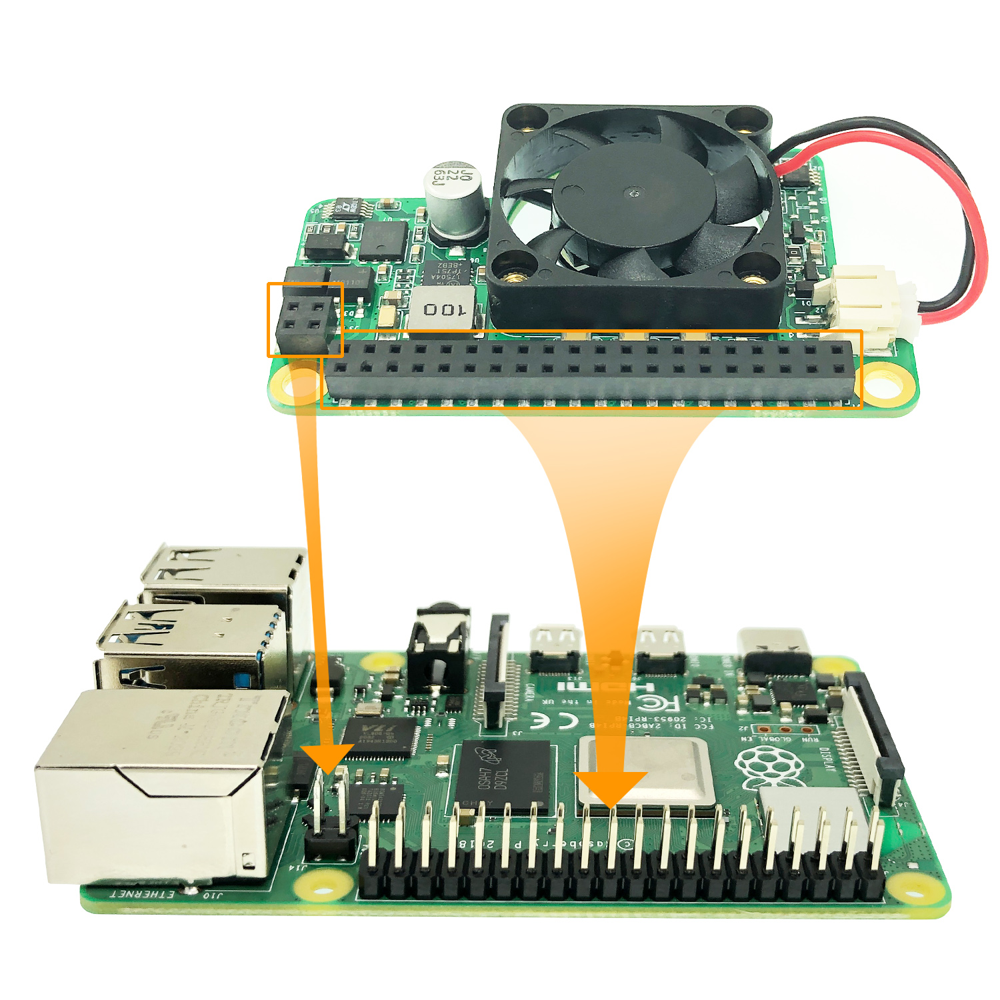

- **PoE**는 *Power over Ethernet*의 약자 — 이더넷 케이블 하나로 데이터와 직류 전원을 함께 전달
- 4핀 PoE 헤더는 일반 GPIO가 아니라 **PoE HAT** 전용 인터페이스
- PoE HAT은 IEEE 802.3af 호환 스위치나 인젝터의 전원을 5V로 변환
- 카메라, 키오스크, 천장형 센서처럼 전원 배선이 어려운 곳에 유용

---

## 기가비트 이더넷 (Gigabit Ethernet)

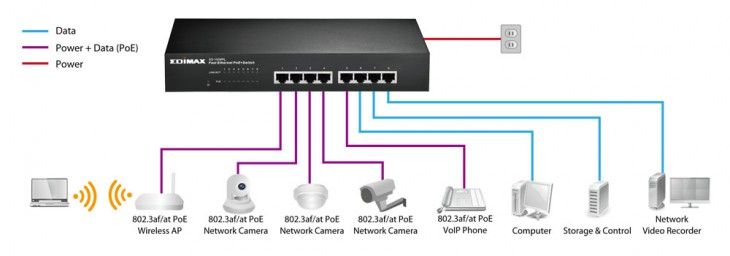

- RJ45 커넥터의 **IEEE 802.3ab 1000BASE-T** 유선 이더넷 인터페이스
- Cat5e 이상 케이블과 기가비트 스위치 조합에서 이론상 **1Gbit/s** 링크 협상
- 실제 처리량은 프로토콜 오버헤드, 저장 장치, CPU, 네트워크 장비에 따라 더 낮음
- SSH, 원격 개발, 대용량 전송처럼 안정성과 낮은 지연이 필요한 작업에 적합

```bash
ip link show eth0
ethtool eth0 | grep -E 'Speed|Duplex|Link detected'
```

> `Speed: 1000Mb/s`, `Link detected: yes`: 기가비트 링크 활성 상태
> 케이블 또는 스위치 미지원 시 100Mb/s로 자동 협상

---

## USB 인터페이스 (Universal Serial Bus)

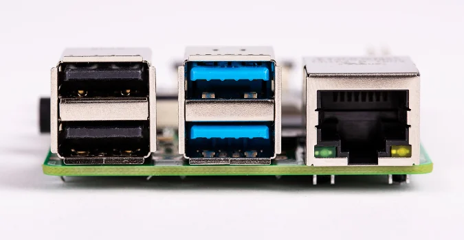

- **USB**는 *Universal Serial Bus*의 약자 — 전원 공급과 직렬 데이터 통신을 한 케이블로 처리하는 호스트 인터페이스
- Raspberry Pi 4에는 **USB 3.0 2개**(파란색)와 **USB 2.0 2개**(검은색) 탑재
- USB 3.0은 이론상 5Gbit/s(**SuperSpeed**), USB 2.0은 480Mbit/s(**High-Speed**)
  - 실제 속도는 장치와 저장 매체에 따라 달라짐
- 키보드, 마우스, USB 메모리, USB 카메라, 무선 동글 연결 가능

```bash
lsusb
lsusb -t
```

- 버스 전원이 부족하면 외부 전원 USB 허브 사용
- USB 3.0 장치와 2.4GHz 동글을 가까이 두면 전파 간섭 발생 — 연장 케이블이나 USB 2.0 포트 사용

---

## 4극 스테레오 오디오 (4-pole Stereo Audio)

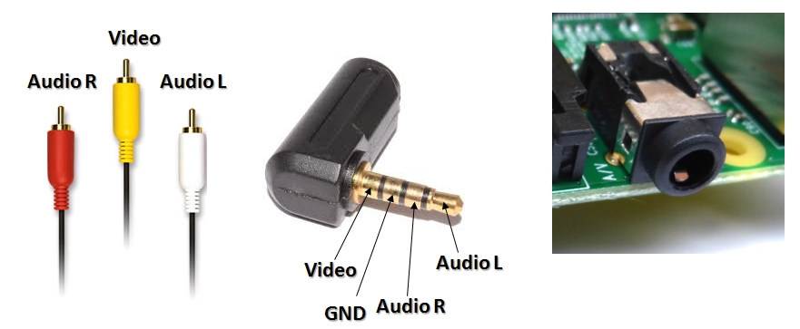

- 보드 가장자리의 3.5mm 잭은 **TRRS**(Tip-Ring-Ring-Sleeve) 4극 커넥터
- 스테레오 아날로그 오디오 출력(L/R)과 **컴포지트 비디오 출력**(CVBS)을 한 잭에서 제공
- 일반 3극 TRS 케이블은 오디오만 사용 가능 — 비디오까지 쓰려면 호환 4극 A/V 케이블 필요
- 디지털 I2S가 아닌 아날로그 출력이므로 긴 케이블과 전기적 잡음의 영향을 받음

| 접점   | 일반적인 신호    |
| ------ | ---------------- |
| Tip    | 왼쪽 오디오      |
| Ring 1 | 오른쪽 오디오    |
| Ring 2 | 접지 또는 비디오 |
| Sleeve | 비디오 또는 접지 |

> 제조사마다 접점 배치가 다르므로 컴포지트 비디오 사용 전 TRRS 배치 확인 — HDMI는 별도의 디지털 오디오 경로

---

## MIPI 카메라·디스플레이 인터페이스

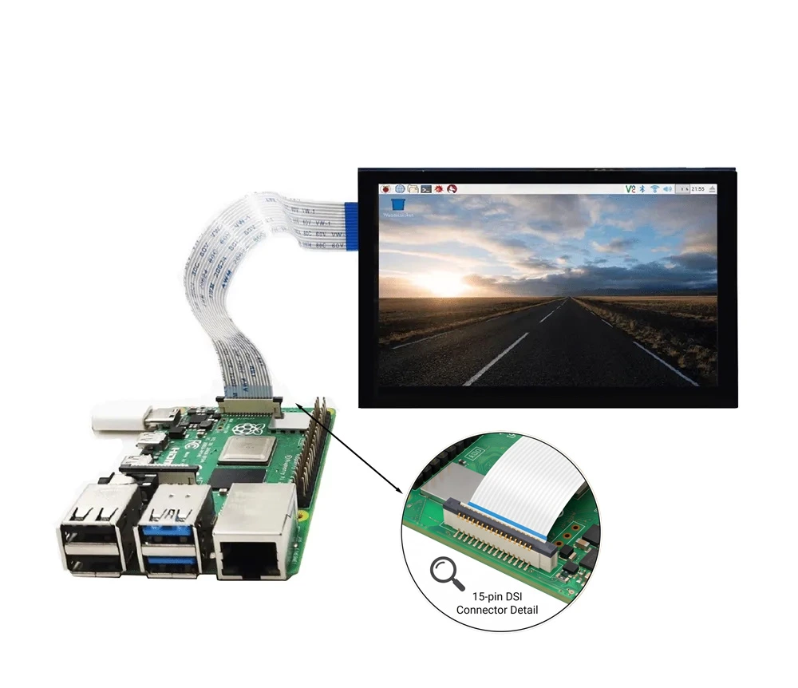

- **MIPI**는 *Mobile Industry Processor Interface*의 약자 — 모바일·임베디드 장치용 산업 표준 인터페이스 모음
- Raspberry Pi 4는 카메라용 **CSI**(Camera Serial Interface)와 디스플레이용 **DSI**(Display Serial Interface) 사용
- 15핀 FFC(Flat Flexible Cable) 커넥터와 전용 리본 케이블 사용 — 접점 방향과 폭이 맞지 않으면 연결 금지

| 인터페이스 | 데이터 흐름       | 연결 장치                                    |
| ---------- | ----------------- | -------------------------------------------- |
| CSI        | 카메라 -> SoC     | Raspberry Pi Camera Module, 호환 이미지 센서 |
| DSI        | SoC -> 디스플레이 | Raspberry Pi Touch Display, 호환 LCD         |

- 사용 가능한 레인 수와 해상도·프레임 속도는 보드·카메라·디스플레이 조합에 따라 달라짐
- USB 카메라와 달리 전용 고속 영상 경로와 장치 트리·libcamera 설정 사용

---

## micro-HDMI 출력 (Micro High-Definition Multimedia Interface)

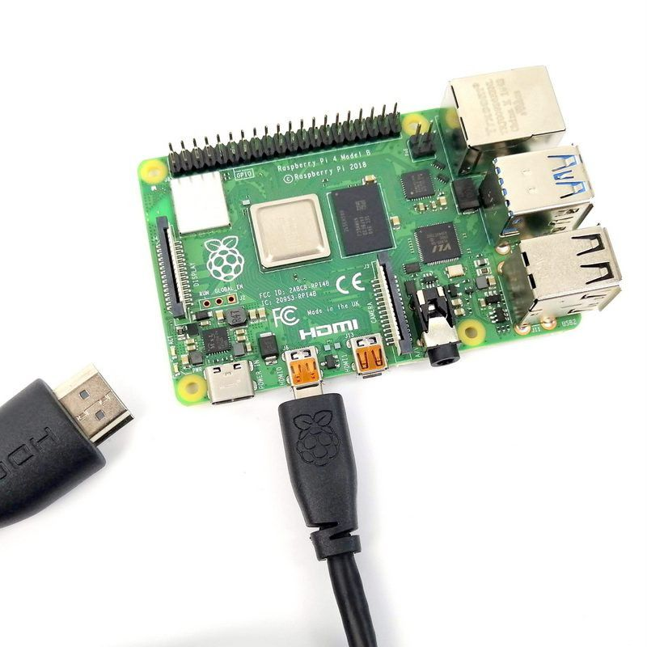

- **HDMI**는 *High-Definition Multimedia Interface*의 약자 — 비압축 디지털 영상과 오디오를 한 케이블로 전달
- **micro-HDMI Type D 포트 2개** 제공 — 모니터 두 대 연결 가능
- 단일 디스플레이 최대 4Kp60, 듀얼 디스플레이 최대 4Kp30 수준
  - 실제 해상도와 재생률은 케이블·모니터·설정에 의존
- 커넥터 크기만 다르고 신호 규격은 HDMI와 동일 — 변환 케이블 또는 어댑터 필요

> 고해상도 출력에는 규격에 맞는 케이블과 충분한 전원 사용
> 오디오가 HDMI로 나가면 4극 아날로그 잭과 출력 장치가 달라짐

---

## USB-C 전원 입력 (USB Type-C Power)

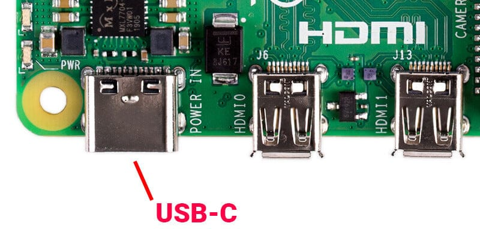

- USB-C 포트는 데이터 통신용이 아니라 **전원 입력 단자**
- 권장 전원은 **5V, 3A** — 어댑터·케이블·주변 장치의 전류 용량이 모두 충분해야 함
- USB Power Delivery 충전기라고 모든 전압이 자동 지원되지는 않음 — 5V 출력이 안정적인 전원 사용
- 전압·전류가 부족하면 번개 아이콘, 재부팅, USB 인식 실패, SD 카드 손상 발생

> 전원 연결 중 GPIO나 HAT 탈착 금지 — 종료는 `sudo shutdown -h now`로 수행

---

## USB-C 전원 입력 (USB Type-C Power) (Cont'd)

### `vcgencmd`

- 라즈베리 파이의 SoC 펌웨어로부터 전압, 온도, 클록 주파수 등의 하드웨어 모니터링 정보를 실시간으로 조회하는 명령줄 도구

```bash
# Measures the internal SoC core supply voltage (VDD_CORE)
vcgencmd measure_volts
# Measures the internal die temperature of the Broadcom SoC (CPU/GPU).
vcgencmd measure_temp
# Measures the current operating frequency of the SoC ARM CPU core (in Hz).
vcgencmd measure_clock arm

# Retrieves a bitmask of active and historical under-voltage/throttling status.
vcgencmd get_throttled
# 0x0             : Normal status (no under-voltage or throttling)
# Bit  0 (0x1)    : Under-voltage detected (currently active)
# Bit  1 (0x2)    : ARM frequency capped (currently active)
# Bit  2 (0x4)    : Throttling currently active
# Bit  3 (0x8)    : Soft temperature limit reached (currently active)
# Bit 16 (0x10000): Under-voltage has occurred since boot
# Bit 17 (0x20000): ARM frequency capped has occurred since boot
# Bit 18 (0x40000): Throttling has occurred since boot
# Bit 19 (0x80000): Soft temperature limit has occurred since boot
```

---

## 2.4/5GHz 무선랜 (Dual-Band Wi-Fi)

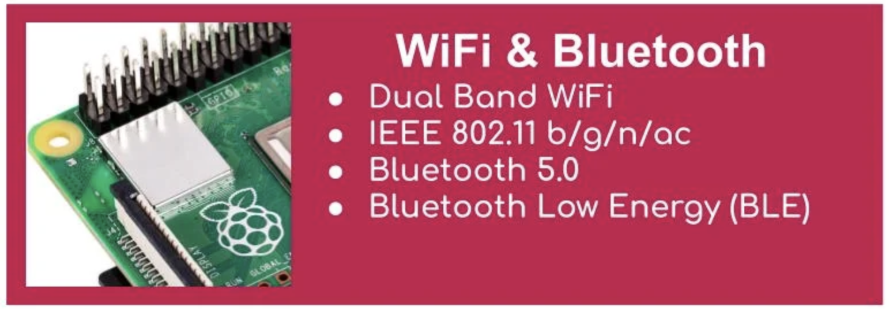

- **IEEE 802.11ac** 기반 듀얼 밴드 Wi-Fi 지원
- 2.4GHz는 도달 거리와 벽 투과에 유리하지만 Bluetooth·전자레인지·IoT 장치와 대역 공유
- 5GHz는 채널 폭과 환경에 따라 처리량이 높고 혼잡이 적지만 벽과 거리에 민감
- 반이중 무선 매체이므로 표시된 링크 속도와 실제 TCP 처리량은 다름

```bash
nmcli device wifi list
nmcli device status
iw dev wlan0 link
```

- 이동형 장치는 Wi-Fi, 장시간 SSH·대용량 전송은 Gigabit Ethernet 우선 고려
- 무선랜 고정 IP 설정은 뒤의 **네트워크 구성** 절차를 따를 것

---

## Bluetooth와 BLE (Bluetooth Low Energy)

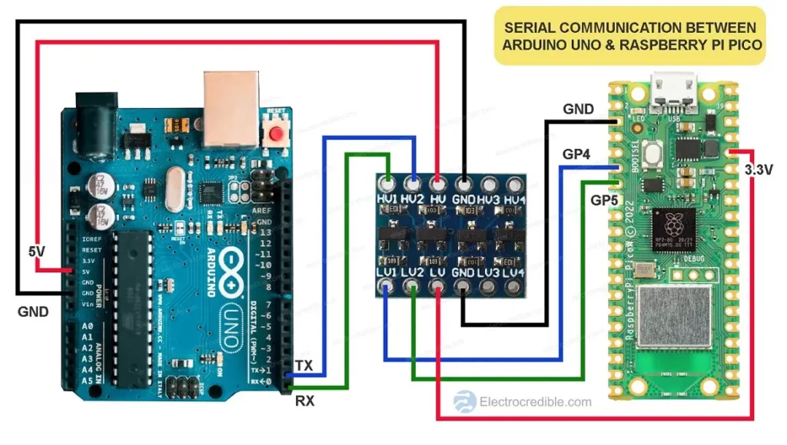

- 무선 칩은 Bluetooth Classic과 **BLE**(Bluetooth Low Energy) 지원
- Classic은 키보드·마우스·스피커처럼 지속 연결과 비교적 큰 데이터 전송에 사용
- BLE는 광고 패킷과 짧은 연결로 센서 값·배터리 상태 같은 소량 데이터를 저전력 전송
- 2.4GHz Wi-Fi와 대역을 공유하며, USB 3.0의 고주파 노이즈·주변 AP·금속 케이스 등 물리적 전파 간섭을 받음

```bash
bluetoothctl
# power on
# scan on
# pair <MAC>
# connect <MAC>
```

> Bluetooth를 비활성화해 UART(Universal Asynchronous Receiver/Transmitter)를 확보하면 무선 Bluetooth 사용 불가

---

## 라즈베리파이 제품 계보 (Model Lineage)

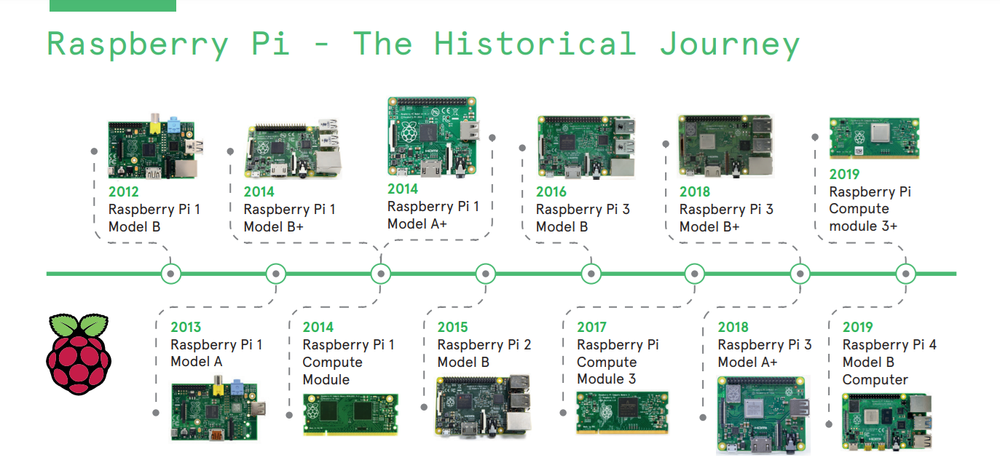

| 계열               | 특징                                      | 주요 용도                    |
| ------------------ | ----------------------------------------- | ---------------------------- |
| Model B(3/4/5)     | 표준 규격, 다수의 이더넷·USB 포트 탑재    | 데스크톱 대체, 서버, 본 실습 |
| Model A            | Model B 대비 이더넷·USB 축소, 저전력 설계 | 임베디드 시스템 내장         |
| Zero / Zero 2 W    | 초소형, 저전력, 무선 네트워크 내장        | 소형 IoT, 웨어러블 기기      |
| Compute Module(CM) | 커넥터 방식 모듈(별도 캐리어 보드 필요)   | 양산형 제품 내장             |
| Pico               | RP2040 MCU 기반(Linux 미탑재)             | 베어메탈 하드웨어 제어       |

> **참고:** GPIO 40핀 헤더의 **핀 배치는 세대 간 호환**되므로 동일한 실습 회로 재사용 가능
> **주의:** Pico는 라즈베리파이 브랜드 제품이나 Linux가 구동되지 않는 **MCU** 형태임

---

## GPIO 헤더 (GPIO Header)

### 핀 번호 체계

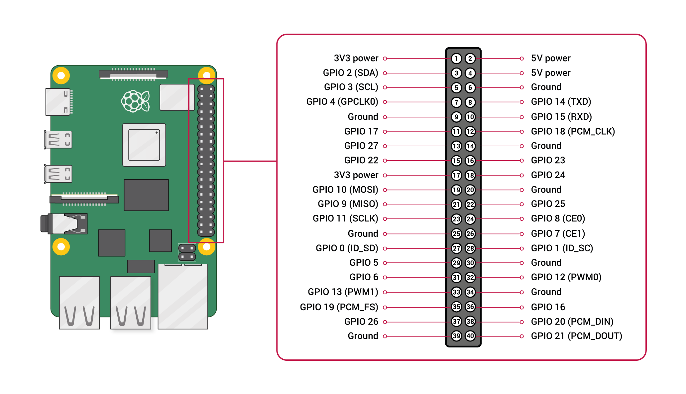

| 체계         | 설명                       | 사용 목적                   |
| ------------ | -------------------------- | --------------------------- |
| 물리 핀 번호 | 헤더의 물리적 위치(1~40번) | 회로 실물 연결 시 적용      |
| BCM 번호     | SoC 내부의 GPIO 제어 번호  | **소프트웨어 제어 시 사용** |

> **주의:** 두 체계를 혼동할 경우 오작동이 발생할 수 있음(본 강의의 모든 소스 코드는 **BCM 번호** 기준 작성)

---

## GPIO의 대체 기능 (Alternate Functions)

- 각 핀은 일반 입출력(GPIO) 외에 **통신 전용 특수 기능**을 겸함

| 기능                   | 주요 용도               |
| ---------------------- | ----------------------- |
| I2C(SDA/SCL)           | 2선식 다중 기기 통신    |
| SPI(MOSI/MISO/SCLK/CE) | 고속 동기식 통신        |
| UART(TXD/RXD)          | 직렬 통신, 시리얼 콘솔  |
| PWM                    | 아날로그 형태 신호 출력 |

### 주요 주의사항

- 특수 기능으로 할당된 핀을 일반 GPIO로 사용할 경우 해당 통신 기능 사용 불가
- SPI 및 I2C 인터페이스는 `raspi-config`에서 **명시적으로 활성화**해야 동작
- 핀 배정 전 필요한 통신 인터페이스 규격을 사전 정의할 것

---

## GPIO 대체 기능 - I2C 개요 (Inter-Integrated Circuit)

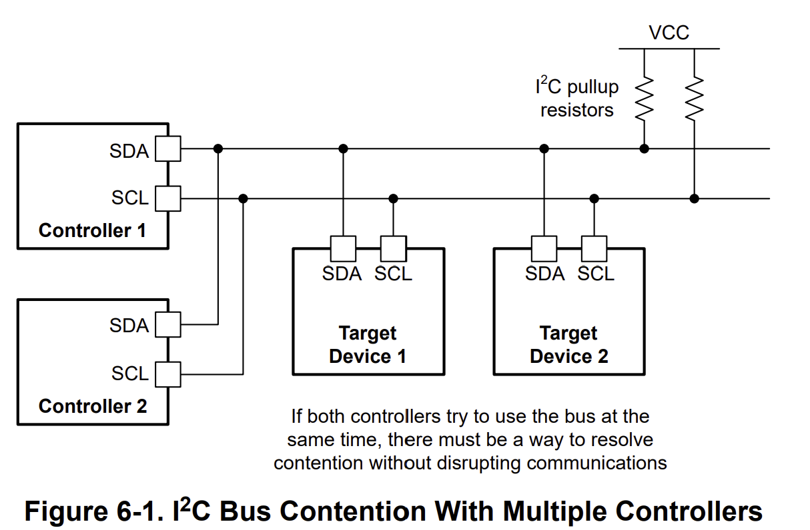

- **두 선**만으로 여러 장치를 연결하는 동기식 반이중(Half-Duplex) 버스

| 신호  | 이름              | 역할                                 |
| ----- | ----------------- | ------------------------------------ |
| `SDA` | Serial Data Line  | 주고받는 데이터                      |
| `SCL` | Serial Clock Line | 마스터인 라즈베리 파이가 만드는 클럭 |

- 장치마다 고유 **주소**를 가지므로 장치가 추가되어도 추가 선을 구성하지 않아도 됨
- 두 선 모두 **풀업 저항** 사용
- 용도: 온습도·가속도 센서, OLED 디스플레이, RTC 모듈

---

## GPIO 대체 기능 - I2C 오픈 드레인 회로 (Open-Drain Circuit)

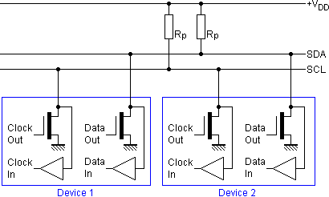

- 트랜지스터를 증폭이 아니라 **순수 스위치**로만 사용 — 이 구조를 **오픈 드레인**(open-drain)이라 함

| MOSFET   | BJT 대응  | 그림 위치 | 연결 대상                        |
| -------- | --------- | --------- | -------------------------------- |
| `Gate`   | Base      | 왼쪽      | Clock Out / Data Out — 제어 입구 |
| `Drain`  | Collector | 위쪽      | `SCL` / `SDA` 버스 라인          |
| `Source` | Emitter   | 아래쪽    | 접지(GND)                        |

---

## GPIO 대체 기능 - I2C 오픈 드레인 동작 (Open-Drain Operation)

- 트랜지스터는 라인을 **LOW로 끌어내리기만** 하고, HIGH는 풀업 저항이 담당

| 게이트 전압 | 내부 통로          | 버스 라인                        | 논리        |
| ----------- | ------------------ | -------------------------------- | ----------- |
| Low (OFF)   | 끊김 — 스위치 열림 | 풀업 저항 $R_p$ 가 전원으로 당김 | **HIGH(1)** |
| High (ON)   | 연결 — 스위치 닫힘 | 접지(GND)로 직접 통함            | **LOW(0)**  |

### 왜 오픈 드레인을 쓰는가

- 어느 장치도 라인을 HIGH로 **밀지 않고**, 끌어내리기만 가능
- 여러 장치가 같은 선에 동시에 붙어도 **전원 단락**(short) 사고가 없음
- 한 장치라도 LOW로 당기면 라인 전체가 LOW — ACK와 버스 중재가 이 성질을 이용

---

## GPIO 대체 기능 - I2C 설정과 확인 (Setup and Check)

| 항목      | Raspberry Pi 4                             |
| --------- | ------------------------------------------ |
| 핀        | `SDA` GPIO2(3번), `SCL` GPIO3(5번)         |
| 속도      | 표준 100kHz, 고속 400kHz                   |
| 풀업 저항 | 보드에 내장 — 외부 저항 불필요             |
| 활성화    | `raspi-config` -> Interface Options -> I2C |

```bash
sudo raspi-config  # Enable I2C interface in system configuration
i2cdetect -y 1     # Scan and list active slave device addresses on I2C bus 1
```

- `i2cdetect` 가 출력하는 숫자가 곧 장치 **주소**
- 아무 주소도 보이지 않으면 코드가 아니라 **배선과 전원**부터 확인

---

## GPIO 대체 기능 - SPI (Serial Peripheral Interface)

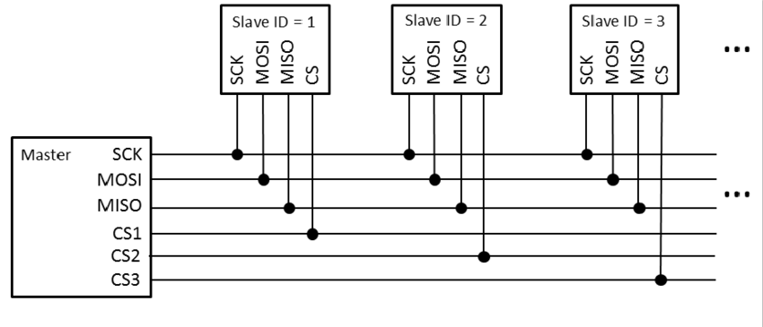

- 4선 전이중(Full-Duplex) 동기식 버스 — 보내는 동안 동시에 받음
- 주소가 아니라 **CE**(Chip Enable, 표준 용어로는 SS - Slave Select, CS - Chip Select) 선으로 대상 장치를 선택
- 장치를 늘리려면 CE 선이 하나씩 더 필요하나 I2C보다 빠름

| 신호          | 방향         | Raspberry Pi 4 핀         |
| ------------- | ------------ | ------------------------- |
| `MOSI`        | 파이 -> 장치 | GPIO10(19번)              |
| `MISO`        | 장치 -> 파이 | GPIO9(21번)               |
| `SCLK`        | 파이 -> 장치 | GPIO11(23번)              |
| `CE0` / `CE1` | 파이 -> 장치 | GPIO8(24번) / GPIO7(26번) |

```shell
sudo raspi-config  # Enable SPI interface in system configuration
ls /dev/spidev0.*  # List active SPI device nodes (e.g., /dev/spidev0.0, /dev/spidev0.1)
```

---

## GPIO 대체 기능 - UART (Universal Asynchronous Receiver/Transmitter)

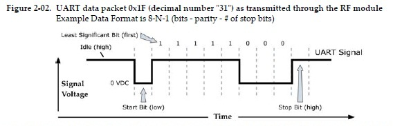

- 클럭선이 없는 **비동기** 전이중 직렬 통신 — 양쪽이 같은 **보율**(baud rate)로 약속
- `TXD` 와 `RXD` 를 서로 **교차 연결**하며, 1:1 통신만 가능
  - Raspberry Pi 4 핀: `TXD` GPIO14(8번), `RXD` GPIO15(10번)
- 기본 용도는 **시리얼 콘솔** — 네트워크가 없어도 부팅 로그 확인 가능
- **3.3V 로직** — 5V TTL이나 RS-232에 직접 연결 금지, 레벨 변환기 필요

### Raspberry Pi 4의 UART 두 가지

| 종류      | 특징                               | 기본 할당 |
| --------- | ---------------------------------- | --------- |
| PL011     | 클럭이 안정적이라 고속에 유리      | Bluetooth |
| mini UART | CPU 클럭에 연동되어 흔들릴 수 있음 | 40핀 헤더 |

- `dtoverlay=disable-bt` 로 Bluetooth를 끄면 PL011을 라즈베리 파이 GPIO 헤더로 사용 가능

---

## GPIO 대체 기능 - PWM (Pulse Width Modulation)

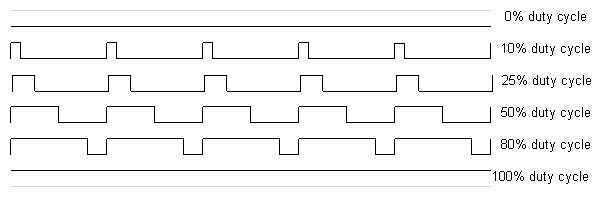

- 디지털 출력만으로 **중간 세기**를 만드는 방법
  - 주기는 고정하고, 켜져 있는 시간의 비율인 **듀티**만 조절
- 눈이나 모터가 개별 펄스를 따라가지 못할 만큼 빠르면 평균값으로 인식

| 항목            | Raspberry Pi 4                          |
| --------------- | --------------------------------------- |
| 하드웨어 PWM 핀 | GPIO12·18(PWM0), GPIO13·19(PWM1)        |
| 그 외 핀        | 소프트웨어 PWM — 스케줄러에 밀려 흔들림 |
| 대표 용도       | LED 밝기, 모터 속도, 서보 각도          |

- 서보는 보통 50Hz 주기에 1~2ms 펄스폭으로 각도를 지정
- **실습 01**에서 LED 밝기 조절에 소프트웨어 PWM을 사용

---

## 전기적 주의사항 (Electrical Cautions)

- GPIO는 **3.3V 로직 레벨**을 사용하며, 5V 신호 직접 인가 시 SoC 파손 위험 발생
- 핀당 허용 전류는 최대 약 16mA, 전체 핀 합계는 약 50mA 이내로 제한
- LED 연결 시 반드시 **전류 제한 저항을 직렬로 배치**해야 함

### 저항값 계산 예

- **전원 전압($V_{\text{CC}}$):** **3.3V**(라즈베리파이 GPIO 로직 전압)
- **LED 순방향 전압($V_f$):** 약 **2.0V** _(일반 지시등용 적색·초록색 LED 구동 시 전압 강하량)_
- **목표 전류($I_f$):** 약 **4mA** _(핀당 최대 제한치 16mA 대비 SoC 안정성 확보 및 시인성 타협선)_

$$R = \frac{V_{\text{CC}} - V_f}{I_f} = \frac{3.3 - 2.0}{0.004} = 325\,\Omega \approx 330\,\Omega$$

- **330Ω 저항 선정 이유:** GPIO 과부하를 방지하고 적절한 시인성을 확보하는 최적 수치로 실습 키트에 채택됨
- 모터 등 대전류 부하 연결 시 **트랜지스터 또는 드라이버 회로**를 경유하여 구동

---

## 전원 공급 (Power Supply)

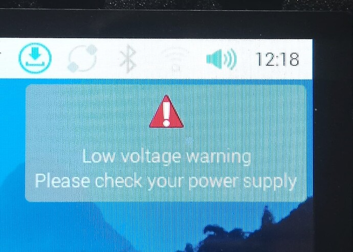

- 라즈베리파이는 **전원 공급의 안정성 및 품질에 민감함**

| 증상                               | 주요 원인               |
| ---------------------------------- | ----------------------- |
| 부팅 중 중단 또는 재부팅           | 공급 전류 부족          |
| 화면 내 경고 또는 번개 아이콘 표시 | 저전압 상태 감지        |
| USB 장치 인식 불가 또는 오작동     | 전원 공급 용량 부족     |
| SD 카드 파일 시스템 손상 반복      | 부적절한 전원 강제 차단 |

---

## 전원 공급 (Power Supply) (Cont'd)

### 권장 사항

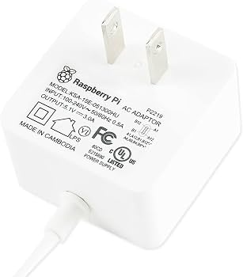

- **정격 출력 규격을 준수하는(혹은 그에 준하는) 전용 어댑터 사용 권장**
  - PC USB 포트는 전류 용량이 미흡할 수 있음
- 저전압 상태 모니터링 명령어

```bash
vcgencmd get_throttled     # 0x0 means no throttling
dmesg | grep -i voltage
```

---

## 라즈베리파이의 활용 사례 (Use Cases)

- **홈 서버**: 네트워크 파일 서버, 미디어 스트리밍, DNS 기반 광고 차단
- **IoT 게이트웨이**: 센서 데이터 수집 및 클라우드 플랫폼 전송
- **로보틱스**: 자율주행 및 이동 로봇의 상위 제어 장치
- **엣지 AI**: 실시간 카메라 영상 기반 비전 및 객체 인식 처리
- **산업용 프로토타입**: 양산 전 시스템 개념 검증(PoC)

### 본 교과목에서의 학습 목표

- 라즈베리파이를 활용하여 센서 데이터 수집 → 데이터 처리 → 웹 대시보드 구축 → 서비스 배포까지의 전 과정을 실습함

---

## 라즈베리파이 운영체제 (Raspberry Pi OS)

- 데비안(Debian) 기반의 리눅스 배포판으로, 라즈베리파이 하드웨어 환경에 최적화됨
- 구(舊) 명칭: Raspbian

### 배포판 선택

| 종류    | 주요 특징             | 권장 용도                  |
| ------- | --------------------- | -------------------------- |
| Desktop | GUI 환경 포함         | 일반 학습 및 개발 환경     |
| Lite    | CLI 전용(경량화)      | 서버 구축 및 임베디드 배포 |
| 64-bit  | `arm64` 아키텍처 지원 | **본 강의 실습 기준**      |

- 임베디드 운영 환경에서는 불필요한 요소가 제거된 **Lite 버전 사용**을 권장
  - 저장 공간 최적화, 부팅 시간 단축, 보안 공격 표면(Attack Surface) 축소 이점 제공

---

## 부팅 과정 (Boot Process)

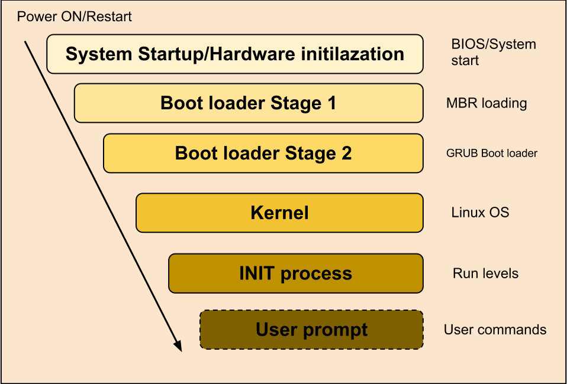

1. **SoC ROM**: 전원 인가 시 칩 내부 부트 ROM 실행
2. **부트로더**: SD 카드의 부트 파티션에서 펌웨어 적재
3. **커널 적재**: `kernel8.img` (`arm64` 커널)를 메모리에 적재
4. **디바이스 트리**: `.dtb` 파일을 통해 하드웨어 구성 정보를 커널에 전달
5. **`init` 실행**: 루트 파일 시스템 마운트 후 `systemd` 프로세스 시작
6. **서비스 실행**: 네트워크, SSH 등 주요 시스템 서비스 순차 구동

### 디바이스 트리 (Device Tree)

- 하드웨어 구성 및 주소 할당 정보를 기술하는 데이터 구조
- x86의 BIOS/ACPI와 달리 ARM 아키텍처는 디바이스 트리를 통해 하드웨어 정보를 전달함
- `config.txt` 내 `dtoverlay` 설정을 통해 주변 장치 오버레이 활성화

---

## 부팅 설정 파일 (Boot Configuration)

- 부팅 동작 관련 설정은 `/boot/firmware` 디렉터리의 텍스트 파일로 제어함

### `config.txt`

```ini
# Enable peripherals
dtparam=i2c_arm=on
dtparam=spi=on

# Add features via overlays
dtoverlay=disable-bt          # free the UART by disabling Bluetooth

# Force HDMI when no display is detected
hdmi_force_hotplug=1
```

### `cmdline.txt`

- 커널에 전달되는 **단일 행**의 부팅 파라미터 지정(루트 파티션, 시리얼 콘솔 등)
- 개행 문자(줄바꿈) 포함 시 부팅 오류가 발생하므로 수정 시 주의 필요

> **참고:** 해당 파일들은 **FAT32 파티션**에 위치하므로 타 PC에 SD 카드를 연결해 직접 수정 가능
> **참고:** 부팅 장애 발생 시 주 복구 수단으로 활용

---

## 파일시스템 구조 (Filesystem Layout)

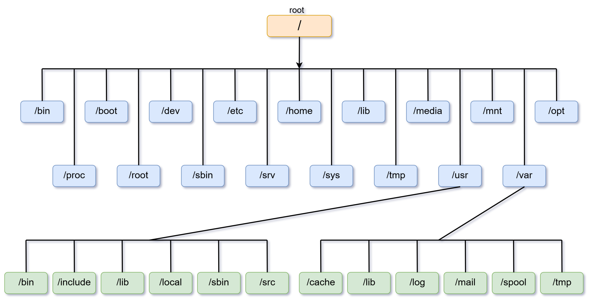

| 경로             | 주요 용도                                |
| ---------------- | ---------------------------------------- |
| `/boot/firmware` | 부트로더, 커널, `config.txt` 위치(FAT32) |
| `/`              | 루트 파일 시스템(ext4)                   |
| `/etc`           | 시스템 제어 설정 파일                    |
| `/home/<user>`   | 사용자 전용 홈 디렉터리                  |
| `/dev`           | 장치 파일(`gpiochip0`, `video0` 등)      |
| `/proc`, `/sys`  | 커널 정보를 제공하는 가상 파일 시스템    |
| `/var/log`       | 시스템 및 애플리케이션 로그 저장         |

- "모든 것은 파일이다"라는 UNIX 철학에 따라 GPIO 및 주요 장치도 `/dev` 이하 파일 형태로 접근

---

## 장치 파일과 GPIO (Device Files)

- 최신 Raspberry Pi OS는 GPIO를 **문자 디바이스(Character Device)** 형태로 노출
- 예: `/dev/gpiochip0` (GPIO 컨트롤러)
- 레거시 방식인 `/sys/class/gpio` (sysfs) 방식은 더 이상 사용되지 않을 예정(Deprecated)으로 사용 지양

### 문자 디바이스 도입 배경

| 구분      | sysfs(기존)      | 문자 디바이스(현재)        |
| --------- | ---------------- | -------------------------- |
| 접근 방식 | 경로 문자열 제어 | `ioctl` 기반 API           |
| 소유권    | 명확하지 않음    | 프로세스 단위의 라인 점유  |
| 자원 정리 | 수동 해제 필요   | 프로세스 종료 시 자동 정리 |
| 처리 성능 | 상대적으로 느림  | 우수함(고속 처리)          |

- 본 실습에서는 문자 디바이스 API를 추상화한 `libgpiod` 라이브러리를 표준으로 사용함

---

## 기본 운용 명령어 (Basic Operations)

```bash
# System information
uname -a                 # kernel version and architecture (expect aarch64)
cat /etc/os-release      # distribution details
vcgencmd measure_temp    # SoC temperature

# Package management
sudo apt update && sudo apt upgrade
sudo apt install -y clang libgpiod-dev gpiod

# GPIO inspection
gpiodetect               # list controllers
gpioinfo -c gpiochip0    # per-line state and owning process

# Service management
systemctl status ssh
sudo systemctl enable --now ssh
```

---

## 안전한 종료와 SD 카드 (Shutdown and SD Card)

- 전원 무단 차단 시 파일 시스템 손상 및 데이터 손실 위험 발생

```bash
sudo shutdown -h now     # Safely stop processes, unmount FS, and power off
sudo reboot              # Safely stop processes, unmount FS, and restart
```

### SD 카드 수명 관리

- SD 카드는 플래시 메모리 특성상 쓰기 횟수 제한이 존재하므로 과도한 로그 기록 시 수명 단축
- 상용 제품 구현 시 고려사항:
  - 로그 기록 위치를 램 기반 파일 시스템(`tmpfs`)으로 전환
  - 루트 파일 시스템을 읽기 전용(Read-Only)으로 마운트
  - 주요 데이터는 외부 저장 매체 또는 원격 서버로 전송 관리

---

## 서비스 관리 (systemd)

- 리눅스 시스템 서비스는 `systemd`가 관장하며, 임베디드 소프트웨어 배포의 핵심 수단임

```bash
systemctl status ssh             # show status
sudo systemctl start ssh         # start now
sudo systemctl enable ssh        # start automatically on boot
sudo systemctl enable --now ssh  # start and enable in one step

journalctl -u ssh -f                    # follow the log
journalctl -u ssh --since "10 min ago"  # time ranges
```

### systemd 도입의 주요 이점

- 개발한 애플리케이션을 서비스로 등록 시 제공되는 기능:
- 시스템 부팅 시 자동 실행 설정
- 프로세스 비정상 종료 시 자동 재시작
- 통합 로그 관리 시스템(`journalctl`)을 통한 로깅 일원화

---

## 초기 설정 (Initial Setup)

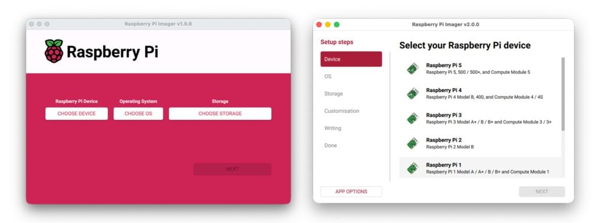

- OS 이미지는 공식 툴 [**Raspberry Pi Imager**](https://www.raspberrypi.com/software/)로 microSD 카드에 기록

### Raspberry Pi Imager로 OS 설치

1. PC에 Raspberry Pi Imager 설치 후 실행
2. `Raspberry Pi Device`에서 `Raspberry Pi 4` 선택
3. `Operating System`에서 `Raspberry Pi OS (other)` -> `Raspberry Pi OS Lite (64-bit)` 선택
4. `Storage`에서 대상 microSD 카드 선택
5. 사용자 설정에서 호스트명, 사용자 이름·비밀번호, Wi-Fi 국가·SSID·비밀번호, SSH 활성화 지정
6. 설정을 확인하고 microSD 카드에 OS 이미지 기록
7. 기록 완료 후 카드를 삽입하고 USB-C 전원과 네트워크를 연결한 뒤 부팅

- GUI가 필요하면 `Raspberry Pi OS (64-bit)` 선택
- 두 경우 모두 **64-bit**를 선택해야 `aarch64` 환경이 됨

---

## 초기 설정 (Initial Setup) (Cont'd - 1)

### 설치 결과 확인

```bash
uname -a
getconf LONG_BIT     # 64
cat /etc/os-release  # Debian GNU/Linux 13 (trixie), ...
```

- `uname -a`에 `aarch64`, `getconf LONG_BIT`가 `64`면 64-bit OS 정상 설치
- `hostnamectl`로 호스트명과 운영체제 정보를 함께 확인 가능

---

## 초기 설정 (Initial Setup) (Cont'd - 2)

### 헤드리스 (Headless) 운용

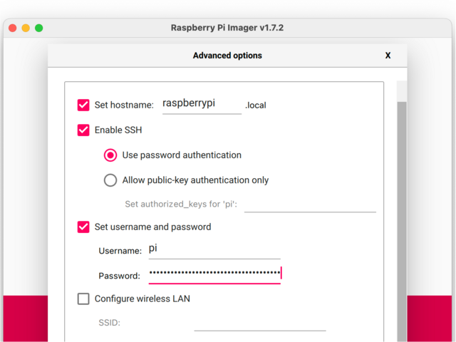

- 디스플레이 및 입력 장치 없이 네트워크를 통해 원격 제어하는 운용 방식
- 대부분의 임베디드 운영 환경에서 표준으로 채택됨

```bash
ssh <user>@raspberrypi.local       # connect by mDNS name
ssh <user>@192.168.0.10            # connect by IPv4 address
ssh -p <port> <user>@<host>        # when the port has been changed
exit                               # leave the remote shell
```

- 첫 접속 시 호스트 키 확인 메시지가 나오면 대상 장치를 확인한 뒤 `yes` 입력
- 접속되지 않으면 Raspberry Pi에서 `systemctl status ssh`와 `ip addr` 먼저 확인
- 공개 네트워크에서는 비밀번호 대신 SSH 키 인증 사용, 기본 계정·비밀번호 사용 금지

---

## 네트워크 구성 (Network Configuration)

- 최신 Raspberry Pi OS는 **NetworkManager**를 통해 네트워크 제어 수행

```bash
# Scan for and join a wireless network
nmcli device wifi list
sudo nmcli device wifi connect "<SSID>" password "<PASSWORD>"

# Check connection state
nmcli connection show
ip addr show wlan0

# Configure a static IP
# Note: Replace <NAME> with the Connection Profile name
# (NAME column in 'nmcli connection show')
sudo nmcli connection modify "<NAME>" \
  ipv4.addresses 192.168.0.10/24 \
  ipv4.gateway 192.168.0.1 \
  ipv4.dns "192.168.0.1 8.8.8.8" \
  ipv4.method manual
sudo nmcli connection down "<NAME>"
sudo nmcli connection up "<NAME>"

# Verify address, route and DNS
ip -4 addr show wlan0
ip route
resolvectl status wlan0
```

---

## 네트워크 구성 (Network Configuration) (Cont'd)

### 무선랜 고정 IP 설정 예

```bash
# 1. Find the Wi-Fi connection profile name
nmcli connection show

# 2. Give the wlan0 profile a static address
sudo nmcli connection modify "Campus Wi-Fi" \
  ipv4.method manual \
  ipv4.addresses 192.168.0.42/24 \
  ipv4.gateway 192.168.0.1 \
  ipv4.dns "192.168.0.1 8.8.8.8"

# 3. Apply the change
sudo nmcli connection down "Campus Wi-Fi"
sudo nmcli connection up "Campus Wi-Fi"
```

- `192.168.0.42`는 공유기 DHCP 범위와 겹치지 않는 주소로 선택
- IP가 변동되는 실습 환경에서는 **고정 IP**, 공유기의 **DHCP 예약**, mDNS(`raspberrypi.local`) 중 하나를 선택

```bash
sudo nmcli connection modify "Campus Wi-Fi" \
  ipv4.method auto \
  ipv4.addresses "" \
  ipv4.gateway "" \
  ipv4.dns ""
sudo nmcli connection down "Campus Wi-Fi"
sudo nmcli connection up "Campus Wi-Fi"
```

---

## 블루투스 (Bluetooth)

### 블루투스 규격의 진화 (Classic vs BLE)

- Bluetooth Classic(1.0~3.0): 대용량 데이터 및 고음질 오디오 스트리밍에 최적화
  - 상시 연결, 높은 전력 소모
- **BLE(Bluetooth Low Energy, 4.0 이상)**: 소량 센서 데이터의 주기적 전송 및 저전력 동작에 최적화
  - 동전 배터리로 수개월~수년 구동

### 라즈베리파이 무선 칩셋 특성 (Dual Mode)

- 라즈베리파이는 Wi-Fi와 블루투스(Classic + BLE) 제어를 단일 칩셋에서 처리함
- 동시 사용 시 동일 2.4GHz 대역 간섭으로 인해 무선 성능 저하가 발생할 수 있음
- 시분할(TDM) 제어로 Classic 오디오 연결 상태에서도 BLE 센서 데이터 수집 가능


---

## 블루투스 (Bluetooth) (Cont'd)

### 무선 통신 규격 비교

| 규격      | 통신 거리 | 전력 소모 | 주요 용도                        |
| --------- | --------- | --------- | -------------------------------- |
| Wi-Fi     | 중거리    | 높음      | 대용량 데이터 전송, 인터넷 연동  |
| Bluetooth | 단거리    | 중간      | 근거리 대역 기기 연동            |
| BLE       | 단거리    | 매우 낮음 | 소형 센서 노드, 배터리 구동 기기 |

### 리눅스 환경의 블루투스 제어 (`bluetoothctl`)

- 라즈베리파이에서 무선 기기 검색, 페어링, 연결을 통합 관리하는 CLI 도구

```bash
bluetoothctl
# [bluetooth]# power on
# [bluetooth]# scan on
# [bluetooth]# pair <MAC>
# [bluetooth]# connect <MAC>
```

---

## 원격 개발 환경 (Remote Development)

- 라즈베리파이 자체 편집 대신 **호스트 PC에서 개발 후 타깃 보드 원격 실행** 방식 권장

### 방식 1: SSH 기반 원격 개발 (Remote Development)

- VS Code의 Remote-SSH 확장을 통한 타깃 보드 내 소스 코드 직접 편집
- 소스 편집은 호스트 PC에서, 빌드 및 실행은 타깃 보드에서 수행

### 방식 2: 크로스 컴파일 (Cross Compilation)

- 호스트 PC에서 타깃용 아키텍처로 빌드를 완료한 후 Executable 바이너리 전송

```bash
scp build/app <user>@<host>:/home/<user>/
ssh <user>@<host>
```

- 대규모 프로젝트일수록 호스트 자원을 활용한 크로스 컴파일의 효율성 증가

---

## 개발 환경 점검 (Environment Check)

```bash
# Compilers
clang++ --version        # confirm C++14 support

# GPIO library
pkg-config --modversion libgpiod
gpiodetect

# Camera and audio
v4l2-ctl --list-devices  # confirm the webcam is detected
arecord -l               # confirm the microphone is detected
```

### 권한 설정

```bash
# Grant GPIO, video and audio access (takes effect after re-login)
sudo usermod -aG gpio,video,audio "$USER"
```

- 장치 접근 권한 미부여 시 I/O 에러가 발생하므로, 환경 구축 후 우선 점검 필요
