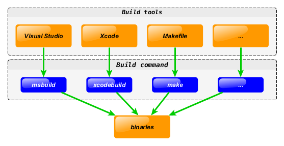
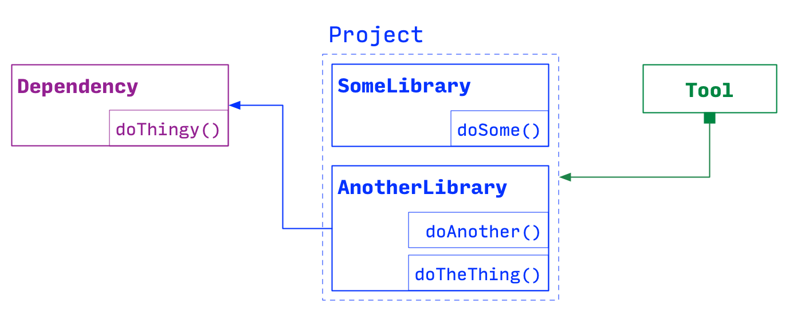
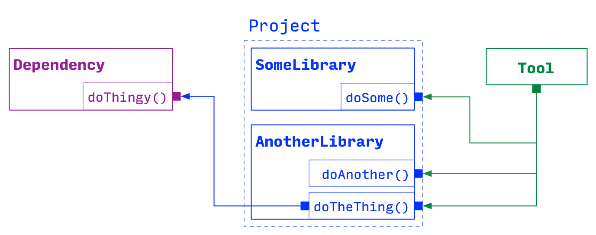
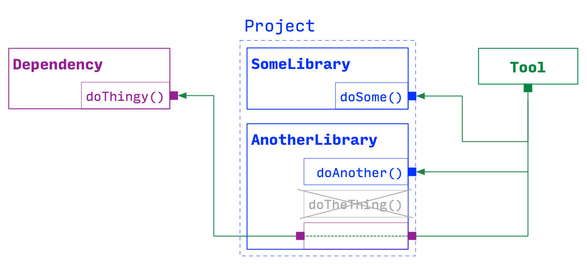
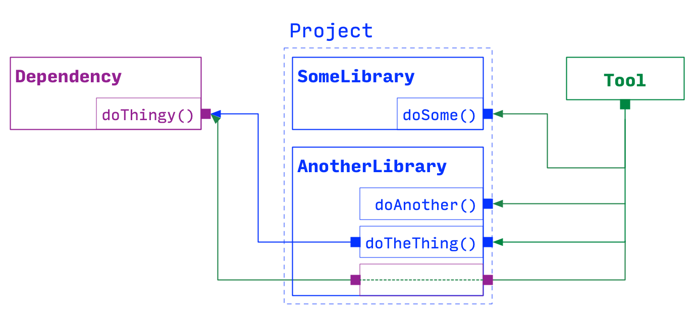
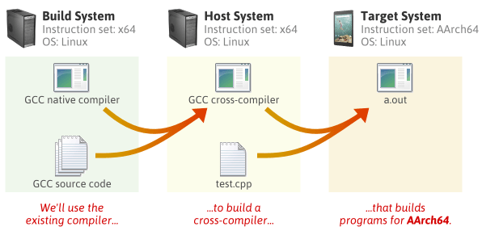

<!-- _class: lead -->
# 마이크로임베디드프로그래밍

## 빌드 시스템과 크로스 컴파일

### [munseong.jeong@daejin.ac.kr](mailto:munseong.jeong@daejin.ac.kr)

---

## 컴파일 과정 (Compilation Pipeline)


| 단계 | 명령 | 산출물 |
| --- | --- | --- |
| 전처리 | `g++ -E` | `.i` — 헤더가 전개된 소스 |
| 컴파일 | `g++ -S` | `.s` — 어셈블리 |
| 어셈블 | `g++ -c` | `.o` — 오브젝트 파일 |
| 링크 | `g++` | 실행 파일 또는 라이브러리 |

- **오류 발생 단계의 정확한 파악**: 문제 해결의 핵심 요소:
  - 헤더 탐색 실패 → 전처리 단계
  - 문법 오류 → 컴파일 단계
  - `undefined reference` → 링크 단계

---

## 빌드 시스템이 필요한 이유 (Why a Build System)

- 소스 파일이 하나인 경우 단일 명령어로 충분함

```bash
g++ -std=c++14 main.cc -o app
```

- 소스 파일 수가 증가할 때 발생하는 관리 문제:
  - 재컴파일 대상 파일의 판별 필요
  - 컴파일 순서 및 의존 관계 관리 필요
  - 타깃 플랫폼별 컴파일러 및 빌드 옵션 다변화
  - 외부 라이브러리 탐색 및 연결 필요

> 빌드 시스템은 **무엇을, 언제, 어떤 옵션으로 컴파일할지**를 자동으로 결정함

---

## CMake란 (What CMake Is)



- **CMake는 독립된 빌드 시스템이 아닌 빌드 시스템 생성기**(Build-System Generator)임
- `CMakeLists.txt`를 참조하여 각 플랫폼의 네이티브 빌드 파일(e.g., Makefile, Ninja 등)을 생성함

### 2단계 워크플로 (Two-Phase Workflow)

1. **Configure**(`cmake -B build`): 옵션을 평가하고 컴파일러를 탐지하여 빌드 파일을 생성함(컴파일은 수행하지 않음)
2. **Build**(`cmake --build build`): 생성된 빌드 도구를 실행하여 실제 컴파일을 수행함

> 빌드 옵션 변경 시 반드시 Configure 단계를 재수행해야 함

---

## 타깃 중심 설계 (Target-Centric Design)

- 현대 CMake의 핵심 개념은 **타깃**(Target)임(실행 파일, 라이브러리 등 명명된 빌드 산출물)
- 포함 경로, 컴파일 플래그, 링크 대상은 전역 변수가 아닌 **타깃 단위로 부착**됨

```cmake
add_library(sensors SHARED src/dht11.cc src/hcsr04.cc)

target_include_directories(sensors
  PUBLIC  include/      # visible to anything linking sensors
  PRIVATE src/          # visible to sensors itself only
)

target_compile_features(sensors PUBLIC cxx_std_14)
target_link_libraries(sensors PRIVATE gpiod)
```

- `PUBLIC` / `PRIVATE` / `INTERFACE` 스코프를 통해 **전이 전파**(Transitive Propagation)를 제어함

---

## 전이 전파 (Transitive Propagation)

### 의존성 체인 (Dependency Chain)

- **다단계 의존 구조**: Consumer A → Target B → Target C
- **전파 정보**: 바이너리 링크 및 사용 요구사항(Include 경로, 컴파일 정의, C++ 표준 등)
- **Scope의 역할**: Target B가 Target C의 속성을 Consumer A에게 전파할지 여부를 결정함

### Scope 핵심 요약

| Scope | 자체 빌드 | 상위 전파 | 주요 사용 목적 |
| --- | --- | --- | --- |
| **`PRIVATE`** | **O** | **X** | 내부 구현 은닉(캡슐화) |
| **`INTERFACE`** | **X** | **O** | Header-only 라이브러리 전파 |
| **`PUBLIC`** | **O** | **O** | 공개 인터페이스 규격 유지 |

#### 용어 정의 (Target B 기준)

- **자체 빌드**: Target B 소스 코드 컴파일 시 Target C의 속성(헤더, 매크로 등)을 적용함
- **상위 전파**: Target B를 사용하는 상위 소비자 Consumer A에게 Target C의 속성을 전달함

---

## 전이 전파 (Transitive Propagation) (Cont'd - 1)

### 상황 제시 (Dependency Scenario)



- **시스템 구성**
  - **`Tool`**: 최상위 응용 프로그램(Consumer)
  - **`Project`**: 라이브러리 모음(`AnotherLibrary`, `SomeLibrary`)
  - **`Dependency`**: 하위 외부 라이브러리(`doThingy()` 제공)

- **의존성 구조**
  - **직접 의존성**: `Tool` → `Project`, `AnotherLibrary` → `Dependency`
  - **전이 의존성**: `Tool` → `Dependency` (`AnotherLibrary`를 거친 2단계 다단계 구조)

> `AnotherLibrary`의 스코프 설정에 따라 `Tool`의 `Dependency` 접근 권한이 결정됨

---

## 전이 전파 (Transitive Propagation) (Cont'd - 2)

### `PRIVATE` 스코프



- **자체 사용**: `AnotherLibrary` 내부(`doTheThing()`)에서만 `Dependency`의 `doThingy()`를 사용함
- **상위 차단 및 캡슐화**: `Tool`의 `Dependency` 직접 접근을 차단하여 내부 구현을 은닉함
- **헤더 분리**: `Dependency` 헤더가 `AnotherLibrary` 소스 코드(`.cc`)에만 포함될 때 선택함
- **빌드 최적화**: `Dependency` 변경 시에도 `Tool`의 재컴파일을 방지함

```cmake
add_library(AnotherLibrary AnotherLibrary.cc)
target_link_libraries(AnotherLibrary PRIVATE Dependency)

add_executable(Tool main.cc)
target_link_libraries(Tool PRIVATE AnotherLibrary SomeLibrary)
```

---

## 전이 전파 (Transitive Propagation) (Cont'd - 3)

### `INTERFACE` 스코프



- **자체 미사용**: `AnotherLibrary` 자체 빌드 시 `Dependency`를 직접 사용하지 않음
- **상위 전파**: `Tool`이 `AnotherLibrary`를 링크할 때 `Dependency`(`doThingy()`)가 직접 연결됨
- **전달 전용**: 자신은 컴파일하지 않으며, 상위 대상에게만 의존성 속성을 전달함
- **주요 활용**: Header-only 라이브러리 연결 또는 공통 컴파일 플래그·경로 전달 타깃에 활용함

```cmake
add_library(AnotherLibrary INTERFACE)
target_link_libraries(AnotherLibrary INTERFACE Dependency)

add_executable(Tool main.cc)
target_link_libraries(Tool PRIVATE AnotherLibrary SomeLibrary)
```

---

## 전이 전파 (Transitive Propagation) (Cont'd - 4)

### `PUBLIC` 스코프



- **자체 사용 및 전파**: `AnotherLibrary` 내부 사용과 동시에 `Tool`에도 접근 권한을 전파함
- **공개 노출**: `AnotherLibrary`의 공개 헤더(`.h`)에 `Dependency` 타입이 포함될 때 선택함
- **이중 접근**: `Tool`에서 `doTheThing()` 호출 및 `doThingy()` 직접 호출이 모두 가능함
- **주의사항**: 불필요한 남용 시 의존성 결합도가 증가하고 전체 빌드 속도가 저하됨

```cmake
add_library(AnotherLibrary AnotherLibrary.cc)
target_link_libraries(AnotherLibrary PUBLIC Dependency)

add_executable(Tool main.cc)
target_link_libraries(Tool PRIVATE AnotherLibrary SomeLibrary)
```

---

## 전이 전파 (Transitive Propagation) (Cont'd - 5)

### Scope 선택 가이드

- **`PRIVATE` 선택 기준**:
  - 의존성 헤더가 소스 파일(`.cc`)에만 포함될 때
  - 외부 노출 차단을 통한 캡슐화 유지 및 재컴파일 범위 최소화 필요 시

- **`PUBLIC` 선택 기준**:
  - 의존성 타입이 공개 헤더(`.h`)의 함수 전달인자, 반환 타입, 멤버 변수로 노출될 때
  - 상위 소비자가 해당 타깃의 헤더를 직접 참조해야 빌드가 가능할 때

- **`INTERFACE` 선택 기준**:
  - 빌드할 소스 파일(`.cc`)이 없는 Header-only 라이브러리의 경우
  - 공통 컴파일 플래그 및 매크로 정의만 전달하는 설정용 타깃의 경우

> 기본값으로 **`PRIVATE`**을 우선 고려함
> **`PUBLIC`** 남용은 불필요한 전이 의존성을 유발하여 빌드 속도 저하 및 결합도 증가를 초래함

- 출처: <https://decovar.dev/blog/2023/07/22/cmake-target-link-libraries-scopes/>

---

## 최소 예제 (Minimal Example)

```cmake
cmake_minimum_required(VERSION 3.20)
project(mep_lab LANGUAGES CXX)

set(CMAKE_CXX_STANDARD 14)
set(CMAKE_CXX_STANDARD_REQUIRED ON)

find_package(PkgConfig REQUIRED)
pkg_check_modules(GPIOD REQUIRED libgpiod)

add_executable(blink src/blink.cc)
target_include_directories(blink PRIVATE ${GPIOD_INCLUDE_DIRS})
target_link_libraries(blink PRIVATE ${GPIOD_LIBRARIES})
```

```bash
cmake -B build -DCMAKE_BUILD_TYPE=Release
cmake --build build -j
./build/blink
```

---

## 의존성과 증분 빌드 (Incremental Build)

- 빌드 시스템의 핵심 역할: **변경사항이 발생한 파일만 선별적으로 재컴파일**

```text
main.cc   -> main.o   --+
                        +--> app
sensor.cc -> sensor.o --+
     ^
sensor.hpp (if sensor.hpp changes, you must recreate sensor.o)
```

- CMake는 컴파일러를 통해 헤더 의존 관계를 자동으로 추적함
- 헤더 파일 수정 시 해당 헤더를 포함하는 모든 파일이 재컴파일됨

### 병렬 빌드 (Parallel Build)

```bash
cmake --build build -j        # compile in parallel across CPU cores
```

- 상호 의존성이 없는 파일은 동시에 컴파일 가능함
- 라즈베리파이 등 코어 자원이 제한된 장비에서는 효과가 제한적임(크로스 컴파일의 주요 필요성)

---

## 빌드 옵션 (Build Options)

- Configure 단계에서 `-D<OPTION>=<VALUE>` 형태로 지정함

```cmake
option(MEP_SIMD "Enable SIMD kernels" ON)
option(BUILD_TESTS "Build unit tests" ON)

if(MEP_SIMD)
  target_compile_definitions(sensors PRIVATE MEP_SIMD=1)
endif()
```

```bash
cmake -B build -DMEP_SIMD=OFF -DBUILD_TESTS=OFF
```

---

## 빌드 타입 (Build Types)

| 타입 | 기본 플래그 | 용도 |
| --- | --- | --- |
| `Debug` | `-g -O0` | 디버깅 |
| `Release` | `-O3 -DNDEBUG` | 배포 및 상용화 |
| `RelWithDebInfo` | `-O2 -g` | 배포본 디버깅 |
| `MinSizeRel` | `-Os -DNDEBUG` | 바이너리 크기 최적화 |

```bash
cmake -B build -DCMAKE_BUILD_TYPE=Release
```

- 빌드 타입을 미지정할 경우 최적화 플래그가 **전혀 적용되지 않음**
- 성능 측정 시 반드시 `Release` 모드로 빌드되었는지 확인해야 함

---

## 자주 발생하는 빌드 오류 (Common Errors)

| 오류 메시지 | 주요 원인 | 해결 방안 |
| --- | --- | --- |
| `No such file or directory` (헤더) | 포함 경로 누락 | `target_include_directories` 설정 추가 |
| `undefined reference to ...` | 링크 대상 누락 | `target_link_libraries` 설정 추가 |
| `undefined reference to main` | 진입점 없는 소스를 실행 파일로 빌드 | 타깃 유형 재확인 |
| `Could NOT find X` | 패키지 미설치 또는 경로 지정 오류 | 개발 패키지 설치 및 `PKG_CONFIG_PATH` 확인 |
| 옵션 변경 미반영 | Configure 재수행 미실시 | `cmake -B build` 재실행 |

### 문제 해결 절차

1. **최상단 첫 번째 오류 메시지 우선 확인**(이후 오류는 연쇄 발생 결과일 가능성이 높음)
2. 컴파일 단계와 링크 단계의 오류 구별
3. `cmake --build build -v` 명령으로 실제 실행된 상세 명령어 확인

---

## 아웃오브소스 빌드 (Out-of-Source Build)

- 빌드 산출물을 소스 디렉터리와 명확히 분리하여 생성하는 방식

```text
project/
├── CMakeLists.txt
├── src/
├── include/
└── build/  <- keep your project's generated artifacts separate from your source files
```

### 주요 장점

- 소스 트리의 오염을 방지하여 `git status` 상태를 깨끗하게 유지함
- 다양한 빌드 설정을 독립적으로 동시에 유지 가능함(`build-debug`, `build-release`, `build-pi`)
- 디렉터리 삭제만으로 빌드 환경 완전 초기화 가능함

```bash
rm -rf build && cmake -B build && cmake --build build
```

---

## 호스트와 타깃 (Host and Target)



- **호스트**(Host): 컴파일러를 실행하는 시스템(고성능 x86_64 워크스테이션, CI 서버 등)
- **타깃**(Target): 생성된 바이너리를 실제로 실행하는 시스템(라즈베리파이 등 arm64 환경)

> **크로스 컴파일**: 호스트 환경에서 실행되되, 타깃 아키텍처용 기계어 바이너리를 생성하는 작업

### 타깃 장비(라즈베리파이) 직접 빌드의 한계점

- 직접 빌드도 가능하나, 실무 환경에서는 다음 이유로 크로스 컴파일을 권장함

1. **성능 및 시간**: 대규모 C++ 빌드 시 워크스테이션(수 분) 대비 타깃 장비(수 시간) 소요
2. **CI/CD 환경**: GitHub Actions 러너(x86_64) 등 물리적 타깃 장비 연동 제한
3. **재현성 확보**: 도커 기반 빌드 환경 구축을 통한 일관된 결과 보장

---

## 툴체인과 Sysroot (Toolchain and Sysroot)

- **툴체인**(Toolchain): 호스트에서 동작하며 타깃용 코드를 생성하는 도구 모음
- 컴파일러, 어셈블러, 링커, 표준 라이브러리로 구성됨
- 데비안 계열 `arm64` 크로스 컴파일러 패키지 예시: `g++-aarch64-linux-gnu`

```bash
aarch64-linux-gnu-g++ -std=c++14 hello.cc -o hello_pi
```

- **Sysroot**: 타깃의 루트 파일시스템 구조를 모방한 디렉터리 환경

```text
sysroot/
├── usr/
│   ├── include/                  # target headers
│   └── lib/aarch64-linux-gnu/    # target shared libraries
└── lib/
    └── aarch64-linux-gnu/
```

> `sysroot` 미설정 시 링커가 호스트(x86_64) 라이브러리를 참조하여 링크 오류 발생함

---

## 툴체인 파일 (CMake Toolchain File)

- CMake는 **툴체인 파일**을 통해 크로스 컴파일 설정을 주입받음

```cmake
# cmake/toolchains/aarch64-linux-gnu.cmake
set(CMAKE_SYSTEM_NAME      Linux)
set(CMAKE_SYSTEM_PROCESSOR aarch64)

set(CMAKE_C_COMPILER   aarch64-linux-gnu-gcc)
set(CMAKE_CXX_COMPILER aarch64-linux-gnu-g++)

set(CMAKE_SYSROOT /opt/sysroots/aarch64-linux-gnu)

set(CMAKE_FIND_ROOT_PATH_MODE_PROGRAM NEVER)
set(CMAKE_FIND_ROOT_PATH_MODE_LIBRARY ONLY)
set(CMAKE_FIND_ROOT_PATH_MODE_INCLUDE ONLY)
```

- `FIND_ROOT_PATH_MODE_*` 옵션은 `find_*` 계열 탐색 명령이 호스트가 아닌 `sysroot` 내부만 탐색하도록 강제함

---

## 크로스 빌드 수행 (Running a Cross Build)

```bash
cmake -B build-pi \
  -DCMAKE_TOOLCHAIN_FILE=cmake/toolchains/aarch64-linux-gnu.cmake \
  -DCMAKE_BUILD_TYPE=Release

cmake --build build-pi -j
```

### 빌드 결과 검증

```bash
file build-pi/app
# ELF 64-bit LSB executable, ARM aarch64 ...

readelf -h build-pi/app | grep Machine
# Machine: AArch64
```

> 크로스 컴파일 시 주의사항: **생성된 산출물의 아키텍처 검증 필수**
> 호스트용 바이너리가 생성되어도 링크 단계가 성공할 수 있으므로, 타깃 런타임 이전 검증이 필요함

---

## 도커 기반 크로스 빌드 (Docker buildx)

- 개발자별 툴체인 및 `sysroot` 개별 관리는 유지보수 및 재현성 측면에서 불리함
- **도커**(Docker)를 통해 빌드 환경 전체를 이미지화하여 환경 재현성을 확보함

```dockerfile
# syntax=docker/dockerfile:1
FROM --platform=linux/arm64 debian:bookworm-slim AS builder

RUN apt-get update && apt-get install -y --no-install-recommends \
      cmake g++ git libgpiod-dev \
    && rm -rf /var/lib/apt/lists/*

WORKDIR /src
COPY . .
RUN cmake -B build -DCMAKE_BUILD_TYPE=Release \
    && cmake --build build -j
```

```bash
docker buildx build --platform linux/arm64 --target builder -t mep:latest --load .
```

- `docker buildx`는 QEMU 에뮬레이션 또는 네이티브 러너를 활용하여 다중 아키텍처 빌드를 지원함
