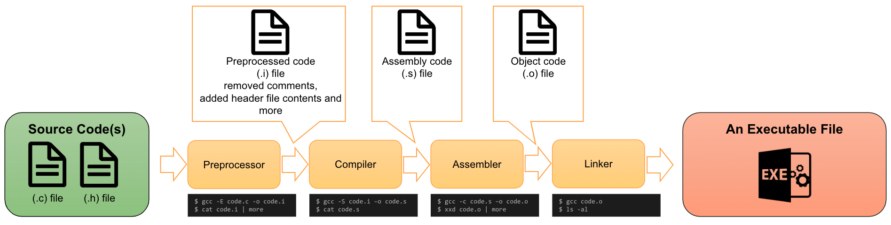
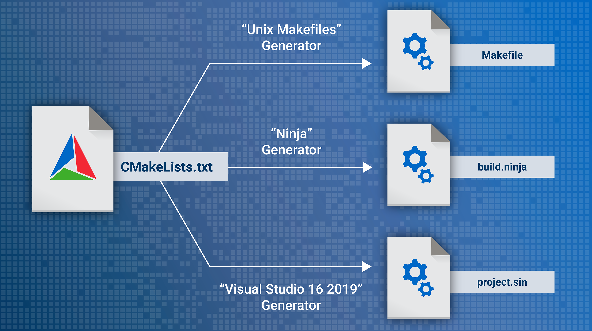
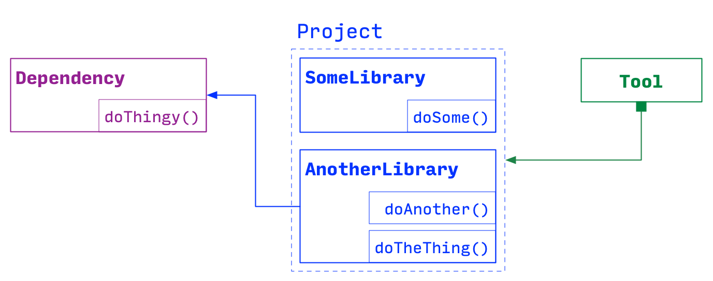
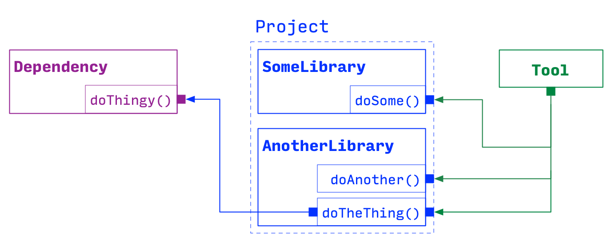
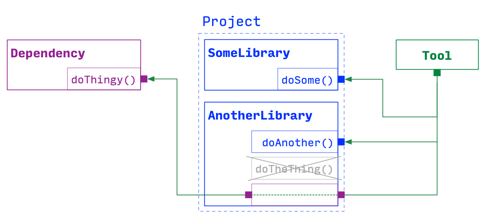
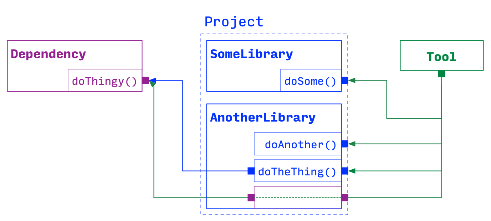
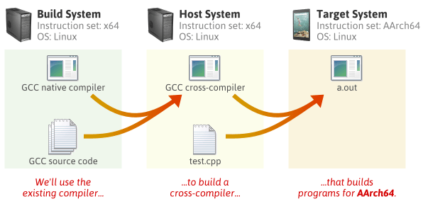

<!-- _class: lead -->

# 마이크로임베디드프로그래밍

## 빌드 시스템과 크로스 컴파일

### [munseong.jeong@daejin.ac.kr](mailto:munseong.jeong@daejin.ac.kr)

---

## 컴파일 과정 (Compilation Pipeline)



| 단계   | 명령         | 산출물                    |
| ------ | ------------ | ------------------------- |
| 전처리 | `clang++ -E` | `.i` — 헤더가 전개된 소스 |
| 컴파일 | `clang++ -S` | `.s` — 어셈블리           |
| 어셈블 | `clang++ -c` | `.o` — 오브젝트 파일      |
| 링크   | `clang++`    | 실행 파일 또는 라이브러리 |

- **오류 발생 단계의 정확한 파악**: 문제 해결의 핵심 요소:
  - 헤더 탐색 실패 → 전처리 단계
  - 문법 오류 → 컴파일 단계
  - `undefined reference` → 링크 단계

---

## 빌드 시스템이 필요한 이유 (Why a Build System)

- 소스 파일이 하나인 경우 단일 명령어로 빌드 가능

```bash
clang++ -std=c++14 main.cc -o app
```

- 소스 파일 수가 증가할 때 발생하는 관리 문제:
  - 재컴파일 대상 파일의 판별 필요
  - 컴파일 순서 및 의존 관계 관리 필요
  - 타깃 플랫폼별 컴파일러 및 빌드 옵션 다변화
  - 외부 라이브러리 탐색 및 연결 필요

> 빌드 시스템은 **무엇을, 언제, 어떤 옵션으로 컴파일할지**를 자동으로 결정함

---

## CMake란 (What CMake Is)



- **CMake는 독립된 빌드 시스템이 아닌 빌드 시스템 생성기**(Build-System Generator)
- `CMakeLists.txt`를 참조하여 플랫폼별 네이티브 빌드 파일(예: Makefile, Ninja) 생성

### 2단계 워크플로 (Two-Phase Workflow)

1. **Configure**(`cmake -B build`): 옵션 평가, 컴파일러 탐지, 빌드 파일 생성
2. **Build**(`cmake --build build`): 생성된 빌드 도구 실행 및 실제 컴파일

> 빌드 옵션 변경 시 Configure 단계 재수행

---

## 타깃 중심 설계 (Target-Centric Design)

- 현대 CMake의 핵심 개념은 **타깃**(Target)
  - 실행 파일, 라이브러리 등 명명된 빌드 산출물
- 포함 경로, 컴파일 플래그, 링크 대상은 **타깃 단위로 부착**

```cmake
add_library(sensors SHARED src/dht11.cc src/hcsr04.cc)

target_include_directories(sensors
  PUBLIC  include/      # visible to anything linking sensors
  PRIVATE src/          # visible to sensors itself only
)

target_compile_features(sensors PUBLIC cxx_std_14)
target_link_libraries(sensors PRIVATE gpiod)
```

- `PUBLIC` / `PRIVATE` / `INTERFACE` 스코프로 **전이 전파**(Transitive Propagation) 제어

---

## 전이 전파 (Transitive Propagation)

### 의존성 체인 (Dependency Chain)

- **다단계 의존 구조**: Consumer A → Target B → Target C
- **전파 정보**: 바이너리 링크 및 사용 요구사항(Include 경로, 컴파일 정의, C++ 표준 등)
- **Scope의 역할**: Target B가 Target C의 속성을 Consumer A에게 전파할지 여부를 결정함

### Scope 핵심 요약

| Scope           | 자체 빌드 | 상위 전파 | 주요 사용 목적              |
| --------------- | --------- | --------- | --------------------------- |
| **`PRIVATE`**   | **O**     | **X**     | 내부 구현 은닉(캡슐화)      |
| **`INTERFACE`** | **X**     | **O**     | Header-only 라이브러리 전파 |
| **`PUBLIC`**    | **O**     | **O**     | 공개 인터페이스 규격 유지   |

#### 용어 정의 (Target B 기준)

- **자체 빌드**: Target B 소스 코드 컴파일 시 Target C의 속성(헤더, 매크로 등) 적용
- **상위 전파**: Target B를 사용하는 상위 소비자 Consumer A에게 Target C의 속성 전달

---

## 전이 전파 (Transitive Propagation) (Cont'd - 1)

### 상황 제시 (Dependency Scenario)



- **시스템 구성**
  - **`Tool`**: 최상위 응용 프로그램(Consumer)
  - **`Project`**: 라이브러리 모음(`AnotherLibrary`, `SomeLibrary`)
  - **`Dependency`**: 하위 외부 라이브러리(`doThingy()` 제공)

- **의존성 구조**
  - **직접 의존성**: `Tool` → `Project`, `AnotherLibrary` → `Dependency`
  - **전이 의존성**: `Tool` → `Dependency` (`AnotherLibrary`를 거친 2단계 다단계 구조)

> `AnotherLibrary`의 스코프 설정에 따라 `Tool`의 `Dependency` 접근 권한이 결정됨

---

## 전이 전파 (Transitive Propagation) (Cont'd - 2)

### `PRIVATE` 스코프



- **자체 사용**: `AnotherLibrary` 내부(`doTheThing()`)에서만 `Dependency`의 `doThingy()`를 사용함
- **상위 차단 및 캡슐화**: `Tool`의 `Dependency` 직접 접근을 차단하여 내부 구현을 은닉함
- **헤더 분리**: `Dependency` 헤더가 `AnotherLibrary` 소스 코드(`.cc`)에만 포함될 때 선택함
- **빌드 최적화**: `Dependency` 변경 시에도 `Tool`의 재컴파일을 방지함

```cmake
add_library(AnotherLibrary AnotherLibrary.cc)
target_link_libraries(AnotherLibrary PRIVATE Dependency)

add_executable(Tool main.cc)
target_link_libraries(Tool PRIVATE AnotherLibrary SomeLibrary)
```

---

## 전이 전파 (Transitive Propagation) (Cont'd - 3)

### `INTERFACE` 스코프



- **자체 미사용**: `AnotherLibrary` 자체 빌드 시 `Dependency`를 직접 사용하지 않음
- **상위 전파**: `Tool`이 `AnotherLibrary`를 링크할 때 `Dependency`(`doThingy()`)가 직접 연결됨
- **전달 전용**: 자신은 컴파일하지 않으며, 상위 대상에게만 의존성 속성을 전달함
- **주요 활용**: Header-only 라이브러리(예: nlohmann/json, Eigen 등) 연결 또는 공통 컴파일 플래그·경로 전달 타깃에 활용함

```cmake
add_library(AnotherLibrary INTERFACE)
target_link_libraries(AnotherLibrary INTERFACE Dependency)

add_executable(Tool main.cc)
target_link_libraries(Tool PRIVATE AnotherLibrary SomeLibrary)
```

---

## 전이 전파 (Transitive Propagation) (Cont'd - 4)

### `PUBLIC` 스코프



- **자체 사용 및 전파**: `AnotherLibrary` 내부 사용과 동시에 `Tool`에도 접근 권한을 전파함
- **공개 노출**: `AnotherLibrary`의 공개 헤더(`.h`)에 `Dependency` 타입이 포함될 때 선택함
- **이중 접근**: `Tool`에서 `doTheThing()` 호출 및 `doThingy()` 직접 호출이 모두 가능함
- **주의사항**: 불필요한 남용 시 의존성 결합도가 증가하고 전체 빌드 속도가 저하됨

```cmake
add_library(AnotherLibrary AnotherLibrary.cc)
target_link_libraries(AnotherLibrary PUBLIC Dependency)

add_executable(Tool main.cc)
target_link_libraries(Tool PRIVATE AnotherLibrary SomeLibrary)
```

---

## 전이 전파 (Transitive Propagation) (Cont'd - 5)

### Scope 선택 가이드

- **`PRIVATE` 선택 기준**:
  - 의존성 헤더가 소스 파일(`.cc`)에만 포함될 때
  - 외부 노출 차단을 통한 캡슐화 유지 및 재컴파일 범위 최소화 필요 시

- **`PUBLIC` 선택 기준**:
  - 의존성 타입이 공개 헤더(`.h`)의 함수 전달인자, 반환 타입, 멤버 변수로 노출될 때
  - 상위 소비자가 해당 타깃의 헤더를 직접 참조해야 빌드가 가능할 때

- **`INTERFACE` 선택 기준**:
  - 빌드할 소스 파일(`.cc`)이 없는 Header-only 라이브러리의 경우
  - 공통 컴파일 플래그 및 매크로 정의만 전달하는 설정용 타깃의 경우

> 기본값으로 **`PRIVATE`** 우선 고려
> **`PUBLIC`** 남용은 불필요한 전이 의존성을 유발하여 빌드 속도 저하 및 결합도 증가를 초래함

- 출처: <https://decovar.dev/blog/2023/07/22/cmake-target-link-libraries-scopes/>

---

## 최소 예제 (Minimal Example)

```cmake
cmake_minimum_required(VERSION 3.20)
project(mep_lab LANGUAGES CXX)

set(CMAKE_CXX_STANDARD 14)
set(CMAKE_CXX_STANDARD_REQUIRED ON)

find_package(PkgConfig REQUIRED)
pkg_check_modules(GPIOD REQUIRED libgpiod)

add_executable(blink src/blink.cc)
target_include_directories(blink PRIVATE ${GPIOD_INCLUDE_DIRS})
target_link_libraries(blink PRIVATE ${GPIOD_LIBRARIES})
```

```bash
cmake -B build -DCMAKE_BUILD_TYPE=Release
cmake --build build -j
./build/blink
```

- `cmake` 빌드 시 `-v` 인자를 같이 전달하면 실제 실행된 상세 빌드 명령어 확인 가능

---

## 의존성과 증분 빌드 (Incremental Build)

- 빌드 시스템의 핵심 역할: **변경된 파일만 선별적으로 재컴파일**

```text
main.cc   -> main.o   --+
                        +--> app
sensor.cc -> sensor.o --+
     ^
sensor.hpp (if sensor.hpp changes, you must recreate sensor.o)
```

- CMake는 컴파일러를 통해 헤더 의존 관계를 자동으로 추적
- 헤더 파일 수정 시 해당 헤더를 포함하는 모든 파일 재컴파일

### 병렬 빌드 (Parallel Build)

```bash
cmake --build build -j        # compile in parallel across CPU cores
```

- 상호 의존성이 없는 파일은 동시에 컴파일 가능함
- 라즈베리파이 등 코어 자원이 제한된 장비에서는 효과가 제한적임(크로스 컴파일의 주요 필요성)

---

## 빌드 옵션 (Build Options)

- Configure 단계에서 `-D<OPTION>=<VALUE>` 형태로 지정함

```cmake
option(MEP_SIMD "Enable SIMD kernels" ON)
option(BUILD_TESTS "Build unit tests" ON)

if(MEP_SIMD)
  target_compile_definitions(sensors PRIVATE MEP_SIMD=1)
endif()
```

```bash
cmake -B build -DMEP_SIMD=OFF -DBUILD_TESTS=OFF
```

---

## 빌드 타입 (Build Types)

| 타입             | 기본 플래그    | 용도                 |
| ---------------- | -------------- | -------------------- |
| `Debug`          | `-g -O0`       | 디버깅               |
| `Release`        | `-O3 -DNDEBUG` | 배포 및 상용화       |
| `RelWithDebInfo` | `-O2 -g`       | 배포본 디버깅        |
| `MinSizeRel`     | `-Os -DNDEBUG` | 바이너리 크기 최적화 |

```bash
cmake -B build -DCMAKE_BUILD_TYPE=Release
```

- 빌드 타입을 미지정할 경우 최적화 플래그가 **전혀 적용되지 않음**
- 성능 측정 시 반드시 `Release` 모드로 빌드되었는지 확인해야 함

---

## 컴파일러 최적화 플래그 (Compiler Optimization Flags)

- **실행 속도, 바이너리 크기, 컴파일 시간, 디버깅 용이성** 간의 절충점(Trade-off)을 조절함

### 옵션별 요약 비교

| 옵션      | 주요 목적             | 실행 속도 | 바이너리 크기     | 디버깅 용이성 | 컴파일 시간 |
| --------- | --------------------- | --------- | ----------------- | ------------- | ----------- |
| **`-O0`** | 디버깅 및 빠른 컴파일 | 가장 느림 | 큼                | 매우 쉬움     | 가장 빠름   |
| **`-O1`** | 기본 최적화           | 약간 향상 | 줄어듦            | 비교적 쉬움   | 빠름        |
| **`-O2`** | 상용 배포 표준        | 빠름      | 적절함            | 어려움        | 보통        |
| **`-O3`** | 실행 속도 극대화      | 가장 빠름 | 매우 커질 수 있음 | 매우 어려움   | 느림        |
| **`-Os`** | 바이너리 크기 최소화  | 보통~빠름 | 가장 작음         | 어려움        | 보통        |

> CMake에서는 `CMAKE_BUILD_TYPE` 설정(`Debug`, `Release`, `MinSizeRel` 등)에 따라 해당 플래그가 자동 반영됨

---

## 컴파일러 최적화 플래그 (Compiler Optimization Flags) (Cont'd - 1)

### `-O0` (최적화 미적용 — 기본값)

- **주요 목적**: 디버깅 및 개발 단계 (`Debug` 빌드)
- **특징**: 소스 코드와 기계어가 1:1로 대응하여 변수 추적 및 중단점(Breakpoint) 설정이 용이함
- **단점**: 실행 속도가 가장 느리고 코드 크기가 커짐

### `-O1` (기본 최적화)

- **주요 목적**: 최소한의 빌드 시간 증가로 기초 성능 개선
- **특징**: 데드 코드 제거(Dead Code Elimination), 단순 함수 인라이닝 등 안전한 최적화 수행
- **장점**: 디버깅 흐름을 해치지 않는 범위 내에서 기본적인 실행 속도 향상

### `-O2` (권장 프로덕션 최적화)

- **주요 목적**: 일반적인 상용 배포 표준 (`Release` 빌드)
- **특징**: 바이너리 크기를 급격히 늘리지 않는 선에서 레지스터 할당, 루프 최적화 등 수행
- **장점**: 실행 속도와 바이너리 크기 간의 최적의 균형 제공

---

## 컴파일러 최적화 플래그 (Compiler Optimization Flags) (Cont'd - 2)

### `-O3` (최대 속도 최적화)

- **주요 목적**: 실행 속도의 극대화
- **특징**: `-O2` 항목에 추가로 루프 언롤링(Loop Unrolling), SIMD 자동 벡터화 등 공격적 최적화 수행
- **주의점**: 바이너리 크기가 비대해져 L1 명령어 캐시(I-Cache) 미스가 증가하면 오히려 성능이 하락할 수 있음

### `-Os` (바이너리 크기 최적화)

- **주요 목적**: 바이너리(실행 파일) 크기 최소화 (`MinSizeRel` 빌드)
- **특징**: `-O2` 최적화 중 코드 크기를 증가시키는 기법(함수 인라이닝, 정렬 패딩 등)을 억제함
- **활용**: Flash/RAM 용량이 제한된 임베디드, 펌웨어, MCU 환경에 적합함

> 임베디드 실무에서는 디버깅 시 `-O0`, 일반 배포 시 `-O2`, 메모리 제약 시 `-Os`를 주로 선택함

---

## 아웃오브소스 빌드 (Out-of-Source Build)

- 빌드 산출물을 소스 디렉터리와 명확히 분리하여 생성하는 방식

```text
project/
├── CMakeLists.txt
├── src/
├── include/
└── build/  <- keep your project's generated artifacts separate from your source files
```

### 주요 장점

- 소스 트리의 오염을 방지하여 프로젝트 루트 상태를 깨끗하게 유지함
- 다양한 빌드 설정을 독립적으로 동시에 유지 가능함(`build-debug`, `build-release`, `build-pi`)
- 디렉터리 삭제만으로 빌드 환경 완전 초기화 가능함

```bash
rm -rf build && cmake -B build && cmake --build build
```

---

## 호스트와 타깃 (Host and Target)



- **호스트**(Host): 컴파일러를 실행하는 시스템(고성능 x86_64 워크스테이션, CI 서버 등)
- **타깃**(Target): 생성된 바이너리를 실제로 실행하는 시스템(라즈베리파이 등 AArch64 환경)

> **크로스 컴파일**: 호스트 환경에서 실행되되, 타깃 아키텍처용 기계어 바이너리를 생성하는 작업

- 타깃 장비(라즈베리파이)에서 직접 빌드도 가능하나, 실무 환경에서는 다음 이유로 크로스 컴파일을 권장함:
  1. **성능 및 시간**: 대규모 C++ 빌드 시 워크스테이션(수 분) 대비 타깃 장비(수 시간) 소요
  2. **CI/CD 환경**: GitHub Actions 러너(x86_64) 등 물리적 타깃 장비 연동 제한
  3. **재현성 확보**: 도커 기반 빌드 환경 구축을 통한 일관된 결과 보장

---

## 툴체인과 `sysroot` (Toolchain and `sysroot`)

- **툴체인**(Toolchain): 호스트에서 동작하며 타깃용 코드를 생성하는 도구 모음
- 컴파일러, 어셈블러, 링커, 표준 라이브러리로 구성됨
- 데비안 계열 AArch64 크로스 컴파일러 패키지 예시: `g++-aarch64-linux-gnu`

```bash
aarch64-linux-gnu-g++ -std=c++14 hello.cc -o hello_pi
```

- **`sysroot`**: 타깃의 루트 파일시스템 구조를 모방한 디렉터리 환경

```text
sysroot/
├── usr/
│   ├── include/                  # target headers
│   └── lib/aarch64-linux-gnu/    # AArch64 target shared libraries
└── lib/
    └── aarch64-linux-gnu/
```

> `sysroot` 미설정 시 링커가 호스트(x86_64) 라이브러리를 참조하여 링크 오류 발생

---

## 툴체인 파일 (CMake Toolchain File)

- CMake는 **툴체인 파일**을 통해 크로스 컴파일 설정을 주입받음

```cmake
# cmake/toolchains/aarch64-linux-gnu.cmake
set(CMAKE_SYSTEM_NAME      Linux)
set(CMAKE_SYSTEM_PROCESSOR aarch64)

set(CMAKE_C_COMPILER   aarch64-linux-gnu-gcc)
set(CMAKE_CXX_COMPILER aarch64-linux-gnu-g++)

set(CMAKE_FIND_ROOT_PATH_MODE_PROGRAM NEVER)
set(CMAKE_FIND_ROOT_PATH_MODE_LIBRARY ONLY)
set(CMAKE_FIND_ROOT_PATH_MODE_INCLUDE ONLY)
```

- `FIND_ROOT_PATH_MODE_*` 옵션은 `find_*` 계열 탐색 명령이 호스트가 아닌 `sysroot` 내부만 탐색하도록 강제
- `CMAKE_SYSROOT`는 실제 빌드 명령에서 컨테이너 경로 `/sysroot`로 지정

---

## 크로스 빌드 수행 (Running a Cross Build)

```bash
cmake -B build-pi \
  -DCMAKE_TOOLCHAIN_FILE=cmake/toolchains/aarch64-linux-gnu.cmake \
  -DCMAKE_BUILD_TYPE=Release

cmake --build build-pi -j
```

### 빌드 결과 검증

```bash
file build-pi/app
# ELF 64-bit LSB executable, ARM aarch64 ...

readelf -h build-pi/app | grep Machine
# Machine: AArch64
```

> 크로스 컴파일 시 주의사항: **생성된 산출물의 아키텍처 검증 필수**
> 호스트용 바이너리가 생성되어도 링크 단계가 성공할 수 있으므로, 타깃 런타임 이전 검증이 필요함

---

## Docker란 (What Docker Is)


- Docker: 프로그램과 실행 환경을 이미지로 묶어 컨테이너에서 실행하는 도구
- **이미지**: 실행 환경을 기록한 읽기 전용 템플릿
- **컨테이너**: 이미지에서 실행한 프로세스
- 소스와 빌드 디렉터리는 볼륨으로 컨테이너에 연결
- Dockerfile로 호스트와 무관한 빌드 환경 재현

---

## [Docker 설치](https://docs.docker.com/desktop/) (Installing Docker)

| 호스트  | 설치 방법                                                                                    |
| ------- | -------------------------------------------------------------------------------------------- |
| Windows | [Docker Desktop for Windows](https://docs.docker.com/desktop/setup/install/windows-install/) |
| macOS   | [Docker Desktop for Mac](https://docs.docker.com/desktop/setup/install/mac-install/)         |
| Linux   | [Docker Engine 설치 안내](https://docs.docker.com/engine/install/)                           |

- Windows와 macOS: Docker Desktop의 Linux 컨테이너 사용
- Linux: Docker Engine과 Buildx 플러그인 사용
- 설치 확인: `docker run --rm hello-world`

---

## Docker 이미지와 아키텍처 (Image and Architecture)

- 이미지 기반: Ubuntu 24.04
- 컨테이너의 CPU 아키텍처: 호스트에 맞춰 선택
- 최종 프로그램의 타깃: 두 경우 모두 Linux AArch64

| 호스트 CPU | 컨테이너 플랫폼 | 실행 방식                          |
| ---------- | --------------- | ---------------------------------- |
| `x86_64`   | `linux/amd64`   | x86_64 컨테이너에서 네이티브 실행  |
| `aarch64`  | `linux/arm64`   | AArch64 컨테이너에서 네이티브 실행 |

- 다른 플랫폼을 선택하면 Docker Desktop 또는 QEMU 에뮬레이션 필요
- 이미지 플랫폼과 최종 프로그램의 타깃 아키텍처는 서로 다름

---

## Docker 크로스 빌드 이미지 (Docker Cross-Build Image)

[//]: # "INCLUDE: ./mep/03/Dockerfile"

- `cmake`: 빌드 파일 생성과 빌드 실행
- `g++-aarch64-linux-gnu`: Raspberry Pi용 AArch64 코드 생성
- `file`: 빌드 결과의 아키텍처 확인
- 이미지 내부에 CMake와 크로스 컴파일러를 함께 설치

---

## Docker 이미지 빌드 (Building the Image)

- 작업 디렉터리: `mep/03`
- `--platform`: 빌더 컨테이너의 CPU 아키텍처 선택
- `--load`: 빌드한 이미지를 로컬 Docker 저장소에 등록

```bash
docker buildx build \
  --platform linux/amd64 \
  -t mep03-cross:amd64 \
  --load .
```

- AArch64 호스트에서는 플랫폼을 `linux/arm64`, 이미지 태그를 `mep03-cross:arm64`로 변경

---

## `sysroot` 구성 (Preparing a `sysroot`)

- 표준 C++ 라이브러리만 사용하는 예제: 이미지의 크로스 툴체인만 사용
- `libgpiod` 등 타깃에 별도 설치한 라이브러리: 타깃 파일을 `sysroot`로 복사
- `sysroot`: 타깃의 `/usr`와 `/lib`을 보관하는 호스트 디렉터리
- Docker 이미지: CMake와 크로스 툴체인 보관
- 호스트 디렉터리: Raspberry Pi에서 가져온 `sysroot` 보관
- 컨테이너: 호스트의 `sysroot`를 `/sysroot`로 마운트하여 사용

```bash
mkdir -p sysroot/usr sysroot/lib
rsync -a pi@raspberrypi.local:/usr/include/ sysroot/usr/include/
rsync -a pi@raspberrypi.local:/usr/lib/ sysroot/usr/lib/
rsync -a pi@raspberrypi.local:/lib/ sysroot/lib/
```

- Raspberry Pi의 `/usr`와 `/lib` 내용을 호스트의 `sysroot/usr`와 `sysroot/lib`에 보관
- Raspberry Pi와 `sysroot`의 운영체제·아키텍처·라이브러리 버전 일치 필요
- 빌드 중에는 `sysroot`의 `/usr`와 `/lib`가 컨테이너의 `/sysroot` 아래에 존재
- `sysroot`는 이미지에 고정하지 않고 컨테이너에 `/sysroot`로 읽기 전용 연결

---

## 컨테이너 실행과 볼륨 (Running the Container)

```bash
mkdir -p build-docker-amd64
docker run --rm --platform linux/amd64 \
  -v "$PWD:/src:ro" \
  -v "$PWD/build-docker-amd64:/out" \
  mep03-cross:amd64
```

- `/src`: CMake 프로젝트를 읽는 경로
- `/out`: CMake 캐시와 실행 파일을 호스트에 기록하는 경로
- AArch64 호스트에서는 이미지 이름을 `mep03-cross:arm64`, 플랫폼을 `linux/arm64`로 변경

---

## 실습 프로젝트 (Practice Project)

- 다음 파일은 이 장의 실제 빌드 예제

```text
mep/03/
├── CMakeLists.txt
├── src/00_hello_pi.cc
├── cmake/toolchains/aarch64-linux-gnu.cmake
└── Dockerfile
```

- `CMakeLists.txt`: 프로젝트와 실행 파일 정의
- `src/00_hello_pi.cc`: 빌드할 C++ 소스
- `cmake/toolchains/`: 타깃 시스템과 컴파일러 지정
- `Dockerfile`: 빌드 환경과 실행 명령 기록

---

## CMakeLists.txt

[//]: # "INCLUDE: ./mep/03/CMakeLists.txt"

---

## 소스 코드와 타깃 (Source and Target)

[//]: # "INCLUDE: ./mep/03/src/00_hello_pi.cc"

- `project()`: 프로젝트 이름과 사용하는 언어 선언
- `set()`: C++ 표준 지정
- `add_executable()`: 실행 파일 타깃 정의
- 실행 파일 이름: `hello_pi`
- 입력 소스: `src/00_hello_pi.cc`

---

## 툴체인 파일 적용 (Applying the Toolchain File)

[//]: # "INCLUDE: ./mep/03/cmake/toolchains/aarch64-linux-gnu.cmake"

- `CMAKE_SYSTEM_NAME`과 `CMAKE_SYSTEM_PROCESSOR`: 결과물의 대상 시스템 지정
- `CMAKE_C_COMPILER`와 `CMAKE_CXX_COMPILER`: 실제 크로스 컴파일러 지정
- `CMAKE_FIND_ROOT_PATH_MODE_*`: 프로그램은 호스트에서, 라이브러리·헤더·패키지는 타깃 영역에서 탐색
- `sysroot` 사용 시 `CMAKE_SYSROOT`를 Configure 단계에서 추가

---

## 컨테이너에서 CMake 빌드 (Building with CMake)

```bash
cmake -S /src -B /out \
  -DCMAKE_TOOLCHAIN_FILE=/src/cmake/toolchains/aarch64-linux-gnu.cmake \
  -DCMAKE_BUILD_TYPE=Release
cmake --build /out --parallel
```

- Configure 단계에서 `CMakeLists.txt`를 읽고 빌드 파일 생성
- Build 단계에서 생성된 빌드 도구 실행
- 컨테이너의 `g++-aarch64-linux-gnu`로 Linux AArch64 실행 파일 생성

---

## `sysroot`를 사용하는 빌드 (Building with a `sysroot`)

```bash
docker run --rm --platform linux/amd64 \
  -v "$PWD:/src:ro" \
  -v "$PWD/sysroot:/sysroot:ro" \
  -v "$PWD/build-docker-amd64:/out" \
  mep03-cross:amd64 \
  sh -c 'cmake -S /src -B /out \
    -DCMAKE_TOOLCHAIN_FILE=/src/cmake/toolchains/aarch64-linux-gnu.cmake \
    -DCMAKE_SYSROOT=/sysroot -DCMAKE_BUILD_TYPE=Release && \
    cmake --build /out --parallel'
```

- 외부 라이브러리의 헤더와 라이브러리를 `/sysroot`에서 탐색
- 표준 라이브러리만 사용하는 현재 예제에는 `sysroot` 선택 사항

---

## 빌드 결과 검증 (Verifying the Output)

```bash
docker run --rm --platform linux/amd64 \
  -v "$PWD/build-docker-amd64:/out:ro" \
  mep03-cross:amd64 file /out/hello_pi
docker run --rm --platform linux/amd64 \
  -v "$PWD/build-docker-amd64:/out:ro" \
  mep03-cross:amd64 sh -c \
  'readelf -h /out/hello_pi | grep Machine'
```

- `Machine: AArch64` 출력 확인
- 호스트용 실행 파일을 실수로 생성하지 않았는지 확인

---

## 라즈베리파이로 전송 (Sending to Raspberry Pi)

```bash
scp build-docker-amd64/hello_pi \
  pi@raspberrypi.local:~/mep03/
ssh pi@raspberrypi.local '~/mep03/hello_pi'
```

- `scp`: SSH를 통해 빌드 산출물 전송
- Raspberry Pi에서 실행 권한과 라이브러리 설치 상태 확인
- 호스트의 빌드 디렉터리와 타깃의 실행 디렉터리 분리

---

## 증분 빌드 확인 (Checking Incremental Builds)

```bash
touch src/00_hello_pi.cc
docker run --rm --platform linux/amd64 \
  -v "$PWD:/src:ro" \
  -v "$PWD/build-docker-amd64:/out" \
  mep03-cross:amd64
```

- 변경된 소스와 해당 소스에 의존하는 대상만 재컴파일
- 이미지와 소스의 역할을 분리하여 동일 환경에서 반복 빌드
