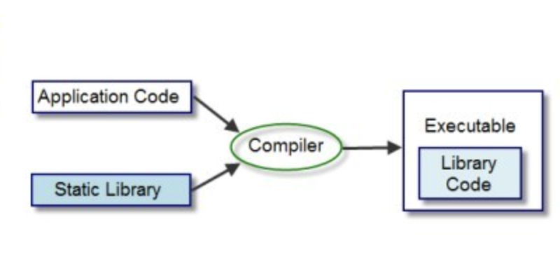
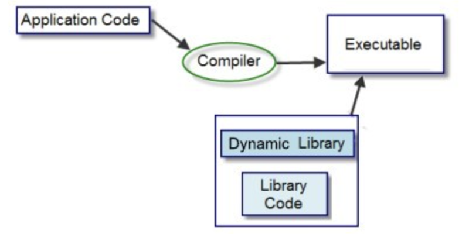
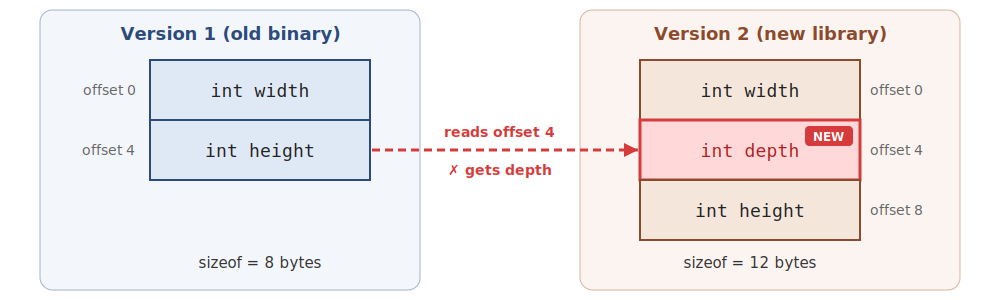
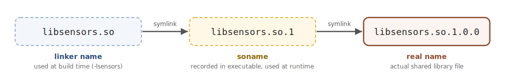
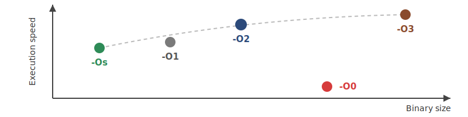
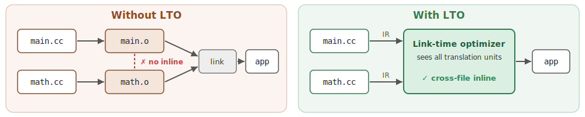
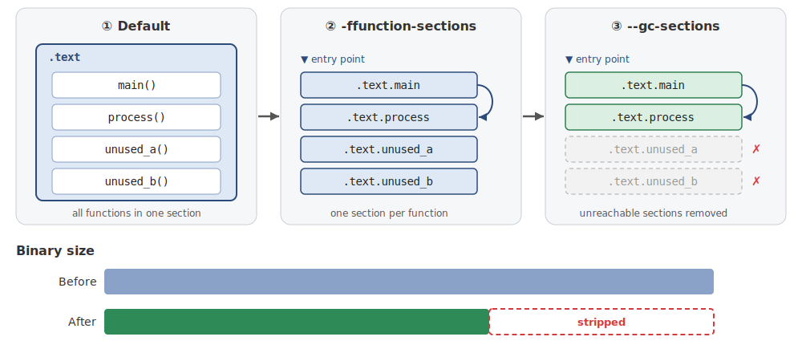
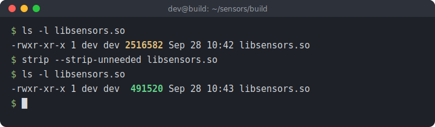

<!-- _class: lead -->

# 마이크로임베디드프로그래밍

## 라이브러리 설계와 최적화

### [munseong.jeong@daejin.ac.kr](mailto:munseong.jeong@daejin.ac.kr)

---

## 왜 라이브러리로 나누는가 (Why Libraries)

- 라이브러리 분리 목적: 재사용, 빌드 범위 제한, 공개 경계 설정, 독립 배포, 언어 연동

| 이유      | 효과                           |
| --------- | ------------------------------ |
| 재사용    | 여러 프로그램이 같은 기능 공유 |
| 빌드 시간 | 변경된 부분만 다시 컴파일      |
| 경계 설정 | 공개 API와 내부 구현 분리      |
| 독립 배포 | 라이브러리 단위 갱신           |
| 언어 연동 | C API를 통한 다른 언어 호출    |

### 라이브러리의 구성: 인터페이스와 구현

- **인터페이스**: 헤더 파일이 정의하는 공개 계약 — 변경 시 호출자에 영향
- **구현**: 공개 계약을 만족하는 내부 코드 — 계약 유지 범위에서 변경 가능

> 좋은 라이브러리 설계: **인터페이스 최소화, 구현 변경 가능성 확보**

---

## 정적 라이브러리 (Static Library)



- 컴파일된 오브젝트 파일의 아카이브(`.a`)
- 링크 시 필요한 오브젝트 코드가 실행 파일에 포함
- 실행 시 `.a` 파일 불필요

```bash
clang++ -std=c++14 -c sensors.cc -o sensors.o
ar rcs libsensors.a sensors.o
clang++ -std=c++14 main.cc -L. -lsensors -o app
```

---

## 정적 링크의 처리 순서

1. `sensors.cc`를 `sensors.o`로 컴파일
2. `ar`로 `libsensors.a` 생성
3. 링커가 해결되지 않은 심볼을 제공하는 오브젝트 추출
4. 추출한 코드가 실행 파일에 포함

- 사용하지 않는 오브젝트: 일반적으로 실행 파일에 미포함
- 라이브러리 순서: 심볼 해석에 영향 가능

---

## 정적 라이브러리의 장점과 비용

| 장점                         | 비용                            |
| ---------------------------- | ------------------------------- |
| 실행 파일 하나로 배포 가능   | 여러 실행 파일에 코드 중복 가능 |
| 적재 경로 문제 없음          | 수정 후 소비자 재링크 필요      |
| 파일 시스템 제약 환경에 적합 | 실행 파일 크기 증가 가능        |

- 같은 실행 파일의 여러 프로세스: 읽기 전용 코드 페이지 공유 가능
- 서로 다른 바이너리에 포함된 복사본: 별개

---

## 공유 라이브러리 (Shared Library)



- 별도 파일로 배포되며 동적 링커가 프로그램 시작 시 또는 최초 호출 시 적재
- 실행 파일에는 필요한 공유 객체와 심볼 정보 기록

```bash
clang++ -std=c++14 -shared -fPIC \
  -Wl,-soname,libsensors.so.1 \
  sensors.cc -o libsensors.so.1.0.0
ln -s libsensors.so.1.0.0 libsensors.so.1
ln -s libsensors.so.1 libsensors.so
```

---

## 공유 라이브러리의 장점과 비용

| 장점                                  | 비용                           |
| ------------------------------------- | ------------------------------ |
| 여러 프로세스의 코드 페이지 공유 가능 | `.so` 버전·적재 경로 관리 필요 |
| ABI 호환 시 소비자 재링크 없이 갱신   | 공개 ABI 장기 유지 필요        |
| 독립적인 점검·교체 가능               | 적재 실패 가능성               |

- 실행 중인 프로세스: 다시 시작 후 새 라이브러리 적재

---

## 정적과 공유의 비교 (Comparison)

| 항목             | 정적(`.a`)      | 공유(`.so`)                    |
| ---------------- | --------------- | ------------------------------ |
| 코드 결합 시점   | 빌드 시         | 참조는 빌드 시, 해석은 적재 시 |
| 재링크 없는 갱신 | 불가            | ABI 호환 시 가능               |
| ABI 계약         | 재빌드로 동기화 | 심볼·타입 안정성 필요          |
| 배포 복잡도      | 파일 하나       | 라이브러리 동반 배포           |

---

## 공유 객체 적재와 점검

```bash
readelf -d ./app | grep NEEDED
readelf -d libsensors.so.1.0.0 | grep SONAME
file ./app libsensors.so.1.0.0
```

- `NEEDED`: 실행 파일이 요구하는 공유 객체
- `SONAME`: 라이브러리가 제공하는 ABI 이름
- `file`: 타깃 아키텍처와 ELF 클래스 확인

---

## 적재 실패의 원인

- 파일을 찾지 못함: 라이브러리 검색 경로 문제
- `SONAME` 불일치: 필요한 ABI 버전 없음
- 심볼 없음: 라이브러리 버전 또는 가시성 문제

```text
error while loading shared libraries:
libsensors.so.1: cannot open shared object file
```

- 실행 파일과 타깃 루트 파일 시스템 동시 점검

---

## PIC와 ABI (PIC and ABI)

### `-fPIC` (Position-Independent Code)

- 공유 라이브러리: 프로세스마다 다른 가상 주소에 적재 가능
- 절대 주소에 의존하지 않는 코드로 컴파일 필요
- ELF 기반 리눅스 대상 공유 라이브러리: `-fPIC` 사용

### ABI (Application Binary Interface)

- 컴파일된 코드 사이의 이진 수준 계약
- 이름 맹글링, 타입 배치, 호출 규약, 심볼 포함
- API 호환성과 ABI 호환성은 별개의 개념

---

## ABI가 깨지는 경우 (ABI Breakage)



- 이전 바이너리: `height`를 두 번째 필드로 가정
- 새 라이브러리 교체 후 잘못된 값 읽기 가능
- 컴파일 오류 없는 오동작 가능

---

## ABI 호환성을 깨는 변경

| 변경                       | ABI 호환성                  |
| -------------------------- | --------------------------- |
| 함수 추가                  | 기존 계약 유지 시 호환 가능 |
| 함수 내부 구현 변경        | 호환 유지                   |
| 함수 시그니처 변경         | **호환성 깨짐**             |
| 구조체 필드 추가·순서 변경 | **호환성 깨짐**             |
| 가상 함수 추가             | **호환성 깨짐**             |
| 열거형 값 추가             | 사용 방식에 따라 다름       |

---

## ABI 노출을 줄이는 설계

- 공개 헤더에 구조체 내부 배치를 노출하지 않음
- 불투명 포인터로 구현 상태를 라이브러리 내부에 유지

```c
struct SensorCtx;

struct SensorCtx* SensorCreate(void);
int SensorRead(struct SensorCtx* context, float* out);
void SensorDestroy(struct SensorCtx* context);
```

- 호출자는 내부 크기·필드에 의존하지 않으므로 구현 변경의 ABI 영향 축소

---

## SONAME과 버전 관리 (SONAME and Versioning)



- `SONAME`: 동적 링커가 기록·검색하는 공유 객체 이름
- ABI 주 버전을 포함하는 관례

```bash
clang++ -shared -fPIC -Wl,-soname,libsensors.so.1 \
  sensors.cc -o libsensors.so.1.0.0
```

- ABI 하위 호환성 유지 시 같은 `SONAME`의 파일로 교체 가능

---

## SONAME 증가 규칙

- 함수 추가(기존 계약 유지) → `SONAME` 유지
- 내부 구현 수정 → `SONAME` 유지
- 함수 제거, 시그니처 변경, 구조체 배치 변경 → **`SONAME` 주 버전 증가**

- 호환성 정책은 공개 ABI 범위 정의 후 적용

---

## 라이브러리 경계 설정

- 하나의 라이브러리: 함께 변경·배포되는 기능 집합
- 너무 큰 경계: 관련 없는 기능까지 함께 변경
- 너무 작은 경계: 의존성·`SONAME`·배포 단위 증가

> 경계 기준: 함께 변경되고 함께 배포되는가

---

## 라이브러리를 하나로 유지하는 이유

- 라이브러리 분할 수 증가에 따른 관리 단위 증가
- 각 라이브러리의 공개 심볼, 버전 계약, 의존 관계 관리 필요
- 호출자 관점: 헤더와 라이브러리 수 감소

> 소규모 임베디드 프로젝트: 과도한 라이브러리 분할은 관리 비용 증가

---

## 공개 헤더와 의존성

- 공개 헤더의 선언: 호출자의 컴파일 의존성
- 헤더 변경: 많은 번역 단위의 재컴파일 유발
- 내부 헬퍼·플랫폼 헤더: 구현 파일에 한정

```cpp
class Sensor {
 public:
  int ReadMilliCelsius() const;
};
```

### 전방 선언으로 의존성 줄이기

```cpp
class GpioDevice;

class Sensor {
 public:
  explicit Sensor(GpioDevice* device);
};
```

- 전방 선언 타입: 객체 크기·멤버 접근 불가

---

## 라이브러리 의존성의 방향

```text
application
  |
public API library
  |
platform adapter
  |
libgpiod / lgpio / Linux
```

- 상위 계층: 하위 계층 구현 세부 사항 비의존
- 플랫폼 의존 코드: 어댑터 계층에 집중
- 테스트: 어댑터 대체 구현 사용 가능

---

## C++ ABI와 C API 경계

- C++ 이름 맹글링: 컴파일러·표준 라이브러리 설정에 의존
- 예외, RTTI, `std::string`: ABI 경계 확대
- 서로 다른 툴체인으로 빌드한 C++ 객체: ABI 비호환 위험

```cpp
extern "C" {

int mep_sensor_open(int* handle);
int mep_sensor_read(int handle, float* value);
void mep_sensor_close(int handle);

}
```

- 이름 맹글링 없는 함수 이름 제공
- 예외 대신 상태 코드로 오류 전달

---

## 공개 심볼과 ABI 안정성 확인

```bash
nm -D --defined-only libsensors.so | sort
readelf -Ws libsensors.so | grep GLOBAL
```

- 공개 헤더와 공개 심볼 목록을 버전별 비교
- 구조체 크기·필드 배치 변경 여부 확인
- 이전 버전 실행 파일로 새 라이브러리 통합 시험
- 호환성 검증: 릴리스 전 수행

---

## 최적화의 첫 단계는 측정 (Measure First)

- 최적화 대상 선정 기준: **추측이 아닌 측정 결과**

```bash
time ./app
perf stat -r 10 ./app
perf record ./app
perf report
size build/libsensors.so
```

- `time`: 전체 실행 시간 확인
- `perf stat`: CPU 이벤트 반복 측정
- `perf record`: 시간이 소비된 함수 위치 확인

---

## 측정 항목과 기준선

| 항목          | 질문                                  |
| ------------- | ------------------------------------- |
| 처리량        | 단위 시간에 얼마나 처리하는가         |
| 지연 시간     | 한 작업이 끝날 때까지 얼마나 걸리는가 |
| 메모리        | 실행 중 얼마나 사용하는가             |
| 바이너리 크기 | 저장 공간을 얼마나 차지하는가         |

```text
commit: 1a2b3c
flags: -O2
input: 640 x 480 frame
median: 8.4 ms
binary: 184 KiB
```

- 입력·옵션·타깃 장치 동시 기록
- 최적화 전후: 같은 조건에서 비교

---

## 최적화 우선순위

1. 알고리즘과 데이터 이동량
2. 불필요한 I/O와 메모리 할당
3. 컴파일러 최적화 옵션
4. SIMD와 플랫폼 특화 명령

> 전체 실행 시간의 1% 구간을 절반으로 줄여도 전체 개선은 0.5%

---

## 최적화 수준 (Optimization Levels)



| 상황        | 시작 옵션  | 확인 항목        |
| ----------- | ---------- | ---------------- |
| 디버깅      | `-O0 -g`   | 소스 수준 추적   |
| 일반 배포   | `-O2`      | 속도·크기 기준선 |
| 연산 커널   | `-O3` 후보 | 처리량·전력      |
| 플래시 제약 | `-Os`      | 크기·속도 손실   |

- 옵션 변경마다 같은 입력으로 재측정

---

## `-O3` 적용 전 확인

- 루프·연산의 실제 병목 여부 확인
- 코드 크기 증가의 명령 캐시 영향 확인
- 부동소수점 결과의 허용 오차 확인
- 디버깅 난이도 증가 허용 근거 확인

> `-O3`: 기본값이 아닌 측정 기반 후보

---

## LTO (Link-Time Optimization)



- 일반 컴파일: 번역 단위별 독립 최적화
- LTO: 링크 시 여러 번역 단위를 함께 분석
- 파일 경계를 넘는 인라인·상수 전파 가능

```cmake
include(CheckIPOSupported)
check_ipo_supported(RESULT ipo_supported)

if(ipo_supported)
  set(CMAKE_INTERPROCEDURAL_OPTIMIZATION TRUE)
endif()
```

---

## LTO 적용 후 확인

- 링크 시간과 메모리 사용량 증가
- 디버거의 함수·변수 표시 변화
- 재현 가능한 빌드 결과
- 최적화 전후 기능 회귀 검사

```bash
time cmake --build build --clean-first
size build/libsensors.so
```

---

## 불필요한 코드 제거 (Dead-Strip)



- 함수·데이터를 별도 섹션에 배치해야 선택 제거 가능
- 등록 기반 초기화처럼 간접 참조하는 심볼: 보존 필요

```cmake
add_compile_options(-ffunction-sections -fdata-sections)
add_link_options(-Wl,--gc-sections)  # GNU ld
# macOS: -Wl,-dead_strip
```

---

## Dead-Strip 결과 확인

```bash
size app
nm -C app | grep UnusedHelper
```

- 제거 전후 바이너리 크기 비교
- 필요한 등록 함수 유지 여부 실행 시험
- 코드 크기 감소와 기능 회귀 동시 확인

---

## 심볼 가시성과 공개 심볼 점검

```cmake
set(CMAKE_CXX_VISIBILITY_PRESET hidden)
set(CMAKE_VISIBILITY_INLINES_HIDDEN ON)
```

```cpp
#define MEP_API __attribute__((visibility("default")))

extern "C" MEP_API int mep_sensor_read(int id, float* out);
```

- 외부 호출이 필요한 함수만 `default`로 표시
- 공개 ABI 표면: 의도한 선언으로 제한
- 동적 심볼·재배치 수 감소 시 적재 비용 감소 가능

---

## 공개 심볼 점검

```bash
nm -D --defined-only libsensors.so
readelf -Ws libsensors.so | grep GLOBAL
```

- 예상하지 않은 전역 함수·전역 변수 탐지
- 내부 헬퍼가 공개 ABI가 되는 상황 방지
- 릴리스 전 결과를 기준선과 비교

---

## Strip과 디버그 심볼 보관



```bash
objcopy --only-keep-debug app app.debug
strip --strip-unneeded app
objcopy --add-gnu-debuglink=app.debug app
```

- 배포본 크기 축소
- 분석 시 동일 버전의 `app.debug` 파일 필요
- 디버그 파일: 빌드 산출물로 보관

---

## 라이브러리 설계와 최적화 점검표

- 공개 헤더 최소 선언 제공 여부
- 플랫폼 의존 코드의 구현 계층 격리 여부
- API·ABI 변경 여부 구분
- `SONAME`과 공개 심볼 관리
- 정적·공유 링크 선택에 배포 조건 반영
- 기준선·병목 측정 결과 확보
- 최적화 옵션별 기능 회귀 확인
- LTO·dead-strip·가시성의 비용 측정
- 타깃 장치에서 크기·성능·적재 확인
- 디버그 심볼과 소스 버전 보관

---

## 4장 정리와 다음 장 예고

- 라이브러리 경계: 함께 변경·배포되는 기능 단위
- 정적 링크: 단순 배포 / 공유 링크: 코드 공유·독립 갱신
- 공개 ABI 최소화와 `SONAME` 기반 호환성 관리
- 최적화 순서: 측정 → 병목 파악 → 개선 → 재측정
- LTO, dead-strip, 가시성, strip: 효과·비용 동시 검토
- 다음 장: SIMD 기반 데이터 병렬 처리
