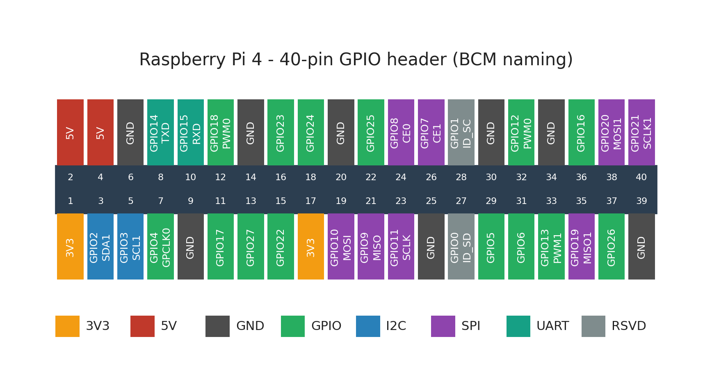
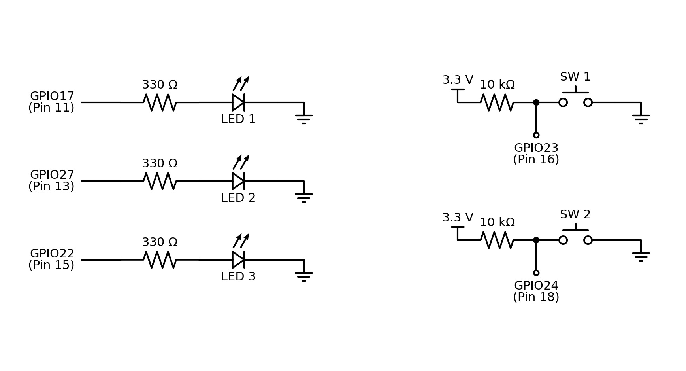
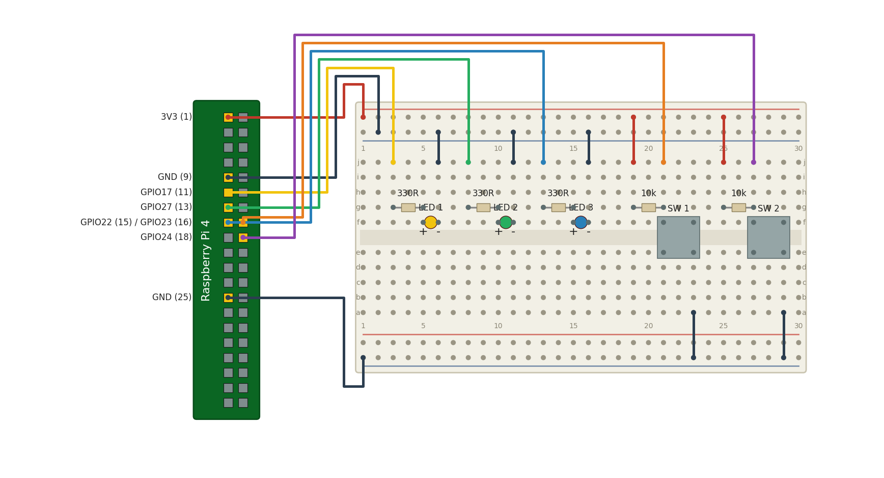
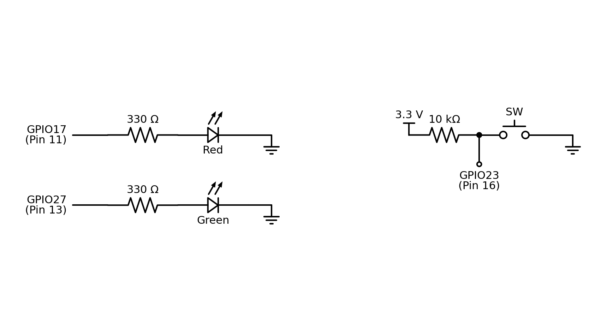
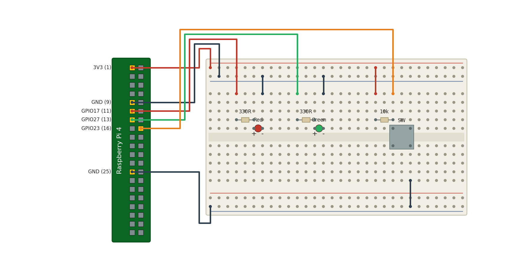

<!-- _class: lead -->
# 마이크로임베디드프로그래밍

## 실습 준비와 GPIO 기초

### [munseong.jeong@daejin.ac.kr](mailto:munseong.jeong@daejin.ac.kr)

---

## 실습 공통 규칙 (Common Rules)

- **3인 1조**로 수행
- 배선 변경 시 **반드시 전원을 차단**할 것
- LED는 항상 전류 제한 저항과 직렬로 연결
- GPIO는 **3.3V 기준** — 5V 신호를 직접 연결하지 말 것(에외: HC-SR04 실습)

### 보고서 제출

- 실습 목표, 회로 구성, 소스 코드, 실행 결과, 고찰 순으로 작성
- 실행 결과는 **직접 촬영한 영상**을 포함
- 코드는 전체를 붙여넣지 말고 핵심 부분만 발췌해 설명

---

## 개발 환경 (Development Environment)

| 구분 | 내용 |
| --- | --- |
| 타깃 보드 | Raspberry Pi(Raspberry Pi OS, 64-bit) |
| 언어 | C++14 |
| 컴파일러 | `clang++` (타깃), 크로스 툴체인(호스트) |
| GPIO 라이브러리 | libgpiod v2(필요 시 lgpio) |
| 빌드 시스템 | CMake |
| 형상 관리 | Git / GitHub |
| CI/CD | GitHub Actions |

- 본 수업은 Python이 아닌 **C++ 기반**으로 진행함
- GPIO 제어는 현행 Raspberry Pi OS가 지원하는 **libgpiod**를 사용
  - WiringPi는 개발이 중단되어 사용하지 않음

---

## 사전 학습 자료 (Preparation Material)

- 실습 전에 미리 익혀 두면 도움이 되는 내용:
  - [Basic Unix commands](https://www.youtube.com/watch?v=3DA1grSp4mU)
  - [Basic Linux Navigation](https://www.youtube.com/watch?v=dzHscTzpAME)
  - [The vi Text Editor - Basic Intro](https://www.youtube.com/watch?v=KtTjamPKMhw)

---

## 공통 개발 흐름 (Workflow)

- 모든 실습이 공유하는 헤더는 `mep/common/` 한 곳에만 보관함

```text
mep/
├── common/
│   ├── gpio_helper.hpp        # RAII wrapper
│   └── signal_stop.hpp        # Ctrl-C stop flag
├── 09/src/                    # labs 01, 02
├── 10/src/                    # labs 03, 04, 05
...
```

```bash
# 1. Write the source
vi lab01.cc

# 2. Build -- -I points at the shared headers
clang++ -std=c++14 -Wall -Wextra -I../../common lab01.cc -o lab01 -lgpiod

# 3. Run
./lab01

# 4. On trouble, inspect the pin state
gpioinfo gpiochip0
```

---

## GPIO 기초 - 가장 단순한 예제 (Minimal Example)

- 본격적인 실습 전에, libgpiod의 최소 형태를 먼저 확인

[//]: # (INCLUDE: ./mep/09/src/00_gpio_blink.cc --to 10)

---

## GPIO 기초 - 가장 단순한 예제 (Minimal Example) (Cont'd - 1)

[//]: # (INCLUDE: ./mep/09/src/00_gpio_blink.cc --from 15 --to 34)

- `open` -> `settings`/`config` -> `request_lines` -> `set_value` -> `release` -> `close`

---

## GPIO 기초 - 가장 단순한 예제 (Minimal Example) (Cont'd - 2)

[//]: # (INCLUDE: ./mep/09/src/00_gpio_blink.cc --from 37)

- 모든 호출의 반환값을 확인하고, 확보한 자원을 역순으로 해제하는 것이 기본

---

## GPIO 기초 - 구성과 빌드 (Layout and Build)

```text
mep/09/src/
└── 00_gpio_blink.cc           # minimal example, uses no shared header
```

```bash
cd mep/09/src
clang++ -std=c++14 -Wall -Wextra 00_gpio_blink.cc -o blink -lgpiod
./blink                        # blinks 10 times, then exits on its own
```

- 이 예제만 `-I` 가 필요 없음 — RAII 래퍼 없이 libgpiod를 직접 부르기 때문
- 정해진 횟수만 돌고 끝나므로 신호 처리도 넣지 않음

---

## GPIO 기초 - 디지털 입출력 (Digital I/O Basics)

<!-- IMAGE [파형] HIGH/LOW 전압 레벨과 임계 전압, 불확정 구간 표시 (img/17-logic-levels.png) -->

- 디지털 신호는 전압을 **두 상태**로 해석

| 상태 | 라즈베리파이(3.3V 로직) |
| --- | --- |
| LOW(0) | 약 0V 근처 |
| HIGH(1) | 약 3.3V 근처 |
| 불확정 | 그 사이 — **읽을 때마다 값이 달라질 수 있음** |

### 플로팅 (Floating)

- 입력 핀을 아무 데도 연결하지 않으면 전압이 떠서 **값이 임의로 변함**
- 그래서 스위치 입력에는 **풀업 또는 풀다운**이 반드시 필요

| 방식 | 평상시 | 눌렀을 때 |
| --- | --- | --- |
| 풀업(Pull-Up) | HIGH | LOW |
| 풀다운(Pull-Down) | LOW | HIGH |

> 실습에서는 **10kΩ 풀업**을 사용하므로 "누름 = LOW"
---

## GPIO 기초 - 헤더 핀 배치 (Header Pinout)



- 40핀 중 **GPIO로 쓸 수 있는 것은 26개**, 나머지는 전원과 접지
- I2C·SPI·UART는 **정해진 핀에 고정** — 해당 기능을 쓸 때는 다른 핀으로 옮길 수 없음

---

## GPIO 기초 - 출력 회로와 전류 (Output and Current)

<!-- IMAGE [개념도] GPIO -> 저항 -> LED -> GND 결선과 전류 방향 (img/18-led-current.png) -->

- GPIO 출력은 **전류를 공급하거나 흡수**하며 소자를 구동

### LED 회로

```text
GPIO ---- [ 330Ω ] ---- |>|(LED) ---- GND
                       anode  cathode
```

- LED는 **극성이 있음** — 긴 다리가 애노드(+)
- 저항이 없으면 과전류로 **LED와 GPIO 핀이 모두 손상**됨

### 전류 한계

| 항목 | 대략적인 한계 |
| --- | --- |
| 핀 하나 | 십여 mA |
| 전체 합계 | 수십 mA |

- 모터·릴레이처럼 전류가 큰 부하는 **트랜지스터나 드라이버**를 거칠 것

---

## 실습 00 - 조 편성 및 교보재 교부

- 3인 1조 편성 및 조별 역할 분담
- 교보재 수령 및 구성품 점검
- 개발 환경 확인

### 교보재 점검 목록

| 품목 | 수량 | 확인 |
| --- | --- | --- |
| Raspberry Pi 4/400(전원·microSD) | 1 set | |
| 브레드보드 | 1 | |
| 점퍼 케이블(M-M, M-F) | 20+ | |
| LED 5mm / 푸시버튼 | 3 / 2 | |
| DHT11 / CdS / MCP3008 | 각 1 | |
| HC-SR04 / 부저 | 각 1 | |
| USB 웹캠 | 1 | |
| 저항 330Ω / 10kΩ / 1kΩ / 2kΩ | 3 / 2 / 1 / 1 | |

---

## 실습 00 - 환경 확인 (Environment Check)

```bash
# Architecture and OS
uname -m                 # must report aarch64
cat /etc/os-release

# Development tools
clang++ --version
cmake --version

# Install and verify the GPIO library
sudo apt update
sudo apt install -y clang libgpiod-dev gpiod
gpiodetect

# Grant access (takes effect after re-login)
sudo usermod -aG gpio,video,audio "$USER"
```

- 웹캠 인식 확인: `v4l2-ctl --list-devices`
- 마이크 인식 확인: `arecord -l`

---

## 실습 01 - 다중 LED와 스위치 제어

<!-- IMAGE [사진] 완성된 LED 3개 + 버튼 2개 브레드보드 실물 사진 (img/03-lab01-built.png) -->

- GPIO 디지털 **출력**으로 LED 3개를 제어하고, **PWM**으로 밝기까지 조절
- GPIO 디지털 **입력**으로 푸시버튼 2개의 상태를 읽음
- SW1은 수동/촛불 모드 전환, SW2는 밝기 단계 조절
- libgpiod의 기본 사용법과 자원 해제 습관 확립

### 사용 부품

| 부품 | 수량 | 비고 |
| --- | --- | --- |
| LED 5mm | 3 | 각각 330Ω 직렬 |
| 푸시버튼 스위치 | 2 | 10kΩ 풀업 |
| 저항 330Ω | 3 | 전류 제한 |
| 저항 10kΩ | 2 | 풀업 |

---

## 실습 01 - 핀 배치 (Pin Assignment)

| 기능 | BCM 번호 | 비고 |
| --- | --- | --- |
| LED 1 | 17 | 330Ω 직렬 |
| LED 2 | 27 | 330Ω 직렬 |
| LED 3 | 22 | 330Ω 직렬 |
| 버튼 1 | 23 | 10kΩ 풀업 |
| 버튼 2 | 24 | 10kΩ 풀업 |

### 풀업 회로의 동작

- 버튼을 누르지 않으면 10kΩ 을 통해 3.3V로 당겨져 **HIGH**
- 버튼을 누르면 GND에 직접 연결되어 **LOW**
- 즉, **누름 = LOW**로 읽힘 — 논리가 반전되어 있음에 주의

---

## 실습 01 - 택트 스위치의 방향 (Switch Orientation)

### 택트 스위치의 방향

- 4핀 택트 스위치는 **같은 변의 두 다리가 내부에서 항상 붙어 있음**
- 이 붙어 있는 쌍이 **가운데 홈을 가로지르도록** 꽂아야 함

```text
    correct                        rotated 90 deg (does not work)
  f  [1]---[3]                   f  [1]   [2]
     ---------- channel             ---------- channel
  e  [2]---[4]                   e  [3]   [4]
     1-2 shorted, 3-4 shorted       1-3 shorted, 2-4 shorted
     pressing joins the columns     pressing joins nothing
```

- 90도 돌려 꽂으면 **눌러도 GPIO 핀까지 신호가 가지 않음**
  - 증상: 선이 계속 HIGH이고, 아무리 눌러도 프로그램이 반응하지 않음
- 확신이 서지 않으면 테스터의 통전 모드로 **누르기 전후를 직접 확인**할 것

---

## 실습 01 - 회로도 (Schematic)



- LED는 GPIO에서 나가 330Ω 을 거쳐 접지로, 버튼은 3.3V에서 10kΩ 을 거쳐 접지로 흐름
- 버튼이 읽는 지점은 10kΩ 과 스위치 **사이의 노드** — 누르면 이 노드가 접지에 직결되어 LOW

---

## 실습 01 - 브레드보드 배치 (Breadboard Layout)



- 회로도가 **전기적 연결**을 보여준다면, 배치도는 **부품을 몇 번 줄에 꽂는지**를 보여줌
- 브레드보드는 같은 세로줄 5칸이 서로 통해 있고, 가운데 홈을 기준으로 위아래가 나뉨

---

## 실습 01 - 자원 관리 (RAII)

<!-- IMAGE [다이어그램] 자원 수명 다이어그램 - 생성자 획득, 소멸자 해제. 조기 return 경로 포함 (img/05-raii-lifetime.png) -->

- GPIO는 열었으면 반드시 닫아야 하는 자원
- 조기 반환이나 예외 발생 시에도 해제되도록 **RAII 래퍼**를 사용

[//]: # (INCLUDE: ./mep/common/gpio_helper.hpp --from 35 --to 52 --no-comment)

- 소멸자가 해제를 책임지므로 `return` 경로마다 해제 코드를 쓸 필요가 없음

---

## 신호 처리와 안전한 종료 (Signals and Clean Shutdown)

- 실습 프로그램은 무한 루프를 돌므로 **Ctrl-C 로 끝내는 것이 정상 경로**
- 그런데 신호는 **명령어와 명령어 사이 아무 데서나** 도착함

### 처리기 안에서 해도 되는 일은 거의 없음

| 하면 안 되는 것 | 이유 |
| --- | --- |
| `printf` | 내부 잠금을 쓰므로 같은 함수 실행 중 재진입하면 교착 |
| `malloc` / `free` | 힙 잠금도 같은 문제 |
| libgpiod 호출 | 비동기 신호 안전(async-signal-safe)이 보장되지 않음 |

- 안전하게 쓸 수 있는 것은 `volatile sig_atomic_t` 변수 하나뿐
- 그래서 처리기는 **깃발만 세우고** 즉시 반환하고, 정리는 루프를 빠져나온 뒤 수행

---

## 공용 신호 처리기 (Shared Stop Handler)

[//]: # (INCLUDE: ./mep/common/signal_stop.hpp --from 21 --to 39 --no-comment)

- `SIGHUP` 까지 받는 이유: SSH 연결이 끊길 때 오는 신호이며,
  실습 중 프로그램이 죽는 가장 흔한 경로임

---

## PWM - 디지털 핀으로 밝기 만들기 (Pulse Width Modulation)

- GPIO는 HIGH/LOW 두 값만 낼 수 있어 **중간 밝기를 직접 만들 수 없음**
- 대신 눈보다 빠르게 켜고 끄면, 켜져 있던 **시간 비율**이 밝기로 보임

$$\text{Duty} = \frac{T_{on}}{T_{on} + T_{off}} \times 100\%$$

```text
duty  25%   ##______##______##______##______
duty  50%   ####____####____####____####____
duty 100%   ################################
            |<-- 1 period = 10 ms -->|
```

- **주기**(period)는 깜빡임이 보이지 않을 만큼 짧아야 함 — 100Hz 이상 권장
- 밝기를 바꾸는 것은 **듀티**(duty)이지 주기가 아님

---

## 소프트웨어 PWM과 하드웨어 PWM (Software and Hardware PWM)

| 구분 | 소프트웨어 PWM | 하드웨어 PWM |
| --- | --- | --- |
| 생성 주체 | 프로그램이 직접 켜고 끔 | 칩 내부 타이머 |
| 사용 가능 핀 | 모든 GPIO | GPIO12·13·18·19 뿐 |
| 정확도 | 스케줄러에 밀려 흔들림 | 프로그램과 무관하게 일정 |
| CPU 사용 | 주기마다 계속 사용 | 설정 후 거의 없음 |

- 실습은 LED를 17·27·22에 두므로 **소프트웨어 PWM**을 사용
- LED 조명은 약간의 흔들림이 문제되지 않지만, **모터나 서보는 하드웨어 PWM**이 필요
- 유저 공간의 `usleep`은 요청한 시간만큼 정확히 자지 않음
  - 실습 03 DHT11에서 겪게 될 타이밍 문제와 같은 원인

---

## 실습 01 - 구성과 빌드 (Layout and Build)

```text
mep/
├── common/
│   ├── gpio_helper.hpp
│   ├── signal_stop.hpp
│   └── button.hpp             # pull-up button, shared by labs 01 and 02
└── 09/src/
    └── 01_multi_led_switch.cc
```

```bash
cd mep/09/src
clang++ -std=c++14 -Wall -Wextra -I../../common \
        01_multi_led_switch.cc -o lab01 -lgpiod
./lab01                        # Ctrl-C to stop
```

---

## 실습 01 - 예제 코드 (Example)

- 헤더와 핀 정의

[//]: # (INCLUDE: ./mep/09/src/01_multi_led_switch.cc --to 17)

---

## 실습 01 - 예제 코드 (Cont'd - 1)

- 주기 상수 — PWM은 10ms, 버튼은 그 안에서 10스텝마다

[//]: # (INCLUDE: ./mep/09/src/01_multi_led_switch.cc --from 18 --to 25 --no-comment)

---

## 실습 01 - 예제 코드 (Cont'd - 2)

- 듀티 판정과 밝기 단계 — 하드웨어를 만지지 않는 순수 함수

[//]: # (INCLUDE: ./mep/09/src/01_multi_led_switch.cc --from 27 --to 41)

---

## 실습 01 - 촛불의 움직임 (Making a Flame Move)

- 무작위 값으로 **뛰는** 것은 전기 잡음처럼 보임 — 촛불은 **흘러가야** 함

[//]: # (INCLUDE: ./mep/09/src/01_multi_led_switch.cc --from 46 --to 60)

- 8번에 한 번은 **바람**(draught) — 평소 흔들림보다 훨씬 깊게 내려감

---

## 실습 01 - 목표까지 다가가기 (Approaching a Target)

[//]: # (INCLUDE: ./mep/09/src/01_multi_led_switch.cc --from 65 --to 81)

- 목표를 지나치지 않고 다가가기만 하므로, 밝기가 **끊기지 않고 이어짐**
- 세 LED가 각자 다른 속도로 움직여 **같이 뛰는 일이 없음**

---

## 실습 01 - 예제 코드 (Cont'd - 3)

- 자원 확보 — LED는 출력, 버튼은 `Button` 이 풀업까지 요청

[//]: # (INCLUDE: ./mep/09/src/01_multi_led_switch.cc --from 93 --to 112)

---

## 실습 01 - 예제 코드 (Cont'd - 4)

- 초기 상태 — 촛불마다 목표와 속도를 따로 가짐

[//]: # (INCLUDE: ./mep/09/src/01_multi_led_switch.cc --from 114 --to 132)

---

## 실습 01 - 예제 코드 (Cont'd - 5)

- PWM 한 주기 — LED 레벨을 100us 마다 씀

[//]: # (INCLUDE: ./mep/09/src/01_multi_led_switch.cc --from 135 --to 146)

---

## 실습 01 - 예제 코드 (Cont'd - 6)

- 같은 주기 안에서 **10스텝마다** 버튼을 확인 — 약 1ms 간격

[//]: # (INCLUDE: ./mep/09/src/01_multi_led_switch.cc --from 147 --to 159 --no-comment)

---

## 실습 01 - 예제 코드 (Cont'd - 7)

- 눌림 결과 출력, 그리고 수동 모드의 듀티

[//]: # (INCLUDE: ./mep/09/src/01_multi_led_switch.cc --from 161 --to 174)

---

## 실습 01 - 예제 코드 (Cont'd - 8)

- 촛불 모드 — 각 불꽃이 자기 목표로 흘러가고, 닿으면 새 목표를 뽑음

[//]: # (INCLUDE: ./mep/09/src/01_multi_led_switch.cc --from 175 --to 190 --no-comment)

---

## 실습 01 - 동작 흐름 (How It Runs)

- 바깥 루프 한 바퀴가 **PWM 한 주기**이고, 그 안에서 버튼을 열 번 확인

```text
|<--------------- 1 period = 10 ms = 100 steps --------------->|
 step 0    10    20    30    40    50    60    70    80    90
   |  B     B     B     B     B     B     B     B     B     B     B = button read (~1 ms)
   |##########################____________________________       duty 40%
   |                                                        ^ duty updated at period end
```

| 하는 일 | 주기 |
| --- | --- |
| LED 레벨 쓰기 | 100us 마다(step) |
| 버튼 읽기 | 약 1ms 마다 |
| 듀티 갱신 | 10ms 마다(주기 끝) |

- 버튼을 주기 끝에서 한 번만 읽으면 `usleep` 오차만큼 간격이 흔들림
  - 그래서 **주기 안에서** 고정 간격으로 읽음

---

## 실습 01 - 실행 결과 (Expected Output)

```text
$ ./lab01
SW1(GPIO23) mode, SW2(GPIO24) brightness. Ctrl-C to stop
mode=manual  brightness=50%
mode=manual  brightness=75%      <- SW2
mode=candle  brightness=75%      <- SW1
mode=manual  brightness=75%      <- SW1
^Cstopped
```

- 한 번 누르면 **정확히 한 줄** — 여러 줄이 쏟아지면 채터링을 의심할 것
- `candle` 모드에서는 출력이 없고 LED만 계속 흔들림
- 밝기는 0 → 25 → 50 → 75 → 100 → 0 으로 순환

---

## 스위치 바운싱 (Switch Bouncing)

<!-- IMAGE [파형] 기계식 스위치의 채터링 파형과 디바운스 후 파형 비교 (img/19-debounce.png) -->

- 기계식 스위치는 접점이 붙을 때 **수 밀리초 동안 여러 번 튐**(채터링)
- 프로그램은 이를 여러 번의 입력으로 오인함

### 해결 방법

| 방식 | 설명 | 이 실습에서 |
| --- | --- | --- |
| 상태 안정화 | 같은 값이 N 회 연속 읽히면 확정 | 지연이 생기고, 긴 채터링에는 무력 |
| 에지 + 잠금 | 첫 에지에 즉시 반응한 뒤 재무장을 미룸 | **채택** |
| 하드웨어 | RC 필터, 슈미트 트리거 | 회로를 바꿔야 함 |

- **폴링을 느리게 하는 것은 디바운스가 아님** — 어느 튐이 표본에 걸리는지가
  바뀔 뿐이어서, 한 번 누른 것이 여전히 여러 번으로 잡힘

---

## 공용 버튼 클래스 (Shared Button)

- `common/button.hpp` — 풀업 스위치 하나를 다루는 데 필요한 전부

[//]: # (INCLUDE: ./mep/common/button.hpp --from 48 --to 64 --no-comment)

- 규칙은 두 줄: **누른 즉시 보고**하고, 선이 다시 HIGH로 **안정될 때까지** 재무장하지 않음
- "N밀리초 동안 무시"만으로는 부족 — 채터링이 그보다 길면 또 두 번 잡힘

---

## 실습 01 - 과제 (Tasks)

<!-- IMAGE [파형] 스위치 바운싱 오실로스코프 파형. 디바운스 전후 비교 (img/06-switch-bouncing.png) -->

1. SW2로 밝기를 바꾸며 LED 3개가 같은 밝기로 켜지는지 확인
2. SW1으로 촛불 모드에 들어가 세 LED가 서로 다르게 흔들리는지 확인
3. 흔들림의 폭과 속도를 바꿔 가장 그럴듯한 값을 찾을 것
4. 밝기 단계를 5단계에서 20단계로 늘리고, 눈에 보이는 차이를 기록

### 고찰 항목

- 듀티 25%가 실제로 25% 밝기로 보이는가 — 사람의 밝기 인식은 선형이 아님
- PWM 주기를 10ms에서 100ms로 늘리면 무엇이 보이는가
- 버튼을 한 번 눌렀는데 여러 번 입력된 것처럼 동작한 경우가 있었는가
  - **바운싱**(bouncing) 현상과 그 해결 방법을 조사할 것

---

## 실습 02 - 시퀀스 프로그래밍

- **상태 기계**(state machine)로 시간 기반 순차 제어를 구현
- 보행자 신호등을 만들며 상태를 명시적으로 표현했을 때의 이점을 이해

### 왜 상태 기계인가

- 플래그 변수를 여러 개 두면 조합이 늘어나 곧 관리가 불가능해짐
  - `bool` 3개면 이미 8가지 조합이고, 그중 몇 개는 있어서는 안 되는 상태임
- 상태를 하나의 열거형으로 표현하면
  - 가능한 상태가 코드에 명확히 드러남
  - 전이 규칙을 한곳에서 관리
  - 하드웨어 없이도 전이 함수를 **단위 테스트**할 수 있음

---

## 상태 기계의 구성 요소 (Anatomy of a State Machine)

| 요소 | 의미 | 실습 02에서 |
| --- | --- | --- |
| 상태 | 시스템이 머무는 하나의 국면 | `kCarGo`, `kWarn`, `kWalk` |
| 전이 | 상태를 옮기는 규칙 | `NextState()` |
| 타임아웃 | 시간이 지나 일어나는 전이 | `StateDurationMs()` |
| 이벤트 | 외부 자극으로 일어나는 전이 | 보행자 버튼 |
| 진입 동작 | 상태에 들어갈 때 한 번만 하는 일 | 상태 이름 출력 |
| 출력 | 현재 상태로 결정되는 결과 | `RedOn()`, `GreenOn()` |

- 출력을 **상태만의 함수**로 두면 LED가 시퀀스와 어긋날 수 없음
- 전이 함수와 출력 함수는 하드웨어를 만지지 않으므로 **단위 테스트 가능**

---

## 실습 02 - 회로도 (Schematic)



- LED 두 개와 버튼 하나 — 실습 01 회로에서 가지 하나씩을 덜어낸 형태

---

## 실습 02 - 브레드보드 배치 (Breadboard Layout)



- 실습 01에서 LED 하나와 버튼 하나를 덜어낸 구성 — 배치를 새로 짤 필요 없음
- 남는 부품은 회수하지 말고 실습 04에서 다시 사용

---

## 실습 02 - 상태 전이 (State Transition)

<!-- IMAGE [상태도] CAR GO→WARN→WALK 상태 기계 다이어그램, 버튼 이벤트 전이 포함(본문 ASCII 도식 대체) (img/07-state-machine.png) -->

```text
              10s (min 2s after a press)         3s
   [CAR GO] --------------------------> [WARN] -----> [WALK]
       ^                                                 |
       +-------------------- 8s -------------------------+
```

| 상태 | 녹색 LED | 적색 LED | 의미 |
| --- | --- | --- | --- |
| `kCarGo` | 켜짐 | 꺼짐 | 차량 통행 |
| `kWarn` | 점멸 | 꺼짐 | 곧 정지 |
| `kWalk` | 꺼짐 | 켜짐 | 보행자 횡단 |

- 시퀀스는 **시간이 스스로 진행**시키고, 버튼은 다음 전이를 앞당기는 이벤트
- 녹색이 아닐 때 누른 요청은 **버려지지 않고 걸려 있다가** 다음 녹색에서 처리됨
  - 실제 횡단보도가 하는 일이 이것 — 눌렀는데 아무 일도 없으면 고장과 구별되지 않음
- 최소 녹색 시간은 보장되므로, 열 번 눌러도 한 번 누른 것과 같음

---

## 실습 02 - 요청 걸어 두기 (Latching a Request)

- 녹색이 아닐 때 누른 요청을 **버리면** 버튼이 고장난 것처럼 보임

| 누른 시점 | 버리는 경우 | 걸어 두는 경우(현재) |
| --- | --- | --- |
| `CAR GO` 초반 | 즉시 반영 | 즉시 반영 |
| `CAR GO` 막바지 | **아무 일도 없음** | 최소 녹색 후 반영 |
| `WARN` 중 | **아무 일도 없음** | 이미 오는 횡단으로 처리 |
| `WALK` 중 | **아무 일도 없음** | 다음 녹색에서 반영 |

- 21초 주기에서 버리는 방식은 **약 8초 동안만** 반응함 — 나머지는 무반응
- 걸어 두면 **어느 시점에 눌러도** 한 주기 안에 횡단 신호가 옴

---

## 실습 02 - 구성과 빌드 (Layout and Build)

```text
mep/
├── common/
│   ├── gpio_helper.hpp
│   ├── signal_stop.hpp
│   └── button.hpp
└── 09/src/
    └── 02_sequence_state_machine.cc
```

```bash
cd mep/09/src
clang++ -std=c++14 -Wall -Wextra -I../../common \
        02_sequence_state_machine.cc -o lab02 -lgpiod
./lab02                        # Ctrl-C to stop
```

---

## 실습 02 - 상태 정의 (State Definition)

- 상태와 각 상태가 머무는 시간

[//]: # (INCLUDE: ./mep/09/src/02_sequence_state_machine.cc --from 26 --to 41 --no-comment)

---

## 실습 02 - 전이 규칙 (Transition Rules)

- 순서 전이 — 신호는 앞으로만 진행

[//]: # (INCLUDE: ./mep/09/src/02_sequence_state_machine.cc --from 47 --to 57 --no-comment)

---

## 실습 02 - 이벤트 전이 (Event Transition)

- 요청은 녹색 시간만 줄이고, **최소 녹색 아래로는 내려가지 않음**

[//]: # (INCLUDE: ./mep/09/src/02_sequence_state_machine.cc --from 64 --to 69 --no-comment)

---

## 실습 02 - 출력 함수 (Output Functions)

- 출력은 상태만으로 결정되므로 LED가 시퀀스와 어긋날 수 없음

[//]: # (INCLUDE: ./mep/09/src/02_sequence_state_machine.cc --from 68 --to 74 --no-comment)

---

## 실습 02 - 예제 코드 (Example)

- 자원 확보와 오류 검사

[//]: # (INCLUDE: ./mep/09/src/02_sequence_state_machine.cc --from 93 --to 112)

---

## 실습 02 - 예제 코드 (Cont'd - 1)

- 초기 상태와 첫 진입 출력

[//]: # (INCLUDE: ./mep/09/src/02_sequence_state_machine.cc --from 114 --to 121)

---

## 실습 02 - 예제 코드 (Cont'd - 2)

- 모든 누름에 응답하고, 요청은 걸어 둠

[//]: # (INCLUDE: ./mep/09/src/02_sequence_state_machine.cc --from 123 --to 141)

---

## 실습 02 - 예제 코드 (Cont'd - 3)

- 타임아웃 전이와 진입 동작

[//]: # (INCLUDE: ./mep/09/src/02_sequence_state_machine.cc --from 147 --to 163)

---

## 실습 02 - 예제 코드 (Cont'd - 4)

- 상태로부터 출력을 갱신

[//]: # (INCLUDE: ./mep/09/src/02_sequence_state_machine.cc --from 165 --to 182)

---

## 실습 02 - 실행 결과 (Expected Output)

```text
$ ./lab02
pedestrian crossing; press GPIO23 to request. Ctrl-C to stop
-> CAR GO
   request registered            <- the moment the button is pressed
   crossing in 2000 ms           <- switches after the minimum green
-> WARN                          <- green LED blinks
-> WALK                          <- red LED on
-> CAR GO
   already requested             <- pressed again with a request pending
^Cstopped
```

- 누른 즉시 `request registered` 가 나와야 함 — 안 나오면 커널이 누름을 못 본 것
- 아무것도 누르지 않아도 `CAR GO → WARN → WALK` 는 **시간만으로** 계속 돌아감

---

## 실습 02 - 과제 (Tasks)

1. 각 상태의 지속 시간을 바꿔 가며 보행자가 기다리는 시간을 측정
2. 보행 신호가 끝나기 전 마지막 3초 동안 적색 LED가 점멸하도록 확장
3. 버튼을 길게 누르면 즉시 초기 상태로 돌아가는 리셋 전이를 추가
4. 상태를 하나 더 추가(예: 전 방향 정지)하고 전이 표를 갱신

### 고찰 항목

- 상태를 열거형으로 관리했을 때와 `bool` 플래그로 관리했을 때의 차이
- 상태가 10개로 늘어난다면 코드를 어떻게 구성하겠는가
- 횡단 중의 버튼 입력을 무시하는 규칙은 코드의 어느 곳에서 강제되는가

---

## 9장 정리 (Summary)

- 디지털 입력은 **플로팅**을 막기 위해 풀업 또는 풀다운이 필요
  - 실습은 10kΩ 풀업 — **누름 = LOW**로 논리가 반전됨
- 출력은 전류 한계가 있으므로 LED에 **330Ω 직렬 저항**이 필수
- libgpiod 사용 절차: `open` → `get_line` → `request_*` → `get/set_value` → `release` → `close`
  - 모든 반환값을 검사하고, **RAII로 해제를 구조적으로 보장**
- 기계식 스위치는 **바운싱**이 있어 디바운스 처리가 필요
  - 폴링을 늦추는 것은 디바운스가 아니고, 무작정 기다리면 반응만 느려짐
  - 누른 즉시 처리하고 **선이 다시 안정될 때까지 재무장하지 않는** 방식을 사용
- 동작하지 않을 때는 **커널이 핀의 변화를 보는지부터** 확인할 것
  - `gpiomon --bias=pull-up --chip gpiochip0 23` 이 조용하면 원인은 코드가 아니라 배선
- 중간 밝기는 **PWM**의 듀티로 만들며, 주기는 깜빡임이 보이지 않을 만큼 짧아야 함
  - 소프트웨어 PWM은 모든 핀에서 되지만 스케줄러에 밀려 흔들림
- 순차 제어는 **상태 기계**로 표현하면 전이 규칙이 한곳에 모이고 테스트가 가능해짐
  - 전이는 **타임아웃**과 **이벤트** 두 가지로 나뉘며, 출력은 상태만의 함수로 둘 것

> 다음 장에서는 센서와 통신하며 프로토콜과 타이밍을 다룸

---

## 부록 - 공용 코드 (Appendix: Shared Code)

- `mep/common/` 의 헤더 여덟 개는 9~14장의 실습이 그대로 재사용
- 여기서는 **파일 전체를 순서대로** 실음 — 슬라이드가 나뉘어도 한 파일의 연속임

| 파일 | 줄 수 | 하는 일 | 쓰는 곳 |
| --- | --- | --- | --- |
| `signal_stop.hpp` | 41 | Ctrl-C 로 루프를 끝냄 | 전 장 |
| `button.hpp` | 77 | 풀업 버튼, 채터링 흡수 | 9장 |
| `gpio_helper.hpp` | 138 | libgpiod v2 RAII 래퍼 | 9~11장 |
| `dht11.hpp` | 112 | 단선 온습도 프로토콜 | 10, 11장 |
| `mcp3008.hpp` | 71 | SPI ADC | 10, 11장 |
| `hcsr04.hpp` | 81 | 초음파 거리 측정 | 10, 11장 |
| `alsa_capture.hpp` | 100 | PCM 오디오 캡처 | 12장 |
| `v4l2_capture.hpp` | 212 | V4L2 MJPEG 영상 캡처 | 12장 |

---

## 부록 - 다른 장에서의 취급 (How Later Chapters Use It)

- 10~14장은 전체 코드를 **다시 싣지 않고** 이 부록을 참조
- 다만 설명에 필요하면 **일부를 발췌해 인용할 수 있음**
  - 예: 10장의 DHT11 시작 신호, MCP3008 채널 읽기, HC-SR04 트리거
  - 발췌는 그 장의 주제를 설명하기 위한 것이고, **원본은 항상 이 부록**
- 새 공용 헤더를 추가하면 **이 부록에도 반드시 추가**할 것

---

## 부록 - signal_stop.hpp

[//]: # (INCLUDE: ./mep/common/signal_stop.hpp --to 20)

---

## 부록 - signal_stop.hpp (Cont'd)

[//]: # (INCLUDE: ./mep/common/signal_stop.hpp --from 21)

---

## 부록 - button.hpp

[//]: # (INCLUDE: ./mep/common/button.hpp --to 20)

---

## 부록 - button.hpp (Cont'd - 1)

[//]: # (INCLUDE: ./mep/common/button.hpp --from 21 --to 36)

---

## 부록 - button.hpp (Cont'd - 2)

[//]: # (INCLUDE: ./mep/common/button.hpp --from 37 --to 51)

---

## 부록 - button.hpp (Cont'd - 3)

[//]: # (INCLUDE: ./mep/common/button.hpp --from 52 --to 64)

---

## 부록 - button.hpp (Cont'd - 4)

[//]: # (INCLUDE: ./mep/common/button.hpp --from 65 --to 77)

---

## 부록 - gpio_helper.hpp

[//]: # (INCLUDE: ./mep/common/gpio_helper.hpp --to 18)

---

## 부록 - gpio_helper.hpp (Cont'd - 1)

[//]: # (INCLUDE: ./mep/common/gpio_helper.hpp --from 19 --to 34)

---

## 부록 - gpio_helper.hpp (Cont'd - 2)

[//]: # (INCLUDE: ./mep/common/gpio_helper.hpp --from 35 --to 55)

---

## 부록 - gpio_helper.hpp (Cont'd - 3)

[//]: # (INCLUDE: ./mep/common/gpio_helper.hpp --from 56 --to 75)

---

## 부록 - gpio_helper.hpp (Cont'd - 4)

[//]: # (INCLUDE: ./mep/common/gpio_helper.hpp --from 76 --to 96)

---

## 부록 - gpio_helper.hpp (Cont'd - 5)

[//]: # (INCLUDE: ./mep/common/gpio_helper.hpp --from 97 --to 107)

---

## 부록 - gpio_helper.hpp (Cont'd - 6)

[//]: # (INCLUDE: ./mep/common/gpio_helper.hpp --from 108 --to 118)

---

## 부록 - gpio_helper.hpp (Cont'd - 7)

[//]: # (INCLUDE: ./mep/common/gpio_helper.hpp --from 119 --to 138)

---

## 부록 - dht11.hpp

[//]: # (INCLUDE: ./mep/common/dht11.hpp --to 20)

---

## 부록 - dht11.hpp (Cont'd - 1)

[//]: # (INCLUDE: ./mep/common/dht11.hpp --from 21 --to 35)

---

## 부록 - dht11.hpp (Cont'd - 2)

[//]: # (INCLUDE: ./mep/common/dht11.hpp --from 36 --to 50)

---

## 부록 - dht11.hpp (Cont'd - 3)

[//]: # (INCLUDE: ./mep/common/dht11.hpp --from 51 --to 67)

---

## 부록 - dht11.hpp (Cont'd - 4)

[//]: # (INCLUDE: ./mep/common/dht11.hpp --from 68 --to 82)

---

## 부록 - dht11.hpp (Cont'd - 5)

[//]: # (INCLUDE: ./mep/common/dht11.hpp --from 83 --to 101)

---

## 부록 - dht11.hpp (Cont'd - 6)

[//]: # (INCLUDE: ./mep/common/dht11.hpp --from 102)

---

## 부록 - mcp3008.hpp

[//]: # (INCLUDE: ./mep/common/mcp3008.hpp --to 20)

---

## 부록 - mcp3008.hpp (Cont'd - 1)

[//]: # (INCLUDE: ./mep/common/mcp3008.hpp --from 21 --to 38)

---

## 부록 - mcp3008.hpp (Cont'd - 2)

[//]: # (INCLUDE: ./mep/common/mcp3008.hpp --from 39 --to 54)

---

## 부록 - mcp3008.hpp (Cont'd - 3)

[//]: # (INCLUDE: ./mep/common/mcp3008.hpp --from 55)

---

## 부록 - hcsr04.hpp

[//]: # (INCLUDE: ./mep/common/hcsr04.hpp --to 18)

---

## 부록 - hcsr04.hpp (Cont'd - 1)

[//]: # (INCLUDE: ./mep/common/hcsr04.hpp --from 19 --to 38)

---

## 부록 - hcsr04.hpp (Cont'd - 2)

[//]: # (INCLUDE: ./mep/common/hcsr04.hpp --from 39 --to 58)

---

## 부록 - hcsr04.hpp (Cont'd - 3)

[//]: # (INCLUDE: ./mep/common/hcsr04.hpp --from 59 --to 75)

---

## 부록 - hcsr04.hpp (Cont'd - 4)

[//]: # (INCLUDE: ./mep/common/hcsr04.hpp --from 76)

---

## 부록 - alsa_capture.hpp

[//]: # (INCLUDE: ./mep/common/alsa_capture.hpp --to 20)

---

## 부록 - alsa_capture.hpp (Cont'd - 1)

[//]: # (INCLUDE: ./mep/common/alsa_capture.hpp --from 21 --to 39)

---

## 부록 - alsa_capture.hpp (Cont'd - 2)

[//]: # (INCLUDE: ./mep/common/alsa_capture.hpp --from 40 --to 58)

---

## 부록 - alsa_capture.hpp (Cont'd - 3)

[//]: # (INCLUDE: ./mep/common/alsa_capture.hpp --from 59 --to 78)

---

## 부록 - alsa_capture.hpp (Cont'd - 4)

[//]: # (INCLUDE: ./mep/common/alsa_capture.hpp --from 79 --to 93)

---

## 부록 - alsa_capture.hpp (Cont'd - 5)

[//]: # (INCLUDE: ./mep/common/alsa_capture.hpp --from 94)

---

## 부록 - v4l2_capture.hpp

[//]: # (INCLUDE: ./mep/common/v4l2_capture.hpp --to 12)

---

## 부록 - v4l2_capture.hpp (Cont'd - 1)

[//]: # (INCLUDE: ./mep/common/v4l2_capture.hpp --from 13 --to 32)

---

## 부록 - v4l2_capture.hpp (Cont'd - 2)

[//]: # (INCLUDE: ./mep/common/v4l2_capture.hpp --from 33 --to 52)

---

## 부록 - v4l2_capture.hpp (Cont'd - 3)

[//]: # (INCLUDE: ./mep/common/v4l2_capture.hpp --from 53 --to 66)

---

## 부록 - v4l2_capture.hpp (Cont'd - 4)

[//]: # (INCLUDE: ./mep/common/v4l2_capture.hpp --from 67 --to 82)

---

## 부록 - v4l2_capture.hpp (Cont'd - 5)

[//]: # (INCLUDE: ./mep/common/v4l2_capture.hpp --from 83 --to 95)

---

## 부록 - v4l2_capture.hpp (Cont'd - 6)

[//]: # (INCLUDE: ./mep/common/v4l2_capture.hpp --from 96 --to 114)

---

## 부록 - v4l2_capture.hpp (Cont'd - 7)

[//]: # (INCLUDE: ./mep/common/v4l2_capture.hpp --from 115 --to 134)

---

## 부록 - v4l2_capture.hpp (Cont'd - 8)

[//]: # (INCLUDE: ./mep/common/v4l2_capture.hpp --from 135 --to 152)

---

## 부록 - v4l2_capture.hpp (Cont'd - 9)

[//]: # (INCLUDE: ./mep/common/v4l2_capture.hpp --from 153 --to 172)

---

## 부록 - v4l2_capture.hpp (Cont'd - 10)

[//]: # (INCLUDE: ./mep/common/v4l2_capture.hpp --from 173 --to 188)

---

## 부록 - v4l2_capture.hpp (Cont'd - 11)

[//]: # (INCLUDE: ./mep/common/v4l2_capture.hpp --from 189 --to 200)

---

## 부록 - v4l2_capture.hpp (Cont'd - 12)

[//]: # (INCLUDE: ./mep/common/v4l2_capture.hpp --from 201)
