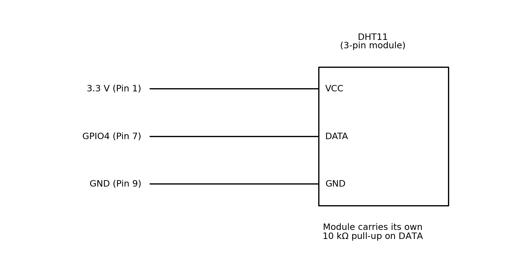
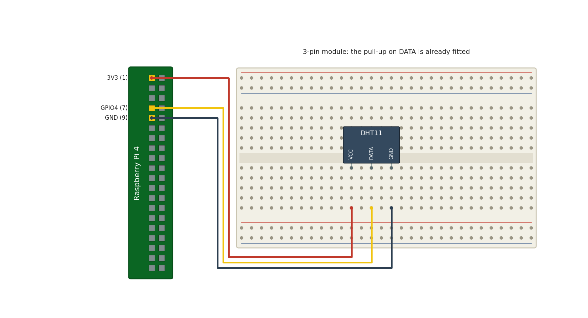
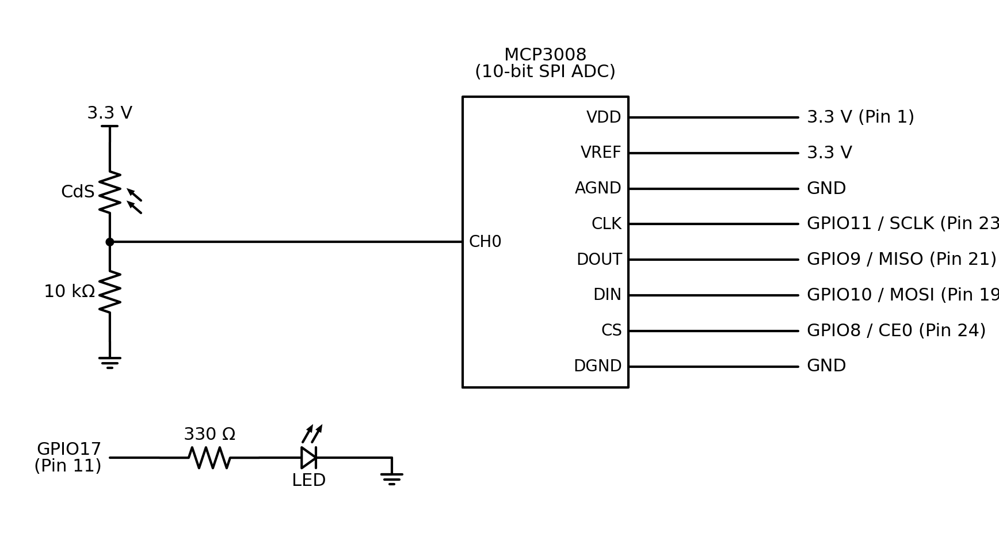
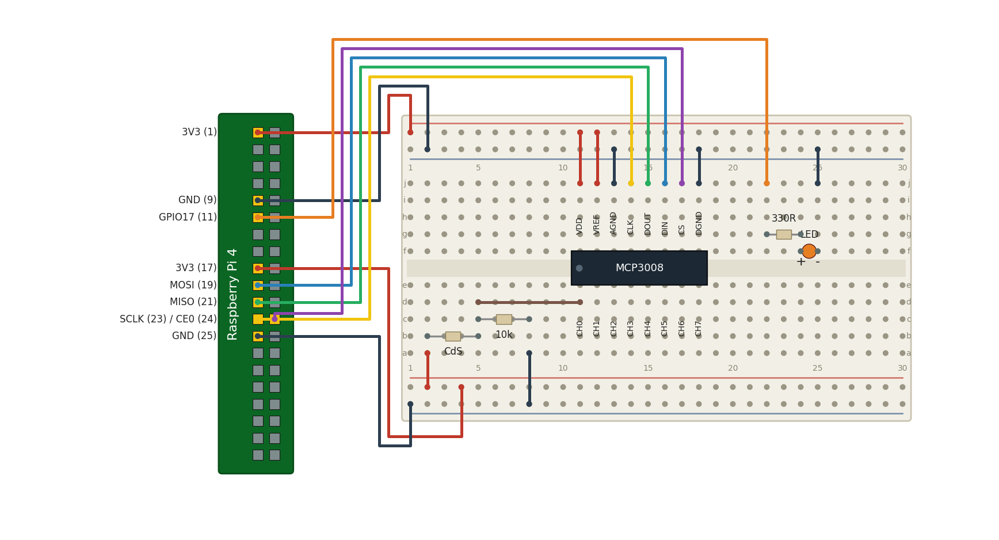
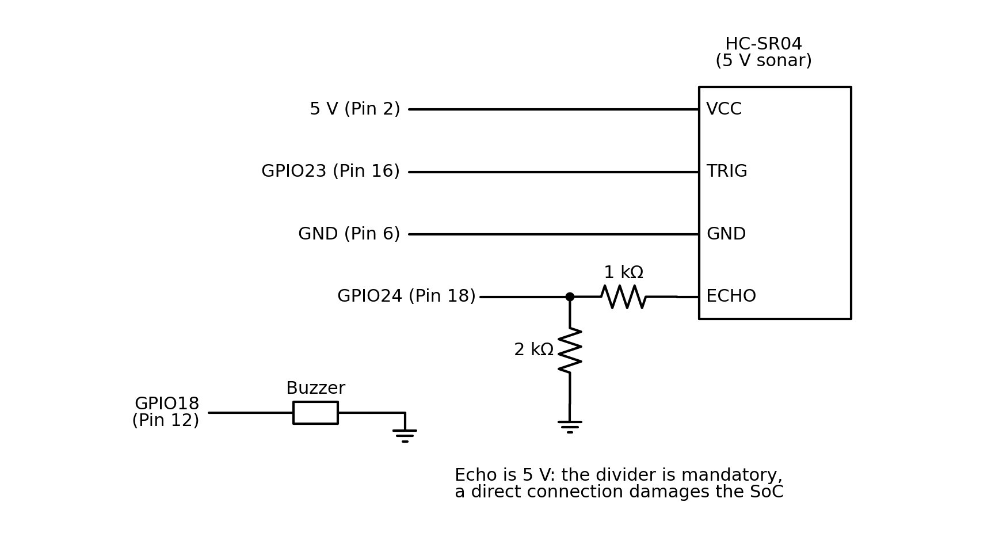
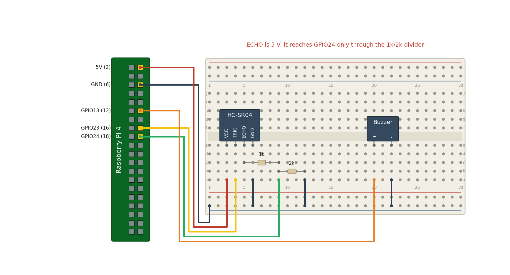

<!-- _class: lead -->

# 마이크로임베디드프로그래밍

## 센서 제어

### [munseong.jeong@daejin.ac.kr](mailto:munseong.jeong@daejin.ac.kr)

---

## 이 장의 구성 (Contents)

| 구분    | 내용                                  |
| ------- | ------------------------------------- |
| 실습 03 | 온습도 센서 — 단선 프로토콜, 체크섬   |
| 실습 04 | 조도 센서와 ADC — 아날로그 신호, SPI  |
| 실습 05 | 초음파 센서 — 펄스 폭 측정, 레벨 변환 |

- 세 실습은 각각 **다른 방식의 센서 인터페이스**를 다룸

---

## 센서 인터페이스의 종류 (Sensor Interfaces)

| 방식        | 특징                               | 이 장의 실습     |
| ----------- | ---------------------------------- | ---------------- |
| 디지털 단선 | 한 선으로 타이밍 기반 통신         | DHT11(실습 03)   |
| 아날로그    | 전압 값 자체가 정보 — **ADC 필요** | CdS(실습 04)     |
| 펄스 폭     | 신호의 지속 시간이 정보            | HC-SR04(실습 05) |
| I2C / SPI   | 표준 디지털 버스                   | MCP3008(실습 04) |

### 공통으로 확인할 것

- **동작 전압** — 5V 센서를 3.3V GPIO에 직접 연결하지 말 것
- **타이밍 규격** — 데이터시트의 최소·최대 시간을 지킬 것
- **측정 주기** — 센서마다 최소 간격이 정해져 있음
- **오류 처리** — 체크섬, 범위 검사, 재시도

---

## 실습 03 - 온습도 센서

- 디지털 센서의 **단선 프로토콜**을 이해하고 구현
- 데이터시트의 타이밍 규격을 코드로 옮기는 경험
- **체크섬**으로 데이터 무결성을 검증

### DHT11 규격

| 항목       | 값                                        |
| ---------- | ----------------------------------------- |
| 측정 범위  | 온도 0~50°C, 습도 20~90%RH                |
| 정확도     | 온도 ±2°C, 습도 ±5%RH                     |
| 데이터     | 40비트(습도 2 + 온도 2 + 체크섬 1 바이트) |
| 측정 주기  | 최소 1초 이상 간격                        |
| 인터페이스 | 단선(1-wire) 양방향                       |

---

## 실습 03 - 회로도 (Schematic)



- 전원 두 가닥과 데이터 한 가닥이 전부 — 단선 프로토콜이라 클록 선이 없음

---

## 실습 03 - 브레드보드 배치 (Breadboard Layout)



- 핀 배치: **VCC** 3.3V(물리 핀 1) · **DATA** GPIO4(물리 핀 7) · **GND**(물리 핀 9)
- **VCC를 5V에 꽂지 말 것** — 데이터 라인까지 5V로 올라와 GPIO가 손상됨

---

## 실습 03 - 통신 절차 (Protocol)

<!-- IMAGE [타이밍도] DHT11 단선 프로토콜 타이밍 다이어그램 - 시작신호 18ms, 응답, 40비트 0/1 펄스폭 (img/10-dht11-timing.png) -->

1. 호스트가 데이터선을 **최소 18ms 동안 LOW**로 유지(시작 신호)
2. 호스트가 선을 놓으면 센서가 응답 신호를 보냄
3. 센서가 40비트를 순차 전송
4. 비트 값은 **HIGH 펄스의 길이**로 구분
   - 짧은 HIGH(약 26~28us) → `0`
   - 긴 HIGH(약 70us) → `1`
5. 마지막 바이트로 체크섬 검증

```text
humidity int + humidity dec + temperature int + temperature dec == checksum
```

> 3핀 모듈형 DHT11은 풀업 저항이 내장되어 있어 외부 저항이 필요 없음

---

## 실습 03 - 구성과 빌드 (Layout and Build)

- 프로토콜은 **공용 드라이버**에, 이 실습만의 판단은 `.cc`에 둠
- 공용 헤더(`common/`)의 **전체 코드는 9장 부록**을 참조 — 필요한 부분은 이 장에서 발췌해 인용

```text
project/
├── common/
│   ├── gpio_helper.hpp        # RAII wrapper, shared by every lab
│   ├── signal_stop.hpp        # Ctrl-C stop flag, shared by every lab
│   └── dht11.hpp              # single-wire protocol driver
└── 10/src/
    └── 00_dht11_read.cc       # how often to ask, and what to show
```

```bash
cd project/10/src
clang++ -std=c++14 -Wall -Wextra -I../../common \
        00_dht11_read.cc -o lab03 -lgpiod
./lab03                        # Ctrl-C to stop
```

---

## 실습 03 - 드라이버 인터페이스 (Driver Interface)

- 호출하는 쪽이 알아야 할 것은 이것뿐 — 프로토콜은 안에 숨어 있음

[//]: # "INCLUDE: ./mep/common/dht11.hpp --from 28 --to 38"

- 마지막으로 성공한 값을 들고 있다가, 최소 간격이 지나야 실제로 센서를 건드림
  - 호출하는 쪽은 원하는 만큼 자주 불러도 데이터시트를 어기지 않음

---

## 실습 03 - 최소 측정 간격 (Rate Limiting)

- 데이터시트가 정한 간격을 **드라이버가 지킴** — 호출하는 쪽은 신경 쓰지 않아도 됨

[//]: # "INCLUDE: ./mep/common/dht11.hpp --from 40 --to 54"

- 한 번 실패해도 **직전의 좋은 값을 계속 반환** — 스케줄러에 밀린 한 번의 실패로
  대시보드가 비어 버리면 곤란함

---

## 실습 03 - 시작 신호 (Start Signal)

- HIGH로 먼저 구동하지 않는 이유에 주의

[//]: # "INCLUDE: ./mep/common/dht11.hpp --from 73 --to 86"

---

## 실습 03 - 비트 수신과 체크섬 (Bits and Checksum)

- 각 비트는 LOW 구간을 지나 **HIGH 구간의 길이**로 0과 1이 갈림

[//]: # "INCLUDE: ./mep/common/dht11.hpp --from 88 --to 104"

---

## 실습 03 - 예제 코드 (Example)

- 드라이버를 쓰는 쪽에 남는 것은 **주기와 표현**뿐

[//]: # "INCLUDE: ./mep/10/src/00_dht11_read.cc --from 35 --to 45"

---

## 실습 03 - 예제 코드 (Cont'd - 1)

- **출력 주기 = 센서의 주기** — 더 자주 물어봐야 실패만 돌아오므로 2초에 한 줄

[//]: # "INCLUDE: ./mep/10/src/00_dht11_read.cc --from 47 --to 50"

---

## 실습 03 - 예제 코드 (Cont'd - 2)

- 실패하면 데이터시트 간격만큼 기다렸다가 **최대 3회까지** 다시 시도

[//]: # "INCLUDE: ./mep/10/src/00_dht11_read.cc --from 52 --to 62"

---

## 실습 03 - 예제 코드 (Cont'd - 3)

- 두 번 다 실패했을 때만 `[stale]`로 표시

[//]: # "INCLUDE: ./mep/10/src/00_dht11_read.cc --from 64 --to 75"

---

## 실습 03 - 예제 코드 (Cont'd - 4)

- 재시도가 있었든 없었든 **보고 주기는 일정하게** 유지

[//]: # "INCLUDE: ./mep/10/src/00_dht11_read.cc --from 76 --to 86"

---

## 실습 03 - 측정 주기 (Choosing the Rate)

- DHT11은 **1초에 한 번 이상** 변환할 수 없음(데이터시트)
- 더 자주 물어보면 값이 아니라 **실패가 돌아옴**

| 방식                         | 결과                                                      |
| ---------------------------- | --------------------------------------------------------- |
| 0.5초마다 출력, 2초마다 측정 | 네 줄 중 세 줄이 **캐시된 값** — 매 줄에 나이를 붙여야 함 |
| **2초마다 출력 = 측정**      | 모든 줄이 갓 잰 값 — 나이 표시가 필요 없음                |

- 센서가 낼 수 있는 속도를 **출력 속도로 삼는 것**이 가장 정직함

```text
humidity= 63 %  temperature= 28 C
humidity= 62 %  temperature= 28 C   [stale: last read failed]
humidity= 66 %  temperature= 28 C
```

---

## 실습 03 - 간격을 재는 기준 (Where to Measure From)

- 최소 간격 가드는 1.1초 — 데이터시트(1초)는 지키면서 **재시도할 틈**을 남김
- 재시도 간격은 가드보다 **길어야** 함
  - 짧으면 드라이버가 캐시로 답하므로 재시도가 아무 의미가 없음
- 다음 주기는 **마지막 변환 시점부터** 세야 함

```text
from the top of the loop (wrong)    from the last conversion (right)
 0.0s attempt fails                  0.0s attempt fails
 1.2s retry succeeds                 1.2s retry succeeds
 2.0s next report <- inside guard!   3.2s next report <- outside guard
      silently repeats the value          a genuinely new value
```

---

## 실습 03 - 읽기 실패를 줄이려면 (Reducing Failed Reads)

- 실패의 원인은 센서가 아니라 **리눅스 스케줄러** — 비트를 세는 도중 CPU를 빼앗김
  - 28us와 70us를 구분해야 하는데, 수십 us만 밀려도 값이 뒤집힘

| 방법                | 효과                        | 비용               |
| ------------------- | --------------------------- | ------------------ |
| **최대 3회 재시도** | 독립 실패라면 10% → 약 0.1% | 측정 지연 증가     |
| 실시간 우선순위     | 남은 실패도 크게 감소       | root 권한 필요     |
| 커널 드라이버 · DMA | 거의 0                      | 실습 범위를 벗어남 |

- 실패가 서로 독립이라는 가정에서 세 번 다 실패할 확률은 **세제곱**임
  - 스케줄러 부하와 배선 문제는 연속 실패를 만들 수 있으므로 실제 실패율은 측정 필요
- 유저 공간에서 **0으로 만들 수는 없음** — 줄이는 것이 목표

---

## 실습 03 - 실시간 우선순위 (Real-Time Priority)

- 남은 실패까지 줄이고 싶다면, 스케줄러에게 **먼저 달라고** 요청

```bash
# Run the whole program at real-time priority (needs root)
sudo chrt --fifo 50 ./lab03
```

- `SCHED_FIFO`는 같은 CPU의 낮은 우선순위 일반 태스크보다 먼저 실행
  - 더 높은 우선순위 태스크와 인터럽트는 여전히 지연을 만들 수 있음
- **주의**: 무한 루프가 실시간 우선순위를 잡으면 시스템 전체가 멈출 수 있음
  - 실습처럼 `usleep`으로 반드시 양보하는 코드에만 사용할 것

---

## 실습 03 - 과제 (Tasks)

1. 2초 간격으로 온습도를 출력하고, Ctrl-C 로 깨끗하게 종료되는지 확인
2. 출력 간격을 0.5초로 바꿔 보고, 왜 실패가 늘어나는지 데이터시트로 설명할 것
3. 체크섬 실패가 몇 번에 한 번 발생하는지 세어 볼 것 — 몇 %가 정상인가
   - 재시도를 지우고 다시 세어, 실패율이 제곱으로 줄어드는지 확인
   - `sudo chrt --fifo 50 ./lab03` 로도 재 볼 것
4. 측정값을 CSV 파일로 기록하고, 10분간의 변화를 관찰

### 실습 03 고찰 항목

- 체크섬이 실패하는 빈도는 어느 정도였는가, 원인은 무엇이라 생각하는가
- 마이크로초 단위 타이밍을 리눅스 사용자 공간에서 측정할 때의 한계는
  - 운영체제의 **스케줄링**이 타이밍에 미치는 영향을 조사할 것

---

## 실습 04 - 조도 센서와 ADC

<!-- IMAGE [그래프] 조도에 따른 CdS 저항 변화 특성 곡선 (img/13-cds-curve.png) -->

- 아날로그 신호와 디지털 신호의 차이를 이해
- **라즈베리파이에는 아날로그 입력이 없다**는 사실과 그 해결책을 학습
- SPI 통신으로 외부 ADC(MCP3008)를 사용

### 2단계 구성

1. **ADC 없이**: CdS를 분압기로 구성해 HIGH/LOW만 판별하고 LED를 반응시킴
2. **ADC 사용**: MCP3008으로 세분화된 값을 읽어 시리얼로 출력

> 두 방식을 비교하며 **ADC의 역할**을 체감하는 것이 이 실습의 핵심

---

## 실습 04 - 분압 회로 (Voltage Divider)

```text
3.3V ---- [ CdS ] ---- node ---- [ 10k ] ---- GND
                         |
                   ADC channel input
```

- CdS는 **빛이 밝을수록 저항이 감소**
- 따라서 밝아지면 node 전압이 **상승**

### 계산

$$V_{node} = V_{cc} \times \frac{R_{fixed}}{R_{CdS} + R_{fixed}}$$

- 어두울 때: CdS 저항이 커져 node 전압이 낮아짐
- 밝을 때: CdS 저항이 작아져 node 전압이 높아짐

---

## 실습 04 - 회로도 (Schematic)



- 분압 노드는 MCP3008의 `CH0`로 들어가고, 나머지 네 선은 SPI 버스
- 2단계 실습의 LED는 ADC와 무관하게 별도 GPIO로 구동

---

## 실습 04 - 브레드보드 배치 (Breadboard Layout)



- 핀 배치: **SCLK** GPIO11(23) · **MISO** GPIO9(21) · **MOSI** GPIO10(19) · **CE0** GPIO8(24)
- 분압 회로는 **아래 행부터 위로** — `a`행 3.3V, `b`행 CdS, `c`행 10kΩ, `d`행 CH0 배선
  - 세 다리가 **모두 5번 열**에 들어가야 하며, 아니면 CH0는 항상 3.3V로 읽힘
- SPI 4선은 **하드웨어 SPI0** 핀 고정 — 옮기면 `/dev/spidev0.0`으로 접근 불가

---

## 실습 04 - MCP3008 (SPI ADC)

<!-- IMAGE [핀아웃] MCP3008 핀아웃 도식과 라즈베리파이 SPI 결선 매핑표 (img/12-mcp3008-pinout.png) -->

| 항목       | 값                   |
| ---------- | -------------------- |
| 분해능     | 10비트(0 ~ 1023)     |
| 채널       | 8채널 단극성         |
| 인터페이스 | SPI                  |
| 기준 전압  | `VREF` 핀(3.3V 사용) |

### SPI 활성화

```bash
sudo raspi-config    # Interface Options -> SPI -> Enable
ls /dev/spidev*      # expect /dev/spidev0.0
```

### 분해능의 의미

- 10비트 = 1024단계 → 3.3V / 1024 ≈ **3.2mV** 단위로 구분 가능
- 8비트라면 12.9mV 단위 — 미세한 변화를 놓치게 됨

---

## SPI 신호선 (SPI Signal Lines)

- SPI는 **4선 동기식** 버스 — 마스터(라즈베리파이)가 클럭을 만들고 대화를 주도

| 신호   | 헤더 핀 | BCM | 방향       | 하는 일                                      |
| ------ | ------- | --- | ---------- | -------------------------------------------- |
| `SCLK` | 23      | 11  | 파이 -> 칩 | 클럭. 이 신호의 매 edge마다 1비트가 오간다   |
| `MOSI` | 19      | 10  | 파이 -> 칩 | Master Out Slave In. 어느 채널을 읽을지 지시 |
| `MISO` | 21      | 9   | 칩 -> 파이 | Master In Slave Out. 변환 결과가 돌아오는 선 |
| `CE0`  | 24      | 8   | 파이 -> 칩 | Chip Enable. LOW 인 동안만 그 칩이 응답      |

- MCP3008 쪽 이름은 `CLK`, `DIN`, `DOUT`, `CS` — **MOSI는 DIN에, MISO는 DOUT에** 연결
- `CE0`가 따로 있는 이유: 한 버스에 칩을 여러 개 달고 **하나씩 골라 쓰기** 위함
  - `CE1`(헤더 26번)을 쓰면 `/dev/spidev0.1`로 두 번째 칩에 접근

---

## SPI 신호선 - 왜 4선인가 (Full Duplex)

- SPI는 **전이중**(full duplex): 보내는 동안 동시에 받음
- 클럭 8개를 내보내면 `MOSI`로 8비트가 나가고 `MISO`로 8비트가 들어옴

```text
CE0    ‾‾|________________________________|‾‾
SCLK     _|‾|_|‾|_|‾|_|‾|_|‾|_|‾|_|‾|_|‾|_
MOSI     < start | SGL/CH | x  x  x  x  x >
MISO     < x   x   x   x  | null | D9..D0 >
```

- 그래서 MCP3008을 읽을 때 **3바이트를 보내고 3바이트를 받음** — 보낼 내용이 없어도 클럭을 만들어야 하므로 `0x00`을 채워 보냄
- `MISO`가 아무에게도 구동되지 않으면 값이 떠서 **1023처럼 보임**
  - 그래서 예제는 응답 속의 **null 비트**를 확인해 "칩이 진짜 답했는가"를 판정

---

## 실습 04 - 구성과 빌드 (Layout and Build)

```text
project/
├── common/
│   ├── gpio_helper.hpp
│   ├── signal_stop.hpp
│   └── mcp3008.hpp            # SPI ADC driver
└── 10/src/
    └── 01_mcp3008_adc.cc      # voltage conversion, thresholds, LED
```

```bash
cd project/10/src
clang++ -std=c++14 -Wall -Wextra -I../../common \
        01_mcp3008_adc.cc -o lab04 -lgpiod
./lab04                        # Ctrl-C to stop
```

- 실행 전에 **라즈베리파이에서 SPI를 활성화**해야 함 — `raspi-config`로 켜고 재부팅한 뒤 `/dev/spidev0.0`이 보여야 하며, 그러지 않으면 장치를 열지 못하고 바로 종료됨

- SPI는 `/dev/spidev0.0`을 직접 열기 때문에 별도 라이브러리가 필요 없음
- LED 제어에 GPIO를 쓰므로 `-lgpiod`는 그대로 필요

---

## 실습 04 - 변환 코드 (Conversion)

[//]: # "INCLUDE: ./mep/10/src/01_mcp3008_adc.cc --from 23 --to 38"

- 변환 로직을 **순수 함수**로 분리하면 하드웨어 없이 단위 테스트가 가능

---

## 실습 04 - 임계값 판정 (Hysteresis)

[//]: # "INCLUDE: ./mep/10/src/01_mcp3008_adc.cc --from 40 --to 45"

- 임계값을 둘로 나눠 경계에서 LED가 떨리는 것을 방지
  - 하나만 두면 값이 경계에 걸칠 때마다 LED가 깜빡거림

---

## 실습 04 - SPI 장치 열기 (Opening the Bus)

- `GpioChip`과 같은 RAII 구조 — 열었으면 소멸자가 닫음

[//]: # "INCLUDE: ./mep/common/mcp3008.hpp --from 22 --to 37"

---

## 실습 04 - 채널 읽기 (Reading a Channel)

- 3바이트 규약, 그리고 칩이 실제로 응답했는지 확인하는 **null 비트**

[//]: # "INCLUDE: ./mep/common/mcp3008.hpp --from 49 --to 65"

- 실패를 두 가지로 나눠 두는 이유: **버스가 죽은 것**과 **칩이 없는 것**은
  브레드보드에서 서로 다른 곳을 가리킴

---

## 실습 04 - 진단 메시지 (Diagnostics)

- 값이 양 끝에 붙어 있으면 배선 문제이므로, 어디를 볼지 말해 주는 것이 친절함

[//]: # "INCLUDE: ./mep/10/src/01_mcp3008_adc.cc --from 56 --to 69"

---

## 실습 04 - 측정 루프 (Measurement Loop)

- 0.5초마다 읽고, 밝기로 LED를 제어 — 읽기에 실패하면 LED는 건드리지 않음

[//]: # "INCLUDE: ./mep/10/src/01_mcp3008_adc.cc --from 115 --to 126"

---

## 실습 04 - 결과 출력과 종료 (Reporting and Shutdown)

- 신호를 받으면 LED를 끄고 종료

[//]: # "INCLUDE: ./mep/10/src/01_mcp3008_adc.cc --from 128 --to 146"

---

## 실습 04 - 과제 (Tasks)

1. ADC 없이 CdS의 HIGH/LOW로 LED를 켜고 끄는 회로와 코드를 작성
2. MCP3008을 연결해 0~1023 값을 0.5초 간격으로 출력하고, Ctrl-C 로 종료되는지 확인
3. 센서를 손으로 가려 LED가 켜지고, 다시 밝히면 꺼지는지 확인
4. 조도 값에 따라 LED 밝기를 **PWM**으로 조절 — 실습 01의 듀티 계산을 재사용

### 실습 04 고찰 항목

- HIGH/LOW 방식과 ADC 방식의 차이를 **측정 데이터로** 설명
- 손전등, 실내등, 손으로 가린 상태에서의 값을 표로 정리
- 분해능을 8비트로 낮춘다면 어떤 정보를 잃게 되는가

---

## 실습 05 - 초음파 센서와 거리 알림

- 초음파 센서로 거리를 측정하는 원리를 이해
- 마이크로초 단위 펄스 폭 측정을 구현
- 임계값에 따라 부저로 경고음을 출력

### HC-SR04 규격

| 항목        | 값                      |
| ----------- | ----------------------- |
| 측정 범위   | 2cm ~ 400cm             |
| 정확도      | 약 ±3mm                 |
| 동작 전압   | **5V**                  |
| 트리거 신호 | 10us 이상 HIGH          |
| Echo 출력   | **5V** — 레벨 변환 필요 |

---

## 실습 05 - 레벨 변환 (Level Shifting)

> **중요**: HC-SR04의 Echo 출력은 5V이며, 라즈베리파이 GPIO는 3.3V 기준
> 직접 연결하면 **SoC가 손상됨**

### 저항 분배기

```text
Echo(5V) ---- [ 1k ] ----+---- GPIO (3.3V)
                         |
                       [ 2k ]
                         |
                        GND
```

$$V_{out} = 5.0 \times \frac{2000}{1000 + 2000} = 3.33\,V$$

- 1kΩ 과 2kΩ 의 조합으로 5V를 약 3.3V로 낮춤
- Trig 입력은 3.3V 로도 인식되므로 변환이 필요 없음

---

## 실습 05 - 회로도 (Schematic)



- `ECHO`를 도면 아래쪽에 배치한 것은 분배기를 그리기 위한 작도상의 배치 — 모듈의 실제 핀 순서는 배선도를 볼 것

---

## 실습 05 - 브레드보드 배치 (Breadboard Layout)



- 핀 배치: **Trig** GPIO23(16) · **Echo** GPIO24(18, 분배기 경유) · **부저** GPIO18(12) · **VCC** 5V(2)
- `VCC`만 5V이고 나머지 신호는 3.3V 계열임에 주의

---

## 실습 05 - 구성과 빌드 (Layout and Build)

```text
project/
├── common/
│   ├── gpio_helper.hpp
│   ├── signal_stop.hpp
│   └── hcsr04.hpp             # trigger and echo width measurement
└── 10/src/
    └── 02_hcsr04_distance.cc  # distance, warning threshold, buzzer
```

```bash
cd project/10/src
clang++ -std=c++14 -Wall -Wextra -I../../common \
  02_hcsr04_distance.cc -o lab05 -lgpiod -llgpio
./lab05                        # Ctrl-C to stop
```

---

## 실습 05 - 측정 원리 (Measurement)

<!-- IMAGE [타이밍도] Trig 10us 펄스와 Echo HIGH 폭 타이밍 다이어그램, 초음파 반사 개념도 (img/15-hcsr04-timing.png) -->

1. Trig 핀에 **10us HIGH** 펄스를 인가
2. 센서가 40kHz 초음파 8펄스를 송신
3. 반사파가 돌아오면 Echo 핀이 그 시간만큼 HIGH 유지
4. Echo의 **HIGH 지속 시간**이 왕복 시간

$$\text{Distance} = \frac{\text{Echo time} \times \text{Speed of sound}}{2}$$

- 20°C에서 음속은 약 343 m/s = **0.0343 cm/us**
- 왕복이므로 **2로 나눔**

[//]: # "INCLUDE: ./mep/10/src/02_hcsr04_distance.cc --from 22 --to 29"

---

## 실습 05 - 경고 로직 (Warning Logic)

[//]: # "INCLUDE: ./mep/10/src/02_hcsr04_distance.cc --from 31 --to 42"

- 임계값 판정을 순수 함수로 두면 경계값 테스트가 쉬움

### 부저 제어

- 수동 부저: PWM으로 주파수를 만들어야 소리가 남
- 능동 부저: HIGH만 주면 정해진 주파수로 울림
- 거리에 따라 **경고음 간격**을 바꾸면 직관적인 피드백이 됨

---

## 실습 05 - 트리거와 에코 (Trigger and Echo)

- 드라이버는 lgpio의 타임드 펄스와 마이크로초 타임스탬프를 사용
- 측정값은 **마이크로초**로 반환하고 거리 환산은 실습 쪽의 순수 함수로 유지

[//]: # "INCLUDE: ./mep/common/hcsr04.hpp --from 57 --to 72"

- 측정 전에 ECHO가 LOW인지 먼저 확인 — 이미 HIGH면 분배기가 GPIO24에 닿지 않은 것

---

## 실습 05 - 부저 제어 (Driving the Buzzer)

- 거리에 따라 정해진 간격으로 켰다 끄기를 반복

[//]: # "INCLUDE: ./mep/10/src/02_hcsr04_distance.cc --from 56 --to 72"

- 루프 안에서 `StopRequested()`를 보는 이유: 그러지 않으면 Ctrl-C가 경고음이 끝날 때까지 최대 0.5초를 기다리게 됨
- 부저 본체나 모듈에 `+`/`-` 표시가 있으면 표시된 극성을 따를 것

---

## 실습 05 - 과제 (Tasks)

1. 거리를 0.5초 간격으로 측정해 cm 단위로 출력하고, Ctrl-C 로 종료되는지 확인
2. 10cm 미만이면 부저로 경고음을 출력
3. 거리가 가까울수록 경고음 간격이 짧아지도록 구현
4. 측정 실패 메시지 세 가지를 각각 재현해 볼 것 — 배선을 하나씩 빼 보면 됨

### 실습 05 고찰 항목

- 측정값이 튀는 경우가 있었는가 — **이동 평균**으로 완화해 볼 것
- 온도가 음속에 미치는 영향을 조사하고, 보정식을 적용해 볼 것
- 측정 대상의 재질(천, 유리, 금속)에 따른 차이를 관찰

---

## 센서 데이터 다루기 (Handling Sensor Data)

- 센서 값은 **항상 틀릴 수 있다**고 가정하고 다뤄야 함

| 문제              | 대응                          |
| ----------------- | ----------------------------- |
| 튀는 값(스파이크) | 이동 평균, 중앙값 필터        |
| 통신 실패         | 재시도, 마지막 유효값 유지    |
| 범위 이탈         | 물리적으로 불가능한 값은 폐기 |
| 센서 고장         | 연속 실패 횟수로 판정 후 보고 |

```cpp
/* Concept: simple moving average. */
float MovingAverage(float* buf, int n, float sample) {
  static int idx = 0;
  buf[idx] = sample;
  idx = (idx + 1) % n;
  float sum = 0.0f;
  for (int i = 0; i < n; ++i) sum += buf[i];
  return sum / static_cast<float>(n);
}
```

- 필터를 강하게 걸수록 **응답이 느려짐** — 목적에 맞는 균형이 필요

---

## 10장 정리 (Summary)

- 센서 인터페이스는 **디지털 단선 / 아날로그 / 펄스 폭 / 표준 버스**로 나뉨
- **DHT11**: 18ms 시작 신호 후 40비트를 HIGH 펄스 길이로 수신, 체크섬으로 검증
- **CdS + MCP3008**: 라즈베리파이에는 아날로그 입력이 없어 **외부 ADC가 필요**
  - 10비트 분해능이 곧 측정할 수 있는 최소 변화량을 결정
- **HC-SR04**: Trig 10us → Echo HIGH 폭이 왕복 시간, 거리는 그 절반
  - Echo는 5V 이므로 **1kΩ + 2kΩ 분배기로 반드시 강압**
- 변환·판정 로직을 **순수 함수로 분리**하면 하드웨어 없이 테스트 가능
- 프로토콜은 `common/`의 드라이버로, **판단과 표현은 실습 코드로** 나눠 둠
  - 드라이버는 원시 값(마이크로초, 10비트 정수)을 돌려주고, 해석은 부르는 쪽 몫
  - 그래서 11장에서 같은 드라이버를 그대로 다시 쓸 수 있음
- 센서 값은 틀릴 수 있다고 가정하고 **필터·재시도·범위 검사**를 둘 것

> 다음 장에서는 이 센서들을 하나의 시스템으로 통합함
